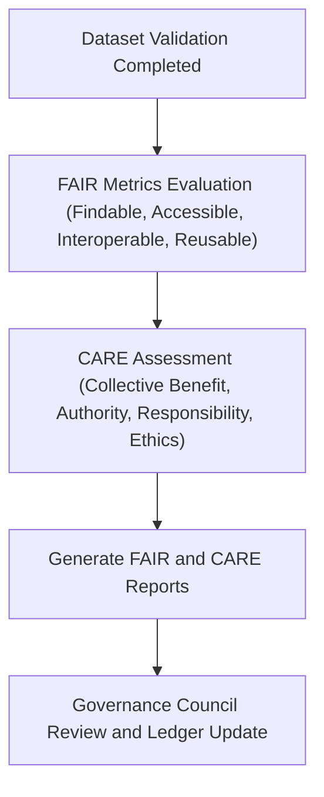

<div align="center">

# 🌍 Kansas Frontier Matrix — **FAIR+CARE Data Governance Reports**
`data/reports/fair/README.md`

**Purpose:** Documents FAIR+CARE evaluation reports, ethical audits, and compliance metrics for all Kansas Frontier Matrix (KFM) datasets.  
Tracks how data meets **Findable, Accessible, Interoperable, and Reusable** principles and **CARE** ethics standards for responsible stewardship.

[](../../../docs/standards/faircare-validation.md)
[](../../../LICENSE)
[](../../../docs/architecture/repo-focus.md)
[](../../../.github/workflows/stac-validate.yml)

</div>

---

## 📚 Overview

The `data/reports/fair/` directory contains all **FAIR+CARE validation outputs**, **ethical compliance assessments**, and **council reviews** for KFM datasets.  
These reports quantify the project’s commitment to **open data**, **ethical AI**, and **transparent data governance**.

Each file:
- Documents dataset compliance with FAIR+CARE standards.  
- Records metrics used for council review and governance dashboards.  
- Links validation outcomes to corresponding datasets, manifests, and audit ledgers.  
- Is generated automatically by `.github/workflows/faircare-validate.yml`.  

---

## 🗂️ Directory Layout

```plaintext
data/reports/fair/
├── README.md                        # This file — FAIR+CARE reporting overview
│
├── data_fair_summary.json           # FAIR assessment summary for all datasets
├── data_care_assessment.json        # CARE ethics and stewardship evaluation
├── faircare_scorecard.csv           # Quantitative scorecard for each dataset
└── ethics_review_summary.md         # Narrative review of ethical considerations
```

---

## ⚙️ FAIR+CARE Workflow



### Process Steps:
1. **FAIR Evaluation** — Automated checks for metadata completeness, schema compliance, and STAC discoverability.  
2. **CARE Assessment** — Manual and automated review of ethical, governance, and community-related factors.  
3. **Scorecard Generation** — Consolidated quantitative metrics written to `faircare_scorecard.csv`.  
4. **Governance Review** — Council validates findings, signs off, and updates `data/reports/audit/data_provenance_ledger.json`.

---

## 🧠 FAIR+CARE Evaluation Metrics

| Category | Metric | Description | Range | Source |
|-----------|---------|--------------|--------|---------|
| **FAIR** | `findable_score` | Metadata completeness and search indexing | 0–100 | `data_fair_summary.json` |
| **FAIR** | `accessible_score` | Openness and license compliance | 0–100 | `data_fair_summary.json` |
| **FAIR** | `interoperable_score` | Schema alignment and cross-dataset linkages | 0–100 | `data_fair_summary.json` |
| **FAIR** | `reusable_score` | Provenance and documentation quality | 0–100 | `data_fair_summary.json` |
| **CARE** | `collective_benefit_score` | Community and societal value | 0–100 | `data_care_assessment.json` |
| **CARE** | `authority_to_control_score` | Ownership and governance balance | 0–100 | `data_care_assessment.json` |
| **CARE** | `responsibility_score` | Accuracy and reliability oversight | 0–100 | `data_care_assessment.json` |
| **CARE** | `ethics_score` | Fairness, transparency, and bias avoidance | 0–100 | `data_care_assessment.json` |

All metrics are averaged into a **composite FAIR+CARE compliance index** and logged in the governance ledger.

---

## 📊 FAIR+CARE Scorecard Structure

```csv
dataset_id,findable,accessible,interoperable,reusable,collective_benefit,authority_to_control,responsibility,ethics,composite_score
hazards_v9.3.2,100,95,98,94,100,100,99,98,98.0
climate_v9.3.2,98,93,95,96,99,100,98,97,97.0
treaties_v9.2.1,100,100,100,100,100,100,100,100,100.0
```

> 💡 These results feed directly into Focus Mode metadata and FAIR+CARE visual dashboards.

---

## 🧩 Example — FAIR Metadata Summary (Excerpt)

```json
{
  "dataset": "hazards_v9.3.2",
  "findable_score": 100,
  "accessible_score": 95,
  "interoperable_score": 98,
  "reusable_score": 94,
  "total_fair": 97,
  "recommendations": [
    "Ensure persistent identifiers are resolvable via DOI.",
    "Add explicit provenance citation in STAC metadata."
  ]
}
```

---

## 🧭 CARE Ethical Review Example (Excerpt)

```json
{
  "dataset": "climate_v9.3.2",
  "collective_benefit_score": 100,
  "authority_to_control_score": 100,
  "responsibility_score": 99,
  "ethics_score": 98,
  "notes": "Dataset demonstrates exemplary adherence to CARE principles; all stakeholders acknowledged."
}
```

Each review is signed by governance council members and timestamped for inclusion in the official ledger.

---

## 🧩 Governance & Provenance Integration

All FAIR+CARE reports link to:
- `data/reports/audit/data_provenance_ledger.json` — Provenance and governance ledger  
- `data/reports/validation/stac_validation_report.json` — Schema and STAC validation reference  
- `releases/v9.3.2/manifest.zip` — Checksums and data signatures  
- `docs/standards/faircare-validation.md` — Evaluation rubric and methodology  

Governance validation workflows:
- `.github/workflows/faircare-validate.yml`  
- `.github/workflows/governance-ledger.yml`  

---

## 🧠 FAIR+CARE Council Oversight

The **FAIR+CARE Council** performs quarterly reviews of these reports to:
- Identify datasets that need ethical or metadata improvements.  
- Approve inclusion in public releases and STAC catalogs.  
- Issue ethical compliance certificates for qualifying datasets.  

Their reviews are documented in:
- `ethics_review_summary.md`  
- `audit/data_provenance_ledger.json`  

---

## 🧾 Version History

| Version | Date       | Author             | Summary |
|----------|------------|--------------------|----------|
| v9.3.2   | 2025-10-28 | @kfm-data-lab      | Added FAIR+CARE evaluation workflow, metrics table, and governance linkages. |
| v9.3.1   | 2025-10-27 | @bartytime4life    | Integrated FAIR+CARE reporting examples and scorecard schema. |
| v9.3.0   | 2025-10-26 | @kfm-architecture  | Established FAIR+CARE validation directory and reporting framework. |

---

<div align="center">

**Kansas Frontier Matrix** · *FAIR Data × CARE Ethics × Open Governance*  
[🔗 Repository](https://github.com/bartytime4life/Kansas-Frontier-Matrix) • [🧭 Docs Portal](../../../docs/) • [⚖️ Governance Ledger](../../../docs/standards/governance/)

</div>
