<div align="center">

# 🌍 **Kansas Frontier Matrix — FAIR+CARE Data Governance Reports**  
`data/reports/fair/README.md`

**Purpose:**  
Define the **central FAIR+CARE governance reporting layer** for all KFM datasets and models — documenting **FAIR (Findable, Accessible, Interoperable, Reusable)** and **CARE (Collective Benefit, Authority to Control, Responsibility, Ethics)** evaluations, ethics audits, and compliance metrics for KFM v11.

[]()  
[]()  
[]()  
[]()

</div>

---

## 📘 Overview

`data/reports/fair/` contains all **FAIR+CARE validation outputs**, **ethics assessments**, and **council reviews** for Kansas Frontier Matrix datasets and models.

These reports:

- Quantify how each dataset/model adheres to **FAIR** principles  
- Capture **CARE**-aligned ethical stewardship and community considerations  
- Drive **governance decisions**, certifications, and public-facing trust signals  
- Feed Focus Mode v3 and dashboards with **governance-aware metrics**

### 🔁 v11.0.0 Enhancements

- Upgraded to **KFM-MDP v11.0.0** (extended metadata + governance semantics)  
- **DCAT 3.0** alignment for all FAIR+CARE report outputs  
- **Focus Mode v3** integration (FAIR+CARE context indicators in narratives)  
- Telemetry v3: `records_processed`, `energy_wh`, `carbon_gco2e` per evaluation run  
- Unified scorecard schema used across domains (hazards, climate, treaties, etc.)

---

## 🗂️ Directory Layout

```plaintext
data/reports/fair/
├── README.md
├── data_fair_summary.json           # FAIR assessment summary (all datasets/models)
├── data_care_assessment.json        # CARE ethics & stewardship evaluation
├── faircare_scorecard.csv           # Quantitative FAIR+CARE scorecard per asset
└── ethics_review_summary.md         # Narrative ethics review & council decisions
````

---

## ⚙️ FAIR+CARE Workflow

```mermaid
flowchart TD
    D["Dataset/Model Validation Completed"] --> F["FAIR Evaluation (F · A · I · R)"]
    F --> C["CARE Assessment (Collective Benefit · Authority · Responsibility · Ethics)"]
    C --> R["Generate FAIR & CARE Reports (JSON/CSV/Markdown)"]
    R --> G["Governance Council Review + Audit Ledger Update"]
```



### Process Steps

1. **FAIR Evaluation**

   * Automated checks of metadata completeness, discoverability, schema conformance, STAC registration, DCAT descriptors.
   * Output: `data_fair_summary.json`

2. **CARE Assessment**

   * Combined manual/automated review of ethical considerations, community impact, Indigenous data sovereignty, and consent.
   * Output: `data_care_assessment.json`

3. **Scorecard Generation**

   * FAIR + CARE metrics consolidated into `faircare_scorecard.csv` with per-asset scores.

4. **Governance Review**

   * FAIR+CARE Council reviews results, issues decisions, and appends entries to:

     * `data/reports/audit/data_provenance_ledger.json`
     * `data/reports/audit/ai_*_ledger.json` (for model-related evaluations)

---

## 🧠 FAIR+CARE Evaluation Metrics

| Category | Metric                       | Description                                  | Range | Source File                 |
| -------- | ---------------------------- | -------------------------------------------- | ----- | --------------------------- |
| FAIR     | `findable_score`             | Metadata completeness & search indexing      | 0–100 | `data_fair_summary.json`    |
| FAIR     | `accessible_score`           | Openness, licensing, and access mechanisms   | 0–100 | `data_fair_summary.json`    |
| FAIR     | `interoperable_score`        | Standards use, schema alignment, cross-links | 0–100 | `data_fair_summary.json`    |
| FAIR     | `reusable_score`             | Provenance, documentation, licensing clarity | 0–100 | `data_fair_summary.json`    |
| CARE     | `collective_benefit_score`   | Community & societal value of data use       | 0–100 | `data_care_assessment.json` |
| CARE     | `authority_to_control_score` | Ownership, governance, and consent handling  | 0–100 | `data_care_assessment.json` |
| CARE     | `responsibility_score`       | Accuracy, reliability, and oversight         | 0–100 | `data_care_assessment.json` |
| CARE     | `ethics_score`               | Fairness, transparency, and bias avoidance   | 0–100 | `data_care_assessment.json` |

A composite **FAIR+CARE index** is computed and written into:

* `faircare_scorecard.csv`
* `data/reports/audit/data_provenance_ledger.json` (per asset)

---

## 📊 FAIR+CARE Scorecard (CSV Schema)

```csv
dataset_id,findable,accessible,interoperable,reusable,collective_benefit,authority_to_control,responsibility,ethics,composite_score
hazards_v11.0.0,100,97,99,96,100,100,99,98,98.6
climate_v11.0.0,99,95,97,96,99,100,98,97,97.6
treaties_v11.0.0,100,100,100,100,100,100,100,100,100.0
```

These values feed:

* **Focus Mode v3** governance overlays (e.g., badges in narratives)
* FAIR+CARE dashboards in KFM’s governance UI

---

## 🧭 FAIR & CARE Examples (v11 Excerpts)

**FAIR Metadata Summary**

```json
{
  "dataset": "hazards_v11.0.0",
  "findable_score": 100,
  "accessible_score": 97,
  "interoperable_score": 99,
  "reusable_score": 96,
  "total_fair": 98.0,
  "recommendations": [
    "Mint DOIs for the v11 hazards series.",
    "Add explicit citation examples in STAC and DCAT metadata."
  ]
}
```

**CARE Ethical Review**

```json
{
  "dataset": "treaties_v11.0.0",
  "collective_benefit_score": 100,
  "authority_to_control_score": 100,
  "responsibility_score": 100,
  "ethics_score": 100,
  "notes": "Dataset managed in partnership with relevant communities; CARE conditions clearly documented; strong example of Indigenous data governance."
}
```

---

## 🔗 Governance & Provenance Integration

FAIR+CARE reports are linked to:

* `data/reports/audit/data_provenance_ledger.json` — governance & provenance ledger
* `data/reports/validation/stac_validation_report.json` — STAC/schema validation results
* `releases/v11.0.0/manifest.zip` — checksums & signatures per dataset/model
* `docs/standards/faircare-validation.md` — FAIR+CARE rubric and methodology

Key workflows:

* `.github/workflows/faircare-validate.yml`
* `.github/workflows/governance-ledger.yml`

These integrations allow queries such as:

* “List all datasets with FAIR+CARE composite < 90 for remediation”
* “Show CARE notes for datasets used in Focus Mode v3 climate narratives”

---

## 🧠 Council Oversight

The **FAIR+CARE Council** performs **quarterly reviews** to:

* Identify datasets needing metadata, ethics, or consent improvements
* Approve datasets for inclusion in public STAC/DCAT catalogs
* Issue **FAIR+CARE Certificates** (virtual badges) to qualifying datasets/models
* Recommend governance changes where risks are detected

Review artifacts include:

* `ethics_review_summary.md` — narrative decisions and rationales
* Append-only entries in `data/reports/audit/data_provenance_ledger.json`

---

## 🕰️ Version History

| Version | Date       | Author          | Summary                                                                                                            |
| ------- | ---------- | --------------- | ------------------------------------------------------------------------------------------------------------------ |
| v11.0.0 | 2025-11-19 | Lead Programmer | KFM-MDP v11 upgrade; DCAT 3.0 alignment; Focus Mode v3 hooks; telemetry v3 metrics; refined FAIR+CARE index schema |
| v10.0.0 | 2025-11-09 | `@kfm-faircare` | Telemetry v2 bindings; Streaming STAC refs; Focus v2 scorecards & examples                                         |
| v9.7.0  | 2025-11-06 | `@kfm-faircare` | Telemetry/schema refs added; improved scorecard schema & examples; badges aligned                                  |
| v9.3.2  | 2025-10-28 | `@kfm-data-lab` | FAIR+CARE workflow, metrics table, and governance linkages established                                             |

---

<div align="center">

**Kansas Frontier Matrix — FAIR+CARE Reports Layer**
🌍 *FAIR Data × CARE Ethics × Open Governance*

[⬅️ Back to Reports Index](../README.md) ·
[📐 Data Architecture](../../ARCHITECTURE.md) ·
[⚖️ FAIR+CARE Standard](../../../docs/standards/faircare-validation.md)

</div>
