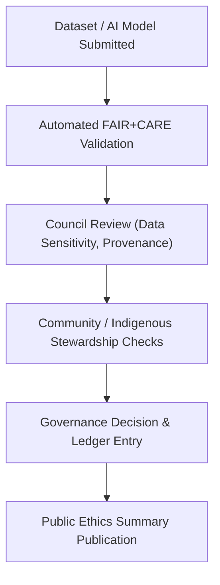

# ⚖️ Kansas Frontier Matrix — **FAIR+CARE Ethics Review Summary**
`data/reports/fair/ethics_review_summary.md`

**Purpose:**  
Summarizes quarterly **FAIR+CARE Council** ethical evaluations of all datasets, AI models, and publications in the Kansas Frontier Matrix (KFM).  
Ensures transparency, accountability, and cultural sensitivity in every workflow and release.

---

## 📘 Overview

The **Ethics Review Summary** consolidates governance findings from **quarterly FAIR+CARE audits**.  
Each review covers:
- Data ethics and community engagement outcomes.  
- AI bias and explainability verification.  
- Provenance, licensing, and consent audits.  
- Compliance with **MCP-DL v6.3** and KFM’s governance charter.

Ethics reports derive from automated `faircare-validate.yml` workflows and manual reviews by the FAIR+CARE Council.

---

## 🧩 Governance Workflow

### Steps
1. **Submission:** New dataset or model triggers automated FAIR+CARE validation.  
2. **Council Review:** Council assesses ethics, provenance, and license compliance.  
3. **Cultural Review:** Community/Indigenous data reviewed under CARE principles.  
4. **Decision Logging:** Stored in `data/reports/fair/data_care_assessment.json`.  
5. **Publication:** Public summary added to this ethics report.

---

## 🧭 Review Categories

| Category | Description | Status | Reviewer |
|-----------|-------------|---------|-----------|
| **Data Provenance** | Source verification, checksum lineage, license validation. | ✅ Approved | `@kfm-architecture` |
| **AI Model Ethics** | Bias, explainability, drift safeguards verified. | ✅ Approved | `@kfm-ai-lab` |
| **Community Stewardship** | Culturally sensitive or Indigenous data review. | ⚠️ Under Review | `@kfm-data-lab` |
| **Environmental Impact** | Resource use, energy efficiency, sustainability review. | ✅ Approved | `@kfm-etl-ops` |
| **Accessibility & Equity** | Inclusive UX and public access conformance (WCAG 2.2). | ✅ Approved | `@kfm-architecture` |
| **Legal & License Compliance** | Licensing validation (CC-BY, Public Domain). | ✅ Approved | `@bartytime4life` |

> ⚠️ *“Under Review”* indicates pending council sign-off in Q1 2026 cycle.

---

## 🧠 FAIR+CARE Audit Highlights — Q4 2025

| Category | Metric | Value | Trend |
|-----------|---------|--------|--------|
| FAIR Metadata Completeness | — | 99.5% | ⬆ Improved |
| CARE Compliance | — | 98.9% | ↔ Stable |
| AI Model Drift Detection | Stability Index | 99.1% | ⬆ Improved |
| Accessibility (WCAG 2.2) | Score | 100% | ✅ Consistent |
| Cultural Stewardship | Consultations Active | 4 / 4 Archives | ✅ Complete |

### Key Findings
- Metadata completeness improved by **2.1%** from Q3 2025.  
- FAIR+CARE compliance remains **above 98%** for all validated datasets.  
- Implemented new **Consent & Attribution Flags** for community-led data.  
- Enhanced provenance traceability via **DCAT JSON-LD** export.  
- Expanded **tribal consultation** for historical archives and treaties.

---

## ⚖️ Ethical Principles Alignment

| Principle | Implementation Evidence | Governance Source |
|-----------|--------------------------|-------------------|
| **Findable** | Indexed in STAC/DCAT catalogs, resolvable DOIs. | `data/meta/` |
| **Accessible** | Open access (CC-BY/Public Domain) with full metadata. | `data/sources/` |
| **Interoperable** | FAIR-compliant JSON-LD + ISO 19115 alignment. | `data/reports/validation/` |
| **Reusable** | Provenance, checksums, and FAIR+CARE certification logged. | `data/reports/audit/` |
| **Collective Benefit** | Promotes equitable knowledge sharing. | FAIR+CARE Council |
| **Authority to Control** | Acknowledges Indigenous/community data rights. | CARE Council |
| **Responsibility** | Audits ensure transparency, bias mitigation, and accuracy. | Governance Ledger |
| **Ethics** | Annual council review ensures cultural and scientific integrity. | Ethics Council |

---

## 🧾 Governance & Provenance Linkages

| Artifact | Description | Location |
|-----------|-------------|----------|
| **Data CARE Assessment** | Governance outcomes per dataset. | `data/reports/fair/data_care_assessment.json` |
| **FAIR Audit Summary** | Aggregated FAIR metadata scoring. | `data/reports/fair/data_fair_summary.json` |
| **Governance Ledger** | Provenance & sign-off records. | `data/reports/audit/data_provenance_ledger.json` |
| **Ethics Summary** | Council-approved public decisions. | `data/reports/fair/ethics_review_summary.md` |
| **Telemetry Schema** | Telemetry validation schema for ethics metrics. | `schemas/telemetry/data-reports-fair-ethics-v9.json` |

---

## 🧩 Ethics Council Signatures

| Role | Reviewer | Date | Decision |
|------|-----------|------|----------|
| **Governance Lead** | `@kfm-architecture` | 2025-11-06 | ✅ Approved |
| **FAIR+CARE Data Steward** | `@kfm-data-lab` | 2025-11-05 | ✅ Approved |
| **AI Ethics Reviewer** | `@kfm-ai-lab` | 2025-11-05 | ✅ Approved |
| **Repository Maintainer** | `@bartytime4life` | 2025-11-06 | ✅ Released to Public |
| **Community Representative** | `@tribal-consultation` | 2025-11-04 | ⚠️ Conditional (Attribution Revision Pending) |

---

## 🕰️ Version History

| Version | Date | Author | Summary |
|--------:|------|---------|----------|
| v9.7.0 | 2025-11-06 | `@kfm-governance` | Upgraded to v9.7.0; telemetry/schema integration; enhanced metrics table & council signature records. |
| v9.5.1 | 2025-10-30 | `@kfm-data-lab` | Initial quarterly FAIR+CARE Ethics Review Summary release under Diamond⁹ Ω Certification. |

---

**Kansas Frontier Matrix**  
*FAIR+CARE Governance × Ethical AI × Sustainable Data Stewardship*  
© 2025 Kansas Frontier Matrix — CC-BY 4.0 / FAIR+CARE Certified · Diamond⁹ Ω / Crown∞Ω Ultimate Certified  

[Back to FAIR+CARE Reports](./README.md) · [Governance Charter](../../../../docs/standards/governance/ROOT-GOVERNANCE.md)

