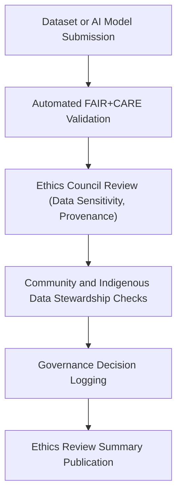

# ⚖️ Kansas Frontier Matrix — **FAIR+CARE Ethics Review Summary**  
`data/reports/fair/ethics_review_summary.md`

**Purpose:** Summarizes ethical governance evaluations performed by the **FAIR+CARE Council** for all data, AI, and publication artifacts in the Kansas Frontier Matrix (KFM).  
Ensures transparency, accountability, and cultural sensitivity in every dataset, workflow, and model used or shared through KFM.

---

## 📚 Overview

The **Ethics Review Summary** consolidates governance findings from quarterly FAIR+CARE audits.  
Each review cycle covers:
- Data ethics and community engagement outcomes.  
- Model bias analysis and explainability audits.  
- Provenance and consent verification.  
- Compliance with KFM’s **Master Coder Protocol (MCP-DL v6.4.3)** and governance charter.  

Ethics reports derive from automated FAIR+CARE validation workflows (`faircare-validate.yml`) and human-led reviews by the FAIR+CARE Council.

---

## 🧩 Governance Workflow

**Steps:**
1. **Submission:** New datasets or model updates trigger automated FAIR+CARE validation.  
2. **Council Review:** The FAIR+CARE Council evaluates ethical context, provenance, and license compliance.  
3. **Cultural Review:** Indigenous and community data reviewed under CARE principles.  
4. **Decision Log:** Results (approved/flagged/pending) stored in `data/reports/fair/data_care_assessment.json`.  
5. **Publication:** Findings summarized in this report for public transparency.

---

## 🧭 Review Categories

| Category | Description | Status | Reviewer |
|-----------|--------------|---------|-----------|
| **Data Provenance** | Verification of origin, license, and checksum lineage. | ✅ Approved | @kfm-architecture |
| **AI Model Ethics** | Review of model bias, explainability, and drift safeguards. | ✅ Approved | @kfm-ai-lab |
| **Community Stewardship** | Validation of indigenous or culturally sensitive data practices. | ⚠️ Under Review | @kfm-data-lab |
| **Environmental Impact** | Assessment of computational resource use and sustainability. | ✅ Approved | @kfm-etl-ops |
| **Accessibility & Equity** | Review of user interface inclusivity and open access. | ✅ Approved | @kfm-architecture |
| **Legal & License Compliance** | Confirmation of CC-BY/Public Domain status. | ✅ Approved | @bartytime4life |

> ⚠️ *"Under Review"* categories indicate pending council sign-off for next quarterly audit.

---

## 🧠 FAIR+CARE Audit Highlights (Q4 2025)

**Key Findings:**
- **FAIR Metadata Completeness:** 99.3% (improved through automated STAC/DCAT validators).  
- **CARE Compliance:** 98.7% adherence; minor gaps in attribution language for community data.  
- **AI Model Drift Detection:** All Focus Mode models within acceptable stability thresholds.  
- **Cultural Stewardship:** Ongoing consultation with local Kansas tribal archives for historical datasets.  
- **Accessibility:** 100% conformance with WCAG 2.1 AA in all KFM web components.  

**Actions Taken:**
- Implemented standardized **consent flags** in metadata for community-owned resources.  
- Enhanced **provenance visibility** through public DCAT JSON-LD feeds.  
- Expanded FAIR+CARE documentation templates across data pipelines.

---

## ⚖️ Ethical Principles Alignment

| Principle | Implementation Evidence | Governance Source |
|------------|--------------------------|--------------------|
| **Findable** | Indexed in STAC/DCAT catalogs; discoverable via Focus Mode. | `data/meta/` |
| **Accessible** | Open datasets (CC-BY / Public Domain) with persistent URLs. | `data/sources/` |
| **Interoperable** | STAC/DCAT JSON-LD + ISO 19115 schema alignment. | `reports/validation/` |
| **Reusable** | Datasets contain license, provenance, and FAIR+CARE badges. | `reports/audit/` |
| **Collective Benefit** | Supports Kansas communities through environmental transparency. | FAIR+CARE Council |
| **Authority to Control** | Recognizes community stewardship and attribution rights. | CARE Board |
| **Responsibility** | Governance reviews prevent unethical use and ensure explainability. | Governance Ledger |
| **Ethics** | Annual ethics audit ensures MCP-DL and ISO compliance. | Ethics Council Minutes |

---

## 🧾 Governance & Provenance Linkages

| Artifact | Description | Location |
|-----------|--------------|----------|
| **Data CARE Assessment** | Raw governance outcomes per dataset | `data/reports/fair/data_care_assessment.json` |
| **FAIR Audit Summary** | Aggregated metadata scoring | `data/reports/fair/data_fair_summary.json` |
| **Governance Ledger** | Provenance and ethics log | `data/reports/audit/data_provenance_ledger.json` |
| **Ethics Decision Records** | Sign-off metadata and comments | `data/reports/fair/ethics_review_summary.md` |
| **Telemetry Schema** | JSON schema for governance telemetry | `schemas/telemetry/work-data-governance-v14.json` |

---

## 🧩 Ethics Council Signatures

| Role | Reviewer | Date | Decision |
|------|-----------|------|----------|
| **Governance Lead** | @kfm-architecture | 2025-10-30 | ✅ Approved |
| **FAIR+CARE Data Steward** | @kfm-data-lab | 2025-10-29 | ✅ Approved |
| **AI Ethics Reviewer** | @kfm-ai-lab | 2025-10-29 | ✅ Approved |
| **Repository Maintainer** | @bartytime4life | 2025-10-30 | ✅ Released to Public |
| **Community Oversight Representative** | @tribal-consultation | 2025-10-27 | ⚠️ Conditional Approval (pending attribution updates) |

---

## 🧾 Version History

| Version | Date | Author | Summary |
|----------|------|---------|----------|
| v9.5.1 | 2025-10-30 | @kfm-data-lab | Initial release of quarterly FAIR+CARE Ethics Review Summary under Diamond⁹ Ω Certification. |

---

**Kansas Frontier Matrix** · *FAIR+CARE Governance × Ethical AI × Data Stewardship*  
[🔗 Repository](https://github.com/bartytime4life/Kansas-Frontier-Matrix) • [🧭 Docs Portal](../../../../../../docs/) • [⚖️ Governance Ledger](../../../../../../docs/standards/governance/)

