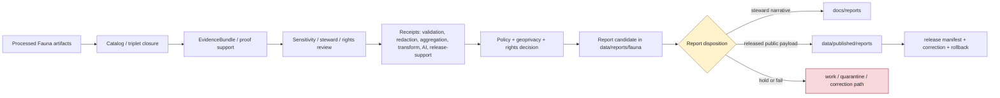

<!-- [KFM_META_BLOCK_V2]
doc_id: kfm://data/reports/fauna/readme
name: Fauna Reports README
path: data/reports/fauna/README.md
type: data-reports-fauna-readme
version: v0.1.0
status: draft
owners:
  - <data-steward>
  - <reports-steward>
  - <fauna-domain-steward>
  - <sensitivity-steward>
  - <geoprivacy-steward>
  - <rights-steward>
  - <evidence-steward>
  - <proof-steward>
  - <receipt-steward>
  - <catalog-steward>
  - <policy-steward>
  - <release-steward>
  - <docs-steward>
created: 2026-06-29
updated: 2026-06-29
policy_label: restricted-review
truth_posture: cite-or-abstain
responsibility_root: data/
domain: fauna
artifact_family: report-candidate-and-report-support-lane
path_posture: existing-greenfield-stub-replaced; parent-data-reports-readme-is-greenfield-stub; data-readme-lists-reports; directory-rules-data-tree-lists-data-published-reports-not-data-reports; compatibility-or-steward-facing-report-candidate-lane-until-parent-contract-or-adr-resolves
sensitivity_posture: no-public-path-by-default; fauna-sensitive-occurrence-default-t4-deny; exact-site-geometry-denied; nests-dens-roosts-hibernacula-spawning-sites-fail-closed; telemetry-and-movement-traces-denied; steward-controlled-records-denied-until-review; private-landowner-detail-denied; disease-and-mortality-sensitive-detail-reviewed; report-is-downstream-carrier-not-truth; evidence-aware; rights-aware; policy-aware; review-aware; release-blocked-until-gates-close
related:
  - ../README.md
  - ../../README.md
  - ../../processed/fauna/README.md
  - ../../catalog/domain/fauna/README.md
  - ../../registry/sources/fauna/README.md
  - ../../published/README.md
  - ../../published/reports/README.md
  - ../../published/fauna/README.md
  - ../../published/layers/fauna/README.md
  - ../../receipts/README.md
  - ../../proofs/
  - ../../../docs/reports/README.md
  - ../../../docs/domains/fauna/README.md
  - ../../../docs/adr/ADR-0010-deny-by-default-for-dna-rare-species-archaeology-infrastructure.md
  - ../../../docs/doctrine/directory-rules.md
  - ../../../contracts/domains/fauna/
  - ../../../schemas/contracts/v1/domains/fauna/
  - ../../../policy/domains/fauna/
  - ../../../policy/sensitivity/fauna/
  - ../../../policy/geoprivacy/
  - ../../../policy/rights/
  - ../../../release/
tags:
  - kfm
  - data
  - reports
  - fauna
  - wildlife
  - biodiversity
  - sensitive-species
  - report-candidate
  - report-support
  - downstream-carrier
  - sensitive-domain
  - deny-by-default
  - t4-deny
  - exact-location-denied
  - geoprivacy
  - redaction-receipt
  - aggregation-receipt
  - review-record
  - nests
  - dens
  - roosts
  - hibernacula
  - spawning-sites
  - telemetry
  - movement-traces
  - disease-observation
  - mortality-observation
  - evidence-first
  - cite-or-abstain
  - proof
  - receipts
  - catalog
  - release-gated
  - rollback
  - no-public-path
notes:
  - "This README replaces the greenfield stub at `data/reports/fauna/README.md`."
  - "The parent `data/reports/README.md` is currently a greenfield stub, so this file is self-bounding and intentionally conservative."
  - "Directory Rules v1.4 lists released report payloads under `data/published/reports/`; this existing `data/reports/fauna/` lane is therefore treated as compatibility, report-candidate, or steward-facing report-support material until parent contract or ADR review resolves the lane."
  - "Fauna reports are downstream carriers. They do not replace source records, processed data, catalog records, EvidenceBundles, proofs, receipts, source descriptors, sensitivity decisions, review records, policy decisions, release manifests, correction records, rollback records, or generated-answer receipts."
  - "Exact sensitive occurrence geometry, nests, dens, roosts, hibernacula, spawning sites, breeding/aggregation sites, telemetry traces, steward-only notes, private-landowner detail, and restricted wildlife-health detail must not be embedded here."
[/KFM_META_BLOCK_V2] -->

<a id="top"></a>

# Fauna Reports

Report-candidate and report-support lane for Fauna-domain generated report material that is not yet a released public report payload.

<p>
  
  
  
  
  
  
  
</p>

**Quick links:** [Scope](#scope) · [Path posture](#path-posture) · [Repo fit](#repo-fit) · [Report boundary](#report-boundary) · [Accepted material](#accepted-material) · [Exclusions](#exclusions) · [Fauna report guardrails](#fauna-report-guardrails) · [Report flow](#report-flow) · [Suggested directory shape](#suggested-directory-shape) · [Required checks](#required-checks-before-use) · [Status notes](#status-notes)

> [!CAUTION]
> `data/reports/fauna/` is not Fauna truth, not a public report lane, not proof, not receipt storage, not catalog closure, not release authority, not policy authority, not schema authority, not source registry authority, not sensitivity registry authority, not operational wildlife guidance, and not a direct public API/UI source. Treat it as an existing report-candidate or report-support lane until `data/reports/` receives an accepted parent contract or migration decision.

---

## Scope

`data/reports/fauna/` may hold Fauna-domain report candidates, generated report-support bundles, report-local indexes, preview summaries, and report assembly sidecars that are derived from governed upstream artifacts but are **not** themselves canonical trust artifacts.

This lane is useful only when a maintainer needs a data-root place to stage, inspect, or assemble Fauna report material before one of the following governed outcomes:

- a released public report payload under `data/published/reports/`;
- a generated steward-facing narrative under `docs/reports/`;
- a catalog/proof/release-linked report artifact referenced by a governed API or review console;
- a rejected, quarantined, corrected, superseded, withdrawn, or rolled-back report candidate.

Fauna report material may summarize taxonomic status, conservation status, public-safe occurrence context, generalized range context, seasonal range context, monitoring summaries, survey coverage, invasive-species context, mortality summaries, disease-observation summaries, public-safe habitat/context joins, geoprivacy posture, source-role posture, sensitivity posture, redaction/generalization posture, proof posture, catalog posture, release posture, correction posture, and rollback posture.

A report candidate does **not** make a taxon, legal status, occurrence, sensitive site, range, migration route, monitoring event, mortality event, disease observation, invasive species record, telemetry interpretation, public-safe geometry, conservation conclusion, or stewardship conclusion true. Consequential claims must remain supported by source descriptors, processed data, catalog records, EvidenceBundles, receipts, review records, policy decisions, release state, correction paths, and rollback targets.

---

## Path posture

The existing target lane is:

```text
data/reports/fauna/
```

The parent currently exists as a greenfield stub:

```text
data/reports/README.md
```

Current placement evidence is mixed:

- `data/README.md` lists `reports` as content that may belong under `data/`.
- `docs/doctrine/directory-rules.md` lists canonical data lifecycle and emitted-proof families, including `data/published/reports/`, but does not establish `data/reports/` as a lifecycle phase in the same way as `raw`, `work`, `quarantine`, `processed`, `catalog`, `triplets`, `published`, `receipts`, `proofs`, `rollback`, and `registry`.
- `data/published/reports/README.md` is the clearer released public report payload lane.
- `docs/reports/README.md` is the clearer generated steward-facing narrative lane.

Therefore this README treats `data/reports/fauna/` as **CONFIRMED path presence / NEEDS VERIFICATION topology**. Do not let this lane become a parallel report authority. If an ADR or parent README later makes `data/reports/` canonical, update this README and migrate child conventions with a rollback plan. If `data/reports/` is retired, migrate report candidates to the correct lifecycle, docs, or published lane.

---

## Repo fit

| Responsibility | Correct home | Boundary |
|---|---|---|
| Fauna report candidates and report-support bundles | `data/reports/fauna/` | Existing compatibility/steward-facing candidate lane until topology is resolved. |
| Parent reports lane | [`../README.md`](../README.md) | Currently greenfield; does not yet define a full report-family contract. |
| Data root | [`../../README.md`](../../README.md) | Lifecycle data and emitted proof root; reports listed but parent contract remains thin. |
| Processed Fauna artifacts | [`../../processed/fauna/README.md`](../../processed/fauna/README.md) | Normalized Fauna data upstream of catalog/report/public products. |
| Fauna domain catalog | [`../../catalog/domain/fauna/README.md`](../../catalog/domain/fauna/README.md) | Catalog closure and release-linked discovery records; not report narrative. |
| Fauna source registry | [`../../registry/sources/fauna/README.md`](../../registry/sources/fauna/README.md) | Source admission, rights, sensitivity, and source-role records; not report payloads. |
| Fauna receipts | `../../receipts/` and accepted domain receipt lanes | Process memory; reports may summarize receipts but must not store or replace them. |
| Proof and EvidenceBundle authority | `../../proofs/` | Evidence support and citation validation; reports cite these, not replace them. |
| Released public report payloads | [`../../published/reports/README.md`](../../published/reports/README.md) | Release-approved report payloads only. |
| Released Fauna domain carriers | [`../../published/fauna/README.md`](../../published/fauna/README.md) | Broader published Fauna artifact lane after release. |
| Released Fauna map carriers | [`../../published/layers/fauna/README.md`](../../published/layers/fauna/README.md) | Published public-safe map layer carriers; reports may reference them after release. |
| Steward-facing generated narratives | [`../../../docs/reports/README.md`](../../../docs/reports/README.md) | Human-readable generated review/release reports; not data payloads. |
| Fauna domain doctrine | [`../../../docs/domains/fauna/README.md`](../../../docs/domains/fauna/README.md) | Domain scope, sensitivity posture, source families, lifecycle, and publication posture. |
| Deny-by-default ADR | [`../../../docs/adr/ADR-0010-deny-by-default-for-dna-rare-species-archaeology-infrastructure.md`](../../../docs/adr/ADR-0010-deny-by-default-for-dna-rare-species-archaeology-infrastructure.md) | Cross-domain fail-closed policy posture for rare species and other high-risk classes. |
| Release decisions | `../../../release/` | ReleaseManifest, PromotionDecision, correction, rollback, withdrawal, and signatures. |
| Contracts, schemas, policy | `../../../contracts/domains/fauna/`, `../../../schemas/contracts/v1/domains/fauna/`, `../../../policy/domains/fauna/`, `../../../policy/sensitivity/fauna/` | Meaning, machine shape, and allow/deny/restrict/abstain logic. |

---

## Report boundary

| Rule | Handling |
|---|---|
| Report is a downstream carrier | It can summarize governed artifacts, but it is never root truth. |
| Candidate is not publication | A file here is not public just because it is readable, renderable, mapped, or useful for review. |
| Fauna reports default to restricted review | Treat report candidates as restricted-review until release evidence proves a safer posture. |
| Exact sensitive geometry is denied | Exact sensitive occurrences, nests, dens, roosts, hibernacula, spawning sites, telemetry traces, and steward-controlled sites must not be embedded here. |
| Public report payloads move through release | Released report payloads belong under `data/published/reports/` with release support. |
| Steward narratives belong under docs | Generated human-readable review/release narratives belong under `docs/reports/`. |
| Proof remains separate | EvidenceBundle, ProofPack, citation validation, and integrity proof stay in proof lanes. |
| Receipts remain separate | RunReceipt, ValidationReport, RedactionReceipt, AggregationReceipt, ReviewRecord, PolicyDecision, AIReceipt, and release-support receipts stay in receipt/proof lanes. |
| Catalog remains separate | Domain catalog, STAC, DCAT, and PROV records stay in `data/catalog/`. |
| Release remains separate | ReleaseManifest, PromotionDecision, CorrectionNotice, RollbackCard, WithdrawalNotice, and signatures stay in `release/`. |
| Policy remains separate | Geoprivacy, sensitivity, rights, access, source-role, review, and public-release rules stay in `policy/`. |
| AI is not report truth | Generated language must resolve to evidence or abstain; AI summaries require AIReceipt/runtime-envelope support when used in governed flows. |
| Public clients do not read this lane | Public UI/API/report surfaces consume governed APIs, released artifacts, catalog/proof-backed responses, and policy-safe envelopes. |

---

## Accepted material

Accepted material is limited to Fauna report-candidate and report-support files that do not become parallel trust artifacts:

- report-candidate Markdown, HTML, JSON, or PDF-generation source files that are explicitly unreleased and restricted-review;
- report-local indexes that point to processed, catalog, proof, receipt, source registry, sensitivity/review, release, and published artifacts without replacing them;
- report assembly sidecars, such as candidate table-of-contents, figure list, public-safe map snapshot index, citation draft index, evidence-reference draft index, caveat index, source-role index, sensitivity-dependency index, and review-dependency index;
- report-local caveat summaries, sensitivity summaries, redaction/generalization summaries, aggregation summaries, review summaries, source-role summaries, and release-readiness summaries that link to their canonical policy/proof/receipt/review inputs;
- preview artifacts for steward review, clearly marked as candidates and not public release payloads;
- correction, supersession, withdrawal, or rollback notes that point to canonical release/proof records rather than replacing them;
- README files explaining local report-candidate boundaries.

All accepted material must avoid embedding restricted detail. Use pointers, stable IDs, redacted identifiers, generalized summaries, public-safe geometry references, and governed references instead of precise sensitive geometry or sensitive narrative detail.

---

## Exclusions

| Do not place here | Correct home | Why |
|---|---|---|
| RAW source captures, occurrence downloads, source mirrors, API dumps, monitoring logs, source media, telemetry feeds, eDNA/acoustic raw outputs, disease surveillance data, mortality reports, or raw report inputs | `../../raw/fauna/` or restricted source lanes | Source-edge captures require source context, rights, sensitivity, and access controls. |
| WORK scratch, transform intermediates, unresolved report candidates, geoprivacy experiments, redaction-debug outputs, or unreviewed sensitive joins | `../../work/fauna/` or `../../quarantine/fauna/` | Candidate material that has not passed gates belongs upstream or in hold lanes. |
| Normalized Fauna datasets | `../../processed/fauna/` | Processed data is not a report. |
| Domain catalog, STAC, DCAT, PROV, or graph/triplet records | `../../catalog/`, `../../triplets/` | Catalog/graph carriers have their own closure rules. |
| EvidenceBundle, ProofPack, CitationValidationReport, validation report, or integrity bundles | `../../proofs/` | Proof is the trust spine; reports cite it. |
| RunReceipt, RedactionReceipt, AggregationReceipt, ValidationReceipt, TransformReceipt, ReviewRecord, PolicyDecision, AIReceipt, or release-support receipts | `../../receipts/` or accepted receipt/proof lanes | Receipts and review records are process memory and governance state; reports summarize them only. |
| SourceDescriptor, source activation records, sensitivity registry records, or rights registry records | `../../registry/` | Registry/control records belong in registry lanes. |
| ReleaseManifest, PromotionDecision, CorrectionNotice, RollbackCard, WithdrawalNotice, signatures, or release changelog | `../../../release/` | Release decisions are not report candidates. |
| Released public report payloads | `../../published/reports/` | Public report payloads must be release-approved. |
| Generated steward-facing narrative reports | `../../../docs/reports/` | Human-readable generated reports belong in docs. |
| Contracts, schemas, policy rules, validators, tests, code, or workflows | `../../../contracts/`, `../../../schemas/`, `../../../policy/`, `../../../tools/`, `../../../tests/`, `.github/workflows/` | Separate authority roots. |
| Exact sensitive occurrence coordinates, precise sensitive-site footprints, nest/den/roost/hibernacula/spawning detail, telemetry/movement traces, steward-only detail, private-landowner detail, or restricted species-location cues | Restricted governed lanes only; public-safe derivative only after policy/review/release | Report formatting must not become a sensitivity bypass. |
| Map screenshots, thumbnails, figure captions, graph edges, embeddings, AI text, or route/context descriptions that reverse-engineer sensitive locations | Restricted/held lanes only unless public-safe release support exists | Derived carriers can leak restricted detail even when raw coordinates are absent. |
| Operational wildlife-management instructions, enforcement guidance, collection guidance, or life-safety directions | Official authorities outside this report-candidate lane | KFM may provide evidence context, not operational authority. |
| Uncited AI summaries or generated authoritative claims | Governed answer/report generation flow with evidence, policy, and receipts | Generated language is evidence-subordinate. |

---

## Fauna report guardrails

| Risk | Guardrail |
|---|---|
| Exact-location disclosure | Coordinates, footprints, parcel-scale maps, high-resolution figures, screenshots, captions, and adjacent landmarks must not reveal sensitive occurrences or sites unless explicit public-safe release support exists. |
| Sensitive-site exposure | Nests, dens, roosts, hibernacula, spawning sites, breeding sites, aggregation sites, telemetry traces, and comparable records default to DENY for public report exposure. |
| Telemetry and movement-trace leakage | Movement paths, high-frequency fixes, stopover points, migration bottlenecks, denning/wintering locations, and timing clues require restricted handling unless generalized and reviewed. |
| Steward-controlled records | Partner, agency, tribal, rights-holder, or heritage-style records keep access and review conditions; report prose must not flatten them into public facts. |
| Private-landowner exposure | Private landowner, parcel, access, ownership-adjacent, or resident-adjacent detail fails closed unless policy and review explicitly allow a public-safe representation. |
| Disease or mortality overexposure | Wildlife disease, mortality, carcass, collection, pathogen, or surveillance detail may be sensitive and must preserve source role, privacy, biosafety, and public-communication boundaries. |
| Candidate/observed/legal-status overclaim | Aggregator records, observations, model outputs, legal status, conservation status, and expert-curated records retain their distinct source roles. |
| Habitat/context overclaim | Habitat, hydrology, soil, land cover, roads, settlements, and hazards context can support analysis but does not become Fauna truth. |
| Redaction-by-layout drift | Cropping, blur, zoom thresholds, figure styling, and vague captions are not substitutes for RedactionReceipt, policy decision, review state, and release review. |
| Report-as-proof drift | A report may make evidence easier to read; it does not become the evidence. |
| Report-as-release drift | A report may summarize release state; it does not approve release. |

---

## Report flow



> [!NOTE]
> The diagram is a responsibility map, not proof that generators, validators, payloads, manifests, review records, or CI wiring currently exist.

---

## Suggested directory shape

This shape is **PROPOSED** until `data/reports/` receives an accepted parent contract or migration decision. Do not pre-create empty stubs.

```text
data/reports/fauna/
├── README.md
├── candidates/                         # PROPOSED: unreleased restricted-review report candidates
│   └── <report_slug>/
│       ├── report.candidate.md
│       ├── report.inputs.index.json
│       ├── evidence_refs.candidate.json
│       ├── review_refs.candidate.json
│       ├── sensitivity_refs.candidate.json
│       ├── geoprivacy_refs.candidate.json
│       ├── source_role_refs.candidate.json
│       ├── citations.candidate.json
│       ├── caveats.candidate.md
│       └── README.md
├── previews/                           # PROPOSED: steward-only rendered previews
│   └── <report_slug>/
├── indexes/                            # PROPOSED: report-local candidate indexes
│   └── fauna.report-candidates.index.json
├── superseded/                         # PROPOSED: retained candidates with lineage
│   └── README.md
└── withdrawn/                          # PROPOSED: withdrawn or denied report candidates
    └── README.md
```

If a candidate is promoted as a public report payload, the released payload belongs under `data/published/reports/` and the release decision belongs under `release/`. If a generator emits steward-facing narrative, the generated report belongs under `docs/reports/`.

---

## Required checks before use

- [ ] Confirm whether `data/reports/` is an accepted report-candidate lane, a compatibility lane, or a migration target.
- [ ] Confirm whether `data/reports/fauna/` should hold candidates, indexes, previews, or should redirect to `docs/reports/` and `data/published/reports/`.
- [ ] Confirm CODEOWNERS for reports, Fauna, sensitivity, geoprivacy, rights, evidence, proof, receipts, catalog, policy, release, and docs review.
- [ ] Confirm every report claim resolves to catalog/proof/evidence or abstains.
- [ ] Confirm report candidates do not store canonical receipts, proofs, review records, release manifests, source descriptors, sensitivity registry records, policy rules, schemas, or processed datasets.
- [ ] Confirm exact sensitive occurrence geometry, sensitive-site detail, telemetry/movement traces, steward-only records, private-landowner detail, restricted disease/mortality detail, and reverse-engineerable derived cues are absent unless explicit public-safe release support exists.
- [ ] Confirm redaction/generalization, geoprivacy, audience tier, review, and public-safe representation posture for any public-facing Fauna report.
- [ ] Confirm observations, aggregator records, regulatory/legal status records, modeled ranges, candidate features, invasive records, mortality records, and disease observations are not framed beyond their source role.
- [ ] Confirm habitat, hydrology, soil, land-cover, hazard, road, settlement, people/land, and archaeology joins preserve owning-domain truth and sensitivity boundaries.
- [ ] Confirm AI-generated summaries have evidence references, citation validation, finite outcome, and AIReceipt/runtime envelope support where applicable.
- [ ] Confirm released report payloads are promoted to `data/published/reports/` only after ReleaseManifest, correction path, rollback target, digest, review state, and citation/evidence closure exist.
- [ ] Confirm generated steward-facing narratives belong in `docs/reports/` rather than this data lane.

---

## Status notes

| Item | Status | Notes |
|---|---:|---|
| Target path presence | CONFIRMED | This README replaces a greenfield stub at `data/reports/fauna/README.md`. |
| Parent reports README | CONFIRMED stub | `data/reports/README.md` exists but does not yet define a report-family contract. |
| Data root reports mention | CONFIRMED | `data/README.md` lists reports, but marks the root status `PROPOSED`. |
| Directory Rules data tree | CONFIRMED doctrine | Current Directory Rules list `data/published/reports/` and the canonical data lifecycle families; `data/reports/` remains topology-NEEDS VERIFICATION. |
| Published reports lane | CONFIRMED README | `data/published/reports/README.md` exists and is the clearer released report payload lane. |
| Docs reports lane | CONFIRMED README | `docs/reports/README.md` exists and is the clearer steward-facing generated narrative lane. |
| Fauna processed lane | CONFIRMED README | `data/processed/fauna/README.md` establishes PROCESSED-stage boundaries, restricted/public candidate split, and fail-closed posture. |
| Fauna catalog lane | CONFIRMED README | `data/catalog/domain/fauna/README.md` establishes catalog-stage boundaries, restricted/public split, transform pointers, and release-only exposure posture. |
| Fauna source registry | CONFIRMED README | `data/registry/sources/fauna/README.md` establishes source-admission, source-role, sensitivity, rights, and no-public-path posture. |
| Fauna published domain lane | CONFIRMED README | `data/published/fauna/README.md` establishes release-gated public-safe carrier posture. |
| Fauna published layers | CONFIRMED README | `data/published/layers/fauna/README.md` establishes release-gated public-safe layer-carrier posture and denies exact sensitive geometry. |
| Actual report payloads | UNKNOWN | This README does not prove report candidates or released reports exist. |
| Generator, validator, review, or CI enforcement | NEEDS VERIFICATION | No generator/validator/review tooling was proven by this edit. |
| Public release readiness | DENY until proven | Report existence here cannot publish Fauna claims. |

---

## Evidence ledger

| Source | Status | Supports | Limits |
|---|---|---|---|
| Previous target file | CONFIRMED | `data/reports/fauna/README.md` existed as a greenfield stub. | Did not define lane boundaries. |
| [`../README.md`](../README.md) | CONFIRMED stub | Parent `data/reports/` path exists. | Does not yet define report-family authority or canonical topology. |
| [`../../README.md`](../../README.md) | CONFIRMED | `data/` root lists reports among data-root content. | Parent status remains `PROPOSED`; not enough to define report lifecycle semantics. |
| [`../../processed/fauna/README.md`](../../processed/fauna/README.md) | CONFIRMED | Processed Fauna artifacts are upstream of catalog/reports/release and not public by default. | Does not prove report payloads or generators exist. |
| [`../../catalog/domain/fauna/README.md`](../../catalog/domain/fauna/README.md) | CONFIRMED | Fauna catalog lane, restricted/public split, transform pointers, evidence/source/policy/release refs. | Catalog records are not report payloads. |
| [`../../registry/sources/fauna/README.md`](../../registry/sources/fauna/README.md) | CONFIRMED | Source-admission boundary, source-role preservation, sensitivity/rights fail-closed posture, no-public-path posture. | Source registry records do not authorize publication or report release. |
| [`../../published/reports/README.md`](../../published/reports/README.md) | CONFIRMED | Released report payload lane under `data/published/`. | Does not create `data/reports/` authority. |
| [`../../published/fauna/README.md`](../../published/fauna/README.md) | CONFIRMED | Released public-safe Fauna carrier boundary and publication gates. | Does not prove report payloads or public report release. |
| [`../../published/layers/fauna/README.md`](../../published/layers/fauna/README.md) | CONFIRMED | Released public-safe Fauna map-carrier boundary, exact-sensitive-geometry denial, release checks. | Layer README does not prove report payloads or public report release. |
| [`../../../docs/reports/README.md`](../../../docs/reports/README.md) | CONFIRMED | Generated steward-facing report narrative lane. | Docs reports are not public report payloads or trust artifacts. |
| [`../../../docs/domains/fauna/README.md`](../../../docs/domains/fauna/README.md) | CONFIRMED doctrine / PROPOSED implementation | Fauna scope, sensitivity posture, source families, finite outcomes, geoprivacy, and publication posture. | Many implementation paths are explicitly PROPOSED/NEEDS VERIFICATION. |
| [`../../../docs/adr/ADR-0010-deny-by-default-for-dna-rare-species-archaeology-infrastructure.md`](../../../docs/adr/ADR-0010-deny-by-default-for-dna-rare-species-archaeology-infrastructure.md) | CONFIRMED draft ADR | Cross-domain fail-closed posture for rare species and other high-risk classes. | ADR status and numbering conflicts remain noted in the ADR itself. |
| [`../../../docs/doctrine/directory-rules.md`](../../../docs/doctrine/directory-rules.md) | CONFIRMED doctrine | Responsibility-root, lifecycle, domain-segment, published-reports, and release-vs-published separation. | `data/reports/` topology still needs parent contract or ADR review. |

[Back to top](#top)
