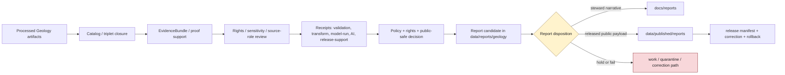

<!-- [KFM_META_BLOCK_V2]
doc_id: kfm://data/reports/geology/readme
name: Geology Reports README
path: data/reports/geology/README.md
type: data-reports-geology-readme
version: v0.1.0
status: draft
owners:
  - <data-steward>
  - <reports-steward>
  - <geology-domain-steward>
  - <natural-resources-steward>
  - <subsurface-data-steward>
  - <rights-steward>
  - <sensitivity-steward>
  - <evidence-steward>
  - <proof-steward>
  - <receipt-steward>
  - <catalog-steward>
  - <policy-steward>
  - <release-steward>
  - <docs-steward>
created: 2026-06-29
updated: 2026-06-29
policy_label: restricted-review
truth_posture: cite-or-abstain
responsibility_root: data/
domain: geology
artifact_family: report-candidate-and-report-support-lane
path_posture: existing-greenfield-stub-replaced; parent-data-reports-readme-is-greenfield-stub; data-readme-lists-reports; directory-rules-data-tree-lists-data-published-reports-not-data-reports; compatibility-or-steward-facing-report-candidate-lane-until-parent-contract-or-adr-resolves
sensitivity_posture: no-public-path-by-default; report-is-downstream-carrier-not-truth; anti-collapse-required; occurrence-deposit-estimate-permit-production-reserve-must-not-collapse; restricted-subsurface-details-fail-closed; exact-borehole-private-well-sample-sensitive-resource-locations-reviewed; rights-unclear-and-proprietary-data-held; not-mineral-rights-or-property-rights-advice; not-extraction-investment-or-engineering-advice; not-hazard-warning-or-life-safety-guidance; evidence-aware; rights-aware; policy-aware; release-blocked-until-gates-close
related:
  - ../README.md
  - ../../README.md
  - ../../raw/geology/README.md
  - ../../processed/geology/README.md
  - ../../catalog/domain/geology/README.md
  - ../../registry/sources/geology/README.md
  - ../../registry/sensitivity/geology/README.md
  - ../../published/README.md
  - ../../published/reports/README.md
  - ../../published/geology/README.md
  - ../../published/layers/geology/README.md
  - ../../receipts/README.md
  - ../../proofs/
  - ../../../docs/reports/README.md
  - ../../../docs/domains/geology/README.md
  - ../../../docs/domains/geology/DATA_LIFECYCLE.md
  - ../../../docs/domains/geology/SOURCE_REGISTRY.md
  - ../../../docs/domains/geology/SOURCE_ROLE_MATRIX.md
  - ../../../docs/domains/geology/POLICY.md
  - ../../../docs/domains/geology/SENSITIVITY.md
  - ../../../docs/domains/geology/PRESERVATION_MATRIX.md
  - ../../../docs/domains/geology/RELEASE_INDEX.md
  - ../../../docs/doctrine/directory-rules.md
  - ../../../contracts/domains/geology/
  - ../../../schemas/contracts/v1/domains/geology/
  - ../../../policy/domains/geology/
  - ../../../policy/sensitivity/geology/
  - ../../../policy/rights/
  - ../../../release/
tags:
  - kfm
  - data
  - reports
  - geology
  - natural-resources
  - report-candidate
  - report-support
  - downstream-carrier
  - evidence-first
  - cite-or-abstain
  - anti-collapse
  - source-role
  - stratigraphy
  - lithology
  - structures
  - subsurface
  - boreholes
  - well-logs
  - core-samples
  - geophysics
  - geochemistry
  - mineral-occurrence
  - resource-deposit
  - resource-estimate
  - extraction-context
  - reclamation-context
  - hydrostratigraphy
  - rights
  - sensitivity
  - restricted-subsurface
  - proof
  - receipts
  - catalog
  - release-gated
  - rollback
  - no-public-path
notes:
  - "This README replaces the greenfield stub at `data/reports/geology/README.md`."
  - "The parent `data/reports/README.md` is currently a greenfield stub, so this file is self-bounding and intentionally conservative."
  - "Directory Rules v1.4 lists released report payloads under `data/published/reports/`; this existing `data/reports/geology/` lane is therefore treated as compatibility, report-candidate, or steward-facing report-support material until parent contract or ADR review resolves the lane."
  - "Geology reports are downstream carriers. They do not replace source records, processed data, catalog records, EvidenceBundles, proofs, receipts, source descriptors, sensitivity decisions, policy decisions, release manifests, correction records, rollback records, or generated-answer receipts."
  - "Occurrence, deposit, estimate, permit, production, reserve, model, interpretation, borehole, well-log, sample, and aggregate records must remain distinct in report prose, figures, captions, tables, indexes, and metadata."
  - "Exact subsurface, private-well, sample, sensitive resource, proprietary, rights-unclear, operator/parcel, and security-adjacent details must not be embedded here."
[/KFM_META_BLOCK_V2] -->

<a id="top"></a>

# Geology Reports

Report-candidate and report-support lane for Geology and Natural Resources generated report material that is not yet a released public report payload.

<p>
  
  
  
  
  
  
  
</p>

**Quick links:** [Scope](#scope) · [Path posture](#path-posture) · [Repo fit](#repo-fit) · [Report boundary](#report-boundary) · [Accepted material](#accepted-material) · [Exclusions](#exclusions) · [Geology report guardrails](#geology-report-guardrails) · [Report flow](#report-flow) · [Suggested directory shape](#suggested-directory-shape) · [Required checks](#required-checks-before-use) · [Status notes](#status-notes)

> [!CAUTION]
> `data/reports/geology/` is not Geology truth, not a public report lane, not proof, not receipt storage, not catalog closure, not release authority, not policy authority, not schema authority, not source registry authority, not mineral-rights or property-rights evidence, not extraction advice, not reserve certification, not hazard warning, not engineering certification, not life-safety guidance, and not a direct public API/UI source. Treat it as an existing report-candidate or report-support lane until `data/reports/` receives an accepted parent contract or migration decision.

---

## Scope

`data/reports/geology/` may hold Geology-domain report candidates, generated report-support bundles, report-local indexes, preview summaries, and report assembly sidecars that are derived from governed upstream artifacts but are **not** themselves canonical trust artifacts.

This lane is useful only when a maintainer needs a data-root place to stage, inspect, or assemble Geology report material before one of the following governed outcomes:

- a released public report payload under `data/published/reports/`;
- a generated steward-facing narrative under `docs/reports/`;
- a catalog/proof/release-linked report artifact referenced by a governed API or review console;
- a rejected, quarantined, corrected, superseded, withdrawn, or rolled-back report candidate.

Geology report material may summarize geologic maps, surficial or bedrock units, lithology, stratigraphy, geologic age, faults and structures, geomorphology, borehole references, well-log references, core and sample references, geophysics, geochemistry, mineral occurrences, resource deposits, resource estimates, extraction context, production context, reclamation context, cross sections, hydrostratigraphy, source-role posture, sensitivity posture, rights posture, uncertainty posture, validation posture, proof posture, catalog posture, release posture, correction posture, and rollback posture.

A report candidate does **not** make a geologic unit, stratigraphic interval, lithology call, structure, fault, mineral occurrence, resource deposit, resource estimate, reserve, permit, production record, extraction site, reclamation record, borehole, well log, sample result, geophysical interpretation, geochemical interpretation, cross section, hydrostratigraphic unit, public-safe geometry, hazard conclusion, mineral-rights conclusion, property-rights conclusion, engineering conclusion, or extraction conclusion true. Consequential claims must remain supported by source descriptors, processed data, catalog records, EvidenceBundles, receipts, policy decisions, release state, correction paths, and rollback targets.

---

## Path posture

The existing target lane is:

```text
data/reports/geology/
```

The parent currently exists as a greenfield stub:

```text
data/reports/README.md
```

Current placement evidence is mixed:

- `data/README.md` lists `reports` as content that may belong under `data/`.
- `docs/doctrine/directory-rules.md` lists canonical data lifecycle and emitted-proof families, including `data/published/reports/`, but does not establish `data/reports/` as a lifecycle phase in the same way as `raw`, `work`, `quarantine`, `processed`, `catalog`, `triplets`, `published`, `receipts`, `proofs`, `rollback`, and `registry`.
- `data/published/reports/README.md` is the clearer released public report payload lane.
- `docs/reports/README.md` is the clearer generated steward-facing narrative lane.

Therefore this README treats `data/reports/geology/` as **CONFIRMED path presence / NEEDS VERIFICATION topology**. Do not let this lane become a parallel report authority. If an ADR or parent README later makes `data/reports/` canonical, update this README and migrate child conventions with a rollback plan. If `data/reports/` is retired, migrate report candidates to the correct lifecycle, docs, or published lane.

---

## Repo fit

| Responsibility | Correct home | Boundary |
|---|---|---|
| Geology report candidates and report-support bundles | `data/reports/geology/` | Existing compatibility/steward-facing candidate lane until topology is resolved. |
| Parent reports lane | [`../README.md`](../README.md) | Currently greenfield; does not yet define a full report-family contract. |
| Data root | [`../../README.md`](../../README.md) | Lifecycle data and emitted proof root; reports listed but parent contract remains thin. |
| Processed Geology artifacts | [`../../processed/geology/README.md`](../../processed/geology/README.md) | Normalized Geology data upstream of catalog/report/public products. |
| Geology domain catalog | [`../../catalog/domain/geology/README.md`](../../catalog/domain/geology/README.md) | Catalog closure and release-linked discovery records; not report narrative. |
| Geology source registry | [`../../registry/sources/geology/README.md`](../../registry/sources/geology/README.md) | Source admission, rights, sensitivity, and source-role records; not report payloads. |
| Geology sensitivity registry | [`../../registry/sensitivity/geology/README.md`](../../registry/sensitivity/geology/README.md) | Sensitivity-control state and release-readiness pointers; not report payloads. |
| Geology receipts | `../../receipts/` and accepted domain receipt lanes | Process memory; reports may summarize receipts but must not store or replace them. |
| Proof and EvidenceBundle authority | `../../proofs/` | Evidence support and citation validation; reports cite these, not replace them. |
| Released public report payloads | [`../../published/reports/README.md`](../../published/reports/README.md) | Release-approved report payloads only. |
| Released Geology domain carriers | [`../../published/geology/README.md`](../../published/geology/README.md) | Broader published Geology artifact lane after release. |
| Released Geology map carriers | [`../../published/layers/geology/README.md`](../../published/layers/geology/README.md) | Published public-safe map layer carriers; reports may reference them after release. |
| Steward-facing generated narratives | [`../../../docs/reports/README.md`](../../../docs/reports/README.md) | Human-readable generated review/release reports; not data payloads. |
| Geology domain doctrine | [`../../../docs/domains/geology/README.md`](../../../docs/domains/geology/README.md) | Domain scope, anti-collapse posture, source families, sensitivity, lifecycle, and publication posture. |
| Release decisions | `../../../release/` | ReleaseManifest, PromotionDecision, correction, rollback, withdrawal, and signatures. |
| Contracts, schemas, policy | `../../../contracts/domains/geology/`, `../../../schemas/contracts/v1/domains/geology/`, `../../../policy/domains/geology/`, `../../../policy/sensitivity/geology/` | Meaning, machine shape, and allow/deny/restrict/abstain logic. |

---

## Report boundary

| Rule | Handling |
|---|---|
| Report is a downstream carrier | It can summarize governed artifacts, but it is never root truth. |
| Candidate is not publication | A file here is not public just because it is readable, renderable, mapped, or useful for review. |
| Geology reports require anti-collapse | Occurrence, deposit, estimate, permit, production, reserve, model, interpretation, borehole, well-log, sample, and aggregate records must remain distinct. |
| Public report payloads move through release | Released report payloads belong under `data/published/reports/` with release support. |
| Steward narratives belong under docs | Generated human-readable review/release narratives belong under `docs/reports/`. |
| Proof remains separate | EvidenceBundle, ProofPack, citation validation, and integrity proof stay in proof lanes. |
| Receipts remain separate | RunReceipt, ValidationReport, TransformReceipt, ModelRunReceipt, ReviewRecord, PolicyDecision, AIReceipt, and release-support receipts stay in receipt/proof lanes. |
| Catalog remains separate | Domain catalog, STAC, DCAT, and PROV records stay in `data/catalog/`. |
| Release remains separate | ReleaseManifest, PromotionDecision, CorrectionNotice, RollbackCard, WithdrawalNotice, and signatures stay in `release/`. |
| Policy remains separate | Rights, sensitivity, subsurface-detail, private-well, resource-location, source-role, review, and public-release rules stay in `policy/`. |
| AI is not report truth | Generated language must resolve to evidence or abstain; AI summaries require AIReceipt/runtime-envelope support when used in governed flows. |
| Public clients do not read this lane | Public UI/API/report surfaces consume governed APIs, released artifacts, catalog/proof-backed responses, and policy-safe envelopes. |

---

## Accepted material

Accepted material is limited to Geology report-candidate and report-support files that do not become parallel trust artifacts:

- report-candidate Markdown, HTML, JSON, or PDF-generation source files that are explicitly unreleased;
- report-local indexes that point to processed, catalog, proof, receipt, source registry, sensitivity/review, release, and published artifacts without replacing them;
- report assembly sidecars, such as candidate table-of-contents, figure list, public-safe map snapshot index, cross-section figure index, citation draft index, evidence-reference draft index, caveat index, source-role index, rights index, sensitivity-dependency index, uncertainty index, and review-dependency index;
- report-local caveat summaries, sensitivity summaries, rights summaries, uncertainty summaries, scale/lineage summaries, source-role summaries, anti-collapse summaries, validation summaries, model-run summaries, and release-readiness summaries that link to their canonical policy/proof/receipt/review inputs;
- preview artifacts for steward review, clearly marked as candidates and not public release payloads;
- correction, supersession, withdrawal, or rollback notes that point to canonical release/proof records rather than replacing them;
- README files explaining local report-candidate boundaries.

All accepted material must avoid embedding restricted detail. Use pointers, stable IDs, redacted identifiers, generalized summaries, public-safe geometry references, and governed references instead of precise sensitive subsurface geometry, rights-unclear detail, proprietary detail, or sensitive narrative detail.

---

## Exclusions

| Do not place here | Correct home | Why |
|---|---|---|
| RAW source captures, geologic map packages, agency downloads, source rasters, file geodatabases, shapefiles, GeoParquet, COGs, LAS files, well logs, borehole tables, WWC5 records, KCC extracts, production tables, MRDS records, NGMDB/GeMS packages, geophysics/geochemistry files, source media, scans, or raw report inputs | `../../raw/geology/` or restricted source lanes | Source-edge captures require source context, rights, sensitivity, and access controls. |
| WORK scratch, transform intermediates, unresolved report candidates, geometry repair outputs, model experiments, interpretation drafts, redaction/generalization trials, or unreviewed sensitive joins | `../../work/geology/` or `../../quarantine/geology/` | Candidate material that has not passed gates belongs upstream or in hold lanes. |
| Normalized Geology datasets | `../../processed/geology/` | Processed data is not a report. |
| Domain catalog, STAC, DCAT, PROV, or graph/triplet records | `../../catalog/`, `../../triplets/` | Catalog/graph carriers have their own closure rules. |
| EvidenceBundle, ProofPack, CitationValidationReport, validation report, or integrity bundles | `../../proofs/` | Proof is the trust spine; reports cite it. |
| RunReceipt, ValidationReceipt, TransformReceipt, ModelRunReceipt, ReviewRecord, PolicyDecision, AIReceipt, or release-support receipts | `../../receipts/` or accepted receipt/proof lanes | Receipts and review records are process memory and governance state; reports summarize them only. |
| SourceDescriptor, source activation records, sensitivity registry records, rights registry records, or layer registry records | `../../registry/` | Registry/control records belong in registry lanes. |
| ReleaseManifest, PromotionDecision, CorrectionNotice, RollbackCard, WithdrawalNotice, signatures, or release changelog | `../../../release/` | Release decisions are not report candidates. |
| Released public report payloads | `../../published/reports/` | Public report payloads must be release-approved. |
| Generated steward-facing narrative reports | `../../../docs/reports/` | Human-readable generated reports belong in docs. |
| Contracts, schemas, policy rules, validators, tests, code, or workflows | `../../../contracts/`, `../../../schemas/`, `../../../policy/`, `../../../tools/`, `../../../tests/`, `.github/workflows/` | Separate authority roots. |
| Exact restricted subsurface detail, precise private-well locations, precise borehole/sample locations where sensitive, proprietary resource detail, rights-unclear log detail, operator/parcel-sensitive detail, or security-adjacent facility/dependency detail | Restricted governed lanes only; public-safe derivative only after policy/review/release | Report formatting must not become a sensitivity or rights bypass. |
| Map screenshots, cross-section figures, captions, graph edges, embeddings, AI text, or context descriptions that reverse-engineer restricted subsurface or resource-adjacent detail | Restricted/held lanes only unless public-safe release support exists | Derived carriers can leak restricted detail even when raw coordinates are absent. |
| Mineral-rights advice, property-rights conclusions, investment advice, reserve certification, engineering certification, extraction instruction, hazard warning, emergency guidance, or life-safety directions | Official authorities outside this report-candidate lane | KFM may provide evidence context, not legal, financial, engineering, extraction, or emergency authority. |
| Uncited AI summaries or generated authoritative claims | Governed answer/report generation flow with evidence, policy, and receipts | Generated language is evidence-subordinate. |

---

## Geology report guardrails

| Risk | Guardrail |
|---|---|
| Anti-collapse failure | Occurrence, deposit, estimate, permit, production, reserve, model, interpretation, borehole, well-log, sample, and aggregate claims must remain visibly distinct in prose, captions, tables, figures, indexes, and metadata. |
| Map polygon overclaim | Geologic map polygons, contacts, units, cross sections, and correlations are interpreted products with scale, edition, date, uncertainty, and source-role limits. |
| Permit/production/reserve confusion | A permit is not production; production is not reserve; reserve or resource estimate is not title, mineral-rights, extraction viability, or investment truth. |
| Model/observation collapse | Interpolations, inversions, resource surfaces, cross sections, AI summaries, and interpreted volumes must remain modeled/interpreted products unless evidence supports a narrower claim. |
| Aggregate/per-place collapse | County, basin, field, formation, or statewide rollups cannot be reported as individual observations or precise locations. |
| Restricted subsurface disclosure | Private wells, exact boreholes, well logs, samples, sensitive resource locations, proprietary data, and rights-limited detail fail closed until policy/review/release supports a public-safe representation. |
| Rights and proprietary leakage | Rights-unclear maps, logs, datasets, scans, reports, or proprietary resource materials cannot be normalized into report text, figures, or downloadable previews. |
| Hazard overclaim | Faults, subsidence, sinkhole, landslide, seismic, groundwater, or contamination context may support Hazards or Hydrology analysis, but this report lane does not issue warnings or life-safety guidance. |
| Cross-lane ownership confusion | Hydrology, Soil, Hazards, People/Land, Infrastructure, Agriculture, Archaeology, Flora, and Fauna keep their own truth and sensitivity boundaries. |
| Report-as-proof drift | A report may make evidence easier to read; it does not become the evidence. |
| Report-as-release drift | A report may summarize release state; it does not approve release. |

---

## Report flow



> [!NOTE]
> The diagram is a responsibility map, not proof that generators, validators, payloads, manifests, review records, or CI wiring currently exist.

---

## Suggested directory shape

This shape is **PROPOSED** until `data/reports/` receives an accepted parent contract or migration decision. Do not pre-create empty stubs.

```text
data/reports/geology/
├── README.md
├── candidates/                         # PROPOSED: unreleased report candidates
│   └── <report_slug>/
│       ├── report.candidate.md
│       ├── report.inputs.index.json
│       ├── evidence_refs.candidate.json
│       ├── source_role_refs.candidate.json
│       ├── rights_refs.candidate.json
│       ├── sensitivity_refs.candidate.json
│       ├── uncertainty_refs.candidate.json
│       ├── anti_collapse_refs.candidate.json
│       ├── citations.candidate.json
│       ├── caveats.candidate.md
│       └── README.md
├── previews/                           # PROPOSED: steward-only rendered previews
│   └── <report_slug>/
├── indexes/                            # PROPOSED: report-local candidate indexes
│   └── geology.report-candidates.index.json
├── superseded/                         # PROPOSED: retained candidates with lineage
│   └── README.md
└── withdrawn/                          # PROPOSED: withdrawn or denied report candidates
    └── README.md
```

If a candidate is promoted as a public report payload, the released payload belongs under `data/published/reports/` and the release decision belongs under `release/`. If a generator emits steward-facing narrative, the generated report belongs under `docs/reports/`.

---

## Required checks before use

- [ ] Confirm whether `data/reports/` is an accepted report-candidate lane, a compatibility lane, or a migration target.
- [ ] Confirm whether `data/reports/geology/` should hold candidates, indexes, previews, or should redirect to `docs/reports/` and `data/published/reports/`.
- [ ] Confirm CODEOWNERS for reports, Geology, natural resources, subsurface data, rights, sensitivity, evidence, proof, receipts, catalog, policy, release, and docs review.
- [ ] Confirm every report claim resolves to catalog/proof/evidence or abstains.
- [ ] Confirm report candidates do not store canonical receipts, proofs, review records, release manifests, source descriptors, sensitivity registry records, policy rules, schemas, or processed datasets.
- [ ] Confirm occurrence, deposit, estimate, permit, production, reserve, model, interpretation, borehole, well-log, sample, and aggregate claims remain separated in report prose, figures, captions, indexes, and metadata.
- [ ] Confirm exact restricted subsurface detail, private-well locations, sensitive borehole/sample locations, proprietary data, rights-unclear logs, operator/parcel-sensitive detail, and reverse-engineerable derived cues are absent unless explicit public-safe release support exists.
- [ ] Confirm source scale, compilation scale, map edition, interpretation version, time scope, geometry scope, uncertainty, rights, and caveats remain visible where material.
- [ ] Confirm geology reports do not become mineral-rights advice, property-rights conclusions, investment advice, reserve certification, engineering certification, extraction instruction, hazard warning, emergency guidance, or life-safety directions.
- [ ] Confirm Hydrology, Soil, Hazards, People/Land, Infrastructure, Agriculture, Archaeology, Flora, and Fauna joins preserve owning-domain truth and sensitivity boundaries.
- [ ] Confirm AI-generated summaries have evidence references, citation validation, finite outcome, and AIReceipt/runtime envelope support where applicable.
- [ ] Confirm released report payloads are promoted to `data/published/reports/` only after ReleaseManifest, correction path, rollback target, digest, review state, rights posture, and citation/evidence closure exist.
- [ ] Confirm generated steward-facing narratives belong in `docs/reports/` rather than this data lane.

---

## Status notes

| Item | Status | Notes |
|---|---:|---|
| Target path presence | CONFIRMED | This README replaces a greenfield stub at `data/reports/geology/README.md`. |
| Parent reports README | CONFIRMED stub | `data/reports/README.md` exists but does not yet define a report-family contract. |
| Data root reports mention | CONFIRMED | `data/README.md` lists reports, but marks the root status `PROPOSED`. |
| Directory Rules data tree | CONFIRMED doctrine | Current Directory Rules list `data/published/reports/` and the canonical data lifecycle families; `data/reports/` remains topology-NEEDS VERIFICATION. |
| Published reports lane | CONFIRMED README | `data/published/reports/README.md` exists and is the clearer released report payload lane. |
| Docs reports lane | CONFIRMED README | `docs/reports/README.md` exists and is the clearer steward-facing generated narrative lane. |
| Geology processed lane | CONFIRMED README | `data/processed/geology/README.md` establishes PROCESSED-stage boundaries, child-lane families, anti-collapse posture, and restricted-subsurface fail-closed posture. |
| Geology catalog lane | CONFIRMED README | `data/catalog/domain/geology/README.md` establishes catalog-stage boundaries, source-role discipline, and release-only exposure posture. |
| Geology source registry | CONFIRMED README | `data/registry/sources/geology/README.md` establishes source-admission, source-role, sensitivity, rights, and no-public-path posture. |
| Geology published domain lane | CONFIRMED README | `data/published/geology/README.md` establishes release-gated public-safe carrier posture. |
| Geology published layers | CONFIRMED README | `data/published/layers/geology/README.md` establishes release-gated public-safe layer-carrier posture. |
| Actual report payloads | UNKNOWN | This README does not prove report candidates or released reports exist. |
| Generator, validator, review, or CI enforcement | NEEDS VERIFICATION | No generator/validator/review tooling was proven by this edit. |
| Public release readiness | DENY until proven | Report existence here cannot publish Geology claims. |

---

## Evidence ledger

| Source | Status | Supports | Limits |
|---|---|---|---|
| Previous target file | CONFIRMED | `data/reports/geology/README.md` existed as a greenfield stub. | Did not define lane boundaries. |
| [`../README.md`](../README.md) | CONFIRMED stub | Parent `data/reports/` path exists. | Does not yet define report-family authority or canonical topology. |
| [`../../README.md`](../../README.md) | CONFIRMED | `data/` root lists reports among data-root content. | Parent status remains `PROPOSED`; not enough to define report lifecycle semantics. |
| [`../../processed/geology/README.md`](../../processed/geology/README.md) | CONFIRMED | Processed Geology artifacts are upstream of catalog/reports/release and not public by default. | Does not prove report payloads or generators exist. |
| [`../../catalog/domain/geology/README.md`](../../catalog/domain/geology/README.md) | CONFIRMED | Geology catalog lane, source-role guardrails, evidence/source/policy/release refs, and release-only exposure posture. | Catalog records are not report payloads. |
| [`../../registry/sources/geology/README.md`](../../registry/sources/geology/README.md) | CONFIRMED | Source-admission boundary, source-role preservation, restricted-subsurface fail-closed posture, no-public-path posture. | Source registry records do not authorize publication or report release. |
| [`../../published/reports/README.md`](../../published/reports/README.md) | CONFIRMED | Released report payload lane under `data/published/`. | Does not create `data/reports/` authority. |
| [`../../published/geology/README.md`](../../published/geology/README.md) | CONFIRMED | Released public-safe Geology carrier boundary and publication gates. | Does not prove report payloads or public report release. |
| [`../../published/layers/geology/README.md`](../../published/layers/geology/README.md) | CONFIRMED | Released public-safe Geology map-carrier boundary, layer release checks, and public-safe artifact posture. | Layer README does not prove report payloads or public report release. |
| [`../../../docs/reports/README.md`](../../../docs/reports/README.md) | CONFIRMED | Generated steward-facing report narrative lane. | Docs reports are not public report payloads or trust artifacts. |
| [`../../../docs/domains/geology/README.md`](../../../docs/domains/geology/README.md) | CONFIRMED doctrine / PROPOSED implementation | Geology scope, anti-collapse posture, source-role discipline, sensitivity posture, public trust path, and publication posture. | Many implementation paths are explicitly PROPOSED/NEEDS VERIFICATION. |
| [`../../../docs/doctrine/directory-rules.md`](../../../docs/doctrine/directory-rules.md) | CONFIRMED doctrine | Responsibility-root, lifecycle, domain-segment, published-reports, and release-vs-published separation. | `data/reports/` topology still needs parent contract or ADR review. |

[Back to top](#top)
