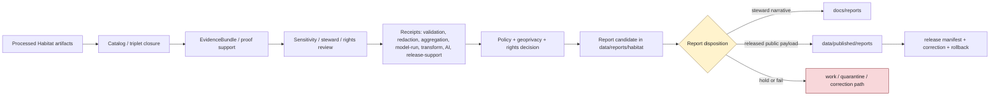

<!-- [KFM_META_BLOCK_V2]
doc_id: kfm://data/reports/habitat/readme
name: Habitat Reports README
path: data/reports/habitat/README.md
type: data-reports-habitat-readme
version: v0.1.0
status: draft
owners:
  - <data-steward>
  - <reports-steward>
  - <habitat-domain-steward>
  - <ecology-data-steward>
  - <land-cover-steward>
  - <restoration-context-steward>
  - <sensitivity-steward>
  - <geoprivacy-steward>
  - <rights-steward>
  - <evidence-steward>
  - <proof-steward>
  - <receipt-steward>
  - <catalog-steward>
  - <policy-steward>
  - <release-steward>
  - <docs-steward>
created: 2026-06-29
updated: 2026-06-29
policy_label: restricted-review
truth_posture: cite-or-abstain
responsibility_root: data/
domain: habitat
artifact_family: report-candidate-and-report-support-lane
path_posture: existing-greenfield-stub-replaced; parent-data-reports-readme-is-greenfield-stub; data-readme-lists-reports; directory-rules-data-tree-lists-data-published-reports-not-data-reports; compatibility-or-steward-facing-report-candidate-lane-until-parent-contract-or-adr-resolves
sensitivity_posture: no-public-path-by-default; report-is-downstream-carrier-not-truth; sensitive-ecology-fail-closed; rare-species-and-steward-controlled-joins-denied-until-review; exact-sensitive-habitat-geometry-reviewed; model-output-not-observation; suitability-not-occurrence; habitat-patch-not-critical-habitat-designation; connectivity-not-confirmed-movement; restoration-opportunity-not-prescription; land-cover-not-habitat-truth-by-itself; evidence-aware; rights-aware; policy-aware; review-aware; release-blocked-until-gates-close
related:
  - ../README.md
  - ../../README.md
  - ../../processed/habitat/README.md
  - ../../catalog/domain/habitat/README.md
  - ../../registry/sources/habitat/README.md
  - ../../published/README.md
  - ../../published/reports/README.md
  - ../../published/habitat/README.md
  - ../../published/layers/habitat/README.md
  - ../../receipts/README.md
  - ../../proofs/
  - ../../../docs/reports/README.md
  - ../../../docs/domains/habitat/README.md
  - ../../../docs/domains/habitat/DATA_LIFECYCLE.md
  - ../../../docs/domains/habitat/SOURCE_REGISTRY.md
  - ../../../docs/domains/habitat/SOURCE_FAMILIES.md
  - ../../../docs/domains/habitat/HABITAT_DOMAIN_MODEL.md
  - ../../../docs/domains/habitat/HABITAT_SOURCE_LEDGER.md
  - ../../../docs/domains/habitat/sublanes/ecoregions.md
  - ../../../docs/domains/habitat/sublanes/land_cover.md
  - ../../../docs/adr/ADR-0010-deny-by-default-for-dna-rare-species-archaeology-infrastructure.md
  - ../../../docs/doctrine/directory-rules.md
  - ../../../contracts/domains/habitat/
  - ../../../schemas/contracts/v1/domains/habitat/
  - ../../../policy/domains/habitat/
  - ../../../policy/sensitivity/habitat/
  - ../../../policy/geoprivacy/
  - ../../../policy/rights/
  - ../../../release/
tags:
  - kfm
  - data
  - reports
  - habitat
  - ecology
  - biodiversity
  - landscape-context
  - habitat-patch
  - land-cover
  - ecoregions
  - ecological-systems
  - suitability-model
  - connectivity
  - corridors
  - restoration-opportunity
  - stewardship-zones
  - uncertainty-surface
  - report-candidate
  - report-support
  - downstream-carrier
  - sensitive-ecology
  - geoprivacy
  - source-role
  - redaction-receipt
  - aggregation-receipt
  - model-run-receipt
  - review-record
  - evidence-first
  - cite-or-abstain
  - proof
  - receipts
  - catalog
  - release-gated
  - rollback
  - no-public-path
notes:
  - "This README replaces the greenfield stub at `data/reports/habitat/README.md`."
  - "The parent `data/reports/README.md` is currently a greenfield stub, so this file is self-bounding and intentionally conservative."
  - "Directory Rules v1.4 lists released report payloads under `data/published/reports/`; this existing `data/reports/habitat/` lane is therefore treated as compatibility, report-candidate, or steward-facing report-support material until parent contract or ADR review resolves the lane."
  - "Habitat reports are downstream carriers. They do not replace source records, processed data, catalog records, EvidenceBundles, proofs, receipts, source descriptors, sensitivity decisions, review records, policy decisions, release manifests, correction records, rollback records, or generated-answer receipts."
  - "Habitat owns landscape context, not species occurrence truth. Fauna owns animal occurrence truth; Flora owns plant/specimen/rare-plant truth; Soil, Hydrology, Agriculture, Hazards, Archaeology, Settlements/Infrastructure, Roads/Rail, and People/Land keep their own authority."
  - "Exact sensitive habitat geometry, rare-species habitat inference, steward-controlled ecological context, restoration-priority details, sensitive corridor context, private-landowner detail, and reverse-engineerable habitat/species joins must not be embedded here."
[/KFM_META_BLOCK_V2] -->

<a id="top"></a>

# Habitat Reports

Report-candidate and report-support lane for Habitat-domain generated report material that is not yet a released public report payload.

<p>
  
  
  
  
  
  
  
</p>

**Quick links:** [Scope](#scope) · [Path posture](#path-posture) · [Repo fit](#repo-fit) · [Report boundary](#report-boundary) · [Accepted material](#accepted-material) · [Exclusions](#exclusions) · [Habitat report guardrails](#habitat-report-guardrails) · [Report flow](#report-flow) · [Suggested directory shape](#suggested-directory-shape) · [Required checks](#required-checks-before-use) · [Status notes](#status-notes)

> [!CAUTION]
> `data/reports/habitat/` is not Habitat truth, not a public report lane, not proof, not receipt storage, not catalog closure, not release authority, not policy authority, not schema authority, not source registry authority, not a sensitivity registry, not species occurrence authority, not critical-habitat designation authority, not restoration prescription, not land-management instruction, not legal/ecological advice, and not a direct public API/UI source. Treat it as an existing report-candidate or report-support lane until `data/reports/` receives an accepted parent contract or migration decision.

---

## Scope

`data/reports/habitat/` may hold Habitat-domain report candidates, generated report-support bundles, report-local indexes, preview summaries, and report assembly sidecars that are derived from governed upstream artifacts but are **not** themselves canonical trust artifacts.

This lane is useful only when a maintainer needs a data-root place to stage, inspect, or assemble Habitat report material before one of the following governed outcomes:

- a released public report payload under `data/published/reports/`;
- a generated steward-facing narrative under `docs/reports/`;
- a catalog/proof/release-linked report artifact referenced by a governed API or review console;
- a rejected, quarantined, corrected, superseded, withdrawn, or rolled-back report candidate.

Habitat report material may summarize habitat patches, land-cover context, ecoregions, ecological systems, habitat-quality scores, suitability-model outputs, connectivity edges, corridor candidates, restoration-opportunity candidates, stewardship-zone context, uncertainty surfaces, public-safe context joins, source-role posture, sensitivity posture, redaction/generalization posture, proof posture, catalog posture, release posture, correction posture, and rollback posture.

A report candidate does **not** make a habitat patch, land-cover class, ecoregion, ecological-system class, suitability score, connectivity edge, corridor, restoration opportunity, stewardship zone, uncertainty surface, rare-species habitat inference, critical-habitat designation, public-safe geometry, conservation conclusion, management conclusion, or stewardship conclusion true. Consequential claims must remain supported by source descriptors, processed data, catalog records, EvidenceBundles, receipts, review records, policy decisions, release state, correction paths, and rollback targets.

---

## Path posture

The existing target lane is:

```text
data/reports/habitat/
```

The parent currently exists as a greenfield stub:

```text
data/reports/README.md
```

Current placement evidence is mixed:

- `data/README.md` lists `reports` as content that may belong under `data/`.
- `docs/doctrine/directory-rules.md` lists canonical data lifecycle and emitted-proof families, including `data/published/reports/`, but does not establish `data/reports/` as a lifecycle phase in the same way as `raw`, `work`, `quarantine`, `processed`, `catalog`, `triplets`, `published`, `receipts`, `proofs`, `rollback`, and `registry`.
- `data/published/reports/README.md` is the clearer released public report payload lane.
- `docs/reports/README.md` is the clearer generated steward-facing narrative lane.

Therefore this README treats `data/reports/habitat/` as **CONFIRMED path presence / NEEDS VERIFICATION topology**. Do not let this lane become a parallel report authority. If an ADR or parent README later makes `data/reports/` canonical, update this README and migrate child conventions with a rollback plan. If `data/reports/` is retired, migrate report candidates to the correct lifecycle, docs, or published lane.

---

## Repo fit

| Responsibility | Correct home | Boundary |
|---|---|---|
| Habitat report candidates and report-support bundles | `data/reports/habitat/` | Existing compatibility/steward-facing candidate lane until topology is resolved. |
| Parent reports lane | [`../README.md`](../README.md) | Currently greenfield; does not yet define a full report-family contract. |
| Data root | [`../../README.md`](../../README.md) | Lifecycle data and emitted proof root; reports listed but parent contract remains thin. |
| Processed Habitat artifacts | [`../../processed/habitat/README.md`](../../processed/habitat/README.md) | Normalized Habitat data upstream of catalog/report/public products. |
| Habitat domain catalog | [`../../catalog/domain/habitat/README.md`](../../catalog/domain/habitat/README.md) | Catalog closure and release-linked discovery records; not report narrative. |
| Habitat source registry | [`../../registry/sources/habitat/README.md`](../../registry/sources/habitat/README.md) | Source admission, rights, sensitivity, and source-role records; not report payloads. |
| Habitat receipts | `../../receipts/` and accepted domain receipt lanes | Process memory; reports may summarize receipts but must not store or replace them. |
| Proof and EvidenceBundle authority | `../../proofs/` | Evidence support and citation validation; reports cite these, not replace them. |
| Released public report payloads | [`../../published/reports/README.md`](../../published/reports/README.md) | Release-approved report payloads only. |
| Released Habitat domain carriers | [`../../published/habitat/README.md`](../../published/habitat/README.md) | Broader published Habitat artifact lane after release. |
| Released Habitat map carriers | [`../../published/layers/habitat/README.md`](../../published/layers/habitat/README.md) | Published public-safe map layer carriers; reports may reference them after release. |
| Steward-facing generated narratives | [`../../../docs/reports/README.md`](../../../docs/reports/README.md) | Human-readable generated review/release reports; not data payloads. |
| Habitat domain doctrine | [`../../../docs/domains/habitat/README.md`](../../../docs/domains/habitat/README.md) | Domain scope, source-role posture, cross-lane boundaries, sensitivity, lifecycle, and publication posture. |
| Deny-by-default ADR | [`../../../docs/adr/ADR-0010-deny-by-default-for-dna-rare-species-archaeology-infrastructure.md`](../../../docs/adr/ADR-0010-deny-by-default-for-dna-rare-species-archaeology-infrastructure.md) | Cross-domain fail-closed policy posture for rare species exact-location exposure and other high-risk classes. |
| Release decisions | `../../../release/` | ReleaseManifest, PromotionDecision, correction, rollback, withdrawal, and signatures. |
| Contracts, schemas, policy | `../../../contracts/domains/habitat/`, `../../../schemas/contracts/v1/domains/habitat/`, `../../../policy/domains/habitat/`, `../../../policy/sensitivity/habitat/` | Meaning, machine shape, and allow/deny/restrict/abstain logic. |

---

## Report boundary

| Rule | Handling |
|---|---|
| Report is a downstream carrier | It can summarize governed artifacts, but it is never root truth. |
| Candidate is not publication | A file here is not public just because it is readable, renderable, mapped, or useful for review. |
| Habitat owns landscape, not species | Species occurrence truth remains with Fauna; plant/specimen/rare-plant truth remains with Flora. |
| Suitability is not occurrence | Suitability surfaces, habitat-quality scores, corridors, and restoration opportunities do not prove species presence. |
| Habitat patch is not designation | A HabitatPatch, land-cover class, or ecological-system unit is not a critical-habitat designation unless a regulatory source and release state support that narrow claim. |
| Public report payloads move through release | Released report payloads belong under `data/published/reports/` with release support. |
| Steward narratives belong under docs | Generated human-readable review/release narratives belong under `docs/reports/`. |
| Proof remains separate | EvidenceBundle, ProofPack, citation validation, and integrity proof stay in proof lanes. |
| Receipts remain separate | RunReceipt, ValidationReport, RedactionReceipt, AggregationReceipt, ModelRunReceipt, ReviewRecord, PolicyDecision, AIReceipt, and release-support receipts stay in receipt/proof lanes. |
| Catalog remains separate | Domain catalog, STAC, DCAT, and PROV records stay in `data/catalog/`. |
| Release remains separate | ReleaseManifest, PromotionDecision, CorrectionNotice, RollbackCard, WithdrawalNotice, and signatures stay in `release/`. |
| Policy remains separate | Geoprivacy, sensitivity, rights, source-role, review, stewardship, and public-release rules stay in `policy/`. |
| AI is not report truth | Generated language must resolve to evidence or abstain; AI summaries require AIReceipt/runtime-envelope support when used in governed flows. |
| Public clients do not read this lane | Public UI/API/report surfaces consume governed APIs, released artifacts, catalog/proof-backed responses, and policy-safe envelopes. |

---

## Accepted material

Accepted material is limited to Habitat report-candidate and report-support files that do not become parallel trust artifacts:

- report-candidate Markdown, HTML, JSON, or PDF-generation source files that are explicitly unreleased and restricted-review;
- report-local indexes that point to processed, catalog, proof, receipt, source registry, sensitivity/review, release, and published artifacts without replacing them;
- report assembly sidecars, such as candidate table-of-contents, figure list, public-safe map snapshot index, citation draft index, evidence-reference draft index, caveat index, source-role index, sensitivity-dependency index, geoprivacy-reference index, uncertainty index, model-run index, and review-dependency index;
- report-local caveat summaries, sensitivity summaries, redaction/generalization summaries, aggregation summaries, model-run summaries, review summaries, source-role summaries, land-cover class summaries, uncertainty summaries, cross-lane dependency summaries, and release-readiness summaries that link to their canonical policy/proof/receipt/review inputs;
- preview artifacts for steward review, clearly marked as candidates and not public release payloads;
- correction, supersession, withdrawal, or rollback notes that point to canonical release/proof records rather than replacing them;
- README files explaining local report-candidate boundaries.

All accepted material must avoid embedding restricted detail. Use pointers, stable IDs, redacted identifiers, generalized summaries, public-safe geometry references, and governed references instead of precise sensitive habitat geometry, species-location inference, stewardship-restricted detail, or sensitive narrative detail.

---

## Exclusions

| Do not place here | Correct home | Why |
|---|---|---|
| RAW source captures, source rasters, source vectors, land-cover packages, ecological-system packages, ecoregion packages, field surveys, occurrence joins, remote-sensing scenes, model inputs, model outputs, API dumps, source mirrors, or raw report inputs | `../../raw/habitat/` or restricted source lanes | Source-edge captures require source context, rights, sensitivity, and access controls. |
| WORK scratch, transform intermediates, unresolved report candidates, model experiments, suitability tuning, connectivity experiments, redaction-debug outputs, or unreviewed sensitive joins | `../../work/habitat/` or `../../quarantine/habitat/` | Candidate material that has not passed gates belongs upstream or in hold lanes. |
| Normalized Habitat datasets | `../../processed/habitat/` | Processed data is not a report. |
| Domain catalog, STAC, DCAT, PROV, or graph/triplet records | `../../catalog/`, `../../triplets/` | Catalog/graph carriers have their own closure rules. |
| EvidenceBundle, ProofPack, CitationValidationReport, validation report, or integrity bundles | `../../proofs/` | Proof is the trust spine; reports cite it. |
| RunReceipt, RedactionReceipt, AggregationReceipt, ValidationReceipt, TransformReceipt, ModelRunReceipt, ReviewRecord, PolicyDecision, AIReceipt, or release-support receipts | `../../receipts/` or accepted receipt/proof lanes | Receipts and review records are process memory and governance state; reports summarize them only. |
| SourceDescriptor, source activation records, sensitivity registry records, rights registry records, or layer registry records | `../../registry/` | Registry/control records belong in registry lanes. |
| ReleaseManifest, PromotionDecision, CorrectionNotice, RollbackCard, WithdrawalNotice, signatures, or release changelog | `../../../release/` | Release decisions are not report candidates. |
| Released public report payloads | `../../published/reports/` | Public report payloads must be release-approved. |
| Generated steward-facing narrative reports | `../../../docs/reports/` | Human-readable generated reports belong in docs. |
| Contracts, schemas, policy rules, validators, tests, code, or workflows | `../../../contracts/`, `../../../schemas/`, `../../../policy/`, `../../../tools/`, `../../../tests/`, `.github/workflows/` | Separate authority roots. |
| Exact sensitive habitat geometry, rare-species habitat inference, nest/den/roost/spawning habitat clues, steward-controlled ecological context, restoration-priority detail, private-landowner detail, or restricted species-location cues | Restricted governed lanes only; public-safe derivative only after policy/review/release | Report formatting must not become a geoprivacy bypass. |
| Map screenshots, thumbnails, figure captions, graph edges, embeddings, AI text, or context descriptions that reverse-engineer sensitive species or habitat locations | Restricted/held lanes only unless public-safe release support exists | Derived carriers can leak restricted detail even when raw coordinates are absent. |
| Restoration prescriptions, land-management instructions, regulatory determinations, land-access directions, enforcement guidance, or life-safety directions | Official authorities outside this report-candidate lane | KFM may provide evidence context, not operational or legal authority. |
| Uncited AI summaries or generated authoritative claims | Governed answer/report generation flow with evidence, policy, and receipts | Generated language is evidence-subordinate. |

---

## Habitat report guardrails

| Risk | Guardrail |
|---|---|
| Species-location leakage through habitat context | Habitat reports must not allow rare/sensitive species locations to be inferred from habitat joins, suitability maps, corridor outputs, screenshots, captions, or narrow textual clues. |
| Suitability/occurrence collapse | Suitability, habitat quality, ecological-system, connectivity, and restoration-priority outputs remain modeled/context products; they do not prove species presence. |
| Critical-habitat overclaim | Regulatory critical habitat, wetland designations, stewardship boundaries, protected areas, and land-cover classes retain source role, issuing authority, date, scope, and limitations. |
| Land-cover/habitat collapse | Land-cover is contextual evidence; it does not become habitat quality, species use, crop truth, soil truth, hydrology truth, or regulatory truth by itself. |
| Connectivity/movement overclaim | Connectivity edges and corridor candidates do not prove actual movement, access, migration, legal corridor status, or management priority without evidence and review. |
| Restoration/management overclaim | Restoration-opportunity and stewardship-zone reports are candidates/context unless a reviewed authority supports a stronger claim; they are not prescriptions or compliance findings. |
| Steward-controlled data leakage | Partner, agency, tribal, rights-holder, heritage-style, conservation easement, or stewardship-controlled records keep access and review conditions. |
| Private-landowner exposure | Private landowner, parcel, access, ownership-adjacent, or resident-adjacent detail fails closed unless policy and review explicitly allow a public-safe representation. |
| Model/uncertainty flattening | Model run, input version, source role, class scheme, uncertainty, validation limits, and temporal scope must remain visible where material. |
| Cross-lane ownership confusion | Fauna, Flora, Soil, Hydrology, Agriculture, Hazards, Archaeology, Settlements/Infrastructure, Roads/Rail, and People/Land keep their own truth and sensitivity boundaries. |
| Redaction-by-layout drift | Cropping, blur, zoom thresholds, figure styling, and vague captions are not substitutes for RedactionReceipt, policy decision, review state, and release review. |
| Report-as-proof drift | A report may make evidence easier to read; it does not become the evidence. |
| Report-as-release drift | A report may summarize release state; it does not approve release. |

---

## Report flow



> [!NOTE]
> The diagram is a responsibility map, not proof that generators, validators, payloads, manifests, review records, or CI wiring currently exist.

---

## Suggested directory shape

This shape is **PROPOSED** until `data/reports/` receives an accepted parent contract or migration decision. Do not pre-create empty stubs.

```text
data/reports/habitat/
├── README.md
├── candidates/                         # PROPOSED: unreleased restricted-review report candidates
│   └── <report_slug>/
│       ├── report.candidate.md
│       ├── report.inputs.index.json
│       ├── evidence_refs.candidate.json
│       ├── review_refs.candidate.json
│       ├── sensitivity_refs.candidate.json
│       ├── geoprivacy_refs.candidate.json
│       ├── source_role_refs.candidate.json
│       ├── model_run_refs.candidate.json
│       ├── uncertainty_refs.candidate.json
│       ├── citations.candidate.json
│       ├── caveats.candidate.md
│       └── README.md
├── previews/                           # PROPOSED: steward-only rendered previews
│   └── <report_slug>/
├── indexes/                            # PROPOSED: report-local candidate indexes
│   └── habitat.report-candidates.index.json
├── superseded/                         # PROPOSED: retained candidates with lineage
│   └── README.md
└── withdrawn/                          # PROPOSED: withdrawn or denied report candidates
    └── README.md
```

If a candidate is promoted as a public report payload, the released payload belongs under `data/published/reports/` and the release decision belongs under `release/`. If a generator emits steward-facing narrative, the generated report belongs under `docs/reports/`.

---

## Required checks before use

- [ ] Confirm whether `data/reports/` is an accepted report-candidate lane, a compatibility lane, or a migration target.
- [ ] Confirm whether `data/reports/habitat/` should hold candidates, indexes, previews, or should redirect to `docs/reports/` and `data/published/reports/`.
- [ ] Confirm CODEOWNERS for reports, Habitat, ecology data, land cover, restoration context, sensitivity, geoprivacy, rights, evidence, proof, receipts, catalog, policy, release, and docs review.
- [ ] Confirm every report claim resolves to catalog/proof/evidence or abstains.
- [ ] Confirm report candidates do not store canonical receipts, proofs, review records, release manifests, source descriptors, sensitivity registry records, policy rules, schemas, or processed datasets.
- [ ] Confirm exact sensitive habitat geometry, rare-species habitat inference, steward-controlled records, private-landowner detail, restoration-priority detail, sensitive corridor context, and reverse-engineerable derived cues are absent unless explicit public-safe release support exists.
- [ ] Confirm redaction/generalization, geoprivacy, audience tier, review, and public-safe representation posture for any public-facing Habitat report.
- [ ] Confirm habitat patches, land-cover classes, ecoregions, ecological systems, suitability surfaces, connectivity edges, corridors, restoration opportunities, stewardship zones, and uncertainty surfaces are not framed beyond their source role.
- [ ] Confirm Fauna, Flora, Soil, Hydrology, Agriculture, Hazards, Archaeology, Settlements/Infrastructure, Roads/Rail, and People/Land joins preserve owning-domain truth and sensitivity boundaries.
- [ ] Confirm AI-generated summaries have evidence references, citation validation, finite outcome, and AIReceipt/runtime envelope support where applicable.
- [ ] Confirm released report payloads are promoted to `data/published/reports/` only after ReleaseManifest, correction path, rollback target, digest, review state, transform state, and citation/evidence closure exist.
- [ ] Confirm generated steward-facing narratives belong in `docs/reports/` rather than this data lane.

---

## Status notes

| Item | Status | Notes |
|---|---:|---|
| Target path presence | CONFIRMED | This README replaces a greenfield stub at `data/reports/habitat/README.md`. |
| Parent reports README | CONFIRMED stub | `data/reports/README.md` exists but does not yet define a report-family contract. |
| Data root reports mention | CONFIRMED | `data/README.md` lists reports, but marks the root status `PROPOSED`. |
| Directory Rules data tree | CONFIRMED doctrine | Current Directory Rules list `data/published/reports/` and the canonical data lifecycle families; `data/reports/` remains topology-NEEDS VERIFICATION. |
| Published reports lane | CONFIRMED README | `data/published/reports/README.md` exists and is the clearer released report payload lane. |
| Docs reports lane | CONFIRMED README | `docs/reports/README.md` exists and is the clearer steward-facing generated narrative lane. |
| Habitat domain doctrine | CONFIRMED README | `docs/domains/habitat/README.md` establishes Habitat as landscape context, not species occurrence truth, and identifies sensitive-redaction and source-role posture. |
| Habitat processed lane | CONFIRMED README | `data/processed/habitat/README.md` establishes PROCESSED-stage boundaries, object-family posture, cross-lane authority boundaries, and fail-closed sensitive joins. |
| Habitat catalog lane | CONFIRMED README | `data/catalog/domain/habitat/README.md` establishes catalog-stage boundaries, evidence/source/policy/release refs, and release-only exposure posture. |
| Habitat source registry | CONFIRMED README | `data/registry/sources/habitat/README.md` establishes source-admission, source-role, sensitivity, rights, and no-public-path posture. |
| Habitat published domain lane | CONFIRMED README | `data/published/habitat/README.md` establishes release-gated public-facing carrier posture. |
| Habitat published layers | CONFIRMED README | `data/published/layers/habitat/README.md` establishes release-gated public-safe layer-carrier posture and sensitive-join failure rules. |
| Habitat sensitivity registry README | UNKNOWN | `data/registry/sensitivity/habitat/README.md` was not found during this edit. |
| Actual report payloads | UNKNOWN | This README does not prove report candidates or released reports exist. |
| Generator, validator, review, or CI enforcement | NEEDS VERIFICATION | No generator/validator/review tooling was proven by this edit. |
| Public release readiness | DENY until proven | Report existence here cannot publish Habitat claims. |

---

## Evidence ledger

| Source | Status | Supports | Limits |
|---|---|---|---|
| Previous target file | CONFIRMED | `data/reports/habitat/README.md` existed as a greenfield stub. | Did not define lane boundaries. |
| [`../README.md`](../README.md) | CONFIRMED stub | Parent `data/reports/` path exists. | Does not yet define report-family authority or canonical topology. |
| [`../../README.md`](../../README.md) | CONFIRMED | `data/` root lists reports among data-root content. | Parent status remains `PROPOSED`; not enough to define report lifecycle semantics. |
| [`../../processed/habitat/README.md`](../../processed/habitat/README.md) | CONFIRMED | Processed Habitat artifacts are upstream of catalog/reports/release and not public by default. | Does not prove report payloads or generators exist. |
| [`../../catalog/domain/habitat/README.md`](../../catalog/domain/habitat/README.md) | CONFIRMED | Habitat catalog lane, evidence/source/policy/release refs, cross-lane guardrails, and release-only exposure posture. | Catalog records are not report payloads. |
| [`../../registry/sources/habitat/README.md`](../../registry/sources/habitat/README.md) | CONFIRMED | Source-admission boundary, source-role preservation, sensitive-join fail-closed posture, no-public-path posture. | Source registry records do not authorize publication or report release. |
| [`../../published/reports/README.md`](../../published/reports/README.md) | CONFIRMED | Released report payload lane under `data/published/`. | Does not create `data/reports/` authority. |
| [`../../published/habitat/README.md`](../../published/habitat/README.md) | CONFIRMED | Released public-facing Habitat carrier boundary and publication gates. | Does not prove report payloads or public report release. |
| [`../../published/layers/habitat/README.md`](../../published/layers/habitat/README.md) | CONFIRMED | Released public-safe Habitat map-carrier boundary, sensitive-join denial posture, model/context caveats, and release checks. | Layer README does not prove report payloads or public report release. |
| [`../../../docs/reports/README.md`](../../../docs/reports/README.md) | CONFIRMED | Generated steward-facing report narrative lane. | Docs reports are not public report payloads or trust artifacts. |
| [`../../../docs/domains/habitat/README.md`](../../../docs/domains/habitat/README.md) | CONFIRMED doctrine / PROPOSED implementation | Habitat scope, source-role discipline, landscape-not-species boundary, sensitivity posture, and publication posture. | Many implementation paths are explicitly PROPOSED/NEEDS VERIFICATION. |
| [`../../../docs/adr/ADR-0010-deny-by-default-for-dna-rare-species-archaeology-infrastructure.md`](../../../docs/adr/ADR-0010-deny-by-default-for-dna-rare-species-archaeology-infrastructure.md) | CONFIRMED draft ADR | Cross-domain fail-closed posture for rare species exact-location exposure and related high-risk classes. | ADR status and numbering conflicts remain noted in the ADR itself. |
| [`../../../docs/doctrine/directory-rules.md`](../../../docs/doctrine/directory-rules.md) | CONFIRMED doctrine | Responsibility-root, lifecycle, domain-segment, published-reports, and release-vs-published separation. | `data/reports/` topology still needs parent contract or ADR review. |

[Back to top](#top)
