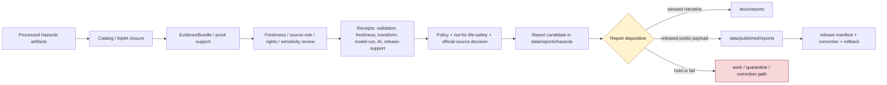

<!-- [KFM_META_BLOCK_V2]
doc_id: kfm://data/reports/hazards/readme
name: Hazards Reports README
path: data/reports/hazards/README.md
type: data-reports-hazards-readme
version: v0.1.0
status: draft
owners:
  - <data-steward>
  - <reports-steward>
  - <hazards-domain-steward>
  - <life-safety-boundary-steward>
  - <freshness-steward>
  - <source-role-steward>
  - <rights-steward>
  - <sensitivity-steward>
  - <evidence-steward>
  - <proof-steward>
  - <receipt-steward>
  - <catalog-steward>
  - <policy-steward>
  - <release-steward>
  - <docs-steward>
created: 2026-06-29
updated: 2026-06-29
policy_label: restricted-review
truth_posture: cite-or-abstain
responsibility_root: data/
domain: hazards
artifact_family: report-candidate-and-report-support-lane
path_posture: existing-greenfield-stub-replaced; parent-data-reports-readme-is-greenfield-stub; data-readme-lists-reports; directory-rules-data-tree-lists-data-published-reports-not-data-reports; compatibility-or-steward-facing-report-candidate-lane-until-parent-contract-or-adr-resolves
sensitivity_posture: no-public-path-by-default; report-is-downstream-carrier-not-truth; not-emergency-alerting; not-life-safety-guidance; not-current-warning-authority; not-official-advisory-authority; not-evacuation-routing-or-response-instruction; official-source-redirection-required; source-role-preserving; temporal-state-preserving; stale-state-required; warning-advisory-watch-context-only; regulatory-not-observed; detection-not-confirmation; model-not-observation; administrative-declaration-not-event-truth; sensitive-infrastructure-and-private-join-fail-closed; evidence-aware; rights-aware; policy-aware; release-blocked-until-gates-close
related:
  - ../README.md
  - ../../README.md
  - ../../raw/hazards/README.md
  - ../../work/hazards/README.md
  - ../../quarantine/hazards/README.md
  - ../../processed/hazards/README.md
  - ../../catalog/domain/hazards/README.md
  - ../../registry/sources/hazards/README.md
  - ../../published/README.md
  - ../../published/reports/README.md
  - ../../published/hazards/README.md
  - ../../published/layers/hazards/README.md
  - ../../receipts/README.md
  - ../../proofs/hazards/README.md
  - ../../proofs/validation_report/hazards/README.md
  - ../../../docs/reports/README.md
  - ../../../docs/domains/hazards/README.md
  - ../../../docs/domains/hazards/PUBLICATION_AND_BOUNDARY.md
  - ../../../docs/domains/hazards/LIFE_SAFETY_BOUNDARY.md
  - ../../../docs/domains/hazards/DATA_LIFECYCLE.md
  - ../../../docs/domains/hazards/SOURCE_REGISTRY.md
  - ../../../docs/domains/hazards/SOURCE_ROLE_MATRIX.md
  - ../../../docs/domains/hazards/PRESERVATION_MATRIX.md
  - ../../../docs/domains/hazards/VERIFICATION_BACKLOG.md
  - ../../../docs/doctrine/directory-rules.md
  - ../../../contracts/domains/hazards/
  - ../../../schemas/contracts/v1/domains/hazards/
  - ../../../policy/domains/hazards/
  - ../../../policy/release/hazards/
  - ../../../policy/sensitivity/hazards/
  - ../../../policy/rights/
  - ../../../release/
tags:
  - kfm
  - data
  - reports
  - hazards
  - hazard-event
  - hazard-observation
  - warning-context
  - advisory-context
  - disaster-declaration
  - flood-context
  - wildfire-detection
  - smoke-context
  - drought-indicator
  - earthquake-event
  - heat-cold-event
  - exposure-summary
  - resilience-summary
  - hazard-timeline
  - impact-area
  - report-candidate
  - report-support
  - downstream-carrier
  - not-emergency-alerting
  - not-life-safety-guidance
  - not-alert-authority
  - official-source-redirection
  - source-role
  - temporal-semantics
  - freshness
  - stale-state
  - evidence-first
  - cite-or-abstain
  - proof
  - receipts
  - catalog
  - release-gated
  - rollback
  - no-public-path
notes:
  - "This README replaces the greenfield stub at `data/reports/hazards/README.md`."
  - "The parent `data/reports/README.md` is currently a greenfield stub, so this file is self-bounding and intentionally conservative."
  - "Directory Rules v1.4 lists released report payloads under `data/published/reports/`; this existing `data/reports/hazards/` lane is therefore treated as compatibility, report-candidate, or steward-facing report-support material until parent contract or ADR review resolves the lane."
  - "Hazards reports are downstream carriers. They do not replace source records, processed data, catalog records, EvidenceBundles, proofs, receipts, source descriptors, sensitivity decisions, policy decisions, release manifests, correction records, rollback records, official warning/advisory sources, or generated-answer receipts."
  - "KFM Hazards is not an emergency alert system. Report candidates must not issue, update, imply, or restyle current warnings, watches, advisories, evacuation instructions, routing instructions, emergency response instructions, health/safety instructions, regulatory determinations, insurance determinations, engineering certifications, or official-source substitutions."
  - "Hazard event, observation, warning context, advisory context, declaration, regulatory context, remote-sensing detection, modeled derivative, exposure summary, resilience summary, and administrative records must remain distinct in report prose, tables, figures, captions, indexes, and metadata."
[/KFM_META_BLOCK_V2] -->

<a id="top"></a>

# Hazards Reports

Report-candidate and report-support lane for Hazards-domain generated report material that is not yet a released public report payload.

<p>
  
  
  
  
  
  
  
</p>

**Quick links:** [Scope](#scope) · [Path posture](#path-posture) · [Repo fit](#repo-fit) · [Report boundary](#report-boundary) · [Accepted material](#accepted-material) · [Exclusions](#exclusions) · [Hazards report guardrails](#hazards-report-guardrails) · [Report flow](#report-flow) · [Suggested directory shape](#suggested-directory-shape) · [Required checks](#required-checks-before-use) · [Status notes](#status-notes)

> [!CAUTION]
> `data/reports/hazards/` is not Hazards truth, not a public report lane, not emergency alerting, not a current-warning surface, not life-safety guidance, not proof, not receipt storage, not catalog closure, not release authority, not policy authority, not schema authority, not source registry authority, not a governed API, not an official-source substitute, and not a direct public UI/API source. Treat it as an existing report-candidate or report-support lane until `data/reports/` receives an accepted parent contract or migration decision.

---

## Scope

`data/reports/hazards/` may hold Hazards-domain report candidates, generated report-support bundles, report-local indexes, preview summaries, and report assembly sidecars that are derived from governed upstream artifacts but are **not** themselves canonical trust artifacts.

This lane is useful only when a maintainer needs a data-root place to stage, inspect, or assemble Hazards report material before one of the following governed outcomes:

- a released public report payload under `data/published/reports/`;
- a generated steward-facing narrative under `docs/reports/`;
- a catalog/proof/release-linked report artifact referenced by a governed API or review console;
- a rejected, quarantined, corrected, superseded, withdrawn, or rolled-back report candidate.

Hazards report material may summarize historical hazard events, hazard observations, warning/watch/advisory context, disaster declarations, flood context, wildfire detections, smoke context, drought indicators, earthquake events, heat/cold events, exposure summaries, resilience summaries, hazard timelines, impact areas, source-role posture, temporal/freshness posture, stale-state posture, official-source redirection posture, validation posture, proof posture, catalog posture, release posture, correction posture, and rollback posture.

A report candidate does **not** make a hazard event, observation, warning, advisory, watch, declaration, regulatory zone, flood context, wildfire detection, smoke plume, drought indicator, earthquake event, heat/cold event, exposure summary, impact area, resilience conclusion, current condition, public-safe geometry, emergency instruction, evacuation instruction, regulatory determination, insurance determination, engineering determination, or life-safety conclusion true. Consequential claims must remain supported by source descriptors, processed data, catalog records, EvidenceBundles, receipts, policy decisions, release state, correction paths, and rollback targets.

---

## Path posture

The existing target lane is:

```text
data/reports/hazards/
```

The parent currently exists as a greenfield stub:

```text
data/reports/README.md
```

Current placement evidence is mixed:

- `data/README.md` lists `reports` as content that may belong under `data/`.
- `docs/doctrine/directory-rules.md` lists canonical data lifecycle and emitted-proof families, including `data/published/reports/`, but does not establish `data/reports/` as a lifecycle phase in the same way as `raw`, `work`, `quarantine`, `processed`, `catalog`, `triplets`, `published`, `receipts`, `proofs`, `rollback`, and `registry`.
- `data/published/reports/README.md` is the clearer released public report payload lane.
- `docs/reports/README.md` is the clearer generated steward-facing narrative lane.

Therefore this README treats `data/reports/hazards/` as **CONFIRMED path presence / NEEDS VERIFICATION topology**. Do not let this lane become a parallel report authority. If an ADR or parent README later makes `data/reports/` canonical, update this README and migrate child conventions with a rollback plan. If `data/reports/` is retired, migrate report candidates to the correct lifecycle, docs, or published lane.

---

## Repo fit

| Responsibility | Correct home | Boundary |
|---|---|---|
| Hazards report candidates and report-support bundles | `data/reports/hazards/` | Existing compatibility/steward-facing candidate lane until topology is resolved. |
| Parent reports lane | [`../README.md`](../README.md) | Currently greenfield; does not yet define a full report-family contract. |
| Data root | [`../../README.md`](../../README.md) | Lifecycle data and emitted proof root; reports listed but parent contract remains thin. |
| Processed Hazards artifacts | [`../../processed/hazards/README.md`](../../processed/hazards/README.md) | Normalized Hazards data upstream of catalog/report/public products. |
| Hazards domain catalog | [`../../catalog/domain/hazards/README.md`](../../catalog/domain/hazards/README.md) | Catalog closure and release-linked discovery records; not report narrative. |
| Hazards source registry | [`../../registry/sources/hazards/README.md`](../../registry/sources/hazards/README.md) | Source admission, freshness, rights, sensitivity, and source-role records; not report payloads. |
| Hazards receipts | `../../receipts/` and accepted domain receipt lanes | Process memory; reports may summarize receipts but must not store or replace them. |
| Proof and EvidenceBundle authority | `../../proofs/` | Evidence support and citation validation; reports cite these, not replace them. |
| Released public report payloads | [`../../published/reports/README.md`](../../published/reports/README.md) | Release-approved report payloads only. |
| Released Hazards domain carriers | [`../../published/hazards/README.md`](../../published/hazards/README.md) | Broader published Hazards artifact lane after release. |
| Released Hazards map carriers | [`../../published/layers/hazards/README.md`](../../published/layers/hazards/README.md) | Published public-safe map layer carriers; reports may reference them after release. |
| Steward-facing generated narratives | [`../../../docs/reports/README.md`](../../../docs/reports/README.md) | Human-readable generated review/release reports; not data payloads. |
| Hazards domain doctrine | [`../../../docs/domains/hazards/README.md`](../../../docs/domains/hazards/README.md) | Domain scope, not-for-life-safety boundary, source-role discipline, and publication posture. |
| Hazards publication boundary | [`../../../docs/domains/hazards/PUBLICATION_AND_BOUNDARY.md`](../../../docs/domains/hazards/PUBLICATION_AND_BOUNDARY.md) | Doctrine-level boundary for what may be published and what KFM must never become. |
| Release decisions | `../../../release/` | ReleaseManifest, PromotionDecision, correction, rollback, withdrawal, and signatures. |
| Contracts, schemas, policy | `../../../contracts/domains/hazards/`, `../../../schemas/contracts/v1/domains/hazards/`, `../../../policy/domains/hazards/`, `../../../policy/release/hazards/`, `../../../policy/sensitivity/hazards/` | Meaning, machine shape, and allow/deny/restrict/abstain logic. |

---

## Report boundary

| Rule | Handling |
|---|---|
| Report is a downstream carrier | It can summarize governed artifacts, but it is never root truth. |
| Candidate is not publication | A file here is not public just because it is readable, renderable, mapped, current-looking, or useful for review. |
| Hazards reports are not alerts | Reports may describe evidence context; they must not issue emergency, evacuation, routing, response, health, life-safety, or operational instructions. |
| Official-source redirection is required | Warning, advisory, watch, declaration, current-condition, or emergency-management context must preserve issuing authority, issue/valid/expiry time, stale state, and official-source reference. |
| Public report payloads move through release | Released report payloads belong under `data/published/reports/` with release support. |
| Steward narratives belong under docs | Generated human-readable review/release narratives belong under `docs/reports/`. |
| Proof remains separate | EvidenceBundle, ProofPack, citation validation, and integrity proof stay in proof lanes. |
| Receipts remain separate | RunReceipt, ValidationReport, TransformReceipt, FreshnessReceipt, ModelRunReceipt, PolicyDecision, ReviewRecord, AIReceipt, and release-support receipts stay in receipt/proof lanes. |
| Catalog remains separate | Domain catalog, STAC, DCAT, and PROV records stay in `data/catalog/`. |
| Release remains separate | ReleaseManifest, PromotionDecision, CorrectionNotice, RollbackCard, WithdrawalNotice, and signatures stay in `release/`. |
| Policy remains separate | Rights, source-role, sensitivity, freshness, advisory, stale-state, infrastructure-join, and public-release rules stay in `policy/`. |
| AI is not report truth | Generated language must resolve to evidence or abstain; AI summaries require AIReceipt/runtime-envelope support when used in governed flows. |
| Public clients do not read this lane | Public UI/API/report surfaces consume governed APIs, released artifacts, catalog/proof-backed responses, official-source references, and policy-safe envelopes. |

---

## Accepted material

Accepted material is limited to Hazards report-candidate and report-support files that do not become parallel trust artifacts:

- report-candidate Markdown, HTML, JSON, or PDF-generation source files that are explicitly unreleased;
- report-local indexes that point to processed, catalog, proof, receipt, source registry, release, official-source, and published artifacts without replacing them;
- report assembly sidecars, such as candidate table-of-contents, figure list, public-safe map snapshot index, timeline index, citation draft index, evidence-reference draft index, caveat index, source-role index, freshness/stale-state index, official-source index, model-run index, sensitivity-dependency index, and review-dependency index;
- report-local caveat summaries, freshness summaries, warning/advisory expiry summaries, source-role summaries, source-family summaries, model-run summaries, official-source redirection summaries, validation summaries, sensitivity summaries, and release-readiness summaries that link to their canonical policy/proof/receipt inputs;
- preview artifacts for steward review, clearly marked as candidates and not public release payloads;
- correction, supersession, withdrawal, stale-state, or rollback notes that point to canonical release/proof records rather than replacing them;
- README files explaining local report-candidate boundaries.

All accepted material must preserve source role, hazard object family, method, units, time semantics, uncertainty, caveats, freshness, official-source boundaries, evidence refs, and release posture.

---

## Exclusions

| Do not place here | Correct home | Why |
|---|---|---|
| RAW source captures, agency-feed dumps, warning/watch/advisory captures, emergency-management feeds, model files, satellite rasters, remote-sensing detections, logs, uploaded files, source mirrors, or raw report inputs | `../../raw/hazards/` | Source-edge captures require immutable source context, rights, checksums, and admission metadata. |
| WORK scratch, transform intermediates, unresolved report candidates, failed validation material, expired-as-current tests, source-role-collapse tests, or unreviewed sensitive joins | `../../work/hazards/` or `../../quarantine/hazards/` | Candidate material that has not passed gates belongs upstream or in hold lanes. |
| Normalized Hazards datasets | `../../processed/hazards/` | Processed data is not a report. |
| Domain catalog, STAC, DCAT, PROV, or graph/triplet records | `../../catalog/`, `../../triplets/` | Catalog/graph carriers have their own closure rules. |
| EvidenceBundle, ProofPack, CitationValidationReport, validation report, or integrity bundles | `../../proofs/` | Proof is the trust spine; reports cite it. |
| RunReceipt, ValidationReceipt, TransformReceipt, FreshnessReceipt, ModelRunReceipt, PolicyDecision, ReviewRecord, AIReceipt, RepresentationReceipt, or release-support receipts | `../../receipts/` or accepted receipt/proof lanes | Receipts and review records are process memory and governance state; reports summarize them only. |
| SourceDescriptor, source activation records, rights registry records, source-family registry records, sensitivity registry records, or layer registry records | `../../registry/` | Registry/control records belong in registry lanes. |
| ReleaseManifest, PromotionDecision, CorrectionNotice, RollbackCard, WithdrawalNotice, signatures, or release changelog | `../../../release/` | Release decisions are not report candidates. |
| Released public report payloads | `../../published/reports/` | Public report payloads must be release-approved. |
| Generated steward-facing narrative reports | `../../../docs/reports/` | Human-readable generated reports belong in docs. |
| Contracts, schemas, policy rules, validators, tests, code, or workflows | `../../../contracts/`, `../../../schemas/`, `../../../policy/`, `../../../tools/`, `../../../tests/`, `.github/workflows/` | Separate authority roots. |
| Emergency alerts, evacuation advice, route safety advice, current operational warnings, health advice, emergency-response instructions, life-safety directives, regulatory determinations, insurance advice, engineering certification, or legal advice | Official authorities outside this lane | KFM Hazards is evidence/context, not an operational authority. |
| Uncited AI summaries or generated authoritative claims | Governed answer/report generation flow with evidence, policy, and receipts | Generated language is evidence-subordinate. |

---

## Hazards report guardrails

| Risk | Guardrail |
|---|---|
| Alert-authority drift | Report prose, titles, badges, map figures, captions, and summaries must not imply that KFM issues or updates warnings, watches, advisories, evacuation orders, routing guidance, or emergency instructions. |
| Expired-current confusion | Warning/watch/advisory material must carry issue time, valid time, expiry time, retrieval time, report generation time, release time, and stale-state posture where material. Expired context cannot be shown as live. |
| Source-role collapse | Historical events, observations, regulatory layers, operational context, administrative declarations, remote-sensing detections, modeled derivatives, exposure summaries, and resilience summaries must remain visibly distinct. |
| Regulatory/observed collapse | NFHL or other regulatory context is not observed inundation, forecast flood, damage observation, or emergency instruction. |
| Detection/confirmation collapse | FIRMS/HMS/remote-sensing detections, spotter reports, social-source candidates, or model signatures are not confirmed ground truth unless evidence and review support that narrow claim. |
| Model/observation collapse | Forecasts, susceptibility surfaces, smoke trajectories, drought indices, exposure models, and resilience scenarios must remain modeled/aggregate/context products with uncertainty and run identity. |
| Declaration/event collapse | FEMA/state/local declarations are administrative context; they do not prove event footprint, damage, casualty, or individual eligibility by themselves. |
| Cross-lane authority confusion | Hydrology, Atmosphere, Geology, Soil, Agriculture, Habitat, Flora, Fauna, Archaeology, Roads/Rail, Settlements/Infrastructure, and People/Land keep their own truth and sensitivity boundaries. |
| Sensitive exposure leakage | Critical infrastructure, private addresses, parcel/living-person context, transportation dependencies, facility condition, cultural sites, rare species, and private-property joins fail closed until policy and review allow public-safe representation. |
| Report-as-proof drift | A report may make evidence easier to read; it does not become the evidence. |
| Report-as-release drift | A report may summarize release state; it does not approve release. |

---

## Report flow



> [!NOTE]
> The diagram is a responsibility map, not proof that generators, validators, payloads, manifests, review records, or CI wiring currently exist.

---

## Suggested directory shape

This shape is **PROPOSED** until `data/reports/` receives an accepted parent contract or migration decision. Do not pre-create empty stubs.

```text
data/reports/hazards/
├── README.md
├── candidates/                         # PROPOSED: unreleased report candidates
│   └── <report_slug>/
│       ├── report.candidate.md
│       ├── report.inputs.index.json
│       ├── evidence_refs.candidate.json
│       ├── source_role_refs.candidate.json
│       ├── freshness_refs.candidate.json
│       ├── official_source_refs.candidate.json
│       ├── temporal_refs.candidate.json
│       ├── model_run_refs.candidate.json
│       ├── sensitivity_refs.candidate.json
│       ├── citations.candidate.json
│       ├── caveats.candidate.md
│       └── README.md
├── previews/                           # PROPOSED: steward-only rendered previews
│   └── <report_slug>/
├── indexes/                            # PROPOSED: report-local candidate indexes
│   └── hazards.report-candidates.index.json
├── superseded/                         # PROPOSED: retained candidates with lineage
│   └── README.md
└── withdrawn/                          # PROPOSED: withdrawn or denied report candidates
    └── README.md
```

If a candidate is promoted as a public report payload, the released payload belongs under `data/published/reports/` and the release decision belongs under `release/`. If a generator emits steward-facing narrative, the generated report belongs under `docs/reports/`.

---

## Required checks before use

- [ ] Confirm whether `data/reports/` is an accepted report-candidate lane, a compatibility lane, or a migration target.
- [ ] Confirm whether `data/reports/hazards/` should hold candidates, indexes, previews, or should redirect to `docs/reports/` and `data/published/reports/`.
- [ ] Confirm CODEOWNERS for reports, Hazards, life-safety boundary, freshness, source role, rights, sensitivity, evidence, proof, receipts, catalog, policy, release, and docs review.
- [ ] Confirm every report claim resolves to catalog/proof/evidence or abstains.
- [ ] Confirm report candidates do not store canonical receipts, proofs, review records, release manifests, source descriptors, policy rules, schemas, or processed datasets.
- [ ] Confirm report prose, titles, figures, captions, badges, summaries, indexes, and metadata cannot be mistaken for current alerts, warnings, evacuation guidance, routing guidance, emergency instructions, or official-source replacement.
- [ ] Confirm warning/watch/advisory context carries source, issuing authority, issue time, valid time, expiry time, retrieval time, report generation time, stale-state posture, and official-source reference where material.
- [ ] Confirm historical, regulatory, operational context, administrative, observation, detection, modeled, aggregate, candidate, and synthetic content are not collapsed in report prose, figures, captions, indexes, or metadata.
- [ ] Confirm sensitive infrastructure, private-address, route, facility, parcel, living-person, rare-species, archaeology, private-property, and security-adjacent joins fail closed until policy and review allow public-safe representation.
- [ ] Confirm Hydrology, Atmosphere, Geology, Soil, Agriculture, Habitat, Flora, Fauna, Archaeology, Roads/Rail, Settlements/Infrastructure, and People/Land joins preserve owning-domain truth and sensitivity boundaries.
- [ ] Confirm AI-generated summaries have evidence references, citation validation, finite outcome, and AIReceipt/runtime envelope support where applicable.
- [ ] Confirm released report payloads are promoted to `data/published/reports/` only after ReleaseManifest, correction path, rollback target, digest, freshness posture, official-source posture, and citation/evidence closure exist.
- [ ] Confirm generated steward-facing narratives belong in `docs/reports/` rather than this data lane.

---

## Status notes

| Item | Status | Notes |
|---|---:|---|
| Target path presence | CONFIRMED | This README replaces a greenfield stub at `data/reports/hazards/README.md`. |
| Parent reports README | CONFIRMED stub | `data/reports/README.md` exists but does not yet define a report-family contract. |
| Data root reports mention | CONFIRMED | `data/README.md` lists reports, but marks the root status `PROPOSED`. |
| Directory Rules data tree | CONFIRMED doctrine | Current Directory Rules list `data/published/reports/` and the canonical data lifecycle families; `data/reports/` remains topology-NEEDS VERIFICATION. |
| Published reports lane | CONFIRMED README | `data/published/reports/README.md` exists and is the clearer released report payload lane. |
| Docs reports lane | CONFIRMED README | `docs/reports/README.md` exists and is the clearer steward-facing generated narrative lane. |
| Hazards domain doctrine | CONFIRMED README | `docs/domains/hazards/README.md` establishes the not-for-life-safety boundary and domain scope. |
| Hazards publication boundary | CONFIRMED README | `docs/domains/hazards/PUBLICATION_AND_BOUNDARY.md` establishes publishable context and alert-authority denial posture. |
| Hazards processed lane | CONFIRMED README | `data/processed/hazards/README.md` establishes PROCESSED-stage boundaries, object-family posture, freshness posture, and not-for-life-safety boundary. |
| Hazards catalog lane | CONFIRMED README | `data/catalog/domain/hazards/README.md` establishes catalog-stage boundaries, knowledge-character separation, and release-only exposure posture. |
| Hazards source registry | CONFIRMED README | `data/registry/sources/hazards/README.md` establishes source-admission, source-role, freshness, sensitivity, rights, and no-public-path posture. |
| Hazards published domain lane | CONFIRMED README | `data/published/hazards/README.md` establishes release-gated public-facing carrier posture and denies emergency-alert use. |
| Hazards published layers | CONFIRMED README | `data/published/layers/hazards/README.md` establishes release-gated public-safe layer-carrier posture, official-source referral, and life-safety boundary rules. |
| Actual report payloads | UNKNOWN | This README does not prove report candidates or released reports exist. |
| Generator, validator, review, or CI enforcement | NEEDS VERIFICATION | No generator/validator/review tooling was proven by this edit. |
| Public release readiness | DENY until proven | Report existence here cannot publish Hazards claims. |

---

## Evidence ledger

| Source | Status | Supports | Limits |
|---|---|---|---|
| Previous target file | CONFIRMED | `data/reports/hazards/README.md` existed as a greenfield stub. | Did not define lane boundaries. |
| [`../README.md`](../README.md) | CONFIRMED stub | Parent `data/reports/` path exists. | Does not yet define report-family authority or canonical topology. |
| [`../../README.md`](../../README.md) | CONFIRMED | `data/` root lists reports among data-root content. | Parent status remains `PROPOSED`; not enough to define report lifecycle semantics. |
| [`../../processed/hazards/README.md`](../../processed/hazards/README.md) | CONFIRMED | Processed Hazards artifacts are upstream of catalog/reports/release and not public by default. | Does not prove report payloads or generators exist. |
| [`../../catalog/domain/hazards/README.md`](../../catalog/domain/hazards/README.md) | CONFIRMED | Hazards catalog lane, knowledge-character separation, evidence/source/policy/release refs, and release-only exposure posture. | Catalog records are not report payloads. |
| [`../../registry/sources/hazards/README.md`](../../registry/sources/hazards/README.md) | CONFIRMED | Source-admission boundary, source-role preservation, freshness posture, official-source warning, and no-public-path posture. | Source registry records do not authorize publication or report release. |
| [`../../published/reports/README.md`](../../published/reports/README.md) | CONFIRMED | Released report payload lane under `data/published/`. | Does not create `data/reports/` authority. |
| [`../../published/hazards/README.md`](../../published/hazards/README.md) | CONFIRMED | Released public-facing Hazards carrier boundary and publication gates. | Does not prove report payloads or public report release. |
| [`../../published/layers/hazards/README.md`](../../published/layers/hazards/README.md) | CONFIRMED | Released public-safe Hazards map-carrier boundary, official-source referral, source-role/temporal rules, and release checks. | Layer README does not prove report payloads or public report release. |
| [`../../../docs/reports/README.md`](../../../docs/reports/README.md) | CONFIRMED | Generated steward-facing report narrative lane. | Docs reports are not public report payloads or trust artifacts. |
| [`../../../docs/domains/hazards/README.md`](../../../docs/domains/hazards/README.md) | CONFIRMED doctrine / PROPOSED implementation | Hazards scope, not-for-life-safety boundary, source-role posture, object families, cross-lane boundaries, and publication posture. | Some implementation paths are explicitly PROPOSED/NEEDS VERIFICATION. |
| [`../../../docs/domains/hazards/PUBLICATION_AND_BOUNDARY.md`](../../../docs/domains/hazards/PUBLICATION_AND_BOUNDARY.md) | CONFIRMED doctrine / PROPOSED implementation | Publication boundary, allowed public context, not-alert-authority posture, official-source redirection, and promotion gates. | Does not prove runtime enforcement, actual releases, validators, or route behavior. |
| [`../../../docs/doctrine/directory-rules.md`](../../../docs/doctrine/directory-rules.md) | CONFIRMED doctrine | Responsibility-root, lifecycle, domain-segment, published-reports, and release-vs-published separation. | `data/reports/` topology still needs parent contract or ADR review. |

[Back to top](#top)
