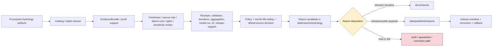

<!-- [KFM_META_BLOCK_V2]
doc_id: kfm://data/reports/hydrology/readme
name: Hydrology Reports README
path: data/reports/hydrology/README.md
type: data-reports-hydrology-readme
version: v0.1.0
status: draft
owners:
  - <data-steward>
  - <reports-steward>
  - <hydrology-domain-steward>
  - <watershed-huc-steward>
  - <gauge-observation-steward>
  - <source-role-steward>
  - <freshness-steward>
  - <rights-steward>
  - <sensitivity-steward>
  - <evidence-steward>
  - <proof-steward>
  - <receipt-steward>
  - <catalog-steward>
  - <policy-steward>
  - <release-steward>
  - <docs-steward>
created: 2026-06-29
updated: 2026-06-29
policy_label: restricted-review
truth_posture: cite-or-abstain
responsibility_root: data/
domain: hydrology
artifact_family: report-candidate-and-report-support-lane
path_posture: existing-greenfield-stub-replaced; parent-data-reports-readme-is-greenfield-stub; data-readme-lists-reports; directory-rules-data-tree-lists-data-published-reports-not-data-reports; compatibility-or-steward-facing-report-candidate-lane-until-parent-contract-or-adr-resolves
sensitivity_posture: no-public-path-by-default; report-is-downstream-carrier-not-truth; not-emergency-alerting; not-flood-warning; not-life-safety-guidance; not-regulatory-determination; not-water-rights-property-rights-or-engineering-advice; official-source-redirection-required; source-role-preserving; temporal-state-preserving; datum-and-units-required; stale-state-required; nfhl-regulatory-not-observed-flooding; model-output-not-observation; aggregate-not-per-place-truth; provisional-not-approved; private-well-owner-infrastructure-join-fail-closed; evidence-aware; rights-aware; policy-aware; release-blocked-until-gates-close
related:
  - ../README.md
  - ../../README.md
  - ../../raw/hydrology/README.md
  - ../../work/hydrology/README.md
  - ../../quarantine/hydrology/README.md
  - ../../processed/hydrology/README.md
  - ../../catalog/domain/hydrology/README.md
  - ../../registry/sources/hydrology/README.md
  - ../../receipts/hydrology/README.md
  - ../../proofs/hydrology/README.md
  - ../../proofs/validation_report/hydrology/README.md
  - ../../published/README.md
  - ../../published/reports/README.md
  - ../../published/hydrology/README.md
  - ../../published/layers/hydrology/README.md
  - ../../../docs/reports/README.md
  - ../../../docs/domains/hydrology/README.md
  - ../../../docs/domains/hydrology/PUBLICATION_POSTURE.md
  - ../../../docs/domains/hydrology/BOUNDARY.md
  - ../../../docs/domains/hydrology/DATA_LIFECYCLE.md
  - ../../../docs/domains/hydrology/SOURCE_REGISTRY.md
  - ../../../docs/domains/hydrology/SOURCE_FAMILIES.md
  - ../../../docs/domains/hydrology/SOURCE_ROLE_MATRIX.md
  - ../../../docs/domains/hydrology/IDENTITY_MODEL.md
  - ../../../docs/domains/hydrology/API_CONTRACTS.md
  - ../../../docs/adr/ADR-0009-hydrology-is-the-first-proof-bearing-lane.md
  - ../../../docs/doctrine/directory-rules.md
  - ../../../contracts/domains/hydrology/
  - ../../../schemas/contracts/v1/domains/hydrology/
  - ../../../policy/domains/hydrology/
  - ../../../policy/release/hydrology/
  - ../../../policy/sensitivity/hydrology/
  - ../../../policy/rights/
  - ../../../release/
tags:
  - kfm
  - data
  - reports
  - hydrology
  - watershed
  - huc
  - huc12
  - wbd
  - nhdplus
  - reach-identity
  - gauge-site
  - groundwater-well
  - flow-observation
  - water-level-observation
  - water-quality-observation
  - aquifer-observation
  - hydrograph
  - upstream-trace
  - nfhl
  - regulatory-context
  - observed-flood-evidence
  - drought-link
  - irrigation-link
  - water-use-link
  - report-candidate
  - report-support
  - downstream-carrier
  - source-role
  - temporal-semantics
  - datum
  - units
  - freshness
  - stale-state
  - official-source-redirection
  - not-emergency-alerting
  - not-flood-warning
  - not-life-safety-guidance
  - evidence-first
  - cite-or-abstain
  - proof
  - receipts
  - catalog
  - release-gated
  - rollback
  - no-public-path
notes:
  - "This README replaces the greenfield stub at `data/reports/hydrology/README.md`."
  - "The parent `data/reports/README.md` is currently a greenfield stub, so this file is self-bounding and intentionally conservative."
  - "Directory Rules v1.4 lists released report payloads under `data/published/reports/`; this existing `data/reports/hydrology/` lane is therefore treated as compatibility, report-candidate, or steward-facing report-support material until parent contract or ADR review resolves the lane."
  - "Hydrology reports are downstream carriers. They do not replace source records, processed data, catalog records, EvidenceBundles, proofs, receipts, source descriptors, sensitivity decisions, policy decisions, release manifests, correction records, rollback records, official warning/advisory sources, or generated-answer receipts."
  - "NFHL and comparable flood-hazard products must remain regulatory context only. They must not be restyled as observed flooding, forecast inundation, hydraulic-model truth, real-time flood status, or life-safety guidance."
  - "Watershed/HUC geography, reach identity, gauge metadata, observations, groundwater wells, water-quality readings, modeled hydrographs, upstream traces, aggregates, regulatory contexts, candidates, and generated summaries must remain distinct in report prose, tables, figures, captions, indexes, and metadata."
[/KFM_META_BLOCK_V2] -->

<a id="top"></a>

# Hydrology Reports

Report-candidate and report-support lane for Hydrology-domain generated report material that is not yet a released public report payload.

<p>
  
  
  
  
  
  
  
</p>

**Quick links:** [Scope](#scope) · [Path posture](#path-posture) · [Repo fit](#repo-fit) · [Report boundary](#report-boundary) · [Accepted material](#accepted-material) · [Exclusions](#exclusions) · [Hydrology report guardrails](#hydrology-report-guardrails) · [Report flow](#report-flow) · [Suggested directory shape](#suggested-directory-shape) · [Required checks](#required-checks-before-use) · [Status notes](#status-notes)

> [!CAUTION]
> `data/reports/hydrology/` is not Hydrology truth, not a public report lane, not emergency alerting, not a flood-warning surface, not life-safety guidance, not observed-flood authority, not regulatory determination, not water-rights or property-rights evidence, not engineering certification, not proof, not receipt storage, not catalog closure, not release authority, not policy authority, not schema authority, not source registry authority, not a governed API, not an official-source substitute, and not a direct public UI/API source. Treat it as an existing report-candidate or report-support lane until `data/reports/` receives an accepted parent contract or migration decision.

---

## Scope

`data/reports/hydrology/` may hold Hydrology-domain report candidates, generated report-support bundles, report-local indexes, preview summaries, and report assembly sidecars that are derived from governed upstream artifacts but are **not** themselves canonical trust artifacts.

This lane is useful only when a maintainer needs a data-root place to stage, inspect, or assemble Hydrology report material before one of the following governed outcomes:

- a released public report payload under `data/published/reports/`;
- a generated steward-facing narrative under `docs/reports/`;
- a catalog/proof/release-linked report artifact referenced by a governed API or review console;
- a rejected, quarantined, corrected, superseded, withdrawn, or rolled-back report candidate.

Hydrology report material may summarize watershed and HUC context, WBD source posture, hydrographic features, reach identity, gauge-site context, groundwater-well context, flow observations, stage or water-level observations, water-quality observations, aquifer observations, hydrographs, upstream/downstream traces, NFHL regulatory context, observed flood evidence, drought links, irrigation links, water-use links, source-role posture, datum/unit posture, temporal/freshness posture, stale-state posture, official-source redirection posture, validation posture, proof posture, catalog posture, release posture, correction posture, and rollback posture.

A report candidate does **not** make a watershed, HUC, hydro feature, reach identity, gauge site, observation, hydrograph, groundwater well, aquifer state, water-quality reading, NFHL zone, flood event, drought condition, irrigation link, water-use claim, upstream trace, public-safe geometry, current condition, regulatory determination, water-rights conclusion, property-rights conclusion, engineering conclusion, emergency instruction, evacuation instruction, or life-safety conclusion true. Consequential claims must remain supported by source descriptors, processed data, catalog records, EvidenceBundles, receipts, policy decisions, release state, correction paths, and rollback targets.

---

## Path posture

The existing target lane is:

```text
data/reports/hydrology/
```

The parent currently exists as a greenfield stub:

```text
data/reports/README.md
```

Current placement evidence is mixed:

- `data/README.md` lists `reports` as content that may belong under `data/`.
- `docs/doctrine/directory-rules.md` lists canonical data lifecycle and emitted-proof families, including `data/published/reports/`, but does not establish `data/reports/` as a lifecycle phase in the same way as `raw`, `work`, `quarantine`, `processed`, `catalog`, `triplets`, `published`, `receipts`, `proofs`, `rollback`, and `registry`.
- `data/published/reports/README.md` is the clearer released public report payload lane.
- `docs/reports/README.md` is the clearer generated steward-facing narrative lane.

Therefore this README treats `data/reports/hydrology/` as **CONFIRMED path presence / NEEDS VERIFICATION topology**. Do not let this lane become a parallel report authority. If an ADR or parent README later makes `data/reports/` canonical, update this README and migrate child conventions with a rollback plan. If `data/reports/` is retired, migrate report candidates to the correct lifecycle, docs, or published lane.

---

## Repo fit

| Responsibility | Correct home | Boundary |
|---|---|---|
| Hydrology report candidates and report-support bundles | `data/reports/hydrology/` | Existing compatibility/steward-facing candidate lane until topology is resolved. |
| Parent reports lane | [`../README.md`](../README.md) | Currently greenfield; does not yet define a full report-family contract. |
| Data root | [`../../README.md`](../../README.md) | Lifecycle data and emitted proof root; reports listed but parent contract remains thin. |
| Processed Hydrology artifacts | [`../../processed/hydrology/README.md`](../../processed/hydrology/README.md) | Normalized Hydrology data upstream of catalog/report/public products. |
| Hydrology domain catalog | [`../../catalog/domain/hydrology/README.md`](../../catalog/domain/hydrology/README.md) | Catalog closure and release-linked discovery records; not report narrative. |
| Hydrology source registry | [`../../registry/sources/hydrology/README.md`](../../registry/sources/hydrology/README.md) | Source admission, rights, freshness, datum/unit, sensitivity, and source-role records; not report payloads. |
| Hydrology receipts | [`../../receipts/hydrology/README.md`](../../receipts/hydrology/README.md) | Process memory; reports may summarize receipts but must not store or replace them. |
| Hydrology proofs | [`../../proofs/hydrology/README.md`](../../proofs/hydrology/README.md) | Evidence/proof support; reports cite these, not replace them. |
| Released public report payloads | [`../../published/reports/README.md`](../../published/reports/README.md) | Release-approved report payloads only. |
| Released Hydrology domain carriers | [`../../published/hydrology/README.md`](../../published/hydrology/README.md) | Broader published Hydrology artifact lane after release. |
| Released Hydrology map carriers | [`../../published/layers/hydrology/README.md`](../../published/layers/hydrology/README.md) | Published public-safe map layer carriers; reports may reference them after release. |
| Steward-facing generated narratives | [`../../../docs/reports/README.md`](../../../docs/reports/README.md) | Human-readable generated review/release reports; not data payloads. |
| Hydrology domain doctrine | [`../../../docs/domains/hydrology/README.md`](../../../docs/domains/hydrology/README.md) | Domain scope, source-role discipline, NFHL boundary, lifecycle, and publication posture. |
| Hydrology release decisions | `../../../release/` | ReleaseManifest, PromotionDecision, correction, rollback, withdrawal, and signatures. |
| Contracts, schemas, policy | `../../../contracts/domains/hydrology/`, `../../../schemas/contracts/v1/domains/hydrology/`, `../../../policy/domains/hydrology/`, `../../../policy/release/hydrology/`, `../../../policy/sensitivity/hydrology/` | Meaning, machine shape, and allow/deny/restrict/abstain logic. |

---

## Report boundary

| Rule | Handling |
|---|---|
| Report is a downstream carrier | It can summarize governed artifacts, but it is never root truth. |
| Candidate is not publication | A file here is not public just because it is readable, renderable, mapped, current-looking, or useful for review. |
| Hydrology reports are not warnings | Reports may describe evidence context; they must not issue flood warnings, evacuation guidance, routing guidance, response instructions, health guidance, life-safety guidance, dam-safety directives, or operational water-management instructions. |
| Official-source redirection is required | Warning, advisory, gauge, current-condition, regulatory, and emergency-management context must preserve issuing authority, issue/valid/effective time, retrieval time, stale state, and official-source reference where material. |
| Source roles do not collapse | Observed, regulatory, modeled, aggregate, administrative, candidate, and synthetic/context material must remain visibly distinct. |
| NFHL is regulatory context | NFHL and comparable regulatory flood-hazard products must not be presented as observed inundation, forecast flood, hydraulic-model output, or real-time flood status. |
| Public report payloads move through release | Released report payloads belong under `data/published/reports/` with release support. |
| Steward narratives belong under docs | Generated human-readable review/release narratives belong under `docs/reports/`. |
| Proof remains separate | EvidenceBundle, ProofPack, citation validation, and integrity proof stay in proof lanes. |
| Receipts remain separate | RunReceipt, ValidationReport, TransformReceipt, ModelRunReceipt, AggregationReceipt, PolicyDecision, ReviewRecord, AIReceipt, and release-support receipts stay in receipt/proof lanes. |
| Catalog remains separate | Domain catalog, STAC, DCAT, and PROV records stay in `data/catalog/`. |
| Release remains separate | ReleaseManifest, PromotionDecision, CorrectionNotice, RollbackCard, WithdrawalNotice, and signatures stay in `release/`. |
| Policy remains separate | Rights, source-role, sensitivity, freshness, advisory, stale-state, datum/unit, private-well, infrastructure-join, and public-release rules stay in `policy/`. |
| AI is not report truth | Generated language must resolve to evidence or abstain; AI summaries require AIReceipt/runtime-envelope support when used in governed flows. |
| Public clients do not read this lane | Public UI/API/report surfaces consume governed APIs, released artifacts, catalog/proof-backed responses, official-source references, and policy-safe envelopes. |

---

## Accepted material

Accepted material is limited to Hydrology report-candidate and report-support files that do not become parallel trust artifacts:

- report-candidate Markdown, HTML, JSON, or PDF-generation source files that are explicitly unreleased;
- report-local indexes that point to processed, catalog, proof, receipt, source registry, release, official-source, and published artifacts without replacing them;
- report assembly sidecars, such as candidate table-of-contents, figure list, public-safe map snapshot index, hydrograph chart index, timeline index, citation draft index, evidence-reference draft index, caveat index, source-role index, freshness/stale-state index, official-source index, datum/unit index, model-run index, sensitivity-dependency index, and review-dependency index;
- report-local caveat summaries, freshness summaries, source-role summaries, NFHL/regulatory-context summaries, observation summaries, model-run summaries, datum/unit summaries, official-source redirection summaries, validation summaries, sensitivity summaries, and release-readiness summaries that link to their canonical policy/proof/receipt inputs;
- preview artifacts for steward review, clearly marked as candidates and not public release payloads;
- correction, supersession, withdrawal, stale-state, or rollback notes that point to canonical release/proof records rather than replacing them;
- README files explaining local report-candidate boundaries.

All accepted material must preserve source role, hydrology object family, method, units, datum, time semantics, uncertainty, caveats, freshness, official-source boundaries, evidence refs, and release posture.

---

## Exclusions

| Do not place here | Correct home | Why |
|---|---|---|
| RAW source captures, agency-feed dumps, USGS/NWIS extracts, WBD/NHDPlus/3DHP/NFHL packages, groundwater files, water-quality tables, model files, satellite rasters, DEM derivatives, API dumps, uploaded files, source mirrors, or raw report inputs | `../../raw/hydrology/` | Source-edge captures require immutable source context, rights, checksums, and admission metadata. |
| WORK scratch, transform intermediates, unresolved report candidates, identity/crosswalk experiments, reach-matching tests, datum/unit repair outputs, source-role-collapse tests, or unreviewed sensitive joins | `../../work/hydrology/` or `../../quarantine/hydrology/` | Candidate material that has not passed gates belongs upstream or in hold lanes. |
| Normalized Hydrology datasets | `../../processed/hydrology/` | Processed data is not a report. |
| Domain catalog, STAC, DCAT, PROV, or graph/triplet records | `../../catalog/`, `../../triplets/` | Catalog/graph carriers have their own closure rules. |
| EvidenceBundle, ProofPack, CitationValidationReport, validation report, or integrity bundles | `../../proofs/` | Proof is the trust spine; reports cite it. |
| RunReceipt, ValidationReceipt, TransformReceipt, ModelRunReceipt, AggregationReceipt, PolicyDecision, ReviewRecord, AIReceipt, RepresentationReceipt, or release-support receipts | `../../receipts/hydrology/` or accepted receipt/proof lanes | Receipts and review records are process memory and governance state; reports summarize them only. |
| SourceDescriptor, source activation records, rights registry records, source-family registry records, sensitivity registry records, or layer registry records | `../../registry/` | Registry/control records belong in registry lanes. |
| ReleaseManifest, PromotionDecision, CorrectionNotice, RollbackCard, WithdrawalNotice, signatures, or release changelog | `../../../release/` | Release decisions are not report candidates. |
| Released public report payloads | `../../published/reports/` | Public report payloads must be release-approved. |
| Generated steward-facing narrative reports | `../../../docs/reports/` | Human-readable generated reports belong in docs. |
| Contracts, schemas, policy rules, validators, tests, code, or workflows | `../../../contracts/`, `../../../schemas/`, `../../../policy/`, `../../../tools/`, `../../../tests/`, `.github/workflows/` | Separate authority roots. |
| Flood warnings, emergency alerts, evacuation advice, route safety advice, current operational water instructions, dam-safety directives, health advice, emergency-response instructions, life-safety directives, regulatory determinations, water-rights advice, property-rights advice, engineering certification, or legal advice | Official authorities outside this lane | KFM Hydrology is evidence/context, not an operational authority. |
| Uncited AI summaries or generated authoritative claims | Governed answer/report generation flow with evidence, policy, and receipts | Generated language is evidence-subordinate. |

---

## Hydrology report guardrails

| Risk | Guardrail |
|---|---|
| Flood-warning drift | Report prose, titles, badges, map figures, captions, hydrograph callouts, and summaries must not imply that KFM issues or updates flood warnings, evacuation guidance, routing guidance, response instructions, or emergency directives. |
| NFHL/observed-flood collapse | NFHL and similar regulatory flood-context products are regulatory context only. They do not prove observed inundation, forecast flood, damage, current flood status, or emergency need. |
| Observation/regulation collapse | Gauge readings, water-quality observations, groundwater observations, field marks, and historical observations are evidence or observations, not regulatory determinations. |
| Model/observation collapse | Modeled hydrographs, rating curves, flood surfaces, terrain-derived outputs, upstream traces, interpolations, and scenario surfaces must remain modeled/derived/context products with run identity and uncertainty. |
| Aggregate/per-place collapse | HUC rollups, daily values, annual statistics, drought indicators, irrigation summaries, and basin summaries cannot be reported as individual observations or precise per-place truth. |
| Provisional/final collapse | Provisional readings, preliminary values, unapproved data, watcher candidates, and ambiguous field evidence remain provisional/candidate until source and review state support stronger language. |
| Identity overclaim | Ambiguous HUC, reach, gauge, well, or crosswalk identity must produce `ABSTAIN`, `HOLD`, or `NEEDS REVIEW`, not a confident report claim. |
| Datum/unit flattening | Stage, flow, quality, groundwater, hydrograph, and terrain-derived reports must preserve units, datum, parameter identity, qualifiers, no-data states, and conversion method where material. |
| Temporal flattening | Source time, observed time, valid/effective time, retrieval time, release time, correction time, stale-state, and model-run time must remain distinct where material. |
| Sensitive exposure leakage | Private wells, owner/parcel/living-person context, infrastructure, water-use, facility dependencies, tribal/cultural context, rare species, and private-property joins fail closed until policy and review allow public-safe representation. |
| Cross-lane authority confusion | Hazards owns hazard-event and life-safety context; Agriculture owns crop/irrigation claims; Soil owns soil claims; Geology owns subsurface/resource claims; Habitat/Flora/Fauna own ecology claims; People/Land owns ownership/person claims. |
| Report-as-proof drift | A report may make evidence easier to read; it does not become the evidence. |
| Report-as-release drift | A report may summarize release state; it does not approve release. |

---

## Report flow



> [!NOTE]
> The diagram is a responsibility map, not proof that generators, validators, payloads, manifests, review records, or CI wiring currently exist.

---

## Suggested directory shape

This shape is **PROPOSED** until `data/reports/` receives an accepted parent contract or migration decision. Do not pre-create empty stubs.

```text
data/reports/hydrology/
├── README.md
├── candidates/                         # PROPOSED: unreleased report candidates
│   └── <report_slug>/
│       ├── report.candidate.md
│       ├── report.inputs.index.json
│       ├── evidence_refs.candidate.json
│       ├── source_role_refs.candidate.json
│       ├── freshness_refs.candidate.json
│       ├── official_source_refs.candidate.json
│       ├── temporal_refs.candidate.json
│       ├── datum_unit_refs.candidate.json
│       ├── model_run_refs.candidate.json
│       ├── sensitivity_refs.candidate.json
│       ├── citations.candidate.json
│       ├── caveats.candidate.md
│       └── README.md
├── previews/                           # PROPOSED: steward-only rendered previews
│   └── <report_slug>/
├── indexes/                            # PROPOSED: report-local candidate indexes
│   └── hydrology.report-candidates.index.json
├── superseded/                         # PROPOSED: retained candidates with lineage
│   └── README.md
└── withdrawn/                          # PROPOSED: withdrawn or denied report candidates
    └── README.md
```

If a candidate is promoted as a public report payload, the released payload belongs under `data/published/reports/` and the release decision belongs under `release/`. If a generator emits steward-facing narrative, the generated report belongs under `docs/reports/`.

---

## Required checks before use

- [ ] Confirm whether `data/reports/` is an accepted report-candidate lane, a compatibility lane, or a migration target.
- [ ] Confirm whether `data/reports/hydrology/` should hold candidates, indexes, previews, or should redirect to `docs/reports/` and `data/published/reports/`.
- [ ] Confirm CODEOWNERS for reports, Hydrology, watershed/HUC, gauge/observation, source role, freshness, datum/unit, rights, sensitivity, evidence, proof, receipts, catalog, policy, release, and docs review.
- [ ] Confirm every report claim resolves to catalog/proof/evidence or abstains.
- [ ] Confirm report candidates do not store canonical receipts, proofs, review records, release manifests, source descriptors, policy rules, schemas, or processed datasets.
- [ ] Confirm report prose, titles, figures, captions, badges, summaries, indexes, and metadata cannot be mistaken for current flood warnings, emergency instructions, evacuation guidance, routing guidance, operational water-management instructions, regulatory determinations, or official-source replacement.
- [ ] Confirm NFHL/regulatory context, observed water conditions, modeled hydrographs, upstream traces, aggregate rollups, administrative records, candidate records, and synthetic summaries are not collapsed in report prose, figures, captions, indexes, or metadata.
- [ ] Confirm observation, valid/effective, source, retrieval, release, correction, stale-state, provisional/final, and model-run times remain distinct where material.
- [ ] Confirm datum, unit, parameter identity, qualifier/no-data state, gauge identity, HUC identity, reach identity, well identity, geometry support, and conversion method remain visible where material.
- [ ] Confirm private-well, owner/parcel, living-person, infrastructure, water-use, facility, tribal/cultural, rare-species, private-property, and security-adjacent joins fail closed until policy and review allow public-safe representation.
- [ ] Confirm Hazards, Agriculture, Soil, Geology, Habitat, Flora, Fauna, Archaeology, Roads/Rail, Settlements/Infrastructure, and People/Land joins preserve owning-domain truth and sensitivity boundaries.
- [ ] Confirm AI-generated summaries have evidence references, citation validation, finite outcome, and AIReceipt/runtime envelope support where applicable.
- [ ] Confirm released report payloads are promoted to `data/published/reports/` only after ReleaseManifest, correction path, rollback target, digest, freshness posture, official-source posture, datum/unit posture, and citation/evidence closure exist.
- [ ] Confirm generated steward-facing narratives belong in `docs/reports/` rather than this data lane.

---

## Status notes

| Item | Status | Notes |
|---|---:|---|
| Target path presence | CONFIRMED | This README replaces a greenfield stub at `data/reports/hydrology/README.md`. |
| Parent reports README | CONFIRMED stub | `data/reports/README.md` exists but does not yet define a report-family contract. |
| Data root reports mention | CONFIRMED | `data/README.md` lists reports, but marks the root status `PROPOSED`. |
| Directory Rules data tree | CONFIRMED doctrine | Current Directory Rules list `data/published/reports/` and the canonical data lifecycle families; `data/reports/` remains topology-NEEDS VERIFICATION. |
| Published reports lane | CONFIRMED README | `data/published/reports/README.md` exists and is the clearer released report payload lane. |
| Docs reports lane | CONFIRMED README | `docs/reports/README.md` exists and is the clearer steward-facing generated narrative lane. |
| Hydrology domain doctrine | CONFIRMED README | `docs/domains/hydrology/README.md` establishes Hydrology scope, not-emergency-warning posture, source-role discipline, NFHL regulatory-context boundary, and lifecycle posture. |
| Hydrology processed lane | CONFIRMED README | `data/processed/hydrology/README.md` establishes PROCESSED-stage boundaries, object-family posture, source-role preservation, and not-public posture. |
| Hydrology catalog lane | CONFIRMED README | `data/catalog/domain/hydrology/README.md` establishes catalog-stage boundaries, evidence/source/policy/release refs, and release-only exposure posture. |
| Hydrology source registry | CONFIRMED README | `data/registry/sources/hydrology/README.md` establishes source-admission, source-role, datum/unit, freshness, sensitivity, rights, and no-public-path posture. |
| Hydrology receipts lane | CONFIRMED README | `data/receipts/hydrology/README.md` establishes receipt/process-memory boundaries and source-role/flood-role anti-collapse posture. |
| Hydrology proofs lane | CONFIRMED README | `data/proofs/hydrology/README.md` establishes proof-support boundaries and not-flood-warning posture. |
| Hydrology published domain lane | CONFIRMED README | `data/published/hydrology/README.md` establishes release-gated public-facing carrier posture and denies alert authority. |
| Hydrology published layers | CONFIRMED README | `data/published/layers/hydrology/README.md` establishes release-gated public-safe layer-carrier posture, NFHL regulatory-only boundary, and source-role rules. |
| Actual report payloads | UNKNOWN | This README does not prove report candidates or released reports exist. |
| Generator, validator, review, or CI enforcement | NEEDS VERIFICATION | No generator/validator/review tooling was proven by this edit. |
| Public release readiness | DENY until proven | Report existence here cannot publish Hydrology claims. |

---

## Evidence ledger

| Source | Status | Supports | Limits |
|---|---|---|---|
| Previous target file | CONFIRMED | `data/reports/hydrology/README.md` existed as a greenfield stub. | Did not define lane boundaries. |
| [`../README.md`](../README.md) | CONFIRMED stub | Parent `data/reports/` path exists. | Does not yet define report-family authority or canonical topology. |
| [`../../README.md`](../../README.md) | CONFIRMED | `data/` root lists reports among data-root content. | Parent status remains `PROPOSED`; not enough to define report lifecycle semantics. |
| [`../../processed/hydrology/README.md`](../../processed/hydrology/README.md) | CONFIRMED | Processed Hydrology artifacts are upstream of catalog/reports/release and not public by default. | Does not prove report payloads or generators exist. |
| [`../../catalog/domain/hydrology/README.md`](../../catalog/domain/hydrology/README.md) | CONFIRMED | Hydrology catalog lane, source-role guardrails, evidence/source/policy/release refs, and release-only exposure posture. | Catalog records are not report payloads. |
| [`../../registry/sources/hydrology/README.md`](../../registry/sources/hydrology/README.md) | CONFIRMED | Source-admission boundary, source-role preservation, datum/unit/freshness posture, NFHL role boundary, and no-public-path posture. | Source registry records do not authorize publication or report release. |
| [`../../receipts/hydrology/README.md`](../../receipts/hydrology/README.md) | CONFIRMED | Receipt/process-memory boundary, anti-collapse posture, no-public-path posture, and receipt-not-proof separation. | Receipts are not proof, catalog, reports, or release authority. |
| [`../../proofs/hydrology/README.md`](../../proofs/hydrology/README.md) | CONFIRMED | Hydrology proof-support posture, not-flood-warning boundary, source-role separation, and public-safety proof concerns. | Proof lane does not publish report payloads or release artifacts. |
| [`../../published/reports/README.md`](../../published/reports/README.md) | CONFIRMED | Released report payload lane under `data/published/`. | Does not create `data/reports/` authority. |
| [`../../published/hydrology/README.md`](../../published/hydrology/README.md) | CONFIRMED | Released public-facing Hydrology carrier boundary and publication gates. | Does not prove report payloads or public report release. |
| [`../../published/layers/hydrology/README.md`](../../published/layers/hydrology/README.md) | CONFIRMED | Released public-safe Hydrology map-carrier boundary, source-role/temporal rules, NFHL regulatory-only posture, and release checks. | Layer README does not prove report payloads or public report release. |
| [`../../../docs/reports/README.md`](../../../docs/reports/README.md) | CONFIRMED | Generated steward-facing report narrative lane. | Docs reports are not public report payloads or trust artifacts. |
| [`../../../docs/domains/hydrology/README.md`](../../../docs/domains/hydrology/README.md) | CONFIRMED doctrine / PROPOSED implementation | Hydrology scope, source-role posture, NFHL boundary, object families, cross-lane boundaries, and publication posture. | Some implementation paths are explicitly PROPOSED/NEEDS VERIFICATION. |
| [`../../../docs/doctrine/directory-rules.md`](../../../docs/doctrine/directory-rules.md) | CONFIRMED doctrine | Responsibility-root, lifecycle, domain-segment, published-reports, and release-vs-published separation. | `data/reports/` topology still needs parent contract or ADR review. |

[Back to top](#top)
