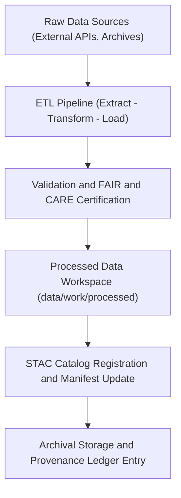
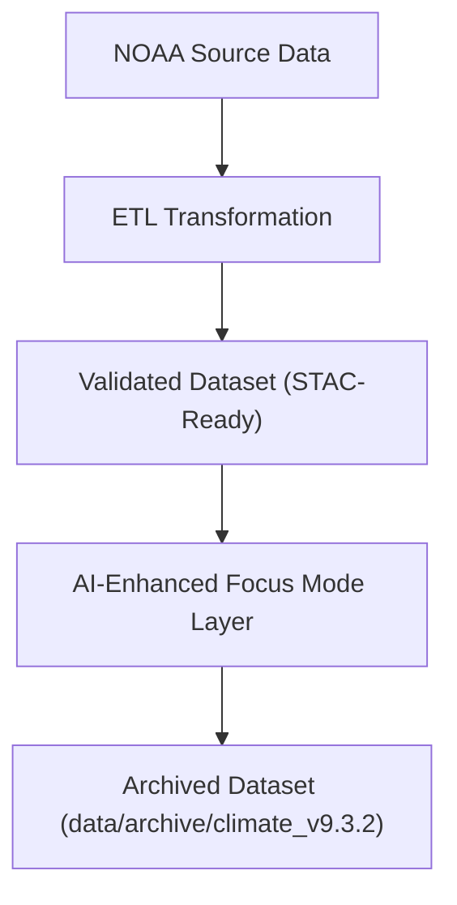

<div align="center">

# 🔗 Kansas Frontier Matrix — **Data Lineage Reports**
`data/reports/lineage/README.md`

**Purpose:** Documents dataset transformations, workflow dependencies, and provenance chains across all data layers in the Kansas Frontier Matrix (KFM).  
Ensures complete traceability and reproducibility of data flows under FAIR+CARE and MCP-DL v6.3 governance protocols.

[](../../../docs/standards/faircare-validation.md)
[](../../../LICENSE)
[](../../../.github/workflows/stac-validate.yml)
[](../../../docs/architecture/repo-focus.md)

</div>

---

## 📚 Overview

The `data/reports/lineage/` directory contains **data lineage reports** documenting the entire lifecycle of datasets — from raw ingestion to processed, validated, and archived outputs.  
Lineage reports provide a **transparent, verifiable record** of every data transformation, file dependency, and governance checkpoint.

Each lineage report captures:
- The source of data and its version of origin.  
- ETL scripts or pipelines that modified it.  
- Schema validation and FAIR+CARE outcomes.  
- Checksum signatures for reproducibility.  
- Governance metadata linking datasets to their ethical reviews.

---

## 🗂️ Directory Layout

```plaintext
data/reports/lineage/
├── README.md                        # This file — lineage reporting overview
│
├── data_lineage_tree.json           # Complete lineage graph for all datasets
├── etl_job_history.json             # Log of ETL pipeline executions and outputs
├── transformation_steps.md          # Human-readable step-by-step transformation history
└── pipeline_checksums.sha256        # Verification file for workflow and dataset integrity
```

---

## 🧩 Data Lineage Workflow



### Description:
1. **Ingestion:** Data imported from authoritative sources and assigned unique IDs.  
2. **ETL Transformation:** Processes executed via reproducible Python or shell scripts.  
3. **Validation:** Conformance checks for schema, STAC, and FAIR+CARE ethics.  
4. **Publication:** Clean datasets loaded into `data/work/processed/`.  
5. **Archival & Ledger:** Immutable records created under `data/archive/` and `data/reports/audit/`.

---

## 🧠 Lineage Tracking Fields

| Field | Description | Example |
|--------|--------------|----------|
| `dataset_id` | Unique dataset version identifier | `"hazards_v9.3.2"` |
| `source_file` | Originating data file or API | `"NOAA Storm Events API"` |
| `etl_script` | Transformation script applied | `"src/pipelines/etl/hazards_pipeline.py"` |
| `validation_report` | Reference to validation logs | `"reports/validation/stac_validation_report.json"` |
| `faircare_report` | Reference to ethical assessment | `"reports/fair/data_fair_summary.json"` |
| `checksum` | Cryptographic hash verifying integrity | `"sha256:4be30f9a..."` |
| `governance_decision` | Approval or pending review status | `"approved"` |

Each record in `data_lineage_tree.json` references its upstream and downstream dependencies for graph-based visualization.

---

## 📊 Example — Lineage Graph Entry

```json
{
  "dataset_id": "climate_v9.3.2",
  "source": "NOAA Global Climate Data Repository",
  "ingested_on": "2025-09-30T14:20:00Z",
  "transformed_by": "src/pipelines/etl/climate_pipeline.py",
  "validation_report": "data/reports/validation/schema_validation_summary.json",
  "archived_as": "data/archive/climate_v9.3.2/",
  "checksum": "f62b34e2989e3ad45a9d12e6b9c3efec8b...",
  "governance_link": "data/reports/audit/data_provenance_ledger.json",
  "status": "validated",
  "lineage_depth": 3,
  "dependencies": ["data/sources/noaa_weather_datasets.json"],
  "outputs": ["data/work/processed/climate/climate_v9.3.2.geojson"]
}
```

> 🔍 **Note:** Lineage depth represents the number of transformations between the raw and archived dataset states.

---

## ⚙️ Lineage Verification System

| File | Function | Generated By |
|------|-----------|--------------|
| `data_lineage_tree.json` | Stores all lineage relationships in a JSON graph | `.github/workflows/governance-ledger.yml` |
| `etl_job_history.json` | Tracks execution logs for each ETL pipeline | `.github/workflows/etl-run.yml` |
| `transformation_steps.md` | Human-readable summary of transformation logic | Manual + CI/CD documentation |
| `pipeline_checksums.sha256` | Verifies dataset and ETL integrity | `.github/workflows/governance-ledger.yml` |

Checksum verification ensures that every transformation step is reproducible across environments.

---

## 🧩 FAIR+CARE Integration

| Principle | Implementation |
|------------|----------------|
| **Findable** | Datasets are linked through globally unique STAC item IDs. |
| **Accessible** | Lineage records stored in open JSON and Markdown formats. |
| **Interoperable** | Data lineage adheres to JSON-LD and DCAT lineage schemas. |
| **Reusable** | Provenance ensures future replication and audit. |
| **Collective Benefit** | Enables transparent research and long-term trust in public data. |
| **Authority to Control** | FAIR+CARE Council oversees dataset transitions. |
| **Responsibility** | ETL maintainers document transformations and decisions. |
| **Ethics** | Sensitive transformations flagged for human review and redaction. |

---

## 🔍 Governance Linkages

The lineage system integrates with:
- `data/reports/audit/data_provenance_ledger.json` — Governance and checksum chain  
- `data/reports/validation/schema_validation_summary.json` — Validation source reference  
- `data/reports/fair/data_care_assessment.json` — Ethical review data  
- `releases/v9.3.2/manifest.zip` — Version registry for all dataset hashes  

All lineage entries are periodically synced into the **FAIR+CARE Council’s Neo4j Knowledge Graph** for visualization and reporting.

---

## 🧾 Lineage Visualization

For governance and research audits, lineage data can be visualized via Neo4j or D3.js-based dashboards:



> 🧭 **Insight:** These diagrams are automatically generated using lineage data, creating a visual provenance map of Kansas datasets.

---

## 🧾 Version History

| Version | Date       | Author             | Summary |
|----------|------------|--------------------|----------|
| v9.3.2   | 2025-10-28 | @kfm-data-lab      | Completed lineage documentation with FAIR+CARE integration. |
| v9.3.1   | 2025-10-27 | @bartytime4life    | Added checksum, dependencies, and example lineage entries. |
| v9.3.0   | 2025-10-26 | @kfm-architecture  | Established lineage directory and documentation framework. |

---

<div align="center">

**Kansas Frontier Matrix** · *Data Lineage × Provenance × FAIR+CARE Integrity*  
[🔗 Repository](https://github.com/bartytime4life/Kansas-Frontier-Matrix) • [🧭 Docs Portal](../../../docs/) • [⚖️ Governance Ledger](../../../docs/standards/governance/)

</div>
