<div align="center">

# 🔗 Kansas Frontier Matrix — **Data Lineage Reports**  
`data/reports/lineage/README.md`

**Purpose:** Documents dataset transformations, ETL workflows, and provenance relationships across all KFM data layers.  
Ensures transparency, traceability, and reproducibility for every dataset under **FAIR+CARE** and **MCP-DL v6.4.3** governance protocols.

[](../../../docs/standards/faircare-validation.md)
[](../../../.github/workflows/stac-validate.yml)
[](../../../LICENSE)
[](../../../docs/architecture/repo-focus.md)

</div>

---

## 📚 Overview

The `data/reports/lineage/` directory captures **end-to-end dataset lifecycles** within the Kansas Frontier Matrix (KFM).  
Every data transformation—from raw ingestion to archival—has a corresponding lineage record stored here to maintain verifiable, auditable provenance chains.

Each lineage report details:
- Source provenance and ingestion method.  
- ETL scripts and transformation sequence.  
- Validation and FAIR+CARE governance outputs.  
- Cryptographic checksums for reproducibility.  
- Governance approvals and version associations.  

---

## 🗂️ Directory Layout

```plaintext
data/reports/lineage/
├── README.md                        # This file — lineage reporting overview
│
├── data_lineage_tree.json           # Complete lineage graph (datasets, dependencies, outputs)
├── etl_job_history.json             # ETL pipeline execution logs and timestamps
├── transformation_steps.md          # Human-readable ETL transformation documentation
└── pipeline_checksums.sha256        # Verification file for dataset and job integrity
```

---

## 🧩 Data Lineage Workflow

```mermaid
flowchart TD
  A["Raw Data Sources (NOAA, USGS, FEMA, KGS)"] --> B["ETL Pipelines (Extract – Transform – Load)"]
  B --> C["Validation and FAIR+CARE Certification"]
  C --> D["Processed Data Workspace (data/work/processed/)"]
  D --> E["STAC/DCAT Catalog Registration"]
  E --> F["Archival Storage and Ledger Integration"]
```



**Workflow Description:**
1. **Ingestion:** Data fetched from official sources and logged with metadata.  
2. **ETL Transformation:** Reproducible pipelines in `/src/pipelines/etl/`.  
3. **Validation:** Schema, STAC, and FAIR+CARE checks for governance conformance.  
4. **Processed Output:** Clean datasets saved under `data/work/processed/`.  
5. **Ledger Entry:** Governance and checksum data added to `data/reports/audit/`.

---

## 🧠 Lineage Tracking Schema

| Field | Description | Example |
|--------|--------------|----------|
| `dataset_id` | Dataset version identifier | `climate_v9.5.1` |
| `source` | Source file or API endpoint | `NOAA NCEI API` |
| `etl_script` | Transformation script executed | `src/pipelines/etl/climate_pipeline.py` |
| `validation_report` | Path to validation logs | `reports/validation/stac_validation_report.json` |
| `faircare_report` | Path to FAIR+CARE audit results | `reports/fair/data_fair_summary.json` |
| `checksum` | Dataset SHA-256 checksum | `sha256:f62b34e2989e3ad45a9d12e6b9c3efec8b` |
| `governance_status` | Approval state (approved/pending) | `approved` |

All lineage entries are structured in `data_lineage_tree.json` and can be visualized as graph networks.

---

## 📊 Example Lineage Record

```json
{
  "dataset_id": "hydrology_v9.5.1",
  "source": "USGS Water Data API",
  "ingested_on": "2025-10-25T13:00:00Z",
  "transformed_by": "src/pipelines/etl/hydrology_pipeline.py",
  "validation_report": "data/reports/validation/schema_validation_summary.json",
  "archived_as": "data/archive/hydrology/hydrology_v9.5.1/",
  "checksum": "c26b9a2237ee52b08b66c3b5f25c9d7237fae4d1...",
  "fair_score": 99,
  "care_score": 100,
  "governance_link": "data/reports/audit/data_provenance_ledger.json",
  "dependencies": ["data/raw/usgs/groundwater_levels/metadata.json"],
  "outputs": ["data/work/processed/hydrology/hydrology_v9.5.1.geojson"]
}
```

---

## ⚙️ Lineage Integrity & Verification

| File | Purpose | Generated By |
|------|----------|--------------|
| `data_lineage_tree.json` | Lineage graph linking all transformations | `governance-ledger.yml` |
| `etl_job_history.json` | ETL job timestamps, commit refs, and pipeline logs | `etl-run.yml` |
| `transformation_steps.md` | Human-readable documentation of each ETL step | Maintainers + CI |
| `pipeline_checksums.sha256` | Verification of ETL reproducibility and output integrity | `governance-ledger.yml` |

All verification steps rely on deterministic pipelines and cryptographically signed artifacts.

---

## 🧩 FAIR+CARE Integration

| Principle | Implementation |
|------------|----------------|
| **Findable** | All lineage items indexed via dataset IDs and STAC/DCAT metadata. |
| **Accessible** | Reports published in open JSON and Markdown formats. |
| **Interoperable** | JSON-LD and DCAT-PROV schemas ensure machine readability. |
| **Reusable** | Complete provenance metadata supports external reproduction. |
| **Collective Benefit** | Fosters open science and trust in Kansas public data. |
| **Authority to Control** | FAIR+CARE Council validates transitions and sign-offs. |
| **Responsibility** | ETL maintainers record transformations and governance outcomes. |
| **Ethics** | All sensitive transformations flagged for Council review. |

---

## 🔍 Governance Linkages

Lineage data is automatically linked with:
- `data/reports/audit/data_provenance_ledger.json` — Governance & checksum log  
- `data/reports/fair/data_care_assessment.json` — CARE compliance metrics  
- `data/reports/validation/stac_validation_report.json` — Schema validation outputs  
- `releases/v9.5.1/manifest.zip` — Version registry with SHA-256 signatures  

These datasets are visualized within the **FAIR+CARE Knowledge Graph** used by the Governance Council for real-time traceability.

---

## 🧾 Lineage Visualization


> 🧩 **Insight:** These lineage flows are derived from JSON lineage graphs and rendered dynamically for FAIR+CARE audits and reports.

---

## 🧾 Version History

| Version | Date | Author | Summary |
|----------|------|---------|----------|
| v9.5.1 | 2025-10-30 | @kfm-data-lab | Upgraded lineage governance to MCP-DL v6.4.3; added DCAT-PROV schema integration and checksum enhancements. |
| v9.3.2 | 2025-10-28 | @bartytime4life | Introduced lineage verification and dependency logging. |
| v9.3.0 | 2025-10-26 | @kfm-architecture | Established baseline lineage documentation and FAIR+CARE alignment. |

---

<div align="center">

**Kansas Frontier Matrix** · *Data Lineage × Provenance × FAIR+CARE Transparency*  
[🔗 Repository](https://github.com/bartytime4life/Kansas-Frontier-Matrix) • [🧭 Docs Portal](../../../docs/) • [⚖️ Governance Ledger](../../../docs/standards/governance/)

</div>
