<!-- [KFM_META_BLOCK_V2]
doc_id: kfm://data/reports/people-dna-land/readme
name: People DNA Land Reports README
path: data/reports/people-dna-land/README.md
type: data-reports-people-dna-land-readme
version: v0.1.0
status: draft
owners:
  - <data-steward>
  - <reports-steward>
  - <people-dna-land-domain-steward>
  - <privacy-steward>
  - <consent-steward>
  - <dna-safety-steward>
  - <genealogy-steward>
  - <land-ownership-steward>
  - <title-boundary-reviewer>
  - <rights-steward>
  - <sensitivity-steward>
  - <evidence-steward>
  - <proof-steward>
  - <receipt-steward>
  - <catalog-steward>
  - <policy-steward>
  - <release-steward>
  - <docs-steward>
created: 2026-06-29
updated: 2026-06-29
policy_label: restricted-review
truth_posture: cite-or-abstain
responsibility_root: data/
domain: people-dna-land
artifact_family: report-candidate-and-report-support-lane
path_posture: existing-greenfield-stub-replaced; parent-data-reports-readme-is-greenfield-stub; data-readme-lists-reports; directory-rules-data-tree-lists-data-published-reports-not-data-reports; compatibility-or-steward-facing-report-candidate-lane-until-parent-contract-or-adr-resolves; people-vs-people-dna-land-segment-conflict-preserved
sensitivity_posture: no-public-path-by-default; report-is-downstream-carrier-not-truth; t4-deny-default; living-person-fields-fail-closed; dna-genomic-raw-kit-segment-match-data-denied; dna-derived-relationship-hypotheses-restricted; private-person-parcel-joins-denied; current-owner-exposure-denied-by-default; consent-revocation-and-tombstone-aware; title-truth-and-parcel-boundary-controls-preserved; assessor-tax-not-title-truth; parcel-geometry-not-title-boundary-proof; sovereignty-cultural-burial-context-reviewed; evidence-aware; rights-aware; policy-aware; review-aware; release-blocked-until-gates-close
related:
  - ../README.md
  - ../../README.md
  - ../../raw/people-dna-land/README.md
  - ../../work/people-dna-land/README.md
  - ../../quarantine/people-dna-land/README.md
  - ../../processed/people-dna-land/README.md
  - ../../catalog/domain/people-dna-land/README.md
  - ../../registry/sources/people-dna-land/README.md
  - ../../registry/sources/people/README.md
  - ../../registry/people-dna-land/README.md
  - ../../registry/people-dna-land/sources/README.md
  - ../../receipts/people-dna-land/README.md
  - ../../proofs/people-dna-land/README.md
  - ../../published/README.md
  - ../../published/reports/README.md
  - ../../published/people-dna-land/README.md
  - ../../published/layers/people-dna-land/README.md
  - ../../../docs/reports/README.md
  - ../../../docs/domains/people-dna-land/README.md
  - ../../../docs/domains/people-dna-land/SENSITIVITY.md
  - ../../../docs/domains/people-dna-land/SCOPE_AND_BOUNDARY.md
  - ../../../docs/domains/people-dna-land/DNA_HANDLING.md
  - ../../../docs/domains/people-dna-land/DATA_LIFECYCLE.md
  - ../../../docs/domains/people-dna-land/SOURCE_REGISTRY.md
  - ../../../docs/domains/people-dna-land/SOURCE_FAMILIES.md
  - ../../../docs/domains/people-dna-land/IDENTITY_MODEL.md
  - ../../../docs/domains/people-dna-land/LAND_OWNERSHIP.md
  - ../../../docs/domains/people-dna-land/sublanes/people.md
  - ../../../docs/domains/people-dna-land/sublanes/genealogy.md
  - ../../../docs/domains/people-dna-land/sublanes/dna.md
  - ../../../docs/domains/people-dna-land/sublanes/land.md
  - ../../../docs/adr/ADR-0010-deny-by-default-for-dna-rare-species-archaeology-infrastructure.md
  - ../../../docs/adr/ADR-0011-receipts-vs-proofs-vs-manifests-vs-catalog-separation.md
  - ../../../docs/doctrine/directory-rules.md
  - ../../../contracts/domains/people-dna-land/
  - ../../../schemas/contracts/v1/domains/people-dna-land/
  - ../../../policy/domains/people-dna-land/
  - ../../../policy/sensitivity/people-dna-land/
  - ../../../policy/consent/people-dna-land/
  - ../../../policy/rights/
  - ../../../release/
tags:
  - kfm
  - data
  - reports
  - people-dna-land
  - people
  - genealogy
  - dna
  - genomic
  - land-ownership
  - consent
  - revocation
  - privacy
  - living-person
  - person-assertion
  - identity-evidence
  - genealogy-relationship
  - dna-evidence
  - dna-derived-hypothesis
  - person-parcel-join
  - current-owner
  - land-instrument
  - ownership-interval
  - chain-of-title
  - title-boundary
  - assessor-tax-records
  - parcel-geometry
  - report-candidate
  - report-support
  - downstream-carrier
  - sensitive-domain
  - deny-by-default
  - t4-deny
  - consent-aware
  - source-role
  - evidence-first
  - cite-or-abstain
  - proof
  - receipts
  - catalog
  - release-gated
  - rollback
  - no-public-path
notes:
  - "This README replaces the greenfield stub at `data/reports/people-dna-land/README.md`."
  - "The parent `data/reports/README.md` is currently a greenfield stub, so this file is self-bounding and intentionally conservative."
  - "Directory Rules v1.4 lists released report payloads under `data/published/reports/`; this existing `data/reports/people-dna-land/` lane is therefore treated as compatibility, report-candidate, or steward-facing report-support material until parent contract or ADR review resolves the lane."
  - "People/DNA/Land reports are downstream carriers. They do not replace source records, processed data, catalog records, EvidenceBundles, proofs, receipts, source descriptors, consent decisions, sensitivity decisions, policy decisions, release manifests, correction records, rollback records, or generated-answer receipts."
  - "Living-person fields, raw DNA/genomic data, raw kit/vendor identifiers, segment data, DNA match tables, DNA-derived relationship hypotheses, private person-parcel joins, current-owner exposure, title-sensitive material, parcel-boundary claims, and consent/revocation context fail closed unless explicit evidence, consent where required, policy, review, release, correction, and rollback support allow a public-safe derivative."
[/KFM_META_BLOCK_V2] -->

<a id="top"></a>

# People / DNA / Land Reports

Report-candidate and report-support lane for People / Genealogy / DNA / Land generated report material that is not yet a released public report payload.

<p>
  
  
  
  
  
  
  
</p>

**Quick links:** [Scope](#scope) · [Path posture](#path-posture) · [Repo fit](#repo-fit) · [Report boundary](#report-boundary) · [Accepted material](#accepted-material) · [Exclusions](#exclusions) · [People / DNA / Land report guardrails](#people--dna--land-report-guardrails) · [Report flow](#report-flow) · [Suggested directory shape](#suggested-directory-shape) · [Required checks](#required-checks-before-use) · [Status notes](#status-notes)

> [!CAUTION]
> `data/reports/people-dna-land/` is not People/DNA/Land truth, not a public report lane, not proof, not receipt storage, not catalog closure, not release authority, not policy authority, not schema authority, not source registry authority, not consent authority, not identity authority, not genealogy truth, not DNA/genomic truth, not title authority, not parcel-boundary authority, not legal advice, not public lookup material, and not a direct public API/UI source. Treat it as an existing report-candidate or report-support lane until `data/reports/` receives an accepted parent contract or migration decision.

---

## Scope

`data/reports/people-dna-land/` may hold People/DNA/Land report candidates, generated report-support bundles, report-local indexes, preview summaries, and report assembly sidecars that are derived from governed upstream artifacts but are **not** themselves canonical trust artifacts.

This lane is useful only when a maintainer needs a data-root place to stage, inspect, or assemble People/DNA/Land report material before one of the following governed outcomes:

- a released public report payload under `data/published/reports/`;
- a generated steward-facing narrative under `docs/reports/`;
- a catalog/proof/release-linked report artifact referenced by a governed API or review console;
- a rejected, quarantined, corrected, superseded, withdrawn, tombstoned, embargoed, or rolled-back report candidate.

People/DNA/Land report material may summarize public-safe historical-person context, assertion-first identity evidence, genealogy relationship evidence, family-tree hypothesis posture, aggregate-only genealogy summaries, consent-safe views, revocation/cleanup posture, DNA-safe aggregate or k-anonymized derivative posture, land-instrument context, ownership interval context, chain-of-title gap posture, assessor/tax administrative context, parcel-version context, title/boundary caveats, privacy posture, source-role posture, sensitivity posture, redaction/generalization posture, proof posture, catalog posture, release posture, correction posture, and rollback posture.

A report candidate does **not** make a person identity, living-person field, relationship, family tree, DNA relationship, DNA match, consent state, land ownership assertion, title assertion, parcel boundary, ownership interval, current-owner claim, legal description, chain-of-title conclusion, public-safe derivative, policy outcome, release outcome, or generated narrative true. Consequential claims must remain supported by source descriptors, processed data, catalog records, EvidenceBundles, receipts, consent/revocation state where applicable, policy decisions, review state, release state, correction paths, and rollback targets.

---

## Path posture

The existing target lane is:

```text
data/reports/people-dna-land/
```

The parent currently exists as a greenfield stub:

```text
data/reports/README.md
```

Current placement evidence is mixed:

- `data/README.md` lists `reports` as content that may belong under `data/`.
- `docs/doctrine/directory-rules.md` lists canonical data lifecycle and emitted-proof families, including `data/published/reports/`, but does not establish `data/reports/` as a lifecycle phase in the same way as `raw`, `work`, `quarantine`, `processed`, `catalog`, `triplets`, `published`, `receipts`, `proofs`, `rollback`, and `registry`.
- `data/published/reports/README.md` is the clearer released public report payload lane.
- `docs/reports/README.md` is the clearer generated steward-facing narrative lane.

Therefore this README treats `data/reports/people-dna-land/` as **CONFIRMED path presence / NEEDS VERIFICATION topology**. Do not let this lane become a parallel report authority. If an ADR or parent README later makes `data/reports/` canonical, update this README and migrate child conventions with a rollback plan. If `data/reports/` is retired, migrate report candidates to the correct lifecycle, docs, or published lane.

This domain also has a documented `people` versus `people-dna-land` segment conflict for some roots. This README follows the existing requested `data/reports/people-dna-land/` path and preserves the conflict as a governance note rather than resolving it here.

---

## Repo fit

| Responsibility | Correct home | Boundary |
|---|---|---|
| People/DNA/Land report candidates and report-support bundles | `data/reports/people-dna-land/` | Existing compatibility/steward-facing candidate lane until topology is resolved. |
| Parent reports lane | [`../README.md`](../README.md) | Currently greenfield; does not yet define a full report-family contract. |
| Data root | [`../../README.md`](../../README.md) | Lifecycle data and emitted proof root; reports listed but parent contract remains thin. |
| Processed People/DNA/Land artifacts | [`../../processed/people-dna-land/README.md`](../../processed/people-dna-land/README.md) | Normalized sensitive processed artifacts upstream of catalog/report/public products. |
| People/DNA/Land domain catalog | [`../../catalog/domain/people-dna-land/README.md`](../../catalog/domain/people-dna-land/README.md) | Catalog closure and release-linked discovery records; not report narrative. |
| People/DNA/Land source registry | [`../../registry/sources/people-dna-land/README.md`](../../registry/sources/people-dna-land/README.md) | Source admission, rights, consent, sensitivity, and source-role records; not report payloads. |
| Companion People source registry | [`../../registry/sources/people/README.md`](../../registry/sources/people/README.md) | Confirms topology uncertainty; must not create divergent authority. |
| People/DNA/Land receipts | [`../../receipts/people-dna-land/README.md`](../../receipts/people-dna-land/README.md) | Process memory; reports may summarize receipts but must not store or replace them. |
| People/DNA/Land proofs | [`../../proofs/people-dna-land/README.md`](../../proofs/people-dna-land/README.md) | Evidence/proof support; reports cite these, not replace them. |
| Released public report payloads | [`../../published/reports/README.md`](../../published/reports/README.md) | Release-approved report payloads only. |
| Released People/DNA/Land artifacts | [`../../published/people-dna-land/README.md`](../../published/people-dna-land/README.md) | Broader published public-safe artifact lane after release. |
| Released People/DNA/Land map carriers | [`../../published/layers/people-dna-land/README.md`](../../published/layers/people-dna-land/README.md) | Published public-safe map layer carriers; reports may reference them after release. |
| Steward-facing generated narratives | [`../../../docs/reports/README.md`](../../../docs/reports/README.md) | Human-readable generated review/release reports; not data payloads. |
| People/DNA/Land domain doctrine | [`../../../docs/domains/people-dna-land/README.md`](../../../docs/domains/people-dna-land/README.md) | Domain scope, T4 defaults, evidence-first assertions, consent, DNA, and title/parcel anti-collapse. |
| Release decisions | `../../../release/` | ReleaseManifest, PromotionDecision, correction, rollback, withdrawal, revocation cleanup, and signatures. |
| Contracts, schemas, policy | `../../../contracts/domains/people-dna-land/`, `../../../schemas/contracts/v1/domains/people-dna-land/`, `../../../policy/domains/people-dna-land/`, `../../../policy/sensitivity/people-dna-land/`, `../../../policy/consent/people-dna-land/` or ADR-resolved segment homes | Meaning, machine shape, and allow/deny/restrict/abstain logic; segment conflict remains outside this README. |

---

## Report boundary

| Rule | Handling |
|---|---|
| Report is a downstream carrier | It can summarize governed artifacts, but it is never root truth. |
| Candidate is not publication | A file here is not public just because it is readable, renderable, narrative, mapped, or useful for review. |
| Living-person content fails closed | Living-person fields, identifiers, relationships, residence, current-owner context, and person-parcel joins are denied or restricted unless explicit policy/review/release support exists. |
| DNA/genomic content fails closed | Raw DNA, kit/vendor IDs, segment data, match tables, triangulation outputs, and DNA-derived relationship evidence must not become public report content. |
| Consent remains separate and revocable | Consent scope, purpose, expiry, revocation, tombstone, embargo, downstream cleanup, and rollback remain governed control artifacts, not report prose. |
| Person assertions are evidence | Reports may summarize assertion posture; they must not turn assertions into canonical identity truth. |
| Genealogy trees are hypotheses | GEDCOM/tree overlays and family relationships remain candidate or modeled evidence until independently supported and reviewed. |
| Assessor/tax is not title | Assessor and tax records are administrative context, not title truth or ownership certification. |
| Parcel geometry is not boundary proof | Parcel, PLSS, survey, and derived geometry must preserve role, vintage, and uncertainty; geometry alone is not legal boundary proof. |
| Public report payloads move through release | Released report payloads belong under `data/published/reports/` with release support. |
| Steward narratives belong under docs | Generated human-readable review/release narratives belong under `docs/reports/`. |
| Proof remains separate | EvidenceBundle, ProofPack, citation validation, and integrity proof stay in proof lanes. |
| Receipts remain separate | RunReceipt, ValidationReport, RedactionReceipt, AggregationReceipt, ReviewRecord, PolicyDecision, Consent/RevocationReceipt, AIReceipt, and release-support receipts stay in receipt/proof lanes. |
| Catalog remains separate | Domain catalog, STAC, DCAT, and PROV records stay in `data/catalog/`. |
| Release remains separate | ReleaseManifest, PromotionDecision, CorrectionNotice, RollbackCard, WithdrawalNotice, tombstone, revocation cleanup, and signatures stay in release governance. |
| Policy remains separate | Consent, privacy, sensitivity, rights, source-role, review, redaction, aggregation, k-anonymization, and public-release rules stay in `policy/`. |
| AI is not report truth | Generated language must resolve to evidence or abstain; AI summaries require AIReceipt/runtime-envelope support when used in governed flows. |
| Public clients do not read this lane | Public UI/API/report surfaces consume governed APIs, released artifacts, catalog/proof-backed responses, release-safe report payloads, and policy-safe envelopes. |

---

## Accepted material

Accepted material is limited to People/DNA/Land report-candidate and report-support files that do not become parallel trust artifacts:

- report-candidate Markdown, HTML, JSON, or PDF-generation source files that are explicitly unreleased and restricted-review;
- report-local indexes that point to processed, catalog, proof, receipt, source registry, consent/revocation, sensitivity/review, release, and published artifacts without replacing them;
- report assembly sidecars, such as candidate table-of-contents, figure list, public-safe map snapshot index, citation draft index, evidence-reference draft index, caveat index, source-role index, consent-dependency index, revocation-dependency index, sensitivity-dependency index, privacy-review index, title-boundary caveat index, and review-dependency index;
- report-local caveat summaries, sensitivity summaries, consent summaries, revocation summaries, redaction/generalization summaries, aggregation/k-anonymization summaries, review summaries, source-role summaries, title/boundary caveat summaries, and release-readiness summaries that link to their canonical policy/proof/receipt/review inputs;
- preview artifacts for steward review, clearly marked as candidates and not public release payloads;
- correction, supersession, withdrawal, tombstone, revocation, embargo, or rollback notes that point to canonical release/proof records rather than replacing them;
- README files explaining local report-candidate boundaries.

All accepted material must avoid embedding restricted detail. Use pointers, stable IDs, redacted identifiers, generalized summaries, aggregate-only summaries, public-safe geometry references, and governed references instead of living-person fields, raw DNA/genomic content, private person-parcel joins, current-owner exposure, title-sensitive detail, or sensitive narrative detail.

---

## Exclusions

| Do not place here | Correct home | Why |
|---|---|---|
| RAW source captures, GEDCOM/GEDZip exports, genealogy uploads, DNA files, kit IDs, vendor exports, segment tables, match CSVs, vital-record extracts, cemetery files, census schedules, court/probate files, deed packages, assessor rolls, parcel files, source-native tables, API dumps, uploaded files, source mirrors, or raw report inputs | `../../raw/people-dna-land/` or restricted source lanes | Source-edge captures require source context, rights, sensitivity, consent, and access controls. |
| WORK scratch, transform intermediates, unresolved report candidates, identity-matching scratch, relationship hypotheses, DNA transformation trials, consent review drafts, redaction-debug outputs, person-parcel joins, or unreviewed sensitive joins | `../../work/people-dna-land/` or `../../quarantine/people-dna-land/` | Candidate material that has not passed gates belongs upstream or in hold lanes. |
| Normalized People/DNA/Land datasets | `../../processed/people-dna-land/` | Processed data is not a report. |
| Domain catalog, STAC, DCAT, PROV, graph/triplet records, or catalog closure objects | `../../catalog/`, `../../triplets/` | Catalog/graph carriers have their own closure rules. |
| EvidenceBundle, ProofPack, CitationValidationReport, validation proof, consent proof, redaction proof, or integrity bundles | `../../proofs/` | Proof is the trust spine; reports cite it. |
| RunReceipt, RedactionReceipt, AggregationReceipt, ValidationReceipt, TransformReceipt, ReviewRecord, ConsentGrant/RevocationReceipt, PolicyDecision, AIReceipt, or release-support receipts | `../../receipts/people-dna-land/` or accepted receipt/proof lanes | Receipts and review records are process memory and governance state; reports summarize them only. |
| SourceDescriptor, source activation records, sensitivity registry records, consent-control records, rights registry records, or layer registry records | `../../registry/` and policy/consent roots as accepted | Registry/control records belong in registry or policy lanes. |
| ReleaseManifest, PromotionDecision, CorrectionNotice, RollbackCard, WithdrawalNotice, tombstone authority, signatures, or release changelog | `../../../release/` | Release decisions are not report candidates. |
| Released public report payloads | `../../published/reports/` | Public report payloads must be release-approved. |
| Generated steward-facing narrative reports | `../../../docs/reports/` | Human-readable generated reports belong in docs. |
| Contracts, schemas, policy rules, validators, tests, code, or workflows | `../../../contracts/`, `../../../schemas/`, `../../../policy/`, `../../../tools/`, `../../../tests/`, `.github/workflows/` | Separate authority roots. |
| Living-person identifiers, raw DNA/genomic content, kit/vendor IDs, segment data, match tables, private relationship detail, private person-parcel joins, current-owner exposure, title-sensitive detail, parcel-boundary claims, or restricted cultural/burial/sovereignty context | Restricted governed lanes only; public-safe derivative only after policy/review/release | Report formatting must not become a privacy, consent, title, or DNA bypass. |
| Map screenshots, tables, thumbnails, figure captions, graph edges, embeddings, AI text, or narrative cues that reverse-engineer restricted identity, DNA, parcel, ownership, or living-person context | Restricted/held lanes only unless public-safe release support exists | Derived carriers can leak restricted detail even when raw fields are absent. |
| Legal advice, title certification, ownership certification, property-rights conclusions, genealogical proof conclusions, DNA relationship conclusions, living-person lookup, or operational instructions | Official authorities or governed review outside this lane | KFM may provide evidence context, not legal, title, identity, kinship, or operational authority. |
| Uncited AI summaries or generated authoritative claims | Governed answer/report generation flow with evidence, policy, and receipts | Generated language is evidence-subordinate. |

---

## People / DNA / Land report guardrails

| Risk | Guardrail |
|---|---|
| Living-person disclosure | Report prose, indexes, figures, captions, tables, filenames, and metadata must not expose living-person identifiers, residences, relationships, parcel joins, or current-owner context unless explicit public-safe release support exists. |
| DNA/genomic leakage | Raw DNA, kit identifiers, vendor IDs, match tables, segment coordinates, triangulation outputs, and DNA-derived relationship evidence are denied for public report content. |
| Consent flattening | Consent is scoped, purpose-bound, time-bound where applicable, and revocable. Reports may summarize consent posture only by pointer or public-safe summary, not by embedding private consent detail. |
| Revocation cleanup failure | Revocation must trigger tombstone, downstream cleanup, embargo/cache invalidation, correction, withdrawal, or rollback support where applicable; reports must not preserve stale revoked material. |
| Relationship overclaim | Genealogy and DNA-derived relationships remain evidence-bound assertions or hypotheses unless proof, policy, review, and release support a narrower claim. |
| Identity overclaim | Person assertions, name variants, residence events, migration events, family groups, and source records do not become canonical identity truth by report narration. |
| Assessor/title collapse | Assessor/tax records and valuation records are administrative context; they do not prove title, ownership certification, or legal right. |
| Parcel/boundary collapse | Parcel geometry, PLSS references, maps, surveys, derived geometry, and address context do not prove title boundary or ownership by themselves. |
| Person-parcel exposure | Private person-parcel joins, current-owner exposure, residence-grade mapping, and living-person property context fail closed unless policy and release allow an aggregate or public-safe representation. |
| Aggregate re-identification | Aggregates, k-anonymized derivatives, and public summaries must not allow reconstruction of living-person, DNA, private relationship, person-parcel, or restricted title/source detail. |
| Cultural/sovereignty/burial adjacency | Burial, cemetery, cultural, tribal, sovereignty, living-descendant, and community-sensitive context inherits the strictest applicable policy posture. |
| Cross-lane ownership confusion | Settlements, Roads/Rail, Hydrology, Geology, Soil, Agriculture, Habitat, Flora, Fauna, Hazards, Archaeology, and external legal authorities keep their own truth and sensitivity boundaries. |
| Redaction-by-layout drift | Cropping, blur, zoom thresholds, vague captions, anonymized-looking labels, or PDF flattening are not substitutes for RedactionReceipt, policy decision, review state, and release review. |
| Report-as-proof drift | A report may make evidence easier to read; it does not become the evidence. |
| Report-as-release drift | A report may summarize release state; it does not approve release. |

---

## Report flow

```mermaid
flowchart LR
    PROC[Processed People/DNA/Land artifacts] --> CAT[Catalog / triplet closure]
    CAT --> PROOF[EvidenceBundle / proof support]
    PROOF --> REVIEW[Privacy / consent / DNA / title / rights review]
    REVIEW --> RECEIPT[Receipts: validation, consent, revocation, redaction, aggregation, AI, release-support]
    RECEIPT --> POLICY[Policy + sensitivity + consent + rights decision]
    POLICY --> CAND[Report candidate in data/reports/people-dna-land]
    CAND --> DECISION{Report disposition}
    DECISION -- steward narrative --> DOCS[docs/reports]
    DECISION -- released public payload --> PUB[data/published/reports]
    DECISION -- hold or fail --> HOLD[work / quarantine / correction / tombstone path]
    PUB --> REL[release manifest + correction + rollback]

    classDef gate fill:#fff3cd,stroke:#8a6d3b,color:#202124;
    classDef hold fill:#f8d7da,stroke:#842029,color:#202124;
    class DECISION gate;
    class HOLD hold;
```



> [!NOTE]
> The diagram is a responsibility map, not proof that generators, validators, payloads, manifests, review records, consent systems, revocation systems, tombstone hooks, or CI wiring currently exist.

---

## Suggested directory shape

This shape is **PROPOSED** until `data/reports/` receives an accepted parent contract or migration decision. Do not pre-create empty stubs.

```text
data/reports/people-dna-land/
├── README.md
├── candidates/                         # PROPOSED: unreleased restricted-review report candidates
│   └── <report_slug>/
│       ├── report.candidate.md
│       ├── report.inputs.index.json
│       ├── evidence_refs.candidate.json
│       ├── review_refs.candidate.json
│       ├── consent_refs.candidate.json
│       ├── revocation_refs.candidate.json
│       ├── sensitivity_refs.candidate.json
│       ├── source_role_refs.candidate.json
│       ├── redaction_refs.candidate.json
│       ├── aggregation_refs.candidate.json
│       ├── title_boundary_refs.candidate.json
│       ├── citations.candidate.json
│       ├── caveats.candidate.md
│       └── README.md
├── previews/                           # PROPOSED: steward-only rendered previews
│   └── <report_slug>/
├── indexes/                            # PROPOSED: report-local candidate indexes
│   └── people-dna-land.report-candidates.index.json
├── superseded/                         # PROPOSED: retained candidates with lineage
│   └── README.md
├── tombstoned/                         # PROPOSED: revoked/withdrawn candidate references only; no sensitive payloads
│   └── README.md
└── withdrawn/                          # PROPOSED: withdrawn or denied report candidates
    └── README.md
```

If a candidate is promoted as a public report payload, the released payload belongs under `data/published/reports/` and the release decision belongs under `release/`. If a generator emits steward-facing narrative, the generated report belongs under `docs/reports/`.

---

## Required checks before use

- [ ] Confirm whether `data/reports/` is an accepted report-candidate lane, a compatibility lane, or a migration target.
- [ ] Confirm whether `data/reports/people-dna-land/` should hold candidates, indexes, previews, or should redirect to `docs/reports/` and `data/published/reports/`.
- [ ] Confirm CODEOWNERS for reports, People/DNA/Land, privacy, consent, DNA safety, genealogy, land ownership, title/boundary review, rights, sensitivity, evidence, proof, receipts, catalog, policy, release, and docs review.
- [ ] Confirm every report claim resolves to catalog/proof/evidence or abstains.
- [ ] Confirm report candidates do not store canonical receipts, proofs, review records, consent records, revocation records, release manifests, source descriptors, sensitivity registry records, policy rules, schemas, or processed datasets.
- [ ] Confirm living-person fields, DNA/genomic content, raw kit/vendor IDs, raw segments, match tables, private relationship detail, person-parcel joins, current-owner exposure, title-sensitive detail, parcel-boundary claims, cultural/burial/sovereignty context, and reverse-engineerable derived cues are absent unless explicit public-safe release support exists.
- [ ] Confirm consent, scope, purpose, expiry, revocation, tombstone, downstream cleanup, embargo/cache invalidation, correction, withdrawal, and rollback posture for consent-gated content.
- [ ] Confirm aggregates, k-anonymized views, redactions, generalizations, delays, and public-safe summaries cannot be reverse-engineered into restricted identity, DNA, relationship, parcel, ownership, or title detail.
- [ ] Confirm person assertions, genealogy hypotheses, DNA-derived relationship evidence, land instruments, assessor/tax records, parcel geometry, ownership intervals, title claims, and legal descriptions are not framed beyond their source role.
- [ ] Confirm neighboring-domain joins preserve owning-domain truth and sensitivity boundaries.
- [ ] Confirm AI-generated summaries have evidence references, citation validation, finite outcome, and AIReceipt/runtime envelope support where applicable.
- [ ] Confirm released report payloads are promoted to `data/published/reports/` only after ReleaseManifest, correction path, rollback target, digest, review state, consent/revocation posture, redaction/aggregation posture, title-boundary posture, and citation/evidence closure exist.
- [ ] Confirm generated steward-facing narratives belong in `docs/reports/` rather than this data lane.

---

## Status notes

| Item | Status | Notes |
|---|---:|---|
| Target path presence | CONFIRMED | This README replaces a greenfield stub at `data/reports/people-dna-land/README.md`. |
| Parent reports README | CONFIRMED stub | `data/reports/README.md` exists but does not yet define a report-family contract. |
| Data root reports mention | CONFIRMED | `data/README.md` lists reports, but marks the root status `PROPOSED`. |
| Directory Rules data tree | CONFIRMED doctrine | Current Directory Rules list `data/published/reports/` and the canonical data lifecycle families; `data/reports/` remains topology-NEEDS VERIFICATION. |
| Published reports lane | CONFIRMED README | `data/published/reports/README.md` exists and is the clearer released report payload lane. |
| Docs reports lane | CONFIRMED README | `docs/reports/README.md` exists and is the clearer steward-facing generated narrative lane. |
| People/DNA/Land domain doctrine | CONFIRMED README | `docs/domains/people-dna-land/README.md` establishes T4 deny defaults, evidence-first person assertions, DNA restrictions, consent revocation, title/parcel anti-collapse, and segment-name conflict. |
| People/DNA/Land processed lane | CONFIRMED README | `data/processed/people-dna-land/README.md` establishes PROCESSED-stage boundaries and denies public use without policy/evidence/release gates. |
| People/DNA/Land catalog lane | CONFIRMED README | `data/catalog/domain/people-dna-land/README.md` establishes catalog-stage boundaries, consent/privacy posture, and release-only exposure. |
| People/DNA/Land source registry | CONFIRMED README | `data/registry/sources/people-dna-land/README.md` establishes source-admission, source-role, consent, sensitivity, rights, and no-public-path posture. |
| People/DNA/Land receipts lane | CONFIRMED README | `data/receipts/people-dna-land/README.md` establishes receipt/process-memory boundaries and no-public-path posture. |
| People/DNA/Land proofs lane | CONFIRMED README | `data/proofs/people-dna-land/README.md` establishes proof-support boundaries and fail-closed sensitive-proof posture. |
| People/DNA/Land published domain lane | CONFIRMED README | `data/published/people-dna-land/README.md` establishes release-gated public-safe carrier posture. |
| People/DNA/Land published layers | CONFIRMED README | `data/published/layers/people-dna-land/README.md` establishes release-gated public-safe layer-carrier posture. |
| Segment naming | CONFLICTED / NEEDS VERIFICATION | Existing docs preserve `people` vs `people-dna-land` conflict for some schema/contract/policy roots. This README does not resolve it. |
| Actual report payloads | UNKNOWN | This README does not prove report candidates or released reports exist. |
| Generator, validator, consent, review, revocation, or CI enforcement | NEEDS VERIFICATION | No generator/validator/review/consent/revocation tooling was proven by this edit. |
| Public release readiness | DENY until proven | Report existence here cannot publish People/DNA/Land claims. |

---

## Evidence ledger

| Source | Status | Supports | Limits |
|---|---|---|---|
| Previous target file | CONFIRMED | `data/reports/people-dna-land/README.md` existed as a greenfield stub. | Did not define lane boundaries. |
| [`../README.md`](../README.md) | CONFIRMED stub | Parent `data/reports/` path exists. | Does not yet define report-family authority or canonical topology. |
| [`../../README.md`](../../README.md) | CONFIRMED | `data/` root lists reports among data-root content. | Parent status remains `PROPOSED`; not enough to define report lifecycle semantics. |
| [`../../processed/people-dna-land/README.md`](../../processed/people-dna-land/README.md) | CONFIRMED | Processed People/DNA/Land artifacts are upstream of catalog/reports/release and not public by default. | Does not prove report payloads or generators exist. |
| [`../../catalog/domain/people-dna-land/README.md`](../../catalog/domain/people-dna-land/README.md) | CONFIRMED | Catalog lane, privacy/consent posture, evidence/source/policy/release refs, and release-only exposure posture. | Catalog records are not report payloads. |
| [`../../registry/sources/people-dna-land/README.md`](../../registry/sources/people-dna-land/README.md) | CONFIRMED | Source-admission boundary, source-role preservation, consent/sensitivity/rights fail-closed posture, topology warning, and no-public-path posture. | Source registry records do not authorize publication or report release. |
| [`../../receipts/people-dna-land/README.md`](../../receipts/people-dna-land/README.md) | CONFIRMED | Receipt/process-memory boundary, living-person/DNA/person-parcel/title fail-closed posture, and receipt-not-proof separation. | Receipts are not proof, catalog, reports, consent authority, or release authority. |
| [`../../proofs/people-dna-land/README.md`](../../proofs/people-dna-land/README.md) | CONFIRMED | Proof-support posture, sensitive-proof gates, and proof-not-release boundary. | Proof lane does not publish report payloads or release artifacts. |
| [`../../published/reports/README.md`](../../published/reports/README.md) | CONFIRMED | Released report payload lane under `data/published/`. | Does not create `data/reports/` authority. |
| [`../../published/people-dna-land/README.md`](../../published/people-dna-land/README.md) | CONFIRMED | Released public-safe People/DNA/Land carrier boundary and publication gates. | Does not prove report payloads or public report release. |
| [`../../published/layers/people-dna-land/README.md`](../../published/layers/people-dna-land/README.md) | CONFIRMED | Released public-safe People/DNA/Land map-carrier boundary, public-safe derivative posture, and release checks. | Layer README does not prove report payloads or public report release. |
| [`../../../docs/reports/README.md`](../../../docs/reports/README.md) | CONFIRMED | Generated steward-facing report narrative lane. | Docs reports are not public report payloads or trust artifacts. |
| [`../../../docs/domains/people-dna-land/README.md`](../../../docs/domains/people-dna-land/README.md) | CONFIRMED doctrine / PROPOSED implementation | People/DNA/Land scope, T4 defaults, evidence-first assertions, DNA restrictions, consent revocation, assessor/title and parcel/boundary anti-collapse, segment-name conflict, and publication posture. | Some implementation paths are explicitly PROPOSED/NEEDS VERIFICATION. |
| [`../../../docs/doctrine/directory-rules.md`](../../../docs/doctrine/directory-rules.md) | CONFIRMED doctrine | Responsibility-root, lifecycle, domain-segment, published-reports, and release-vs-published separation. | `data/reports/` topology still needs parent contract or ADR review. |

[Back to top](#top)
