<!-- [KFM_META_BLOCK_V2]
doc_id: kfm://data/reports/roads-rail-trade/readme
name: Roads Rail Trade Reports README
path: data/reports/roads-rail-trade/README.md
type: data-reports-roads-rail-trade-readme
version: v0.1.0
status: draft
owners:
  - <data-steward>
  - <reports-steward>
  - <roads-rail-trade-domain-steward>
  - <transport-network-steward>
  - <historic-routes-steward>
  - <graph-projection-steward>
  - <source-role-steward>
  - <rights-steward>
  - <sensitivity-steward>
  - <evidence-steward>
  - <proof-steward>
  - <receipt-steward>
  - <catalog-steward>
  - <policy-steward>
  - <release-steward>
  - <docs-steward>
created: 2026-06-29
updated: 2026-06-29
policy_label: restricted-review
truth_posture: cite-or-abstain
responsibility_root: data/
domain: roads-rail-trade
artifact_family: report-candidate-and-report-support-lane
path_posture: existing-greenfield-stub-replaced; parent-data-reports-readme-is-greenfield-stub; data-readme-lists-reports; directory-rules-data-tree-lists-data-published-reports-not-data-reports; compatibility-or-steward-facing-report-candidate-lane-until-parent-contract-or-adr-resolves; schema-and-contract-segment-split-roads-rail-trade-vs-transport-preserved
sensitivity_posture: no-public-path-by-default; report-is-downstream-carrier-not-truth; not-navigation-guidance; not-routing-engine; not-current-road-condition-authority; not-railroad-operating-instruction; not-dispatch-guidance; not-legal-access-or-right-of-way-proof; not-emergency-routing-or-life-safety-guidance; official-source-redirection-required-for-current-restrictions; source-role-preserving; temporal-state-preserving; graph-derived-not-truth; historic-route-overprecision-denial-aware; cultural-corridor-and-archaeology-joins-fail-closed; sensitive-facility-infrastructure-and-private-access-detail-reviewed; evidence-aware; rights-aware; policy-aware; release-blocked-until-gates-close
related:
  - ../README.md
  - ../../README.md
  - ../../raw/roads-rail-trade/README.md
  - ../../work/roads-rail-trade/README.md
  - ../../quarantine/roads-rail-trade/README.md
  - ../../processed/roads-rail-trade/README.md
  - ../../catalog/domain/roads-rail-trade/README.md
  - ../../registry/sources/roads-rail-trade/README.md
  - ../../receipts/roads-rail-trade/README.md
  - ../../proofs/roads-rail-trade/README.md
  - ../../published/README.md
  - ../../published/reports/README.md
  - ../../published/roads-rail-trade/README.md
  - ../../published/layers/roads-rail-trade/README.md
  - ../../../docs/reports/README.md
  - ../../../docs/domains/roads-rail-trade/README.md
  - ../../../docs/domains/roads-rail-trade/DATA_LIFECYCLE.md
  - ../../../docs/domains/roads-rail-trade/PIPELINE.md
  - ../../../docs/domains/roads-rail-trade/SOURCE_REGISTRY.md
  - ../../../docs/domains/roads-rail-trade/SOURCE_ROLE_MATRIX.md
  - ../../../docs/domains/roads-rail-trade/OBJECT_FAMILIES.md
  - ../../../docs/domains/roads-rail-trade/GRAPH_PROJECTIONS.md
  - ../../../docs/domains/roads-rail-trade/HISTORIC_ROUTES.md
  - ../../../docs/domains/roads-rail-trade/SENSITIVITY.md
  - ../../../docs/domains/roads-rail-trade/ARCHITECTURE.md
  - ../../../docs/doctrine/directory-rules.md
  - ../../../contracts/transport/
  - ../../../contracts/domains/roads-rail-trade/
  - ../../../schemas/contracts/v1/transport/
  - ../../../schemas/contracts/v1/domains/roads-rail-trade/
  - ../../../policy/domains/roads-rail-trade/
  - ../../../policy/sensitivity/transport/
  - ../../../policy/rights/
  - ../../../release/
tags:
  - kfm
  - data
  - reports
  - roads-rail-trade
  - roads
  - rail
  - trade-routes
  - transport
  - report-candidate
  - report-support
  - downstream-carrier
  - road-segment
  - rail-segment
  - corridor-route
  - route-membership
  - network-node
  - network-edge
  - crossing
  - bridge
  - ferry
  - depot
  - yard
  - facility
  - restriction-event
  - status-event
  - operator-assignment
  - historic-route-claim
  - trade-route-corridor
  - graph-projection
  - cultural-corridors
  - access-context
  - source-role
  - temporal-semantics
  - official-source-redirection
  - not-navigation
  - not-routing
  - not-rail-operations
  - not-legal-access-advice
  - evidence-first
  - cite-or-abstain
  - proof
  - receipts
  - catalog
  - release-gated
  - rollback
  - no-public-path
notes:
  - "This README replaces the greenfield stub at `data/reports/roads-rail-trade/README.md`."
  - "The parent `data/reports/README.md` is currently a greenfield stub, so this file is self-bounding and intentionally conservative."
  - "Directory Rules v1.4 lists released report payloads under `data/published/reports/`; this existing `data/reports/roads-rail-trade/` lane is therefore treated as compatibility, report-candidate, or steward-facing report-support material until parent contract or ADR review resolves the lane."
  - "Roads/Rail/Trade reports are downstream carriers. They do not replace source records, processed data, catalog records, EvidenceBundles, proofs, receipts, source descriptors, sensitivity decisions, policy decisions, release manifests, correction records, rollback records, or generated-answer receipts."
  - "Roads/Rail/Trade reports must not become navigation guidance, routing guidance, dispatch guidance, current-condition authority, railroad-operating instruction, legal-access advice, right-of-way proof, emergency routing, or life-safety guidance."
  - "Road segments, rail segments, route memberships, corridors, historic route claims, operator assignments, status/restriction events, crossings, facilities, graph projections, story nodes, source records, and generated summaries must remain distinct in report prose, tables, figures, captions, indexes, and metadata."
  - "The documented schema/contract segment split between `roads-rail-trade` and `transport` is preserved here and not resolved by this README."
[/KFM_META_BLOCK_V2] -->

<a id="top"></a>

# Roads / Rail / Trade Reports

Report-candidate and report-support lane for Roads / Rail / Trade generated report material that is not yet a released public report payload.

<p>
  
  
  
  
  
  
  
</p>

**Quick links:** [Scope](#scope) · [Path posture](#path-posture) · [Repo fit](#repo-fit) · [Report boundary](#report-boundary) · [Accepted material](#accepted-material) · [Exclusions](#exclusions) · [Roads / Rail / Trade report guardrails](#roads--rail--trade-report-guardrails) · [Report flow](#report-flow) · [Suggested directory shape](#suggested-directory-shape) · [Required checks](#required-checks-before-use) · [Status notes](#status-notes)

> [!CAUTION]
> `data/reports/roads-rail-trade/` is not Roads/Rail/Trade truth, not a public report lane, not navigation guidance, not routing guidance, not current road-condition authority, not railroad-operating instruction, not dispatch guidance, not legal-access or right-of-way proof, not emergency routing, not life-safety guidance, not proof, not receipt storage, not catalog closure, not release authority, not policy authority, not schema authority, not source registry authority, not a governed API, not a public map/tile source, and not a direct public UI/API source. Treat it as an existing report-candidate or report-support lane until `data/reports/` receives an accepted parent contract or migration decision.

---

## Scope

`data/reports/roads-rail-trade/` may hold Roads/Rail/Trade report candidates, generated report-support bundles, report-local indexes, preview summaries, and report assembly sidecars that are derived from governed upstream artifacts but are **not** themselves canonical trust artifacts.

This lane is useful only when a maintainer needs a data-root place to stage, inspect, or assemble Roads/Rail/Trade report material before one of the following governed outcomes:

- a released public report payload under `data/published/reports/`;
- a generated steward-facing narrative under `docs/reports/`;
- a catalog/proof/release-linked report artifact referenced by a governed API, Evidence Drawer, Focus Mode surface, or review console;
- a rejected, quarantined, corrected, superseded, withdrawn, stale-state, or rolled-back report candidate.

Roads/Rail/Trade report material may summarize road and rail segment context, named corridors, route membership, network nodes, crossings, bridges, ferries, depots, sidings, yards, transport facilities, freight/trade context, status events, restriction events, operator assignments, historic route claims, trade-route corridors, cultural-corridor generalization posture, graph-projection posture, Movement Story Node posture, source-role posture, temporal/freshness posture, sensitivity posture, proof posture, catalog posture, release posture, correction posture, and rollback posture.

A report candidate does **not** make a road, rail line, crossing, bridge, ferry, route, corridor, restriction, operator assignment, route membership, access condition, facility, graph edge, movement story, historic route claim, legal status, right-of-way claim, current road condition, rail operating status, route safety, navigation outcome, emergency route, public-safe geometry, or generated narrative true. Consequential claims must remain supported by source descriptors, processed data, catalog records, EvidenceBundles, receipts, policy decisions, review state, release state, correction paths, and rollback targets.

---

## Path posture

The existing target lane is:

```text
data/reports/roads-rail-trade/
```

The parent currently exists as a greenfield stub:

```text
data/reports/README.md
```

Current placement evidence is mixed:

- `data/README.md` lists `reports` as content that may belong under `data/`.
- `docs/doctrine/directory-rules.md` lists canonical data lifecycle and emitted-proof families, including `data/published/reports/`, but does not establish `data/reports/` as a lifecycle phase in the same way as `raw`, `work`, `quarantine`, `processed`, `catalog`, `triplets`, `published`, `receipts`, `proofs`, `rollback`, and `registry`.
- `data/published/reports/README.md` is the clearer released public report payload lane.
- `docs/reports/README.md` is the clearer generated steward-facing narrative lane.

Therefore this README treats `data/reports/roads-rail-trade/` as **CONFIRMED path presence / NEEDS VERIFICATION topology**. Do not let this lane become a parallel report authority. If an ADR or parent README later makes `data/reports/` canonical, update this README and migrate child conventions with a rollback plan. If `data/reports/` is retired, migrate report candidates to the correct lifecycle, docs, or published lane.

The Roads/Rail/Trade domain also has a documented segment split: most responsibility roots use `roads-rail-trade`, while schema/contract doctrine records `transport` as a contract/schema segment. This README follows the requested `data/reports/roads-rail-trade/` data path and does **not** resolve the schema/contract ADR question.

---

## Repo fit

| Responsibility | Correct home | Boundary |
|---|---|---|
| Roads/Rail/Trade report candidates and report-support bundles | `data/reports/roads-rail-trade/` | Existing compatibility/steward-facing candidate lane until topology is resolved. |
| Parent reports lane | [`../README.md`](../README.md) | Currently greenfield; does not yet define a full report-family contract. |
| Data root | [`../../README.md`](../../README.md) | Lifecycle data and emitted proof root; reports listed but parent contract remains thin. |
| Processed Roads/Rail/Trade artifacts | [`../../processed/roads-rail-trade/README.md`](../../processed/roads-rail-trade/README.md) | Normalized transport-network data upstream of catalog/report/public products. |
| Roads/Rail/Trade domain catalog | [`../../catalog/domain/roads-rail-trade/README.md`](../../catalog/domain/roads-rail-trade/README.md) | Catalog closure and release-linked discovery records; not report narrative. |
| Roads/Rail/Trade source registry | [`../../registry/sources/roads-rail-trade/README.md`](../../registry/sources/roads-rail-trade/README.md) | Source admission, source role, rights, sensitivity, and freshness records; not report payloads. |
| Roads/Rail/Trade receipts | [`../../receipts/roads-rail-trade/README.md`](../../receipts/roads-rail-trade/README.md) | Process memory; reports may summarize receipts but must not store or replace them. |
| Roads/Rail/Trade proofs | [`../../proofs/roads-rail-trade/README.md`](../../proofs/roads-rail-trade/README.md) | Evidence/proof support; reports cite these, not replace them. |
| Released public report payloads | [`../../published/reports/README.md`](../../published/reports/README.md) | Release-approved report payloads only. |
| Released Roads/Rail/Trade artifacts | [`../../published/roads-rail-trade/README.md`](../../published/roads-rail-trade/README.md) | Broader published public-safe artifact lane after release. |
| Released Roads/Rail/Trade map carriers | [`../../published/layers/roads-rail-trade/README.md`](../../published/layers/roads-rail-trade/README.md) | Published public-safe map layer carriers; reports may reference them after release. |
| Steward-facing generated narratives | [`../../../docs/reports/README.md`](../../../docs/reports/README.md) | Human-readable generated review/release reports; not data payloads. |
| Roads/Rail/Trade domain doctrine | [`../../../docs/domains/roads-rail-trade/README.md`](../../../docs/domains/roads-rail-trade/README.md) | Domain scope, object families, source families, source-role boundaries, cross-lane relations, and `transport` segment note. |
| Semantic contracts and schemas | `../../../contracts/transport/`, `../../../contracts/domains/roads-rail-trade/`, `../../../schemas/contracts/v1/transport/`, `../../../schemas/contracts/v1/domains/roads-rail-trade/` or ADR-resolved homes | Meaning and machine shape; segment conflict remains outside this README. |
| Release decisions | `../../../release/` | ReleaseManifest, PromotionDecision, correction, rollback, withdrawal, stale-state handling, and signatures. |
| Policy and rights | `../../../policy/domains/roads-rail-trade/`, `../../../policy/sensitivity/transport/`, `../../../policy/rights/` or ADR-resolved homes | Allow/deny/restrict/abstain logic; reports only cite policy outcomes. |

---

## Report boundary

| Rule | Handling |
|---|---|
| Report is a downstream carrier | It can summarize governed artifacts, but it is never root truth. |
| Candidate is not publication | A file here is not public just because it is readable, renderable, mapped, current-looking, or useful for review. |
| Transport reports are not navigation | Reports must not issue route choice, safe-passability, detour, railroad operation, dispatch, emergency-routing, or life-safety instructions. |
| Official-source redirection is required | Current closures, restrictions, advisories, work zones, detours, rail status, operator state, or active access conditions must preserve issuing authority, valid/effective time, retrieval time, stale state, and official-source reference where material. |
| Source roles do not collapse | Observed, regulatory, modeled, aggregate, administrative, candidate, synthetic, context, and restricted-access material must remain visibly distinct. |
| Geometry is not legal access | Road, rail, route, parcel, PLSS, bridge, ferry, crossing, corridor, and facility geometry does not prove legal access, right-of-way, ownership, passability, safety, or operating status by itself. |
| Graph projections are derived | Network edges, connectivity products, and graph summaries are downstream read models, not canonical transport truth or routing engines. |
| Historic routes carry uncertainty | Historic roads, trails, trade corridors, Indigenous/cultural corridors, postal routes, military routes, stage routes, and reconstructed paths must preserve method, source vintage, uncertainty, and overprecision denial. |
| Public report payloads move through release | Released report payloads belong under `data/published/reports/` with release support. |
| Steward narratives belong under docs | Generated human-readable review/release narratives belong under `docs/reports/`. |
| Proof remains separate | EvidenceBundle, ProofPack, citation validation, graph proof, and integrity proof stay in proof lanes. |
| Receipts remain separate | RunReceipt, ValidationReport, RedactionReceipt, GeneralizationReceipt, GraphBuildReceipt, PolicyDecision, ReviewRecord, AIReceipt, and release-support receipts stay in receipt/proof lanes. |
| Catalog remains separate | Domain catalog, STAC, DCAT, PROV, and story-node catalog records stay in `data/catalog/`. |
| Release remains separate | ReleaseManifest, PromotionDecision, CorrectionNotice, RollbackCard, WithdrawalNotice, and signatures stay in `release/`. |
| Policy remains separate | Rights, source-role, sensitivity, access, stale-state, public-generalization, historic-route, cultural-corridor, infrastructure-detail, and release rules stay in policy roots. |
| AI is not report truth | Generated language must resolve to evidence or abstain; AI summaries require AIReceipt/runtime-envelope support when used in governed flows. |
| Public clients do not read this lane | Public UI/API/report surfaces consume governed APIs, released artifacts, catalog/proof-backed responses, official-source references, and policy-safe envelopes. |

---

## Accepted material

Accepted material is limited to Roads/Rail/Trade report-candidate and report-support files that do not become parallel trust artifacts:

- report-candidate Markdown, HTML, JSON, or PDF-generation source files that are explicitly unreleased;
- report-local indexes that point to processed, catalog, proof, receipt, source registry, release, official-source, and published artifacts without replacing them;
- report assembly sidecars, such as candidate table-of-contents, figure list, public-safe map snapshot index, route/corridor figure index, graph figure index, citation draft index, evidence-reference draft index, caveat index, source-role index, freshness/stale-state index, official-source index, generalization/redaction index, graph-projection index, sensitivity-dependency index, and review-dependency index;
- report-local caveat summaries, freshness summaries, source-role summaries, historic-route uncertainty summaries, cultural-corridor generalization summaries, graph-projection summaries, official-source redirection summaries, validation summaries, sensitivity summaries, and release-readiness summaries that link to their canonical policy/proof/receipt inputs;
- preview artifacts for steward review, clearly marked as candidates and not public release payloads;
- correction, supersession, withdrawal, stale-state, or rollback notes that point to canonical release/proof records rather than replacing them;
- README files explaining local report-candidate boundaries.

All accepted material must preserve source role, transport object family, method, units where applicable, time semantics, uncertainty, caveats, freshness, official-source boundaries, evidence refs, rights posture, review posture, release posture, and rollback posture.

---

## Exclusions

| Do not place here | Correct home | Why |
|---|---|---|
| RAW source captures, TIGER/KDOT/FHWA/FRA/WZDx-like feeds, agency exports, OSM extracts, GNIS extracts, historic maps, scan packages, bridge/restriction files, rail rosters, source media, API dumps, uploaded files, source mirrors, or raw report inputs | `../../raw/roads-rail-trade/` or governed source lanes | Source-edge captures require immutable source context, rights, checksums, sensitivity, and admission metadata. |
| WORK scratch, transform intermediates, segmentation experiments, conflation outputs, topology repair outputs, graph-build scratch, route-matching tests, redaction/generalization trials, unresolved report candidates, or unreviewed sensitive joins | `../../work/roads-rail-trade/` or `../../quarantine/roads-rail-trade/` | Candidate material that has not passed gates belongs upstream or in hold lanes. |
| Normalized Roads/Rail/Trade datasets | `../../processed/roads-rail-trade/` | Processed data is not a report. |
| Domain catalog, STAC, DCAT, PROV, story-node catalog records, or graph/triplet records | `../../catalog/`, `../../triplets/` | Catalog/graph carriers have their own closure rules. |
| EvidenceBundle, ProofPack, CitationValidationReport, graph proof, validation proof, or integrity bundles | `../../proofs/` | Proof is the trust spine; reports cite it. |
| RunReceipt, ValidationReceipt, RedactionReceipt, GeneralizationReceipt, TransformReceipt, GraphBuildReceipt, PolicyDecision, ReviewRecord, AIReceipt, RepresentationReceipt, or release-support receipts | `../../receipts/roads-rail-trade/` or accepted receipt/proof lanes | Receipts and review records are process memory and governance state; reports summarize them only. |
| SourceDescriptor, source activation records, rights registry records, source-family registry records, sensitivity registry records, or layer registry records | `../../registry/` | Registry/control records belong in registry lanes. |
| ReleaseManifest, PromotionDecision, CorrectionNotice, RollbackCard, WithdrawalNotice, signatures, or release changelog | `../../../release/` | Release decisions are not report candidates. |
| Released public report payloads | `../../published/reports/` | Public report payloads must be release-approved. |
| Generated steward-facing narrative reports | `../../../docs/reports/` | Human-readable generated reports belong in docs. |
| Contracts, schemas, policy rules, validators, tests, code, or workflows | `../../../contracts/`, `../../../schemas/`, `../../../policy/`, `../../../tools/`, `../../../tests/`, `.github/workflows/` | Separate authority roots. |
| Navigation advice, turn-by-turn routes, safe-passability claims, current road-condition claims, live closure guidance, dispatch instructions, rail operating instructions, legal-access advice, right-of-way proof, emergency routing, evacuation guidance, or life-safety directions | Official authorities outside this report-candidate lane | KFM may provide evidence context, not operational transport authority. |
| Exact sensitive cultural corridor detail, archaeological site cues, critical-facility detail, vulnerable infrastructure detail, private-access notes, owner/parcel-sensitive detail, or restricted operational detail | Restricted governed lanes only; public-safe derivative only after policy/review/release | Report formatting must not become a sensitivity, rights, or safety bypass. |
| Map screenshots, tables, thumbnails, figure captions, graph edges, embeddings, AI text, or narrative cues that reverse-engineer restricted route, facility, access, archaeology, cultural, infrastructure, or private-land context | Restricted/held lanes only unless public-safe release support exists | Derived carriers can leak restricted detail even when raw coordinates are absent. |
| Uncited AI summaries or generated authoritative claims | Governed answer/report generation flow with evidence, policy, and receipts | Generated language is evidence-subordinate. |

---

## Roads / Rail / Trade report guardrails

| Risk | Guardrail |
|---|---|
| Navigation/routing drift | Report prose, titles, badges, maps, graph figures, captions, and summaries must not imply that KFM provides current navigation, routing, dispatch, railroad operation, emergency routing, or route safety guidance. |
| Current-status confusion | Closures, restrictions, detours, operator status, access status, work-zone context, and active facility context must show source, issuing authority, valid/effective time, retrieval time, report generation time, release time, stale-state, and official-source posture where material. |
| Source-role collapse | Observed road/rail linework, regulatory designations, administrative rosters, high-cadence event feeds, historic maps, oral/community context, modeled corridors, graph products, and AI summaries must remain visibly distinct. |
| Geometry/legal-access collapse | A line, route, bridge, crossing, rail alignment, parcel boundary, facility point, or corridor polygon does not prove legal access, right-of-way, ownership, passability, safety, operation, or maintenance responsibility by itself. |
| Segment/membership collapse | Road Segment, Rail Segment, CorridorRoute, RouteMembership, Historic RouteClaim, TradeRouteCorridor, Network Edge, and Movement Story Node identities must remain separate. |
| Restriction/event collapse | AccessRestriction, RestrictionEvent, StatusEvent, closure, detour, work-zone, operator assignment, and hazard exposure context are time-scoped events, not static segment truth. |
| Rail operations overclaim | Rail segments, sidings, yards, depots, crossings, and operator assignments do not establish current rail service, dispatch status, access permission, safety, or operating instructions. |
| Graph-as-truth drift | Network edges and connectivity projections are derived read models; they must remain reversible to source segments, route memberships, catalog records, and EvidenceBundles. |
| Historic-route overprecision | Historic and frontier routes, trails, military roads, Indigenous/cultural corridors, ferry paths, trade corridors, and reconstructed alignments require uncertainty, source-vintage, method, and public-safe generalization where needed. |
| Sensitive context leakage | Archaeology, tribal/cultural context, critical facilities, private roads, private land, access notes, bridge/facility condition, infrastructure dependency, hazards, and living-person/land joins fail closed until policy and review allow public-safe representation. |
| Cross-lane authority confusion | Hydrology owns water evidence; Hazards owns hazard-event/life-safety context; Settlements/Infrastructure owns facility/infrastructure truth; Archaeology owns site identity/sensitivity; People/Land owns ownership/person claims. |
| Report-as-proof drift | A report may make evidence easier to read; it does not become the evidence. |
| Report-as-release drift | A report may summarize release state; it does not approve release. |

---

## Report flow

```mermaid
flowchart LR
    PROC[Processed Roads/Rail/Trade artifacts] --> CAT[Catalog / triplet closure]
    CAT --> PROOF[EvidenceBundle / proof support]
    PROOF --> REVIEW[Source-role / rights / sensitivity / graph / cultural review]
    REVIEW --> RECEIPT[Receipts: validation, redaction, generalization, graph-build, transform, AI, release-support]
    RECEIPT --> POLICY[Policy + public-safe + official-source decision]
    POLICY --> CAND[Report candidate in data/reports/roads-rail-trade]
    CAND --> DECISION{Report disposition}
    DECISION -- steward narrative --> DOCS[docs/reports]
    DECISION -- released public payload --> PUB[data/published/reports]
    DECISION -- hold or fail --> HOLD[work / quarantine / correction path]
    PUB --> REL[release manifest + correction + rollback]

    classDef gate fill:#fff3cd,stroke:#8a6d3b,color:#202124;
    classDef hold fill:#f8d7da,stroke:#842029,color:#202124;
    class DECISION gate;
    class HOLD hold;
```



> [!NOTE]
> The diagram is a responsibility map, not proof that generators, validators, payloads, manifests, review records, or CI wiring currently exist.

---

## Suggested directory shape

This shape is **PROPOSED** until `data/reports/` receives an accepted parent contract or migration decision. Do not pre-create empty stubs.

```text
data/reports/roads-rail-trade/
├── README.md
├── candidates/                         # PROPOSED: unreleased report candidates
│   └── <report_slug>/
│       ├── report.candidate.md
│       ├── report.inputs.index.json
│       ├── evidence_refs.candidate.json
│       ├── source_role_refs.candidate.json
│       ├── freshness_refs.candidate.json
│       ├── official_source_refs.candidate.json
│       ├── temporal_refs.candidate.json
│       ├── graph_refs.candidate.json
│       ├── generalization_refs.candidate.json
│       ├── sensitivity_refs.candidate.json
│       ├── citations.candidate.json
│       ├── caveats.candidate.md
│       └── README.md
├── previews/                           # PROPOSED: steward-only rendered previews
│   └── <report_slug>/
├── indexes/                            # PROPOSED: report-local candidate indexes
│   └── roads-rail-trade.report-candidates.index.json
├── superseded/                         # PROPOSED: retained candidates with lineage
│   └── README.md
└── withdrawn/                          # PROPOSED: withdrawn or denied report candidates
    └── README.md
```

If a candidate is promoted as a public report payload, the released payload belongs under `data/published/reports/` and the release decision belongs under `release/`. If a generator emits steward-facing narrative, the generated report belongs under `docs/reports/`.

---

## Required checks before use

- [ ] Confirm whether `data/reports/` is an accepted report-candidate lane, a compatibility lane, or a migration target.
- [ ] Confirm whether `data/reports/roads-rail-trade/` should hold candidates, indexes, previews, or should redirect to `docs/reports/` and `data/published/reports/`.
- [ ] Confirm CODEOWNERS for reports, Roads/Rail/Trade, transport network, historic routes, graph projection, source role, rights, sensitivity, evidence, proof, receipts, catalog, policy, release, and docs review.
- [ ] Confirm every report claim resolves to catalog/proof/evidence or abstains.
- [ ] Confirm report candidates do not store canonical receipts, proofs, review records, release manifests, source descriptors, policy rules, schemas, or processed datasets.
- [ ] Confirm report prose, titles, figures, captions, badges, summaries, indexes, and metadata cannot be mistaken for navigation, routing, dispatch, railroad operations, legal-access advice, right-of-way proof, current-condition authority, emergency routing, or life-safety guidance.
- [ ] Confirm current-status and restriction context carries source, issuing authority, valid/effective time, retrieval time, report generation time, stale-state posture, and official-source reference where material.
- [ ] Confirm road segments, rail segments, route memberships, corridors, historic route claims, operator assignments, status/restriction events, crossings, facilities, graph projections, story nodes, administrative records, regulatory records, observations, modeled outputs, aggregate summaries, candidate records, and generated summaries are not collapsed in report prose, figures, captions, indexes, or metadata.
- [ ] Confirm historic-route uncertainty, cultural-corridor sensitivity, Indigenous/traditional route context, archaeology joins, critical facilities, private-access detail, infrastructure dependencies, hazards joins, and private land/person joins fail closed until policy and review allow public-safe representation.
- [ ] Confirm graph products remain reversible to source segments, route memberships, catalog records, EvidenceBundles, receipts, and release state.
- [ ] Confirm Hydrology, Hazards, Settlements/Infrastructure, Archaeology, People/Land, Agriculture, Habitat, Flora, Fauna, Soil, Geology, and Atmosphere joins preserve owning-domain truth and sensitivity boundaries.
- [ ] Confirm AI-generated summaries have evidence references, citation validation, finite outcome, and AIReceipt/runtime envelope support where applicable.
- [ ] Confirm released report payloads are promoted to `data/published/reports/` only after ReleaseManifest, correction path, rollback target, digest, source-role posture, official-source posture, public-safe generalization posture, and citation/evidence closure exist.
- [ ] Confirm generated steward-facing narratives belong in `docs/reports/` rather than this data lane.

---

## Status notes

| Item | Status | Notes |
|---|---:|---|
| Target path presence | CONFIRMED | This README replaces a greenfield stub at `data/reports/roads-rail-trade/README.md`. |
| Parent reports README | CONFIRMED stub | `data/reports/README.md` exists but does not yet define a report-family contract. |
| Data root reports mention | CONFIRMED | `data/README.md` lists reports, but marks the root status `PROPOSED`. |
| Directory Rules data tree | CONFIRMED doctrine | Current Directory Rules list `data/published/reports/` and the canonical data lifecycle families; `data/reports/` remains topology-NEEDS VERIFICATION. |
| Published reports lane | CONFIRMED README | `data/published/reports/README.md` exists and is the clearer released report payload lane. |
| Docs reports lane | CONFIRMED README | `docs/reports/README.md` exists and is the clearer steward-facing generated narrative lane. |
| Roads/Rail/Trade domain doctrine | CONFIRMED README | `docs/domains/roads-rail-trade/README.md` establishes object families, source families, cross-lane boundaries, lifecycle posture, and the `transport` contract/schema split. |
| Roads/Rail/Trade processed lane | CONFIRMED README | `data/processed/roads-rail-trade/README.md` establishes PROCESSED-stage boundaries, object-family posture, source-role preservation, and not-public posture. |
| Roads/Rail/Trade catalog lane | CONFIRMED README | `data/catalog/domain/roads-rail-trade/README.md` establishes catalog-stage boundaries, graph/story-node caution, evidence/source/policy/release refs, and release-only exposure posture. |
| Roads/Rail/Trade source registry | CONFIRMED README | `data/registry/sources/roads-rail-trade/README.md` establishes source-admission, source-role, rights, sensitivity, current-status, legal-access, and no-public-path posture. |
| Roads/Rail/Trade receipts lane | CONFIRMED README | `data/receipts/roads-rail-trade/README.md` establishes receipt/process-memory boundaries and no-public-path posture. |
| Roads/Rail/Trade proofs lane | CONFIRMED README | `data/proofs/roads-rail-trade/README.md` establishes proof-support boundaries, graph-derived posture, overprecision controls, and not-routing/not-life-safety posture. |
| Roads/Rail/Trade published domain lane | CONFIRMED README | `data/published/roads-rail-trade/README.md` establishes release-gated public-safe carrier posture. |
| Roads/Rail/Trade published layers | CONFIRMED README | `data/published/layers/roads-rail-trade/README.md` establishes release-gated public-safe layer-carrier posture, graph-derived caveats, and release checks. |
| Segment naming | CONFLICTED / NEEDS VERIFICATION | Domain docs preserve `roads-rail-trade` for most roots and `transport` for schema/contract roots. This README does not resolve it. |
| Actual report payloads | UNKNOWN | This README does not prove report candidates or released reports exist. |
| Generator, validator, review, graph-build, or CI enforcement | NEEDS VERIFICATION | No generator/validator/review/CI tooling was proven by this edit. |
| Public release readiness | DENY until proven | Report existence here cannot publish Roads/Rail/Trade claims. |

---

## Evidence ledger

| Source | Status | Supports | Limits |
|---|---|---|---|
| Previous target file | CONFIRMED | `data/reports/roads-rail-trade/README.md` existed as a greenfield stub. | Did not define lane boundaries. |
| [`../README.md`](../README.md) | CONFIRMED stub | Parent `data/reports/` path exists. | Does not yet define report-family authority or canonical topology. |
| [`../../README.md`](../../README.md) | CONFIRMED | `data/` root lists reports among data-root content. | Parent status remains `PROPOSED`; not enough to define report lifecycle semantics. |
| [`../../processed/roads-rail-trade/README.md`](../../processed/roads-rail-trade/README.md) | CONFIRMED | Processed Roads/Rail/Trade artifacts are upstream of catalog/reports/release and not public by default. | Does not prove report payloads or generators exist. |
| [`../../catalog/domain/roads-rail-trade/README.md`](../../catalog/domain/roads-rail-trade/README.md) | CONFIRMED | Domain catalog lane, graph/story-node caution, evidence/source/policy/release refs, and release-only exposure posture. | Catalog records are not report payloads. |
| [`../../registry/sources/roads-rail-trade/README.md`](../../registry/sources/roads-rail-trade/README.md) | CONFIRMED | Source-admission boundary, source-role preservation, current-status support, legal-access denial, rights/sensitivity posture, and no-public-path posture. | Source registry records do not authorize publication or report release. |
| [`../../receipts/roads-rail-trade/README.md`](../../receipts/roads-rail-trade/README.md) | CONFIRMED | Receipt/process-memory boundary, source-role and graph-derived posture, no-public-path posture, and receipt-not-proof separation. | Receipts are not proof, catalog, reports, policy, or release authority. |
| [`../../proofs/roads-rail-trade/README.md`](../../proofs/roads-rail-trade/README.md) | CONFIRMED | Proof-support posture, source-role separation, graph reversibility, overprecision controls, and not-routing/not-life-safety boundary. | Proof lane does not publish report payloads or release artifacts. |
| [`../../published/reports/README.md`](../../published/reports/README.md) | CONFIRMED | Released report payload lane under `data/published/`. | Does not create `data/reports/` authority. |
| [`../../published/roads-rail-trade/README.md`](../../published/roads-rail-trade/README.md) | CONFIRMED | Released public-safe Roads/Rail/Trade carrier boundary and publication gates. | Does not prove report payloads or public report release. |
| [`../../published/layers/roads-rail-trade/README.md`](../../published/layers/roads-rail-trade/README.md) | CONFIRMED | Released public-safe Roads/Rail/Trade map-carrier boundary, graph-derived posture, public-safe artifacts, and release checks. | Layer README does not prove report payloads or public report release. |
| [`../../../docs/reports/README.md`](../../../docs/reports/README.md) | CONFIRMED | Generated steward-facing report narrative lane. | Docs reports are not public report payloads or trust artifacts. |
| [`../../../docs/domains/roads-rail-trade/README.md`](../../../docs/domains/roads-rail-trade/README.md) | CONFIRMED doctrine / PROPOSED implementation | Roads/Rail/Trade scope, object families, source-role posture, cross-lane boundaries, trust membrane, source families, and `transport` schema/contract segment note. | Some implementation paths are explicitly PROPOSED/NEEDS VERIFICATION. |
| [`../../../docs/doctrine/directory-rules.md`](../../../docs/doctrine/directory-rules.md) | CONFIRMED doctrine | Responsibility-root, lifecycle, domain-segment, published-reports, compatibility-root, and release-vs-published separation. | `data/reports/` topology still needs parent contract or ADR review. |

[Back to top](#top)
