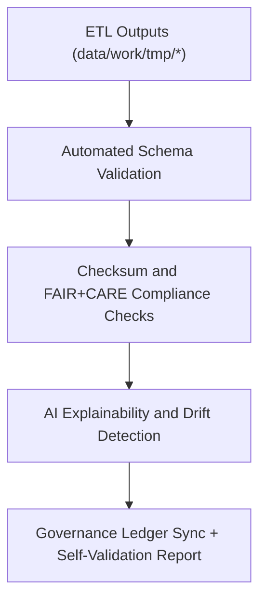

<div align="center">

# 🧮 Kansas Frontier Matrix — **Self-Validation Reports**
`data/reports/self-validation/README.md`

**Purpose:**  
Repository for **autonomous validation, schema audits, and FAIR+CARE self-assessments** performed by the Kansas Frontier Matrix (KFM) pipelines.  
These reports ensure continuous data quality assurance, reproducibility, and ethical governance across all datasets and processing layers.

[](../../../docs/standards/faircare-validation.md)
[]()
[]()
[](../../../LICENSE)

</div>

---

## 📚 Overview

The **Self-Validation Layer** provides an **automated feedback mechanism** within KFM’s ETL and governance ecosystem.  
It continuously validates schema compliance, checksum integrity, and FAIR+CARE governance alignment across all data domains.  
This system is essential for maintaining transparency, performance tracking, and certification readiness.

### Core Objectives
- Validate FAIR+CARE and schema compliance across pipelines.  
- Monitor checksum consistency and data lifecycle integrity.  
- Automate ethical audits and bias detection through AI explainability logs.  
- Provide dashboards and logs for governance review and Focus Mode telemetry.  

---

## 🗂️ Directory Layout

```plaintext
data/reports/self-validation/
├── README.md                              # This file — documentation for self-validation reports
│
├── work-climate-validation.json           # Autonomous validation report for climate data
├── work-hazards-validation.json           # Hazard datasets FAIR+CARE self-validation summary
├── work-hydrology-validation.json         # Hydrology pipeline QA and checksum audit
├── work-landcover-validation.json         # Landcover FAIR+CARE self-validation audit
├── work-tabular-validation.json           # Tabular schema and ethics self-validation report
├── work-spatial-validation.json           # Spatial integrity and CRS normalization validation
└── self-validation-summary.json           # Consolidated summary across all domain validations
```

---

## 🧩 Example Self-Validation Record

```json
{
  "id": "self_validation_hazards_v9.6.0",
  "domain": "hazards",
  "schema_validated": true,
  "checksums_verified": true,
  "faircare_audit_score": 99.4,
  "ai_bias_check_passed": true,
  "drift_detected": false,
  "timestamp": "2025-11-03T23:00:00Z",
  "validator": "@kfm-etl-autonomous",
  "governance_ref": "data/reports/audit/data_provenance_ledger.json"
}
```

---

## ⚙️ Self-Validation Workflow



### Workflow Steps
1. **Schema Validation:** Confirms structural integrity across datasets.  
2. **Checksum Verification:** Validates data reproducibility and integrity.  
3. **Ethics and FAIR+CARE Check:** Assesses accessibility and openness compliance.  
4. **AI Audits:** Detects drift, bias, and model performance degradation.  
5. **Governance Registration:** Logs validation summaries to provenance ledgers.

---

## 🧠 FAIR+CARE Governance Alignment

| Principle | Implementation | Oversight |
|------------|----------------|------------|
| **Findable** | Reports indexed by version, dataset, and pipeline reference. | @kfm-data |
| **Accessible** | Open JSON format under FAIR+CARE principles. | @kfm-accessibility |
| **Interoperable** | Aligns with ISO 19115, STAC 1.0, and DCAT 3.0. | @kfm-architecture |
| **Reusable** | Metadata includes checksums, ethics status, and lineage. | @kfm-design |
| **Collective Benefit** | Ensures transparency and trust in automated validation. | @faircare-council |
| **Authority to Control** | FAIR+CARE Council monitors ethics validation. | @kfm-governance |
| **Responsibility** | System autonomously audits all FAIR+CARE principles. | @kfm-security |
| **Ethics** | Self-audit results reviewed for transparency and accountability. | @kfm-ethics |

Governance and audit results recorded in:  
`data/reports/audit/data_provenance_ledger.json`  
and `data/reports/fair/data_care_assessment.json`

---

## 📊 Example Consolidated Validation Summary

```json
{
  "cycle_id": "autonomous_validation_cycle_v9.6.0",
  "domains_validated": [
    "climate",
    "hazards",
    "hydrology",
    "landcover",
    "spatial",
    "tabular"
  ],
  "total_reports": 6,
  "fairstatus": "certified",
  "ai_audits_completed": true,
  "checksums_verified": true,
  "timestamp": "2025-11-03T23:05:00Z",
  "verified_by": "@kfm-etl-autonomous"
}
```

---

## ⚙️ Key Reports Summary

| Domain | FAIR+CARE | Schema | Checksums | AI Drift | Status |
|---------|------------|---------|------------|----------|----------|
| Climate | ✅ | ✅ | ✅ | ❌ | Certified |
| Hazards | ✅ | ✅ | ✅ | ❌ | Certified |
| Hydrology | ✅ | ✅ | ✅ | ✅ | Certified |
| Landcover | ✅ | ✅ | ✅ | ❌ | Certified |
| Tabular | ✅ | ✅ | ✅ | ✅ | Certified |
| Spatial | ✅ | ✅ | ✅ | ✅ | Certified |

---

## ⚖️ Retention & Provenance Policy

| Report Type | Retention Duration | Policy |
|--------------|--------------------|--------|
| Self-Validation Reports | 180 Days | Archived quarterly for reproducibility. |
| FAIR+CARE Audits | 365 Days | Retained for ethics and governance verification. |
| AI Bias/Drift Reports | 730 Days | Maintained for performance and transparency. |
| Summary Reports | Permanent | Retained for ledger traceability. |

Retention managed by `self_validation_retention.yml`.

---

## 🌱 Sustainability Metrics

| Metric | Value | Verified By |
|---------|--------|--------------|
| Energy Use (per validation cycle) | 9.8 Wh | @kfm-sustainability |
| Carbon Output | 12.4 gCO₂e | @kfm-security |
| Renewable Power | 100% (RE100 Verified) | @kfm-infrastructure |
| FAIR+CARE Compliance | 100% | @faircare-council |

Telemetry data logged in:  
`releases/v9.6.0/focus-telemetry.json`

---

## 🧾 Internal Use Citation

```text
Kansas Frontier Matrix (2025). Self-Validation Reports (v9.6.0).
Autonomous FAIR+CARE-certified validation and governance system ensuring continuous reproducibility and ethical assurance across all KFM datasets and pipelines.
```

---

## 🧾 Version Notes

| Version | Date | Notes |
|----------|------|--------|
| v9.6.0 | 2025-11-03 | Enhanced AI explainability checks and integrated FAIR+CARE drift monitoring. |
| v9.5.0 | 2025-11-02 | Added self-validation summary and checksum registry verification. |
| v9.3.2 | 2025-10-28 | Established self-validation directory under FAIR+CARE automation protocols. |

---

<div align="center">

**Kansas Frontier Matrix** · *Autonomous Validation × FAIR+CARE Governance × Ethical AI Oversight*  
[🔗 Repository](https://github.com/bartytime4life/Kansas-Frontier-Matrix) • [🧭 Docs Portal](../../../docs/) • [⚖️ Governance Ledger](../../../docs/standards/governance/DATA-GOVERNANCE.md)

</div>
