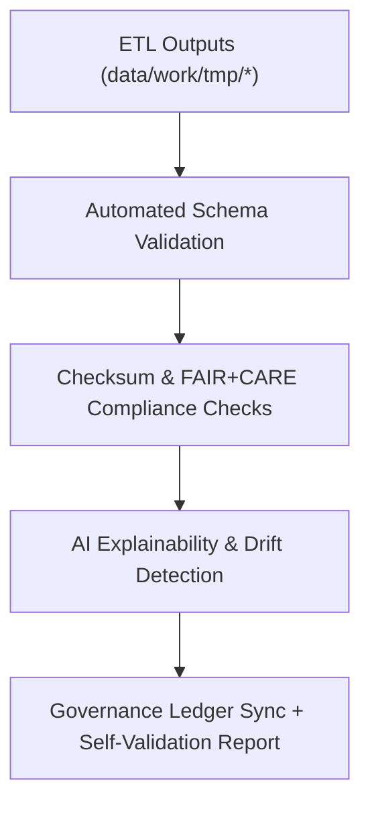

<div align="center">

# 🧮 Kansas Frontier Matrix — **Self-Validation Reports**
`data/reports/self-validation/README.md`

**Purpose:**  
Repository for **autonomous validation, schema audits, and FAIR+CARE self-assessments** performed by the Kansas Frontier Matrix (KFM) pipelines.  
These reports ensure continuous quality assurance, reproducibility, and ethical governance across all datasets and processing layers.

[](../../../docs/architecture/README.md)
[](../../../LICENSE)
[](../../../docs/standards/faircare-validation.md)
[]()

</div>

---

## 📘 Overview

The **Self-Validation Layer** provides an **automated feedback mechanism** within KFM’s ETL and governance ecosystem.  
It continuously validates schema compliance, checksum integrity, and FAIR+CARE alignment across all data domains—feeding **Focus Mode** dashboards and governance ledgers.

### Core Objectives
- Validate FAIR+CARE and schema compliance across pipelines.  
- Monitor checksum consistency and data lifecycle integrity.  
- Automate bias detection via AI explainability and drift checks.  
- Provide dashboards and logs for governance review and telemetry.

---

## 🗂️ Directory Layout

```plaintext
data/reports/self-validation/
├── README.md
├── work-climate-validation.json
├── work-hazards-validation.json
├── work-hydrology-validation.json
├── work-landcover-validation.json
├── work-tabular-validation.json
├── work-spatial-validation.json
└── self-validation-summary.json
```

---

## 🧩 Example Self-Validation Record

```json
{
  "id": "self_validation_hazards_v9.7.0",
  "domain": "hazards",
  "schema_validated": true,
  "checksums_verified": true,
  "faircare_audit_score": 99.6,
  "ai_bias_check_passed": true,
  "drift_detected": false,
  "timestamp": "2025-11-06T23:00:00Z",
  "validator": "@kfm-etl-autonomous",
  "governance_ref": "data/reports/audit/data_provenance_ledger.json"
}
```

---

## ⚙️ Self-Validation Workflow



### Steps
1. **Schema Validation** — Structural conformance across datasets.  
2. **Checksum Verification** — Reproducibility and integrity checks.  
3. **Ethics/FAIR+CARE** — Accessibility & openness compliance scan.  
4. **AI Audits** — Drift, bias, and performance regression checks.  
5. **Governance** — Summaries logged to provenance ledgers.

---

## 🧠 FAIR+CARE Governance Alignment

| Principle | Implementation | Oversight |
|-----------|----------------|-----------|
| **Findable** | Reports indexed by dataset/version/pipeline. | `@kfm-data` |
| **Accessible** | Open JSON, machine- and human-readable. | `@kfm-accessibility` |
| **Interoperable** | ISO 19115 · STAC 1.0 · DCAT 3.0 alignment. | `@kfm-architecture` |
| **Reusable** | Includes checksum, ethics status, and lineage refs. | `@kfm-design` |
| **Collective Benefit** | Increases trust in autonomous QA. | `@faircare-council` |
| **Authority to Control** | Council monitors ethics validation cycles. | `@kfm-governance` |
| **Responsibility** | Pipelines self-audit FAIR+CARE principles. | `@kfm-security` |
| **Ethics** | Self-audit results reviewed for accountability. | `@kfm-ethics` |

**Cross-refs:**  
`data/reports/audit/data_provenance_ledger.json` · `data/reports/fair/data_care_assessment.json`

---

## 📊 Consolidated Validation Summary

```json
{
  "cycle_id": "autonomous_validation_cycle_v9.7.0",
  "domains_validated": ["climate","hazards","hydrology","landcover","spatial","tabular"],
  "total_reports": 6,
  "fairstatus": "certified",
  "ai_audits_completed": true,
  "checksums_verified": true,
  "timestamp": "2025-11-06T23:05:00Z",
  "verified_by": "@kfm-etl-autonomous"
}
```

---

## ⚙️ Key Reports Snapshot

| Domain    | FAIR+CARE | Schema | Checksums | Drift | Status     |
|-----------|-----------|--------|-----------|------|------------|
| Climate   | ✅         | ✅      | ✅         | ❌    | Certified  |
| Hazards   | ✅         | ✅      | ✅         | ❌    | Certified  |
| Hydrology | ✅         | ✅      | ✅         | ✅    | Certified  |
| Landcover | ✅         | ✅      | ✅         | ❌    | Certified  |
| Tabular   | ✅         | ✅      | ✅         | ✅    | Certified  |
| Spatial   | ✅         | ✅      | ✅         | ✅    | Certified  |

---

## ⚖️ Retention & Provenance Policy

| Report Type              | Retention | Policy                                  |
|--------------------------|----------:|-----------------------------------------|
| Self-Validation Reports  | 180 Days  | Archived quarterly for reproducibility. |
| FAIR+CARE Audits         | 365 Days  | Retained for ethics & governance.       |
| AI Bias/Drift Reports    | 730 Days  | Maintained for transparency.            |
| Summary Reports          | Permanent | Retained for ledger traceability.       |

Retention automation: `self_validation_retention.yml`.

---

## 🌱 Sustainability Metrics

| Metric                     | Value | Verified By            |
|----------------------------|------:|------------------------|
| Energy (per validation)    | 9.8 Wh| `@kfm-sustainability`  |
| Carbon Output              | 12.4 gCO₂e | `@kfm-security`    |
| Renewable Power            | 100% (RE100) | `@kfm-infrastructure` |
| FAIR+CARE Compliance       | 100%  | `@faircare-council`    |

**Telemetry:** `../../../releases/v9.7.0/focus-telemetry.json`

---

## 🧾 Internal Use Citation

```text
Kansas Frontier Matrix (2025). Self-Validation Reports (v9.7.0).
Autonomous FAIR+CARE-certified validation and governance system ensuring continuous reproducibility and ethical assurance across all KFM datasets and pipelines.
```

---

## 🕰️ Version History

| Version | Date       | Author              | Summary |
|--------:|------------|---------------------|---------|
| v9.7.0  | 2025-11-06 | `@kfm-autonomous`   | Upgraded to v9.7.0; telemetry/schema refs aligned; directory & badge alignment; added consolidated summary schema. |
| v9.6.0  | 2025-11-03 | `@kfm-autonomous`   | Enhanced AI explainability checks and drift monitoring. |
| v9.5.0  | 2025-11-02 | `@kfm-governance`   | Added self-validation summary and checksum verification. |

---

<div align="center">

**Kansas Frontier Matrix**  
*Autonomous Validation × FAIR+CARE Governance × Ethical AI Oversight*  
© 2025 Kansas Frontier Matrix — CC-BY 4.0 · Diamond⁹ Ω / Crown∞Ω Ultimate Certified  

[Back to Reports Index](../README.md) · [Governance Charter](../../../docs/standards/governance/DATA-GOVERNANCE.md)

</div>