<!-- [KFM_META_BLOCK_V2]
doc_id: kfm://data/reports/settlements-infrastructure/readme
name: Settlements Infrastructure Reports README
path: data/reports/settlements-infrastructure/README.md
type: data-reports-settlements-infrastructure-readme
version: v0.1.0
status: draft
owners:
  - <data-steward>
  - <reports-steward>
  - <settlements-infrastructure-domain-steward>
  - <settlement-identity-steward>
  - <infrastructure-steward>
  - <critical-asset-reviewer>
  - <operator-data-reviewer>
  - <dependency-reviewer>
  - <cultural-sovereignty-reviewer>
  - <source-role-steward>
  - <rights-steward>
  - <sensitivity-steward>
  - <evidence-steward>
  - <proof-steward>
  - <receipt-steward>
  - <catalog-steward>
  - <policy-steward>
  - <release-steward>
  - <docs-steward>
created: 2026-06-29
updated: 2026-06-29
policy_label: restricted-review
truth_posture: cite-or-abstain
responsibility_root: data/
domain: settlements-infrastructure
artifact_family: report-candidate-and-report-support-lane
path_posture: existing-greenfield-stub-replaced; parent-data-reports-readme-is-greenfield-stub; data-readme-lists-reports; directory-rules-data-tree-lists-data-published-reports-not-data-reports; compatibility-or-steward-facing-report-candidate-lane-until-parent-contract-or-adr-resolves; settlements-infrastructure-vs-settlement-segment-conflict-preserved
sensitivity_posture: no-public-path-by-default; report-is-downstream-carrier-not-truth; critical-asset-detail-deny-default; condition-and-vulnerability-detail-restricted; dependency-graphs-restricted; operator-sensitive-context-reviewed; exact-facility-geometry-reviewed; service-availability-not-guaranteed; legal-status-not-certified; municipal-boundary-not-title-proof; private-property-living-person-joins-fail-closed; cultural-sovereignty-and-archaeology-joins-fail-closed; not-emergency-planning-operations-or-life-safety-guidance; evidence-aware; rights-aware; policy-aware; review-aware; release-blocked-until-gates-close
related:
  - ../README.md
  - ../../README.md
  - ../../raw/settlements-infrastructure/README.md
  - ../../work/settlements-infrastructure/README.md
  - ../../quarantine/settlements-infrastructure/README.md
  - ../../processed/settlements-infrastructure/README.md
  - ../../catalog/domain/settlements-infrastructure/README.md
  - ../../registry/sources/settlements-infrastructure/README.md
  - ../../registry/sources/settlements-infrastructure/census-tiger/README.md
  - ../../receipts/settlements-infrastructure/README.md
  - ../../proofs/settlements-infrastructure/README.md
  - ../../published/README.md
  - ../../published/reports/README.md
  - ../../published/settlements-infrastructure/README.md
  - ../../published/layers/settlements-infrastructure/README.md
  - ../../../docs/reports/README.md
  - ../../../docs/domains/settlements-infrastructure/README.md
  - ../../../docs/domains/settlements-infrastructure/DATA_LIFECYCLE.md
  - ../../../docs/domains/settlements-infrastructure/CANONICAL_PATHS.md
  - ../../../docs/domains/settlements-infrastructure/SOURCE_REGISTRY.md
  - ../../../docs/domains/settlements-infrastructure/IDENTITY_MODEL.md
  - ../../../docs/domains/settlements-infrastructure/sublanes/settlements.md
  - ../../../docs/domains/settlements-infrastructure/sublanes/infrastructure.md
  - ../../../docs/domains/roads-rail-trade/README.md
  - ../../../docs/domains/hydrology/README.md
  - ../../../docs/domains/hazards/README.md
  - ../../../docs/domains/people-dna-land/README.md
  - ../../../docs/domains/archaeology/README.md
  - ../../../docs/doctrine/directory-rules.md
  - ../../../contracts/domains/settlements-infrastructure/
  - ../../../schemas/contracts/v1/domains/settlements-infrastructure/
  - ../../../policy/domains/settlements-infrastructure/
  - ../../../policy/sensitivity/settlements-infrastructure/
  - ../../../policy/sensitivity/infrastructure/
  - ../../../policy/rights/
  - ../../../release/
tags:
  - kfm
  - data
  - reports
  - settlements-infrastructure
  - settlements
  - settlement
  - infrastructure
  - municipalities
  - census-places
  - townsites
  - ghost-towns
  - forts
  - missions
  - reservation-communities
  - infrastructure-assets
  - network-nodes
  - network-segments
  - facilities
  - service-areas
  - operators
  - condition-observations
  - dependencies
  - critical-assets
  - report-candidate
  - report-support
  - downstream-carrier
  - source-role
  - temporal-semantics
  - geoprivacy
  - redaction-receipt
  - aggregation-receipt
  - review-record
  - cultural-sovereignty-review
  - archaeology-join
  - living-person-join
  - person-parcel-join
  - not-emergency-guidance
  - not-operations-guidance
  - not-legal-status-certification
  - evidence-first
  - cite-or-abstain
  - proof
  - receipts
  - catalog
  - release-gated
  - rollback
  - no-public-path
notes:
  - "This README replaces the greenfield stub at `data/reports/settlements-infrastructure/README.md`."
  - "The parent `data/reports/README.md` is currently a greenfield stub, so this file is self-bounding and intentionally conservative."
  - "Directory Rules v1.4 lists released report payloads under `data/published/reports/`; this existing `data/reports/settlements-infrastructure/` lane is therefore treated as compatibility, report-candidate, or steward-facing report-support material until parent contract or ADR review resolves the lane."
  - "Settlements/Infrastructure reports are downstream carriers. They do not replace source records, processed data, catalog records, EvidenceBundles, proofs, receipts, source descriptors, sensitivity decisions, policy decisions, release manifests, correction records, rollback records, or generated-answer receipts."
  - "The documented `settlements-infrastructure` versus `settlement` segment conflict is preserved and not resolved by this README."
  - "Critical asset detail, condition/vulnerability data, dependency graphs, operator-sensitive detail, exact facility geometry, private-property/living-person joins, cultural/sovereignty context, archaeology-adjacent locations, and emergency/operations guidance must not be embedded here."
[/KFM_META_BLOCK_V2] -->

<a id="top"></a>

# Settlements / Infrastructure Reports

Report-candidate and report-support lane for Settlements / Infrastructure generated report material that is not yet a released public report payload.

<p>
  
  
  
  
  
  
  
</p>

**Quick links:** [Scope](#scope) · [Path posture](#path-posture) · [Repo fit](#repo-fit) · [Report boundary](#report-boundary) · [Accepted material](#accepted-material) · [Exclusions](#exclusions) · [Settlements / Infrastructure report guardrails](#settlements--infrastructure-report-guardrails) · [Report flow](#report-flow) · [Suggested directory shape](#suggested-directory-shape) · [Required checks](#required-checks-before-use) · [Status notes](#status-notes)

> [!CAUTION]
> `data/reports/settlements-infrastructure/` is not Settlements/Infrastructure truth, not a public report lane, not proof, not receipt storage, not catalog closure, not release authority, not policy authority, not schema authority, not source registry authority, not a sensitivity registry, not facility truth, not municipal legal-status certification, not service-availability authority, not current condition authority, not dependency disclosure, not emergency planning guidance, not operations guidance, not life-safety guidance, and not a direct public API/UI source. Treat it as an existing report-candidate or report-support lane until `data/reports/` receives an accepted parent contract or migration decision.

---

## Scope

`data/reports/settlements-infrastructure/` may hold Settlements/Infrastructure report candidates, generated report-support bundles, report-local indexes, preview summaries, and report assembly sidecars that are derived from governed upstream artifacts but are **not** themselves canonical trust artifacts.

This lane is useful only when a maintainer needs a data-root place to stage, inspect, or assemble Settlements/Infrastructure report material before one of the following governed outcomes:

- a released public report payload under `data/published/reports/`;
- a generated steward-facing narrative under `docs/reports/`;
- a catalog/proof/release-linked report artifact referenced by a governed API, Evidence Drawer, Focus Mode surface, or review console;
- a rejected, quarantined, corrected, superseded, withdrawn, stale-state, or rolled-back report candidate.

Settlements/Infrastructure report material may summarize settlement identity, municipality context, census-place context, townsite/ghost-town context, fort/mission/reservation-community context, public-safe facility context, infrastructure asset context, service-area context, operator context, condition-observation posture, dependency-summary posture, source-role posture, temporal/freshness posture, sensitivity posture, redaction/generalization posture, proof posture, catalog posture, release posture, correction posture, and rollback posture.

A report candidate does **not** make a settlement, municipality, census place, townsite, ghost town, fort, mission, reservation community, infrastructure asset, network node, network segment, facility, service area, operator, condition observation, dependency, legal status, service availability, emergency readiness, public-safe geometry, cultural context, current infrastructure state, or generated narrative true. Consequential claims must remain supported by source descriptors, processed data, catalog records, EvidenceBundles, receipts, policy decisions, review state, release state, correction paths, and rollback targets.

---

## Path posture

The existing target lane is:

```text
data/reports/settlements-infrastructure/
```

The parent currently exists as a greenfield stub:

```text
data/reports/README.md
```

Current placement evidence is mixed:

- `data/README.md` lists `reports` as content that may belong under `data/`.
- `docs/doctrine/directory-rules.md` lists canonical data lifecycle and emitted-proof families, including `data/published/reports/`, but does not establish `data/reports/` as a lifecycle phase in the same way as `raw`, `work`, `quarantine`, `processed`, `catalog`, `triplets`, `published`, `receipts`, `proofs`, `rollback`, and `registry`.
- `data/published/reports/README.md` is the clearer released public report payload lane.
- `docs/reports/README.md` is the clearer generated steward-facing narrative lane.

Therefore this README treats `data/reports/settlements-infrastructure/` as **CONFIRMED path presence / NEEDS VERIFICATION topology**. Do not let this lane become a parallel report authority. If an ADR or parent README later makes `data/reports/` canonical, update this README and migrate child conventions with a rollback plan. If `data/reports/` is retired, migrate report candidates to the correct lifecycle, docs, or published lane.

The Settlements/Infrastructure domain also has a documented segment conflict between `settlements-infrastructure` and `settlement`. This README follows the requested existing `data/reports/settlements-infrastructure/` data path and does **not** resolve the segment conflict.

---

## Repo fit

| Responsibility | Correct home | Boundary |
|---|---|---|
| Settlements/Infrastructure report candidates and report-support bundles | `data/reports/settlements-infrastructure/` | Existing compatibility/steward-facing candidate lane until topology is resolved. |
| Parent reports lane | [`../README.md`](../README.md) | Currently greenfield; does not yet define a full report-family contract. |
| Data root | [`../../README.md`](../../README.md) | Lifecycle data and emitted proof root; reports listed but parent contract remains thin. |
| Processed Settlements/Infrastructure artifacts | [`../../processed/settlements-infrastructure/README.md`](../../processed/settlements-infrastructure/README.md) | Normalized settlement and infrastructure data upstream of catalog/report/public products. |
| Settlements/Infrastructure domain catalog | [`../../catalog/domain/settlements-infrastructure/README.md`](../../catalog/domain/settlements-infrastructure/README.md) | Catalog closure and release-linked discovery records; not report narrative. |
| Settlements/Infrastructure source registry | [`../../registry/sources/settlements-infrastructure/README.md`](../../registry/sources/settlements-infrastructure/README.md) | Source admission, source role, rights, sensitivity, and freshness records; not report payloads. |
| Settlements/Infrastructure receipts | [`../../receipts/settlements-infrastructure/README.md`](../../receipts/settlements-infrastructure/README.md) | Process memory; reports may summarize receipts but must not store or replace them. |
| Settlements/Infrastructure proofs | [`../../proofs/settlements-infrastructure/README.md`](../../proofs/settlements-infrastructure/README.md) | Evidence/proof support; reports cite these, not replace them. |
| Released public report payloads | [`../../published/reports/README.md`](../../published/reports/README.md) | Release-approved report payloads only. |
| Released Settlements/Infrastructure artifacts | [`../../published/settlements-infrastructure/README.md`](../../published/settlements-infrastructure/README.md) | Broader published public-safe artifact lane after release. |
| Released Settlements/Infrastructure map carriers | [`../../published/layers/settlements-infrastructure/README.md`](../../published/layers/settlements-infrastructure/README.md) | Published public-safe map layer carriers; reports may reference them after release. |
| Steward-facing generated narratives | [`../../../docs/reports/README.md`](../../../docs/reports/README.md) | Human-readable generated review/release reports; not data payloads. |
| Settlements/Infrastructure domain doctrine | [`../../../docs/domains/settlements-infrastructure/README.md`](../../../docs/domains/settlements-infrastructure/README.md) | Domain scope, object families, source families, sensitivity posture, lifecycle, and cross-lane boundaries. |
| Settlements/Infrastructure lifecycle doctrine | [`../../../docs/domains/settlements-infrastructure/DATA_LIFECYCLE.md`](../../../docs/domains/settlements-infrastructure/DATA_LIFECYCLE.md) | RAW to PUBLISHED gates and segment-conflict notes. |
| Release decisions | `../../../release/` | ReleaseManifest, PromotionDecision, correction, rollback, withdrawal, stale-state handling, and signatures. |
| Contracts, schemas, policy | `../../../contracts/domains/settlements-infrastructure/`, `../../../schemas/contracts/v1/domains/settlements-infrastructure/`, `../../../policy/domains/settlements-infrastructure/`, `../../../policy/sensitivity/settlements-infrastructure/`, `../../../policy/sensitivity/infrastructure/` or ADR-resolved homes | Meaning, machine shape, and allow/deny/restrict/abstain logic; segment conflict remains outside this README. |

---

## Report boundary

| Rule | Handling |
|---|---|
| Report is a downstream carrier | It can summarize governed artifacts, but it is never root truth. |
| Candidate is not publication | A file here is not public just because it is readable, renderable, mapped, current-looking, or useful for review. |
| Settlement identity is evidence-bound | Place names, census places, municipalities, townsites, ghost towns, forts, missions, and reservation communities retain source role, temporal scope, and evidence limits. |
| Infrastructure reports are not operations | Reports must not issue operational instructions, service guarantees, emergency readiness claims, dispatch guidance, planning guidance, engineering certification, or life-safety guidance. |
| Source roles do not collapse | Observed, regulatory, administrative, modeled, aggregate, candidate, synthetic, context, and restricted-access material must remain visibly distinct. |
| Geometry is not legal proof | Settlement, municipality, census-place, facility, service-area, parcel, PLSS, and derived geometry does not prove legal boundary, ownership, access, service availability, or status by itself. |
| Condition and dependency detail is restricted | Condition observations, vulnerability information, operator-sensitive detail, dependencies, and infrastructure relationships fail closed until policy and review allow a public-safe derivative. |
| Cross-lane truth stays with owning lanes | Roads/Rail owns routes; Hydrology owns water evidence; Hazards owns events/warnings/declarations; People/DNA/Land owns ownership, parcels, and living-person privacy; Archaeology owns sensitive site truth. |
| Public report payloads move through release | Released report payloads belong under `data/published/reports/` with release support. |
| Steward narratives belong under docs | Generated human-readable review/release narratives belong under `docs/reports/`. |
| Proof remains separate | EvidenceBundle, ProofPack, citation validation, review proof, and integrity proof stay in proof lanes. |
| Receipts remain separate | RunReceipt, ValidationReport, RedactionReceipt, AggregationReceipt, ReviewRecord, PolicyDecision, AIReceipt, and release-support receipts stay in receipt/proof lanes. |
| Catalog remains separate | Domain catalog, STAC, DCAT, PROV, and graph/triplet records stay in `data/catalog/` or triplet lanes. |
| Release remains separate | ReleaseManifest, PromotionDecision, CorrectionNotice, RollbackCard, WithdrawalNotice, and signatures stay in `release/`. |
| Policy remains separate | Rights, source-role, sensitivity, critical-asset, operator, dependency, cultural/sovereignty, archaeology-adjacent, privacy, and public-release rules stay in policy roots. |
| AI is not report truth | Generated language must resolve to evidence or abstain; AI summaries require AIReceipt/runtime-envelope support when used in governed flows. |
| Public clients do not read this lane | Public UI/API/report surfaces consume governed APIs, released artifacts, catalog/proof-backed responses, official-source references, and policy-safe envelopes. |

---

## Accepted material

Accepted material is limited to Settlements/Infrastructure report-candidate and report-support files that do not become parallel trust artifacts:

- report-candidate Markdown, HTML, JSON, or PDF-generation source files that are explicitly unreleased and restricted-review;
- report-local indexes that point to processed, catalog, proof, receipt, source registry, release, official-source, and published artifacts without replacing them;
- report assembly sidecars, such as candidate table-of-contents, figure list, public-safe map snapshot index, settlement/place figure index, facility/context figure index, citation draft index, evidence-reference draft index, caveat index, source-role index, freshness/stale-state index, generalization/redaction index, sensitivity-dependency index, review-dependency index, and rollback-dependency index;
- report-local caveat summaries, freshness summaries, source-role summaries, identity-resolution summaries, public-safe geometry summaries, critical-asset review summaries, dependency aggregation summaries, cultural/sovereignty review summaries, official-source redirection summaries, validation summaries, and release-readiness summaries that link to their canonical policy/proof/receipt/review inputs;
- preview artifacts for steward review, clearly marked as candidates and not public release payloads;
- correction, supersession, withdrawal, stale-state, or rollback notes that point to canonical release/proof records rather than replacing them;
- README files explaining local report-candidate boundaries.

All accepted material must preserve source role, object family, identity basis, method, units where applicable, time semantics, uncertainty, caveats, freshness, official-source boundaries, evidence refs, rights posture, sensitivity posture, review posture, release posture, and rollback posture.

---

## Exclusions

| Do not place here | Correct home | Why |
|---|---|---|
| RAW source captures, Census TIGER/GNIS/state-local GIS/municipal exports, historical maps, bridge/facility inventories, operator data, infrastructure feeds, inspection files, service-area data, dependency tables, source media, API dumps, uploaded files, source mirrors, or raw report inputs | `../../raw/settlements-infrastructure/` or governed source lanes | Source-edge captures require immutable source context, rights, checksums, sensitivity, and admission metadata. |
| WORK scratch, transform intermediates, identity-matching outputs, geometry repair outputs, facility joins, dependency graph experiments, redaction/generalization trials, unresolved report candidates, or unreviewed sensitive joins | `../../work/settlements-infrastructure/` or `../../quarantine/settlements-infrastructure/` | Candidate material that has not passed gates belongs upstream or in hold lanes. |
| Normalized Settlements/Infrastructure datasets | `../../processed/settlements-infrastructure/` | Processed data is not a report. |
| Domain catalog, STAC, DCAT, PROV, graph/triplet records, or catalog closure objects | `../../catalog/`, `../../triplets/` | Catalog/graph carriers have their own closure rules. |
| EvidenceBundle, ProofPack, CitationValidationReport, validation proof, review proof, or integrity bundles | `../../proofs/` | Proof is the trust spine; reports cite it. |
| RunReceipt, RedactionReceipt, AggregationReceipt, ValidationReceipt, TransformReceipt, ReviewRecord, PolicyDecision, AIReceipt, or release-support receipts | `../../receipts/settlements-infrastructure/` or accepted receipt/proof lanes | Receipts and review records are process memory and governance state; reports summarize them only. |
| SourceDescriptor, source activation records, sensitivity registry records, rights registry records, or layer registry records | `../../registry/` | Registry/control records belong in registry lanes. |
| ReleaseManifest, PromotionDecision, CorrectionNotice, RollbackCard, WithdrawalNotice, signatures, or release changelog | `../../../release/` | Release decisions are not report candidates. |
| Released public report payloads | `../../published/reports/` | Public report payloads must be release-approved. |
| Generated steward-facing narrative reports | `../../../docs/reports/` | Human-readable generated reports belong in docs. |
| Contracts, schemas, policy rules, validators, tests, code, or workflows | `../../../contracts/`, `../../../schemas/`, `../../../policy/`, `../../../tools/`, `../../../tests/`, `.github/workflows/` | Separate authority roots. |
| Critical asset detail, exact sensitive facility geometry, condition/vulnerability detail, dependency graph detail, operator-sensitive detail, emergency-readiness detail, private-access notes, owner/parcel/living-person joins, or restricted cultural/sovereignty/archaeology-adjacent context | Restricted governed lanes only; public-safe derivative only after policy/review/release | Report formatting must not become a sensitivity, privacy, rights, or safety bypass. |
| Map screenshots, tables, thumbnails, figure captions, graph edges, embeddings, AI text, or narrative cues that reverse-engineer restricted facility, dependency, cultural, archaeology, private-land, or infrastructure detail | Restricted/held lanes only unless public-safe release support exists | Derived carriers can leak restricted detail even when raw coordinates are absent. |
| Emergency guidance, utility operations guidance, planning instructions, service guarantees, engineering certification, legal-status certification, property/title conclusions, land-access advice, dispatch instruction, or life-safety directions | Official authorities outside this report-candidate lane | KFM may provide evidence context, not operational, legal, engineering, or emergency authority. |
| Uncited AI summaries or generated authoritative claims | Governed answer/report generation flow with evidence, policy, and receipts | Generated language is evidence-subordinate. |

---

## Settlements / Infrastructure report guardrails

| Risk | Guardrail |
|---|---|
| Legal-status overclaim | Municipality, census place, settlement, townsite, fort, mission, reservation-community, or service-area claims must preserve source role, issuing authority, effective time, and limitations. |
| Geometry/legal-boundary collapse | Place polygons, municipal boundaries, census geography, service areas, facility points, parcel geometry, PLSS references, and historic footprints do not prove title, ownership, legal boundary, access, service availability, or current status by themselves. |
| Current-status confusion | Facility status, service availability, operator assignment, condition observation, dependency state, and municipal/legal status require source, valid/effective time, retrieval time, report generation time, stale-state, and official-source posture where material. |
| Critical asset exposure | Critical facilities, utilities, bridges, dams, levees, water/wastewater assets, emergency-service assets, communication/power assets, and vulnerable dependencies default to restricted review. |
| Condition/vulnerability leakage | Inspection, condition, vulnerability, outage, capacity, dependency, and resilience details cannot be turned into public report content without policy, review, aggregation/redaction, release, and rollback support. |
| Dependency graph leakage | Asset, facility, service-area, operator, utility, road, hydrology, hazard, and emergency-service dependencies can expose sensitive infrastructure relationships and must fail closed until public-safe. |
| Operator-sensitive drift | Operator names, ownership-like details, maintenance responsibility, service responsibility, and contact or operational detail may be sensitive and must preserve source role and rights posture. |
| Cultural/sovereignty overexposure | ReservationCommunity, mission, fort, archaeology-adjacent, sacred, tribal, cultural, or community-sensitive context inherits the strictest applicable review and public-safe geometry posture. |
| Cross-lane authority confusion | Roads/Rail, Hydrology, Hazards, People/DNA/Land, Archaeology, Agriculture, Habitat, Flora, Fauna, Soil, Geology, and Atmosphere keep their own truth and sensitivity boundaries. |
| Report-as-proof drift | A report may make evidence easier to read; it does not become the evidence. |
| Report-as-release drift | A report may summarize release state; it does not approve release. |

---

## Report flow

```mermaid
flowchart LR
    PROC[Processed Settlements/Infrastructure artifacts] --> CAT[Catalog / triplet closure]
    CAT --> PROOF[EvidenceBundle / proof support]
    PROOF --> REVIEW[Source-role / rights / sensitivity / cultural / infrastructure review]
    REVIEW --> RECEIPT[Receipts: validation, redaction, aggregation, transform, AI, release-support]
    RECEIPT --> POLICY[Policy + public-safe + release decision]
    POLICY --> CAND[Report candidate in data/reports/settlements-infrastructure]
    CAND --> DECISION{Report disposition}
    DECISION -- steward narrative --> DOCS[docs/reports]
    DECISION -- released public payload --> PUB[data/published/reports]
    DECISION -- hold or fail --> HOLD[work / quarantine / correction path]
    PUB --> REL[release manifest + correction + rollback]

    classDef gate fill:#fff3cd,stroke:#8a6d3b,color:#202124;
    classDef hold fill:#f8d7da,stroke:#842029,color:#202124;
    class DECISION gate;
    class HOLD hold;
```



> [!NOTE]
> The diagram is a responsibility map, not proof that generators, validators, payloads, manifests, review records, or CI wiring currently exist.

---

## Suggested directory shape

This shape is **PROPOSED** until `data/reports/` receives an accepted parent contract or migration decision. Do not pre-create empty stubs.

```text
data/reports/settlements-infrastructure/
├── README.md
├── candidates/                         # PROPOSED: unreleased restricted-review report candidates
│   └── <report_slug>/
│       ├── report.candidate.md
│       ├── report.inputs.index.json
│       ├── evidence_refs.candidate.json
│       ├── source_role_refs.candidate.json
│       ├── freshness_refs.candidate.json
│       ├── official_source_refs.candidate.json
│       ├── temporal_refs.candidate.json
│       ├── geometry_refs.candidate.json
│       ├── redaction_refs.candidate.json
│       ├── aggregation_refs.candidate.json
│       ├── sensitivity_refs.candidate.json
│       ├── review_refs.candidate.json
│       ├── citations.candidate.json
│       ├── caveats.candidate.md
│       └── README.md
├── previews/                           # PROPOSED: steward-only rendered previews
│   └── <report_slug>/
├── indexes/                            # PROPOSED: report-local candidate indexes
│   └── settlements-infrastructure.report-candidates.index.json
├── superseded/                         # PROPOSED: retained candidates with lineage
│   └── README.md
└── withdrawn/                          # PROPOSED: withdrawn or denied report candidates
    └── README.md
```

If a candidate is promoted as a public report payload, the released payload belongs under `data/published/reports/` and the release decision belongs under `release/`. If a generator emits steward-facing narrative, the generated report belongs under `docs/reports/`.

---

## Required checks before use

- [ ] Confirm whether `data/reports/` is an accepted report-candidate lane, a compatibility lane, or a migration target.
- [ ] Confirm whether `data/reports/settlements-infrastructure/` should hold candidates, indexes, previews, or should redirect to `docs/reports/` and `data/published/reports/`.
- [ ] Confirm whether the `settlements-infrastructure` versus `settlement` segment conflict affects this report family.
- [ ] Confirm CODEOWNERS for reports, Settlements/Infrastructure, settlement identity, infrastructure, critical-asset review, operator data, dependency review, cultural/sovereignty review, source role, rights, sensitivity, evidence, proof, receipts, catalog, policy, release, and docs review.
- [ ] Confirm every report claim resolves to catalog/proof/evidence or abstains.
- [ ] Confirm report candidates do not store canonical receipts, proofs, review records, release manifests, source descriptors, sensitivity registry records, policy rules, schemas, or processed datasets.
- [ ] Confirm report prose, titles, figures, captions, badges, summaries, indexes, and metadata cannot be mistaken for facility truth, legal-status certification, current service availability, current condition authority, emergency readiness, planning guidance, operations guidance, engineering certification, legal advice, or life-safety guidance.
- [ ] Confirm settlement, municipality, census-place, townsite, ghost-town, fort, mission, reservation-community, infrastructure asset, network, facility, service-area, operator, condition-observation, and dependency claims are not collapsed in report prose, figures, captions, indexes, or metadata.
- [ ] Confirm critical assets, exact sensitive facility geometry, condition/vulnerability detail, dependency graphs, operator-sensitive detail, private-access detail, cultural/sovereignty context, archaeology joins, living-person joins, person-parcel joins, and private-property joins fail closed until policy and review allow public-safe representation.
- [ ] Confirm source role, source vintage, effective time, valid time, retrieval time, release time, correction time, geometry support, uncertainty, rights, and caveats remain visible where material.
- [ ] Confirm Roads/Rail, Hydrology, Hazards, People/DNA/Land, Archaeology, Agriculture, Habitat, Flora, Fauna, Soil, Geology, and Atmosphere joins preserve owning-domain truth and sensitivity boundaries.
- [ ] Confirm AI-generated summaries have evidence references, citation validation, finite outcome, and AIReceipt/runtime envelope support where applicable.
- [ ] Confirm released report payloads are promoted to `data/published/reports/` only after ReleaseManifest, correction path, rollback target, digest, source-role posture, public-safe generalization posture, and citation/evidence closure exist.
- [ ] Confirm generated steward-facing narratives belong in `docs/reports/` rather than this data lane.

---

## Status notes

| Item | Status | Notes |
|---|---:|---|
| Target path presence | CONFIRMED | This README replaces a greenfield stub at `data/reports/settlements-infrastructure/README.md`. |
| Parent reports README | CONFIRMED stub | `data/reports/README.md` exists but does not yet define a report-family contract. |
| Data root reports mention | CONFIRMED | `data/README.md` lists reports, but marks the root status `PROPOSED`. |
| Directory Rules data tree | CONFIRMED doctrine | Current Directory Rules list `data/published/reports/` and the canonical data lifecycle families; `data/reports/` remains topology-NEEDS VERIFICATION. |
| Published reports lane | CONFIRMED README | `data/published/reports/README.md` exists and is the clearer released report payload lane. |
| Docs reports lane | CONFIRMED README | `docs/reports/README.md` exists and is the clearer steward-facing generated narrative lane. |
| Settlements/Infrastructure domain doctrine | CONFIRMED README | `docs/domains/settlements-infrastructure/README.md` establishes object families, source families, cross-lane boundaries, restricted/review default, and domain-segment governance. |
| Settlements/Infrastructure lifecycle doctrine | CONFIRMED README | `docs/domains/settlements-infrastructure/DATA_LIFECYCLE.md` establishes RAW-to-PUBLISHED gates and the `settlements-infrastructure` versus `settlement` conflict. |
| Settlements/Infrastructure processed lane | CONFIRMED README | `data/processed/settlements-infrastructure/README.md` establishes PROCESSED-stage boundaries, object-family posture, source-role preservation, and not-public posture. |
| Settlements/Infrastructure catalog lane | CONFIRMED README | `data/catalog/domain/settlements-infrastructure/README.md` establishes catalog-stage boundaries, evidence/source/policy/release refs, compatibility alias posture, and release-only exposure posture. |
| Settlements/Infrastructure source registry | CONFIRMED README | `data/registry/sources/settlements-infrastructure/README.md` establishes source-admission, source-role, rights, sensitivity, operational-status denial, and no-public-path posture. |
| Settlements/Infrastructure receipts lane | CONFIRMED README | `data/receipts/settlements-infrastructure/README.md` establishes receipt/process-memory boundaries and no-public-path posture. |
| Settlements/Infrastructure proofs lane | CONFIRMED README | `data/proofs/settlements-infrastructure/README.md` establishes proof-support boundaries, critical-asset controls, and not-operational-authority posture. |
| Settlements/Infrastructure published domain lane | CONFIRMED README | `data/published/settlements-infrastructure/README.md` establishes release-gated public-safe carrier posture. |
| Settlements/Infrastructure published layers | CONFIRMED README | `data/published/layers/settlements-infrastructure/README.md` establishes release-gated public-safe layer-carrier posture and critical-asset/cultural review checks. |
| Segment naming | CONFLICTED / NEEDS VERIFICATION | Domain docs preserve `settlements-infrastructure` versus `settlement` conflicts. This README does not resolve them. |
| Actual report payloads | UNKNOWN | This README does not prove report candidates or released reports exist. |
| Generator, validator, review, redaction, aggregation, or CI enforcement | NEEDS VERIFICATION | No generator/validator/review/CI tooling was proven by this edit. |
| Public release readiness | DENY until proven | Report existence here cannot publish Settlements/Infrastructure claims. |

---

## Evidence ledger

| Source | Status | Supports | Limits |
|---|---|---|---|
| Previous target file | CONFIRMED | `data/reports/settlements-infrastructure/README.md` existed as a greenfield stub. | Did not define lane boundaries. |
| [`../README.md`](../README.md) | CONFIRMED stub | Parent `data/reports/` path exists. | Does not yet define report-family authority or canonical topology. |
| [`../../README.md`](../../README.md) | CONFIRMED | `data/` root lists reports among data-root content. | Parent status remains `PROPOSED`; not enough to define report lifecycle semantics. |
| [`../../processed/settlements-infrastructure/README.md`](../../processed/settlements-infrastructure/README.md) | CONFIRMED | Processed Settlements/Infrastructure artifacts are upstream of catalog/reports/release and not public by default. | Does not prove report payloads or generators exist. |
| [`../../catalog/domain/settlements-infrastructure/README.md`](../../catalog/domain/settlements-infrastructure/README.md) | CONFIRMED | Domain catalog lane, evidence/source/policy/release refs, compatibility alias posture, and release-only exposure posture. | Catalog records are not report payloads. |
| [`../../registry/sources/settlements-infrastructure/README.md`](../../registry/sources/settlements-infrastructure/README.md) | CONFIRMED | Source-admission boundary, source-role preservation, rights/sensitivity posture, operational-status denial, and no-public-path posture. | Source registry records do not authorize publication or report release. |
| [`../../receipts/settlements-infrastructure/README.md`](../../receipts/settlements-infrastructure/README.md) | CONFIRMED | Receipt/process-memory boundary, source-role and sensitive-join posture, no-public-path posture, and receipt-not-proof separation. | Receipts are not proof, catalog, reports, policy, or release authority. |
| [`../../proofs/settlements-infrastructure/README.md`](../../proofs/settlements-infrastructure/README.md) | CONFIRMED | Proof-support posture, source-role separation, critical-asset controls, condition/dependency controls, and not-operational-authority boundary. | Proof lane does not publish report payloads or release artifacts. |
| [`../../published/reports/README.md`](../../published/reports/README.md) | CONFIRMED | Released report payload lane under `data/published/`. | Does not create `data/reports/` authority. |
| [`../../published/settlements-infrastructure/README.md`](../../published/settlements-infrastructure/README.md) | CONFIRMED | Released public-safe Settlements/Infrastructure carrier boundary and publication gates. | Does not prove report payloads or public report release. |
| [`../../published/layers/settlements-infrastructure/README.md`](../../published/layers/settlements-infrastructure/README.md) | CONFIRMED | Released public-safe Settlements/Infrastructure map-carrier boundary, sensitive-review posture, public-safe artifacts, and release checks. | Layer README does not prove report payloads or public report release. |
| [`../../../docs/reports/README.md`](../../../docs/reports/README.md) | CONFIRMED | Generated steward-facing report narrative lane. | Docs reports are not public report payloads or trust artifacts. |
| [`../../../docs/domains/settlements-infrastructure/README.md`](../../../docs/domains/settlements-infrastructure/README.md) | CONFIRMED doctrine / PROPOSED implementation | Settlements/Infrastructure scope, object families, source-role posture, cross-lane boundaries, trust membrane, source families, and restricted/review posture. | Some implementation paths are explicitly PROPOSED/NEEDS VERIFICATION. |
| [`../../../docs/domains/settlements-infrastructure/DATA_LIFECYCLE.md`](../../../docs/domains/settlements-infrastructure/DATA_LIFECYCLE.md) | CONFIRMED doctrine / PROPOSED implementation | RAW-to-PUBLISHED invariant, failure-closed gates, object families, source families, sensitivity holds, and segment conflict. | Does not prove runtime enforcement or actual releases. |
| [`../../../docs/doctrine/directory-rules.md`](../../../docs/doctrine/directory-rules.md) | CONFIRMED doctrine | Responsibility-root, lifecycle, domain-segment, published-reports, compatibility-root, and release-vs-published separation. | `data/reports/` topology still needs parent contract or ADR review. |

[Back to top](#top)
