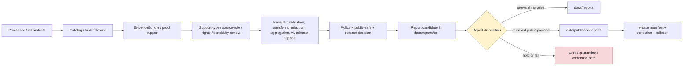

<!-- [KFM_META_BLOCK_V2]
doc_id: kfm://data/reports/soil/readme
name: Soil Reports README
path: data/reports/soil/README.md
type: data-reports-soil-readme
version: v0.1.0
status: draft
owners:
  - <data-steward>
  - <reports-steward>
  - <soil-domain-steward>
  - <soil-survey-steward>
  - <soil-moisture-steward>
  - <interpretation-steward>
  - <source-role-steward>
  - <rights-steward>
  - <sensitivity-steward>
  - <evidence-steward>
  - <proof-steward>
  - <receipt-steward>
  - <catalog-steward>
  - <policy-steward>
  - <release-steward>
  - <docs-steward>
created: 2026-06-29
updated: 2026-06-29
policy_label: restricted-review
truth_posture: cite-or-abstain
responsibility_root: data/
domain: soil
artifact_family: report-candidate-and-report-support-lane
path_posture: existing-greenfield-stub-replaced; parent-data-reports-readme-is-greenfield-stub; data-readme-lists-reports; directory-rules-data-tree-lists-data-published-reports-not-data-reports; compatibility-or-steward-facing-report-candidate-lane-until-parent-contract-or-adr-resolves; soil-segment-confirmed-in-canonical-paths
sensitivity_posture: no-public-path-by-default; report-is-downstream-carrier-not-truth; support-type-separation-required; source-role-preserving; map-unit-not-field-truth; component-not-horizon; horizon-property-not-map-unit-property-without-derivation; gssurgo-not-static-survey-truth; station-reading-not-area-truth; satellite-grid-not-station-truth; pedon-not-parcel-or-field-truth; suitability-not-crop-yield-truth; hydrologic-soil-group-not-flood-truth; erosion-risk-not-hazard-declaration; not-agronomic-prescription; not-field-verification; not-conservation-compliance; farm-owner-operational-proprietary-detail-fail-closed; evidence-aware; rights-aware; policy-aware; release-blocked-until-gates-close
related:
  - ../README.md
  - ../../README.md
  - ../../raw/soil/README.md
  - ../../work/soil/README.md
  - ../../quarantine/soil/README.md
  - ../../processed/soil/README.md
  - ../../catalog/domain/soil/README.md
  - ../../registry/sources/soil/README.md
  - ../../registry/soil/README.md
  - ../../registry/soil/sources/README.md
  - ../../receipts/soil/README.md
  - ../../proofs/soil/README.md
  - ../../published/README.md
  - ../../published/reports/README.md
  - ../../published/soil/README.md
  - ../../published/layers/soil/README.md
  - ../../../docs/reports/README.md
  - ../../../docs/domains/soil/README.md
  - ../../../docs/domains/soil/CANONICAL_PATHS.md
  - ../../../docs/domains/soil/DATA_LIFECYCLE.md
  - ../../../docs/domains/soil/ARCHITECTURE.md
  - ../../../docs/domains/soil/API_CONTRACTS.md
  - ../../../docs/sources/catalog/nrcs/README.md
  - ../../../docs/sources/catalog/nrcs/ssurgo.md
  - ../../../docs/sources/catalog/nrcs/gssurgo.md
  - ../../../docs/sources/catalog/nrcs/gnatsgo.md
  - ../../../docs/sources/catalog/nrcs/soil-data-access.md
  - ../../../docs/doctrine/directory-rules.md
  - ../../../contracts/domains/soil/
  - ../../../schemas/contracts/v1/domains/soil/
  - ../../../schemas/contracts/v1/soil/
  - ../../../policy/domains/soil/
  - ../../../policy/sensitivity/soil/
  - ../../../policy/rights/
  - ../../../release/
tags:
  - kfm
  - data
  - reports
  - soil
  - ssurgo
  - sda
  - gssurgo
  - gnatsgo
  - statsgo2
  - soil-map-unit
  - soil-component
  - horizon
  - soil-property
  - hydrologic-soil-group
  - soil-moisture
  - station-observation
  - satellite-grid
  - pedon
  - soil-profile
  - erosion-risk
  - suitability-rating
  - component-horizon-join
  - soil-time-caveat
  - report-candidate
  - report-support
  - downstream-carrier
  - support-type
  - source-role
  - survey-lineage
  - mukey
  - cokey
  - chkey
  - datum
  - units
  - depth
  - time-caveat
  - rights
  - sensitivity
  - not-field-verification
  - not-conservation-compliance
  - not-agronomic-prescription
  - evidence-first
  - cite-or-abstain
  - proof
  - receipts
  - catalog
  - release-gated
  - rollback
  - no-public-path
notes:
  - "This README replaces the greenfield stub at `data/reports/soil/README.md`."
  - "The parent `data/reports/README.md` is currently a greenfield stub, so this file is self-bounding and intentionally conservative."
  - "Directory Rules v1.4 lists released report payloads under `data/published/reports/`; this existing `data/reports/soil/` lane is therefore treated as compatibility, report-candidate, or steward-facing report-support material until parent contract or ADR review resolves the lane."
  - "Soil reports are downstream carriers. They do not replace source records, processed data, catalog records, EvidenceBundles, proofs, receipts, source descriptors, sensitivity decisions, policy decisions, release manifests, correction records, rollback records, or generated-answer receipts."
  - "Support-type separation is mandatory: static survey, gridded derivative, station reading, satellite grid, pedon evidence, and interpretation cannot masquerade as one surface."
  - "Farm-specific, owner-specific, proprietary, unpublished, operational sensor, field-specific, parcel-adjacent, conservation-compliance, and agronomic-prescription detail must not be embedded here unless explicit evidence, rights, policy, review, release, correction, and rollback support allow a public-safe derivative."
[/KFM_META_BLOCK_V2] -->

<a id="top"></a>

# Soil Reports

Report-candidate and report-support lane for Soil-domain generated report material that is not yet a released public report payload.

<p>
  
  
  
  
  
  
  
</p>

**Quick links:** [Scope](#scope) · [Path posture](#path-posture) · [Repo fit](#repo-fit) · [Report boundary](#report-boundary) · [Accepted material](#accepted-material) · [Exclusions](#exclusions) · [Soil report guardrails](#soil-report-guardrails) · [Report flow](#report-flow) · [Suggested directory shape](#suggested-directory-shape) · [Required checks](#required-checks-before-use) · [Status notes](#status-notes)

> [!CAUTION]
> `data/reports/soil/` is not Soil truth, not a public report lane, not proof, not receipt storage, not catalog closure, not release authority, not policy authority, not schema authority, not source registry authority, not survey authority, not field verification, not conservation-compliance evidence, not agronomic prescription, not crop/yield truth, not flood/water authority, not geology/lithology authority, not parcel/title/property evidence, not engineering certification, not life-safety guidance, and not a direct public API/UI source. Treat it as an existing report-candidate or report-support lane until `data/reports/` receives an accepted parent contract or migration decision.

---

## Scope

`data/reports/soil/` may hold Soil-domain report candidates, generated report-support bundles, report-local indexes, preview summaries, and report assembly sidecars that are derived from governed upstream artifacts but are **not** themselves canonical trust artifacts.

This lane is useful only when a maintainer needs a data-root place to stage, inspect, or assemble Soil report material before one of the following governed outcomes:

- a released public report payload under `data/published/reports/`;
- a generated steward-facing narrative under `docs/reports/`;
- a catalog/proof/release-linked report artifact referenced by a governed API, Evidence Drawer, Focus Mode surface, or review console;
- a rejected, quarantined, corrected, superseded, withdrawn, stale-state, or rolled-back report candidate.

Soil report material may summarize soil survey coverage, SSURGO/SDA/gSSURGO/gNATSGO source posture, map-unit context, component context, horizon context, component-horizon lineage, soil-property summaries, Hydrologic Soil Group context, soil-moisture observation context, station/satellite/pedon support posture, erosion-risk context, suitability-rating context, soil time caveats, support-type posture, source-role posture, temporal/freshness posture, sensitivity posture, redaction/generalization posture, proof posture, catalog posture, release posture, correction posture, and rollback posture.

A report candidate does **not** make a soil map unit, component, horizon, soil property, Hydrologic Soil Group, soil-moisture observation, pedon/profile view, gridded derivative, satellite grid, erosion risk, suitability rating, time caveat, public-safe geometry, field condition, farm-specific interpretation, conservation-compliance outcome, crop/yield claim, hydrologic/flood claim, geologic/lithology claim, parcel/title claim, agronomic conclusion, engineering conclusion, or generated narrative true. Consequential claims must remain supported by source descriptors, processed data, catalog records, EvidenceBundles, receipts, policy decisions, review state, release state, correction paths, and rollback targets.

---

## Path posture

The existing target lane is:

```text
data/reports/soil/
```

The parent currently exists as a greenfield stub:

```text
data/reports/README.md
```

Current placement evidence is mixed:

- `data/README.md` lists `reports` as content that may belong under `data/`.
- `docs/doctrine/directory-rules.md` lists canonical data lifecycle and emitted-proof families, including `data/published/reports/`, but does not establish `data/reports/` as a lifecycle phase in the same way as `raw`, `work`, `quarantine`, `processed`, `catalog`, `triplets`, `published`, `receipts`, `proofs`, `rollback`, and `registry`.
- `data/published/reports/README.md` is the clearer released public report payload lane.
- `docs/reports/README.md` is the clearer generated steward-facing narrative lane.
- `docs/domains/soil/CANONICAL_PATHS.md` confirms `soil` as the domain segment and lists Soil as a lane under responsibility roots, not as a top-level root.

Therefore this README treats `data/reports/soil/` as **CONFIRMED path presence / NEEDS VERIFICATION topology**. Do not let this lane become a parallel report authority. If an ADR or parent README later makes `data/reports/` canonical, update this README and migrate child conventions with a rollback plan. If `data/reports/` is retired, migrate report candidates to the correct lifecycle, docs, or published lane.

---

## Repo fit

| Responsibility | Correct home | Boundary |
|---|---|---|
| Soil report candidates and report-support bundles | `data/reports/soil/` | Existing compatibility/steward-facing candidate lane until topology is resolved. |
| Parent reports lane | [`../README.md`](../README.md) | Currently greenfield; does not yet define a full report-family contract. |
| Data root | [`../../README.md`](../../README.md) | Lifecycle data and emitted proof root; reports listed but parent contract remains thin. |
| Processed Soil artifacts | [`../../processed/soil/README.md`](../../processed/soil/README.md) | Normalized Soil data upstream of catalog/report/public products. |
| Soil domain catalog | [`../../catalog/domain/soil/README.md`](../../catalog/domain/soil/README.md) | Catalog closure and release-linked discovery records; not report narrative. |
| Soil source registry | [`../../registry/sources/soil/README.md`](../../registry/sources/soil/README.md) | Source admission, source role, rights, sensitivity, scale, resolution, and freshness records; not report payloads. |
| Soil receipts | [`../../receipts/soil/README.md`](../../receipts/soil/README.md) | Process memory; reports may summarize receipts but must not store or replace them. |
| Soil proofs | [`../../proofs/soil/README.md`](../../proofs/soil/README.md) | Evidence/proof support; reports cite these, not replace them. |
| Released public report payloads | [`../../published/reports/README.md`](../../published/reports/README.md) | Release-approved report payloads only. |
| Released Soil artifacts | [`../../published/soil/README.md`](../../published/soil/README.md) | Broader published public-safe Soil artifact lane after release. |
| Released Soil map carriers | [`../../published/layers/soil/README.md`](../../published/layers/soil/README.md) | Published public-safe map layer carriers; reports may reference them after release. |
| Steward-facing generated narratives | [`../../../docs/reports/README.md`](../../../docs/reports/README.md) | Human-readable generated review/release reports; not data payloads. |
| Soil canonical path doctrine | [`../../../docs/domains/soil/CANONICAL_PATHS.md`](../../../docs/domains/soil/CANONICAL_PATHS.md) | Domain segment, responsibility-root posture, lifecycle map, and placement checks. |
| Soil lifecycle doctrine | [`../../../docs/domains/soil/DATA_LIFECYCLE.md`](../../../docs/domains/soil/DATA_LIFECYCLE.md) | Soil object/source families, cross-lane boundaries, sensitivity posture, and lifecycle orientation. |
| Release decisions | `../../../release/` | ReleaseManifest, PromotionDecision, correction, rollback, withdrawal, stale-state handling, and signatures. |
| Contracts, schemas, policy | `../../../contracts/domains/soil/`, `../../../schemas/contracts/v1/domains/soil/`, `../../../schemas/contracts/v1/soil/`, `../../../policy/domains/soil/`, `../../../policy/sensitivity/soil/`, `../../../policy/rights/` or ADR-resolved homes | Meaning, machine shape, and allow/deny/restrict/abstain logic; reports only cite policy outcomes. |

---

## Report boundary

| Rule | Handling |
|---|---|
| Report is a downstream carrier | It can summarize governed artifacts, but it is never root truth. |
| Candidate is not publication | A file here is not public just because it is readable, renderable, mapped, current-looking, or useful for review. |
| Support types do not collapse | Static survey, gridded derivative, station reading, satellite grid, pedon evidence, and interpretation must remain visibly distinct. |
| Source roles do not collapse | Authoritative static survey, query API output, gridded derivative, station observation, satellite product, modeled surface, pedon evidence, and interpretation/context material must retain source role. |
| Soil reports are not field verification | A report may summarize source-backed soil context; it does not certify current field conditions, parcel outcomes, conservation compliance, or farm-specific results. |
| Soil reports are not prescriptions | Suitability, erosion context, hydrologic group, and property summaries are not agronomic prescriptions, engineering certifications, or legal/compliance determinations. |
| Public report payloads move through release | Released report payloads belong under `data/published/reports/` with release support. |
| Steward narratives belong under docs | Generated human-readable review/release narratives belong under `docs/reports/`. |
| Proof remains separate | EvidenceBundle, ProofPack, citation validation, lineage proof, and integrity proof stay in proof lanes. |
| Receipts remain separate | RunReceipt, ValidationReport, TransformReceipt, RedactionReceipt, AggregationReceipt, ReviewRecord, PolicyDecision, AIReceipt, and release-support receipts stay in receipt/proof lanes. |
| Catalog remains separate | Domain catalog, STAC, DCAT, PROV, and graph/triplet records stay in `data/catalog/` or triplet lanes. |
| Release remains separate | ReleaseManifest, PromotionDecision, CorrectionNotice, RollbackCard, WithdrawalNotice, and signatures stay in `release/`. |
| Policy remains separate | Rights, source-role, support-type, sensitivity, field/owner exposure, geoprivacy, publication, and release rules stay in policy roots. |
| AI is not report truth | Generated language must resolve to evidence or abstain; AI summaries require AIReceipt/runtime-envelope support when used in governed flows. |
| Public clients do not read this lane | Public UI/API/report surfaces consume governed APIs, released artifacts, catalog/proof-backed responses, official-source references where needed, and policy-safe envelopes. |

---

## Accepted material

Accepted material is limited to Soil report-candidate and report-support files that do not become parallel trust artifacts:

- report-candidate Markdown, HTML, JSON, or PDF-generation source files that are explicitly unreleased;
- report-local indexes that point to processed, catalog, proof, receipt, source registry, release, official-source, and published artifacts without replacing them;
- report assembly sidecars, such as candidate table-of-contents, figure list, public-safe map snapshot index, soil-profile figure index, hydrograph-adjacent caveat index, citation draft index, evidence-reference draft index, caveat index, source-role index, support-type index, time-caveat index, datum/unit/depth index, sensitivity-dependency index, and review-dependency index;
- report-local caveat summaries, support-type summaries, source-role summaries, survey-lineage summaries, MUKEY/COKEY/CHKEY lineage summaries, component-horizon summaries, datum/unit/depth summaries, observation/valid/retrieval/release time summaries, validation summaries, sensitivity summaries, and release-readiness summaries that link to their canonical policy/proof/receipt inputs;
- preview artifacts for steward review, clearly marked as candidates and not public release payloads;
- correction, supersession, withdrawal, stale-state, or rollback notes that point to canonical release/proof records rather than replacing them;
- README files explaining local report-candidate boundaries.

All accepted material must preserve source role, support type, method, units, depth interval, time semantics, uncertainty, caveats, freshness, rights posture, evidence refs, review posture, release posture, and rollback posture.

---

## Exclusions

| Do not place here | Correct home | Why |
|---|---|---|
| RAW source captures, SSURGO/SDA/gSSURGO/gNATSGO/STATSGO2 packages, NRCS table extracts, station feeds, satellite rasters, SoilGrids/model surfaces, pedon files, source media, API dumps, uploaded files, source mirrors, or raw report inputs | `../../raw/soil/` or governed source lanes | Source-edge captures require immutable source context, rights, checksums, sensitivity, and admission metadata. |
| WORK scratch, transform intermediates, MUKEY/COKEY/CHKEY joins, geometry repair outputs, raster/vector derivation, unit/depth normalization scratch, support-type experiments, redaction/generalization trials, unresolved report candidates, or unreviewed sensitive joins | `../../work/soil/` or `../../quarantine/soil/` | Candidate material that has not passed gates belongs upstream or in hold lanes. |
| Normalized Soil datasets | `../../processed/soil/` | Processed data is not a report. |
| Domain catalog, STAC, DCAT, PROV, or graph/triplet records | `../../catalog/`, `../../triplets/` | Catalog/graph carriers have their own closure rules. |
| EvidenceBundle, ProofPack, CitationValidationReport, validation proof, lineage proof, or integrity bundles | `../../proofs/` | Proof is the trust spine; reports cite it. |
| RunReceipt, ValidationReceipt, TransformReceipt, RedactionReceipt, AggregationReceipt, ReviewRecord, PolicyDecision, AIReceipt, or release-support receipts | `../../receipts/soil/` or accepted receipt/proof lanes | Receipts and review records are process memory and governance state; reports summarize them only. |
| SourceDescriptor, source activation records, rights registry records, source-family registry records, sensitivity registry records, or layer registry records | `../../registry/` | Registry/control records belong in registry lanes. |
| ReleaseManifest, PromotionDecision, CorrectionNotice, RollbackCard, WithdrawalNotice, signatures, or release changelog | `../../../release/` | Release decisions are not report candidates. |
| Released public report payloads | `../../published/reports/` | Public report payloads must be release-approved. |
| Generated steward-facing narrative reports | `../../../docs/reports/` | Human-readable generated reports belong in docs. |
| Contracts, schemas, policy rules, validators, tests, code, or workflows | `../../../contracts/`, `../../../schemas/`, `../../../policy/`, `../../../tools/`, `../../../tests/`, `.github/workflows/` | Separate authority roots. |
| Field verification, farm-specific interpretation, owner-specific data, proprietary records, operational sensor detail, conservation-compliance findings, legal/title conclusions, parcel-specific conclusions, agronomic prescriptions, engineering certifications, or life-safety directions | Official authorities or restricted governed lanes outside this report-candidate lane | KFM Soil may provide evidence context, not operational, legal, agronomic, or compliance authority. |
| Map screenshots, tables, thumbnails, figure captions, graph edges, embeddings, AI text, or narrative cues that reverse-engineer farm/owner/private sensor/proprietary/parcel-specific detail | Restricted/held lanes only unless public-safe release support exists | Derived carriers can leak restricted detail even when raw fields are absent. |
| Uncited AI summaries or generated authoritative claims | Governed answer/report generation flow with evidence, policy, and receipts | Generated language is evidence-subordinate. |

---

## Soil report guardrails

| Risk | Guardrail |
|---|---|
| Survey/current-condition collapse | SSURGO/SDA static survey products are not real-time field conditions, current land management, compliance findings, or parcel outcomes. |
| Support-type collapse | Static survey, gridded derivative, station observation, satellite grid, pedon evidence, modeled surface, and interpretation must remain separate in prose, figures, captions, tables, indexes, and metadata. |
| Map-unit/component/horizon collapse | A map unit is not a component; a component is not a horizon; a horizon property is not a map-unit or parcel property without reviewed derivation. |
| Gridded/static-survey collapse | gSSURGO, gNATSGO, SoilGrids, or other gridded derivatives are not identical to source survey polygons and must carry resolution, method, and derivation caveats. |
| Station/area collapse | A station reading or sensor depth is not an area-wide soil-moisture truth. Station, depth, cadence, QC, and observed/retrieved/released time must remain visible. |
| Satellite/station collapse | Satellite grids and remote-sensing products are not station observations, pedon evidence, or field verification without reviewed transformation and caveats. |
| Pedon/field collapse | A pedon or profile view is evidence at a profile/support point; it does not certify parcel, field, component, or map-unit conditions by itself. |
| Hydrologic group/flood collapse | Hydrologic Soil Group is runoff-potential context, not flood truth, NFHL truth, groundwater truth, streamflow truth, or hydrologic model authority. |
| Suitability/crop-yield collapse | Suitability ratings are interpretive context, not crop yield truth, crop management prescription, conservation-compliance proof, or agronomic advice. |
| Erosion/hazard collapse | Erosion risk is interpretive soil context, not a Hazards declaration, engineering certification, emergency warning, or legal/regulatory determination. |
| Aggregate/per-place collapse | County, survey-area, HUC, field, component-percentage, map-unit, or grid rollups cannot be reported as exact per-place or per-parcel truth. |
| Datum/unit/depth flattening | Soil properties, moisture observations, horizons, profiles, and derived interpretations must preserve units, methods, depth intervals, qualifiers, no-data states, and conversion/aggregation methods where material. |
| Temporal flattening | Source vintage, observed time, valid/effective time, retrieval time, release time, correction time, stale-state, and model-run time must remain distinct where material. |
| Sensitive exposure leakage | Farm-specific, owner-specific, private-land, operational sensor, proprietary, conservation-practice, parcel/person, rare-species, archaeology, or infrastructure joins fail closed until policy and review allow public-safe representation. |
| Cross-lane authority confusion | Agriculture owns crop/yield and farm-management claims; Hydrology/Hazards own water/flood/hazard claims; Geology owns lithology/borehole/stratigraphy; Habitat/Flora/Fauna own ecology truth; People/Land owns parcel/person/title claims. |
| Report-as-proof drift | A report may make evidence easier to read; it does not become the evidence. |
| Report-as-release drift | A report may summarize release state; it does not approve release. |

---

## Report flow



> [!NOTE]
> The diagram is a responsibility map, not proof that generators, validators, payloads, manifests, review records, or CI wiring currently exist.

---

## Suggested directory shape

This shape is **PROPOSED** until `data/reports/` receives an accepted parent contract or migration decision. Do not pre-create empty stubs.

```text
data/reports/soil/
├── README.md
├── candidates/                         # PROPOSED: unreleased report candidates
│   └── <report_slug>/
│       ├── report.candidate.md
│       ├── report.inputs.index.json
│       ├── evidence_refs.candidate.json
│       ├── source_role_refs.candidate.json
│       ├── support_type_refs.candidate.json
│       ├── survey_lineage_refs.candidate.json
│       ├── component_horizon_refs.candidate.json
│       ├── datum_unit_depth_refs.candidate.json
│       ├── time_caveat_refs.candidate.json
│       ├── sensitivity_refs.candidate.json
│       ├── citations.candidate.json
│       ├── caveats.candidate.md
│       └── README.md
├── previews/                           # PROPOSED: steward-only rendered previews
│   └── <report_slug>/
├── indexes/                            # PROPOSED: report-local candidate indexes
│   └── soil.report-candidates.index.json
├── superseded/                         # PROPOSED: retained candidates with lineage
│   └── README.md
└── withdrawn/                          # PROPOSED: withdrawn or denied report candidates
    └── README.md
```

If a candidate is promoted as a public report payload, the released payload belongs under `data/published/reports/` and the release decision belongs under `release/`. If a generator emits steward-facing narrative, the generated report belongs under `docs/reports/`.

---

## Required checks before use

- [ ] Confirm whether `data/reports/` is an accepted report-candidate lane, a compatibility lane, or a migration target.
- [ ] Confirm whether `data/reports/soil/` should hold candidates, indexes, previews, or should redirect to `docs/reports/` and `data/published/reports/`.
- [ ] Confirm CODEOWNERS for reports, Soil, soil survey, soil moisture, interpretations, source role, support type, rights, sensitivity, evidence, proof, receipts, catalog, policy, release, and docs review.
- [ ] Confirm every report claim resolves to catalog/proof/evidence or abstains.
- [ ] Confirm report candidates do not store canonical receipts, proofs, review records, release manifests, source descriptors, sensitivity registry records, policy rules, schemas, or processed datasets.
- [ ] Confirm report prose, titles, figures, captions, badges, summaries, indexes, and metadata cannot be mistaken for field verification, conservation compliance, agronomic prescription, crop/yield truth, flood/water authority, geology/lithology authority, parcel/title proof, legal advice, engineering certification, emergency guidance, or life-safety guidance.
- [ ] Confirm static survey, gridded derivative, station observation, satellite grid, pedon/profile, interpretation, model-derived surface, aggregate summary, candidate record, and generated summary are not collapsed in report prose, figures, captions, indexes, or metadata.
- [ ] Confirm MUKEY, COKEY, CHKEY, survey area, source vintage, product version, support type, source role, geometry support, derivation path, method, units, depth interval, quality flags, uncertainty, caveats, and allowed claims remain visible where material.
- [ ] Confirm source, observed, valid/effective, retrieval, release, correction, stale-state, provisional/final, and model-run times remain distinct where material.
- [ ] Confirm farm-specific, owner-specific, proprietary, unpublished, operational sensor, parcel/person, conservation-practice, rare-species, archaeology, infrastructure, private-property, and security-adjacent joins fail closed until policy and review allow public-safe representation.
- [ ] Confirm Agriculture, Hydrology, Hazards, Geology, Habitat, Flora, Fauna, Archaeology, Roads/Rail, Settlements/Infrastructure, and People/Land joins preserve owning-domain truth and sensitivity boundaries.
- [ ] Confirm AI-generated summaries have evidence references, citation validation, finite outcome, and AIReceipt/runtime envelope support where applicable.
- [ ] Confirm released report payloads are promoted to `data/published/reports/` only after ReleaseManifest, correction path, rollback target, digest, support-type posture, source-role posture, time-caveat posture, rights posture, and citation/evidence closure exist.
- [ ] Confirm generated steward-facing narratives belong in `docs/reports/` rather than this data lane.

---

## Status notes

| Item | Status | Notes |
|---|---:|---|
| Target path presence | CONFIRMED | This README replaces a greenfield stub at `data/reports/soil/README.md`. |
| Parent reports README | CONFIRMED stub | `data/reports/README.md` exists but does not yet define a report-family contract. |
| Data root reports mention | CONFIRMED | `data/README.md` lists reports, but marks the root status `PROPOSED`. |
| Directory Rules data tree | CONFIRMED doctrine | Current Directory Rules list `data/published/reports/` and the canonical data lifecycle families; `data/reports/` remains topology-NEEDS VERIFICATION. |
| Published reports lane | CONFIRMED README | `data/published/reports/README.md` exists and is the clearer released report payload lane. |
| Docs reports lane | CONFIRMED README | `docs/reports/README.md` exists and is the clearer steward-facing generated narrative lane. |
| Soil canonical-path doctrine | CONFIRMED README | `docs/domains/soil/CANONICAL_PATHS.md` confirms `soil` as the domain segment and shows Soil belongs under responsibility roots, not as a root folder. |
| Soil lifecycle doctrine | CONFIRMED README | `docs/domains/soil/DATA_LIFECYCLE.md` establishes Soil object families, source families, support-type separation, sensitivity posture, and cross-lane boundaries. |
| Soil processed lane | CONFIRMED README | `data/processed/soil/README.md` establishes PROCESSED-stage boundaries, object-family posture, support-type preservation, and not-public posture. |
| Soil catalog lane | CONFIRMED README | `data/catalog/domain/soil/README.md` establishes catalog-stage boundaries, support-type rules, evidence/source/policy/release refs, and release-only exposure posture. |
| Soil source registry | CONFIRMED README | `data/registry/sources/soil/README.md` establishes source-admission, source-role, support-type, scale/resolution, sensitivity, rights, and no-public-path posture. |
| Soil receipts lane | CONFIRMED README | `data/receipts/soil/README.md` establishes receipt/process-memory boundaries, support-type separation, and no-public-path posture. |
| Soil proofs lane | CONFIRMED README | `data/proofs/soil/README.md` establishes proof-support boundaries, support-type separation, and public-scale/farm-specific controls. |
| Soil published domain lane | CONFIRMED README | `data/published/soil/README.md` establishes release-gated public-safe carrier posture. |
| Soil published layers | CONFIRMED README | `data/published/layers/soil/README.md` establishes release-gated public-safe layer-carrier posture and support-type child-lane separation. |
| Actual report payloads | UNKNOWN | This README does not prove report candidates or released reports exist. |
| Generator, validator, review, redaction, aggregation, or CI enforcement | NEEDS VERIFICATION | No generator/validator/review/CI tooling was proven by this edit. |
| Public release readiness | DENY until proven | Report existence here cannot publish Soil claims. |

---

## Evidence ledger

| Source | Status | Supports | Limits |
|---|---|---|---|
| Previous target file | CONFIRMED | `data/reports/soil/README.md` existed as a greenfield stub. | Did not define lane boundaries. |
| [`../README.md`](../README.md) | CONFIRMED stub | Parent `data/reports/` path exists. | Does not yet define report-family authority or canonical topology. |
| [`../../README.md`](../../README.md) | CONFIRMED | `data/` root lists reports among data-root content. | Parent status remains `PROPOSED`; not enough to define report lifecycle semantics. |
| [`../../processed/soil/README.md`](../../processed/soil/README.md) | CONFIRMED | Processed Soil artifacts are upstream of catalog/reports/release and not public by default. | Does not prove report payloads or generators exist. |
| [`../../catalog/domain/soil/README.md`](../../catalog/domain/soil/README.md) | CONFIRMED | Domain catalog lane, support-type guardrails, evidence/source/policy/release refs, and release-only exposure posture. | Catalog records are not report payloads. |
| [`../../registry/sources/soil/README.md`](../../registry/sources/soil/README.md) | CONFIRMED | Source-admission boundary, source-role preservation, support-type separation, scale/resolution posture, field-verification/conservation-compliance denial, and no-public-path posture. | Source registry records do not authorize publication or report release. |
| [`../../receipts/soil/README.md`](../../receipts/soil/README.md) | CONFIRMED | Receipt/process-memory boundary, support-type separation, no-public-path posture, and receipt-not-proof separation. | Receipts are not proof, catalog, reports, policy, or release authority. |
| [`../../proofs/soil/README.md`](../../proofs/soil/README.md) | CONFIRMED | Proof-support posture, support-type separation, source-role discipline, farm/owner/sensor controls, and not-advice/not-public-by-placement boundary. | Proof lane does not publish report payloads or release artifacts. |
| [`../../published/reports/README.md`](../../published/reports/README.md) | CONFIRMED | Released report payload lane under `data/published/`. | Does not create `data/reports/` authority. |
| [`../../published/soil/README.md`](../../published/soil/README.md) | CONFIRMED | Released public-safe Soil carrier boundary and publication gates. | Does not prove report payloads or public report release. |
| [`../../published/layers/soil/README.md`](../../published/layers/soil/README.md) | CONFIRMED | Released public-safe Soil map-carrier boundary, support-type child lanes, public-safe artifacts, and release checks. | Layer README does not prove report payloads or public report release. |
| [`../../../docs/reports/README.md`](../../../docs/reports/README.md) | CONFIRMED | Generated steward-facing report narrative lane. | Docs reports are not public report payloads or trust artifacts. |
| [`../../../docs/domains/soil/CANONICAL_PATHS.md`](../../../docs/domains/soil/CANONICAL_PATHS.md) | CONFIRMED doctrine / PROPOSED implementation | Soil segment, responsibility-root placement, lifecycle posture, and anti-patterns. | Does not prove every named path has implementation payloads. |
| [`../../../docs/domains/soil/DATA_LIFECYCLE.md`](../../../docs/domains/soil/DATA_LIFECYCLE.md) | CONFIRMED doctrine / PROPOSED implementation | Soil scope, object families, source families, sensitivity posture, support-type separation, and cross-lane ownership boundaries. | Some implementation paths are explicitly PROPOSED/NEEDS VERIFICATION. |
| [`../../../docs/doctrine/directory-rules.md`](../../../docs/doctrine/directory-rules.md) | CONFIRMED doctrine | Responsibility-root, lifecycle, domain-segment, published-reports, compatibility-root, and release-vs-published separation. | `data/reports/` topology still needs parent contract or ADR review. |

[Back to top](#top)
