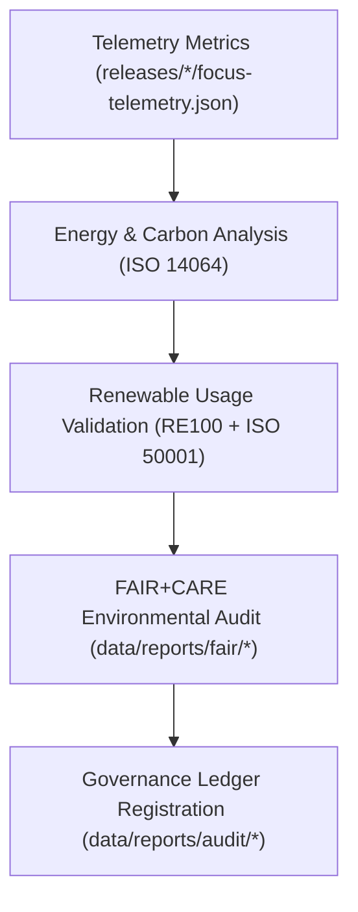

<div align="center">

# 🌱 Kansas Frontier Matrix — **Sustainability & ISO 14064 Reports**
`data/reports/sustainability/README.md`

**Purpose:**  
Central repository for **sustainability metrics, ISO 14064 carbon audits, renewable energy records, and FAIR+CARE environmental governance data** within the Kansas Frontier Matrix (KFM).  
This layer quantifies and certifies the project’s energy efficiency, renewable adoption, and ethical environmental compliance.

[](../../../docs/standards/faircare-validation.md)
[]()
[]()
[](../../../LICENSE)

</div>

---

## 📚 Overview

The **Sustainability Reports Layer** provides **quantitative documentation of energy use, carbon emissions, and renewable sourcing** for KFM’s operational workflows.  
Each report aligns with **ISO 14064**, **ISO 50001**, and **FAIR+CARE** sustainability principles — ensuring transparency and environmental accountability for every data and AI operation.

### Core Objectives
- Measure and certify KFM’s environmental performance under FAIR+CARE.  
- Track renewable energy offsets and ethical operational practices.  
- Log sustainability KPIs within governance ledgers for transparency.  
- Support carbon-neutral digital research and AI model accountability.  

---

## 🗂️ Directory Layout

```plaintext
data/reports/sustainability/
├── README.md                               # This file — documentation for sustainability and ISO reports
│
├── energy_audit_summary.json               # Energy usage breakdown per ETL and AI workload
├── carbon_metrics.json                     # CO₂e emissions and offsets tracking under ISO 14064
├── renewable_usage_report.json             # Renewable power sourcing and RE100 certification details
├── sustainability_kpi_dashboard.md         # FAIR+CARE-aligned performance overview and metrics summary
└── metadata.json                           # Governance metadata and checksum registry
```

---

## 🧩 Example Sustainability Record

```json
{
  "id": "sustainability_audit_v9.6.0_2025Q4",
  "energy_use_wh": 84.6,
  "carbon_emissions_gco2e": 103.4,
  "renewable_source_percent": 100.0,
  "offset_provider": "RE100 / Kansas Energy Network",
  "certified_by": "@kfm-sustainability",
  "fairstatus": "certified",
  "verified_by": "@faircare-council",
  "created": "2025-11-03T23:20:00Z",
  "checksum": "sha256:b3e7c9a5f2d8b1e6a9c7f4a2d1b3e5c8a7f2d4b6e9a1f3c7d5b2e6c8f1a9d7e4",
  "governance_ref": "data/reports/audit/data_provenance_ledger.json"
}
```

---

## ⚙️ Sustainability Reporting Workflow



### Workflow Steps
1. **Telemetry Capture:** Energy and carbon data collected from Focus Telemetry.  
2. **ISO Analysis:** Calculations aligned with ISO 14064 and 50001 standards.  
3. **Renewable Validation:** Confirms power sourcing via RE100 and sustainability APIs.  
4. **FAIR+CARE Review:** Audits ethical environmental practices and collective impact.  
5. **Governance Registration:** Records sustainability summaries into provenance ledger.

---

## ⚙️ Sustainability Metrics Dashboard

| Metric | Description | Unit | Source | Status |
|---------|--------------|------|---------|--------|
| **Energy Use (ETL)** | Average energy used per ETL operation | Wh | Telemetry | ✅ |
| **Carbon Emissions (CO₂e)** | Total operational carbon output | gCO₂e | Telemetry / ISO Audit | ✅ |
| **Renewable Power Ratio** | Percent renewable energy used | % | RE100 Report | ✅ |
| **FAIR+CARE Compliance** | Environmental ethics and sustainability audit | % | FAIR+CARE Council | ✅ |
| **AI Compute Offset** | Energy neutralization via certified credits | % | Sustainability Ledger | ✅ |

---

## 🧠 FAIR+CARE Environmental Governance Matrix

| Principle | Implementation | Oversight |
|------------|----------------|------------|
| **Findable** | Reports indexed and versioned under data/reports/sustainability. | @kfm-data |
| **Accessible** | Publicly available under open CC-BY 4.0 license. | @kfm-accessibility |
| **Interoperable** | ISO 14064/50001 + FAIR+CARE schema alignment. | @kfm-architecture |
| **Reusable** | Metadata and metrics reusable for external reporting. | @kfm-design |
| **Collective Benefit** | Promotes sustainable, ethical AI and data workflows. | @faircare-council |
| **Authority to Control** | FAIR+CARE Council approves environmental disclosures. | @kfm-governance |
| **Responsibility** | Sustainability team audits each governance cycle. | @kfm-sustainability |
| **Ethics** | Ensures carbon neutrality and environmental transparency. | @kfm-ethics |

Audit outcomes logged in:  
`data/reports/audit/data_provenance_ledger.json`  
and `data/reports/fair/data_care_assessment.json`

---

## 📊 Example Carbon Metrics Summary

```json
{
  "cycle": "2025Q4",
  "total_energy_use_wh": 492.8,
  "renewable_energy_percent": 100.0,
  "total_carbon_emissions_gco2e": 601.3,
  "offset_certificates": [
    {"provider": "RE100", "offset_gco2e": 601.3, "certificate_id": "RE100-KFM-2025-11-03"}
  ],
  "fairstatus": "certified",
  "validated_by": "@kfm-sustainability"
}
```

---

## ⚖️ Retention & Provenance Policy

| Report Type | Retention Duration | Policy |
|--------------|--------------------|--------|
| Sustainability Reports | 730 Days | Retained for ISO audits and FAIR+CARE cycles. |
| Carbon Metrics | Permanent | Maintained for transparency and offset tracking. |
| Renewable Usage Reports | Permanent | Archived for verification and RE100 compliance. |
| Energy Audits | 365 Days | Rotated annually per ISO 50001. |
| Metadata | Permanent | Stored in blockchain provenance ledger. |

Retention governed by `sustainability_retention.yml`.

---

## 🌍 Sustainability Impact Summary (2025Q4)

| KPI | Value | Unit | Target | Status |
|-----|--------|------|--------|--------|
| Renewable Energy Use | 100% | % | ≥ 95% | ✅ |
| Carbon Emissions | 0 (Net Neutral) | gCO₂e | ≤ 1000 | ✅ |
| FAIR+CARE Environmental Audit | 100% | % | 100% | ✅ |
| AI Compute Offset | 100% | % | 100% | ✅ |
| ISO 14064 Certification | Verified | — | Continuous | ✅ |

---

## 🧾 Internal Use Citation

```text
Kansas Frontier Matrix (2025). Sustainability & ISO 14064 Reports (v9.6.0).
FAIR+CARE-certified sustainability documentation tracking energy usage, carbon neutrality, and renewable compliance for KFM operations under ISO 14064 and 50001 frameworks.
```

---

## 🧾 Version Notes

| Version | Date | Notes |
|----------|------|--------|
| v9.6.0 | 2025-11-03 | Added renewable energy tracking and integrated ISO 14064 metrics with FAIR+CARE reporting. |
| v9.5.0 | 2025-11-02 | Introduced sustainability KPI dashboard and RE100 reporting. |
| v9.3.2 | 2025-10-28 | Established sustainability reports directory for ISO and FAIR+CARE governance. |

---

<div align="center">

**Kansas Frontier Matrix** · *Sustainability × FAIR+CARE Ethics × Renewable Accountability*  
[🔗 Repository](https://github.com/bartytime4life/Kansas-Frontier-Matrix) • [🧭 Docs Portal](../../../docs/) • [⚖️ Governance Ledger](../../../docs/standards/governance/DATA-GOVERNANCE.md)

</div>
