<div align="center">

# 🌱 Kansas Frontier Matrix — **Sustainability & ISO 14064 Reports**
`data/reports/sustainability/README.md`

**Purpose:**  
Central repository for **sustainability metrics, ISO 14064 carbon audits, renewable energy records, and FAIR+CARE environmental governance** data within KFM.  
This layer quantifies and certifies KFM’s **energy efficiency**, **renewable adoption**, and **ethical environmental compliance**.

[](../../../docs/architecture/README.md)
[](../../../LICENSE)
[](../../../docs/standards/faircare-validation.md)
[]()
[]()

</div>

---

## 📘 Overview

The **Sustainability Reports Layer** provides **quantitative documentation of energy use, carbon emissions, and renewable sourcing** for KFM operations.  
Each report aligns with **ISO 14064**, **ISO 50001**, and **FAIR+CARE** sustainability principles—ensuring transparency and environmental accountability for every data and AI workflow.

### Core Objectives
- Measure and certify environmental performance under FAIR+CARE.  
- Track renewable energy offsets and ethical operational practices.  
- Log sustainability KPIs in governance ledgers for transparency.  
- Support carbon-neutral digital research and AI accountability.  

---

## 🗂️ Directory Layout

```plaintext
data/reports/sustainability/
├── README.md
├── energy_audit_summary.json           # Energy usage per ETL/AI workload
├── carbon_metrics.json                 # CO₂e emissions + offsets (ISO 14064)
├── renewable_usage_report.json         # Renewable sourcing & RE100 verification
├── sustainability_kpi_dashboard.md     # FAIR+CARE-aligned performance overview
└── metadata.json                       # Governance metadata + checksum registry
```

---

## 🧩 Example Sustainability Record

```json
{
  "id": "sustainability_audit_v9.7.0_2025Q4",
  "energy_use_wh": 84.6,
  "carbon_emissions_gco2e": 103.4,
  "renewable_source_percent": 100.0,
  "offset_provider": "RE100 / Kansas Energy Network",
  "certified_by": "@kfm-sustainability",
  "fairstatus": "certified",
  "verified_by": "@faircare-council",
  "created": "2025-11-06T23:20:00Z",
  "checksum_sha256": "sha256:b3e7c9a5f2d8b1e6a9c7f4a2d1b3e5c8a7f2d4b6e9a1f3c7d5b2e6c8f1a9d7e4",
  "governance_ref": "data/reports/audit/data_provenance_ledger.json"
}
```

---

## ⚙️ Sustainability Reporting Workflow

```mermaid
flowchart TD
    A["Telemetry (releases/*/focus-telemetry.json)"] --> B["Energy & Carbon Analysis (ISO 14064)"]
    B --> C["Renewable Usage Validation (RE100 · ISO 50001)"]
    C --> D["FAIR+CARE Environmental Audit (data/reports/fair/*)"]
    D --> E["Governance Ledger Registration (data/reports/audit/*)"]
```



**Steps**
1. **Telemetry Capture:** Energy and carbon data ingested from Focus Telemetry.  
2. **ISO Analysis:** Calculations aligned with ISO 14064/50001 standards.  
3. **Renewable Validation:** Confirms power sourcing via RE100.  
4. **FAIR+CARE Review:** Audits environmental ethics and collective impact.  
5. **Governance:** Records sustainability summaries in provenance ledgers.

---

## 📈 Sustainability KPI Dashboard

| Metric                  | Description                               | Unit | Source            | Status |
|-------------------------|-------------------------------------------|------|-------------------|--------|
| **Energy Use (ETL)**    | Avg. energy per ETL operation             | Wh   | Telemetry         | ✅ |
| **Carbon Emissions**    | Total operational carbon output           | gCO₂e| Telemetry + Audit | ✅ |
| **Renewable Power**     | Percent renewable energy used             | %    | RE100 Report      | ✅ |
| **FAIR+CARE Compliance**| Environmental ethics & sustainability     | %    | FAIR+CARE Council | ✅ |
| **AI Compute Offset**   | Energy neutralization via certified credits| %   | Sustainability Log| ✅ |

---

## 🧠 FAIR+CARE Environmental Governance Matrix

| Principle | Implementation | Oversight |
|-----------|----------------|-----------|
| **Findable** | Reports indexed & versioned under `data/reports/sustainability`. | `@kfm-data` |
| **Accessible** | Open JSON/Markdown under CC-BY 4.0. | `@kfm-accessibility` |
| **Interoperable** | ISO 14064/50001 + FAIR+CARE schema alignment. | `@kfm-architecture` |
| **Reusable** | Metrics & metadata reusable for external reporting. | `@kfm-design` |
| **Collective Benefit** | Promotes sustainable, ethical AI/data workflows. | `@faircare-council` |
| **Authority to Control** | Council approves environmental disclosures. | `@kfm-governance` |
| **Responsibility** | Sustainability audits each governance cycle. | `@kfm-sustainability` |
| **Ethics** | Ensures carbon neutrality and environmental transparency. | `@kfm-ethics` |

**Audit outputs:**  
`data/reports/audit/data_provenance_ledger.json` · `data/reports/fair/data_care_assessment.json`

---

## 📊 Example Carbon Metrics Summary

```json
{
  "cycle": "2025Q4",
  "total_energy_use_wh": 492.8,
  "renewable_energy_percent": 100.0,
  "total_carbon_emissions_gco2e": 601.3,
  "offset_certificates": [
    {"provider": "RE100", "offset_gco2e": 601.3, "certificate_id": "RE100-KFM-2025-11-06"}
  ],
  "fairstatus": "certified",
  "validated_by": "@kfm-sustainability"
}
```

---

## ⚖️ Retention & Provenance Policy

| Report Type              | Retention | Policy                                   |
|--------------------------|----------:|------------------------------------------|
| Sustainability Reports   | 730 Days  | Retained for ISO & FAIR+CARE audits.     |
| Carbon Metrics           | Permanent | Maintained for transparency & offsets.   |
| Renewable Usage Reports  | Permanent | Archived for RE100 verification.         |
| Energy Audits            | 365 Days  | Rotated annually per ISO 50001.          |
| Metadata                 | Permanent | Stored in provenance ledgers.            |

**Retention automation:** `sustainability_retention.yml`

---

## 🧾 Internal Use Citation

```text
Kansas Frontier Matrix (2025). Sustainability & ISO 14064 Reports (v9.7.0).
FAIR+CARE-certified sustainability documentation tracking energy usage, carbon neutrality, and renewable compliance for KFM under ISO 14064 and ISO 50001 frameworks.
```

---

## 🕰️ Version History

| Version | Date       | Author               | Summary |
|--------:|------------|----------------------|---------|
| v9.7.0  | 2025-11-06 | `@kfm-sustainability` | Upgraded to v9.7.0; telemetry/schema refs aligned; KPI section refined; badges hardened. |
| v9.6.0  | 2025-11-03 | `@kfm-sustainability` | Added renewable energy tracking & ISO 14064 metrics integration. |
| v9.5.0  | 2025-11-02 | `@kfm-governance`     | Introduced KPI dashboard and RE100 reporting. |

---

<div align="center">

**Kansas Frontier Matrix**  
*Sustainability × FAIR+CARE Ethics × Renewable Accountability*  
© 2025 Kansas Frontier Matrix — CC-BY 4.0 · Diamond⁹ Ω / Crown∞Ω Ultimate Certified  

[Back to Reports Index](../README.md) · [Docs Portal](../../../docs/) · [Governance Charter](../../../docs/standards/governance/DATA-GOVERNANCE.md)

</div>