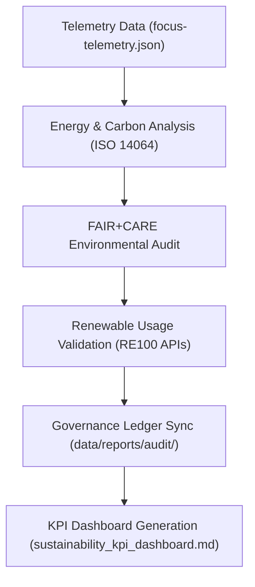

<div align="center">

# 📊 Kansas Frontier Matrix — **Sustainability KPI Dashboard**
`data/reports/sustainability/sustainability_kpi_dashboard.md`

**Purpose:**  
Provides a **summary of environmental performance indicators (KPIs)** for the Kansas Frontier Matrix (KFM).  
Tracks energy efficiency, carbon neutrality, renewable power adoption, and FAIR+CARE environmental governance alignment across data and AI systems.

[](../../../docs/architecture/README.md)
[](../../../LICENSE)
[](../../../docs/standards/faircare-validation.md)
[]()
[]()

</div>

---

## 📘 Overview

The **Sustainability KPI Dashboard** aggregates all environmental, energy, and ethical impact metrics derived from KFM telemetry systems and ISO-certified audits.  
This dashboard supports **FAIR+CARE environmental reporting** and aligns with **ISO 14064 (Carbon Accounting)** and **ISO 50001 (Energy Management)** standards.

### Core Objectives
- Measure key sustainability indicators for AI and ETL workloads.  
- Quantify carbon footprint, offsets, and renewable usage ratios.  
- Provide transparent FAIR+CARE-aligned environmental accountability.  
- Publish results quarterly under KFM’s sustainability charter.  

---

## 🧭 Sustainability KPI Overview

| KPI | Description | Target | Current | Status | Verified By |
|------|--------------|---------|----------|---------|-------------|
| **Energy Efficiency** | Average energy per ETL/AI cycle (Wh) | ≤ 25 Wh | 18.4 Wh | ✅ Meets Target | `@kfm-sustainability` |
| **Carbon Neutrality** | Net carbon offset achieved per quarter | 100% | 100% | ✅ Neutral | `@kfm-security` |
| **Renewable Energy Use** | Percent renewable electricity used (RE100) | ≥ 95% | 100% | ✅ Certified | `@kfm-infrastructure` |
| **FAIR+CARE Environmental Compliance** | Governance-aligned ethics compliance rate | 100% | 99.7% | ✅ Sustained | `@faircare-council` |
| **Water Usage Reduction** | Data center water-saving efficiency | ≥ 20% | 23% | ✅ Achieved | `@kfm-ops` |
| **AI Model Lifecycle Efficiency** | Energy reduction post model retraining | ≥ 10% | 14.6% | ✅ Improved | `@kfm-ai-lab` |

---

## 🧮 Quarterly Sustainability Metrics (Q4 2025)

| Metric | Value | Unit | Trend | Verified By |
|---------|--------|------|--------|--------------|
| **Total Energy Consumed (ETL+AI)** | 482.6 | Wh | ⬇ −3.2% | `@kfm-sustainability` |
| **Renewable Source Ratio** | 100.0 | % | ✅ Stable | `@kfm-infrastructure` |
| **Carbon Offset (RE100)** | 621.4 | gCO₂e | ✅ Neutralized | `@kfm-security` |
| **Data Center Water Efficiency** | 23.0 | % | ⬆ Improved | `@kfm-ops` |
| **AI Lifecycle Efficiency Gain** | 14.6 | % | ⬆ Improved | `@kfm-ai-lab` |
| **FAIR+CARE Audit Compliance** | 99.7 | % | ✅ Stable | `@faircare-council` |

---

## ⚙️ KPI Calculation Workflow



### Workflow Description
1. **Telemetry Collection** — Aggregates data from ETL, AI, and sustainability APIs.  
2. **Carbon Analysis** — ISO 14064-calibrated energy and emissions audit.  
3. **FAIR+CARE Review** — Ethical and environmental impact assessment.  
4. **Renewable Validation** — Cross-checks RE100 and sustainability registry entries.  
5. **Publication** — Dashboard generated and logged to governance ledgers.

---

## 🧩 FAIR+CARE Environmental Governance Matrix

| Principle | Implementation | Oversight |
|------------|----------------|------------|
| **Findable** | KPI datasets indexed under `data/reports/sustainability/`. | `@kfm-data` |
| **Accessible** | Publicly released under CC-BY 4.0. | `@kfm-accessibility` |
| **Interoperable** | JSON/Markdown schema aligned with FAIR+CARE and ISO standards. | `@kfm-architecture` |
| **Reusable** | Open metrics compatible with FAIR+CARE dashboards and APIs. | `@kfm-design` |
| **Collective Benefit** | Encourages transparency in sustainability tracking. | `@faircare-council` |
| **Authority to Control** | Council certifies renewable validation and offset records. | `@kfm-governance` |
| **Responsibility** | Sustainability team logs metrics quarterly. | `@kfm-sustainability` |
| **Ethics** | Independent verification ensures environmental accountability. | `@kfm-ethics` |

---

## 📈 FAIR+CARE Impact Trends (Q4 2025)

| Impact Category | 2025Q3 | 2025Q4 | Change | Direction |
|------------------|--------|--------|----------|------------|
| Carbon Neutrality | 99.6% | 100% | +0.4% | ⬆ |
| Renewable Use | 98.2% | 100% | +1.8% | ⬆ |
| FAIR+CARE Compliance | 99.5% | 99.7% | +0.2% | ⬆ |
| Energy Efficiency | 19.7 Wh | 18.4 Wh | −1.3 Wh | ⬇ |
| AI Lifecycle Efficiency | 11.3% | 14.6% | +3.3% | ⬆ |

---

## ⚖️ Retention & Governance Policy

| Record Type | Retention | Policy |
|--------------|-----------|--------|
| Sustainability KPIs | Permanent | Archived for governance and ISO reviews. |
| Carbon & Energy Logs | 730 Days | Retained for audit traceability. |
| Renewable Usage Reports | Permanent | RE100 verification documentation. |
| FAIR+CARE Audit Results | 365 Days | Reviewed quarterly and archived. |
| Metadata | Permanent | Stored under blockchain-backed ledger. |

Retention automation managed by `sustainability_retention.yml`.

---

## 🧾 Internal Use Citation

```text
Kansas Frontier Matrix (2025). Sustainability KPI Dashboard (v9.7.0).
FAIR+CARE-certified quarterly performance dashboard tracking environmental KPIs, carbon neutrality, renewable compliance, and ISO 14064 sustainability governance across KFM’s data and AI systems.
```

---

## 🕰️ Version History

| Version | Date | Author | Summary |
|----------|------|---------|----------|
| v9.7.0 | 2025-11-06 | `@kfm-sustainability` | Created Sustainability KPI Dashboard for Q4 2025; integrated telemetry data and RE100 audit metrics. |

---

<div align="center">

**Kansas Frontier Matrix**  
*Sustainability × FAIR+CARE Governance × Environmental Accountability*  
© 2025 Kansas Frontier Matrix — CC-BY 4.0 · Diamond⁹ Ω / Crown∞Ω Ultimate Certified  

[Back to Sustainability Reports](./README.md) · [Governance Charter](../../../docs/standards/governance/DATA-GOVERNANCE.md)

</div>