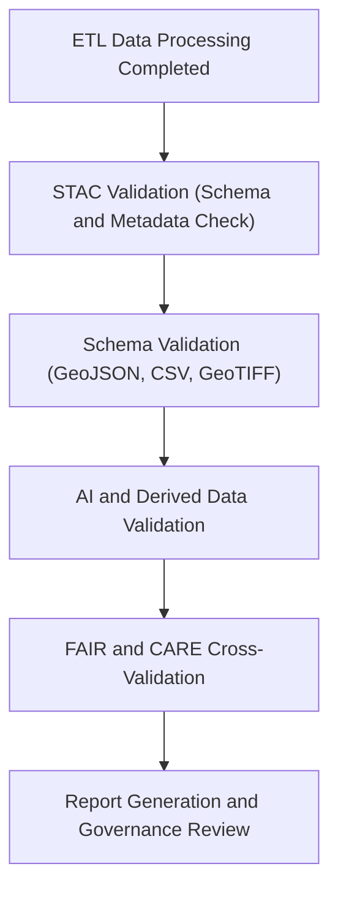

<div align="center">

# ✅ Kansas Frontier Matrix — **Data Validation Reports**
`data/reports/validation/README.md`

**Purpose:** Central repository for schema conformance, STAC validation, and ETL quality assurance reports generated during the Kansas Frontier Matrix (KFM) data lifecycle.  
Ensures reproducibility, transparency, and FAIR+CARE compliance for all validated datasets.

[](../../../.github/workflows/stac-validate.yml)
[](../../../LICENSE)
[](../../../docs/standards/faircare-validation.md)
[](../../../docs/architecture/repo-focus.md)

</div>

---

## 📚 Overview

The `data/reports/validation/` directory stores all **validation artifacts** created during data ingestion, ETL transformation, and governance review.  
These reports verify that every dataset adheres to defined metadata schemas, spatial standards, and FAIR+CARE governance requirements.

Each report provides:
- Structural and semantic validation of data (GeoJSON, GeoTIFF, CSV).  
- STAC 1.0 and DCAT 3.0 schema verification.  
- Error, warning, and success logs from automated validation tools.  
- Cross-checks between dataset metadata and governance manifests.  

---

## 🗂️ Directory Layout

```plaintext
data/reports/validation/
├── README.md                          # This file — overview of validation reports
│
├── stac_validation_report.json        # STAC compliance report for all datasets
├── schema_validation_summary.json     # Dataset schema validation summary (GeoJSON, CSV)
├── geojson_schema_validation.log      # GeoJSON schema validation logs
├── ai_validation_metrics.csv          # Validation metrics for AI-driven datasets
└── validation_summary.md              # Human-readable overview of validation outcomes
```

---

## ⚙️ Validation Workflow



### Description:
1. **STAC Validation:** Confirms presence of mandatory fields, valid geometries, and metadata structure.  
2. **Schema Validation:** Checks attribute integrity, CRS consistency, and metadata schema compliance.  
3. **AI Validation:** Ensures derived models meet data accuracy, drift, and bias metrics.  
4. **FAIR+CARE Validation:** Cross-links metadata and ethical standards before publishing.  
5. **Governance Review:** Reports sent to the FAIR+CARE Council for audit and archival.  

---

## 🧩 Validation Tools and Standards

| Tool | Purpose | Output |
|------|----------|---------|
| **stac-validator** | Checks dataset conformance to STAC 1.0 | `stac_validation_report.json` |
| **jsonschema** | Validates JSON-based metadata and schemas | `schema_validation_summary.json` |
| **GDAL / ogrinfo** | Confirms geospatial data validity and CRS consistency | `geojson_schema_validation.log` |
| **AI Drift Monitor** | Detects data drift and model inconsistencies | `ai_validation_metrics.csv` |

---

## 🔍 Example — STAC Validation Report

```json
{
  "dataset": "hazards_v9.3.2",
  "status": "passed",
  "validator_version": "1.1.0",
  "errors": [],
  "warnings": ["Recommended field 'keywords' missing"],
  "metadata_completeness": 0.98,
  "linked_items": [
    "data/stac/items/hazards_v9.3.2.json",
    "reports/audit/data_provenance_ledger.json"
  ]
}
```

> ✅ **Note:** Each STAC report references the dataset’s provenance record and manifest for traceability.

---

## 🧠 FAIR+CARE Validation Criteria

| Validation Type | FAIR Principle | CARE Principle | Description |
|------------------|----------------|----------------|--------------|
| Metadata Schema | Findable | Responsibility | Ensures complete, searchable metadata. |
| File Format | Accessible | Collective Benefit | Verifies open, non-proprietary formats. |
| CRS / Geometry | Interoperable | Authority to Control | Checks coordinate system and feature validity. |
| Provenance Chain | Reusable | Ethics | Links all derived data to verified origins. |

All results are aggregated and scored in the **FAIR+CARE governance dashboard** located in:  
`data/reports/fair/faircare_scorecard.csv`

---

## 🧾 Validation Metrics Example (AI)

```csv
dataset_id,accuracy,f1_score,drift_index,validation_status
hazards_v9.3.2,0.92,0.91,0.02,passed
climate_v9.3.2,0.89,0.87,0.05,passed
treaties_v9.2.0,0.99,0.99,0.00,passed
```

These metrics are incorporated into the **AI governance ledger** under:  
`data/reports/audit/ai_hazards_ledger.json`

---

## 🧾 Governance Integration

Validation reports directly feed into:
- `data/reports/audit/data_provenance_ledger.json` — Logs validation results and governance approvals.  
- `data/reports/fair/data_fair_summary.json` — FAIR scoring aggregation.  
- `releases/v9.3.2/manifest.zip` — Includes validation summaries for each dataset.  
- `.github/workflows/stac-validate.yml` — Automated validation workflow trigger.

Governance sign-offs by FAIR+CARE Council members are appended to validation reports before merging to main.

---

## 🧩 Cross-Linkages

| Linked Component | Purpose |
|------------------|----------|
| `data/stac/` | Primary source of dataset metadata for validation |
| `data/work/processed/` | Source of transformed datasets under review |
| `docs/standards/governance/` | Defines validation protocols and standards |
| `schemas/telemetry/work-data-governance-v14.json` | Telemetry schema for validation metadata |
| `reports/fair/` | Aggregated FAIR+CARE results linked to validation outputs |

---

## 🧾 Version History

| Version | Date       | Author             | Summary |
|----------|------------|--------------------|----------|
| v9.3.2   | 2025-10-28 | @kfm-data-lab      | Added schema, STAC, and AI validation report documentation. |
| v9.3.1   | 2025-10-27 | @bartytime4life    | Linked validation reports to FAIR+CARE dashboards and audit ledger. |
| v9.3.0   | 2025-10-26 | @kfm-architecture  | Established validation structure and governance integration. |

---

<div align="center">

**Kansas Frontier Matrix** · *Validation × Transparency × Ethical Data Governance*  
[🔗 Repository](https://github.com/bartytime4life/Kansas-Frontier-Matrix) • [🧭 Docs Portal](../../../docs/) • [⚖️ Governance Ledger](../../../docs/standards/governance/)

</div>
