<div align="center">

# ✅ Kansas Frontier Matrix — **Data Validation Reports**
`data/reports/validation/README.md`

**Purpose:**  
Central repository for **schema conformance, STAC validation, and ETL quality assurance** reports generated during the KFM data lifecycle.  
Ensures reproducibility, transparency, and **FAIR+CARE** compliance for all validated datasets.

[](../../../docs/architecture/README.md)
[](../../../LICENSE)
[](../../../docs/standards/faircare-validation.md)
[](../../../.github/workflows/stac-validate.yml)

</div>

---

## 📘 Overview

`data/reports/validation/` stores all **validation artifacts** created during ingestion, ETL transformation, and governance review.  
These reports verify that each dataset adheres to metadata schemas, spatial standards, and **FAIR+CARE** requirements.

Each report provides:
- Structural & semantic validation (GeoJSON, GeoTIFF, CSV).  
- **STAC 1.0 / DCAT 3.0** schema verification.  
- Error, warning, and success logs from automated validators.  
- Cross-checks between dataset metadata and governance manifests.

---

## 🗂️ Directory Layout

```plaintext
data/reports/validation/
├── README.md
├── stac_validation_report.json        # STAC compliance report (all datasets)
├── schema_validation_summary.json     # Schema validation summary (GeoJSON/CSV/etc.)
├── geojson_schema_validation.log      # GDAL/ogrinfo geometry + CRS logs
├── ai_validation_metrics.csv          # AI dataset validation metrics (accuracy/drift)
└── validation_summary.md              # Human-friendly overview of outcomes
```

---

## ⚙️ Validation Workflow

```mermaid
flowchart TD
    A["ETL Data Processing Completed"] --> B["STAC Validation (Schema & Metadata)"]
    B --> C["Schema Validation (GeoJSON · CSV · GeoTIFF)"]
    C --> D["AI & Derived Data Validation"]
    D --> E["FAIR+CARE Cross-Validation"]
    E --> F["Report Generation & Governance Review"]
```



### Steps
1. **STAC Validation** — Checks required fields, valid geometries, and metadata structure.  
2. **Schema Validation** — Verifies attributes, CRS consistency, and schema conformance.  
3. **AI Validation** — Assesses drift, bias, and accuracy for derived models.  
4. **FAIR+CARE Validation** — Cross-links ethics standards prior to publishing.  
5. **Governance Review** — Council audit + archival in provenance ledgers.

---

## 🧩 Validation Tools & Standards

| Tool / Standard  | Purpose                                       | Output                             |
|------------------|-----------------------------------------------|------------------------------------|
| **stac-validator** | STAC 1.0 conformance                         | `stac_validation_report.json`      |
| **jsonschema**     | JSON metadata & schema validation            | `schema_validation_summary.json`   |
| **GDAL / ogrinfo** | Geometry validity & CRS checks                | `geojson_schema_validation.log`    |
| **AI Drift Monitor** | Data/model drift + bias checks             | `ai_validation_metrics.csv`        |

---

## 🔍 Example — STAC Validation Report

```json
{
  "dataset": "hazards_v9.7.0",
  "status": "passed",
  "validator_version": "1.1.0",
  "errors": [],
  "warnings": ["Recommended field 'keywords' missing"],
  "metadata_completeness": 0.98,
  "linked_items": [
    "data/stac/items/hazards_v9.7.0.json",
    "data/reports/audit/data_provenance_ledger.json"
  ]
}
```

> ✅ Each report references the dataset’s provenance record and manifest for traceability.

---

## 🧠 FAIR+CARE Validation Criteria

| Validation Type  | FAIR Principle | CARE Principle        | Description                                  |
|------------------|----------------|-----------------------|----------------------------------------------|
| Metadata Schema  | Findable       | Responsibility        | Ensures complete, searchable metadata.       |
| File Format      | Accessible     | Collective Benefit    | Verifies open, non-proprietary formats.      |
| CRS / Geometry   | Interoperable  | Authority to Control  | Checks coordinate system & feature validity. |
| Provenance Chain | Reusable       | Ethics                | Links derived data to verified origins.      |

Results are aggregated into the **FAIR+CARE dashboard**:  
`data/reports/fair/faircare_scorecard.csv`

---

## 🧾 Validation Metrics Example (AI)

```csv
dataset_id,accuracy,f1_score,drift_index,validation_status
hazards_v9.7.0,0.92,0.91,0.02,passed
climate_v9.7.0,0.89,0.87,0.05,passed
treaties_v9.7.0,0.99,0.99,0.00,passed
```

Metrics are appended to the **AI governance ledger**:  
`data/reports/audit/ai_hazards_ledger.json`

---

## 🔗 Governance Integration

Validation outputs feed into:
- `data/reports/audit/data_provenance_ledger.json` — Governance approvals & signatures.  
- `data/reports/fair/data_fair_summary.json` — FAIR scoring aggregation.  
- `releases/v9.7.0/manifest.zip` — Release-packaged validation summaries.  
- `.github/workflows/stac-validate.yml` — Automated validation workflow.

---

## 🧩 Cross-Linkages

| Linked Component               | Purpose                                     |
|--------------------------------|---------------------------------------------|
| `data/stac/`                   | Primary dataset metadata for validation     |
| `data/work/processed/`         | Staging source for datasets under review    |
| `docs/standards/governance/`   | Validation protocols and standards          |
| `schemas/telemetry/work-data-governance-v14.json` | Telemetry schema for validation metadata |
| `reports/fair/`                | FAIR+CARE aggregation & ethics reports      |

---

## 🕰️ Version History

| Version | Date       | Author            | Summary |
|--------:|------------|-------------------|---------|
| v9.7.0  | 2025-11-06 | `@kfm-validation` | Upgraded to v9.7.0; telemetry/schema refs added; examples & linkage updated; badges aligned. |
| v9.3.2  | 2025-10-28 | `@kfm-data-lab`   | Added schema, STAC, and AI validation documentation. |
| v9.3.1  | 2025-10-27 | `@bartytime4life` | Linked validation reports to FAIR+CARE dashboards and audit ledger. |
| v9.3.0  | 2025-10-26 | `@kfm-architecture` | Established validation structure & governance integration. |

---

<div align="center">

**Kansas Frontier Matrix**  
*Validation × Transparency × Ethical Data Governance*  
© 2025 Kansas Frontier Matrix — CC-BY 4.0 · Diamond⁹ Ω / Crown∞Ω Ultimate Certified  

[Back to Reports Index](../README.md) · [Docs Portal](../../../docs/) · [Governance Charter](../../../docs/standards/governance/)
</div>