<!-- [KFM_META_BLOCK_V2]
doc_id: kfm://data/rollback/readme
name: Data Rollback README
path: data/rollback/README.md
type: data-rollback-root-readme
version: v0.1.0
status: draft
owners:
  - <data-steward>
  - <rollback-steward>
  - <release-steward>
  - <domain-stewards>
  - <evidence-steward>
  - <proof-steward>
  - <receipt-steward>
  - <catalog-steward>
  - <source-registry-steward>
  - <policy-steward>
  - <sensitivity-reviewer>
  - <rights-steward>
  - <map-layer-steward>
  - <ai-surface-steward>
  - <docs-steward>
created: 2026-06-29
updated: 2026-06-29
policy_label: restricted-review
truth_posture: cite-or-abstain
responsibility_root: data/
artifact_family: rollback-receipt-and-alias-revert-support-root
path_posture: existing-empty-file-replaced; directory-rules-lists-data-rollback-domain-release-id; release-root-owns-release-decisions; rollback-runbook-confirms-decision-vs-data-plane-split; adr-0015-two-plane-alias-rollback-mechanism-is-proposed; child-domain-readme-presence-confirmed-for-current-batch; release-instance-child-shape-proposed
sensitivity_posture: no-public-path-by-default; rollback-is-governed-state-transition-not-file-move; not-delete; not-erasure; not-silent-edit; not-release-authority; not-publication-authority; not-proof-authority; not-receipt-family-authority-except-rollback-local-alias-revert-receipts; not-catalog-authority; not-policy-authority; not-schema-authority; not-source-registry-authority; not-canonical-truth; not-direct-public-ui-api-source; source-role-preserving; rights-aware; sensitivity-aware; correction-aware; release-aware; evidence-aware; proof-aware; public-surface-invalidation-required; derivative-invalidation-required; rollback-target-required; prior-meaning-retention-required
related:
  - ../README.md
  - ../published/README.md
  - ../published/layers/README.md
  - ../catalog/README.md
  - ../receipts/README.md
  - ../proofs/README.md
  - ../registry/README.md
  - ../registry/sources/README.md
  - ../../release/README.md
  - ../../release/manifests/README.md
  - ../../release/rollback_cards/
  - ../../release/correction_notices/
  - ../../release/withdrawal_notices/
  - ../../release/signatures/
  - ../../docs/runbooks/ROLLBACK_RUNBOOK.md
  - ../../docs/runbooks/governed_ai_ROLLBACK.md
  - ../../docs/runbooks/ui_ROLLBACK.md
  - ../../docs/adr/ADR-0015-data-published-_domain_-current-alias-is-governed-by-rollback_card.md
  - ../../docs/adr/ADR-0011-receipts-vs-proofs-vs-manifests-vs-catalog-separation.md
  - ../../docs/doctrine/directory-rules.md
  - ../../docs/doctrine/lifecycle-law.md
  - ../../docs/doctrine/trust-membrane.md
  - ../../contracts/release/
  - ../../schemas/contracts/v1/release/
  - ../../policy/release/
  - agriculture/README.md
  - archaeology/README.md
  - atmosphere/README.md
  - fauna/README.md
  - flora/README.md
  - geology/README.md
  - habitat/README.md
  - hazards/README.md
  - hydrology/README.md
  - people/README.md
  - roads-rail-trade/README.md
  - settlements-infrastructure/README.md
  - soil/README.md
tags:
  - kfm
  - data
  - rollback
  - rollback-root
  - release-governance
  - rollback-card
  - release-manifest
  - correction-notice
  - withdrawal-notice
  - alias-revert-receipt
  - affected-artifacts
  - digest-verification
  - derivative-invalidation
  - public-surface-invalidation
  - stale-state
  - correction-path
  - rollback-target
  - evidence-bundle
  - proof-pack
  - catalog-closure
  - receipt-boundary
  - source-role
  - sensitivity-review
  - rights-review
  - policy-decision
  - ai-surface-invalidation
  - focus-mode-invalidation
  - map-layer-invalidation
  - trust-membrane
  - not-delete
  - not-erasure
  - not-file-move
  - not-release-authority
  - not-public-api-source
  - cite-or-abstain
notes:
  - "This README replaces an empty file at `data/rollback/README.md`."
  - "Directory Rules lists `data/rollback/<domain>/<release_id>/` and says rollback may hold rollback cards and alias-revert receipts, but must not delete prior meanings."
  - "The release root says release decisions, manifests, promotion records, rollback cards, withdrawals, corrections, signatures, and changelog belong under `release/`, distinct from published artifacts."
  - "The rollback runbook distinguishes release-plane rollback decisions from data-plane revert receipts and requires withdrawal or invalidation of affected public surfaces and derivatives."
  - "ADR-0015 proposes a two-plane alias mechanism: `release/rollback_cards/` owns rollback decision authority, while `data/rollback/` may hold data-plane alias-revert receipts. This README follows that separation without claiming ADR acceptance or implementation maturity."
  - "Child domain READMEs now exist for the current batch, but this parent README does not prove any concrete rollback instance, validator, signer, CI workflow, alias resolver, cache invalidation worker, or public release exists."
[/KFM_META_BLOCK_V2] -->

<a id="top"></a>

# Data Rollback

Parent contract for KFM data-plane rollback support: domain-local alias-revert receipts, affected-artifact indexes, digest verification summaries, stale-state records, invalidation references, and rollback-local inspection material.

<p>
  
  
  
  
  
  
</p>

**Quick links:** [Scope](#scope) · [Path posture](#path-posture) · [Repo fit](#repo-fit) · [Child lanes](#child-lanes) · [Rollback boundary](#rollback-boundary) · [Accepted material](#accepted-material) · [Exclusions](#exclusions) · [Root guardrails](#root-guardrails) · [Rollback flow](#rollback-flow) · [Suggested directory shape](#suggested-directory-shape) · [Required checks](#required-checks-before-use) · [Status notes](#status-notes) · [Evidence ledger](#evidence-ledger)

> [!CAUTION]
> `data/rollback/` is not release authority, not publication authority, not proof, not general receipt storage, not catalog closure, not policy authority, not schema authority, not source registry authority, not canonical truth, not erasure, not deletion, not a silent edit, not a file-move shortcut, and not a direct public UI/API source. Rollback is a governed state transition. The release-plane decision belongs under `release/`; this root records narrow data-plane support for that decision.

---

## Scope

`data/rollback/` is the data-plane home for rollback support records tied to governed releases.

This root may contain domain child lanes for:

- rollback-local alias-revert receipts tied to a release-plane `RollbackCard`;
- affected public artifact indexes;
- digest verification summaries;
- invalidation references for maps, tiles, APIs, reports, stories, graph/triplet exports, search surfaces, Evidence Drawer payloads, Focus Mode answers, and AI answer surfaces;
- stale-state or withdrawal support records;
- references to release decisions, evidence, proof, catalog records, receipts, policy decisions, source-role review, sensitivity review, and public-safe geometry review;
- rollback drills clearly marked as non-production.

This root does **not** authorize rollback by itself. It supports the data-plane effects of rollback decisions made in `release/`.

---

## Path posture

The confirmed root lane is:

```text
data/rollback/
```

Directory Rules list the domain instance pattern:

```text
data/rollback/<domain>/<release_id>/
```

Current placement evidence:

- `docs/doctrine/directory-rules.md` lists `data/rollback/<domain>/<release_id>/` in the data lifecycle tree.
- Directory Rules say rollback may hold rollback cards and alias-revert receipts, but must not delete prior meanings.
- `release/README.md` says release decisions, manifests, promotion records, rollback cards, withdrawals, corrections, signatures, and changelog belong under `release/`.
- `docs/runbooks/ROLLBACK_RUNBOOK.md` treats rollback as a governed release transition and distinguishes release-plane decisions from data-plane revert receipts.
- ADR-0015 proposes a two-plane alias mechanism where `release/rollback_cards/` owns the decision and `data/rollback/` owns data-plane alias-revert receipts. ADR-0015 is draft/proposed, so this README does not claim the mechanism is accepted or implemented.

Therefore this README treats `data/rollback/` as **CONFIRMED path presence / DRAFT parent contract / NEEDS VERIFICATION implementation maturity**.

---

## Repo fit

| Responsibility | Correct home | Boundary |
|---|---|---|
| Data-plane rollback support | `data/rollback/` | This root. Holds rollback-local support material only. |
| Domain-specific rollback support | `data/rollback/<domain>/` | Child READMEs define domain hazards and support boundaries. |
| Release decisions | `release/` | Owns `ReleaseManifest`, `RollbackCard`, `CorrectionNotice`, `WithdrawalNotice`, signatures, and promotion decisions. |
| Released public artifacts | `data/published/` | Immutable or versioned public-safe artifacts; rollback support does not overwrite them. |
| Evidence and integrity support | `data/proofs/` | EvidenceBundle, ProofPack, validation, citation, and integrity support. |
| Process memory | `data/receipts/` | General run, transform, validation, redaction, review, AI, and release-support receipts. |
| Discovery and closure records | `data/catalog/` | STAC/DCAT/PROV/domain catalog records; not rollback decisions. |
| Source admission and source posture | `data/registry/` | Sources, rights, sensitivity, layers, datasets, domains, and crosswalk records. |
| Object meaning | `contracts/` | Human-readable meaning and obligations. |
| Machine shape | `schemas/` | JSON Schema and machine validation surface. |
| Allow/deny/restrict/abstain logic | `policy/` | Policy rules, sensitivity rules, and release rules. |
| Operational runbook | `docs/runbooks/ROLLBACK_RUNBOOK.md` | Human procedure; not data payload. |

---

## Child lanes

The following child README files are present and define domain-specific rollback boundaries. Their presence does **not** prove that rollback instances, validators, signed release objects, alias resolvers, or CI enforcement exist.

| Child lane | Status | Dominant rollback concern |
|---|---:|---|
| [`agriculture/`](agriculture/README.md) | CONFIRMED README | Private farm/operator/parcel detail, crop/yield overclaim, conservation/program overclaim, source-role collapse. |
| [`archaeology/`](archaeology/README.md) | CONFIRMED README | Site exposure, burials/human-remains context, sacred or restricted knowledge, looting-risk detail, steward review. |
| [`atmosphere/`](atmosphere/README.md) | CONFIRMED README | Official-source redirection, freshness, stale public surfaces, emergency/advisory boundary. |
| [`fauna/`](fauna/README.md) | CONFIRMED README | Rare/sensitive species locations, nests/dens/roosts/tracks, telemetry, steward-controlled records. |
| [`flora/`](flora/README.md) | CONFIRMED README | Rare/protected/culturally sensitive plant locations, specimen localities, collection-pressure clues. |
| [`geology/`](geology/README.md) | CONFIRMED README | Subsurface detail, private wells, well logs, resource/reserve overclaim, model/observation collapse. |
| [`habitat/`](habitat/README.md) | CONFIRMED README | Suitability-not-occurrence, patch-not-designation, connectivity-not-movement, restoration-not-prescription. |
| [`hazards/`](hazards/README.md) | CONFIRMED README | Not alerting, stale/current-state confusion, official-source boundary, warning/advisory/regulatory role collapse. |
| [`hydrology/`](hydrology/README.md) | CONFIRMED README | NFHL/regulatory not observed flooding, flood-warning denial, datum/unit/freshness/source-role separation. |
| [`people/`](people/README.md) | CONFIRMED README | Living-person privacy, consent/revocation, identity assertions, DNA/title/person-parcel boundaries. |
| [`roads-rail-trade/`](roads-rail-trade/README.md) | CONFIRMED README | Not navigation/routing/operations, graph-derived-not-truth, historic-route overprecision, facility/access sensitivity. |
| [`settlements-infrastructure/`](settlements-infrastructure/README.md) | CONFIRMED README | Critical assets, condition/vulnerability, dependency graphs, service/current-condition and operations boundaries. |
| [`soil/`](soil/README.md) | CONFIRMED README | Support-type separation, survey lineage, HSG/flood collapse, suitability/compliance/agronomic overclaim. |

---

## Rollback boundary

| Rule | Handling |
|---|---|
| Rollback is a governed transition | It must resolve release decision, target release, evidence/proof, catalog, receipts, policy, review, and public-surface invalidation. |
| Rollback is not deletion | Prior release records, meanings, evidence, receipts, catalog records, and lineage remain inspectable unless a separate erasure process applies. |
| Rollback is not erasure | Privacy, consent, rights, legal erasure, or right-to-be-forgotten workflows require their own governed process. |
| Rollback is not a silent edit | Correction and withdrawal state must remain visible through release governance. |
| Rollback is not a file move | A path-level swap that bypasses validators, policy gates, evidence closure, catalog closure, and release-decision recording is not rollback. |
| Release authority stays in `release/` | Primary `RollbackCard`, `ReleaseManifest`, `CorrectionNotice`, `WithdrawalNotice`, signatures, and promotion decisions belong under `release/`. |
| Proof remains separate | EvidenceBundle, ProofPack, validation, citation, and integrity proof stay under proof lanes. |
| Catalog remains separate | Catalog records stay under `data/catalog/` and must be corrected or invalidated with the release. |
| Receipts remain separate | General receipts stay under receipt lanes; `data/rollback/` may hold rollback-local alias-revert/data-plane receipts only. |
| Public clients do not read this root | Public UI/API/report/map/AI surfaces consume governed APIs, released artifacts, catalog/proof-backed responses, and policy-safe envelopes. |

---

## Accepted material

Accepted material under `data/rollback/` is limited to rollback-local support such as:

- `alias_revert_receipt.json` or equivalent alias-revert receipt tied to a release-plane `RollbackCard`;
- `rollback.data_plane_receipt.json` or equivalent data-plane support receipt;
- `affected_artifacts.index.json` listing affected published artifacts and public surfaces;
- `digest_verification.json` comparing defective and target release artifacts;
- `invalidation_refs.json` for downstream invalidation work;
- `release_refs.json` pointing to `ReleaseManifest`, `RollbackCard`, `CorrectionNotice`, `WithdrawalNotice`, and signatures;
- `evidence_refs.json`, `proof_refs.json`, `catalog_refs.json`, `receipt_refs.json`, `policy_refs.json`, and `review_refs.json` pointers;
- `stale_state.json` or equivalent stale/withdrawn/superseded state record;
- domain-local `README.md` files explaining rollback boundaries;
- drill artifacts clearly marked non-production.

All accepted material must preserve release identity, target release identity, affected artifact identity, digest references, evidence/proof references, source-role state, sensitivity state, policy state, review state, correction/withdrawal state, actor/runner identity, timestamp, and finite outcome where material.

---

## Exclusions

| Do not place here | Correct home | Why |
|---|---|---|
| RAW captures or source mirrors | `data/raw/`, `data/work/`, `data/quarantine/` | Source-edge and unsafe material belong upstream. |
| Normalized datasets | `data/processed/` | Processed data is not rollback support. |
| Published artifacts | `data/published/` | Published artifacts are release payloads, not rollback receipts. |
| Primary release decisions | `release/` | Release decisions belong in the release plane. |
| EvidenceBundle or ProofPack payloads | `data/proofs/` | Proof is the trust spine; rollback cites it. |
| General receipts | `data/receipts/` | General process memory belongs in receipt lanes. |
| Catalog records | `data/catalog/` | Discovery and closure records belong in catalog lanes. |
| Source descriptors or source registry records | `data/registry/` | Source admission and source posture belong in registry lanes. |
| Contracts, schemas, validators, policy, tests, code, or workflows | `contracts/`, `schemas/`, `tools/`, `policy/`, `tests/`, `.github/` | Separate responsibility roots. |
| Public UI/API payload source | Governed API and released/public-safe artifact surfaces | Public clients must not read this root directly. |
| Deletion, erasure, silent-edit, or hard-redaction directives | Separate governed processes | Rollback support must not masquerade as deletion or erasure. |

---

## Root guardrails

| Risk | Guardrail |
|---|---|
| Prior meaning is deleted | Retain release history, evidence, receipts, catalog records, and lineage unless a separate erasure process applies. |
| Alias changes without authority | Require release-plane decision references before treating any data-plane receipt as meaningful. |
| Public artifacts are overwritten | Preserve immutable or versioned release payloads; publish correction/supersession or reseat a governed pointer. |
| Proof is bypassed | Require EvidenceBundle/ProofPack support appropriate to the restored or superseding release. |
| Catalog is stale | Correct or invalidate catalog, STAC/DCAT/PROV, graph/triplet, story, search, and API records. |
| Sensitive data remains exposed | Withdraw, invalidate, redact, generalize, aggregate, deny, or quarantine according to the strictest applicable owning-domain boundary. |
| AI surfaces drift | Invalidate or regenerate Focus Mode answers, Evidence Drawer prose, story text, report summaries, search snippets, and governed AI responses. |
| Cross-domain authority collapses | Child domains keep their owning truth boundaries; rollback invalidates affected context and routes review to the owning lane. |
| Drill becomes production | Mark drills clearly and prevent drill records from becoming release authority or live alias state. |
| Tooling is assumed | Treat validators, signatures, CI, alias resolvers, cache invalidation, and dashboards as NEEDS VERIFICATION until evidence proves them. |

---

## Rollback flow

```mermaid
flowchart LR
    DETECT[Defect, stale state, or exposure detected] --> CLASSIFY[Classify affected domain, release, and surfaces]
    CLASSIFY --> FREEZE[Freeze, withdraw, or mark affected public surfaces stale]
    FREEZE --> TARGET[Resolve defective release and rollback target]
    TARGET --> REVIEW[Verify evidence, proof, catalog, policy, rights, sensitivity, and source role]
    REVIEW --> DECISION[Release-plane RollbackCard / CorrectionNotice / WithdrawalNotice]
    DECISION --> RECEIPT[data/rollback domain receipt support]
    RECEIPT --> INVALIDATE[Invalidate APIs, maps, tiles, reports, graph, search, AI surfaces]
    INVALIDATE --> RESTORE[Restore prior release or publish governed supersession]
    RESTORE --> RECORD[Record digests, refs, outcome, stale state, correction path]

    classDef gate fill:#fff3cd,stroke:#8a6d3b,color:#202124;
    classDef hold fill:#f8d7da,stroke:#842029,color:#202124;
    class DECISION gate;
    class FREEZE hold;
```



> [!NOTE]
> This diagram is a responsibility map, not proof that rollback tooling, validators, alias resolvers, signatures, release manifests, cache invalidation, or CI gates currently exist.

---

## Suggested directory shape

This parent shape follows Directory Rules and remains **PROPOSED** for exact filenames until schemas, validators, and release policy confirm the concrete instance contract. Do not pre-create empty stubs.

```text
data/rollback/
├── README.md
├── <domain>/
│   ├── README.md
│   └── <release_id>/
│       ├── alias_revert_receipt.json
│       ├── rollback.data_plane_receipt.json
│       ├── affected_artifacts.index.json
│       ├── digest_verification.json
│       ├── invalidation_refs.json
│       ├── release_refs.json
│       ├── evidence_refs.json
│       ├── proof_refs.json
│       ├── catalog_refs.json
│       ├── receipt_refs.json
│       ├── policy_refs.json
│       ├── review_refs.json
│       ├── stale_state.json
│       └── README.md
├── drills/                              # PROPOSED: rollback drill outputs, clearly marked non-production
│   └── <drill_id>/
└── indexes/                             # PROPOSED: rollback-local indexes only
    └── rollback.index.json
```

Recommended minimal release-instance fields:

| Field | Purpose |
|---|---|
| `rollback_id` | Stable data-plane rollback support identifier. |
| `domain` | Owning domain segment. |
| `release_id` | Defective, withdrawn, stale, superseded, or exposed release being addressed. |
| `target_release_id` | Prior or superseding release selected by release authority. |
| `rollback_card_ref` | Pointer to release-plane rollback decision authority. |
| `release_manifest_ref` | Pointer to affected `ReleaseManifest`. |
| `affected_artifacts` | Published artifacts, aliases, catalog records, graph exports, reports, tiles, stories, API payloads, search surfaces, and AI surfaces affected. |
| `evidence_refs` | EvidenceBundle/proof references needed to inspect the restored or superseding claims. |
| `policy_state` | Policy/review disposition for restored or superseding public surface. |
| `invalidation_refs` | Downstream invalidation or stale-state records. |
| `digest_verification` | Hash/digest checks for defective and target artifacts. |
| `outcome` | Finite outcome such as `RESTORED`, `WITHDRAWN`, `SUPERSEDED`, `HELD`, `DENIED`, `ABSTAIN`, or `ERROR`. |

---

## Required checks before use

- [ ] Confirm exact parent rollback contract and schema shape.
- [ ] Confirm exact child instance naming under `data/rollback/<domain>/<release_id>/`.
- [ ] Confirm the release-plane `RollbackCard`, `ReleaseManifest`, `CorrectionNotice`, `WithdrawalNotice`, and signatures exist where required.
- [ ] Confirm the rollback target resolves to a prior or superseding release with digest closure.
- [ ] Confirm EvidenceBundle, ProofPack, catalog, receipt, policy, rights, sensitivity, source-role, review, and release support resolve for both defective and target release where material.
- [ ] Confirm public surfaces are withdrawn, invalidated, or marked stale: governed APIs, maps, tiles, PMTiles, reports, stories, graph/triplet exports, search indexes, Evidence Drawer payloads, Focus Mode answers, and AI answers.
- [ ] Confirm rollback-local receipts do not embed restricted raw content, exact sensitive geometry, operational details, private-person detail, rights-unclear content, redaction offsets, generalization radii, transform secrets, or reverse-engineerable derivatives.
- [ ] Confirm rollback does not delete prior meanings, overwrite immutable release artifacts, bypass catalog/proof/policy/release/review checks, or become public authority.
- [ ] Confirm public clients resolve restored state through governed API or released artifact aliases, not by reading this root.
- [ ] Confirm rollback-local receipt support is referenced by release/proof governance without becoming release authority itself.

---

## Status notes

| Item | Status | Notes |
|---|---:|---|
| Target path presence | CONFIRMED | `data/rollback/README.md` existed as an empty file before this update. |
| Data root | CONFIRMED README | `data/README.md` says `data/` owns lifecycle data and excludes release decisions. |
| Directory Rules rollback path | CONFIRMED doctrine | Directory Rules list `data/rollback/<domain>/<release_id>/` and warn rollback must not delete prior meanings. |
| Release root decision authority | CONFIRMED README | `release/README.md` places release decisions, manifests, rollback cards, withdrawals, corrections, signatures, and changelog under `release/`. |
| Rollback runbook | CONFIRMED README | `docs/runbooks/ROLLBACK_RUNBOOK.md` describes rollback as a governed release transition and distinguishes decision artifacts from data-plane revert receipts. |
| Alias rollback ADR | CONFIRMED draft ADR | ADR-0015 proposes current-alias governance by `RollbackCard` and data-plane alias-revert receipts. |
| Child domain README presence | CONFIRMED for current batch | Agriculture, Archaeology, Atmosphere, Fauna, Flora, Geology, Habitat, Hazards, Hydrology, People, Roads/Rail/Trade, Settlements/Infrastructure, and Soil child README headers were fetched in this pass. |
| Actual rollback instances | UNKNOWN | This README does not prove any `data/rollback/<domain>/<release_id>/` instance exists. |
| Rollback schemas/contracts | NEEDS VERIFICATION | This README does not prove machine schemas or contract files exist or are enforced. |
| Rollback tooling, validators, CI, signatures, alias resolver, cache invalidation | NEEDS VERIFICATION | No runtime enforcement was proven by this edit. |
| Public release readiness | DENY until proven | A rollback README cannot publish, restore, withdraw, expose, or authorize public claims by itself. |

---

## Evidence ledger

| Source | Status | Supports | Limits |
|---|---|---|---|
| Previous target file | CONFIRMED | `data/rollback/README.md` existed as an empty file. | Did not define parent rollback boundaries. |
| [`../README.md`](../README.md) | CONFIRMED README | `data/` owns lifecycle data and excludes release decisions. | Data root README is short and status `PROPOSED`. |
| [`../../docs/doctrine/directory-rules.md`](../../docs/doctrine/directory-rules.md) | CONFIRMED doctrine | `data/rollback/<domain>/<release_id>/`; rollback must not delete prior meanings; promotion is governed state transition. | Exact rollback instance file names remain unresolved. |
| [`../../release/README.md`](../../release/README.md) | CONFIRMED README | Release decision artifacts belong under `release/`, distinct from `data/published/`. | Release root README is short and status `PROPOSED`; does not prove concrete release artifacts. |
| [`../../docs/runbooks/ROLLBACK_RUNBOOK.md`](../../docs/runbooks/ROLLBACK_RUNBOOK.md) | CONFIRMED draft runbook | Rollback governs published releases, public-surface withdrawal, derivative invalidation, decision/data-plane split, and rollback drills. | Runbook marks implementation as PROPOSED/NEEDS VERIFICATION in places. |
| [`../../docs/adr/ADR-0015-data-published-_domain_-current-alias-is-governed-by-rollback_card.md`](../../docs/adr/ADR-0015-data-published-_domain_-current-alias-is-governed-by-rollback_card.md) | CONFIRMED draft ADR | Proposed two-plane alias rollback mechanism: release-plane `RollbackCard` and data-plane alias-revert receipt. | ADR is draft/proposed and does not prove implementation. |
| [`agriculture/README.md`](agriculture/README.md) | CONFIRMED README | Agriculture rollback child lane exists and is draft. | Does not prove Agriculture rollback instances. |
| [`archaeology/README.md`](archaeology/README.md) | CONFIRMED README | Archaeology rollback child lane exists and is draft. | Does not prove Archaeology rollback instances. |
| [`atmosphere/README.md`](atmosphere/README.md) | CONFIRMED README | Atmosphere rollback child lane exists and is draft. | Does not prove Atmosphere rollback instances. |
| [`fauna/README.md`](fauna/README.md) | CONFIRMED README | Fauna rollback child lane exists and is draft. | Does not prove Fauna rollback instances. |
| [`flora/README.md`](flora/README.md) | CONFIRMED README | Flora rollback child lane exists and is draft. | Does not prove Flora rollback instances. |
| [`geology/README.md`](geology/README.md) | CONFIRMED README | Geology rollback child lane exists and is draft. | Does not prove Geology rollback instances. |
| [`habitat/README.md`](habitat/README.md) | CONFIRMED README | Habitat rollback child lane exists and is draft. | Does not prove Habitat rollback instances. |
| [`hazards/README.md`](hazards/README.md) | CONFIRMED README | Hazards rollback child lane exists and is draft. | Does not prove Hazards rollback instances. |
| [`hydrology/README.md`](hydrology/README.md) | CONFIRMED README | Hydrology rollback child lane exists and is draft. | Does not prove Hydrology rollback instances. |
| [`people/README.md`](people/README.md) | CONFIRMED README | People rollback child lane exists and is draft. | Does not prove People rollback instances. |
| [`roads-rail-trade/README.md`](roads-rail-trade/README.md) | CONFIRMED README | Roads/Rail/Trade rollback child lane exists and is draft. | Does not prove Roads/Rail/Trade rollback instances. |
| [`settlements-infrastructure/README.md`](settlements-infrastructure/README.md) | CONFIRMED README | Settlements/Infrastructure rollback child lane exists and is draft. | Does not prove Settlements/Infrastructure rollback instances. |
| [`soil/README.md`](soil/README.md) | CONFIRMED README | Soil rollback child lane exists and is draft. | Does not prove Soil rollback instances. |

[Back to top](#top)
