<!-- [KFM_META_BLOCK_V2]
doc_id: kfm://data/rollback/agriculture/readme
name: Agriculture Rollback README
path: data/rollback/agriculture/README.md
type: data-rollback-agriculture-readme
version: v0.1.0
status: draft
owners:
  - <data-steward>
  - <rollback-steward>
  - <release-steward>
  - <agriculture-domain-steward>
  - <publication-steward>
  - <evidence-steward>
  - <proof-steward>
  - <receipt-steward>
  - <catalog-steward>
  - <policy-steward>
  - <rights-steward>
  - <sensitivity-steward>
  - <docs-steward>
created: 2026-06-29
updated: 2026-06-29
policy_label: restricted-review
truth_posture: cite-or-abstain
responsibility_root: data/
domain: agriculture
artifact_family: rollback-receipt-and-alias-revert-support-lane
path_posture: existing-empty-file-replaced; parent-data-rollback-readme-is-empty; directory-rules-lists-data-rollback-domain-release-id; release-root-owns-release-decisions; adr-0015-two-plane-alias-rollback-mechanism-is-proposed; domain-parent-lane-documented-for-agriculture; release-instance-child-shape-proposed
sensitivity_posture: no-public-path-by-default; rollback-is-governed-state-transition-not-file-move; not-delete; not-erasure; not-silent-edit; not-release-authority; not-proof-authority; not-receipt-family-authority-except-rollback-local-alias-revert-receipts; not-catalog-authority; not-policy-authority; farm-operator-parcel-private-yield-pesticide-proprietary-detail-fail-closed; aggregation-support-required-for-public-aggregate-rollback; source-role-preserving; evidence-aware; rights-aware; policy-aware; correction-aware; release-aware; rollback-target-required
related:
  - ../README.md
  - ../../README.md
  - ../../raw/agriculture/README.md
  - ../../work/agriculture/README.md
  - ../../quarantine/agriculture/README.md
  - ../../processed/agriculture/README.md
  - ../../catalog/domain/agriculture/README.md
  - ../../receipts/agriculture/README.md
  - ../../proofs/agriculture/README.md
  - ../../published/README.md
  - ../../published/agriculture/README.md
  - ../../published/layers/agriculture/README.md
  - ../../../release/README.md
  - ../../../release/manifests/README.md
  - ../../../release/rollback_cards/
  - ../../../release/correction_notices/
  - ../../../release/withdrawal_notices/
  - ../../../docs/runbooks/ROLLBACK_RUNBOOK.md
  - ../../../docs/adr/ADR-0015-data-published-_domain_-current-alias-is-governed-by-rollback_card.md
  - ../../../docs/adr/ADR-0011-receipts-vs-proofs-vs-manifests-vs-catalog-separation.md
  - ../../../docs/domains/agriculture/DATA_LIFECYCLE.md
  - ../../../docs/domains/agriculture/CANONICAL_PATHS.md
  - ../../../docs/domains/agriculture/SENSITIVITY.md
  - ../../../docs/domains/agriculture/RELEASE_INDEX.md
  - ../../../docs/doctrine/directory-rules.md
  - ../../../docs/doctrine/lifecycle-law.md
  - ../../../docs/doctrine/trust-membrane.md
  - ../../../contracts/domains/agriculture/
  - ../../../contracts/release/
  - ../../../schemas/contracts/v1/domains/agriculture/
  - ../../../schemas/contracts/v1/release/
  - ../../../policy/domains/agriculture/
  - ../../../policy/release/
  - ../../../policy/sensitivity/agriculture/
tags:
  - kfm
  - data
  - rollback
  - agriculture
  - rollback-card
  - alias-revert-receipt
  - release-manifest
  - correction-notice
  - withdrawal-notice
  - promotion-decision
  - release-gated
  - rollback-target
  - correction-path
  - current-alias
  - published-artifact
  - published-layer
  - aggregate-agriculture
  - crop-progress
  - stress-context
  - irrigation-context
  - conservation-context
  - agriculture-economy
  - aggregation-receipt
  - redaction-receipt
  - evidence-bundle
  - proof-pack
  - catalog-closure
  - source-role
  - sensitivity
  - rights
  - no-public-path
  - not-delete
  - not-erasure
  - not-file-move
  - cite-or-abstain
notes:
  - "This README replaces an empty file at `data/rollback/agriculture/README.md`."
  - "The parent `data/rollback/README.md` is currently empty, so this file is self-bounding and intentionally conservative."
  - "Directory Rules v1.4 lists `data/rollback/<domain>/<release_id>/` and says rollback may hold rollback cards and alias-revert receipts, but must not delete prior meanings."
  - "The release root says release decisions, manifests, promotion records, rollback cards, withdrawals, corrections, signatures, and changelog belong under `release/`, distinct from published artifacts."
  - "ADR-0015 proposes a two-plane alias mechanism: `release/rollback_cards/` owns rollback decision authority, while `data/rollback/` may hold data-plane alias-revert receipts. This README follows that separation without claiming ADR acceptance or implementation maturity."
  - "Agriculture rollback support is downstream of release and correction governance. It does not replace EvidenceBundles, ProofPacks, receipts, catalog records, policy decisions, release manifests, correction notices, withdrawal notices, source descriptors, schemas, contracts, or public payloads."
[/KFM_META_BLOCK_V2] -->

<a id="top"></a>

# Agriculture Rollback

Data-plane rollback support lane for Agriculture release recovery, alias-revert receipts, affected-artifact indexes, and rollback-local inspection material.

<p>
  
  
  
  
  
  
  
</p>

**Quick links:** [Scope](#scope) · [Path posture](#path-posture) · [Repo fit](#repo-fit) · [Rollback boundary](#rollback-boundary) · [Accepted material](#accepted-material) · [Exclusions](#exclusions) · [Agriculture rollback guardrails](#agriculture-rollback-guardrails) · [Rollback flow](#rollback-flow) · [Suggested directory shape](#suggested-directory-shape) · [Required checks](#required-checks-before-use) · [Status notes](#status-notes) · [Evidence ledger](#evidence-ledger)

> [!CAUTION]
> `data/rollback/agriculture/` is not release authority, not publication authority, not proof, not general receipt storage, not catalog closure, not policy authority, not schema authority, not source registry authority, not a public report/layer/API lane, not a delete mechanism, not erasure, not a silent edit, not a file-move shortcut, and not a direct public UI/API source. Rollback is a governed state transition with release-plane decision support, evidence/proof support, policy review, correction/withdrawal state, and auditable rollback target.

---

## Scope

`data/rollback/agriculture/` may hold Agriculture-domain data-plane rollback support material for a specific released Agriculture artifact set or release alias transition.

This lane is appropriate for rollback-local material such as:

- alias-revert receipts tied to a release-plane `RollbackCard`;
- affected public-artifact indexes for Agriculture releases, layers, reports, API payloads, tiles, or indexes;
- digest verification summaries for the release being rolled back and the target release being restored;
- rollback-local pointers to `ReleaseManifest`, `RollbackCard`, `CorrectionNotice`, `WithdrawalNotice`, EvidenceBundle, ProofPack, catalog records, receipts, and policy decisions;
- stale-state or invalidation support for downstream Agriculture map, API, report, story, graph/triplet, search, or AI-answer surfaces;
- rollback drill material that is clearly marked as drill/test and not release authority;
- README files explaining local rollback boundaries.

A file here does **not** authorize a rollback. It can record or support the data-plane effects of a rollback decision, but the release decision belongs under `release/` and must remain inspectable.

---

## Path posture

The existing target lane is:

```text
data/rollback/agriculture/
```

Current placement evidence:

- `docs/doctrine/directory-rules.md` lists `data/rollback/<domain>/<release_id>/` in the data lifecycle tree.
- Directory Rules say rollback may hold rollback cards and alias-revert receipts, but must not delete prior meanings.
- `release/README.md` says release decisions, manifests, promotion records, rollback cards, withdrawals, corrections, signatures, and changelog belong under `release/`.
- `docs/runbooks/ROLLBACK_RUNBOOK.md` distinguishes release-plane rollback decisions from data-plane revert receipts.
- ADR-0015 proposes a two-plane mechanism where `release/rollback_cards/` owns the decision and `data/rollback/` owns data-plane alias-revert receipts. ADR-0015 is draft/proposed, so this README does not claim the mechanism is implemented or accepted.
- `data/rollback/README.md` is currently empty; this child README is therefore self-bounding.

Therefore this README treats `data/rollback/agriculture/` as **CONFIRMED path presence / NEEDS VERIFICATION parent contract and instance layout**.

---

## Repo fit

| Responsibility | Correct home | Boundary |
|---|---|---|
| Agriculture rollback data-plane support | `data/rollback/agriculture/` | This lane; not release decision authority. |
| Rollback parent | [`../README.md`](../README.md) | Currently empty; parent contract still needs expansion. |
| Data root | [`../../README.md`](../../README.md) | Lifecycle data root; rollback is one data-plane family. |
| Release decisions | [`../../../release/`](../../../release/README.md) | `ReleaseManifest`, `PromotionDecision`, `RollbackCard`, `CorrectionNotice`, `WithdrawalNotice`, signatures, changelog. |
| Agriculture published carriers | [`../../published/agriculture/`](../../published/agriculture/README.md) | Released public-safe carriers; not rollback decisions. |
| Agriculture published map layers | [`../../published/layers/agriculture/`](../../published/layers/agriculture/README.md) | Released map-layer carriers; rollback support is required before release. |
| Agriculture processed artifacts | [`../../processed/agriculture/`](../../processed/agriculture/README.md) | Upstream normalized artifacts; not rollback records. |
| Agriculture catalog records | [`../../catalog/domain/agriculture/`](../../catalog/domain/agriculture/README.md) | Catalog closure and discovery records; not rollback decisions. |
| Agriculture receipts | [`../../receipts/agriculture/`](../../receipts/agriculture/README.md) | General process memory; rollback-local alias-revert receipts may live here only if accepted by rollback governance. |
| Agriculture proofs | [`../../proofs/agriculture/`](../../proofs/agriculture/README.md) | Evidence/proof support; rollback cites but does not replace. |
| Rollback runbook | [`../../../docs/runbooks/ROLLBACK_RUNBOOK.md`](../../../docs/runbooks/ROLLBACK_RUNBOOK.md) | Operational procedure; not data payload. |
| Alias governance ADR | [`../../../docs/adr/ADR-0015-data-published-_domain_-current-alias-is-governed-by-rollback_card.md`](../../../docs/adr/ADR-0015-data-published-_domain_-current-alias-is-governed-by-rollback_card.md) | Proposed alias/rollback mechanism; not proof of implementation. |
| Contracts, schemas, policy | `../../../contracts/`, `../../../schemas/`, `../../../policy/` | Meaning, machine shape, and allow/deny/restrict/abstain logic. |

---

## Rollback boundary

| Rule | Handling |
|---|---|
| Rollback is a governed transition | A rollback must resolve release decision, evidence/proof, policy, catalog, correction/withdrawal, and rollback target support. |
| Rollback is not deletion | Prior releases, meanings, receipts, proofs, catalog records, and lineage remain inspectable unless a separate erasure process applies. |
| Rollback is not erasure | Privacy/consent/right-to-erasure workflows need their own governed process; rollback support here must not masquerade as erasure. |
| Rollback is not a silent edit | Corrections and withdrawals require explicit release governance and visible supersession or withdrawal state. |
| Rollback is not a file move | Moving bytes between folders or changing an alias without release-plane authority is not rollback. |
| Release decision stays in `release/` | Primary `RollbackCard`, `ReleaseManifest`, `CorrectionNotice`, `WithdrawalNotice`, signatures, and promotion decisions belong under `release/`. |
| Proof remains separate | EvidenceBundle, ProofPack, citation validation, and integrity proof stay in `data/proofs/`. |
| Receipts remain separate | General run/transform/validation/aggregation/redaction/AI/release-support receipts stay in receipt lanes; this lane may hold rollback-local alias-revert receipts only. |
| Catalog remains separate | STAC/DCAT/PROV/domain catalog records stay in `data/catalog/`. |
| Published artifacts remain versioned | `data/published/` holds released artifacts; rollback records should not overwrite immutable release directories. |
| Policy remains separate | Sensitivity, rights, aggregation thresholds, source-role, and public-release rules stay in `policy/`. |
| Public clients do not read this lane | Public UI/API/report/map surfaces consume governed APIs, released artifacts, catalog/proof-backed responses, and policy-safe envelopes. |

---

## Accepted material

Accepted material is limited to rollback-local support for Agriculture release recovery:

- `alias_revert_receipt.json` or equivalent rollback-local receipt tied to a release-plane `RollbackCard`;
- rollback-local indexes of affected Agriculture published artifacts, including layers, reports, API payloads, tile/package carriers, stories, graph/triplet projections, search indexes, and AI-answer surfaces;
- digest verification summaries comparing `from_release_id`, `to_release_id`, affected artifact digests, and resolved published paths;
- references to ReleaseManifest, RollbackCard, CorrectionNotice, WithdrawalNotice, PromotionDecision, signatures, EvidenceBundle, ProofPack, catalog records, receipts, policy decisions, and review records;
- stale-state, cache invalidation, alias-resolution, and derivative-invalidation support files;
- rollback drill artifacts that are clearly marked as drill/test and never treated as release authority;
- local README files and indexes that help stewards inspect rollback state without becoming release, proof, catalog, policy, or public authority.

All accepted material must preserve release identity, prior release identity, target release identity, affected artifact identity, digest references, evidence/proof references, policy state, review state, correction/withdrawal state, actor/runner identity, timestamp, and finite outcome where material.

---

## Exclusions

| Do not place here | Correct home | Why |
|---|---|---|
| RAW source captures, agency downloads, API dumps, source-native rasters/vectors/tables, logs, uploads, or source mirrors | `../../raw/agriculture/` | Source-edge material requires source metadata, checksums, and admission context. |
| WORK scratch, rollback experiments, transform intermediates, repair attempts, or unresolved joins | `../../work/agriculture/` or `../../quarantine/agriculture/` | Unresolved material belongs upstream or in hold lanes. |
| Normalized Agriculture datasets | `../../processed/agriculture/` | Processed data is not rollback support. |
| Catalog, STAC, DCAT, PROV, or graph/triplet records | `../../catalog/`, `../../triplets/` | Catalog and graph carriers have their own closure rules. |
| EvidenceBundle, ProofPack, CitationValidationReport, or integrity proof | `../../proofs/` | Proof is the trust spine; rollback cites it. |
| General RunReceipt, TransformReceipt, AggregationReceipt, RedactionReceipt, ValidationReceipt, PolicyDecision, AIReceipt, or release-support receipt families | `../../receipts/` | General process memory belongs in receipt lanes; rollback-local receipts are narrow exceptions. |
| SourceDescriptor, source activation records, rights registry records, or sensitivity registry records | `../../registry/` | Registry/control records belong in registry lanes. |
| Primary ReleaseManifest, RollbackCard, PromotionDecision, CorrectionNotice, WithdrawalNotice, signatures, or release changelog | `../../../release/` | Release decisions belong in release authority. |
| Published public artifacts | `../../published/agriculture/`, `../../published/layers/agriculture/`, or other released artifact lanes | Rollback support does not own public artifacts. |
| Public reports or steward-facing generated narratives | `../../published/reports/`, `../../../docs/reports/` | Report lanes have separate authority. |
| Contracts, schemas, policy rules, validators, tests, code, or workflows | `../../../contracts/`, `../../../schemas/`, `../../../policy/`, `../../../tools/`, `../../../tests/`, `.github/workflows/` | Separate authority roots. |
| Hard deletion instructions, erasure directives, legal determinations, operational farm advice, pesticide advice, yield certification, conservation-compliance findings, or public safety guidance | Separate governed authority or external authority | Rollback support is not legal, operational, agronomic, compliance, or safety authority. |
| Farm/operator/parcel-private detail, private yield, pesticide records, proprietary data, FSA CLU detail, restricted coordinates, private agreement terms, or sensitive joins | Restricted governed lanes only; public-safe derivative after policy/review/release | Rollback must not become a sensitivity bypass. |

---

## Agriculture rollback guardrails

| Risk | Guardrail |
|---|---|
| Deleting prior meaning | Rollback preserves prior release records, evidence, receipts, catalog records, and lineage unless a separate governed erasure process applies. |
| Alias-only rollback | A current-pointer or alias change is insufficient unless tied to release-plane decision authority, digest verification, and rollback-local receipt support. |
| Public artifact overwrite | Immutable release artifacts must not be overwritten in place. Reseat pointers or publish a governed correction/supersession. |
| Source-role collapse | CDL, NASS aggregates, modeled stress, administrative records, field candidates, private yield, and observed claims must remain distinct before and after rollback. |
| Aggregation failure | Public Agriculture aggregates require aggregation support. Missing or invalid AggregationReceipt should force HOLD, DENY, correction, or rollback rather than public continuation. |
| Private detail exposure | Farm/operator/parcel, private yield, pesticide-record, proprietary, FSA CLU, or private-sensitive joins fail closed even during emergency rollback. |
| Stale public surface | Map layers, API payloads, reports, indexes, tiles, stories, graph/triplet exports, search surfaces, and AI answers must be invalidated or marked stale when rollback affects them. |
| Proof bypass | Rollback cannot repair a claim by hiding evidence gaps. EvidenceBundle/proof closure must still support the restored or superseding release. |
| Catalog bypass | Catalog, STAC, DCAT, PROV, and domain catalog state must be corrected or invalidated alongside published artifacts. |
| AI surface drift | Generated Agriculture answers, Focus Mode surfaces, report summaries, or Evidence Drawer text must not keep citing withdrawn or stale release state. |
| File-move shortcut | Moving, renaming, or copying files under `data/published/` is not rollback unless release governance, receipts, proof, policy, and catalog closure support it. |

---

## Rollback flow

```mermaid
flowchart LR
    DETECT[Defect detected] --> CLASSIFY[Classify defect and affected Agriculture surfaces]
    CLASSIFY --> RELEASE[Locate ReleaseManifest and rollback target]
    RELEASE --> PROOF[Verify EvidenceBundle, proof, receipts, catalog, policy]
    PROOF --> DECISION[Release-plane RollbackCard / CorrectionNotice / WithdrawalNotice]
    DECISION --> DATA[data/rollback/agriculture receipt support]
    DATA --> INVALIDATE[Invalidate stale aliases, maps, API payloads, reports, graph, AI surfaces]
    INVALIDATE --> REPUBLISH[Restore or publish governed target]
    REPUBLISH --> RECORD[Record correction path, rollback target, digests, status]

    classDef gate fill:#fff3cd,stroke:#8a6d3b,color:#202124;
    classDef hold fill:#f8d7da,stroke:#842029,color:#202124;
    class DECISION gate;
```



> [!NOTE]
> This diagram is a responsibility map, not proof that rollback tooling, validators, alias resolvers, release manifests, rollback cards, or CI gates currently exist.

---

## Suggested directory shape

This shape follows the Directory Rules pattern `data/rollback/<domain>/<release_id>/` and remains **PROPOSED** until parent rollback governance or an accepted ADR confirms exact file names. Do not pre-create empty stubs.

```text
data/rollback/agriculture/
├── README.md
├── <release_id>/
│   ├── alias_revert_receipt.json
│   ├── rollback.data_plane_receipt.json
│   ├── affected_artifacts.index.json
│   ├── digest_verification.json
│   ├── invalidation_refs.json
│   ├── release_refs.json
│   ├── evidence_refs.json
│   ├── policy_refs.json
│   ├── stale_state.json
│   └── README.md
├── drills/                              # PROPOSED: rollback drill outputs, clearly marked non-production
│   └── <drill_id>/
└── indexes/                             # PROPOSED: rollback-local indexes only
    └── agriculture.rollback.index.json
```

Recommended minimal release-instance fields:

| Field | Purpose |
|---|---|
| `rollback_id` | Stable identifier for the data-plane rollback support record. |
| `release_id` | Defective, withdrawn, superseded, or stale release being addressed. |
| `target_release_id` | Prior or superseding release selected by release authority. |
| `rollback_card_ref` | Pointer to release-plane decision authority. |
| `release_manifest_ref` | Pointer to affected ReleaseManifest. |
| `affected_artifacts` | Published artifacts, aliases, catalog records, graph exports, reports, tiles, stories, API payloads, and AI surfaces affected. |
| `digest_verification` | Hash/digest checks for defective and target artifacts. |
| `policy_state` | Policy/review disposition for restored or superseding public surface. |
| `evidence_refs` | EvidenceBundle/proof references needed to inspect restored claims. |
| `invalidation_refs` | Downstream invalidation or stale-state records. |
| `outcome` | Finite outcome such as `RESTORED`, `WITHDRAWN`, `SUPERSEDED`, `HELD`, `DENIED`, `ABSTAIN`, or `ERROR`. |

---

## Required checks before use

- [ ] Confirm whether `data/rollback/README.md` should define a parent rollback contract, and update this README if parent rules change.
- [ ] Confirm exact rollback instance naming under `data/rollback/agriculture/<release_id>/`.
- [ ] Confirm the release-plane `RollbackCard`, `ReleaseManifest`, `CorrectionNotice`, `WithdrawalNotice`, and signatures exist where required.
- [ ] Confirm the rollback target resolves to a prior or superseding release with digest closure.
- [ ] Confirm EvidenceBundle, ProofPack, catalog, receipt, policy, rights, sensitivity, and review support resolve for both the defective and target release where material.
- [ ] Confirm aggregation/redaction support for any Agriculture public aggregate, layer, report, or API payload that depends on restricted farm/operator/parcel detail.
- [ ] Confirm stale or withdrawn Agriculture map layers, API payloads, reports, tiles, stories, graph/triplet projections, search indexes, and AI-answer surfaces are invalidated or marked stale.
- [ ] Confirm rollback does not delete prior meanings, overwrite immutable release artifacts, bypass catalog/proof/policy/release checks, or expose restricted detail.
- [ ] Confirm public clients resolve restored state through governed API or released artifact aliases, not by reading this rollback lane.
- [ ] Confirm rollback-local receipt support is referenced by release/proof governance without becoming release authority itself.

---

## Status notes

| Item | Status | Notes |
|---|---:|---|
| Target path presence | CONFIRMED | `data/rollback/agriculture/README.md` existed as an empty file before this update. |
| Parent rollback README | CONFIRMED empty | `data/rollback/README.md` exists but is empty, so parent rollback contract remains NEEDS VERIFICATION. |
| Directory Rules rollback path | CONFIRMED doctrine | Directory Rules list `data/rollback/<domain>/<release_id>/` and warn rollback must not delete prior meanings. |
| Release root decision authority | CONFIRMED README | `release/README.md` says release decisions, manifests, promotion records, rollback cards, withdrawals, corrections, signatures, and changelog belong under `release/`. |
| Agriculture published domain lane | CONFIRMED README | `data/published/agriculture/README.md` requires release authority, evidence closure, correction path, and rollback target before public artifacts land there. |
| Agriculture published layer lane | CONFIRMED README | `data/published/layers/agriculture/README.md` requires correction and rollback paths for released map carriers. |
| Agriculture processed lane | CONFIRMED README | `data/processed/agriculture/README.md` is upstream and says public use requires release state, correction path, and rollback target. |
| Agriculture catalog lane | CONFIRMED README | `data/catalog/domain/agriculture/README.md` says Agriculture catalog records are not release authority and require release references for public records. |
| Agriculture receipts lane | CONFIRMED README | `data/receipts/agriculture/README.md` defines receipt process memory and mentions rollback-support receipts without making receipts proof or release authority. |
| Agriculture proofs lane | CONFIRMED README | `data/proofs/agriculture/README.md` defines proof support and excludes primary rollback cards/release records. |
| Rollback runbook | CONFIRMED README | `docs/runbooks/ROLLBACK_RUNBOOK.md` describes rollback as a governed release transition and distinguishes decision artifacts from data-plane revert receipts. |
| Alias rollback ADR | CONFIRMED draft ADR | ADR-0015 proposes current-alias governance by RollbackCard and data-plane alias-revert receipts. |
| Actual rollback instances | UNKNOWN | This README does not prove any Agriculture rollback instance exists. |
| Rollback tooling, validators, CI, signatures, alias resolver | NEEDS VERIFICATION | No runtime enforcement was proven by this edit. |
| Public release readiness | DENY until proven | A rollback README cannot publish or restore Agriculture claims by itself. |

---

## Evidence ledger

| Source | Status | Supports | Limits |
|---|---|---|---|
| Previous target file | CONFIRMED | `data/rollback/agriculture/README.md` existed as an empty file. | Did not define lane boundaries. |
| [`../README.md`](../README.md) | CONFIRMED empty | Parent rollback root exists. | Does not yet define parent rollback contract. |
| [`../../README.md`](../../README.md) | CONFIRMED | Data root includes lifecycle data families. | Does not prove rollback payloads or enforcement. |
| [`../../../docs/doctrine/directory-rules.md`](../../../docs/doctrine/directory-rules.md) | CONFIRMED doctrine | `data/rollback/<domain>/<release_id>/`; rollback must not delete prior meanings; promotion is governed state transition. | Exact rollback instance file names remain unresolved. |
| [`../../../release/README.md`](../../../release/README.md) | CONFIRMED README | Release decision artifacts belong under `release/`, distinct from `data/published/`. | Release root README is short and status `PROPOSED`; does not prove concrete release artifacts. |
| [`../../../docs/runbooks/ROLLBACK_RUNBOOK.md`](../../../docs/runbooks/ROLLBACK_RUNBOOK.md) | CONFIRMED draft runbook | Rollback governs PUBLISHED releases, rollback cards, correction notices, withdrawal of public surfaces, derivative invalidation, and data-plane revert receipts. | Runbook notes implementation is PROPOSED/NEEDS VERIFICATION in places. |
| [`../../../docs/adr/ADR-0015-data-published-_domain_-current-alias-is-governed-by-rollback_card.md`](../../../docs/adr/ADR-0015-data-published-_domain_-current-alias-is-governed-by-rollback_card.md) | CONFIRMED draft ADR | Proposed two-plane alias rollback mechanism: release-plane RollbackCard and data-plane alias-revert receipt. | ADR is draft/proposed and does not prove implementation. |
| [`../../published/agriculture/README.md`](../../published/agriculture/README.md) | CONFIRMED README | Agriculture published artifacts require release authority, evidence closure, correction path, and rollback target. | Does not prove released artifacts exist. |
| [`../../published/layers/agriculture/README.md`](../../published/layers/agriculture/README.md) | CONFIRMED README | Agriculture published layers require release support, correction path, rollback support, and governed public interfaces. | Does not prove layer payloads or release manifests exist. |
| [`../../processed/agriculture/README.md`](../../processed/agriculture/README.md) | CONFIRMED README | Processed Agriculture is upstream of catalog/release and requires correction path and rollback target for public use. | Does not prove processed inventory. |
| [`../../catalog/domain/agriculture/README.md`](../../catalog/domain/agriculture/README.md) | CONFIRMED README | Agriculture catalog lane requires release references and aggregation support for public records. | Catalog records are not rollback decisions. |
| [`../../receipts/agriculture/README.md`](../../receipts/agriculture/README.md) | CONFIRMED README | Agriculture receipts are process memory and may include rollback-support receipts. | General receipts are not release/proof authority. |
| [`../../proofs/agriculture/README.md`](../../proofs/agriculture/README.md) | CONFIRMED README | Agriculture proofs support evidence closure and exclude primary RollbackCard/ReleaseManifest ownership. | Proof lane does not publish or roll back by itself. |

[Back to top](#top)
