<!-- [KFM_META_BLOCK_V2]
doc_id: kfm://data/rollback/archaeology/readme
name: Archaeology Rollback README
path: data/rollback/archaeology/README.md
type: data-rollback-archaeology-readme
version: v0.1.0
status: draft
owners:
  - <data-steward>
  - <rollback-steward>
  - <release-steward>
  - <archaeology-domain-steward>
  - <cultural-review-steward>
  - <rights-holder-representative>
  - <sensitivity-reviewer>
  - <policy-steward>
  - <evidence-steward>
  - <proof-steward>
  - <receipt-steward>
  - <catalog-steward>
  - <ai-surface-steward>
  - <docs-steward>
created: 2026-06-29
updated: 2026-06-29
policy_label: restricted-review
truth_posture: cite-or-abstain
responsibility_root: data/
domain: archaeology
artifact_family: rollback-receipt-and-alias-revert-support-lane
path_posture: existing-empty-file-replaced; parent-data-rollback-readme-is-empty; directory-rules-lists-data-rollback-domain-release-id; release-root-owns-release-decisions; adr-0015-two-plane-alias-rollback-mechanism-is-proposed; archaeology-domain-rollback-lane-self-bounded; release-instance-child-shape-proposed
sensitivity_posture: no-public-path-by-default; rollback-is-governed-state-transition-not-file-move; not-delete; not-erasure; not-silent-edit; not-release-authority; not-proof-authority; not-receipt-family-authority-except-rollback-local-alias-revert-receipts; not-catalog-authority; not-policy-authority; archaeology-t4-deny-default; exact-site-geometry-denied; burial-human-remains-sacred-site-cultural-knowledge-collection-security-looting-risk-private-landowner-detail-fail-closed; cultural-steward-rights-holder-review-required; redaction-generalization-transform-support-required; derivative-invalidation-required; evidence-aware; rights-aware; policy-aware; correction-aware; release-aware; rollback-target-required
related:
  - ../README.md
  - ../../README.md
  - ../../raw/archaeology/README.md
  - ../../work/archaeology/README.md
  - ../../quarantine/archaeology/README.md
  - ../../processed/archaeology/README.md
  - ../../catalog/domain/archaeology/README.md
  - ../../registry/sources/archaeology/README.md
  - ../../receipts/archaeology/README.md
  - ../../proofs/archaeology/README.md
  - ../../published/README.md
  - ../../published/archaeology/README.md
  - ../../published/layers/archaeology/README.md
  - ../../../release/README.md
  - ../../../release/manifests/README.md
  - ../../../release/rollback_cards/
  - ../../../release/correction_notices/
  - ../../../release/withdrawal_notices/
  - ../../../docs/runbooks/ROLLBACK_RUNBOOK.md
  - ../../../docs/adr/ADR-0015-data-published-_domain_-current-alias-is-governed-by-rollback_card.md
  - ../../../docs/adr/ADR-0010-deny-by-default-for-dna-rare-species-archaeology-infrastructure.md
  - ../../../docs/adr/ADR-0011-receipts-vs-proofs-vs-manifests-vs-catalog-separation.md
  - ../../../docs/domains/archaeology/README.md
  - ../../../docs/domains/archaeology/DATA_LIFECYCLE.md
  - ../../../docs/domains/archaeology/PUBLICATION_AND_POLICY.md
  - ../../../docs/domains/archaeology/CULTURAL_REVIEW.md
  - ../../../docs/domains/archaeology/SENSITIVITY.md
  - ../../../docs/domains/archaeology/PRESERVATION_MATRIX.md
  - ../../../docs/domains/archaeology/RELEASE_INDEX.md
  - ../../../docs/doctrine/directory-rules.md
  - ../../../docs/doctrine/lifecycle-law.md
  - ../../../docs/doctrine/trust-membrane.md
  - ../../../contracts/domains/archaeology/
  - ../../../contracts/release/
  - ../../../schemas/contracts/v1/domains/archaeology/
  - ../../../schemas/contracts/v1/release/
  - ../../../policy/domains/archaeology/
  - ../../../policy/release/archaeology/
  - ../../../policy/sensitivity/archaeology/
  - ../../../policy/consent/archaeology/
  - ../../../policy/sovereignty/
  - ../../../policy/care/
tags:
  - kfm
  - data
  - rollback
  - archaeology
  - cultural-heritage
  - rollback-card
  - alias-revert-receipt
  - release-manifest
  - correction-notice
  - withdrawal-notice
  - promotion-decision
  - release-gated
  - rollback-target
  - correction-path
  - current-alias
  - published-artifact
  - published-layer
  - public-generalized-sites
  - public-survey-coverage
  - candidate-features
  - chronology-views
  - remote-sensing-anomalies
  - archaeology-3d
  - evidence-bundle
  - proof-pack
  - redaction-receipt
  - publication-transform-receipt
  - review-record
  - cultural-review
  - steward-review
  - rights-holder-review
  - policy-decision
  - source-role
  - sensitivity
  - t4-deny
  - exact-location-denial
  - no-public-path
  - not-delete
  - not-erasure
  - not-file-move
  - derivative-invalidation
  - cite-or-abstain
notes:
  - "This README replaces an empty file at `data/rollback/archaeology/README.md`."
  - "The parent `data/rollback/README.md` is currently empty, so this file is self-bounding and intentionally conservative."
  - "Directory Rules v1.4 lists `data/rollback/<domain>/<release_id>/` and says rollback may hold rollback cards and alias-revert receipts, but must not delete prior meanings."
  - "The release root says release decisions, manifests, promotion records, rollback cards, withdrawals, corrections, signatures, and changelog belong under `release/`, distinct from published artifacts."
  - "ADR-0015 proposes a two-plane alias mechanism: `release/rollback_cards/` owns rollback decision authority, while `data/rollback/` may hold data-plane alias-revert receipts. This README follows that separation without claiming ADR acceptance or implementation maturity."
  - "Archaeology rollback support is downstream of release and correction governance. It does not replace EvidenceBundles, ProofPacks, receipts, catalog records, policy decisions, cultural/steward review records, release manifests, correction notices, withdrawal notices, source descriptors, schemas, contracts, or public payloads."
  - "Rollback material must not preserve or re-expose exact archaeological site geometry, burials, human-remains context, sacred-site detail, culturally restricted knowledge, collection-security detail, looting-risk detail, private-landowner detail, or reverse-engineerable derivatives."
[/KFM_META_BLOCK_V2] -->

<a id="top"></a>

# Archaeology Rollback

Data-plane rollback support lane for Archaeology and Cultural Heritage release recovery, alias-revert receipts, affected-artifact indexes, derivative invalidation, and rollback-local inspection material.

<p>
  
  
  
  
  
  
  
</p>

**Quick links:** [Scope](#scope) · [Path posture](#path-posture) · [Repo fit](#repo-fit) · [Rollback boundary](#rollback-boundary) · [Accepted material](#accepted-material) · [Exclusions](#exclusions) · [Archaeology rollback guardrails](#archaeology-rollback-guardrails) · [Rollback flow](#rollback-flow) · [Suggested directory shape](#suggested-directory-shape) · [Required checks](#required-checks-before-use) · [Status notes](#status-notes) · [Evidence ledger](#evidence-ledger)

> [!CAUTION]
> `data/rollback/archaeology/` is not release authority, not publication authority, not proof, not general receipt storage, not catalog closure, not policy authority, not schema authority, not source registry authority, not cultural authority, not sovereignty authority, not erasure, not a delete mechanism, not a silent edit, not a file-move shortcut, and not a direct public UI/API source. Archaeology rollback is a governed state transition with release-plane decision support, evidence/proof support, policy and cultural/steward review, correction/withdrawal state, derivative invalidation, and an auditable rollback target.

---

## Scope

`data/rollback/archaeology/` may hold Archaeology-domain data-plane rollback support material for a specific released Archaeology artifact set or release alias transition.

This lane is appropriate for rollback-local material such as:

- alias-revert receipts tied to a release-plane `RollbackCard`;
- affected public-artifact indexes for Archaeology releases, generalized layers, reports, stories, API payloads, tiles, 3D carriers, exports, graph/triplet projections, search surfaces, and AI answer surfaces;
- digest verification summaries for the release being rolled back and the target release being restored;
- rollback-local pointers to `ReleaseManifest`, `RollbackCard`, `CorrectionNotice`, `WithdrawalNotice`, EvidenceBundle, ProofPack, catalog records, receipts, policy decisions, cultural/steward review records, and sensitivity-transform records;
- stale-state, cache-invalidation, alias-resolution, derivative-invalidation, public-surface withdrawal, and governed-answer invalidation support;
- rollback drill material that is clearly marked as drill/test and not release authority;
- README files explaining local rollback boundaries.

A file here does **not** authorize rollback. It can record or support the data-plane effects of a rollback decision, but the release decision belongs under `release/` and must remain inspectable.

---

## Path posture

The existing target lane is:

```text
data/rollback/archaeology/
```

Current placement evidence:

- `docs/doctrine/directory-rules.md` lists `data/rollback/<domain>/<release_id>/` in the data lifecycle tree.
- Directory Rules say rollback may hold rollback cards and alias-revert receipts, but must not delete prior meanings.
- `release/README.md` says release decisions, manifests, promotion records, rollback cards, withdrawals, corrections, signatures, and changelog belong under `release/`.
- `docs/runbooks/ROLLBACK_RUNBOOK.md` distinguishes release-plane rollback decisions from data-plane revert receipts and derivative invalidation.
- ADR-0015 proposes a two-plane mechanism where `release/rollback_cards/` owns the decision and `data/rollback/` owns data-plane alias-revert receipts. ADR-0015 is draft/proposed, so this README does not claim the mechanism is implemented or accepted.
- `data/rollback/README.md` is currently empty; this child README is therefore self-bounding.

Therefore this README treats `data/rollback/archaeology/` as **CONFIRMED path presence / NEEDS VERIFICATION parent contract and instance layout**.

---

## Repo fit

| Responsibility | Correct home | Boundary |
|---|---|---|
| Archaeology rollback data-plane support | `data/rollback/archaeology/` | This lane; not release decision authority. |
| Rollback parent | [`../README.md`](../README.md) | Currently empty; parent contract still needs expansion. |
| Data root | [`../../README.md`](../../README.md) | Lifecycle data root; rollback is one data-plane family. |
| Release decisions | [`../../../release/`](../../../release/README.md) | `ReleaseManifest`, `PromotionDecision`, `RollbackCard`, `CorrectionNotice`, `WithdrawalNotice`, signatures, changelog. |
| Archaeology published carriers | [`../../published/archaeology/`](../../published/archaeology/README.md) | Released public-safe carriers; not rollback decisions. |
| Archaeology published map layers | [`../../published/layers/archaeology/`](../../published/layers/archaeology/README.md) | Released map-layer carriers; rollback support is required before release. |
| Archaeology processed artifacts | [`../../processed/archaeology/`](../../processed/archaeology/README.md) | Upstream normalized artifacts; not rollback records. |
| Archaeology catalog records | [`../../catalog/domain/archaeology/`](../../catalog/domain/archaeology/README.md) | Catalog closure and discovery records; not rollback decisions. |
| Archaeology receipts | [`../../receipts/archaeology/`](../../receipts/archaeology/README.md) | General process memory; rollback-local alias-revert receipts are narrow support records only. |
| Archaeology proofs | [`../../proofs/archaeology/`](../../proofs/archaeology/README.md) | Evidence/proof support; rollback cites but does not replace. |
| Archaeology source registry | [`../../registry/sources/archaeology/`](../../registry/sources/archaeology/README.md) | Source admission, rights, source role, sensitivity, and no-public-path posture; not rollback decisions. |
| Rollback runbook | [`../../../docs/runbooks/ROLLBACK_RUNBOOK.md`](../../../docs/runbooks/ROLLBACK_RUNBOOK.md) | Operational procedure; not data payload. |
| Deny-by-default ADR | [`../../../docs/adr/ADR-0010-deny-by-default-for-dna-rare-species-archaeology-infrastructure.md`](../../../docs/adr/ADR-0010-deny-by-default-for-dna-rare-species-archaeology-infrastructure.md) | Draft cross-domain fail-closed policy posture for archaeology and other high-risk classes. |
| Alias governance ADR | [`../../../docs/adr/ADR-0015-data-published-_domain_-current-alias-is-governed-by-rollback_card.md`](../../../docs/adr/ADR-0015-data-published-_domain_-current-alias-is-governed-by-rollback_card.md) | Proposed alias/rollback mechanism; not proof of implementation. |
| Contracts, schemas, policy | `../../../contracts/`, `../../../schemas/`, `../../../policy/` | Meaning, machine shape, and allow/deny/restrict/abstain logic. |

---

## Rollback boundary

| Rule | Handling |
|---|---|
| Rollback is a governed transition | A rollback must resolve release decision, evidence/proof, policy, catalog, cultural/steward review, correction/withdrawal, and rollback target support. |
| Rollback is not deletion | Prior releases, meanings, receipts, proofs, catalog records, review records, and lineage remain inspectable unless a separate erasure process applies. |
| Rollback is not erasure | Privacy, consent, sovereignty, repatriation, or legal erasure workflows require their own governed process; rollback support here must not masquerade as erasure. |
| Rollback is not a silent edit | Corrections and withdrawals require explicit release governance and visible supersession, stale-state, or withdrawal state. |
| Rollback is not a file move | Moving bytes between folders or changing an alias without release-plane authority is not rollback. |
| Release decision stays in `release/` | Primary `RollbackCard`, `ReleaseManifest`, `CorrectionNotice`, `WithdrawalNotice`, signatures, and promotion decisions belong under `release/`. |
| Archaeology sensitivity still fails closed | Exact site geometry, burial/human-remains, sacred sites, culturally restricted knowledge, looting-risk, collection-security, and private-landowner detail remain denied even during rollback. |
| Cultural and rights-holder review remains load-bearing | Rollback cannot skip cultural/steward review, sovereignty review, consent/revocation posture, rights-holder sign-off where required, or sensitivity review. |
| Proof remains separate | EvidenceBundle, ProofPack, citation validation, and integrity proof stay in `data/proofs/`. |
| Receipts remain separate | General run/transform/validation/redaction/review/AI/release-support receipts stay in receipt lanes; this lane may hold rollback-local alias-revert receipts only. |
| Catalog remains separate | STAC/DCAT/PROV/domain catalog records stay in `data/catalog/`. |
| Published artifacts remain versioned | `data/published/` holds released artifacts; rollback records should not overwrite immutable release directories. |
| Policy remains separate | Sensitivity, rights, sovereignty, CARE, consent, source-role, redaction, generalization, suppression, and public-release rules stay in `policy/`. |
| Public clients do not read this lane | Public UI/API/report/map surfaces consume governed APIs, released artifacts, catalog/proof-backed responses, and policy-safe envelopes. |

---

## Accepted material

Accepted material is limited to rollback-local support for Archaeology release recovery:

- `alias_revert_receipt.json` or equivalent rollback-local receipt tied to a release-plane `RollbackCard`;
- rollback-local indexes of affected Archaeology published artifacts, including public generalized-site layers, public survey-coverage layers, chronology views, candidate-feature context layers, remote-sensing anomaly context layers, 3D carriers, reports, stories, API payloads, tiles, graph/triplet projections, search indexes, exports, and AI-answer surfaces;
- digest verification summaries comparing `from_release_id`, `to_release_id`, affected artifact digests, and resolved published paths;
- public-surface invalidation and stale-state records for maps, APIs, reports, story snapshots, Evidence Drawer payloads, Focus Mode answers, model summaries, search indexes, graph edges, caches, screenshots, exports, and tiles;
- references to ReleaseManifest, RollbackCard, CorrectionNotice, WithdrawalNotice, PromotionDecision, signatures, EvidenceBundle, ProofPack, catalog records, receipts, PolicyDecision, ReviewRecord, CulturalReview, StewardReview, RedactionReceipt, PublicationTransformReceipt, and release-review records;
- rollback drill artifacts that are clearly marked as drill/test and never treated as release authority;
- local README files and indexes that help stewards inspect rollback state without becoming release, proof, catalog, policy, sensitivity, cultural authority, or public authority.

All accepted material must preserve release identity, prior release identity, target release identity, affected artifact identity, digest references, evidence/proof references, policy state, review state, sensitivity-transform state, correction/withdrawal state, actor/runner identity, timestamp, and finite outcome where material.

Do **not** embed restricted location detail in rollback support. Use governed pointers, redacted identifiers, release IDs, digests, and public-safe artifact IDs.

---

## Exclusions

| Do not place here | Correct home | Why |
|---|---|---|
| RAW source captures, survey packets, scanned reports, field notes, artifact records, geophysics/LiDAR/remote-sensing files, shapefiles, GeoJSON, GeoParquet, PMTiles, rasters, source-native tables, logs, uploads, or source mirrors | `../../raw/archaeology/`, `../../work/archaeology/`, or `../../quarantine/archaeology/` | Source-edge and unsafe material requires source metadata, checksums, rights, cultural review, and sensitivity control. |
| WORK scratch, rollback experiments, transform intermediates, repair attempts, redaction trials, generalized-geometry experiments, or unresolved joins | `../../work/archaeology/` or `../../quarantine/archaeology/` | Unresolved material belongs upstream or in hold lanes. |
| Normalized Archaeology datasets | `../../processed/archaeology/` | Processed data is not rollback support. |
| Catalog, STAC, DCAT, PROV, or graph/triplet records | `../../catalog/`, `../../triplets/` | Catalog and graph carriers have their own closure rules. |
| EvidenceBundle, ProofPack, CitationValidationReport, or integrity proof | `../../proofs/archaeology/` or accepted proof lanes | Proof is the trust spine; rollback cites it. |
| General RunReceipt, TransformReceipt, RedactionReceipt, PublicationTransformReceipt, ReviewRecord, ValidationReceipt, PolicyDecision, AIReceipt, or release-support receipt families | `../../receipts/archaeology/` or accepted receipt/review lanes | General process memory belongs in receipt lanes; rollback-local receipts are narrow exceptions. |
| SourceDescriptor, source activation records, rights registry records, sensitivity registry records, cultural/steward review authority records, or access-control records | `../../registry/`, `policy/`, or accepted governance roots | Registry and control records belong in their own authority lanes. |
| Primary ReleaseManifest, RollbackCard, PromotionDecision, CorrectionNotice, WithdrawalNotice, signatures, or release changelog | `../../../release/` | Release decisions belong in release authority. |
| Published public artifacts | `../../published/archaeology/`, `../../published/layers/archaeology/`, or other released artifact lanes | Rollback support does not own public artifacts. |
| Public reports or steward-facing generated narratives | `../../published/reports/`, `../../../docs/reports/` | Report lanes have separate authority. |
| Contracts, schemas, policy rules, validators, tests, code, or workflows | `../../../contracts/`, `../../../schemas/`, `../../../policy/`, `../../../tools/`, `../../../tests/`, `.github/workflows/` | Separate authority roots. |
| Hard deletion instructions, erasure directives, cultural determinations, legal determinations, site-access instructions, collection-security details, or public interpretive claims | Separate governed authority or external authority | Rollback support is not cultural, legal, operational, or interpretive authority. |
| Exact site coordinates, site IDs that reveal location, burial/human-remains context, sacred-site detail, culturally restricted knowledge, looting-risk detail, collection-security detail, private landowner detail, restricted source text, redaction offsets, or reverse-engineerable derivatives | Restricted governed lanes only; public-safe derivative after policy/review/release | Rollback must not become a sensitivity bypass. |

---

## Archaeology rollback guardrails

| Risk | Guardrail |
|---|---|
| Deleting prior meaning | Rollback preserves prior release records, evidence, receipts, catalog records, review records, and lineage unless a separate governed erasure process applies. |
| Alias-only rollback | A current-pointer or alias change is insufficient unless tied to release-plane decision authority, digest verification, review state, and rollback-local receipt support. |
| Public artifact overwrite | Immutable release artifacts must not be overwritten in place. Reseat pointers or publish a governed correction/supersession. |
| Exact-location leak persists | Wrongfully exposed exact site geometry, burial, sacred-site, looting-risk, or collection-security detail requires public-surface withdrawal, invalidation, correction, and cache/search/AI/graph/tile review; rollback alone cannot recall copied data. |
| Candidate/confirmed collapse | CandidateFeature, RemoteSensingAnomaly, LiDARCandidate, survey lead, old-map context, and generated summaries must not become confirmed-site claims during rollback. |
| Cultural-review bypass | Cultural/steward review, rights-holder review, sovereignty/CARE posture, and consent/revocation posture remain required when material. |
| Redaction/generalization failure | Missing or invalid RedactionReceipt, PublicationTransformReceipt, or public-safe geometry support should force HOLD, DENY, correction, withdrawal, or rollback rather than public continuation. |
| Private landowner exposure | Private landowner, access, permission, property-detail, stewardship notes, and sensitive parcel joins fail closed even during emergency rollback. |
| Stale public surface | Map layers, API payloads, reports, indexes, tiles, stories, graph/triplet exports, Evidence Drawer payloads, Focus Mode answers, search surfaces, and AI answers must be invalidated or marked stale when rollback affects them. |
| Proof bypass | Rollback cannot repair a claim by hiding evidence gaps. EvidenceBundle/proof closure must still support the restored or superseding release. |
| Catalog bypass | Catalog, STAC, DCAT, PROV, and domain catalog state must be corrected or invalidated alongside published artifacts. |
| AI surface drift | Generated Archaeology answers, Focus Mode surfaces, report summaries, story text, and Evidence Drawer prose must not keep citing withdrawn, stale, exact, or restricted release state. |
| File-move shortcut | Moving, renaming, or copying files under `data/published/` is not rollback unless release governance, receipts, proof, policy, review, and catalog closure support it. |

---

## Rollback flow

```mermaid
flowchart LR
    DETECT[Defect or exposure detected] --> CLASSIFY[Classify defect and affected Archaeology surfaces]
    CLASSIFY --> FREEZE[Freeze or mark affected public surfaces stale]
    FREEZE --> RELEASE[Locate ReleaseManifest and rollback target]
    RELEASE --> REVIEW[Verify cultural/steward/rights/sensitivity review state]
    REVIEW --> PROOF[Verify EvidenceBundle, proof, receipts, catalog, policy]
    PROOF --> DECISION[Release-plane RollbackCard / CorrectionNotice / WithdrawalNotice]
    DECISION --> DATA[data/rollback/archaeology receipt support]
    DATA --> INVALIDATE[Invalidate aliases, maps, tiles, reports, graph, search, AI surfaces]
    INVALIDATE --> RESTORE[Restore or publish governed public-safe target]
    RESTORE --> RECORD[Record correction path, rollback target, digests, status]

    classDef gate fill:#fff3cd,stroke:#8a6d3b,color:#202124;
    classDef hold fill:#f8d7da,stroke:#842029,color:#202124;
    class DECISION gate;
    class FREEZE hold;
```



> [!NOTE]
> This diagram is a responsibility map, not proof that rollback tooling, validators, alias resolvers, release manifests, rollback cards, cultural-review workflows, cache invalidation, or CI gates currently exist.

---

## Suggested directory shape

This shape follows the Directory Rules pattern `data/rollback/<domain>/<release_id>/` and remains **PROPOSED** until parent rollback governance or an accepted ADR confirms exact file names. Do not pre-create empty stubs.

```text
data/rollback/archaeology/
├── README.md
├── <release_id>/
│   ├── alias_revert_receipt.json
│   ├── rollback.data_plane_receipt.json
│   ├── affected_artifacts.index.json
│   ├── digest_verification.json
│   ├── invalidation_refs.json
│   ├── release_refs.json
│   ├── evidence_refs.json
│   ├── review_refs.json
│   ├── policy_refs.json
│   ├── sensitivity_transform_refs.json
│   ├── stale_state.json
│   └── README.md
├── drills/                              # PROPOSED: rollback drill outputs, clearly marked non-production
│   └── <drill_id>/
└── indexes/                             # PROPOSED: rollback-local indexes only
    └── archaeology.rollback.index.json
```

Recommended minimal release-instance fields:

| Field | Purpose |
|---|---|
| `rollback_id` | Stable identifier for the data-plane rollback support record. |
| `release_id` | Defective, withdrawn, superseded, stale, or exposed release being addressed. |
| `target_release_id` | Prior or superseding release selected by release authority. |
| `rollback_card_ref` | Pointer to release-plane decision authority. |
| `release_manifest_ref` | Pointer to affected ReleaseManifest. |
| `review_refs` | Cultural/steward/rights-holder/sensitivity review references required for archaeology. |
| `affected_artifacts` | Published artifacts, aliases, catalog records, graph exports, reports, tiles, stories, API payloads, search surfaces, and AI surfaces affected. |
| `sensitive_exposure_class` | Public-safe classification of the defect, avoiding exact restricted details. |
| `digest_verification` | Hash/digest checks for defective and target artifacts. |
| `policy_state` | Policy/review disposition for restored or superseding public surface. |
| `evidence_refs` | EvidenceBundle/proof references needed to inspect restored claims. |
| `invalidation_refs` | Downstream invalidation or stale-state records. |
| `outcome` | Finite outcome such as `RESTORED`, `WITHDRAWN`, `SUPERSEDED`, `HELD`, `DENIED`, `ABSTAIN`, or `ERROR`. |

---

## Required checks before use

- [ ] Confirm whether `data/rollback/README.md` should define a parent rollback contract, and update this README if parent rules change.
- [ ] Confirm exact rollback instance naming under `data/rollback/archaeology/<release_id>/`.
- [ ] Confirm the release-plane `RollbackCard`, `ReleaseManifest`, `CorrectionNotice`, `WithdrawalNotice`, and signatures exist where required.
- [ ] Confirm the rollback target resolves to a prior or superseding release with digest closure.
- [ ] Confirm EvidenceBundle, ProofPack, catalog, receipt, policy, rights, sensitivity, cultural/steward review, rights-holder review, and release support resolve for both the defective and target release where material.
- [ ] Confirm redaction/generalization/suppression support for any public Archaeology artifact that depends on restricted site, burial, sacred, cultural, collection-security, looting-risk, private-landowner, or restricted-source detail.
- [ ] Confirm stale or withdrawn Archaeology map layers, API payloads, reports, tiles, stories, graph/triplet projections, search indexes, Evidence Drawer payloads, Focus Mode answers, and AI-answer surfaces are invalidated or marked stale.
- [ ] Confirm rollback records do not embed exact site geometry, restricted site IDs, burials, sacred-site detail, human-remains context, culturally restricted knowledge, collection-security detail, looting-risk cues, private-landowner detail, redaction offsets, or reverse-engineerable derivative detail.
- [ ] Confirm rollback does not delete prior meanings, overwrite immutable release artifacts, bypass catalog/proof/policy/release/review checks, or expose restricted detail.
- [ ] Confirm public clients resolve restored state through governed API or released artifact aliases, not by reading this rollback lane.
- [ ] Confirm rollback-local receipt support is referenced by release/proof governance without becoming release authority itself.

---

## Status notes

| Item | Status | Notes |
|---|---:|---|
| Target path presence | CONFIRMED | `data/rollback/archaeology/README.md` existed as an empty file before this update. |
| Parent rollback README | CONFIRMED empty | `data/rollback/README.md` exists but is empty, so parent rollback contract remains NEEDS VERIFICATION. |
| Directory Rules rollback path | CONFIRMED doctrine | Directory Rules list `data/rollback/<domain>/<release_id>/` and warn rollback must not delete prior meanings. |
| Release root decision authority | CONFIRMED README | `release/README.md` says release decisions, manifests, promotion records, rollback cards, withdrawals, corrections, signatures, and changelog belong under `release/`. |
| Archaeology domain doctrine | CONFIRMED README | `docs/domains/archaeology/README.md` and lifecycle docs establish exact-location denial, T4 posture, and release/rollback target expectations. |
| Archaeology publication and policy | CONFIRMED README | `docs/domains/archaeology/PUBLICATION_AND_POLICY.md` defines deny-by-default publication posture, trust membrane, rollback/stale-state path, and separation-of-duties expectations. |
| Archaeology published domain lane | CONFIRMED README | `data/published/archaeology/README.md` requires release authority, evidence closure, correction path, and rollback target before public artifacts land there. |
| Archaeology published layer lane | CONFIRMED README | `data/published/layers/archaeology/README.md` requires correction and rollback paths for released map carriers. |
| Archaeology processed lane | CONFIRMED README | `data/processed/archaeology/README.md` is upstream and says public use requires release state, correction path, and rollback target. |
| Archaeology catalog lane | CONFIRMED README | `data/catalog/domain/archaeology/README.md` says catalog records are not release authority and require review/sensitivity/release references for public records. |
| Archaeology receipts lane | CONFIRMED README | `data/receipts/archaeology/README.md` defines receipt process memory and includes rollback-support context without making receipts proof or release authority. |
| Archaeology proofs lane | CONFIRMED README | `data/proofs/archaeology/README.md` defines proof support and excludes primary RollbackCard/ReleaseManifest ownership. |
| Archaeology source registry | CONFIRMED README | `data/registry/sources/archaeology/README.md` establishes source admission, T4 deny-by-default, no-public-path, and release-blocked posture. |
| Rollback runbook | CONFIRMED README | `docs/runbooks/ROLLBACK_RUNBOOK.md` describes rollback as a governed release transition and distinguishes decision artifacts from data-plane revert receipts. |
| Alias rollback ADR | CONFIRMED draft ADR | ADR-0015 proposes current-alias governance by RollbackCard and data-plane alias-revert receipts. |
| Deny-by-default ADR | CONFIRMED draft ADR | ADR-0010 states archaeology exact-location or identifying release is deny-by-default and requires evidence, review, receipts, catalog/proof closure, and rollback machinery for any allow path. |
| Actual rollback instances | UNKNOWN | This README does not prove any Archaeology rollback instance exists. |
| Rollback tooling, validators, CI, signatures, alias resolver, cache invalidation | NEEDS VERIFICATION | No runtime enforcement was proven by this edit. |
| Public release readiness | DENY until proven | A rollback README cannot publish, restore, or expose Archaeology claims by itself. |

---

## Evidence ledger

| Source | Status | Supports | Limits |
|---|---|---|---|
| Previous target file | CONFIRMED | `data/rollback/archaeology/README.md` existed as an empty file. | Did not define lane boundaries. |
| [`../README.md`](../README.md) | CONFIRMED empty | Parent rollback root exists. | Does not yet define parent rollback contract. |
| [`../../README.md`](../../README.md) | CONFIRMED | Data root includes lifecycle data families. | Does not prove rollback payloads or enforcement. |
| [`../../../docs/doctrine/directory-rules.md`](../../../docs/doctrine/directory-rules.md) | CONFIRMED doctrine | `data/rollback/<domain>/<release_id>/`; rollback must not delete prior meanings; promotion is governed state transition. | Exact rollback instance file names remain unresolved. |
| [`../../../release/README.md`](../../../release/README.md) | CONFIRMED README | Release decision artifacts belong under `release/`, distinct from `data/published/`. | Release root README is short and status `PROPOSED`; does not prove concrete release artifacts. |
| [`../../../docs/runbooks/ROLLBACK_RUNBOOK.md`](../../../docs/runbooks/ROLLBACK_RUNBOOK.md) | CONFIRMED draft runbook | Rollback governs PUBLISHED releases, rollback cards, correction notices, withdrawal of public surfaces, derivative invalidation, and data-plane revert receipts. | Runbook notes implementation is PROPOSED/NEEDS VERIFICATION in places. |
| [`../../../docs/adr/ADR-0015-data-published-_domain_-current-alias-is-governed-by-rollback_card.md`](../../../docs/adr/ADR-0015-data-published-_domain_-current-alias-is-governed-by-rollback_card.md) | CONFIRMED draft ADR | Proposed two-plane alias rollback mechanism: release-plane RollbackCard and data-plane alias-revert receipt. | ADR is draft/proposed and does not prove implementation. |
| [`../../../docs/adr/ADR-0010-deny-by-default-for-dna-rare-species-archaeology-infrastructure.md`](../../../docs/adr/ADR-0010-deny-by-default-for-dna-rare-species-archaeology-infrastructure.md) | CONFIRMED draft ADR | Archaeology exact-location and identifying release defaults to deny and requires evidence, review, receipt, catalog/proof closure, and rollback support for any allow path. | ADR status and numbering conflicts remain noted in the ADR itself. |
| [`../../../docs/domains/archaeology/README.md`](../../../docs/domains/archaeology/README.md) | CONFIRMED doctrine / PROPOSED implementation | Archaeology scope, exact-location denial, T4 posture, source-role boundaries, and lifecycle pattern. | Implementation maturity remains NEEDS VERIFICATION in parts. |
| [`../../../docs/domains/archaeology/DATA_LIFECYCLE.md`](../../../docs/domains/archaeology/DATA_LIFECYCLE.md) | CONFIRMED doctrine / PROPOSED implementation | Archaeology lifecycle, public floor, cultural/steward review, exact-location denial, correction/rollback sections, and release gates. | Does not prove runtime enforcement. |
| [`../../../docs/domains/archaeology/PUBLICATION_AND_POLICY.md`](../../../docs/domains/archaeology/PUBLICATION_AND_POLICY.md) | CONFIRMED doctrine / PROPOSED implementation | Publication, policy, trust membrane, separation of duties, rollback/stale-state posture, AI surface boundaries. | Does not prove live API or policy enforcement. |
| [`../../published/archaeology/README.md`](../../published/archaeology/README.md) | CONFIRMED README | Archaeology published artifacts require release authority, evidence closure, policy clearance, review, correction path, and rollback target. | Does not prove released artifacts exist. |
| [`../../published/layers/archaeology/README.md`](../../published/layers/archaeology/README.md) | CONFIRMED README | Archaeology published layers require release support, correction path, rollback support, and governed public interfaces. | Does not prove layer payloads or release manifests exist. |
| [`../../processed/archaeology/README.md`](../../processed/archaeology/README.md) | CONFIRMED README | Processed Archaeology is upstream of catalog/release and requires correction path and rollback target for public use. | Does not prove processed inventory. |
| [`../../catalog/domain/archaeology/README.md`](../../catalog/domain/archaeology/README.md) | CONFIRMED README | Archaeology catalog lane requires review, sensitivity, evidence, source, policy, and release references for public records. | Catalog records are not rollback decisions. |
| [`../../receipts/archaeology/README.md`](../../receipts/archaeology/README.md) | CONFIRMED README | Archaeology receipts are process memory and include rollback-support context while excluding proof/release authority. | General receipts are not release/proof authority. |
| [`../../proofs/archaeology/README.md`](../../proofs/archaeology/README.md) | CONFIRMED README | Archaeology proofs support evidence closure and exclude primary RollbackCard/ReleaseManifest ownership. | Proof lane does not publish or roll back by itself. |
| [`../../registry/sources/archaeology/README.md`](../../registry/sources/archaeology/README.md) | CONFIRMED README | Source registry establishes admission, rights, source role, T4 deny-by-default, cultural review, and no-public-path boundaries. | Source registry records do not authorize rollback or publication. |

[Back to top](#top)
