<!-- [KFM_META_BLOCK_V2]
doc_id: kfm://data/rollback/atmosphere/readme
name: Atmosphere Rollback README
path: data/rollback/atmosphere/README.md
type: data-rollback-atmosphere-readme
version: v0.1.0
status: draft
owners:
  - <data-steward>
  - <rollback-steward>
  - <release-steward>
  - <atmosphere-domain-steward>
  - <air-quality-steward>
  - <weather-steward>
  - <forecast-model-steward>
  - <freshness-steward>
  - <official-source-reviewer>
  - <sensitivity-reviewer>
  - <policy-steward>
  - <evidence-steward>
  - <proof-steward>
  - <receipt-steward>
  - <catalog-steward>
  - <ai-surface-steward>
  - <docs-steward>
created: 2026-06-29
updated: 2026-06-29
policy_label: restricted-review
truth_posture: cite-or-abstain
responsibility_root: data/
domain: atmosphere
artifact_family: rollback-receipt-and-alias-revert-support-lane
path_posture: existing-empty-file-replaced; parent-data-rollback-readme-is-empty; directory-rules-lists-data-rollback-domain-release-id; release-root-owns-release-decisions; adr-0015-two-plane-alias-rollback-mechanism-is-proposed; atmosphere-domain-rollback-lane-self-bounded; release-instance-child-shape-proposed; air-vs-atmosphere-slug-drift-not-resolved
sensitivity_posture: no-public-path-by-default; rollback-is-governed-state-transition-not-file-move; not-delete; not-erasure; not-silent-edit; not-release-authority; not-proof-authority; not-receipt-family-authority-except-rollback-local-alias-revert-receipts; not-catalog-authority; not-policy-authority; not-emergency-alerting; not-life-safety-guidance; not-official-advisory-replacement; official-source-redirection-required; freshness-and-stale-state-required; aqi-is-not-concentration; aod-is-not-pm25; smoke-context-is-not-ground-observation; model-and-forecast-fields-are-not-observations; low-cost-sensor-correction-caveats-confidence-limitations-required; private-sensor-operational-facility-sensitive-station-joins-reviewed; evidence-aware; rights-aware; policy-aware; correction-aware; release-aware; rollback-target-required
related:
  - ../README.md
  - ../../README.md
  - ../../raw/atmosphere/README.md
  - ../../work/atmosphere/README.md
  - ../../quarantine/atmosphere/README.md
  - ../../processed/atmosphere/README.md
  - ../../catalog/domain/atmosphere/README.md
  - ../../registry/sources/atmosphere/README.md
  - ../../receipts/atmosphere/README.md
  - ../../proofs/atmosphere/README.md
  - ../../published/README.md
  - ../../published/atmosphere/README.md
  - ../../published/layers/atmosphere/README.md
  - ../../reports/atmosphere/README.md
  - ../../../release/README.md
  - ../../../release/manifests/README.md
  - ../../../release/rollback_cards/
  - ../../../release/correction_notices/
  - ../../../release/withdrawal_notices/
  - ../../../docs/runbooks/ROLLBACK_RUNBOOK.md
  - ../../../docs/runbooks/atmosphere/PROMOTION_RUNBOOK.md
  - ../../../docs/adr/ADR-0015-data-published-_domain_-current-alias-is-governed-by-rollback_card.md
  - ../../../docs/adr/ADR-0011-receipts-vs-proofs-vs-manifests-vs-catalog-separation.md
  - ../../../docs/domains/atmosphere/README.md
  - ../../../docs/domains/atmosphere/DATA_LIFECYCLE.md
  - ../../../docs/domains/atmosphere/SOURCE_REGISTRY.md
  - ../../../docs/domains/atmosphere/SOURCES.md
  - ../../../docs/domains/atmosphere/PUBLICATION_POSTURE.md
  - ../../../docs/domains/atmosphere/RELEASE_INDEX.md
  - ../../../docs/domains/atmosphere/POLICY.md
  - ../../../docs/domains/atmosphere/SENSITIVITY.md
  - ../../../docs/domains/atmosphere/CANONICAL_PATHS.md
  - ../../../docs/domains/atmosphere/API_CONTRACTS.md
  - ../../../docs/domains/atmosphere/MAP_UI_CONTRACTS.md
  - ../../../docs/doctrine/directory-rules.md
  - ../../../docs/doctrine/lifecycle-law.md
  - ../../../docs/doctrine/trust-membrane.md
  - ../../../contracts/domains/atmosphere/
  - ../../../contracts/release/
  - ../../../schemas/contracts/v1/domains/atmosphere/
  - ../../../schemas/contracts/v1/release/
  - ../../../policy/domains/atmosphere/
  - ../../../policy/release/atmosphere/
  - ../../../policy/sensitivity/atmosphere/
  - ../../../policy/rights/
tags:
  - kfm
  - data
  - rollback
  - atmosphere
  - air-quality
  - weather
  - smoke
  - aod
  - aqi
  - pm25
  - ozone
  - climate
  - forecast-context
  - advisory-context
  - rollback-card
  - alias-revert-receipt
  - release-manifest
  - correction-notice
  - withdrawal-notice
  - promotion-decision
  - release-gated
  - rollback-target
  - correction-path
  - current-alias
  - published-artifact
  - published-layer
  - api-payload
  - pmtiles
  - official-source-redirection
  - stale-state
  - freshness
  - source-role
  - time-semantics
  - unit-semantics
  - low-cost-sensor-caveats
  - model-not-observation
  - aqi-not-concentration
  - aod-not-pm25
  - not-emergency-alerting
  - not-life-safety-guidance
  - evidence-bundle
  - proof-pack
  - validation-report
  - redaction-receipt
  - aggregation-receipt
  - ai-receipt
  - no-public-path
  - not-delete
  - not-erasure
  - not-file-move
  - derivative-invalidation
  - cite-or-abstain
notes:
  - "This README replaces an empty file at `data/rollback/atmosphere/README.md`."
  - "The parent `data/rollback/README.md` is currently empty, so this file is self-bounding and intentionally conservative."
  - "Directory Rules v1.4 lists `data/rollback/<domain>/<release_id>/` and says rollback may hold rollback cards and alias-revert receipts, but must not delete prior meanings."
  - "The release root says release decisions, manifests, promotion records, rollback cards, withdrawals, corrections, signatures, and changelog belong under `release/`, distinct from published artifacts."
  - "ADR-0015 proposes a two-plane alias mechanism: `release/rollback_cards/` owns rollback decision authority, while `data/rollback/` may hold data-plane alias-revert receipts. This README follows that separation without claiming ADR acceptance or implementation maturity."
  - "Atmosphere rollback support is downstream of release and correction governance. It does not replace EvidenceBundles, ProofPacks, receipts, catalog records, source descriptors, policy decisions, release manifests, correction notices, withdrawal notices, schemas, contracts, or public payloads."
  - "Rollback material must not preserve or re-serve current-looking air-quality, weather, smoke, AOD, AQI, forecast, advisory, or climate surfaces after their release state is withdrawn, stale, corrected, or superseded."
[/KFM_META_BLOCK_V2] -->

<a id="top"></a>

# Atmosphere Rollback

Data-plane rollback support lane for Atmosphere / Air / Weather / Climate release recovery, alias-revert receipts, affected-artifact indexes, stale-state and derivative invalidation, and rollback-local inspection material.

<p>
  
  
  
  
  
  
  
</p>

**Quick links:** [Scope](#scope) · [Path posture](#path-posture) · [Repo fit](#repo-fit) · [Rollback boundary](#rollback-boundary) · [Accepted material](#accepted-material) · [Exclusions](#exclusions) · [Atmosphere rollback guardrails](#atmosphere-rollback-guardrails) · [Rollback flow](#rollback-flow) · [Suggested directory shape](#suggested-directory-shape) · [Required checks](#required-checks-before-use) · [Status notes](#status-notes) · [Evidence ledger](#evidence-ledger)

> [!CAUTION]
> `data/rollback/atmosphere/` is not release authority, not publication authority, not proof, not general receipt storage, not catalog closure, not policy authority, not schema authority, not source registry authority, not emergency alerting, not official advisory replacement, not life-safety guidance, not erasure, not a delete mechanism, not a silent edit, not a file-move shortcut, and not a direct public UI/API source. Atmosphere rollback is a governed state transition with release-plane decision support, evidence/proof support, policy review, freshness and stale-state handling, correction/withdrawal state, derivative invalidation, and an auditable rollback target.

---

## Scope

`data/rollback/atmosphere/` may hold Atmosphere-domain data-plane rollback support material for a specific released Atmosphere artifact set or release alias transition.

This lane is appropriate for rollback-local material such as:

- alias-revert receipts tied to a release-plane `RollbackCard`;
- affected public-artifact indexes for Atmosphere releases, map layers, PMTiles, API payloads, reports, stories, dashboard snapshots, exports, graph/triplet projections, search surfaces, and AI answer surfaces;
- digest verification summaries for the release being rolled back and the target release being restored;
- rollback-local pointers to `ReleaseManifest`, `RollbackCard`, `CorrectionNotice`, `WithdrawalNotice`, EvidenceBundle, ProofPack, catalog records, receipts, policy decisions, validation reports, source descriptors, freshness checks, and official-source references;
- stale-state, cache-invalidation, alias-resolution, derivative-invalidation, public-surface withdrawal, and governed-answer invalidation support;
- rollback drill material that is clearly marked as drill/test and not release authority;
- README files explaining local rollback boundaries.

A file here does **not** authorize rollback. It can record or support the data-plane effects of a rollback decision, but the release decision belongs under `release/` and must remain inspectable.

---

## Path posture

The existing target lane is:

```text
data/rollback/atmosphere/
```

Current placement evidence:

- `docs/doctrine/directory-rules.md` lists `data/rollback/<domain>/<release_id>/` in the data lifecycle tree.
- Directory Rules say rollback may hold rollback cards and alias-revert receipts, but must not delete prior meanings.
- `release/README.md` says release decisions, manifests, promotion records, rollback cards, withdrawals, corrections, signatures, and changelog belong under `release/`.
- `docs/runbooks/ROLLBACK_RUNBOOK.md` distinguishes release-plane rollback decisions from data-plane revert receipts and derivative invalidation.
- ADR-0015 proposes a two-plane mechanism where `release/rollback_cards/` owns the decision and `data/rollback/` owns data-plane alias-revert receipts. ADR-0015 is draft/proposed, so this README does not claim the mechanism is implemented or accepted.
- `data/rollback/README.md` is currently empty; this child README is therefore self-bounding.

Therefore this README treats `data/rollback/atmosphere/` as **CONFIRMED path presence / NEEDS VERIFICATION parent contract and instance layout**.

The Atmosphere domain also has documented slug drift between `air` and `atmosphere` for some contract/schema homes. This README follows the existing requested data path and does **not** resolve that ADR question.

---

## Repo fit

| Responsibility | Correct home | Boundary |
|---|---|---|
| Atmosphere rollback data-plane support | `data/rollback/atmosphere/` | This lane; not release decision authority. |
| Rollback parent | [`../README.md`](../README.md) | Currently empty; parent contract still needs expansion. |
| Data root | [`../../README.md`](../../README.md) | Lifecycle data root; rollback is one data-plane family. |
| Release decisions | [`../../../release/`](../../../release/README.md) | `ReleaseManifest`, `PromotionDecision`, `RollbackCard`, `CorrectionNotice`, `WithdrawalNotice`, signatures, changelog. |
| Atmosphere published carriers | [`../../published/atmosphere/`](../../published/atmosphere/README.md) | Released public-safe carriers; not rollback decisions. |
| Atmosphere published map layers | [`../../published/layers/atmosphere/`](../../published/layers/atmosphere/README.md) | Released map-layer carriers; rollback support is required before release. |
| Atmosphere processed artifacts | [`../../processed/atmosphere/`](../../processed/atmosphere/README.md) | Upstream normalized artifacts; not rollback records. |
| Atmosphere catalog records | [`../../catalog/domain/atmosphere/`](../../catalog/domain/atmosphere/README.md) | Catalog closure and discovery records; not rollback decisions. |
| Atmosphere receipts | [`../../receipts/atmosphere/`](../../receipts/atmosphere/README.md) | General process memory; rollback-local alias-revert receipts are narrow support records only. |
| Atmosphere proofs | [`../../proofs/atmosphere/`](../../proofs/atmosphere/README.md) | Evidence/proof support; rollback cites but does not replace. |
| Atmosphere source registry | [`../../registry/sources/atmosphere/`](../../registry/sources/atmosphere/README.md) | Source admission, source role, rights, freshness, sensitivity, and no-public-path posture; not rollback decisions. |
| Rollback runbook | [`../../../docs/runbooks/ROLLBACK_RUNBOOK.md`](../../../docs/runbooks/ROLLBACK_RUNBOOK.md) | Operational procedure; not data payload. |
| Alias governance ADR | [`../../../docs/adr/ADR-0015-data-published-_domain_-current-alias-is-governed-by-rollback_card.md`](../../../docs/adr/ADR-0015-data-published-_domain_-current-alias-is-governed-by-rollback_card.md) | Proposed alias/rollback mechanism; not proof of implementation. |
| Contracts, schemas, policy | `../../../contracts/`, `../../../schemas/`, `../../../policy/` | Meaning, machine shape, and allow/deny/restrict/abstain logic. |

---

## Rollback boundary

| Rule | Handling |
|---|---|
| Rollback is a governed transition | A rollback must resolve release decision, evidence/proof, policy, catalog, freshness, source-role, correction/withdrawal, and rollback target support. |
| Rollback is not deletion | Prior releases, meanings, receipts, proofs, catalog records, review records, and lineage remain inspectable unless a separate erasure process applies. |
| Rollback is not erasure | Privacy, rights, or legal erasure workflows require their own governed process; rollback support here must not masquerade as erasure. |
| Rollback is not a silent edit | Corrections and withdrawals require explicit release governance and visible supersession, stale-state, or withdrawal state. |
| Rollback is not a file move | Moving bytes between folders or changing an alias without release-plane authority is not rollback. |
| Release decision stays in `release/` | Primary `RollbackCard`, `ReleaseManifest`, `CorrectionNotice`, `WithdrawalNotice`, signatures, and promotion decisions belong under `release/`. |
| Atmosphere is not alerting | Rollback records must not issue emergency alerts, official advisories, evacuation instructions, medical guidance, exposure guidance, or life-safety directions. |
| Official-source redirection remains required | Advisory, forecast, warning, smoke, AQI, and current-condition context must preserve issuing authority, valid/effective time, stale-state, and official-source reference where material. |
| Proof remains separate | EvidenceBundle, ProofPack, citation validation, and integrity proof stay in `data/proofs/`. |
| Receipts remain separate | General run/transform/validation/redaction/review/AI/release-support receipts stay in receipt lanes; this lane may hold rollback-local alias-revert receipts only. |
| Catalog remains separate | STAC/DCAT/PROV/domain catalog records stay in `data/catalog/`. |
| Published artifacts remain versioned | `data/published/` holds released artifacts; rollback records should not overwrite immutable release directories. |
| Policy remains separate | Sensitivity, rights, freshness, stale-state, official-advisory, low-cost-sensor, source-role, redaction, aggregation, and public-release rules stay in `policy/`. |
| Public clients do not read this lane | Public UI/API/report/map surfaces consume governed APIs, released artifacts, catalog/proof-backed responses, and policy-safe envelopes. |

---

## Accepted material

Accepted material is limited to rollback-local support for Atmosphere release recovery:

- `alias_revert_receipt.json` or equivalent rollback-local receipt tied to a release-plane `RollbackCard`;
- rollback-local indexes of affected Atmosphere published artifacts, including air-observation summaries, AQI context, PM2.5 layers, ozone layers, AOD layers, smoke-context layers, forecast-context layers, advisory-context layers, climate normals/anomalies, weather observations, PMTiles, reports, stories, API payloads, tiles, graph/triplet projections, search indexes, exports, and AI-answer surfaces;
- digest verification summaries comparing `from_release_id`, `to_release_id`, affected artifact digests, and resolved published paths;
- freshness, stale-state, valid/effective time, issue/expiry time, observed time, retrieval time, model-run time, release time, correction time, and official-source-reference summaries;
- public-surface invalidation records for maps, APIs, reports, story snapshots, Evidence Drawer payloads, Focus Mode answers, model summaries, search indexes, graph edges, caches, screenshots, exports, and tiles;
- references to ReleaseManifest, RollbackCard, CorrectionNotice, WithdrawalNotice, PromotionDecision, signatures, EvidenceBundle, ProofPack, catalog records, receipts, PolicyDecision, ReviewRecord, ValidationReport, TransformReceipt, UnitConversionReceipt, ModelRunReceipt, AIReceipt, and release-review records;
- rollback drill artifacts that are clearly marked as drill/test and never treated as release authority;
- local README files and indexes that help stewards inspect rollback state without becoming release, proof, catalog, policy, source-registry, official advisory, or public authority.

All accepted material must preserve release identity, prior release identity, target release identity, affected artifact identity, digest references, evidence/proof references, source-role state, time/freshness state, policy state, review state, correction/withdrawal state, actor/runner identity, timestamp, and finite outcome where material.

Do **not** embed unsupported current-condition claims in rollback support. Use governed pointers, release IDs, digests, stale-state records, and public-safe artifact IDs.

---

## Exclusions

| Do not place here | Correct home | Why |
|---|---|---|
| RAW source captures, station feeds, agency snapshots, AQS/AirNow/NWS/NOAA/NASA/OpenAQ-like payloads, satellite rasters, model files, advisory text dumps, logs, uploads, or source mirrors | `../../raw/atmosphere/`, `../../work/atmosphere/`, or `../../quarantine/atmosphere/` | Source-edge and unsafe material requires source metadata, checksums, rights, source-role, and sensitivity controls. |
| WORK scratch, rollback experiments, transform intermediates, repair attempts, unit-conversion scratch, calibration trials, redaction trials, or unresolved joins | `../../work/atmosphere/` or `../../quarantine/atmosphere/` | Unresolved material belongs upstream or in hold lanes. |
| Normalized Atmosphere datasets | `../../processed/atmosphere/` | Processed data is not rollback support. |
| Catalog, STAC, DCAT, PROV, or graph/triplet records | `../../catalog/`, `../../triplets/` | Catalog and graph carriers have their own closure rules. |
| EvidenceBundle, ProofPack, CitationValidationReport, or integrity proof | `../../proofs/atmosphere/` or accepted proof lanes | Proof is the trust spine; rollback cites it. |
| General RunReceipt, TransformReceipt, UnitConversionReceipt, ValidationReceipt, ModelRunReceipt, PolicyDecision, ReviewRecord, AIReceipt, or release-support receipt families | `../../receipts/atmosphere/` or accepted receipt/review lanes | General process memory belongs in receipt lanes; rollback-local receipts are narrow exceptions. |
| SourceDescriptor, source activation records, rights registry records, sensitivity registry records, source-family records, or access-control records | `../../registry/`, `policy/`, or accepted governance roots | Registry and control records belong in their own authority lanes. |
| Primary ReleaseManifest, RollbackCard, PromotionDecision, CorrectionNotice, WithdrawalNotice, signatures, or release changelog | `../../../release/` | Release decisions belong in release authority. |
| Published public artifacts | `../../published/atmosphere/`, `../../published/layers/atmosphere/`, or other released artifact lanes | Rollback support does not own public artifacts. |
| Public reports or steward-facing generated narratives | `../../published/reports/`, `../../../docs/reports/` | Report lanes have separate authority. |
| Contracts, schemas, policy rules, validators, tests, code, or workflows | `../../../contracts/`, `../../../schemas/`, `../../../policy/`, `../../../tools/`, `../../../tests/`, `.github/workflows/` | Separate authority roots. |
| Emergency alerts, official advisory issuance, evacuation advice, medical/health guidance, exposure conclusions, regulatory-exceedance determinations, compliance findings, current operational weather instructions, or life-safety directions | Official authorities or governed public-release surfaces outside this rollback lane | KFM Atmosphere is context and evidence, not an operational authority. |
| Unsupported AQI-as-concentration, AOD-as-PM2.5, model-as-observation, forecast-as-current-observation, low-cost-sensor-as-regulatory-monitor, or advisory-as-KFM-warning claims | Corrected upstream or withdrawn public surface | Rollback must not preserve the role collapse that caused the defect. |
| Private sensor owner detail, exact sensitive station/facility details, private-network terms, operational endpoint details, infrastructure-sensitive joins, or re-identifying joins | Restricted governed lanes only; public-safe derivative after policy/review/release | Rollback must not become a sensitivity or rights bypass. |

---

## Atmosphere rollback guardrails

| Risk | Guardrail |
|---|---|
| Deleting prior meaning | Rollback preserves prior release records, evidence, receipts, catalog records, review records, and lineage unless a separate governed erasure process applies. |
| Alias-only rollback | A current-pointer or alias change is insufficient unless tied to release-plane decision authority, digest verification, review state, and rollback-local receipt support. |
| Public artifact overwrite | Immutable release artifacts must not be overwritten in place. Reseat pointers or publish a governed correction/supersession. |
| Current-looking stale surface | Any withdrawn or stale atmosphere layer, AQI context, forecast, advisory context, smoke context, weather observation, or API payload must be invalidated or marked stale. |
| AQI/concentration collapse | Rollback must not preserve a release that presents AQI buckets, public reports, or regulatory categories as measured concentrations. |
| AOD/PM2.5 collapse | AOD and smoke products remain remote-sensing/context/proxy material unless governed evidence supports a specific PM2.5 derivative claim with caveats. |
| Model/observation collapse | Forecasts, HRRR-smoke-style grids, reanalysis, interpolations, and model fields must not be restored as observations. |
| Low-cost sensor caveat failure | Missing correction, caveats, confidence, limitations, terms, calibration posture, QA state, or privacy review should force HOLD, DENY, correction, withdrawal, or rollback rather than public continuation. |
| Official-source bypass | Advisory context must redirect to official issuing authorities and preserve valid/effective time; KFM must not restyle it as its own advisory. |
| Unit/time flattening | Units, conversion method, averaging period, observed time, issue time, valid/effective time, expiry time, retrieval time, release time, correction time, and model-run time must remain distinct. |
| Cross-lane impact overclaim | Atmosphere rollback cannot decide Hazards, Hydrology, Agriculture, Habitat, Flora, Fauna, Settlements/Infrastructure, or health/exposure claims. It invalidates affected context and forces owning-lane review. |
| Private or operational detail exposure | Private sensor networks, owner detail, exact sensitive station/facility detail, operational endpoints, infrastructure joins, and re-identifying joins fail closed during rollback. |
| Stale public surface | Map layers, API payloads, reports, indexes, tiles, stories, graph/triplet exports, Evidence Drawer payloads, Focus Mode answers, search surfaces, and AI answers must be invalidated or marked stale when rollback affects them. |
| Proof bypass | Rollback cannot repair a claim by hiding evidence gaps. EvidenceBundle/proof closure must still support the restored or superseding release. |
| Catalog bypass | Catalog, STAC, DCAT, PROV, and domain catalog state must be corrected or invalidated alongside published artifacts. |
| AI surface drift | Generated Atmosphere answers, Focus Mode surfaces, report summaries, story text, and Evidence Drawer prose must not keep citing withdrawn, stale, role-collapsed, or unsupported release state. |
| File-move shortcut | Moving, renaming, or copying files under `data/published/` is not rollback unless release governance, receipts, proof, policy, review, and catalog closure support it. |

---

## Rollback flow

```mermaid
flowchart LR
    DETECT[Defect or stale exposure detected] --> CLASSIFY[Classify affected Atmosphere surfaces]
    CLASSIFY --> FREEZE[Freeze or mark current-looking public surfaces stale]
    FREEZE --> RELEASE[Locate ReleaseManifest and rollback target]
    RELEASE --> REVIEW[Verify freshness / source-role / official-source / policy state]
    REVIEW --> PROOF[Verify EvidenceBundle, proof, receipts, catalog]
    PROOF --> DECISION[Release-plane RollbackCard / CorrectionNotice / WithdrawalNotice]
    DECISION --> DATA[data/rollback/atmosphere receipt support]
    DATA --> INVALIDATE[Invalidate aliases, maps, tiles, reports, graph, search, AI surfaces]
    INVALIDATE --> RESTORE[Restore or publish governed public-safe target]
    RESTORE --> RECORD[Record correction path, rollback target, digests, status]

    classDef gate fill:#fff3cd,stroke:#8a6d3b,color:#202124;
    classDef hold fill:#f8d7da,stroke:#842029,color:#202124;
    class DECISION gate;
    class FREEZE hold;
```



> [!NOTE]
> This diagram is a responsibility map, not proof that rollback tooling, validators, alias resolvers, release manifests, rollback cards, freshness evaluators, cache invalidation, or CI gates currently exist.

---

## Suggested directory shape

This shape follows the Directory Rules pattern `data/rollback/<domain>/<release_id>/` and remains **PROPOSED** until parent rollback governance or an accepted ADR confirms exact file names. Do not pre-create empty stubs.

```text
data/rollback/atmosphere/
├── README.md
├── <release_id>/
│   ├── alias_revert_receipt.json
│   ├── rollback.data_plane_receipt.json
│   ├── affected_artifacts.index.json
│   ├── digest_verification.json
│   ├── invalidation_refs.json
│   ├── release_refs.json
│   ├── evidence_refs.json
│   ├── freshness_refs.json
│   ├── source_role_refs.json
│   ├── official_source_refs.json
│   ├── policy_refs.json
│   ├── stale_state.json
│   └── README.md
├── drills/                              # PROPOSED: rollback drill outputs, clearly marked non-production
│   └── <drill_id>/
└── indexes/                             # PROPOSED: rollback-local indexes only
    └── atmosphere.rollback.index.json
```

Recommended minimal release-instance fields:

| Field | Purpose |
|---|---|
| `rollback_id` | Stable identifier for the data-plane rollback support record. |
| `release_id` | Defective, withdrawn, superseded, stale, or role-collapsed release being addressed. |
| `target_release_id` | Prior or superseding release selected by release authority. |
| `rollback_card_ref` | Pointer to release-plane decision authority. |
| `release_manifest_ref` | Pointer to affected ReleaseManifest. |
| `affected_artifacts` | Published artifacts, aliases, catalog records, graph exports, reports, tiles, stories, API payloads, search surfaces, and AI surfaces affected. |
| `source_role_defect_class` | Public-safe classification of source-role, freshness, advisory, unit, AQI/AOD/model, or caveat defect. |
| `freshness_refs` | Pointers to stale-state, observed/valid/issue/expiry/retrieval/release/model-run time checks. |
| `official_source_refs` | Official issuing-authority links or source IDs for advisory/current-context material. |
| `digest_verification` | Hash/digest checks for defective and target artifacts. |
| `policy_state` | Policy/review disposition for restored or superseding public surface. |
| `evidence_refs` | EvidenceBundle/proof references needed to inspect restored claims. |
| `invalidation_refs` | Downstream invalidation or stale-state records. |
| `outcome` | Finite outcome such as `RESTORED`, `WITHDRAWN`, `SUPERSEDED`, `HELD`, `DENIED`, `ABSTAIN`, or `ERROR`. |

---

## Required checks before use

- [ ] Confirm whether `data/rollback/README.md` should define a parent rollback contract, and update this README if parent rules change.
- [ ] Confirm exact rollback instance naming under `data/rollback/atmosphere/<release_id>/`.
- [ ] Confirm the release-plane `RollbackCard`, `ReleaseManifest`, `CorrectionNotice`, `WithdrawalNotice`, and signatures exist where required.
- [ ] Confirm the rollback target resolves to a prior or superseding release with digest closure.
- [ ] Confirm EvidenceBundle, ProofPack, catalog, receipt, policy, rights, sensitivity, freshness, source-role, official-source, and release support resolve for both the defective and target release where material.
- [ ] Confirm stale or withdrawn Atmosphere map layers, API payloads, reports, PMTiles, story snapshots, graph/triplet projections, search indexes, Evidence Drawer payloads, Focus Mode answers, and AI-answer surfaces are invalidated or marked stale.
- [ ] Confirm rollback records do not embed unsupported current-condition claims, official-advisory replacements, medical/health guidance, exposure conclusions, regulatory-exceedance findings, emergency directions, or life-safety guidance.
- [ ] Confirm AQI/concentration, AOD/PM2.5, model/observation, forecast/current-observation, low-cost/regulatory-monitor, and advisory/KFM-warning boundaries are not collapsed in the restored state.
- [ ] Confirm unit conversions, averaging periods, source roles, observed time, valid/effective time, issue/expiry time, retrieval time, release time, correction time, and model-run time remain visible where material.
- [ ] Confirm private sensor, operational endpoint, facility, exact sensitive station, infrastructure, private-network, proprietary, and re-identifying joins fail closed until policy and review allow public-safe representation.
- [ ] Confirm rollback does not delete prior meanings, overwrite immutable release artifacts, bypass catalog/proof/policy/release/review checks, or expose restricted detail.
- [ ] Confirm public clients resolve restored state through governed API or released artifact aliases, not by reading this rollback lane.
- [ ] Confirm rollback-local receipt support is referenced by release/proof governance without becoming release authority itself.

---

## Status notes

| Item | Status | Notes |
|---|---:|---|
| Target path presence | CONFIRMED | `data/rollback/atmosphere/README.md` existed as an empty file before this update. |
| Parent rollback README | CONFIRMED empty | `data/rollback/README.md` exists but is empty, so parent rollback contract remains NEEDS VERIFICATION. |
| Directory Rules rollback path | CONFIRMED doctrine | Directory Rules list `data/rollback/<domain>/<release_id>/` and warn rollback must not delete prior meanings. |
| Release root decision authority | CONFIRMED README | `release/README.md` says release decisions, manifests, promotion records, rollback cards, withdrawals, corrections, signatures, and changelog belong under `release/`. |
| Atmosphere domain doctrine | CONFIRMED README | `docs/domains/atmosphere/README.md` establishes Atmosphere scope, not-emergency-alerting boundary, object families, source-role denials, and air-vs-atmosphere slug drift. |
| Atmosphere lifecycle doctrine | CONFIRMED README | `docs/domains/atmosphere/DATA_LIFECYCLE.md` establishes RAW-to-PUBLISHED gates, not-life-safety posture, official-source advisory context, correction/rollback expectations, and rollback-capable publication. |
| Atmosphere published domain lane | CONFIRMED README | `data/published/atmosphere/README.md` requires release authority, EvidenceBundle support, catalog closure, validation, policy state, correction path, and rollback target before public artifacts land there. |
| Atmosphere published layer lane | CONFIRMED README | `data/published/layers/atmosphere/README.md` requires release support, freshness/stale-state, correction path, rollback support, and governed public interfaces. |
| Atmosphere processed lane | CONFIRMED README | `data/processed/atmosphere/README.md` is upstream and says public use requires governed catalog, evidence, policy, release, correction, and rollback linkage. |
| Atmosphere catalog lane | CONFIRMED README | `data/catalog/domain/atmosphere/README.md` says catalog records are not release authority and require release references for public records. |
| Atmosphere receipts lane | CONFIRMED README | `data/receipts/atmosphere/README.md` defines receipt process memory and includes correction/rollback support without making receipts proof or release authority. |
| Atmosphere proofs lane | CONFIRMED README | `data/proofs/atmosphere/README.md` defines proof support and excludes primary RollbackCard/ReleaseManifest ownership. |
| Atmosphere source registry | CONFIRMED README | `data/registry/sources/atmosphere/README.md` establishes source admission, official-source redirection, source-role, stale-state, rights/sensitivity, and no-public-path boundaries. |
| Rollback runbook | CONFIRMED README | `docs/runbooks/ROLLBACK_RUNBOOK.md` describes rollback as a governed release transition and distinguishes decision artifacts from data-plane revert receipts. |
| Alias rollback ADR | CONFIRMED draft ADR | ADR-0015 proposes current-alias governance by RollbackCard and data-plane alias-revert receipts. |
| Air vs Atmosphere slug | CONFLICTED / NEEDS VERIFICATION | Domain docs preserve slug drift for some contract/schema homes. This README does not resolve it. |
| Actual rollback instances | UNKNOWN | This README does not prove any Atmosphere rollback instance exists. |
| Rollback tooling, validators, CI, signatures, alias resolver, cache invalidation | NEEDS VERIFICATION | No runtime enforcement was proven by this edit. |
| Public release readiness | DENY until proven | A rollback README cannot publish, restore, or expose Atmosphere claims by itself. |

---

## Evidence ledger

| Source | Status | Supports | Limits |
|---|---|---|---|
| Previous target file | CONFIRMED | `data/rollback/atmosphere/README.md` existed as an empty file. | Did not define lane boundaries. |
| [`../README.md`](../README.md) | CONFIRMED empty | Parent rollback root exists. | Does not yet define parent rollback contract. |
| [`../../README.md`](../../README.md) | CONFIRMED | Data root includes lifecycle data families. | Does not prove rollback payloads or enforcement. |
| [`../../../docs/doctrine/directory-rules.md`](../../../docs/doctrine/directory-rules.md) | CONFIRMED doctrine | `data/rollback/<domain>/<release_id>/`; rollback must not delete prior meanings; promotion is governed state transition. | Exact rollback instance file names remain unresolved. |
| [`../../../release/README.md`](../../../release/README.md) | CONFIRMED README | Release decision artifacts belong under `release/`, distinct from `data/published/`. | Release root README is short and status `PROPOSED`; does not prove concrete release artifacts. |
| [`../../../docs/runbooks/ROLLBACK_RUNBOOK.md`](../../../docs/runbooks/ROLLBACK_RUNBOOK.md) | CONFIRMED draft runbook | Rollback governs PUBLISHED releases, rollback cards, correction notices, withdrawal of public surfaces, derivative invalidation, and data-plane revert receipts. | Runbook notes implementation is PROPOSED/NEEDS VERIFICATION in places. |
| [`../../../docs/adr/ADR-0015-data-published-_domain_-current-alias-is-governed-by-rollback_card.md`](../../../docs/adr/ADR-0015-data-published-_domain_-current-alias-is-governed-by-rollback_card.md) | CONFIRMED draft ADR | Proposed two-plane alias rollback mechanism: release-plane RollbackCard and data-plane alias-revert receipt. | ADR is draft/proposed and does not prove implementation. |
| [`../../../docs/domains/atmosphere/README.md`](../../../docs/domains/atmosphere/README.md) | CONFIRMED doctrine / PROPOSED implementation | Atmosphere scope, not-emergency-alerting boundary, source-role denials, object families, public-safe derived products, and air-vs-atmosphere slug conflict. | Implementation maturity remains NEEDS VERIFICATION in parts. |
| [`../../../docs/domains/atmosphere/DATA_LIFECYCLE.md`](../../../docs/domains/atmosphere/DATA_LIFECYCLE.md) | CONFIRMED doctrine / PROPOSED implementation | Atmosphere lifecycle, not-life-safety boundary, official-source advisory context, freshness/stale-state, release/rollback requirements, and lifecycle gate expectations. | Does not prove runtime enforcement. |
| [`../../published/atmosphere/README.md`](../../published/atmosphere/README.md) | CONFIRMED README | Atmosphere published artifacts require release authority, EvidenceBundle support, catalog closure, validation, policy state, correction path, and rollback target. | Does not prove released artifacts exist. |
| [`../../published/layers/atmosphere/README.md`](../../published/layers/atmosphere/README.md) | CONFIRMED README | Atmosphere published layers require release support, method/time/freshness/stale-state posture, correction path, rollback support, and governed public interfaces. | Does not prove layer payloads or release manifests exist. |
| [`../../processed/atmosphere/README.md`](../../processed/atmosphere/README.md) | CONFIRMED README | Processed Atmosphere is upstream of catalog/release and requires correction path and rollback target for public use. | Does not prove processed inventory. |
| [`../../catalog/domain/atmosphere/README.md`](../../catalog/domain/atmosphere/README.md) | CONFIRMED README | Atmosphere catalog lane requires evidence/source/policy/release references and preserves source-role guardrails. | Catalog records are not rollback decisions. |
| [`../../receipts/atmosphere/README.md`](../../receipts/atmosphere/README.md) | CONFIRMED README | Atmosphere receipts are process memory and include correction/rollback support while excluding proof/release authority. | General receipts are not release/proof authority. |
| [`../../proofs/atmosphere/README.md`](../../proofs/atmosphere/README.md) | CONFIRMED README | Atmosphere proofs support EvidenceBundle/EvidenceRef closure and exclude primary RollbackCard/ReleaseManifest ownership. | Proof lane does not publish or roll back by itself. |
| [`../../registry/sources/atmosphere/README.md`](../../registry/sources/atmosphere/README.md) | CONFIRMED README | Source registry establishes admission, rights, source role, stale-state, official-source redirection, not-alerting boundary, and no-public-path posture. | Source registry records do not authorize rollback or publication. |

[Back to top](#top)
