<!-- [KFM_META_BLOCK_V2]
doc_id: kfm://data/rollback/flora/readme
name: Flora Rollback README
path: data/rollback/flora/README.md
type: data-rollback-flora-readme
version: v0.1.0
status: draft
owners:
  - <data-steward>
  - <rollback-steward>
  - <release-steward>
  - <flora-domain-steward>
  - <rare-plant-reviewer>
  - <geoprivacy-steward>
  - <cultural-plant-knowledge-reviewer>
  - <rights-holder-representative>
  - <sensitivity-reviewer>
  - <policy-steward>
  - <evidence-steward>
  - <proof-steward>
  - <receipt-steward>
  - <catalog-steward>
  - <map-layer-steward>
  - <ai-surface-steward>
  - <docs-steward>
created: 2026-06-29
updated: 2026-06-29
policy_label: restricted-review
truth_posture: cite-or-abstain
responsibility_root: data/
domain: flora
artifact_family: rollback-receipt-and-alias-revert-support-lane
path_posture: existing-empty-file-replaced; parent-data-rollback-readme-is-empty; directory-rules-lists-data-rollback-domain-release-id; release-root-owns-release-decisions; adr-0015-two-plane-alias-rollback-mechanism-is-proposed; flora-domain-rollback-lane-self-bounded; release-instance-child-shape-proposed
sensitivity_posture: no-public-path-by-default; rollback-is-governed-state-transition-not-file-move; not-delete; not-erasure; not-silent-edit; not-release-authority; not-proof-authority; not-receipt-family-authority-except-rollback-local-alias-revert-receipts; not-catalog-authority; not-policy-authority; flora-sensitive-occurrence-t4-deny-default; exact-rare-protected-cultural-steward-reviewed-geometry-denied; specimen-locality-rare-plant-records-culturally-sensitive-plant-knowledge-collection-pressure-private-landowner-detail-steward-controlled-records-fail-closed; geoprivacy-transform-support-required; redaction-generalization-aggregation-review-release-support-required; derivative-invalidation-required; evidence-aware; rights-aware; policy-aware; correction-aware; release-aware; rollback-target-required
related:
  - ../README.md
  - ../../README.md
  - ../../raw/flora/README.md
  - ../../work/flora/README.md
  - ../../quarantine/flora/README.md
  - ../../processed/flora/README.md
  - ../../processed/flora/public/README.md
  - ../../processed/flora/restricted/README.md
  - ../../catalog/domain/flora/README.md
  - ../../registry/sources/flora/README.md
  - ../../receipts/flora/README.md
  - ../../receipts/flora/redaction/README.md
  - ../../proofs/flora/README.md
  - ../../proofs/evidence_bundle/flora/README.md
  - ../../proofs/citation_validation/flora/README.md
  - ../../published/README.md
  - ../../published/flora/README.md
  - ../../published/layers/flora/README.md
  - ../../reports/flora/README.md
  - ../../../release/README.md
  - ../../../release/manifests/README.md
  - ../../../release/rollback_cards/
  - ../../../release/correction_notices/
  - ../../../release/withdrawal_notices/
  - ../../../docs/runbooks/ROLLBACK_RUNBOOK.md
  - ../../../docs/runbooks/flora/PROMOTION_RUNBOOK.md
  - ../../../docs/runbooks/flora/SOURCE_REFRESH_RUNBOOK.md
  - ../../../docs/adr/ADR-0015-data-published-_domain_-current-alias-is-governed-by-rollback_card.md
  - ../../../docs/adr/ADR-0010-deny-by-default-for-dna-rare-species-archaeology-infrastructure.md
  - ../../../docs/adr/ADR-0011-receipts-vs-proofs-vs-manifests-vs-catalog-separation.md
  - ../../../docs/domains/flora/README.md
  - ../../../docs/domains/flora/DATA_LIFECYCLE.md
  - ../../../docs/domains/flora/PUBLICATION_AND_ROLLBACK.md
  - ../../../docs/domains/flora/SENSITIVITY.md
  - ../../../docs/domains/flora/SOURCE_REGISTRY.md
  - ../../../docs/domains/flora/SOURCE_ROLES.md
  - ../../../docs/domains/flora/SOURCE_FAMILIES.md
  - ../../../docs/domains/flora/MAP_UI_CONTRACTS.md
  - ../../../docs/domains/flora/RELEASE_INDEX.md
  - ../../../docs/domains/flora/CANONICAL_PATHS.md
  - ../../../docs/doctrine/directory-rules.md
  - ../../../docs/doctrine/lifecycle-law.md
  - ../../../docs/doctrine/trust-membrane.md
  - ../../../contracts/domains/flora/
  - ../../../contracts/release/
  - ../../../schemas/contracts/v1/domains/flora/
  - ../../../schemas/contracts/v1/release/
  - ../../../policy/domains/flora/
  - ../../../policy/release/flora/
  - ../../../policy/sensitivity/flora/
  - ../../../policy/geoprivacy/
  - ../../../policy/rights/
tags:
  - kfm
  - data
  - rollback
  - flora
  - plants
  - rare-plants
  - protected-plants
  - culturally-sensitive-plants
  - sensitive-occurrence
  - specimen-locality
  - rare-plant-record
  - plant-taxon
  - flora-occurrence
  - specimen-record
  - vegetation-community
  - invasive-plant
  - phenology
  - range-polygon
  - distribution-surface
  - habitat-association
  - restoration-planting
  - botanical-survey
  - collection-pressure
  - geoprivacy
  - redaction-receipt
  - aggregation-receipt
  - review-record
  - policy-decision
  - rollback-card
  - alias-revert-receipt
  - release-manifest
  - correction-notice
  - withdrawal-notice
  - promotion-decision
  - release-gated
  - rollback-target
  - correction-path
  - current-alias
  - published-artifact
  - published-layer
  - evidence-bundle
  - proof-pack
  - source-role
  - sensitivity
  - t4-deny
  - exact-location-denial
  - no-public-path
  - not-delete
  - not-erasure
  - not-file-move
  - derivative-invalidation
  - cite-or-abstain
notes:
  - "This README replaces an empty file at `data/rollback/flora/README.md`."
  - "The parent `data/rollback/README.md` is currently empty, so this file is self-bounding and intentionally conservative."
  - "Directory Rules v1.4 lists `data/rollback/<domain>/<release_id>/` and says rollback may hold rollback cards and alias-revert receipts, but must not delete prior meanings."
  - "The release root says release decisions, manifests, promotion records, rollback cards, withdrawals, corrections, signatures, and changelog belong under `release/`, distinct from published artifacts."
  - "ADR-0015 proposes a two-plane alias mechanism: `release/rollback_cards/` owns rollback decision authority, while `data/rollback/` may hold data-plane alias-revert receipts. This README follows that separation without claiming ADR acceptance or implementation maturity."
  - "Flora rollback support is downstream of release and correction governance. It does not replace EvidenceBundles, ProofPacks, receipts, catalog records, policy decisions, geoprivacy/redaction receipts, review records, release manifests, correction notices, withdrawal notices, source descriptors, schemas, contracts, or public payloads."
  - "Rollback material must not preserve or re-expose exact rare/protected/culturally sensitive/steward-reviewed plant geometry, specimen localities, rare-plant records, culturally sensitive plant knowledge, collection-pressure clues, private-landowner detail, steward-controlled records, or reverse-engineerable derivatives."
[/KFM_META_BLOCK_V2] -->

<a id="top"></a>

# Flora Rollback

Data-plane rollback support lane for Flora release recovery, alias-revert receipts, affected-artifact indexes, geoprivacy-sensitive derivative invalidation, and rollback-local inspection material.

<p>
  
  
  
  
  
  
  
</p>

**Quick links:** [Scope](#scope) · [Path posture](#path-posture) · [Repo fit](#repo-fit) · [Rollback boundary](#rollback-boundary) · [Accepted material](#accepted-material) · [Exclusions](#exclusions) · [Flora rollback guardrails](#flora-rollback-guardrails) · [Rollback flow](#rollback-flow) · [Suggested directory shape](#suggested-directory-shape) · [Required checks](#required-checks-before-use) · [Status notes](#status-notes) · [Evidence ledger](#evidence-ledger)

> [!CAUTION]
> `data/rollback/flora/` is not release authority, not publication authority, not proof, not general receipt storage, not catalog closure, not policy authority, not schema authority, not source registry authority, not plant-location truth, not rare-plant authority, not botanical taxonomic authority, not restoration or land-management advice, not an operational collection surface, not erasure, not a delete mechanism, not a silent edit, not a file-move shortcut, and not a direct public UI/API source. Flora rollback is a governed state transition with release-plane decision support, evidence/proof support, policy and sensitivity review, geoprivacy/redaction support, correction/withdrawal state, derivative invalidation, and an auditable rollback target.

---

## Scope

`data/rollback/flora/` may hold Flora-domain data-plane rollback support material for a specific released Flora artifact set or release alias transition.

This lane is appropriate for rollback-local material such as:

- alias-revert receipts tied to a release-plane `RollbackCard`;
- affected public-artifact indexes for Flora releases, public occurrence layers, generalized occurrence layers, vegetation-community layers, range/distribution layers, invasive-plant context layers, phenology layers, restoration-context layers, public summaries, reports, stories, API payloads, exports, graph/triplet projections, search surfaces, and AI answer surfaces;
- digest verification summaries for the release being rolled back and the target release being restored;
- rollback-local pointers to `ReleaseManifest`, `RollbackCard`, `CorrectionNotice`, `WithdrawalNotice`, EvidenceBundle, ProofPack, catalog records, receipts, policy decisions, review records, geoprivacy transform records, RedactionReceipt, AggregationReceipt, and source registry records;
- stale-state, cache-invalidation, alias-resolution, derivative-invalidation, public-surface withdrawal, and governed-answer invalidation support;
- rollback drill material that is clearly marked as drill/test and not release authority;
- README files explaining local rollback boundaries.

A file here does **not** authorize rollback. It can record or support the data-plane effects of a rollback decision, but the release decision belongs under `release/` and must remain inspectable.

---

## Path posture

The existing target lane is:

```text
data/rollback/flora/
```

Current placement evidence:

- `docs/doctrine/directory-rules.md` lists `data/rollback/<domain>/<release_id>/` in the data lifecycle tree.
- Directory Rules say rollback may hold rollback cards and alias-revert receipts, but must not delete prior meanings.
- `release/README.md` says release decisions, manifests, promotion records, rollback cards, withdrawals, corrections, signatures, and changelog belong under `release/`.
- `docs/runbooks/ROLLBACK_RUNBOOK.md` distinguishes release-plane rollback decisions from data-plane revert receipts and derivative invalidation.
- ADR-0015 proposes a two-plane mechanism where `release/rollback_cards/` owns the decision and `data/rollback/` owns data-plane alias-revert receipts. ADR-0015 is draft/proposed, so this README does not claim the mechanism is implemented or accepted.
- `data/rollback/README.md` is currently empty; this child README is therefore self-bounding.

Therefore this README treats `data/rollback/flora/` as **CONFIRMED path presence / NEEDS VERIFICATION parent contract and instance layout**.

---

## Repo fit

| Responsibility | Correct home | Boundary |
|---|---|---|
| Flora rollback data-plane support | `data/rollback/flora/` | This lane; not release decision authority. |
| Rollback parent | [`../README.md`](../README.md) | Currently empty; parent contract still needs expansion. |
| Data root | [`../../README.md`](../../README.md) | Lifecycle data root; rollback is one data-plane family. |
| Release decisions | [`../../../release/`](../../../release/README.md) | `ReleaseManifest`, `PromotionDecision`, `RollbackCard`, `CorrectionNotice`, `WithdrawalNotice`, signatures, changelog. |
| Flora published carriers | [`../../published/flora/`](../../published/flora/README.md) | Released public-safe carriers; not rollback decisions. |
| Flora published map layers | [`../../published/layers/flora/`](../../published/layers/flora/README.md) | Released map-layer carriers; rollback support is required before release. |
| Flora processed artifacts | [`../../processed/flora/`](../../processed/flora/README.md) | Upstream normalized artifacts; not rollback records. |
| Flora catalog records | [`../../catalog/domain/flora/`](../../catalog/domain/flora/README.md) | Catalog closure and discovery records; not rollback decisions. |
| Flora source registry | [`../../registry/sources/flora/`](../../registry/sources/flora/README.md) | Source admission, rights, sensitivity, source role, stale-state, and no-public-path posture; not rollback decisions. |
| Flora receipts | [`../../receipts/flora/`](../../receipts/flora/README.md) | General process memory; rollback-local alias-revert receipts are narrow support records only. |
| Flora proofs | [`../../proofs/flora/`](../../proofs/flora/README.md) | Evidence/proof support; rollback cites but does not replace. |
| Flora report candidates | [`../../reports/flora/`](../../reports/flora/README.md) | Candidate/support narrative lane; not release or rollback authority. |
| Rollback runbook | [`../../../docs/runbooks/ROLLBACK_RUNBOOK.md`](../../../docs/runbooks/ROLLBACK_RUNBOOK.md) | Operational procedure; not data payload. |
| Deny-by-default ADR | [`../../../docs/adr/ADR-0010-deny-by-default-for-dna-rare-species-archaeology-infrastructure.md`](../../../docs/adr/ADR-0010-deny-by-default-for-dna-rare-species-archaeology-infrastructure.md) | Draft cross-domain fail-closed policy posture for rare-species exact-location exposure and other high-risk classes. |
| Alias governance ADR | [`../../../docs/adr/ADR-0015-data-published-_domain_-current-alias-is-governed-by-rollback_card.md`](../../../docs/adr/ADR-0015-data-published-_domain_-current-alias-is-governed-by-rollback_card.md) | Proposed alias/rollback mechanism; not proof of implementation. |
| Contracts, schemas, policy | `../../../contracts/`, `../../../schemas/`, `../../../policy/` | Meaning, machine shape, and allow/deny/restrict/abstain logic. |

---

## Rollback boundary

| Rule | Handling |
|---|---|
| Rollback is a governed transition | A rollback must resolve release decision, evidence/proof, policy, catalog, sensitivity/geoprivacy review, correction/withdrawal, and rollback target support. |
| Rollback is not deletion | Prior releases, meanings, receipts, proofs, catalog records, review records, and lineage remain inspectable unless a separate erasure process applies. |
| Rollback is not erasure | Privacy, rights, consent, sovereignty, cultural-knowledge restriction, or legal erasure workflows require their own governed process; rollback support here must not masquerade as erasure. |
| Rollback is not a silent edit | Corrections and withdrawals require explicit release governance and visible supersession, stale-state, or withdrawal state. |
| Rollback is not a file move | Moving bytes between folders or changing an alias without release-plane authority is not rollback. |
| Release decision stays in `release/` | Primary `RollbackCard`, `ReleaseManifest`, `CorrectionNotice`, `WithdrawalNotice`, signatures, and promotion decisions belong under `release/`. |
| Flora sensitivity still fails closed | Rare/protected/culturally sensitive plants, exact occurrences, specimen localities, rare-plant records, culturally sensitive plant knowledge, collection-pressure clues, steward-controlled records, and private-land detail remain denied unless public-safe support exists. |
| Geoprivacy and review remain load-bearing | Rollback cannot skip redaction/generalization/aggregation receipts, reviewer state, rights posture, source-role posture, or release review. |
| Proof remains separate | EvidenceBundle, ProofPack, citation validation, and integrity proof stay in `data/proofs/`. |
| Receipts remain separate | General run/transform/validation/redaction/review/AI/release-support receipts stay in receipt lanes; this lane may hold rollback-local alias-revert receipts only. |
| Catalog remains separate | STAC/DCAT/PROV/domain catalog records stay in `data/catalog/`. |
| Published artifacts remain versioned | `data/published/` holds released artifacts; rollback records should not overwrite immutable release directories. |
| Policy remains separate | Sensitivity, rights, geoprivacy, source-role, redaction, generalization, aggregation, suppression, embargo, cultural-knowledge, and public-release rules stay in `policy/`. |
| Public clients do not read this lane | Public UI/API/report/map surfaces consume governed APIs, released artifacts, catalog/proof-backed responses, and policy-safe envelopes. |

---

## Accepted material

Accepted material is limited to rollback-local support for Flora release recovery:

- `alias_revert_receipt.json` or equivalent rollback-local receipt tied to a release-plane `RollbackCard`;
- rollback-local indexes of affected Flora published artifacts, including public occurrence layers, generalized occurrence layers, range/distribution layers, vegetation-community layers, invasive-plant public-context surfaces, phenology views, restoration-context public derivatives, reports, stories, API payloads, graph/triplet projections, search indexes, exports, and AI-answer surfaces;
- digest verification summaries comparing `from_release_id`, `to_release_id`, affected artifact digests, and resolved published paths;
- public-surface invalidation and stale-state records for maps, APIs, reports, story snapshots, Evidence Drawer payloads, Focus Mode answers, model summaries, search indexes, graph edges, caches, screenshots, exports, PMTiles, tiles, and public downloads;
- references to ReleaseManifest, RollbackCard, CorrectionNotice, WithdrawalNotice, PromotionDecision, signatures, EvidenceBundle, ProofPack, catalog records, source registry records, RedactionReceipt, AggregationReceipt, ValidationReport, PolicyDecision, ReviewRecord, AIReceipt, and release-review records;
- rollback drill artifacts that are clearly marked as drill/test and never treated as release authority;
- local README files and indexes that help stewards inspect rollback state without becoming release, proof, catalog, policy, source-registry, geoprivacy, sensitivity, botanical authority, or public authority.

All accepted material must preserve release identity, prior release identity, target release identity, affected artifact identity, digest references, evidence/proof references, source-role state, sensitivity and geoprivacy state, policy state, review state, correction/withdrawal state, actor/runner identity, timestamp, and finite outcome where material.

Do **not** embed restricted location detail in rollback support. Use governed pointers, redacted identifiers, release IDs, digests, and public-safe artifact IDs.

---

## Exclusions

| Do not place here | Correct home | Why |
|---|---|---|
| RAW source captures, herbarium archives, specimen exports, occurrence downloads, rare-plant feeds, vegetation datasets, invasive records, phenology feeds, restoration records, remote-sensing scenes, rasters, shapefiles, GeoParquet, PMTiles, media, source-native tables, logs, uploads, or source mirrors | `../../raw/flora/`, `../../work/flora/`, or `../../quarantine/flora/` | Source-edge and unsafe material requires source metadata, checksums, rights, source-role, geoprivacy, and sensitivity controls. |
| WORK scratch, rollback experiments, transform intermediates, repair attempts, redaction/generalization trials, aggregation trials, taxonomy-reconciliation scratch, or unresolved joins | `../../work/flora/` or `../../quarantine/flora/` | Unresolved material belongs upstream or in hold lanes. |
| Normalized Flora datasets | `../../processed/flora/` | Processed data is not rollback support. |
| Catalog, STAC, DCAT, PROV, or graph/triplet records | `../../catalog/`, `../../triplets/` | Catalog and graph carriers have their own closure rules. |
| EvidenceBundle, ProofPack, CitationValidationReport, or integrity proof | `../../proofs/flora/` or accepted proof lanes | Proof is the trust spine; rollback cites it. |
| General RunReceipt, TransformReceipt, RedactionReceipt, AggregationReceipt, ValidationReceipt, ReviewRecord, PolicyDecision, AIReceipt, or release-support receipt families | `../../receipts/flora/` or accepted receipt/review lanes | General process memory belongs in receipt lanes; rollback-local receipts are narrow exceptions. |
| SourceDescriptor, source activation records, rights registry records, sensitivity registry records, source-family records, or access-control records | `../../registry/`, `policy/`, or accepted governance roots | Registry and control records belong in their own authority lanes. |
| Primary ReleaseManifest, RollbackCard, PromotionDecision, CorrectionNotice, WithdrawalNotice, signatures, or release changelog | `../../../release/` | Release decisions belong in release authority. |
| Published public artifacts | `../../published/flora/`, `../../published/layers/flora/`, or other released artifact lanes | Rollback support does not own public artifacts. |
| Public reports or steward-facing generated narratives | `../../published/reports/`, `../../../docs/reports/` | Report lanes have separate authority. |
| Contracts, schemas, policy rules, validators, tests, code, or workflows | `../../../contracts/`, `../../../schemas/`, `../../../policy/`, `../../../tools/`, `../../../tests/`, `.github/workflows/` | Separate authority roots. |
| Hard deletion instructions, erasure directives, plant-location conclusions, botanical collection guidance, land-management advice, restoration prescriptions, pesticide/herbicide advice, enforcement aids, collection-site access notes, or life-safety directions | Separate governed authority or external authority | Rollback support is not legal, operational, botanical-collection, land-management, or safety authority. |
| Exact rare/protected/culturally sensitive plant coordinates, specimen localities, rare-plant site identifiers, culturally sensitive plant knowledge, collection-pressure cues, access routes, private landowner details, steward-only notes, redaction offsets, generalization radii, fuzzing seeds, transform parameters, or reverse-engineerable derivatives | Restricted governed lanes only; public-safe derivative after policy/review/release | Rollback must not become a geoprivacy, cultural-knowledge, or sensitivity bypass. |

---

## Flora rollback guardrails

| Risk | Guardrail |
|---|---|
| Deleting prior meaning | Rollback preserves prior release records, evidence, receipts, catalog records, review records, and lineage unless a separate governed erasure process applies. |
| Alias-only rollback | A current-pointer or alias change is insufficient unless tied to release-plane decision authority, digest verification, review state, and rollback-local receipt support. |
| Public artifact overwrite | Immutable release artifacts must not be overwritten in place. Reseat pointers or publish a governed correction/supersession. |
| Exact-location leak persists | Wrongfully exposed exact rare/protected/culturally sensitive plant geometry, specimen locality, rare-plant record, collection-risk clue, or steward-controlled detail requires public-surface withdrawal, invalidation, correction, and cache/search/AI/graph/tile review; rollback alone cannot recall copied data. |
| Candidate/confirmed collapse | Candidate occurrences, herbarium/specimen evidence, public-occurrence derivatives, modeled ranges, distribution surfaces, invasive-plant observations, phenology observations, restoration-context records, and AI summaries must not become confirmed Flora truth during rollback. |
| Geoprivacy bypass | Missing or invalid RedactionReceipt, AggregationReceipt, ReviewRecord, PolicyDecision, or public-safe geometry support should force HOLD, DENY, correction, withdrawal, or rollback rather than public continuation. |
| Source-role collapse | Observation, specimen record, taxonomic authority, modeled range, distribution surface, vegetation-community context, administrative status, expert-curated record, aggregate summary, and public derivative remain separate claim types. |
| Specimen locality exposure | Herbarium specimens and historical locality text can expose sensitive plant locations even without coordinates; rollback must invalidate public derivatives that preserve or reveal that detail. |
| Culturally sensitive plant knowledge exposure | Traditional/cultural plant knowledge, restricted community context, culturally sensitive locality clues, and stewardship notes inherit the strictest applicable policy and review posture. |
| Private landowner exposure | Private landowner, parcel, permission, stewardship, access-route, and property-sensitive joins fail closed even during emergency rollback. |
| Stale public surface | Map layers, API payloads, reports, indexes, tiles, stories, graph/triplet exports, Evidence Drawer payloads, Focus Mode answers, search surfaces, and AI answers must be invalidated or marked stale when rollback affects them. |
| Proof bypass | Rollback cannot repair a claim by hiding evidence gaps. EvidenceBundle/proof closure must still support the restored or superseding release. |
| Catalog bypass | Catalog, STAC, DCAT, PROV, and domain catalog state must be corrected or invalidated alongside published artifacts. |
| AI surface drift | Generated Flora answers, Focus Mode surfaces, report summaries, story text, and Evidence Drawer prose must not keep citing withdrawn, stale, exact, or restricted release state. |
| Cross-lane leakage | Habitat, Fauna, Hydrology, Hazards, Agriculture, Roads/Rail, Settlements/Infrastructure, Archaeology, People/Land, Soil, and Geology joins inherit the strictest owning-domain boundary during rollback. |
| File-move shortcut | Moving, renaming, or copying files under `data/published/` is not rollback unless release governance, receipts, proof, policy, review, and catalog closure support it. |

---

## Rollback flow

```mermaid
flowchart LR
    DETECT[Defect or sensitive exposure detected] --> CLASSIFY[Classify affected Flora surfaces]
    CLASSIFY --> FREEZE[Freeze or mark affected public surfaces stale]
    FREEZE --> RELEASE[Locate ReleaseManifest and rollback target]
    RELEASE --> REVIEW[Verify sensitivity / geoprivacy / rights / source-role review state]
    REVIEW --> PROOF[Verify EvidenceBundle, proof, receipts, catalog]
    PROOF --> DECISION[Release-plane RollbackCard / CorrectionNotice / WithdrawalNotice]
    DECISION --> DATA[data/rollback/flora receipt support]
    DATA --> INVALIDATE[Invalidate aliases, maps, tiles, reports, graph, search, AI surfaces]
    INVALIDATE --> RESTORE[Restore or publish governed public-safe target]
    RESTORE --> RECORD[Record correction path, rollback target, digests, status]

    classDef gate fill:#fff3cd,stroke:#8a6d3b,color:#202124;
    classDef hold fill:#f8d7da,stroke:#842029,color:#202124;
    class DECISION gate;
    class FREEZE hold;
```



> [!NOTE]
> This diagram is a responsibility map, not proof that rollback tooling, validators, alias resolvers, release manifests, rollback cards, geoprivacy review workflows, cache invalidation, or CI gates currently exist.

---

## Suggested directory shape

This shape follows the Directory Rules pattern `data/rollback/<domain>/<release_id>/` and remains **PROPOSED** until parent rollback governance or an accepted ADR confirms exact file names. Do not pre-create empty stubs.

```text
data/rollback/flora/
├── README.md
├── <release_id>/
│   ├── alias_revert_receipt.json
│   ├── rollback.data_plane_receipt.json
│   ├── affected_artifacts.index.json
│   ├── digest_verification.json
│   ├── invalidation_refs.json
│   ├── release_refs.json
│   ├── evidence_refs.json
│   ├── review_refs.json
│   ├── geoprivacy_refs.json
│   ├── redaction_refs.json
│   ├── aggregation_refs.json
│   ├── policy_refs.json
│   ├── stale_state.json
│   └── README.md
├── drills/                              # PROPOSED: rollback drill outputs, clearly marked non-production
│   └── <drill_id>/
└── indexes/                             # PROPOSED: rollback-local indexes only
    └── flora.rollback.index.json
```

Recommended minimal release-instance fields:

| Field | Purpose |
|---|---|
| `rollback_id` | Stable identifier for the data-plane rollback support record. |
| `release_id` | Defective, withdrawn, superseded, stale, or exposed release being addressed. |
| `target_release_id` | Prior or superseding release selected by release authority. |
| `rollback_card_ref` | Pointer to release-plane decision authority. |
| `release_manifest_ref` | Pointer to affected ReleaseManifest. |
| `review_refs` | Rare-plant, geoprivacy, rights, source-role, cultural-plant-knowledge, and release-review references required for Flora. |
| `affected_artifacts` | Published artifacts, aliases, catalog records, graph exports, reports, tiles, stories, API payloads, search surfaces, and AI surfaces affected. |
| `sensitive_exposure_class` | Public-safe classification of the defect, avoiding exact restricted details. |
| `geoprivacy_state` | Public-safe transform, redaction, generalization, aggregation, withholding, or denial posture. |
| `digest_verification` | Hash/digest checks for defective and target artifacts. |
| `policy_state` | Policy/review disposition for restored or superseding public surface. |
| `evidence_refs` | EvidenceBundle/proof references needed to inspect restored claims. |
| `invalidation_refs` | Downstream invalidation or stale-state records. |
| `outcome` | Finite outcome such as `RESTORED`, `WITHDRAWN`, `SUPERSEDED`, `HELD`, `DENIED`, `ABSTAIN`, or `ERROR`. |

---

## Required checks before use

- [ ] Confirm whether `data/rollback/README.md` should define a parent rollback contract, and update this README if parent rules change.
- [ ] Confirm exact rollback instance naming under `data/rollback/flora/<release_id>/`.
- [ ] Confirm the release-plane `RollbackCard`, `ReleaseManifest`, `CorrectionNotice`, `WithdrawalNotice`, and signatures exist where required.
- [ ] Confirm the rollback target resolves to a prior or superseding release with digest closure.
- [ ] Confirm EvidenceBundle, ProofPack, catalog, receipt, policy, rights, sensitivity, geoprivacy, source-role, review, and release support resolve for both the defective and target release where material.
- [ ] Confirm redaction/generalization/aggregation/suppression support for any public Flora artifact that depends on rare/protected/culturally sensitive plants, exact occurrences, specimen localities, rare-plant records, culturally sensitive plant knowledge, collection-pressure clues, steward-controlled records, or private-landowner detail.
- [ ] Confirm stale or withdrawn Flora map layers, public occurrence layers, range/distribution layers, API payloads, reports, PMTiles, story snapshots, graph/triplet projections, search indexes, Evidence Drawer payloads, Focus Mode answers, and AI-answer surfaces are invalidated or marked stale.
- [ ] Confirm rollback records do not embed exact sensitive geometry, restricted site IDs, specimen localities, rare-plant site identifiers, culturally sensitive plant knowledge, collection-pressure clues, private-landowner detail, redaction offsets, generalization radii, fuzzing seeds, transform parameters, or reverse-engineerable derivative detail.
- [ ] Confirm candidate/confirmed, occurrence/specimen, rare-plant/public-derivative, range/distribution, model/observation, vegetation-community/habitat, invasive/restoration/phenology, administrative/evidence, and Flora/cross-lane boundaries are not collapsed in the restored state.
- [ ] Confirm rollback does not delete prior meanings, overwrite immutable release artifacts, bypass catalog/proof/policy/release/review checks, or expose restricted detail.
- [ ] Confirm public clients resolve restored state through governed API or released artifact aliases, not by reading this rollback lane.
- [ ] Confirm rollback-local receipt support is referenced by release/proof governance without becoming release authority itself.

---

## Status notes

| Item | Status | Notes |
|---|---:|---|
| Target path presence | CONFIRMED | `data/rollback/flora/README.md` existed as an empty file before this update. |
| Parent rollback README | CONFIRMED empty | `data/rollback/README.md` exists but is empty, so parent rollback contract remains NEEDS VERIFICATION. |
| Directory Rules rollback path | CONFIRMED doctrine | Directory Rules list `data/rollback/<domain>/<release_id>/` and warn rollback must not delete prior meanings. |
| Release root decision authority | CONFIRMED README | `release/README.md` says release decisions, manifests, promotion records, rollback cards, withdrawals, corrections, signatures, and changelog belong under `release/`. |
| Flora domain doctrine | CONFIRMED README | `docs/domains/flora/README.md` establishes Flora scope, deny-by-default rare/protected/culturally sensitive flora posture, object families, source-role boundaries, and lifecycle pattern. |
| Flora lifecycle doctrine | CONFIRMED README | `docs/domains/flora/DATA_LIFECYCLE.md` establishes RAW-to-PUBLISHED gates, watcher non-publisher posture, rare-plant exact-geometry quarantine, and release rollback requirements. |
| Flora published domain lane | CONFIRMED README | `data/published/flora/README.md` requires release authority, EvidenceBundle support, catalog closure, validation, policy state, review state, correction path, and rollback target before public artifacts land there. |
| Flora published layer lane | CONFIRMED README | `data/published/layers/flora/README.md` requires release support, geoprivacy evidence, exact sensitive geometry denial, correction path, rollback support, and governed public interfaces. |
| Flora processed lane | CONFIRMED README | `data/processed/flora/README.md` is upstream and says public use requires governed catalog, evidence, sensitivity policy, rights posture, review state, release state, correction path, and rollback target. |
| Flora catalog lane | CONFIRMED README | `data/catalog/domain/flora/README.md` says catalog records are not release authority and require review/sensitivity/release references for public records. |
| Flora receipts lane | CONFIRMED README | `data/receipts/flora/README.md` defines receipt process memory and includes rollback-support context without making receipts proof or release authority. |
| Flora proofs lane | CONFIRMED README | `data/proofs/flora/README.md` defines proof support and excludes primary RollbackCard/ReleaseManifest ownership. |
| Flora source registry | CONFIRMED README | `data/registry/sources/flora/README.md` establishes source admission, source-role preservation, exact sensitive-site denial, no-public-path, and release-blocked posture. |
| Rollback runbook | CONFIRMED README | `docs/runbooks/ROLLBACK_RUNBOOK.md` describes rollback as a governed release transition and distinguishes decision artifacts from data-plane revert receipts. |
| Alias rollback ADR | CONFIRMED draft ADR | ADR-0015 proposes current-alias governance by RollbackCard and data-plane alias-revert receipts. |
| Deny-by-default ADR | CONFIRMED draft ADR | ADR-0010 states rare-species exact-location release is deny-by-default and requires evidence, review, receipts, catalog/proof closure, and rollback machinery for any allow path. |
| Actual rollback instances | UNKNOWN | This README does not prove any Flora rollback instance exists. |
| Rollback tooling, validators, CI, signatures, alias resolver, cache invalidation | NEEDS VERIFICATION | No runtime enforcement was proven by this edit. |
| Public release readiness | DENY until proven | A rollback README cannot publish, restore, or expose Flora claims by itself. |

---

## Evidence ledger

| Source | Status | Supports | Limits |
|---|---|---|---|
| Previous target file | CONFIRMED | `data/rollback/flora/README.md` existed as an empty file. | Did not define lane boundaries. |
| [`../README.md`](../README.md) | CONFIRMED empty | Parent rollback root exists. | Does not yet define parent rollback contract. |
| [`../../README.md`](../../README.md) | CONFIRMED | Data root includes lifecycle data families. | Does not prove rollback payloads or enforcement. |
| [`../../../docs/doctrine/directory-rules.md`](../../../docs/doctrine/directory-rules.md) | CONFIRMED doctrine | `data/rollback/<domain>/<release_id>/`; rollback must not delete prior meanings; promotion is governed state transition. | Exact rollback instance file names remain unresolved. |
| [`../../../release/README.md`](../../../release/README.md) | CONFIRMED README | Release decision artifacts belong under `release/`, distinct from `data/published/`. | Release root README is short and status `PROPOSED`; does not prove concrete release artifacts. |
| [`../../../docs/runbooks/ROLLBACK_RUNBOOK.md`](../../../docs/runbooks/ROLLBACK_RUNBOOK.md) | CONFIRMED draft runbook | Rollback governs PUBLISHED releases, rollback cards, correction notices, withdrawal of public surfaces, derivative invalidation, and data-plane revert receipts. | Runbook notes implementation is PROPOSED/NEEDS VERIFICATION in places. |
| [`../../../docs/adr/ADR-0015-data-published-_domain_-current-alias-is-governed-by-rollback_card.md`](../../../docs/adr/ADR-0015-data-published-_domain_-current-alias-is-governed-by-rollback_card.md) | CONFIRMED draft ADR | Proposed two-plane alias rollback mechanism: release-plane RollbackCard and data-plane alias-revert receipt. | ADR is draft/proposed and does not prove implementation. |
| [`../../../docs/adr/ADR-0010-deny-by-default-for-dna-rare-species-archaeology-infrastructure.md`](../../../docs/adr/ADR-0010-deny-by-default-for-dna-rare-species-archaeology-infrastructure.md) | CONFIRMED draft ADR | Rare-species exact-location release defaults to deny and requires evidence, review, receipt, catalog/proof closure, and rollback support for any allow path. | ADR status and numbering conflicts remain noted in the ADR itself. |
| [`../../../docs/domains/flora/README.md`](../../../docs/domains/flora/README.md) | CONFIRMED doctrine / PROPOSED implementation | Flora scope, rare/protected/culturally sensitive plant posture, exact public sensitive occurrence denial, source-role boundaries, and lifecycle posture. | Implementation maturity remains NEEDS VERIFICATION in parts. |
| [`../../../docs/domains/flora/DATA_LIFECYCLE.md`](../../../docs/domains/flora/DATA_LIFECYCLE.md) | CONFIRMED doctrine / PROPOSED implementation | Flora lifecycle, deny-by-default sensitive occurrence handling, watcher non-publisher posture, governed release gates, correction/rollback requirements, and trust-membrane posture. | Does not prove runtime enforcement. |
| [`../../published/flora/README.md`](../../published/flora/README.md) | CONFIRMED README | Flora published artifacts require release authority, EvidenceBundle support, catalog closure, validation, policy state, review state, correction path, and rollback target. | Does not prove released artifacts exist. |
| [`../../published/layers/flora/README.md`](../../published/layers/flora/README.md) | CONFIRMED README | Flora published layers require release support, geoprivacy evidence, exact sensitive geometry denial, public-safe artifacts, and rollback support. | Does not prove layer payloads or release manifests exist. |
| [`../../processed/flora/README.md`](../../processed/flora/README.md) | CONFIRMED README | Processed Flora is upstream of catalog/release and requires correction path and rollback target for public use. | Does not prove processed inventory. |
| [`../../catalog/domain/flora/README.md`](../../catalog/domain/flora/README.md) | CONFIRMED README | Flora catalog lane requires evidence, source, sensitivity, transform, policy, release, and rollback references for public records. | Catalog records are not rollback decisions. |
| [`../../receipts/flora/README.md`](../../receipts/flora/README.md) | CONFIRMED README | Flora receipts are process memory and include rollback-support context while excluding proof/release authority. | General receipts are not release/proof authority. |
| [`../../proofs/flora/README.md`](../../proofs/flora/README.md) | CONFIRMED README | Flora proofs support evidence closure, geoprivacy proof posture, sensitive-plant claim support, and exclude primary RollbackCard/ReleaseManifest ownership. | Proof lane does not publish or roll back by itself. |
| [`../../registry/sources/flora/README.md`](../../registry/sources/flora/README.md) | CONFIRMED README | Source registry establishes admission, rights, source role, exact sensitive-site denial, steward-controlled records posture, culturally sensitive plant knowledge protection, and no-public-path boundaries. | Source registry records do not authorize rollback or publication. |

[Back to top](#top)
