<!-- [KFM_META_BLOCK_V2]
doc_id: kfm://data/rollback/geology/readme
name: Geology Rollback README
path: data/rollback/geology/README.md
type: data-rollback-geology-readme
version: v0.1.0
status: draft
owners:
  - <data-steward>
  - <rollback-steward>
  - <release-steward>
  - <geology-domain-steward>
  - <natural-resources-steward>
  - <subsurface-data-steward>
  - <rights-steward>
  - <sensitivity-reviewer>
  - <source-role-steward>
  - <policy-steward>
  - <evidence-steward>
  - <proof-steward>
  - <receipt-steward>
  - <catalog-steward>
  - <map-layer-steward>
  - <ai-surface-steward>
  - <docs-steward>
created: 2026-06-29
updated: 2026-06-29
policy_label: restricted-review
truth_posture: cite-or-abstain
responsibility_root: data/
domain: geology
artifact_family: rollback-receipt-and-alias-revert-support-lane
path_posture: existing-empty-file-replaced; parent-data-rollback-readme-is-empty; directory-rules-lists-data-rollback-domain-release-id; release-root-owns-release-decisions; adr-0015-two-plane-alias-rollback-mechanism-is-proposed; geology-domain-rollback-lane-self-bounded; release-instance-child-shape-proposed
sensitivity_posture: no-public-path-by-default; rollback-is-governed-state-transition-not-file-move; not-delete; not-erasure; not-silent-edit; not-release-authority; not-proof-authority; not-catalog-authority; not-policy-authority; source-role-preserving; anti-collapse-required; occurrence-deposit-estimate-permit-production-reserve-model-observation-interpretation-must-not-collapse; exact-subsurface-private-well-borehole-well-log-core-sample-sensitive-resource-proprietary-rights-unclear-detail-fail-closed; not-mineral-rights-property-rights-reserve-certification-extraction-engineering-geotechnical-hazard-warning-or-life-safety-guidance; public-safe-geometry-transform-support-required; derivative-invalidation-required; evidence-aware; rights-aware; policy-aware; correction-aware; release-aware; rollback-target-required
related:
  - ../README.md
  - ../../README.md
  - ../../raw/geology/README.md
  - ../../work/geology/README.md
  - ../../quarantine/geology/README.md
  - ../../processed/geology/README.md
  - ../../catalog/domain/geology/README.md
  - ../../registry/sources/geology/README.md
  - ../../receipts/geology/README.md
  - ../../proofs/geology/README.md
  - ../../published/geology/README.md
  - ../../published/layers/geology/README.md
  - ../../reports/geology/README.md
  - ../../../release/README.md
  - ../../../release/manifests/README.md
  - ../../../release/rollback_cards/
  - ../../../release/correction_notices/
  - ../../../release/withdrawal_notices/
  - ../../../docs/runbooks/ROLLBACK_RUNBOOK.md
  - ../../../docs/adr/ADR-0015-data-published-_domain_-current-alias-is-governed-by-rollback_card.md
  - ../../../docs/adr/ADR-0011-receipts-vs-proofs-vs-manifests-vs-catalog-separation.md
  - ../../../docs/domains/geology/README.md
  - ../../../docs/domains/geology/DATA_LIFECYCLE.md
  - ../../../docs/domains/geology/CANONICAL_PATHS.md
  - ../../../docs/domains/geology/SOURCE_REGISTRY.md
  - ../../../docs/domains/geology/POLICY.md
  - ../../../docs/domains/geology/SENSITIVITY.md
  - ../../../docs/domains/geology/RELEASE_INDEX.md
  - ../../../docs/doctrine/directory-rules.md
  - ../../../docs/doctrine/lifecycle-law.md
  - ../../../docs/doctrine/trust-membrane.md
  - ../../../contracts/domains/geology/
  - ../../../contracts/release/
  - ../../../schemas/contracts/v1/domains/geology/
  - ../../../schemas/contracts/v1/release/
  - ../../../policy/domains/geology/
  - ../../../policy/release/geology/
  - ../../../policy/sensitivity/geology/
  - ../../../policy/rights/
tags:
  - kfm
  - data
  - rollback
  - geology
  - natural-resources
  - subsurface
  - borehole
  - well-log
  - core-sample
  - geophysics
  - geochemistry
  - mineral-occurrence
  - resource-deposit
  - resource-estimate
  - extraction-site
  - reclamation-record
  - hydrostratigraphy
  - cross-section
  - public-safe-geometry
  - anti-collapse
  - source-role
  - rights
  - sensitivity
  - rollback-card
  - alias-revert-receipt
  - release-manifest
  - correction-notice
  - withdrawal-notice
  - release-gated
  - rollback-target
  - correction-path
  - published-artifact
  - published-layer
  - evidence-bundle
  - proof-pack
  - redaction-receipt
  - validation-report
  - policy-decision
  - no-public-path
  - not-delete
  - not-erasure
  - not-file-move
  - derivative-invalidation
  - cite-or-abstain
notes:
  - "This README replaces an empty file at `data/rollback/geology/README.md`."
  - "The parent `data/rollback/README.md` is currently empty, so this file is self-bounding and intentionally conservative."
  - "Directory Rules v1.4 lists `data/rollback/<domain>/<release_id>/` and says rollback may hold rollback cards and alias-revert receipts, but must not delete prior meanings."
  - "The release root says release decisions, manifests, promotion records, rollback cards, withdrawals, corrections, signatures, and changelog belong under `release/`, distinct from published artifacts."
  - "ADR-0015 proposes a two-plane alias mechanism: `release/rollback_cards/` owns rollback decision authority, while `data/rollback/` may hold data-plane alias-revert receipts. This README follows that separation without claiming ADR acceptance or implementation maturity."
  - "Geology rollback support is downstream of release and correction governance. It does not replace EvidenceBundles, ProofPacks, receipts, catalog records, policy decisions, source-role decisions, review records, release manifests, correction notices, withdrawal notices, source descriptors, schemas, contracts, or public payloads."
[/KFM_META_BLOCK_V2] -->

<a id="top"></a>

# Geology Rollback

Data-plane rollback support lane for Geology and Natural Resources release recovery, alias-revert receipts, affected-artifact indexes, public-safe geometry invalidation, and rollback-local inspection material.

<p>
  
  
  
  
  
  
  
</p>

**Quick links:** [Scope](#scope) · [Path posture](#path-posture) · [Repo fit](#repo-fit) · [Rollback boundary](#rollback-boundary) · [Accepted material](#accepted-material) · [Exclusions](#exclusions) · [Geology rollback guardrails](#geology-rollback-guardrails) · [Rollback flow](#rollback-flow) · [Suggested directory shape](#suggested-directory-shape) · [Required checks](#required-checks-before-use) · [Status notes](#status-notes) · [Evidence ledger](#evidence-ledger)

> [!CAUTION]
> `data/rollback/geology/` is not release authority, not publication authority, not proof, not general receipt storage, not catalog closure, not policy authority, not schema authority, not source registry authority, not geologic truth, not resource truth, not reserve certification, not mineral-rights evidence, not property-rights evidence, not extraction advice, not engineering or geotechnical certification, not hazard warning, not erasure, not a delete mechanism, not a silent edit, not a file-move shortcut, and not a direct public UI/API source. Geology rollback is a governed state transition with release-plane decision support, evidence/proof support, policy and sensitivity review, source-role validation, correction/withdrawal state, derivative invalidation, and an auditable rollback target.

---

## Scope

`data/rollback/geology/` may hold Geology-domain data-plane rollback support material for a specific released Geology artifact set or release alias transition.

This lane is appropriate for rollback-local material such as:

- alias-revert receipts tied to a release-plane `RollbackCard`;
- affected public-artifact indexes for Geology releases, public-safe geologic map layers, surficial or bedrock layers, structure layers, stratigraphy views, borehole-public-generalized views, mineral occurrence summaries, resource-context summaries, extraction/reclamation context views, cross-section views, 3D-ready public carriers, reports, stories, API payloads, PMTiles, exports, graph/triplet projections, search surfaces, and AI answer surfaces;
- digest verification summaries for the release being rolled back and the target release being restored;
- rollback-local pointers to `ReleaseManifest`, `RollbackCard`, `CorrectionNotice`, `WithdrawalNotice`, EvidenceBundle, ProofPack, catalog records, receipts, policy decisions, review records, source descriptors, source-role validation records, public-safe geometry transform records, RedactionReceipt, ValidationReport, and source registry records;
- stale-state, cache-invalidation, alias-resolution, derivative-invalidation, public-surface withdrawal, and governed-answer invalidation support;
- rollback drill material that is clearly marked as drill/test and not release authority;
- README files explaining local rollback boundaries.

A file here does **not** authorize rollback. It can record or support the data-plane effects of a rollback decision, but the release decision belongs under `release/` and must remain inspectable.

---

## Path posture

The existing target lane is:

```text
data/rollback/geology/
```

Current placement evidence:

- `docs/doctrine/directory-rules.md` lists `data/rollback/<domain>/<release_id>/` in the data lifecycle tree.
- Directory Rules say rollback may hold rollback cards and alias-revert receipts, but must not delete prior meanings.
- `release/README.md` says release decisions, manifests, promotion records, rollback cards, withdrawals, corrections, signatures, and changelog belong under `release/`.
- `docs/runbooks/ROLLBACK_RUNBOOK.md` distinguishes release-plane rollback decisions from data-plane revert receipts and derivative invalidation.
- ADR-0015 proposes a two-plane mechanism where `release/rollback_cards/` owns the decision and `data/rollback/` owns data-plane alias-revert receipts. ADR-0015 is draft/proposed, so this README does not claim the mechanism is implemented or accepted.
- `data/rollback/README.md` is currently empty; this child README is therefore self-bounding.

Therefore this README treats `data/rollback/geology/` as **CONFIRMED path presence / NEEDS VERIFICATION parent contract and instance layout**.

---

## Repo fit

| Responsibility | Correct home | Boundary |
|---|---|---|
| Geology rollback data-plane support | `data/rollback/geology/` | This lane; not release decision authority. |
| Rollback parent | [`../README.md`](../README.md) | Currently empty; parent contract still needs expansion. |
| Data root | [`../../README.md`](../../README.md) | Lifecycle data root; rollback is one data-plane family. |
| Release decisions | [`../../../release/`](../../../release/README.md) | `ReleaseManifest`, `PromotionDecision`, `RollbackCard`, `CorrectionNotice`, `WithdrawalNotice`, signatures, changelog. |
| Geology published carriers | [`../../published/geology/`](../../published/geology/README.md) | Released public-safe carriers; not rollback decisions. |
| Geology published map layers | [`../../published/layers/geology/`](../../published/layers/geology/README.md) | Released map-layer carriers; rollback support is required before release. |
| Geology processed artifacts | [`../../processed/geology/`](../../processed/geology/README.md) | Upstream normalized artifacts; not rollback records. |
| Geology catalog records | [`../../catalog/domain/geology/`](../../catalog/domain/geology/README.md) | Catalog closure and discovery records; not rollback decisions. |
| Geology source registry | [`../../registry/sources/geology/`](../../registry/sources/geology/README.md) | Source admission, rights, sensitivity, source role, stale-state, and no-public-path posture; not rollback decisions. |
| Geology receipts | [`../../receipts/geology/`](../../receipts/geology/README.md) | General process memory; rollback-local alias-revert receipts are narrow support records only. |
| Geology proofs | [`../../proofs/geology/`](../../proofs/geology/README.md) | Evidence/proof support; rollback cites but does not replace. |
| Geology report candidates | [`../../reports/geology/`](../../reports/geology/README.md) | Candidate/support narrative lane; not release or rollback authority. |
| Rollback runbook | [`../../../docs/runbooks/ROLLBACK_RUNBOOK.md`](../../../docs/runbooks/ROLLBACK_RUNBOOK.md) | Operational procedure; not data payload. |
| Alias governance ADR | [`../../../docs/adr/ADR-0015-data-published-_domain_-current-alias-is-governed-by-rollback_card.md`](../../../docs/adr/ADR-0015-data-published-_domain_-current-alias-is-governed-by-rollback_card.md) | Proposed alias/rollback mechanism; not proof of implementation. |
| Contracts, schemas, policy | `../../../contracts/`, `../../../schemas/`, `../../../policy/` | Meaning, machine shape, and allow/deny/restrict/abstain logic. |

---

## Rollback boundary

| Rule | Handling |
|---|---|
| Rollback is a governed transition | A rollback must resolve release decision, evidence/proof, policy, catalog, sensitivity/public-safe geometry review, source-role review, correction/withdrawal, and rollback target support. |
| Rollback is not deletion | Prior releases, meanings, receipts, proofs, catalog records, review records, and lineage remain inspectable unless a separate erasure process applies. |
| Rollback is not erasure | Privacy, rights, proprietary-data, or legal erasure workflows require their own governed process; rollback support here must not masquerade as erasure. |
| Rollback is not a silent edit | Corrections and withdrawals require explicit release governance and visible supersession, stale-state, or withdrawal state. |
| Rollback is not a file move | Moving bytes between folders or changing an alias without release-plane authority is not rollback. |
| Release decision stays in `release/` | Primary `RollbackCard`, `ReleaseManifest`, `CorrectionNotice`, `WithdrawalNotice`, signatures, and promotion decisions belong under `release/`. |
| Geology source roles still fail closed | Occurrence, deposit, estimate, permit, production, reserve, model, observation, interpretation, generalized map product, and AI summary roles remain separate during rollback. |
| Subsurface sensitivity remains load-bearing | Exact borehole, private-well, well-log, core/sample, sensitive resource, proprietary, and rights-unclear details remain restricted, generalized, withheld, or denied unless public-safe support exists. |
| Proof remains separate | EvidenceBundle, ProofPack, citation validation, and integrity proof stay in `data/proofs/`. |
| Receipts remain separate | General run/transform/validation/redaction/review/AI/release-support receipts stay in receipt lanes; this lane may hold rollback-local alias-revert receipts only. |
| Catalog remains separate | STAC/DCAT/PROV/domain catalog records stay in `data/catalog/`. |
| Published artifacts remain versioned | `data/published/` holds released artifacts; rollback records should not overwrite immutable release directories. |
| Policy remains separate | Sensitivity, rights, source-role, public-safe geometry, redaction, generalization, aggregation, reserve/estimate, and public-release rules stay in `policy/`. |
| Public clients do not read this lane | Public UI/API/report/map surfaces consume governed APIs, released artifacts, catalog/proof-backed responses, and policy-safe envelopes. |

---

## Accepted material

Accepted material is limited to rollback-local support for Geology release recovery:

- `alias_revert_receipt.json` or equivalent rollback-local receipt tied to a release-plane `RollbackCard`;
- rollback-local indexes of affected Geology published artifacts, including public-safe geologic map layers, public-generalized borehole views, mineral/resource summaries, cross-section views, reports, stories, API payloads, graph/triplet projections, search indexes, exports, and AI-answer surfaces;
- digest verification summaries comparing `from_release_id`, `to_release_id`, affected artifact digests, and resolved published paths;
- public-surface invalidation and stale-state records for maps, APIs, reports, story snapshots, Evidence Drawer payloads, Focus Mode answers, model summaries, search indexes, graph edges, caches, screenshots, exports, PMTiles, tiles, and public downloads;
- references to ReleaseManifest, RollbackCard, CorrectionNotice, WithdrawalNotice, PromotionDecision, signatures, EvidenceBundle, ProofPack, catalog records, source registry records, RedactionReceipt, TransformReceipt, ValidationReport, PolicyDecision, ReviewRecord, AIReceipt, and release-review records;
- rollback drill artifacts that are clearly marked as drill/test and never treated as release authority;
- local README files and indexes that help stewards inspect rollback state without becoming release, proof, catalog, policy, source-registry, source-role, sensitivity, mineral/resource authority, or public authority.

All accepted material must preserve release identity, prior release identity, target release identity, affected artifact identity, digest references, evidence/proof references, source-role state, sensitivity and public-safe geometry state, policy state, review state, correction/withdrawal state, actor/runner identity, timestamp, and finite outcome where material.

Do **not** embed restricted subsurface or resource-sensitive detail in rollback support. Use governed pointers, redacted identifiers, release IDs, digests, and public-safe artifact IDs.

---

## Exclusions

| Do not place here | Correct home | Why |
|---|---|---|
| RAW source captures, geologic map packages, borehole packets, well-log files, LAS files, well tops, WWC5 records, KCC extracts, production tables, MRDS records, NGMDB/GeMS packages, geophysics/geochemistry files, rasters, shapefiles, GeoParquet, COG, PMTiles, source-native tables, logs, uploads, or source mirrors | `../../raw/geology/`, `../../work/geology/`, or `../../quarantine/geology/` | Source-edge and unsafe material requires source metadata, checksums, rights, source-role, public-safe geometry, and sensitivity controls. |
| WORK scratch, rollback experiments, transform intermediates, repair attempts, redaction/generalization trials, aggregation trials, stratigraphic matching scratch, model experiments, or unresolved joins | `../../work/geology/` or `../../quarantine/geology/` | Unresolved material belongs upstream or in hold lanes. |
| Normalized Geology datasets | `../../processed/geology/` | Processed data is not rollback support. |
| Catalog, STAC, DCAT, PROV, or graph/triplet records | `../../catalog/`, `../../triplets/` | Catalog and graph carriers have their own closure rules. |
| EvidenceBundle, ProofPack, CitationValidationReport, or integrity proof | `../../proofs/geology/` or accepted proof lanes | Proof is the trust spine; rollback cites it. |
| General RunReceipt, TransformReceipt, RedactionReceipt, AggregationReceipt, ValidationReceipt, ReviewRecord, PolicyDecision, AIReceipt, or release-support receipt families | `../../receipts/geology/` or accepted receipt/review lanes | General process memory belongs in receipt lanes; rollback-local receipts are narrow exceptions. |
| SourceDescriptor, source activation records, rights registry records, sensitivity registry records, source-family records, or access-control records | `../../registry/`, `policy/`, or accepted governance roots | Registry and control records belong in their own authority lanes. |
| Primary ReleaseManifest, RollbackCard, PromotionDecision, CorrectionNotice, WithdrawalNotice, signatures, or release changelog | `../../../release/` | Release decisions belong in release authority. |
| Published public artifacts | `../../published/geology/`, `../../published/layers/geology/`, or other released artifact lanes | Rollback support does not own public artifacts. |
| Public reports or steward-facing generated narratives | `../../published/reports/`, `../../../docs/reports/` | Report lanes have separate authority. |
| Contracts, schemas, policy rules, validators, tests, code, or workflows | `../../../contracts/`, `../../../schemas/`, `../../../policy/`, `../../../tools/`, `../../../tests/`, `.github/workflows/` | Separate authority roots. |
| Deletion directives, erasure directives, reserve/resource certification, mineral-rights conclusions, property-rights conclusions, extraction advice, engineering certification, geotechnical certification, hazard warning, emergency guidance, or life-safety directions | Separate governed authority or external authority | Rollback support is not legal, operational, engineering, hazard, or safety authority. |
| Exact borehole, private-well, well-log, core/sample, geochemistry, geophysics, sensitive resource, proprietary, rights-unclear, redaction-offset, generalization-radius, transform-parameter, or reverse-engineerable derivative detail | Restricted governed lanes only; public-safe derivative after policy/review/release | Rollback must not become a public-safe-geometry, sensitivity, rights, or proprietary-data bypass. |

---

## Geology rollback guardrails

| Risk | Guardrail |
|---|---|
| Deleting prior meaning | Rollback preserves prior release records, evidence, receipts, catalog records, review records, and lineage unless a separate governed erasure process applies. |
| Alias-only rollback | A current-pointer or alias change is insufficient unless tied to release-plane decision authority, digest verification, review state, and rollback-local receipt support. |
| Public artifact overwrite | Immutable release artifacts must not be overwritten in place. Reseat pointers or publish a governed correction/supersession. |
| Source-role collapse persists | Occurrence, deposit, estimate, permit, production, reserve, model, observation, interpretation, generalized map product, and AI summary roles must not collapse in the restored state. |
| Resource overclaim persists | A mineral occurrence is not a deposit; a deposit is not an estimate; an estimate is not a reserve certification; a permit is not production; a production record is not ownership or property-rights proof. |
| Exact subsurface leak persists | Wrongfully exposed borehole, private-well, well-log, core/sample, geochemistry, geophysics, or sensitive-resource detail requires public-surface withdrawal, invalidation, correction, and cache/search/AI/graph/tile review; rollback alone cannot recall copied data. |
| Model/observation collapse | Cross-sections, geologic models, interpolations, resource estimates, geophysical interpretations, AI summaries, and 3D scenes remain interpreted products unless evidence supports a narrower claim. |
| Public-safe geometry bypass | Missing or invalid RedactionReceipt, public-safe geometry transform, ReviewRecord, PolicyDecision, or release decision should force HOLD, DENY, correction, withdrawal, or rollback rather than public continuation. |
| Rights/proprietary leakage | Rights-unclear well logs, private wells, operator data, proprietary samples, restricted source terms, and private-land joins fail closed even during urgent rollback. |
| Geology/Hazards overclaim | Geology may supply structural, fault, landslide, subsidence, or parent-material context; Hazards owns hazard-event and life-safety posture. Rollback must not restore geology context as hazard warning. |
| Geology/Hydrology overclaim | Hydrostratigraphic units are geology-hydrology bridge context; they do not replace streamflow, groundwater, water-rights, or hydrologic measurements. |
| Geology/People-Land overclaim | Leases, permits, parcels, operators, titles, and ownership-like records must not be restored as title, ownership, mineral-rights, or property-rights truth. |
| Stale public surface | Map layers, API payloads, reports, indexes, tiles, stories, graph/triplet exports, Evidence Drawer payloads, Focus Mode answers, search surfaces, and AI answers must be invalidated or marked stale when rollback affects them. |
| Proof bypass | Rollback cannot repair a claim by hiding evidence gaps. EvidenceBundle/proof closure must still support the restored or superseding release. |
| Catalog bypass | Catalog, STAC, DCAT, PROV, and domain catalog state must be corrected or invalidated alongside published artifacts. |
| AI surface drift | Generated Geology answers, Focus Mode surfaces, report summaries, story text, and Evidence Drawer prose must not keep citing withdrawn, stale, overclaimed, or restricted release state. |
| Cross-lane leakage | Soil, Hydrology, Hazards, People/DNA/Land, Archaeology, Agriculture, Habitat, Flora, Fauna, Roads/Rail, Settlements/Infrastructure, and Atmosphere joins inherit the strictest owning-domain boundary during rollback. |
| File-move shortcut | Moving, renaming, or copying files under `data/published/` is not rollback unless release governance, receipts, proof, policy, review, and catalog closure support it. |

---

## Rollback flow

```mermaid
flowchart LR
    DETECT[Defect or sensitive exposure detected] --> CLASSIFY[Classify affected Geology surfaces]
    CLASSIFY --> FREEZE[Freeze or mark affected public surfaces stale]
    FREEZE --> RELEASE[Locate ReleaseManifest and rollback target]
    RELEASE --> REVIEW[Verify source-role / rights / sensitivity / public-safe geometry review state]
    REVIEW --> PROOF[Verify EvidenceBundle, proof, receipts, catalog]
    PROOF --> DECISION[Release-plane RollbackCard / CorrectionNotice / WithdrawalNotice]
    DECISION --> DATA[data/rollback/geology receipt support]
    DATA --> INVALIDATE[Invalidate aliases, maps, tiles, reports, graph, search, AI surfaces]
    INVALIDATE --> RESTORE[Restore or publish governed public-safe target]
    RESTORE --> RECORD[Record correction path, rollback target, digests, status]

    classDef gate fill:#fff3cd,stroke:#8a6d3b,color:#202124;
    classDef hold fill:#f8d7da,stroke:#842029,color:#202124;
    class DECISION gate;
    class FREEZE hold;
```



> [!NOTE]
> This diagram is a responsibility map, not proof that rollback tooling, validators, alias resolvers, release manifests, rollback cards, public-safe geometry review workflows, cache invalidation, or CI gates currently exist.

---

## Suggested directory shape

This shape follows the Directory Rules pattern `data/rollback/<domain>/<release_id>/` and remains **PROPOSED** until parent rollback governance or an accepted ADR confirms exact file names. Do not pre-create empty stubs.

```text
data/rollback/geology/
├── README.md
├── <release_id>/
│   ├── alias_revert_receipt.json
│   ├── rollback.data_plane_receipt.json
│   ├── affected_artifacts.index.json
│   ├── digest_verification.json
│   ├── invalidation_refs.json
│   ├── release_refs.json
│   ├── evidence_refs.json
│   ├── source_role_refs.json
│   ├── public_safe_geometry_refs.json
│   ├── redaction_refs.json
│   ├── review_refs.json
│   ├── policy_refs.json
│   ├── stale_state.json
│   └── README.md
├── drills/                              # PROPOSED: rollback drill outputs, clearly marked non-production
│   └── <drill_id>/
└── indexes/                             # PROPOSED: rollback-local indexes only
    └── geology.rollback.index.json
```

Recommended minimal release-instance fields:

| Field | Purpose |
|---|---|
| `rollback_id` | Stable identifier for the data-plane rollback support record. |
| `release_id` | Defective, withdrawn, superseded, stale, overclaimed, or exposed release being addressed. |
| `target_release_id` | Prior or superseding release selected by release authority. |
| `rollback_card_ref` | Pointer to release-plane decision authority. |
| `release_manifest_ref` | Pointer to affected ReleaseManifest. |
| `review_refs` | Source-role, rights, public-safe geometry, sensitivity, proprietary-data, and release-review references required for Geology. |
| `affected_artifacts` | Published artifacts, aliases, catalog records, graph exports, reports, tiles, stories, API payloads, search surfaces, and AI surfaces affected. |
| `defect_class` | Public-safe classification of the defect, avoiding exact restricted details. |
| `source_role_state` | Occurrence/deposit/estimate/permit/production/reserve/model/observation/interpretation posture. |
| `public_safe_geometry_state` | Public-safe transform, redaction, generalization, aggregation, withholding, or denial posture. |
| `digest_verification` | Hash/digest checks for defective and target artifacts. |
| `policy_state` | Policy/review disposition for restored or superseding public surface. |
| `evidence_refs` | EvidenceBundle/proof references needed to inspect restored claims. |
| `invalidation_refs` | Downstream invalidation or stale-state records. |
| `outcome` | Finite outcome such as `RESTORED`, `WITHDRAWN`, `SUPERSEDED`, `HELD`, `DENIED`, `ABSTAIN`, or `ERROR`. |

---

## Required checks before use

- [ ] Confirm whether `data/rollback/README.md` should define a parent rollback contract, and update this README if parent rules change.
- [ ] Confirm exact rollback instance naming under `data/rollback/geology/<release_id>/`.
- [ ] Confirm the release-plane `RollbackCard`, `ReleaseManifest`, `CorrectionNotice`, `WithdrawalNotice`, and signatures exist where required.
- [ ] Confirm the rollback target resolves to a prior or superseding release with digest closure.
- [ ] Confirm EvidenceBundle, ProofPack, catalog, receipt, policy, rights, sensitivity, public-safe geometry, source-role, review, and release support resolve for both the defective and target release where material.
- [ ] Confirm redaction/generalization/aggregation support for any public Geology artifact that depends on exact subsurface, private-well, borehole, well-log, core/sample, geochemistry, geophysics, sensitive resource, proprietary, or rights-unclear detail.
- [ ] Confirm stale or withdrawn Geology map layers, surficial/bedrock layers, borehole-public-generalized layers, mineral/resource summaries, cross-section views, 3D/subsurface scenes, API payloads, reports, PMTiles, story snapshots, graph/triplet projections, search indexes, Evidence Drawer payloads, Focus Mode answers, and AI-answer surfaces are invalidated or marked stale.
- [ ] Confirm rollback records do not embed exact restricted geometry, sensitive source identifiers, private-well detail, well-log payloads, core/sample coordinates, proprietary data, redaction offsets, generalization radii, transform parameters, or reverse-engineerable derivative detail.
- [ ] Confirm occurrence/deposit/estimate/permit/production/reserve/model/observation/interpretation, map/field, model/observation, geologic/hazard, geology/hydrology, and geology/people-land boundaries are not collapsed in the restored state.
- [ ] Confirm rollback does not delete prior meanings, overwrite immutable release artifacts, bypass catalog/proof/policy/release/review checks, or expose restricted detail.
- [ ] Confirm public clients resolve restored state through governed API or released artifact aliases, not by reading this rollback lane.
- [ ] Confirm rollback-local receipt support is referenced by release/proof governance without becoming release authority itself.

---

## Status notes

| Item | Status | Notes |
|---|---:|---|
| Target path presence | CONFIRMED | `data/rollback/geology/README.md` existed as an empty file before this update. |
| Parent rollback README | CONFIRMED empty | `data/rollback/README.md` exists but is empty, so parent rollback contract remains NEEDS VERIFICATION. |
| Directory Rules rollback path | CONFIRMED doctrine | Directory Rules list `data/rollback/<domain>/<release_id>/` and warn rollback must not delete prior meanings. |
| Release root decision authority | CONFIRMED README | `release/README.md` says release decisions, manifests, promotion records, rollback cards, withdrawals, corrections, signatures, and changelog belong under `release/`. |
| Geology domain doctrine | CONFIRMED README | `docs/domains/geology/README.md` establishes Geology scope, anti-collapse rules, exact subsurface/private-well restrictions, object families, source-role boundaries, and lifecycle posture. |
| Geology lifecycle/canonical-path doctrine | CONFIRMED README | `docs/domains/geology/DATA_LIFECYCLE.md` establishes the Geology lane pattern, responsibility-root placement, lifecycle gates, and path-governance posture. |
| Geology published domain lane | CONFIRMED README | `data/published/geology/README.md` requires release authority, EvidenceBundle support, catalog closure, validation, policy state, rights posture, correction path, and rollback target before public artifacts land there. |
| Geology published layer lane | CONFIRMED README | `data/published/layers/geology/README.md` requires release support, public-safe layer artifacts, digest verification, correction path, rollback support, and governed public interfaces. |
| Geology processed lane | CONFIRMED README | `data/processed/geology/README.md` is upstream and says public use requires governed catalog, evidence, source-role/rights posture, sensitivity review, release state, correction path, and rollback target. |
| Geology catalog lane | CONFIRMED README | `data/catalog/domain/geology/README.md` says catalog records are not release authority and require evidence/source/sensitivity/policy/release references for public records. |
| Geology receipts lane | CONFIRMED README | `data/receipts/geology/README.md` defines receipt process memory and includes rollback-support context without making receipts proof or release authority. |
| Geology proofs lane | CONFIRMED README | `data/proofs/geology/README.md` defines proof support and excludes primary RollbackCard/ReleaseManifest ownership. |
| Geology source registry | CONFIRMED README | `data/registry/sources/geology/README.md` establishes source admission, source-role preservation, restricted subsurface detail fail-closed posture, no-public-path, and release-blocked posture. |
| Geology reports lane | CONFIRMED README | `data/reports/geology/README.md` establishes report-candidate boundaries and anti-collapse guardrails; reports are not rollback authority. |
| Rollback runbook | CONFIRMED README | `docs/runbooks/ROLLBACK_RUNBOOK.md` describes rollback as a governed release transition and distinguishes decision artifacts from data-plane revert receipts. |
| Alias rollback ADR | CONFIRMED draft ADR | ADR-0015 proposes current-alias governance by RollbackCard and data-plane alias-revert receipts. |
| Actual rollback instances | UNKNOWN | This README does not prove any Geology rollback instance exists. |
| Rollback tooling, validators, CI, signatures, alias resolver, cache invalidation | NEEDS VERIFICATION | No runtime enforcement was proven by this edit. |
| Public release readiness | DENY until proven | A rollback README cannot publish, restore, or expose Geology claims by itself. |

---

## Evidence ledger

| Source | Status | Supports | Limits |
|---|---|---|---|
| Previous target file | CONFIRMED | `data/rollback/geology/README.md` existed as an empty file. | Did not define lane boundaries. |
| [`../README.md`](../README.md) | CONFIRMED empty | Parent rollback root exists. | Does not yet define parent rollback contract. |
| [`../../README.md`](../../README.md) | CONFIRMED | Data root includes lifecycle data families. | Does not prove rollback payloads or enforcement. |
| [`../../../docs/doctrine/directory-rules.md`](../../../docs/doctrine/directory-rules.md) | CONFIRMED doctrine | `data/rollback/<domain>/<release_id>/`; rollback must not delete prior meanings; promotion is governed state transition. | Exact rollback instance file names remain unresolved. |
| [`../../../release/README.md`](../../../release/README.md) | CONFIRMED README | Release decision artifacts belong under `release/`, distinct from `data/published/`. | Release root README is short and status `PROPOSED`; does not prove concrete release artifacts. |
| [`../../../docs/runbooks/ROLLBACK_RUNBOOK.md`](../../../docs/runbooks/ROLLBACK_RUNBOOK.md) | CONFIRMED draft runbook | Rollback governs PUBLISHED releases, rollback cards, correction notices, withdrawal of public surfaces, derivative invalidation, and data-plane revert receipts. | Runbook notes implementation is PROPOSED/NEEDS VERIFICATION in places. |
| [`../../../docs/adr/ADR-0015-data-published-_domain_-current-alias-is-governed-by-rollback_card.md`](../../../docs/adr/ADR-0015-data-published-_domain_-current-alias-is-governed-by-rollback_card.md) | CONFIRMED draft ADR | Proposed two-plane alias rollback mechanism: release-plane RollbackCard and data-plane alias-revert receipt. | ADR is draft/proposed and does not prove implementation. |
| [`../../../docs/domains/geology/README.md`](../../../docs/domains/geology/README.md) | CONFIRMED doctrine / PROPOSED implementation | Geology scope, object families, anti-collapse rule, source-role discipline, exact subsurface/private-well restrictions, and public-safe geometry posture. | Implementation maturity remains NEEDS VERIFICATION in parts. |
| [`../../../docs/domains/geology/DATA_LIFECYCLE.md`](../../../docs/domains/geology/DATA_LIFECYCLE.md) | CONFIRMED doctrine / PROPOSED implementation | Geology lane pattern, responsibility-root placement, lifecycle gates, data lifecycle paths, and path-governance posture. | File title/content indicates canonical-path doctrine; enforcement remains NEEDS VERIFICATION. |
| [`../../published/geology/README.md`](../../published/geology/README.md) | CONFIRMED README | Geology published artifacts require release authority, EvidenceBundle support, catalog closure, validation, policy state, rights posture, correction path, and rollback target. | Does not prove released artifacts exist. |
| [`../../published/layers/geology/README.md`](../../published/layers/geology/README.md) | CONFIRMED README | Geology published layers require release support, public-safe artifacts, source-role posture, digest verification, correction path, rollback support, and governed public interfaces. | Does not prove layer payloads or release manifests exist. |
| [`../../processed/geology/README.md`](../../processed/geology/README.md) | CONFIRMED README | Processed Geology is upstream of catalog/release and requires correction path and rollback target for public use. | Does not prove processed inventory. |
| [`../../catalog/domain/geology/README.md`](../../catalog/domain/geology/README.md) | CONFIRMED README | Geology catalog lane requires evidence, source, sensitivity, policy, release, and rollback references for public records. | Catalog records are not rollback decisions. |
| [`../../receipts/geology/README.md`](../../receipts/geology/README.md) | CONFIRMED README | Geology receipts are process memory and include rollback-support context while excluding proof/release authority. | General receipts are not release/proof authority. |
| [`../../proofs/geology/README.md`](../../proofs/geology/README.md) | CONFIRMED README | Geology proofs support evidence closure, source-role proof posture, sensitive-geometry claim support, and exclude primary RollbackCard/ReleaseManifest ownership. | Proof lane does not publish or roll back by itself. |
| [`../../registry/sources/geology/README.md`](../../registry/sources/geology/README.md) | CONFIRMED README | Source registry establishes admission, rights, source role, restricted subsurface detail fail-closed posture, source-registry topology warning, and no-public-path boundaries. | Source registry records do not authorize rollback or publication. |
| [`../../reports/geology/README.md`](../../reports/geology/README.md) | CONFIRMED README | Geology reports are report-candidate/report-support downstream carriers with anti-collapse and restricted-detail guardrails. | Reports are not rollback decisions or public release authority. |

[Back to top](#top)
