<!-- [KFM_META_BLOCK_V2]
doc_id: kfm://data/rollback/people/readme
name: People Rollback README
path: data/rollback/people/README.md
type: data-rollback-people-readme
version: v0.1.0
status: draft
owners:
  - <data-steward>
  - <rollback-steward>
  - <release-steward>
  - <people-domain-steward>
  - <people-dna-land-domain-steward>
  - <privacy-steward>
  - <consent-steward>
  - <rights-steward>
  - <sensitivity-reviewer>
  - <source-role-steward>
  - <policy-steward>
  - <evidence-steward>
  - <proof-steward>
  - <receipt-steward>
  - <catalog-steward>
  - <ai-surface-steward>
  - <docs-steward>
created: 2026-06-29
updated: 2026-06-29
policy_label: restricted-review
truth_posture: cite-or-abstain
responsibility_root: data/
domain: people
artifact_family: rollback-receipt-and-alias-revert-support-lane
path_posture: existing-empty-file-replaced; parent-data-rollback-readme-is-empty; directory-rules-lists-data-rollback-domain-release-id; release-root-owns-release-decisions; adr-0015-two-plane-alias-rollback-mechanism-is-proposed; people-short-segment-rollback-lane-self-bounded; people-dna-land-is-confirmed-domain-doctrine-home; short-people-segment-is-compatibility-conflicted; release-instance-child-shape-proposed
sensitivity_posture: no-public-path-by-default; rollback-is-governed-state-transition-not-file-move; not-delete; not-erasure; not-silent-edit; not-release-authority; not-proof-authority; not-receipt-family-authority-except-rollback-local-alias-revert-receipts; not-catalog-authority; not-policy-authority; living-person-fields-fail-closed; consent-and-revocation-aware; identity-and-biographical-claims-evidence-bound; person-assertions-are-not-person-truth-by-placement; genealogy-relationships-are-assertions-until-evidence-review-supports-them; not-dna-genomic; not-land-title-or-parcel-boundary-authority; not-law-enforcement-or-legal-status-authority; private-person-parcel-joins-denied-by-default; public-records-not-current-person-truth-by-themselves; derivative-invalidation-required; evidence-aware; rights-aware; policy-aware; correction-aware; release-aware; rollback-target-required
related:
  - ../README.md
  - ../../README.md
  - ../../processed/people/README.md
  - ../../processed/people-dna-land/README.md
  - ../../catalog/domain/people/README.md
  - ../../catalog/domain/people-dna-land/README.md
  - ../../registry/sources/people/README.md
  - ../../registry/sources/people-dna-land/README.md
  - ../../receipts/people-dna-land/README.md
  - ../../proofs/people-dna-land/README.md
  - ../../published/people-dna-land/README.md
  - ../../published/layers/people-dna-land/README.md
  - ../../../release/README.md
  - ../../../release/manifests/README.md
  - ../../../release/rollback_cards/
  - ../../../release/correction_notices/
  - ../../../release/withdrawal_notices/
  - ../../../docs/runbooks/ROLLBACK_RUNBOOK.md
  - ../../../docs/runbooks/people-dna-land/ROLLBACK_RUNBOOK.md
  - ../../../docs/adr/ADR-0015-data-published-_domain_-current-alias-is-governed-by-rollback_card.md
  - ../../../docs/adr/ADR-0011-receipts-vs-proofs-vs-manifests-vs-catalog-separation.md
  - ../../../docs/domains/people-dna-land/README.md
  - ../../../docs/domains/people-dna-land/DATA_LIFECYCLE.md
  - ../../../docs/domains/people-dna-land/PEOPLE_DOMAIN_MODEL.md
  - ../../../docs/domains/people-dna-land/IDENTITY_MODEL.md
  - ../../../docs/domains/people-dna-land/SENSITIVITY.md
  - ../../../docs/domains/people-dna-land/SCOPE_AND_BOUNDARY.md
  - ../../../docs/domains/people-dna-land/sublanes/people.md
  - ../../../docs/domains/people-dna-land/sublanes/genealogy.md
  - ../../../docs/domains/people-dna-land/sublanes/dna.md
  - ../../../docs/domains/people-dna-land/sublanes/land_ownership.md
  - ../../../docs/doctrine/directory-rules.md
  - ../../../docs/doctrine/lifecycle-law.md
  - ../../../docs/doctrine/trust-membrane.md
  - ../../../contracts/domains/people-dna-land/
  - ../../../contracts/release/
  - ../../../schemas/contracts/v1/domains/people-dna-land/
  - ../../../schemas/contracts/v1/release/
  - ../../../policy/domains/people-dna-land/
  - ../../../policy/sensitivity/people/
  - ../../../policy/consent/people/
  - ../../../policy/rights/
tags:
  - kfm
  - data
  - rollback
  - people
  - people-dna-land
  - compatibility-segment
  - conflicted-segment
  - person-assertion
  - identity-evidence
  - name-assertion
  - life-event
  - residence-event
  - migration-event
  - genealogy-relationship
  - family-group
  - relationship-assertion
  - living-person
  - consent
  - revocation
  - privacy
  - redaction
  - aggregation
  - public-safe-derivative
  - identity-not-truth-by-placement
  - not-dna
  - not-title
  - not-public-lookup
  - source-role
  - rollback-card
  - alias-revert-receipt
  - release-manifest
  - correction-notice
  - withdrawal-notice
  - release-gated
  - rollback-target
  - correction-path
  - published-artifact
  - evidence-bundle
  - proof-pack
  - validation-report
  - policy-decision
  - no-public-path
  - not-delete
  - not-erasure
  - not-file-move
  - derivative-invalidation
  - cite-or-abstain
notes:
  - "This README replaces an empty file at `data/rollback/people/README.md`."
  - "The parent `data/rollback/README.md` is currently empty, so this file is self-bounding and intentionally conservative."
  - "Directory Rules lists `data/rollback/<domain>/<release_id>/` and says rollback may hold rollback cards and alias-revert receipts, but must not delete prior meanings."
  - "The release root says release decisions, manifests, promotion records, rollback cards, withdrawals, corrections, signatures, and changelog belong under `release/`, distinct from published artifacts."
  - "ADR-0015 proposes a two-plane alias mechanism: `release/rollback_cards/` owns rollback decision authority, while `data/rollback/` may hold data-plane alias-revert receipts. This README follows that separation without claiming ADR acceptance or implementation maturity."
  - "People short-segment lanes are compatibility/conflicted in current evidence. The broader confirmed doctrine home is `people-dna-land`. This README does not resolve that segment conflict."
  - "Rollback material must not preserve or re-expose living-person private fields, unsupported identity conclusions, private relationships, private person-parcel joins, consent/revocation drift, raw DNA/genomic content, title-sensitive detail, or derivative public surfaces after withdrawal, correction, or supersession."
[/KFM_META_BLOCK_V2] -->

<a id="top"></a>

# People Rollback

Data-plane rollback support lane for short-segment People release recovery, alias-revert receipts, affected-artifact indexes, privacy/consent-aware derivative invalidation, and rollback-local inspection material.

<p>
  
  
  
  
  
  
  
  
</p>

**Quick links:** [Scope](#scope) · [Path posture](#path-posture) · [Repo fit](#repo-fit) · [Rollback boundary](#rollback-boundary) · [Accepted material](#accepted-material) · [Exclusions](#exclusions) · [People rollback guardrails](#people-rollback-guardrails) · [Rollback flow](#rollback-flow) · [Suggested directory shape](#suggested-directory-shape) · [Required checks](#required-checks-before-use) · [Status notes](#status-notes) · [Evidence ledger](#evidence-ledger)

> [!CAUTION]
> `data/rollback/people/` is not release authority, not publication authority, not proof, not general receipt storage, not catalog closure, not policy authority, not consent authority, not schema authority, not source registry authority, not identity truth, not genealogy truth, not DNA/genomic truth, not title or parcel-boundary authority, not legal-status authority, not a public lookup surface, not erasure, not a delete mechanism, not a silent edit, not a file-move shortcut, and not a direct public UI/API source. People rollback is a governed state transition with release-plane decision support, evidence/proof support, policy, privacy, consent, source-role, correction/withdrawal state, derivative invalidation, and an auditable rollback target.

---

## Scope

`data/rollback/people/` may hold short-segment People data-plane rollback support material for a specific released People or People/DNA/Land artifact set or release alias transition.

This lane is appropriate for rollback-local material such as:

- alias-revert receipts tied to a release-plane `RollbackCard`;
- affected public-artifact indexes for public-safe People releases, public person-context summaries, genealogy aggregate summaries, consent-safe views, public-safe identity evidence summaries, reports, stories, API payloads, exports, graph/triplet projections, search surfaces, and AI answer surfaces;
- digest verification summaries for the release being rolled back and the target release being restored;
- rollback-local pointers to `ReleaseManifest`, `RollbackCard`, `CorrectionNotice`, `WithdrawalNotice`, EvidenceBundle, ProofPack, catalog records, receipts, policy decisions, review records, consent/revocation references, redaction/generalization support, and source registry records;
- stale-state, cache-invalidation, alias-resolution, derivative-invalidation, public-surface withdrawal, and governed-answer invalidation support;
- rollback drill material that is clearly marked as drill/test and not release authority;
- README files explaining local rollback boundaries.

A file here does **not** authorize rollback. It can record or support the data-plane effects of a rollback decision, but the release decision belongs under `release/` and must remain inspectable.

---

## Path posture

The existing target lane is:

```text
data/rollback/people/
```

Current placement evidence:

- `docs/doctrine/directory-rules.md` lists `data/rollback/<domain>/<release_id>/` in the data lifecycle tree.
- Directory Rules say rollback may hold rollback cards and alias-revert receipts, but must not delete prior meanings.
- `release/README.md` says release decisions, manifests, promotion records, rollback cards, withdrawals, corrections, signatures, and changelog belong under `release/`.
- `docs/runbooks/ROLLBACK_RUNBOOK.md` distinguishes release-plane rollback decisions from data-plane revert receipts and derivative invalidation.
- ADR-0015 proposes a two-plane mechanism where `release/rollback_cards/` owns the decision and `data/rollback/` owns data-plane alias-revert receipts. ADR-0015 is draft/proposed, so this README does not claim the mechanism is implemented or accepted.
- `data/rollback/README.md` is currently empty; this child README is therefore self-bounding.
- `docs/domains/people/README.md` was not found during this pass. The confirmed broader domain doctrine home is `docs/domains/people-dna-land/README.md`, which documents a segment conflict between `people` and `people-dna-land` for some roots.
- `data/processed/people/README.md` and `data/catalog/domain/people/README.md` both describe the short `people` segment as compatibility/proposed/conflicted rather than canonical authority.

Therefore this README treats `data/rollback/people/` as **CONFIRMED path presence / PROPOSED compatibility lane / NEEDS VERIFICATION parent contract and instance layout**.

---

## Repo fit

| Responsibility | Correct home | Boundary |
|---|---|---|
| People rollback data-plane support | `data/rollback/people/` | This lane; compatibility/conflicted segment; not release decision authority. |
| Rollback parent | [`../README.md`](../README.md) | Currently empty; parent contract still needs expansion. |
| Data root | [`../../README.md`](../../README.md) | Lifecycle data root; rollback is one data-plane family. |
| Release decisions | [`../../../release/`](../../../release/README.md) | `ReleaseManifest`, `PromotionDecision`, `RollbackCard`, `CorrectionNotice`, `WithdrawalNotice`, signatures, changelog. |
| People short-segment processed lane | [`../../processed/people/`](../../processed/people/README.md) | Compatibility/proposed path; not public or release authority. |
| People/DNA/Land processed parent | [`../../processed/people-dna-land/`](../../processed/people-dna-land/README.md) | Confirmed broader processed parent lane. |
| People short-segment catalog lane | [`../../catalog/domain/people/`](../../catalog/domain/people/README.md) | Compatibility/proposed catalog path; not proof or release authority. |
| People/DNA/Land catalog parent | [`../../catalog/domain/people-dna-land/`](../../catalog/domain/people-dna-land/README.md) | Confirmed broader catalog lane. |
| People source registry | [`../../registry/sources/people/`](../../registry/sources/people/README.md) | Short-slug source registry/admission lane; not rollback or publication authority. |
| People/DNA/Land receipts | [`../../receipts/people-dna-land/`](../../receipts/people-dna-land/README.md) | Process memory; rollback-local alias-revert receipts are narrow support records only. |
| People/DNA/Land proofs | [`../../proofs/people-dna-land/`](../../proofs/people-dna-land/README.md) | Evidence/proof support; rollback cites but does not replace. |
| People/DNA/Land published carriers | [`../../published/people-dna-land/`](../../published/people-dna-land/README.md) | Released public-safe carriers; not rollback decisions. |
| People/DNA/Land published layers | [`../../published/layers/people-dna-land/`](../../published/layers/people-dna-land/README.md) | Released public-safe map layers; not rollback decisions. |
| Rollback runbook | [`../../../docs/runbooks/ROLLBACK_RUNBOOK.md`](../../../docs/runbooks/ROLLBACK_RUNBOOK.md) | Operational procedure; not data payload. |
| Alias governance ADR | [`../../../docs/adr/ADR-0015-data-published-_domain_-current-alias-is-governed-by-rollback_card.md`](../../../docs/adr/ADR-0015-data-published-_domain_-current-alias-is-governed-by-rollback_card.md) | Proposed alias/rollback mechanism; not proof of implementation. |
| Contracts, schemas, policy | `../../../contracts/`, `../../../schemas/`, `../../../policy/` | Meaning, machine shape, and allow/deny/restrict/abstain logic. |

---

## Rollback boundary

| Rule | Handling |
|---|---|
| Rollback is a governed transition | A rollback must resolve release decision, evidence/proof, policy, catalog, consent/revocation, privacy, source-role, correction/withdrawal, and rollback target support. |
| Rollback is not deletion | Prior releases, meanings, receipts, proofs, catalog records, review records, and lineage remain inspectable unless a separate erasure process applies. |
| Rollback is not erasure | Privacy, consent, right-to-be-forgotten, or legal erasure workflows require their own governed process; rollback support here must not masquerade as erasure. |
| Rollback is not a silent edit | Corrections and withdrawals require explicit release governance and visible supersession, stale-state, or withdrawal state. |
| Rollback is not a file move | Moving bytes between folders or changing an alias without release-plane authority is not rollback. |
| Release decision stays in `release/` | Primary `RollbackCard`, `ReleaseManifest`, `CorrectionNotice`, `WithdrawalNotice`, signatures, and promotion decisions belong under `release/`. |
| Living-person material fails closed | Living-person, private relationship, consent/revocation, private person-place, and private person-parcel contexts remain denied or restricted unless public-safe support exists. |
| People is not DNA or land title | DNA/genomic evidence and title/parcel-boundary claims belong to their owning People/DNA/Land sublanes and policies; this lane cannot make them public or authoritative. |
| Proof remains separate | EvidenceBundle, ProofPack, citation validation, and integrity proof stay in `data/proofs/`. |
| Receipts remain separate | General run/transform/validation/redaction/review/AI/release-support receipts stay in receipt lanes; this lane may hold rollback-local alias-revert receipts only. |
| Catalog remains separate | STAC/DCAT/PROV/domain catalog records stay in `data/catalog/`. |
| Published artifacts remain versioned | `data/published/` holds released artifacts; rollback records should not overwrite immutable release directories. |
| Policy remains separate | Sensitivity, rights, consent, revocation, access, redaction, generalization, aggregation, suppression, and public-release rules stay in `policy/`. |
| Public clients do not read this lane | Public UI/API/report/map surfaces consume governed APIs, released artifacts, catalog/proof-backed responses, and policy-safe envelopes. |

---

## Accepted material

Accepted material is limited to rollback-local support for People release recovery:

- `alias_revert_receipt.json` or equivalent rollback-local receipt tied to a release-plane `RollbackCard`;
- rollback-local indexes of affected public-safe People artifacts, including public historical-person summaries, name/assertion summaries, life-event summaries, residence/migration public context, genealogy aggregate summaries, consent-safe views, reports, stories, API payloads, graph/triplet projections, search indexes, exports, and AI-answer surfaces;
- digest verification summaries comparing `from_release_id`, `to_release_id`, affected artifact digests, and resolved published paths;
- public-surface invalidation and stale-state records for maps, APIs, reports, story snapshots, Evidence Drawer payloads, Focus Mode answers, model summaries, search indexes, graph edges, caches, screenshots, exports, PMTiles, tiles, and public downloads;
- references to ReleaseManifest, RollbackCard, CorrectionNotice, WithdrawalNotice, PromotionDecision, signatures, EvidenceBundle, ProofPack, catalog records, source registry records, RedactionReceipt, AggregationReceipt, Consent/Revocation refs, ValidationReport, PolicyDecision, ReviewRecord, AIReceipt, and release-review records;
- rollback drill artifacts that are clearly marked as drill/test and never treated as release authority;
- local README files and indexes that help stewards inspect rollback state without becoming release, proof, catalog, policy, consent, source-registry, identity, genealogy, DNA, land-title, or public authority.

All accepted material must preserve release identity, prior release identity, target release identity, affected artifact identity, digest references, evidence/proof references, source-role state, privacy/consent/revocation state, policy state, review state, correction/withdrawal state, actor/runner identity, timestamp, and finite outcome where material.

Do **not** embed restricted personal detail in rollback support. Use governed pointers, redacted identifiers, release IDs, digests, and public-safe artifact IDs.

---

## Exclusions

| Do not place here | Correct home | Why |
|---|---|---|
| RAW source captures, genealogy uploads, source-native tables, identity records, source media, DNA files, land records, assessor extracts, logs, uploads, or source mirrors | `../../raw/people-dna-land/`, `../../work/people-dna-land/`, or `../../quarantine/people-dna-land/` | Source-edge and unsafe material requires source metadata, rights, consent, source-role, privacy, and sensitivity controls. |
| WORK scratch, rollback experiments, identity matching scratch, transform intermediates, repair attempts, redaction/generalization trials, consent-review drafts, or unresolved joins | `../../work/people-dna-land/` or `../../quarantine/people-dna-land/` | Unresolved material belongs upstream or in hold lanes. |
| Normalized People/DNA/Land datasets | `../../processed/people-dna-land/` or verified child lanes | Processed data is not rollback support. |
| Catalog, STAC, DCAT, PROV, or graph/triplet records | `../../catalog/`, `../../triplets/` | Catalog and graph carriers have their own closure rules. |
| EvidenceBundle, ProofPack, CitationValidationReport, or integrity proof | `../../proofs/people-dna-land/` or accepted proof lanes | Proof is the trust spine; rollback cites it. |
| General RunReceipt, TransformReceipt, RedactionReceipt, AggregationReceipt, ValidationReceipt, Consent/Revocation receipt, ReviewRecord, PolicyDecision, AIReceipt, or release-support receipt families | `../../receipts/people-dna-land/` or accepted receipt/review lanes | General process memory belongs in receipt lanes; rollback-local receipts are narrow exceptions. |
| SourceDescriptor, source activation records, rights registry records, sensitivity registry records, source-family records, or access-control records | `../../registry/`, `policy/`, or accepted governance roots | Registry and control records belong in their own authority lanes. |
| Primary ReleaseManifest, RollbackCard, PromotionDecision, CorrectionNotice, WithdrawalNotice, signatures, or release changelog | `../../../release/` | Release decisions belong in release authority. |
| Published public artifacts | `../../published/people-dna-land/`, `../../published/layers/people-dna-land/`, or other released artifact lanes | Rollback support does not own public artifacts. |
| Public reports or steward-facing generated narratives | `../../published/reports/`, `../../../docs/reports/` | Report lanes have separate authority. |
| Contracts, schemas, policy rules, consent rules, validators, tests, code, or workflows | `../../../contracts/`, `../../../schemas/`, `../../../policy/`, `../../../tools/`, `../../../tests/`, `.github/workflows/` | Separate authority roots. |
| Deletion directives, erasure directives, public lookup services, identity adjudication, legal-status conclusions, relationship certification, DNA/genomic interpretation, title/boundary conclusions, property-rights conclusions, or legal advice | Separate governed authority or external authority | Rollback support is not legal, identity, DNA, title, property, or public-service authority. |
| Living-person private fields, private relationship context, private contact/location context, private person-parcel joins, consent secrets, revocation-sensitive detail, raw DNA/genomic detail, title-sensitive detail, redaction offsets, generalization radii, transform parameters, or derivative detail that can reconstruct restricted inputs | Restricted governed lanes only; public-safe derivative after policy/review/release | Rollback must not become a privacy, consent, DNA, title, rights, or sensitivity bypass. |

---

## People rollback guardrails

| Risk | Guardrail |
|---|---|
| Deleting prior meaning | Rollback preserves prior release records, evidence, receipts, catalog records, review records, and lineage unless a separate governed erasure process applies. |
| Alias-only rollback | A current-pointer or alias change is insufficient unless tied to release-plane decision authority, digest verification, review state, and rollback-local receipt support. |
| Public artifact overwrite | Immutable release artifacts must not be overwritten in place. Reseat pointers or publish a governed correction/supersession. |
| Living-person exposure persists | Wrongfully exposed living-person, private relationship, consent/revocation, contact/location, or private person-parcel context requires public-surface withdrawal, invalidation, correction, and cache/search/AI/graph/tile review; rollback alone cannot recall copied data. |
| Identity collapse | Name match, family-tree assertion, residence event, life event, or generated summary must not become canonical person identity without EvidenceBundle support and review. |
| Relationship overclaim | Genealogy and family-group assertions remain evidence-bound assertions or hypotheses unless proof, source role, review, and release support a stronger public claim. |
| Public record overclaim | A public record source is not automatically current person truth, legal status truth, consent truth, title truth, residence truth, or relationship truth. |
| Consent/revocation drift | Consent scope, purpose, expiry, revocation, tombstone, withdrawal, and downstream cleanup state must remain visible where material. |
| DNA boundary collapse | DNA/genomic content and DNA-derived relationship hypotheses are not made public through this People rollback lane. Raw DNA-related material fails closed. |
| Land/title boundary collapse | Assessor/tax records, parcel geometry, land instruments, and ownership intervals do not become title or boundary proof through rollback. |
| Private person-parcel leakage | Private person-parcel joins, current ownership-like joins, and property-sensitive identity joins fail closed until review, policy, proof, and release allow public-safe representation. |
| Stale public surface | Map layers, API payloads, reports, indexes, tiles, stories, graph/triplet exports, Evidence Drawer payloads, Focus Mode answers, search surfaces, and AI answers must be invalidated or marked stale when rollback affects them. |
| Proof bypass | Rollback cannot repair a claim by hiding evidence gaps. EvidenceBundle/proof closure must still support the restored or superseding release. |
| Catalog bypass | Catalog, STAC, DCAT, PROV, and domain catalog state must be corrected or invalidated alongside published artifacts. |
| AI surface drift | Generated People answers, Focus Mode surfaces, report summaries, story text, and Evidence Drawer prose must not keep citing withdrawn, stale, identity-collapsed, consent-invalid, or restricted release state. |
| Cross-lane leakage | People/DNA/Land, Archaeology, Settlements/Infrastructure, Roads/Rail, Agriculture, Hydrology, Hazards, Flora, Fauna, Habitat, Soil, Geology, and Atmosphere joins inherit the strictest owning-domain boundary during rollback. |
| File-move shortcut | Moving, renaming, or copying files under `data/published/` is not rollback unless release governance, receipts, proof, policy, review, consent, and catalog closure support it. |

---

## Rollback flow

```mermaid
flowchart LR
    DETECT[Defect or privacy exposure detected] --> CLASSIFY[Classify affected People surfaces]
    CLASSIFY --> FREEZE[Freeze or mark affected public surfaces stale]
    FREEZE --> RELEASE[Locate ReleaseManifest and rollback target]
    RELEASE --> REVIEW[Verify privacy / consent / source-role / rights / policy state]
    REVIEW --> PROOF[Verify EvidenceBundle, proof, receipts, catalog]
    PROOF --> DECISION[Release-plane RollbackCard / CorrectionNotice / WithdrawalNotice]
    DECISION --> DATA[data/rollback/people receipt support]
    DATA --> INVALIDATE[Invalidate aliases, maps, reports, graph, search, AI surfaces]
    INVALIDATE --> RESTORE[Restore or publish governed public-safe target]
    RESTORE --> RECORD[Record correction path, rollback target, digests, status]

    classDef gate fill:#fff3cd,stroke:#8a6d3b,color:#202124;
    classDef hold fill:#f8d7da,stroke:#842029,color:#202124;
    class DECISION gate;
    class FREEZE hold;
```



> [!NOTE]
> This diagram is a responsibility map, not proof that rollback tooling, validators, alias resolvers, release manifests, rollback cards, consent/revocation hooks, cache invalidation, or CI gates currently exist.

---

## Suggested directory shape

This shape follows the Directory Rules pattern `data/rollback/<domain>/<release_id>/` and remains **PROPOSED** until parent rollback governance or an accepted ADR confirms exact file names. Do not pre-create empty stubs.

```text
data/rollback/people/
├── README.md
├── <release_id>/
│   ├── alias_revert_receipt.json
│   ├── rollback.data_plane_receipt.json
│   ├── affected_artifacts.index.json
│   ├── digest_verification.json
│   ├── invalidation_refs.json
│   ├── release_refs.json
│   ├── evidence_refs.json
│   ├── identity_refs.json
│   ├── privacy_refs.json
│   ├── consent_refs.json
│   ├── review_refs.json
│   ├── policy_refs.json
│   ├── stale_state.json
│   └── README.md
├── drills/                              # PROPOSED: rollback drill outputs, clearly marked non-production
│   └── <drill_id>/
└── indexes/                             # PROPOSED: rollback-local indexes only
    └── people.rollback.index.json
```

Recommended minimal release-instance fields:

| Field | Purpose |
|---|---|
| `rollback_id` | Stable identifier for the data-plane rollback support record. |
| `release_id` | Defective, withdrawn, superseded, stale, consent-invalid, or exposed release being addressed. |
| `target_release_id` | Prior or superseding release selected by release authority. |
| `rollback_card_ref` | Pointer to release-plane decision authority. |
| `release_manifest_ref` | Pointer to affected ReleaseManifest. |
| `review_refs` | Privacy, consent, rights, source-role, sensitivity, AI-surface, and release-review references required for People. |
| `affected_artifacts` | Published artifacts, aliases, catalog records, graph exports, reports, tiles, stories, API payloads, search surfaces, and AI surfaces affected. |
| `defect_class` | Public-safe classification of the defect, avoiding restricted personal detail. |
| `privacy_state` | Public-safe transform, redaction, generalization, aggregation, withholding, consent, revocation, tombstone, or denial posture. |
| `digest_verification` | Hash/digest checks for defective and target artifacts. |
| `policy_state` | Policy/review disposition for restored or superseding public surface. |
| `evidence_refs` | EvidenceBundle/proof references needed to inspect restored claims. |
| `invalidation_refs` | Downstream invalidation or stale-state records. |
| `outcome` | Finite outcome such as `RESTORED`, `WITHDRAWN`, `SUPERSEDED`, `HELD`, `DENIED`, `ABSTAIN`, or `ERROR`. |

---

## Required checks before use

- [ ] Confirm whether `data/rollback/README.md` should define a parent rollback contract, and update this README if parent rules change.
- [ ] Confirm whether `data/rollback/people/` is compatibility, ADR-approved, or migration candidate under the broader `people-dna-land` segment.
- [ ] Confirm exact rollback instance naming under `data/rollback/people/<release_id>/`.
- [ ] Confirm the release-plane `RollbackCard`, `ReleaseManifest`, `CorrectionNotice`, `WithdrawalNotice`, and signatures exist where required.
- [ ] Confirm the rollback target resolves to a prior or superseding release with digest closure.
- [ ] Confirm EvidenceBundle, ProofPack, catalog, receipt, policy, rights, sensitivity, consent, revocation, source-role, review, and release support resolve for both the defective and target release where material.
- [ ] Confirm redaction/generalization/aggregation/suppression support for any public People artifact that depends on living-person, private relationship, consent/revocation, person-place, person-parcel, DNA-adjacent, title-adjacent, or restricted context.
- [ ] Confirm stale or withdrawn People API payloads, reports, PMTiles/layers where applicable, story snapshots, graph/triplet projections, search indexes, Evidence Drawer payloads, Focus Mode answers, and AI-answer surfaces are invalidated or marked stale.
- [ ] Confirm rollback records do not embed restricted personal detail, private relationship context, private contact/location context, private person-parcel joins, consent secrets, revocation-sensitive detail, raw DNA/genomic detail, title-sensitive detail, redaction offsets, generalization radii, transform parameters, or derivative detail that can reconstruct restricted inputs.
- [ ] Confirm identity/assertion, name/person, public record/current truth, relationship/proof, consent/publication, DNA/People, land-title/People, source/publication, AI/evidence, and People/cross-lane boundaries are not collapsed in the restored state.
- [ ] Confirm rollback does not delete prior meanings, overwrite immutable release artifacts, bypass catalog/proof/policy/release/review/consent checks, or expose restricted detail.
- [ ] Confirm public clients resolve restored state through governed API or released artifact aliases, not by reading this rollback lane.
- [ ] Confirm rollback-local receipt support is referenced by release/proof governance without becoming release authority itself.

---

## Status notes

| Item | Status | Notes |
|---|---:|---|
| Target path presence | CONFIRMED | `data/rollback/people/README.md` existed as an empty file before this update. |
| Parent rollback README | CONFIRMED empty | `data/rollback/README.md` exists but is empty, so parent rollback contract remains NEEDS VERIFICATION. |
| Directory Rules rollback path | CONFIRMED doctrine | Directory Rules list `data/rollback/<domain>/<release_id>/` and warn rollback must not delete prior meanings. |
| Release root decision authority | CONFIRMED README | `release/README.md` says release decisions, manifests, promotion records, rollback cards, withdrawals, corrections, signatures, and changelog belong under `release/`. |
| Standalone `docs/domains/people/README.md` | NOT FOUND in this pass | The People doctrine home is not confirmed as a standalone docs domain README. |
| People/DNA/Land domain doctrine | CONFIRMED README | `docs/domains/people-dna-land/README.md` establishes the high-sensitivity lane, T4 deny-by-default posture, evidence-first person assertions, consent/revocation posture, and segment conflict. |
| People source registry | CONFIRMED README | `data/registry/sources/people/README.md` establishes a short-slug source registry lane with consent, privacy, DNA, genealogy, land, source-role, and no-public-path boundaries. |
| People processed compatibility lane | CONFIRMED README | `data/processed/people/README.md` treats short `people` as PROPOSED compatibility and points to `data/processed/people-dna-land/` as safer parent. |
| People catalog compatibility lane | CONFIRMED README | `data/catalog/domain/people/README.md` treats short `people` as PROPOSED/CONFLICTED and subordinate to `data/catalog/domain/people-dna-land/`. |
| People/DNA/Land processed parent | CONFIRMED README | `data/processed/people-dna-land/README.md` establishes processed-domain boundaries and denies direct public use. |
| People/DNA/Land catalog parent | CONFIRMED README | `data/catalog/domain/people-dna-land/README.md` establishes catalog-stage boundaries, evidence/consent/release references, and anti-collapse guardrails. |
| Standalone `data/published/people/README.md` | NOT FOUND in this pass | Public People artifacts are evidenced under the broader `people-dna-land` published lane, not a standalone short People published lane. |
| People/DNA/Land published domain lane | CONFIRMED README | `data/published/people-dna-land/README.md` requires release, evidence, rights, consent, review, correction, and rollback support for public-safe derivatives. |
| People/DNA/Land published layer lane | CONFIRMED README | `data/published/layers/people-dna-land/README.md` requires release support, proof closure, policy outcome, correction path, rollback target, and governed public interfaces. |
| Standalone `data/receipts/people/README.md` | NOT FOUND in this pass | General People receipt evidence is currently confirmed under `people-dna-land`, not short People. |
| People/DNA/Land receipts lane | CONFIRMED README | `data/receipts/people-dna-land/README.md` defines receipt process memory and excludes proof, release, consent, identity, DNA, and title authority. |
| People/DNA/Land proofs lane | CONFIRMED README | `data/proofs/people-dna-land/README.md` defines proof support and excludes publication, title certification, kinship proof by placement, and release authority. |
| Rollback runbook | CONFIRMED README | `docs/runbooks/ROLLBACK_RUNBOOK.md` describes rollback as a governed release transition and distinguishes decision artifacts from data-plane revert receipts. |
| Alias rollback ADR | CONFIRMED draft ADR | ADR-0015 proposes current-alias governance by RollbackCard and data-plane alias-revert receipts. |
| People segment topology | CONFLICTED / NEEDS VERIFICATION | Current evidence preserves a `people` versus `people-dna-land` segment conflict. This README does not resolve it. |
| Actual rollback instances | UNKNOWN | This README does not prove any People rollback instance exists. |
| Rollback tooling, validators, CI, signatures, alias resolver, consent hooks, cache invalidation | NEEDS VERIFICATION | No runtime enforcement was proven by this edit. |
| Public release readiness | DENY until proven | A rollback README cannot publish, restore, or expose People claims by itself. |

---

## Evidence ledger

| Source | Status | Supports | Limits |
|---|---|---|---|
| Previous target file | CONFIRMED | `data/rollback/people/README.md` existed as an empty file. | Did not define lane boundaries. |
| [`../README.md`](../README.md) | CONFIRMED empty | Parent rollback root exists. | Does not yet define parent rollback contract. |
| [`../../README.md`](../../README.md) | CONFIRMED | Data root includes lifecycle data families. | Does not prove rollback payloads or enforcement. |
| [`../../../docs/doctrine/directory-rules.md`](../../../docs/doctrine/directory-rules.md) | CONFIRMED doctrine | `data/rollback/<domain>/<release_id>/`; rollback must not delete prior meanings; promotion is governed state transition. | Exact rollback instance file names remain unresolved. |
| [`../../../release/README.md`](../../../release/README.md) | CONFIRMED README | Release decision artifacts belong under `release/`, distinct from `data/published/`. | Release root README is short and status `PROPOSED`; does not prove concrete release artifacts. |
| [`../../../docs/runbooks/ROLLBACK_RUNBOOK.md`](../../../docs/runbooks/ROLLBACK_RUNBOOK.md) | CONFIRMED draft runbook | Rollback governs PUBLISHED releases, rollback cards, correction notices, withdrawal of public surfaces, derivative invalidation, and data-plane revert receipts. | Runbook notes implementation is PROPOSED/NEEDS VERIFICATION in places. |
| [`../../../docs/adr/ADR-0015-data-published-_domain_-current-alias-is-governed-by-rollback_card.md`](../../../docs/adr/ADR-0015-data-published-_domain_-current-alias-is-governed-by-rollback_card.md) | CONFIRMED draft ADR | Proposed two-plane alias rollback mechanism: release-plane RollbackCard and data-plane alias-revert receipt. | ADR is draft/proposed and does not prove implementation. |
| [`../../../docs/domains/people-dna-land/README.md`](../../../docs/domains/people-dna-land/README.md) | CONFIRMED doctrine / PROPOSED implementation | People/DNA/Land scope, high-sensitivity posture, evidence-first person assertions, raw DNA denial, assessor/title anti-collapse, consent revocation, and segment conflict. | Does not confirm standalone short People domain authority. |
| `docs/domains/people/README.md` | NOT FOUND in this pass | Confirms no standalone People domain landing README was available through the checked path. | Search was not a full tree audit of every possible People doc. |
| [`../../registry/sources/people/README.md`](../../registry/sources/people/README.md) | CONFIRMED README | Short-slug People source registry lane, consent/privacy/source-role/no-public-path posture, and People/DNA/Land relationship. | Source registry records do not authorize rollback or publication. |
| [`../../processed/people/README.md`](../../processed/people/README.md) | CONFIRMED README | Short People processed lane is PROPOSED compatibility and not direct public source. | Does not make short People segment canonical. |
| [`../../catalog/domain/people/README.md`](../../catalog/domain/people/README.md) | CONFIRMED README | Short People catalog lane is PROPOSED/CONFLICTED and subordinate to People/DNA/Land catalog governance. | Catalog records are not rollback decisions. |
| [`../../processed/people-dna-land/README.md`](../../processed/people-dna-land/README.md) | CONFIRMED README | People/DNA/Land processed parent lane, deny-by-default posture, and public-use gates. | Does not prove processed inventory or validators. |
| [`../../catalog/domain/people-dna-land/README.md`](../../catalog/domain/people-dna-land/README.md) | CONFIRMED README | People/DNA/Land catalog lane requires evidence/source/sensitivity/consent/policy/release references and preserves anti-collapse guardrails. | Catalog records are not release decisions. |
| `data/published/people/README.md` | NOT FOUND in this pass | Confirms no standalone short People published README was available through the checked path. | Does not prove no short People published payloads exist elsewhere. |
| [`../../published/people-dna-land/README.md`](../../published/people-dna-land/README.md) | CONFIRMED README | People/DNA/Land published artifacts require release authority, evidence support, consent/review/policy posture, correction path, and rollback support. | Does not prove released artifacts exist. |
| [`../../published/layers/people-dna-land/README.md`](../../published/layers/people-dna-land/README.md) | CONFIRMED README | People/DNA/Land published layers require release support, proof closure, policy outcome, correction path, rollback target, and governed public interfaces. | Does not prove layer payloads or release manifests exist. |
| `data/receipts/people/README.md` | NOT FOUND in this pass | Confirms no standalone short People receipt README was available through the checked path. | Does not prove no short People receipt payloads exist elsewhere. |
| [`../../receipts/people-dna-land/README.md`](../../receipts/people-dna-land/README.md) | CONFIRMED README | People/DNA/Land receipts are process memory and include rollback-support context while excluding proof/release authority. | General receipts are not release/proof authority. |
| [`../../proofs/people-dna-land/README.md`](../../proofs/people-dna-land/README.md) | CONFIRMED README | People/DNA/Land proofs support evidence closure, consent/revocation enforcement, redaction/generalization, correction, and rollback proof while excluding release authority. | Proof lane does not publish or roll back by itself. |

[Back to top](#top)
