<!-- [KFM_META_BLOCK_V2]
doc_id: kfm://data/rollback/roads-rail-trade/readme
name: Roads Rail Trade Rollback README
path: data/rollback/roads-rail-trade/README.md
type: data-rollback-roads-rail-trade-readme
version: v0.1.0
status: draft
owners:
  - <data-steward>
  - <rollback-steward>
  - <release-steward>
  - <roads-rail-trade-domain-steward>
  - <transport-network-steward>
  - <historic-routes-steward>
  - <graph-projection-steward>
  - <source-role-steward>
  - <rights-steward>
  - <sensitivity-reviewer>
  - <policy-steward>
  - <evidence-steward>
  - <proof-steward>
  - <receipt-steward>
  - <catalog-steward>
  - <map-layer-steward>
  - <ai-surface-steward>
  - <docs-steward>
created: 2026-06-29
updated: 2026-06-29
policy_label: restricted-review
truth_posture: cite-or-abstain
responsibility_root: data/
domain: roads-rail-trade
artifact_family: rollback-receipt-and-alias-revert-support-lane
path_posture: existing-empty-file-replaced; parent-data-rollback-readme-is-empty; directory-rules-lists-data-rollback-domain-release-id; release-root-owns-release-decisions; adr-0015-two-plane-alias-rollback-mechanism-is-proposed; roads-rail-trade-domain-rollback-lane-self-bounded; release-instance-child-shape-proposed; schema-and-contract-segment-split-roads-rail-trade-vs-transport-preserved
sensitivity_posture: no-public-path-by-default; rollback-is-governed-state-transition-not-file-move; not-delete; not-erasure; not-silent-edit; not-release-authority; not-proof-authority; not-receipt-family-authority-except-rollback-local-alias-revert-receipts; not-catalog-authority; not-policy-authority; not-navigation-guidance; not-routing-engine; not-current-road-condition-authority; not-railroad-operating-instruction; not-dispatch-guidance; not-legal-access-or-right-of-way-proof; not-emergency-routing-or-life-safety-guidance; official-source-redirection-required-for-current-restrictions; source-role-preserving; temporal-state-preserving; graph-derived-not-truth; historic-route-overprecision-denial-aware; cultural-corridor-and-archaeology-joins-fail-closed; sensitive-facility-infrastructure-private-access-and-restricted-route-detail-reviewed; derivative-invalidation-required; evidence-aware; rights-aware; policy-aware; correction-aware; release-aware; rollback-target-required
related:
  - ../README.md
  - ../../README.md
  - ../../raw/roads-rail-trade/README.md
  - ../../work/roads-rail-trade/README.md
  - ../../quarantine/roads-rail-trade/README.md
  - ../../processed/roads-rail-trade/README.md
  - ../../catalog/domain/roads-rail-trade/README.md
  - ../../registry/sources/roads-rail-trade/README.md
  - ../../receipts/roads-rail-trade/README.md
  - ../../proofs/roads-rail-trade/README.md
  - ../../published/roads-rail-trade/README.md
  - ../../published/layers/roads-rail-trade/README.md
  - ../../published/layers/roads-rail-trade/cultural-corridors-generalized/README.md
  - ../../published/layers/roads-rail-trade/facilities/README.md
  - ../../published/layers/roads-rail-trade/graph/README.md
  - ../../reports/roads-rail-trade/README.md
  - ../../../release/README.md
  - ../../../release/manifests/README.md
  - ../../../release/rollback_cards/
  - ../../../release/correction_notices/
  - ../../../release/withdrawal_notices/
  - ../../../docs/runbooks/ROLLBACK_RUNBOOK.md
  - ../../../docs/runbooks/roads-rail-trade/ROLLBACK_RUNBOOK.md
  - ../../../docs/adr/ADR-0015-data-published-_domain_-current-alias-is-governed-by-rollback_card.md
  - ../../../docs/adr/ADR-0011-receipts-vs-proofs-vs-manifests-vs-catalog-separation.md
  - ../../../docs/domains/roads-rail-trade/README.md
  - ../../../docs/domains/roads-rail-trade/DATA_LIFECYCLE.md
  - ../../../docs/domains/roads-rail-trade/PIPELINE.md
  - ../../../docs/domains/roads-rail-trade/SOURCE_REGISTRY.md
  - ../../../docs/domains/roads-rail-trade/SOURCE_ROLE_MATRIX.md
  - ../../../docs/domains/roads-rail-trade/OBJECT_FAMILIES.md
  - ../../../docs/domains/roads-rail-trade/GRAPH_PROJECTIONS.md
  - ../../../docs/domains/roads-rail-trade/HISTORIC_ROUTES.md
  - ../../../docs/domains/roads-rail-trade/SENSITIVITY.md
  - ../../../docs/domains/roads-rail-trade/ARCHITECTURE.md
  - ../../../docs/doctrine/directory-rules.md
  - ../../../docs/doctrine/lifecycle-law.md
  - ../../../docs/doctrine/trust-membrane.md
  - ../../../contracts/transport/
  - ../../../contracts/domains/roads-rail-trade/
  - ../../../contracts/release/
  - ../../../schemas/contracts/v1/transport/
  - ../../../schemas/contracts/v1/domains/roads-rail-trade/
  - ../../../schemas/contracts/v1/release/
  - ../../../policy/domains/roads-rail-trade/
  - ../../../policy/sensitivity/transport/
  - ../../../policy/release/roads-rail-trade/
  - ../../../policy/rights/
tags:
  - kfm
  - data
  - rollback
  - roads-rail-trade
  - transport
  - roads
  - rail
  - trade-routes
  - road-segment
  - rail-segment
  - corridor-route
  - route-membership
  - network-node
  - network-edge
  - crossing
  - bridge
  - ferry
  - depot
  - siding
  - yard
  - facility
  - freight-corridor
  - restriction-event
  - status-event
  - operator-assignment
  - historic-route-claim
  - trade-route-corridor
  - movement-story-node
  - graph-projection
  - cultural-corridors
  - public-safe-geometry
  - source-role
  - temporal-semantics
  - official-source-redirection
  - not-navigation
  - not-routing
  - not-rail-operations
  - not-legal-access-advice
  - not-current-road-condition
  - rollback-card
  - alias-revert-receipt
  - release-manifest
  - correction-notice
  - withdrawal-notice
  - promotion-decision
  - release-gated
  - rollback-target
  - correction-path
  - published-artifact
  - published-layer
  - evidence-bundle
  - proof-pack
  - redaction-receipt
  - aggregation-receipt
  - validation-report
  - policy-decision
  - no-public-path
  - not-delete
  - not-erasure
  - not-file-move
  - derivative-invalidation
  - cite-or-abstain
notes:
  - "This README replaces an empty file at `data/rollback/roads-rail-trade/README.md`."
  - "The parent `data/rollback/README.md` is currently empty, so this file is self-bounding and intentionally conservative."
  - "Directory Rules list `data/rollback/<domain>/<release_id>/` and say rollback may hold rollback cards and alias-revert receipts, but must not delete prior meanings."
  - "The release root says release decisions, manifests, promotion records, rollback cards, withdrawals, corrections, signatures, and changelog belong under `release/`, distinct from published artifacts."
  - "ADR-0015 proposes a two-plane alias mechanism: `release/rollback_cards/` owns rollback decision authority, while `data/rollback/` may hold data-plane alias-revert receipts. This README follows that separation without claiming ADR acceptance or implementation maturity."
  - "The documented schema/contract segment split between `roads-rail-trade` data/docs lanes and `transport` schema/contract lanes is preserved here and not resolved by this README."
  - "Rollback material must not preserve or re-serve navigation, routing, dispatch, current road-condition, railroad-operating, legal-access, right-of-way, emergency-routing, life-safety, overprecise historic-route, restricted-route, sensitive-facility, cultural-corridor, archaeology, private-access, or derived-graph-as-truth claims after withdrawal, correction, or supersession."
[/KFM_META_BLOCK_V2] -->

<a id="top"></a>

# Roads / Rail / Trade Rollback

Data-plane rollback support lane for Roads/Rail/Trade release recovery, alias-revert receipts, affected-artifact indexes, public-surface invalidation, graph-derivative invalidation, and rollback-local inspection material.

<p>
  
  
  
  
  
  
  
</p>

**Quick links:** [Scope](#scope) · [Path posture](#path-posture) · [Repo fit](#repo-fit) · [Rollback boundary](#rollback-boundary) · [Accepted material](#accepted-material) · [Exclusions](#exclusions) · [Roads/Rail/Trade rollback guardrails](#roadsrailtrade-rollback-guardrails) · [Rollback flow](#rollback-flow) · [Suggested directory shape](#suggested-directory-shape) · [Required checks](#required-checks-before-use) · [Status notes](#status-notes) · [Evidence ledger](#evidence-ledger)

> [!CAUTION]
> `data/rollback/roads-rail-trade/` is not release authority, not publication authority, not proof, not general receipt storage, not catalog closure, not policy authority, not schema authority, not source registry authority, not route truth, not transport-network truth, not graph truth, not navigation guidance, not a routing engine, not current road-condition authority, not railroad-operating instruction, not dispatch guidance, not legal-access or right-of-way proof, not emergency routing, not life-safety guidance, not erasure, not a delete mechanism, not a silent edit, not a file-move shortcut, and not a direct public UI/API source. Roads/Rail/Trade rollback is a governed state transition with release-plane decision support, evidence/proof support, source-role and sensitivity review, correction/withdrawal state, derivative invalidation, and an auditable rollback target.

---

## Scope

`data/rollback/roads-rail-trade/` may hold Roads/Rail/Trade data-plane rollback support material for a specific released Roads/Rail/Trade artifact set or release alias transition.

This lane is appropriate for rollback-local material such as:

- alias-revert receipts tied to a release-plane `RollbackCard`;
- affected public-artifact indexes for Roads/Rail/Trade releases, non-layer public artifacts, map layers, PMTiles, GeoParquet, graph-projection layers, cultural-corridor generalized layers, facility layers, API payloads, reports, stories, dashboard snapshots, exports, graph/triplet projections, search surfaces, and AI answer surfaces;
- digest verification summaries for the release being rolled back and the target release being restored;
- rollback-local pointers to `ReleaseManifest`, `RollbackCard`, `CorrectionNotice`, `WithdrawalNotice`, EvidenceBundle, ProofPack, catalog records, receipts, policy decisions, review records, source descriptors, source-role validation records, RedactionReceipt, AggregationReceipt, ValidationReport, graph-build receipts, and source registry records;
- stale-state, cache-invalidation, alias-resolution, derivative-invalidation, public-surface withdrawal, graph-projection invalidation, and governed-answer invalidation support;
- rollback drill material that is clearly marked as drill/test and not release authority;
- README files explaining local rollback boundaries.

A file here does **not** authorize rollback. It can record or support the data-plane effects of a rollback decision, but the release decision belongs under `release/` and must remain inspectable.

---

## Path posture

The existing target lane is:

```text
data/rollback/roads-rail-trade/
```

Current placement evidence:

- `docs/doctrine/directory-rules.md` lists `data/rollback/<domain>/<release_id>/` in the data lifecycle tree.
- Directory Rules say rollback may hold rollback cards and alias-revert receipts, but must not delete prior meanings.
- `release/README.md` says release decisions, manifests, promotion records, rollback cards, withdrawals, corrections, signatures, and changelog belong under `release/`.
- `docs/runbooks/ROLLBACK_RUNBOOK.md` distinguishes release-plane rollback decisions from data-plane revert receipts and derivative invalidation.
- ADR-0015 proposes a two-plane mechanism where `release/rollback_cards/` owns the decision and `data/rollback/` owns data-plane alias-revert receipts. ADR-0015 is draft/proposed, so this README does not claim the mechanism is implemented or accepted.
- `data/rollback/README.md` is currently empty; this child README is therefore self-bounding.

Therefore this README treats `data/rollback/roads-rail-trade/` as **CONFIRMED path presence / NEEDS VERIFICATION parent contract and instance layout**.

The Roads/Rail/Trade domain docs preserve a segment split: the `roads-rail-trade` slug is used for docs/data/policy/test-style lanes, while schema/contract evidence points at `transport/` for contract/schema homes. This README follows the requested data path and does **not** resolve that ADR question.

---

## Repo fit

| Responsibility | Correct home | Boundary |
|---|---|---|
| Roads/Rail/Trade rollback data-plane support | `data/rollback/roads-rail-trade/` | This lane; not release decision authority. |
| Rollback parent | [`../README.md`](../README.md) | Currently empty; parent contract still needs expansion. |
| Data root | [`../../README.md`](../../README.md) | Lifecycle data root; rollback is one data-plane family. |
| Release decisions | [`../../../release/`](../../../release/README.md) | `ReleaseManifest`, `PromotionDecision`, `RollbackCard`, `CorrectionNotice`, `WithdrawalNotice`, signatures, changelog. |
| Roads/Rail/Trade published carriers | [`../../published/roads-rail-trade/`](../../published/roads-rail-trade/README.md) | Released public-safe non-layer carriers; not rollback decisions. |
| Roads/Rail/Trade published map layers | [`../../published/layers/roads-rail-trade/`](../../published/layers/roads-rail-trade/README.md) | Released map-layer carriers; rollback support is required before release. |
| Roads/Rail/Trade processed artifacts | [`../../processed/roads-rail-trade/`](../../processed/roads-rail-trade/README.md) | Upstream normalized artifacts; not rollback records. |
| Roads/Rail/Trade catalog records | [`../../catalog/domain/roads-rail-trade/`](../../catalog/domain/roads-rail-trade/README.md) | Catalog closure and discovery records; not rollback decisions. |
| Roads/Rail/Trade source registry | [`../../registry/sources/roads-rail-trade/`](../../registry/sources/roads-rail-trade/README.md) | Source admission, rights, sensitivity, source role, stale-state, and no-public-path posture; not rollback decisions. |
| Roads/Rail/Trade receipts | [`../../receipts/roads-rail-trade/`](../../receipts/roads-rail-trade/README.md) | General process memory; rollback-local alias-revert receipts are narrow support records only. |
| Roads/Rail/Trade proofs | [`../../proofs/roads-rail-trade/`](../../proofs/roads-rail-trade/README.md) | Evidence/proof support; rollback cites but does not replace. |
| Roads/Rail/Trade report candidates | [`../../reports/roads-rail-trade/`](../../reports/roads-rail-trade/README.md) | Candidate/support narrative lane; not release or rollback authority. |
| Rollback runbook | [`../../../docs/runbooks/ROLLBACK_RUNBOOK.md`](../../../docs/runbooks/ROLLBACK_RUNBOOK.md) | Operational procedure; not data payload. |
| Alias governance ADR | [`../../../docs/adr/ADR-0015-data-published-_domain_-current-alias-is-governed-by-rollback_card.md`](../../../docs/adr/ADR-0015-data-published-_domain_-current-alias-is-governed-by-rollback_card.md) | Proposed alias/rollback mechanism; not proof of implementation. |
| Transport contracts/schemas | `../../../contracts/transport/`, `../../../schemas/contracts/v1/transport/` | Documented segment split; meaning and machine shape, not rollback data. |
| Roads/Rail/Trade docs/data/policy lanes | `../../../docs/domains/roads-rail-trade/`, `../../../data/.../roads-rail-trade/`, `../../../policy/domains/roads-rail-trade/` | Existing domain segment for non-contract/schema lanes. |

---

## Rollback boundary

| Rule | Handling |
|---|---|
| Rollback is a governed transition | A rollback must resolve release decision, evidence/proof, policy, catalog, sensitivity/public-safe geometry review, source-role review, correction/withdrawal, and rollback target support. |
| Rollback is not deletion | Prior releases, meanings, receipts, proofs, catalog records, review records, and lineage remain inspectable unless a separate erasure process applies. |
| Rollback is not erasure | Privacy, rights, access, or legal erasure workflows require their own governed process; rollback support here must not masquerade as erasure. |
| Rollback is not a silent edit | Corrections and withdrawals require explicit release governance and visible supersession, stale-state, or withdrawal state. |
| Rollback is not a file move | Moving bytes between folders or changing an alias without release-plane authority is not rollback. |
| Release decision stays in `release/` | Primary `RollbackCard`, `ReleaseManifest`, `CorrectionNotice`, `WithdrawalNotice`, signatures, and promotion decisions belong under `release/`. |
| Roads/Rail/Trade is not navigation authority | Rollback records must not issue routing, detour, dispatch, railroad-operating, legal-access, right-of-way, current-condition, emergency-routing, or life-safety guidance. |
| Current restrictions need source-time support | Closures, restrictions, access status, route status, operator state, and active infrastructure conditions must preserve source time, valid/effective time, retrieval time, stale-state, and official authority limits where material. |
| Proof remains separate | EvidenceBundle, ProofPack, citation validation, and integrity proof stay in `data/proofs/`. |
| Receipts remain separate | General run/transform/validation/redaction/review/AI/release-support receipts stay in receipt lanes; this lane may hold rollback-local alias-revert receipts only. |
| Catalog remains separate | STAC/DCAT/PROV/domain catalog records stay in `data/catalog/`. |
| Published artifacts remain versioned | `data/published/` holds released artifacts; rollback records should not overwrite immutable release directories. |
| Policy remains separate | Sensitivity, rights, source-role, public-safe geometry, redaction, generalization, aggregation, source-role, access, stale-state, and public-release rules stay in `policy/`. |
| Public clients do not read this lane | Public UI/API/report/map surfaces consume governed APIs, released artifacts, catalog/proof-backed responses, and policy-safe envelopes. |

---

## Accepted material

Accepted material is limited to rollback-local support for Roads/Rail/Trade release recovery:

- `alias_revert_receipt.json` or equivalent rollback-local receipt tied to a release-plane `RollbackCard`;
- rollback-local indexes of affected Roads/Rail/Trade published artifacts, including public-safe road/rail segment layers, corridor layers, generalized cultural-corridor layers, facility layers, restriction/status layers, operator/status summaries, historic route claim summaries, trade-route corridor summaries, graph-projection layers, non-layer public artifacts, reports, stories, API payloads, graph/triplet projections, search indexes, exports, and AI-answer surfaces;
- digest verification summaries comparing `from_release_id`, `to_release_id`, affected artifact digests, and resolved published paths;
- public-surface invalidation and stale-state records for maps, APIs, reports, story snapshots, Evidence Drawer payloads, Focus Mode answers, graph projections, search indexes, caches, screenshots, exports, PMTiles, tiles, and public downloads;
- references to ReleaseManifest, RollbackCard, CorrectionNotice, WithdrawalNotice, PromotionDecision, signatures, EvidenceBundle, ProofPack, catalog records, source registry records, RedactionReceipt, AggregationReceipt, TransformReceipt, ValidationReport, PolicyDecision, ReviewRecord, AIReceipt, graph-build receipts, and release-review records;
- rollback drill artifacts that are clearly marked as drill/test and never treated as release authority;
- local README files and indexes that help stewards inspect rollback state without becoming release, proof, catalog, policy, source-registry, graph, route, network, routing, legal-access, or public authority.

All accepted material must preserve release identity, prior release identity, target release identity, affected artifact identity, digest references, evidence/proof references, source-role state, temporal/freshness state, sensitivity and public-safe geometry state, policy state, review state, correction/withdrawal state, actor/runner identity, timestamp, and finite outcome where material.

Do **not** embed restricted route, facility, access, or culturally sensitive detail in rollback support. Use governed pointers, redacted identifiers, release IDs, digests, and public-safe artifact IDs.

---

## Exclusions

| Do not place here | Correct home | Why |
|---|---|---|
| RAW source captures, agency exports, WZDx-like feeds, KDOT/FHWA/FRA/GTFS/OSM/TIGER-style payloads, historic-map files, rosters, scans, rasters, shapefiles, GeoParquet, PMTiles, source-native tables, logs, uploads, or source mirrors | `../../raw/roads-rail-trade/`, `../../work/roads-rail-trade/`, or `../../quarantine/roads-rail-trade/` | Source-edge and unsafe material requires source metadata, checksums, rights, source-role, public-safe geometry, and sensitivity controls. |
| WORK scratch, rollback experiments, transform intermediates, repair attempts, topology trials, conflation trials, route-matching scratch, graph-build experiments, redaction/generalization trials, or unresolved joins | `../../work/roads-rail-trade/` or `../../quarantine/roads-rail-trade/` | Unresolved material belongs upstream or in hold lanes. |
| Normalized Roads/Rail/Trade datasets | `../../processed/roads-rail-trade/` | Processed data is not rollback support. |
| Catalog, STAC, DCAT, PROV, graph/triplet records, or story-node catalog records | `../../catalog/`, `../../triplets/` | Catalog and graph carriers have their own closure rules. |
| EvidenceBundle, ProofPack, CitationValidationReport, or integrity proof | `../../proofs/roads-rail-trade/` or accepted proof lanes | Proof is the trust spine; rollback cites it. |
| General RunReceipt, TransformReceipt, RedactionReceipt, AggregationReceipt, ValidationReceipt, GraphBuildReceipt, ReviewRecord, PolicyDecision, AIReceipt, or release-support receipt families | `../../receipts/roads-rail-trade/` or accepted receipt/review lanes | General process memory belongs in receipt lanes; rollback-local receipts are narrow exceptions. |
| SourceDescriptor, source activation records, rights registry records, sensitivity registry records, source-family records, or access-control records | `../../registry/`, `policy/`, or accepted governance roots | Registry and control records belong in their own authority lanes. |
| Primary ReleaseManifest, RollbackCard, PromotionDecision, CorrectionNotice, WithdrawalNotice, signatures, or release changelog | `../../../release/` | Release decisions belong in release authority. |
| Published public artifacts | `../../published/roads-rail-trade/`, `../../published/layers/roads-rail-trade/`, or other released artifact lanes | Rollback support does not own public artifacts. |
| Public reports or steward-facing generated narratives | `../../published/reports/`, `../../../docs/reports/` | Report lanes have separate authority. |
| Contracts, schemas, policy rules, validators, tests, code, or workflows | `../../../contracts/`, `../../../schemas/`, `../../../policy/`, `../../../tools/`, `../../../tests/`, `.github/workflows/` | Separate authority roots. |
| Navigation instructions, routing guidance, dispatch instructions, railroad-operating instructions, current road-condition claims, legal access advice, right-of-way conclusions, emergency routing, or life-safety directions | Official or operational authorities outside this rollback lane | KFM Roads/Rail/Trade is evidence and context, not an operational transport-control system. |
| Exact sensitive cultural corridor detail, archaeology-linked route detail, restricted facility detail, critical-facility vulnerability detail, private-access notes, private-land/person joins, restricted-source detail, redaction offsets, generalization radii, transform parameters, or derivative detail that can reconstruct restricted inputs | Restricted governed lanes only; public-safe derivative after policy/review/release | Rollback must not become a sensitivity, rights, access, or infrastructure-data bypass. |

---

## Roads/Rail/Trade rollback guardrails

| Risk | Guardrail |
|---|---|
| Deleting prior meaning | Rollback preserves prior release records, evidence, receipts, catalog records, review records, and lineage unless a separate governed erasure process applies. |
| Alias-only rollback | A current-pointer or alias change is insufficient unless tied to release-plane decision authority, digest verification, review state, and rollback-local receipt support. |
| Public artifact overwrite | Immutable release artifacts must not be overwritten in place. Reseat pointers or publish a governed correction/supersession. |
| Source-role collapse persists | Observed, regulatory, administrative, modeled, aggregate, candidate, context, synthetic, historic-claim, and derived-graph roles must not collapse in the restored state. |
| Route/segment/membership collapse | RoadSegment, RailSegment, CorridorRoute, HistoricRouteClaim, TradeRouteCorridor, RouteMembership, NetworkEdge, and MovementStoryNode remain distinct objects. |
| Graph/truth collapse | Network edges, topology products, and connectivity summaries are derived read models. They must remain reversible to source segments, route memberships, catalog records, and EvidenceBundles. |
| Current restriction overclaim | Closure, restriction, access, operator, and status events must not be restored as current operational truth without valid time, source time, stale-state, source role, and official-source posture. |
| Navigation/routing drift | Rollback must not restore a layer, graph, API payload, or AI answer that reads as navigation, dispatch, legal-access, railroad-operation, emergency-route, or life-safety guidance. |
| Historic route overprecision | Historic route claims, frontier routes, trade corridors, military/postal/stage/cattle-route claims, and uncertain alignments must preserve uncertainty and avoid overprecise public geometry. |
| Cultural/archaeology exposure | Cultural corridors, archaeology-linked routes, Indigenous-context routes, and sensitive historic alignments fail closed until policy and review support public-safe generalization. |
| Facility/infrastructure exposure | Depots, yards, bridges, crossings, intermodal/freight facilities, and restricted infrastructure context require field allowlists, sensitivity review, and public-safe geometry posture. |
| Legal-access/right-of-way overclaim | Geometry, route names, parcel joins, historic maps, operator records, or public road references do not prove legal access, right of way, public permission, safety, or passability. |
| Cross-lane impact overclaim | Roads/Rail/Trade rollback cannot decide Hydrology, Hazards, Settlements/Infrastructure, Archaeology, People/Land, Agriculture, Habitat, Flora, Fauna, Geology, Soil, or Atmosphere truth. It invalidates affected context and forces owning-lane review. |
| Stale public surface | Map layers, API payloads, reports, indexes, tiles, stories, graph/triplet exports, Evidence Drawer payloads, Focus Mode answers, search surfaces, and AI answers must be invalidated or marked stale when rollback affects them. |
| Proof bypass | Rollback cannot repair a claim by hiding evidence gaps. EvidenceBundle/proof closure must still support the restored or superseding release. |
| Catalog bypass | Catalog, STAC, DCAT, PROV, graph/triplet, and story-node catalog state must be corrected or invalidated alongside published artifacts. |
| AI surface drift | Generated Roads/Rail/Trade answers, Focus Mode surfaces, report summaries, story text, and Evidence Drawer prose must not keep citing withdrawn, stale, role-collapsed, overprecise, or restricted release state. |
| File-move shortcut | Moving, renaming, or copying files under `data/published/` is not rollback unless release governance, receipts, proof, policy, review, and catalog closure support it. |

---

## Rollback flow

```mermaid
flowchart LR
    DETECT[Defect or sensitive exposure detected] --> CLASSIFY[Classify affected Roads/Rail/Trade surfaces]
    CLASSIFY --> FREEZE[Freeze or mark affected public surfaces stale]
    FREEZE --> RELEASE[Locate ReleaseManifest and rollback target]
    RELEASE --> REVIEW[Verify source-role / rights / sensitivity / public-safe geometry review state]
    REVIEW --> PROOF[Verify EvidenceBundle, proof, receipts, catalog]
    PROOF --> DECISION[Release-plane RollbackCard / CorrectionNotice / WithdrawalNotice]
    DECISION --> DATA[data/rollback/roads-rail-trade receipt support]
    DATA --> INVALIDATE[Invalidate aliases, maps, tiles, reports, graph, search, AI surfaces]
    INVALIDATE --> RESTORE[Restore or publish governed public-safe target]
    RESTORE --> RECORD[Record correction path, rollback target, digests, status]

    classDef gate fill:#fff3cd,stroke:#8a6d3b,color:#202124;
    classDef hold fill:#f8d7da,stroke:#842029,color:#202124;
    class DECISION gate;
    class FREEZE hold;
```



> [!NOTE]
> This diagram is a responsibility map, not proof that rollback tooling, validators, alias resolvers, release manifests, rollback cards, graph invalidation, public-safe geometry review workflows, cache invalidation, or CI gates currently exist.

---

## Suggested directory shape

This shape follows the Directory Rules pattern `data/rollback/<domain>/<release_id>/` and remains **PROPOSED** until parent rollback governance or an accepted ADR confirms exact file names. Do not pre-create empty stubs.

```text
data/rollback/roads-rail-trade/
├── README.md
├── <release_id>/
│   ├── alias_revert_receipt.json
│   ├── rollback.data_plane_receipt.json
│   ├── affected_artifacts.index.json
│   ├── digest_verification.json
│   ├── invalidation_refs.json
│   ├── release_refs.json
│   ├── evidence_refs.json
│   ├── source_role_refs.json
│   ├── temporal_refs.json
│   ├── public_safe_geometry_refs.json
│   ├── graph_projection_refs.json
│   ├── redaction_refs.json
│   ├── review_refs.json
│   ├── policy_refs.json
│   ├── stale_state.json
│   └── README.md
├── drills/                              # PROPOSED: rollback drill outputs, clearly marked non-production
│   └── <drill_id>/
└── indexes/                             # PROPOSED: rollback-local indexes only
    └── roads-rail-trade.rollback.index.json
```

Recommended minimal release-instance fields:

| Field | Purpose |
|---|---|
| `rollback_id` | Stable identifier for the data-plane rollback support record. |
| `release_id` | Defective, withdrawn, superseded, stale, overclaimed, or exposed release being addressed. |
| `target_release_id` | Prior or superseding release selected by release authority. |
| `rollback_card_ref` | Pointer to release-plane decision authority. |
| `release_manifest_ref` | Pointer to affected ReleaseManifest. |
| `review_refs` | Source-role, rights, public-safe geometry, sensitivity, graph, facility, historic-route, and release-review references required for Roads/Rail/Trade. |
| `affected_artifacts` | Published artifacts, aliases, catalog records, graph exports, reports, tiles, stories, API payloads, search surfaces, and AI surfaces affected. |
| `defect_class` | Public-safe classification of the defect, avoiding exact restricted details. |
| `source_role_state` | Observed/regulatory/administrative/modeled/aggregate/candidate/context/synthetic/historic-claim/derived posture. |
| `temporal_state` | Source, vintage, observed, valid/effective, retrieval, release, correction, stale, and status-interval posture. |
| `public_safe_geometry_state` | Public-safe transform, redaction, generalization, aggregation, withholding, or denial posture. |
| `graph_projection_state` | Graph-build, reversibility, invalidation, and downstream read-model posture. |
| `digest_verification` | Hash/digest checks for defective and target artifacts. |
| `policy_state` | Policy/review disposition for restored or superseding public surface. |
| `evidence_refs` | EvidenceBundle/proof references needed to inspect restored claims. |
| `invalidation_refs` | Downstream invalidation or stale-state records. |
| `outcome` | Finite outcome such as `RESTORED`, `WITHDRAWN`, `SUPERSEDED`, `HELD`, `DENIED`, `ABSTAIN`, or `ERROR`. |

---

## Required checks before use

- [ ] Confirm whether `data/rollback/README.md` should define a parent rollback contract, and update this README if parent rules change.
- [ ] Confirm exact rollback instance naming under `data/rollback/roads-rail-trade/<release_id>/`.
- [ ] Confirm the release-plane `RollbackCard`, `ReleaseManifest`, `CorrectionNotice`, `WithdrawalNotice`, and signatures exist where required.
- [ ] Confirm the rollback target resolves to a prior or superseding release with digest closure.
- [ ] Confirm EvidenceBundle, ProofPack, catalog, receipt, policy, rights, sensitivity, public-safe geometry, source-role, temporal, graph-projection, review, and release support resolve for both the defective and target release where material.
- [ ] Confirm redaction/generalization/aggregation support for any public Roads/Rail/Trade artifact that depends on sensitive cultural corridor, archaeology-linked route, restricted facility, private access, restricted route, source-restricted, or critical-infrastructure detail.
- [ ] Confirm stale or withdrawn Roads/Rail/Trade map layers, facility layers, generalized corridor layers, graph-projection layers, API payloads, reports, PMTiles, story snapshots, graph/triplet projections, search indexes, Evidence Drawer payloads, Focus Mode answers, and AI-answer surfaces are invalidated or marked stale.
- [ ] Confirm rollback records do not embed exact restricted geometry, restricted source identifiers, private access notes, sensitive facility detail, cultural/archaeology route clues, redaction offsets, generalization radii, transform parameters, or derivative detail that can reconstruct restricted inputs.
- [ ] Confirm road/rail segment, route/membership, corridor/claim, graph/truth, restriction/current status, operator/legal ownership, geometry/legal access, facility/condition, historic claim/confirmed route, source/publication, AI/evidence, and Roads/Rail/Trade/cross-lane boundaries are not collapsed in the restored state.
- [ ] Confirm rollback does not delete prior meanings, overwrite immutable release artifacts, bypass catalog/proof/policy/release/review checks, or expose restricted detail.
- [ ] Confirm public clients resolve restored state through governed API or released artifact aliases, not by reading this rollback lane.
- [ ] Confirm rollback-local receipt support is referenced by release/proof governance without becoming release authority itself.

---

## Status notes

| Item | Status | Notes |
|---|---:|---|
| Target path presence | CONFIRMED | `data/rollback/roads-rail-trade/README.md` existed as an empty file before this update. |
| Parent rollback README | CONFIRMED empty | `data/rollback/README.md` exists but is empty, so parent rollback contract remains NEEDS VERIFICATION. |
| Directory Rules rollback path | CONFIRMED doctrine | Directory Rules list `data/rollback/<domain>/<release_id>/` and warn rollback must not delete prior meanings. |
| Release root decision authority | CONFIRMED README | `release/README.md` says release decisions, manifests, promotion records, rollback cards, withdrawals, corrections, signatures, and changelog belong under `release/`. |
| Roads/Rail/Trade domain doctrine | CONFIRMED README | `docs/domains/roads-rail-trade/README.md` establishes Roads/Rail/Trade scope, explicit non-ownership, object families, source-role posture, and schema/contract segment split. |
| Roads/Rail/Trade lifecycle doctrine | CONFIRMED README | `docs/domains/roads-rail-trade/DATA_LIFECYCLE.md` establishes RAW-to-PUBLISHED traversal, trust-membrane rule, source-role anti-collapse, graph projection rollback concern, release gates, and slug conflict. |
| Roads/Rail/Trade published domain lane | CONFIRMED README | `data/published/roads-rail-trade/README.md` requires release authority, evidence support, validation, policy review, catalog/proof closure, correction path, and rollback support before public artifacts land there. |
| Roads/Rail/Trade published layer lane | CONFIRMED README | `data/published/layers/roads-rail-trade/README.md` requires release support, source-role/sensitivity/rights posture, field allowlists, correction path, rollback target, and governed public interfaces. |
| Roads/Rail/Trade processed lane | CONFIRMED README | `data/processed/roads-rail-trade/README.md` is upstream and says public use requires governed catalog, evidence, source-role/rights posture, sensitivity review, release state, correction path, and rollback target. |
| Roads/Rail/Trade catalog lane | CONFIRMED README | `data/catalog/domain/roads-rail-trade/README.md` says catalog records are not release authority and require evidence/source/sensitivity/policy/release references for public records. |
| Roads/Rail/Trade source registry | CONFIRMED README | `data/registry/sources/roads-rail-trade/README.md` establishes source admission, source-role preservation, source-registry topology warning, operational-boundary denial, and no-public-path posture. |
| Roads/Rail/Trade receipts lane | CONFIRMED README | `data/receipts/roads-rail-trade/README.md` defines receipt process memory and includes rollback-support context without making receipts proof or release authority. |
| Roads/Rail/Trade proofs lane | CONFIRMED README | `data/proofs/roads-rail-trade/README.md` defines proof support for evidence closure, source-role separation, network/corridor proof, sensitivity review, catalog closure, release review, correction, and rollback. |
| Roads/Rail/Trade reports lane | CONFIRMED README | `data/reports/roads-rail-trade/README.md` establishes report-candidate boundaries and not-navigation/not-routing guardrails; reports are not rollback authority. |
| Rollback runbook | CONFIRMED README | `docs/runbooks/ROLLBACK_RUNBOOK.md` describes rollback as a governed release transition and distinguishes decision artifacts from data-plane revert receipts. |
| Alias rollback ADR | CONFIRMED draft ADR | ADR-0015 proposes current-alias governance by RollbackCard and data-plane alias-revert receipts. |
| Roads/Rail/Trade vs Transport segment split | CONFLICTED / NEEDS VERIFICATION | Domain docs preserve `roads-rail-trade` for docs/data-style lanes and `transport` for schema/contract lanes. This README does not resolve it. |
| Actual rollback instances | UNKNOWN | This README does not prove any Roads/Rail/Trade rollback instance exists. |
| Rollback tooling, validators, CI, signatures, alias resolver, graph invalidation, cache invalidation | NEEDS VERIFICATION | No runtime enforcement was proven by this edit. |
| Public release readiness | DENY until proven | A rollback README cannot publish, restore, route, navigate, or expose Roads/Rail/Trade claims by itself. |

---

## Evidence ledger

| Source | Status | Supports | Limits |
|---|---|---|---|
| Previous target file | CONFIRMED | `data/rollback/roads-rail-trade/README.md` existed as an empty file. | Did not define lane boundaries. |
| [`../README.md`](../README.md) | CONFIRMED empty | Parent rollback root exists. | Does not yet define parent rollback contract. |
| [`../../README.md`](../../README.md) | CONFIRMED | Data root includes lifecycle data families. | Does not prove rollback payloads or enforcement. |
| [`../../../docs/doctrine/directory-rules.md`](../../../docs/doctrine/directory-rules.md) | CONFIRMED doctrine | `data/rollback/<domain>/<release_id>/`; rollback must not delete prior meanings; promotion is governed state transition. | Exact rollback instance file names remain unresolved. |
| [`../../../release/README.md`](../../../release/README.md) | CONFIRMED README | Release decision artifacts belong under `release/`, distinct from `data/published/`. | Release root README is short and status `PROPOSED`; does not prove concrete release artifacts. |
| [`../../../docs/runbooks/ROLLBACK_RUNBOOK.md`](../../../docs/runbooks/ROLLBACK_RUNBOOK.md) | CONFIRMED draft runbook | Rollback governs PUBLISHED releases, rollback cards, correction notices, withdrawal of public surfaces, derivative invalidation, and data-plane revert receipts. | Runbook notes implementation is PROPOSED/NEEDS VERIFICATION in places. |
| [`../../../docs/adr/ADR-0015-data-published-_domain_-current-alias-is-governed-by-rollback_card.md`](../../../docs/adr/ADR-0015-data-published-_domain_-current-alias-is-governed-by-rollback_card.md) | CONFIRMED draft ADR | Proposed two-plane alias rollback mechanism: release-plane RollbackCard and data-plane alias-revert receipt. | ADR is draft/proposed and does not prove implementation. |
| [`../../../docs/domains/roads-rail-trade/README.md`](../../../docs/domains/roads-rail-trade/README.md) | CONFIRMED doctrine / PROPOSED implementation | Domain scope, object-family roster, explicit non-ownership, source-role posture, sensitivity posture, and `transport` schema/contract segment split. | Implementation maturity remains NEEDS VERIFICATION in parts. |
| [`../../../docs/domains/roads-rail-trade/DATA_LIFECYCLE.md`](../../../docs/domains/roads-rail-trade/DATA_LIFECYCLE.md) | CONFIRMED doctrine / PROPOSED implementation | Roads/Rail/Trade lifecycle, trust membrane, phase handling, source-role anti-collapse, graph projection rollback concern, release gates, and slug conflict. | Does not prove runtime enforcement. |
| [`../../published/roads-rail-trade/README.md`](../../published/roads-rail-trade/README.md) | CONFIRMED README | Published non-layer artifacts require release authority, evidence support, validation, policy review, catalog/proof closure, correction path, and rollback support. | Does not prove released artifacts exist. |
| [`../../published/layers/roads-rail-trade/README.md`](../../published/layers/roads-rail-trade/README.md) | CONFIRMED README | Published layers require release support, source-role/sensitivity/rights posture, field allowlists, correction path, rollback target, and governed public interfaces. | Does not prove layer payloads or release manifests exist. |
| [`../../processed/roads-rail-trade/README.md`](../../processed/roads-rail-trade/README.md) | CONFIRMED README | Processed Roads/Rail/Trade is upstream of catalog/release and requires correction path and rollback target for public use. | Does not prove processed inventory. |
| [`../../catalog/domain/roads-rail-trade/README.md`](../../catalog/domain/roads-rail-trade/README.md) | CONFIRMED README | Catalog lane requires evidence, source, sensitivity, policy, release, and rollback references for public records. | Catalog records are not rollback decisions. |
| [`../../registry/sources/roads-rail-trade/README.md`](../../registry/sources/roads-rail-trade/README.md) | CONFIRMED README | Source registry establishes admission, rights, source role, stale-state, operational-boundary denial, topology warning, and no-public-path posture. | Source registry records do not authorize rollback or publication. |
| [`../../receipts/roads-rail-trade/README.md`](../../receipts/roads-rail-trade/README.md) | CONFIRMED README | Receipts are process memory and include rollback-support context while excluding proof/release authority. | General receipts are not release/proof authority. |
| [`../../proofs/roads-rail-trade/README.md`](../../proofs/roads-rail-trade/README.md) | CONFIRMED README | Proofs support evidence closure, source-role separation, network/corridor proof, sensitivity review, catalog closure, release review, correction, and rollback. | Proof lane does not publish or roll back by itself. |
| [`../../reports/roads-rail-trade/README.md`](../../reports/roads-rail-trade/README.md) | CONFIRMED README | Reports are report-candidate/report-support downstream carriers with not-navigation, not-routing, not-operations, and source-role guardrails. | Reports are not rollback decisions or public release authority. |

[Back to top](#top)
