<!-- [KFM_META_BLOCK_V2]
doc_id: kfm://data/rollback/settlements-infrastructure/readme
name: Settlements Infrastructure Rollback README
path: data/rollback/settlements-infrastructure/README.md
type: data-rollback-settlements-infrastructure-readme
version: v0.1.0
status: draft
owners:
  - <data-steward>
  - <rollback-steward>
  - <release-steward>
  - <settlements-infrastructure-domain-steward>
  - <settlement-identity-steward>
  - <infrastructure-steward>
  - <critical-asset-reviewer>
  - <operator-data-reviewer>
  - <dependency-reviewer>
  - <cultural-sovereignty-reviewer>
  - <source-role-steward>
  - <rights-steward>
  - <sensitivity-reviewer>
  - <policy-steward>
  - <evidence-steward>
  - <proof-steward>
  - <receipt-steward>
  - <catalog-steward>
  - <map-layer-steward>
  - <ai-surface-steward>
  - <docs-steward>
created: 2026-06-29
updated: 2026-06-29
policy_label: restricted-review
truth_posture: cite-or-abstain
responsibility_root: data/
domain: settlements-infrastructure
artifact_family: rollback-receipt-and-alias-revert-support-lane
path_posture: existing-empty-file-replaced; parent-data-rollback-readme-is-empty; directory-rules-lists-data-rollback-domain-release-id; release-root-owns-release-decisions; adr-0015-two-plane-alias-rollback-mechanism-is-proposed; settlements-infrastructure-domain-rollback-lane-self-bounded; release-instance-child-shape-proposed; settlements-infrastructure-vs-settlement-segment-conflict-preserved
sensitivity_posture: no-public-path-by-default; rollback-is-governed-state-transition-not-file-move; not-delete; not-erasure; not-silent-edit; not-release-authority; not-proof-authority; not-receipt-family-authority-except-rollback-local-alias-revert-receipts; not-catalog-authority; not-policy-authority; not-facility-truth; not-municipal-legal-status-certification; not-service-availability-authority; not-current-condition-authority; not-dependency-disclosure; not-emergency-planning-operations-or-life-safety-guidance; source-role-preserving; temporal-state-preserving; geometry-not-legal-boundary-by-itself; critical-asset-detail-deny-default; condition-and-vulnerability-detail-restricted; dependency-graphs-restricted; operator-sensitive-context-reviewed; exact-facility-geometry-reviewed; private-property-living-person-joins-fail-closed; cultural-sovereignty-and-archaeology-joins-fail-closed; public-safe-geometry-transform-support-required; derivative-invalidation-required; evidence-aware; rights-aware; policy-aware; correction-aware; release-aware; rollback-target-required
related:
  - ../README.md
  - ../../README.md
  - ../../raw/settlements-infrastructure/README.md
  - ../../work/settlements-infrastructure/README.md
  - ../../quarantine/settlements-infrastructure/README.md
  - ../../processed/settlements-infrastructure/README.md
  - ../../catalog/domain/settlements-infrastructure/README.md
  - ../../registry/sources/settlements-infrastructure/README.md
  - ../../receipts/settlements-infrastructure/README.md
  - ../../proofs/settlements-infrastructure/README.md
  - ../../published/settlements-infrastructure/README.md
  - ../../published/layers/settlements-infrastructure/README.md
  - ../../reports/settlements-infrastructure/README.md
  - ../../../release/README.md
  - ../../../release/manifests/README.md
  - ../../../release/rollback_cards/
  - ../../../release/correction_notices/
  - ../../../release/withdrawal_notices/
  - ../../../docs/runbooks/ROLLBACK_RUNBOOK.md
  - ../../../docs/runbooks/settlements-infrastructure/ROLLBACK_RUNBOOK.md
  - ../../../docs/adr/ADR-0015-data-published-_domain_-current-alias-is-governed-by-rollback_card.md
  - ../../../docs/adr/ADR-0011-receipts-vs-proofs-vs-manifests-vs-catalog-separation.md
  - ../../../docs/domains/settlements-infrastructure/README.md
  - ../../../docs/domains/settlements-infrastructure/DATA_LIFECYCLE.md
  - ../../../docs/domains/settlements-infrastructure/CANONICAL_PATHS.md
  - ../../../docs/domains/settlements-infrastructure/IDENTITY_MODEL.md
  - ../../../docs/domains/settlements-infrastructure/ARCHITECTURE.md
  - ../../../docs/domains/settlements-infrastructure/SOURCE_REGISTRY.md
  - ../../../docs/domains/settlements-infrastructure/sublanes/settlements.md
  - ../../../docs/domains/settlements-infrastructure/sublanes/infrastructure.md
  - ../../../docs/domains/roads-rail-trade/README.md
  - ../../../docs/domains/hydrology/README.md
  - ../../../docs/domains/hazards/README.md
  - ../../../docs/domains/people-dna-land/README.md
  - ../../../docs/domains/archaeology/README.md
  - ../../../docs/doctrine/directory-rules.md
  - ../../../docs/doctrine/lifecycle-law.md
  - ../../../docs/doctrine/trust-membrane.md
  - ../../../contracts/domains/settlements-infrastructure/
  - ../../../contracts/release/
  - ../../../schemas/contracts/v1/domains/settlements-infrastructure/
  - ../../../schemas/contracts/v1/release/
  - ../../../policy/domains/settlements-infrastructure/
  - ../../../policy/sensitivity/settlements-infrastructure/
  - ../../../policy/sensitivity/infrastructure/
  - ../../../policy/rights/
tags:
  - kfm
  - data
  - rollback
  - settlements-infrastructure
  - settlements
  - settlement
  - infrastructure
  - municipality
  - census-place
  - townsite
  - ghost-town
  - fort
  - mission
  - reservation-community
  - infrastructure-asset
  - network-node
  - network-segment
  - facility
  - service-area
  - operator
  - condition-observation
  - dependency
  - critical-assets
  - operator-sensitive
  - dependency-graph
  - condition-vulnerability
  - cultural-sovereignty-review
  - archaeology-join
  - living-person-join
  - person-parcel-join
  - public-safe-geometry
  - source-role
  - temporal-semantics
  - not-service-availability
  - not-emergency-guidance
  - not-operations-guidance
  - not-legal-status-certification
  - rollback-card
  - alias-revert-receipt
  - release-manifest
  - correction-notice
  - withdrawal-notice
  - promotion-decision
  - release-gated
  - rollback-target
  - correction-path
  - published-artifact
  - published-layer
  - evidence-bundle
  - proof-pack
  - redaction-receipt
  - aggregation-receipt
  - validation-report
  - policy-decision
  - no-public-path
  - not-delete
  - not-erasure
  - not-file-move
  - derivative-invalidation
  - cite-or-abstain
notes:
  - "This README replaces an empty file at `data/rollback/settlements-infrastructure/README.md`."
  - "The parent `data/rollback/README.md` is currently empty, so this file is self-bounding and intentionally conservative."
  - "Directory Rules list `data/rollback/<domain>/<release_id>/` and say rollback may hold rollback cards and alias-revert receipts, but must not delete prior meanings."
  - "The release root says release decisions, manifests, promotion records, rollback cards, withdrawals, corrections, signatures, and changelog belong under `release/`, distinct from published artifacts."
  - "ADR-0015 proposes a two-plane alias mechanism: `release/rollback_cards/` owns rollback decision authority, while `data/rollback/` may hold data-plane alias-revert receipts. This README follows that separation without claiming ADR acceptance or implementation maturity."
  - "The documented `settlements-infrastructure` versus `settlement` segment conflict is preserved and not resolved by this README."
  - "Rollback material must not preserve or re-serve critical asset detail, condition/vulnerability detail, dependency graphs, operator-sensitive context, exact facility geometry, private-property/living-person joins, cultural/sovereignty context, archaeology-adjacent context, emergency planning context, operations guidance, or service-availability claims after withdrawal, correction, or supersession."
[/KFM_META_BLOCK_V2] -->

<a id="top"></a>

# Settlements / Infrastructure Rollback

Data-plane rollback support lane for Settlements/Infrastructure release recovery, alias-revert receipts, affected-artifact indexes, public-surface invalidation, sensitivity-aware derivative invalidation, and rollback-local inspection material.

<p>
  
  
  
  
  
  
  
</p>

**Quick links:** [Scope](#scope) · [Path posture](#path-posture) · [Repo fit](#repo-fit) · [Rollback boundary](#rollback-boundary) · [Accepted material](#accepted-material) · [Exclusions](#exclusions) · [Settlements/Infrastructure rollback guardrails](#settlementsinfrastructure-rollback-guardrails) · [Rollback flow](#rollback-flow) · [Suggested directory shape](#suggested-directory-shape) · [Required checks](#required-checks-before-use) · [Status notes](#status-notes) · [Evidence ledger](#evidence-ledger)

> [!CAUTION]
> `data/rollback/settlements-infrastructure/` is not release authority, not publication authority, not proof, not general receipt storage, not catalog closure, not policy authority, not schema authority, not source registry authority, not settlement truth, not infrastructure truth, not facility truth, not municipal legal-status certification, not service-availability authority, not current-condition authority, not dependency disclosure, not emergency planning guidance, not operations guidance, not life-safety guidance, not erasure, not a delete mechanism, not a silent edit, not a file-move shortcut, and not a direct public UI/API source. Settlements/Infrastructure rollback is a governed state transition with release-plane decision support, evidence/proof support, source-role and sensitivity review, correction/withdrawal state, derivative invalidation, and an auditable rollback target.

---

## Scope

`data/rollback/settlements-infrastructure/` may hold Settlements/Infrastructure data-plane rollback support material for a specific released Settlements/Infrastructure artifact set or release alias transition.

This lane is appropriate for rollback-local material such as:

- alias-revert receipts tied to a release-plane `RollbackCard`;
- affected public-artifact indexes for Settlements/Infrastructure releases, non-layer public artifacts, map layers, PMTiles, GeoParquet, API payloads, reports, stories, dashboard snapshots, exports, graph/triplet projections, search surfaces, and AI answer surfaces;
- digest verification summaries for the release being rolled back and the target release being restored;
- rollback-local pointers to `ReleaseManifest`, `RollbackCard`, `CorrectionNotice`, `WithdrawalNotice`, EvidenceBundle, ProofPack, catalog records, receipts, policy decisions, review records, source descriptors, source-role validation records, RedactionReceipt, AggregationReceipt, ValidationReport, and source registry records;
- stale-state, cache-invalidation, alias-resolution, derivative-invalidation, public-surface withdrawal, and governed-answer invalidation support;
- rollback drill material that is clearly marked as drill/test and not release authority;
- README files explaining local rollback boundaries.

A file here does **not** authorize rollback. It can record or support the data-plane effects of a rollback decision, but the release decision belongs under `release/` and must remain inspectable.

---

## Path posture

The existing target lane is:

```text
data/rollback/settlements-infrastructure/
```

Current placement evidence:

- `docs/doctrine/directory-rules.md` lists `data/rollback/<domain>/<release_id>/` in the data lifecycle tree.
- Directory Rules say rollback may hold rollback cards and alias-revert receipts, but must not delete prior meanings.
- `release/README.md` says release decisions, manifests, promotion records, rollback cards, withdrawals, corrections, signatures, and changelog belong under `release/`.
- `docs/runbooks/ROLLBACK_RUNBOOK.md` distinguishes release-plane rollback decisions from data-plane revert receipts and derivative invalidation.
- ADR-0015 proposes a two-plane mechanism where `release/rollback_cards/` owns the decision and `data/rollback/` owns data-plane alias-revert receipts. ADR-0015 is draft/proposed, so this README does not claim the mechanism is implemented or accepted.
- `data/rollback/README.md` is currently empty; this child README is therefore self-bounding.

Therefore this README treats `data/rollback/settlements-infrastructure/` as **CONFIRMED path presence / NEEDS VERIFICATION parent contract and instance layout**.

The Settlements/Infrastructure domain docs preserve a segment conflict between `settlements-infrastructure` and `settlement`. This README follows the requested existing data path and does **not** resolve that ADR question.

---

## Repo fit

| Responsibility | Correct home | Boundary |
|---|---|---|
| Settlements/Infrastructure rollback data-plane support | `data/rollback/settlements-infrastructure/` | This lane; not release decision authority. |
| Rollback parent | [`../README.md`](../README.md) | Currently empty; parent contract still needs expansion. |
| Data root | [`../../README.md`](../../README.md) | Lifecycle data root; rollback is one data-plane family. |
| Release decisions | [`../../../release/`](../../../release/README.md) | `ReleaseManifest`, `PromotionDecision`, `RollbackCard`, `CorrectionNotice`, `WithdrawalNotice`, signatures, changelog. |
| Settlements/Infrastructure published carriers | [`../../published/settlements-infrastructure/`](../../published/settlements-infrastructure/README.md) | Released public-safe non-layer carriers; not rollback decisions. |
| Settlements/Infrastructure published map layers | [`../../published/layers/settlements-infrastructure/`](../../published/layers/settlements-infrastructure/README.md) | Released map-layer carriers; rollback support is required before release. |
| Settlements/Infrastructure processed artifacts | [`../../processed/settlements-infrastructure/`](../../processed/settlements-infrastructure/README.md) | Upstream normalized artifacts; not rollback records. |
| Settlements/Infrastructure catalog records | [`../../catalog/domain/settlements-infrastructure/`](../../catalog/domain/settlements-infrastructure/README.md) | Catalog closure and discovery records; not rollback decisions. |
| Settlements/Infrastructure source registry | [`../../registry/sources/settlements-infrastructure/`](../../registry/sources/settlements-infrastructure/README.md) | Source admission, rights, sensitivity, source role, stale-state, and no-public-path posture; not rollback decisions. |
| Settlements/Infrastructure receipts | [`../../receipts/settlements-infrastructure/`](../../receipts/settlements-infrastructure/README.md) | General process memory; rollback-local alias-revert receipts are narrow support records only. |
| Settlements/Infrastructure proofs | [`../../proofs/settlements-infrastructure/`](../../proofs/settlements-infrastructure/README.md) | Evidence/proof support; rollback cites but does not replace. |
| Settlements/Infrastructure report candidates | [`../../reports/settlements-infrastructure/`](../../reports/settlements-infrastructure/README.md) | Candidate/support narrative lane; not release or rollback authority. |
| Rollback runbook | [`../../../docs/runbooks/ROLLBACK_RUNBOOK.md`](../../../docs/runbooks/ROLLBACK_RUNBOOK.md) | Operational procedure; not data payload. |
| Alias governance ADR | [`../../../docs/adr/ADR-0015-data-published-_domain_-current-alias-is-governed-by-rollback_card.md`](../../../docs/adr/ADR-0015-data-published-_domain_-current-alias-is-governed-by-rollback_card.md) | Proposed alias/rollback mechanism; not proof of implementation. |
| Contracts, schemas, policy | `../../../contracts/`, `../../../schemas/`, `../../../policy/` | Meaning, machine shape, and allow/deny/restrict/abstain logic. |

---

## Rollback boundary

| Rule | Handling |
|---|---|
| Rollback is a governed transition | A rollback must resolve release decision, evidence/proof, policy, catalog, sensitivity/public-safe geometry review, source-role review, correction/withdrawal, and rollback target support. |
| Rollback is not deletion | Prior releases, meanings, receipts, proofs, catalog records, review records, and lineage remain inspectable unless a separate erasure process applies. |
| Rollback is not erasure | Privacy, rights, access, security, cultural-knowledge, or legal erasure workflows require their own governed process; rollback support here must not masquerade as erasure. |
| Rollback is not a silent edit | Corrections and withdrawals require explicit release governance and visible supersession, stale-state, or withdrawal state. |
| Rollback is not a file move | Moving bytes between folders or changing an alias without release-plane authority is not rollback. |
| Release decision stays in `release/` | Primary `RollbackCard`, `ReleaseManifest`, `CorrectionNotice`, `WithdrawalNotice`, signatures, and promotion decisions belong under `release/`. |
| Settlements/Infrastructure is not operations authority | Rollback records must not issue emergency planning, operations, dispatch, utility operations, service-availability, facility-condition, access, safety, or life-safety guidance. |
| Critical and sensitive detail fails closed | Critical assets, condition/vulnerability detail, dependency graphs, operator-sensitive detail, exact facility geometry, private-property/living-person joins, cultural/sovereignty context, and archaeology-adjacent context require review and public-safe transformation. |
| Proof remains separate | EvidenceBundle, ProofPack, citation validation, and integrity proof stay in `data/proofs/`. |
| Receipts remain separate | General run/transform/validation/redaction/review/AI/release-support receipts stay in receipt lanes; this lane may hold rollback-local alias-revert receipts only. |
| Catalog remains separate | STAC/DCAT/PROV/domain catalog records stay in `data/catalog/`. |
| Published artifacts remain versioned | `data/published/` holds released artifacts; rollback records should not overwrite immutable release directories. |
| Policy remains separate | Sensitivity, rights, source-role, public-safe geometry, redaction, generalization, aggregation, access, stale-state, and public-release rules stay in `policy/`. |
| Public clients do not read this lane | Public UI/API/report/map surfaces consume governed APIs, released artifacts, catalog/proof-backed responses, and policy-safe envelopes. |

---

## Accepted material

Accepted material is limited to rollback-local support for Settlements/Infrastructure release recovery:

- `alias_revert_receipt.json` or equivalent rollback-local receipt tied to a release-plane `RollbackCard`;
- rollback-local indexes of affected Settlements/Infrastructure published artifacts, including public-safe settlement/place layers, municipality/census-place layers, townsite/ghost-town/fort/mission/reservation-community context, infrastructure asset summaries, service-area views, facility-context layers, operator context, condition-observation summaries, dependency-summary public derivatives, non-layer public artifacts, reports, stories, API payloads, graph/triplet projections, search indexes, exports, and AI-answer surfaces;
- digest verification summaries comparing `from_release_id`, `to_release_id`, affected artifact digests, and resolved published paths;
- public-surface invalidation and stale-state records for maps, APIs, reports, story snapshots, Evidence Drawer payloads, Focus Mode answers, graph projections, search indexes, caches, screenshots, exports, PMTiles, tiles, and public downloads;
- references to ReleaseManifest, RollbackCard, CorrectionNotice, WithdrawalNotice, PromotionDecision, signatures, EvidenceBundle, ProofPack, catalog records, source registry records, RedactionReceipt, AggregationReceipt, TransformReceipt, ValidationReport, PolicyDecision, ReviewRecord, AIReceipt, and release-review records;
- rollback drill artifacts that are clearly marked as drill/test and never treated as release authority;
- local README files and indexes that help stewards inspect rollback state without becoming release, proof, catalog, policy, source-registry, settlement truth, infrastructure truth, facility truth, operations guidance, legal-status authority, or public authority.

All accepted material must preserve release identity, prior release identity, target release identity, affected artifact identity, digest references, evidence/proof references, source-role state, temporal/freshness state, sensitivity and public-safe geometry state, policy state, review state, correction/withdrawal state, actor/runner identity, timestamp, and finite outcome where material.

Do **not** embed restricted facility, condition, dependency, cultural, archaeology-adjacent, living-person, private-property, operator-sensitive, or critical-asset detail in rollback support. Use governed pointers, redacted identifiers, release IDs, digests, and public-safe artifact IDs.

---

## Exclusions

| Do not place here | Correct home | Why |
|---|---|---|
| RAW source captures, census tables, gazetteer exports, municipal records, infrastructure inventories, inspection records, operator data, facility feeds, utility records, GIS payloads, plat scans, historic maps, rasters, shapefiles, GeoParquet, source-native tables, logs, uploads, or source mirrors | `../../raw/settlements-infrastructure/`, `../../work/settlements-infrastructure/`, or `../../quarantine/settlements-infrastructure/` | Source-edge and unsafe material requires source metadata, checksums, rights, source-role, public-safe geometry, and sensitivity controls. |
| WORK scratch, rollback experiments, transform intermediates, repair attempts, topology trials, dependency-analysis scratch, redaction/generalization trials, aggregation trials, or unresolved joins | `../../work/settlements-infrastructure/` or `../../quarantine/settlements-infrastructure/` | Unresolved material belongs upstream or in hold lanes. |
| Normalized Settlements/Infrastructure datasets | `../../processed/settlements-infrastructure/` | Processed data is not rollback support. |
| Catalog, STAC, DCAT, PROV, graph/triplet records, or story-node catalog records | `../../catalog/`, `../../triplets/` | Catalog and graph carriers have their own closure rules. |
| EvidenceBundle, ProofPack, CitationValidationReport, or integrity proof | `../../proofs/settlements-infrastructure/` or accepted proof lanes | Proof is the trust spine; rollback cites it. |
| General RunReceipt, TransformReceipt, RedactionReceipt, AggregationReceipt, ValidationReceipt, ReviewRecord, PolicyDecision, AIReceipt, or release-support receipt families | `../../receipts/settlements-infrastructure/` or accepted receipt/review lanes | General process memory belongs in receipt lanes; rollback-local receipts are narrow exceptions. |
| SourceDescriptor, source activation records, rights registry records, sensitivity registry records, source-family records, or access-control records | `../../registry/`, `policy/`, or accepted governance roots | Registry and control records belong in their own authority lanes. |
| Primary ReleaseManifest, RollbackCard, PromotionDecision, CorrectionNotice, WithdrawalNotice, signatures, or release changelog | `../../../release/` | Release decisions belong in release authority. |
| Published public artifacts | `../../published/settlements-infrastructure/`, `../../published/layers/settlements-infrastructure/`, or other released artifact lanes | Rollback support does not own public artifacts. |
| Public reports or steward-facing generated narratives | `../../published/reports/`, `../../../docs/reports/` | Report lanes have separate authority. |
| Contracts, schemas, policy rules, validators, tests, code, or workflows | `../../../contracts/`, `../../../schemas/`, `../../../policy/`, `../../../tools/`, `../../../tests/`, `.github/workflows/` | Separate authority roots. |
| Emergency planning guidance, operations guidance, dispatch guidance, utility operations guidance, current service-availability claims, facility-condition reporting, vulnerability disclosure, dependency disclosure, municipal legal-status certification, boundary/title conclusions, property-rights conclusions, or life-safety directions | Official or operational authorities outside this rollback lane | KFM Settlements/Infrastructure is evidence and public-safe context, not an operational infrastructure-control system. |
| Exact critical asset detail, condition/vulnerability detail, dependency graphs, operator-sensitive detail, exact facility geometry, private-property/living-person joins, cultural/sovereignty context, archaeology-adjacent context, redaction offsets, generalization radii, transform parameters, or derivative detail that can reconstruct restricted inputs | Restricted governed lanes only; public-safe derivative after policy/review/release | Rollback must not become a sensitivity, rights, access, infrastructure, or cultural-data bypass. |

---

## Settlements/Infrastructure rollback guardrails

| Risk | Guardrail |
|---|---|
| Deleting prior meaning | Rollback preserves prior release records, evidence, receipts, catalog records, review records, and lineage unless a separate governed erasure process applies. |
| Alias-only rollback | A current-pointer or alias change is insufficient unless tied to release-plane decision authority, digest verification, review state, and rollback-local receipt support. |
| Public artifact overwrite | Immutable release artifacts must not be overwritten in place. Reseat pointers or publish a governed correction/supersession. |
| Source-role collapse persists | Observed, regulatory, administrative, modeled, aggregate, candidate, context, synthetic, historical, and derived roles must not collapse in the restored state. |
| Settlement/legal-status collapse | Settlement, Municipality, CensusPlace, Townsite, GhostTown, Fort, Mission, and ReservationCommunity claims must preserve evidence role, source vintage, legal/status time, and uncertainty. |
| Geometry/legal-boundary collapse | Points, footprints, service areas, administrative boundaries, historical maps, and generalized public geometry do not prove legal boundary, title, access, or current status by themselves. |
| Facility/condition overclaim | Facility, infrastructure asset, operator, condition observation, service area, and dependency records must not be restored as current condition, service guarantee, vulnerability disclosure, or operational truth. |
| Dependency graph exposure | Asset, facility, network, service-area, operator, and dependency graphs require aggregation, redaction, review, or denial before public use. |
| Critical asset exposure | Critical infrastructure detail, facility condition/vulnerability detail, exact geometry, operator-sensitive context, and restricted source detail fail closed until policy and review support a public-safe representation. |
| Cultural/sovereignty exposure | Reservation communities, missions, forts, Indigenous/community context, cultural context, archaeology-adjacent locations, and sovereignty-sensitive material require review and public-safe handling. |
| People/Land leakage | Ownership, parcels, living-person privacy, residence, private property, and person-parcel joins remain under People/DNA/Land policy and fail closed when unresolved. |
| Emergency/operations drift | Rollback must not restore a layer, report, API payload, graph, or AI answer that reads as emergency planning, operations, dispatch, current-service, or life-safety guidance. |
| Cross-lane impact overclaim | Settlements/Infrastructure rollback cannot decide Roads/Rail, Hydrology, Hazards, People/Land, Archaeology, Agriculture, Habitat, Flora, Fauna, Geology, Soil, or Atmosphere truth. It invalidates affected context and forces owning-lane review. |
| Stale public surface | Map layers, API payloads, reports, indexes, tiles, stories, graph/triplet exports, Evidence Drawer payloads, Focus Mode answers, search surfaces, and AI answers must be invalidated or marked stale when rollback affects them. |
| Proof bypass | Rollback cannot repair a claim by hiding evidence gaps. EvidenceBundle/proof closure must still support the restored or superseding release. |
| Catalog bypass | Catalog, STAC, DCAT, PROV, graph/triplet, and story-node catalog state must be corrected or invalidated alongside published artifacts. |
| AI surface drift | Generated Settlements/Infrastructure answers, Focus Mode surfaces, report summaries, story text, and Evidence Drawer prose must not keep citing withdrawn, stale, role-collapsed, overprecise, or restricted release state. |
| Segment-conflict drift | The `settlements-infrastructure` versus `settlement` conflict must not create parallel rollback authority or divergent rollback receipt families. |
| File-move shortcut | Moving, renaming, or copying files under `data/published/` is not rollback unless release governance, receipts, proof, policy, review, and catalog closure support it. |

---

## Rollback flow

```mermaid
flowchart LR
    DETECT[Defect or sensitive exposure detected] --> CLASSIFY[Classify affected Settlements/Infrastructure surfaces]
    CLASSIFY --> FREEZE[Freeze or mark affected public surfaces stale]
    FREEZE --> RELEASE[Locate ReleaseManifest and rollback target]
    RELEASE --> REVIEW[Verify source-role / rights / sensitivity / public-safe geometry review state]
    REVIEW --> PROOF[Verify EvidenceBundle, proof, receipts, catalog]
    PROOF --> DECISION[Release-plane RollbackCard / CorrectionNotice / WithdrawalNotice]
    DECISION --> DATA[data/rollback/settlements-infrastructure receipt support]
    DATA --> INVALIDATE[Invalidate aliases, maps, tiles, reports, graph, search, AI surfaces]
    INVALIDATE --> RESTORE[Restore or publish governed public-safe target]
    RESTORE --> RECORD[Record correction path, rollback target, digests, status]

    classDef gate fill:#fff3cd,stroke:#8a6d3b,color:#202124;
    classDef hold fill:#f8d7da,stroke:#842029,color:#202124;
    class DECISION gate;
    class FREEZE hold;
```



> [!NOTE]
> This diagram is a responsibility map, not proof that rollback tooling, validators, alias resolvers, release manifests, rollback cards, graph invalidation, public-safe geometry review workflows, cache invalidation, or CI gates currently exist.

---

## Suggested directory shape

This shape follows the Directory Rules pattern `data/rollback/<domain>/<release_id>/` and remains **PROPOSED** until parent rollback governance or an accepted ADR confirms exact file names. Do not pre-create empty stubs.

```text
data/rollback/settlements-infrastructure/
├── README.md
├── <release_id>/
│   ├── alias_revert_receipt.json
│   ├── rollback.data_plane_receipt.json
│   ├── affected_artifacts.index.json
│   ├── digest_verification.json
│   ├── invalidation_refs.json
│   ├── release_refs.json
│   ├── evidence_refs.json
│   ├── source_role_refs.json
│   ├── temporal_refs.json
│   ├── public_safe_geometry_refs.json
│   ├── critical_asset_review_refs.json
│   ├── cultural_sovereignty_review_refs.json
│   ├── redaction_refs.json
│   ├── aggregation_refs.json
│   ├── review_refs.json
│   ├── policy_refs.json
│   ├── stale_state.json
│   └── README.md
├── drills/                              # PROPOSED: rollback drill outputs, clearly marked non-production
│   └── <drill_id>/
└── indexes/                             # PROPOSED: rollback-local indexes only
    └── settlements-infrastructure.rollback.index.json
```

Recommended minimal release-instance fields:

| Field | Purpose |
|---|---|
| `rollback_id` | Stable identifier for the data-plane rollback support record. |
| `release_id` | Defective, withdrawn, superseded, stale, overclaimed, or exposed release being addressed. |
| `target_release_id` | Prior or superseding release selected by release authority. |
| `rollback_card_ref` | Pointer to release-plane decision authority. |
| `release_manifest_ref` | Pointer to affected ReleaseManifest. |
| `review_refs` | Source-role, rights, public-safe geometry, critical-asset, cultural/sovereignty, archaeology-adjacent, people/land, and release-review references required for Settlements/Infrastructure. |
| `affected_artifacts` | Published artifacts, aliases, catalog records, graph exports, reports, tiles, stories, API payloads, search surfaces, and AI surfaces affected. |
| `defect_class` | Public-safe classification of the defect, avoiding exact restricted details. |
| `source_role_state` | Observed/regulatory/administrative/modeled/aggregate/candidate/context/synthetic/historical/derived posture. |
| `temporal_state` | Source, vintage, observed, valid/effective, retrieval, release, correction, stale, and status-interval posture. |
| `public_safe_geometry_state` | Public-safe transform, redaction, generalization, aggregation, withholding, or denial posture. |
| `sensitivity_state` | Critical asset, condition/vulnerability, dependency, operator, facility, cultural/sovereignty, archaeology, and people/land join posture. |
| `digest_verification` | Hash/digest checks for defective and target artifacts. |
| `policy_state` | Policy/review disposition for restored or superseding public surface. |
| `evidence_refs` | EvidenceBundle/proof references needed to inspect restored claims. |
| `invalidation_refs` | Downstream invalidation or stale-state records. |
| `outcome` | Finite outcome such as `RESTORED`, `WITHDRAWN`, `SUPERSEDED`, `HELD`, `DENIED`, `ABSTAIN`, or `ERROR`. |

---

## Required checks before use

- [ ] Confirm whether `data/rollback/README.md` should define a parent rollback contract, and update this README if parent rules change.
- [ ] Confirm exact rollback instance naming under `data/rollback/settlements-infrastructure/<release_id>/`.
- [ ] Confirm whether `settlements-infrastructure` or `settlement` is the accepted segment for the affected artifact family, and prevent parallel rollback authority.
- [ ] Confirm the release-plane `RollbackCard`, `ReleaseManifest`, `CorrectionNotice`, `WithdrawalNotice`, and signatures exist where required.
- [ ] Confirm the rollback target resolves to a prior or superseding release with digest closure.
- [ ] Confirm EvidenceBundle, ProofPack, catalog, receipt, policy, rights, sensitivity, public-safe geometry, source-role, temporal, review, and release support resolve for both the defective and target release where material.
- [ ] Confirm redaction/generalization/aggregation support for any public Settlements/Infrastructure artifact that depends on critical assets, condition/vulnerability data, dependency graphs, operator-sensitive context, exact facility geometry, private-property/living-person joins, cultural/sovereignty context, archaeology-adjacent context, restricted source detail, or emergency/operations context.
- [ ] Confirm stale or withdrawn Settlements/Infrastructure map layers, facility layers, service-area layers, dependency summaries, API payloads, reports, PMTiles, story snapshots, graph/triplet projections, search indexes, Evidence Drawer payloads, Focus Mode answers, and AI-answer surfaces are invalidated or marked stale.
- [ ] Confirm rollback records do not embed exact restricted geometry, critical-asset detail, condition/vulnerability detail, dependency graphs, operator-sensitive detail, private-property/living-person joins, cultural/sovereignty detail, archaeology-adjacent clues, redaction offsets, generalization radii, transform parameters, or derivative detail that can reconstruct restricted inputs.
- [ ] Confirm settlement/legal-status, geometry/legal-boundary, facility/current-condition, operator/service-availability, dependency/public-summary, cultural/public-context, source/publication, AI/evidence, and Settlements/Infrastructure/cross-lane boundaries are not collapsed in the restored state.
- [ ] Confirm rollback does not delete prior meanings, overwrite immutable release artifacts, bypass catalog/proof/policy/release/review checks, or expose restricted detail.
- [ ] Confirm public clients resolve restored state through governed API or released artifact aliases, not by reading this rollback lane.
- [ ] Confirm rollback-local receipt support is referenced by release/proof governance without becoming release authority itself.

---

## Status notes

| Item | Status | Notes |
|---|---:|---|
| Target path presence | CONFIRMED | `data/rollback/settlements-infrastructure/README.md` existed as an empty file before this update. |
| Parent rollback README | CONFIRMED empty | `data/rollback/README.md` exists but is empty, so parent rollback contract remains NEEDS VERIFICATION. |
| Directory Rules rollback path | CONFIRMED doctrine | Directory Rules list `data/rollback/<domain>/<release_id>/` and warn rollback must not delete prior meanings. |
| Release root decision authority | CONFIRMED README | `release/README.md` says release decisions, manifests, promotion records, rollback cards, withdrawals, corrections, signatures, and changelog belong under `release/`. |
| Settlements/Infrastructure domain doctrine | CONFIRMED README | `docs/domains/settlements-infrastructure/README.md` establishes domain scope, object families, source families, cross-lane boundaries, sensitivity default, and doctrine/implementation split. |
| Settlements/Infrastructure lifecycle doctrine | CONFIRMED README | `docs/domains/settlements-infrastructure/DATA_LIFECYCLE.md` establishes RAW-to-PUBLISHED traversal, failure-closed gates, correction/rollback expectations, and segment conflict. |
| Settlements/Infrastructure published domain lane | CONFIRMED README | `data/published/settlements-infrastructure/README.md` requires release authority, proof/catalog closure, policy review, correction path, rollback support, and governed public interfaces. |
| Settlements/Infrastructure published layer lane | CONFIRMED README | `data/published/layers/settlements-infrastructure/README.md` requires release support, public-safe artifacts, critical-asset/cultural review, field allowlists, correction path, rollback target, and governed public interfaces. |
| Settlements/Infrastructure processed lane | CONFIRMED README | `data/processed/settlements-infrastructure/README.md` is upstream and says public use requires governed catalog, evidence, source-role/rights posture, sensitivity review, release state, correction path, and rollback target. |
| Settlements/Infrastructure catalog lane | CONFIRMED README | `data/catalog/domain/settlements-infrastructure/README.md` says catalog records are not release authority and require evidence/source/sensitivity/policy/release references for public records. |
| Settlements/Infrastructure source registry | CONFIRMED README | `data/registry/sources/settlements-infrastructure/README.md` establishes source admission, source-role preservation, operational-boundary denial, critical-asset review, and no-public-path posture. |
| Settlements/Infrastructure receipts lane | CONFIRMED README | `data/receipts/settlements-infrastructure/README.md` defines receipt process memory and includes rollback-support context without making receipts proof or release authority. |
| Settlements/Infrastructure proofs lane | CONFIRMED README | `data/proofs/settlements-infrastructure/README.md` defines proof support for evidence closure, source-role separation, sensitivity review, catalog closure, release review, correction, and rollback. |
| Settlements/Infrastructure reports lane | CONFIRMED README | `data/reports/settlements-infrastructure/README.md` establishes report-candidate boundaries and not-operations/not-emergency guardrails; reports are not rollback authority. |
| Rollback runbook | CONFIRMED README | `docs/runbooks/ROLLBACK_RUNBOOK.md` describes rollback as a governed release transition and distinguishes decision artifacts from data-plane revert receipts. |
| Alias rollback ADR | CONFIRMED draft ADR | ADR-0015 proposes current-alias governance by RollbackCard and data-plane alias-revert receipts. |
| Settlements/Infrastructure vs Settlement segment split | CONFLICTED / NEEDS VERIFICATION | Domain and lifecycle docs preserve `settlements-infrastructure` versus `settlement` segment conflict. This README does not resolve it. |
| Actual rollback instances | UNKNOWN | This README does not prove any Settlements/Infrastructure rollback instance exists. |
| Rollback tooling, validators, CI, signatures, alias resolver, graph invalidation, cache invalidation | NEEDS VERIFICATION | No runtime enforcement was proven by this edit. |
| Public release readiness | DENY until proven | A rollback README cannot publish, restore, operate, disclose, or expose Settlements/Infrastructure claims by itself. |

---

## Evidence ledger

| Source | Status | Supports | Limits |
|---|---|---|---|
| Previous target file | CONFIRMED | `data/rollback/settlements-infrastructure/README.md` existed as an empty file. | Did not define lane boundaries. |
| [`../README.md`](../README.md) | CONFIRMED empty | Parent rollback root exists. | Does not yet define parent rollback contract. |
| [`../../README.md`](../../README.md) | CONFIRMED | Data root includes lifecycle data families. | Does not prove rollback payloads or enforcement. |
| [`../../../docs/doctrine/directory-rules.md`](../../../docs/doctrine/directory-rules.md) | CONFIRMED doctrine | `data/rollback/<domain>/<release_id>/`; rollback must not delete prior meanings; promotion is governed state transition. | Exact rollback instance file names remain unresolved. |
| [`../../../release/README.md`](../../../release/README.md) | CONFIRMED README | Release decision artifacts belong under `release/`, distinct from `data/published/`. | Release root README is short and status `PROPOSED`; does not prove concrete release artifacts. |
| [`../../../docs/runbooks/ROLLBACK_RUNBOOK.md`](../../../docs/runbooks/ROLLBACK_RUNBOOK.md) | CONFIRMED draft runbook | Rollback governs PUBLISHED releases, rollback cards, correction notices, withdrawal of public surfaces, derivative invalidation, and data-plane revert receipts. | Runbook notes implementation is PROPOSED/NEEDS VERIFICATION in places. |
| [`../../../docs/adr/ADR-0015-data-published-_domain_-current-alias-is-governed-by-rollback_card.md`](../../../docs/adr/ADR-0015-data-published-_domain_-current-alias-is-governed-by-rollback_card.md) | CONFIRMED draft ADR | Proposed two-plane alias rollback mechanism: release-plane RollbackCard and data-plane alias-revert receipt. | ADR is draft/proposed and does not prove implementation. |
| [`../../../docs/domains/settlements-infrastructure/README.md`](../../../docs/domains/settlements-infrastructure/README.md) | CONFIRMED doctrine / PROPOSED implementation | Domain scope, object families, source families, cross-lane boundaries, sensitivity default, and doctrine/implementation split. | Implementation maturity remains NEEDS VERIFICATION in parts. |
| [`../../../docs/domains/settlements-infrastructure/DATA_LIFECYCLE.md`](../../../docs/domains/settlements-infrastructure/DATA_LIFECYCLE.md) | CONFIRMED doctrine / PROPOSED implementation | Lifecycle, failure-closed gates, cross-lane non-ownership, correction/rollback expectations, and `settlements-infrastructure` versus `settlement` conflict. | Does not prove runtime enforcement. |
| [`../../published/settlements-infrastructure/README.md`](../../published/settlements-infrastructure/README.md) | CONFIRMED README | Published non-layer artifacts require release authority, evidence support, validation, policy review, catalog/proof closure, correction path, and rollback support. | Does not prove released artifacts exist. |
| [`../../published/layers/settlements-infrastructure/README.md`](../../published/layers/settlements-infrastructure/README.md) | CONFIRMED README | Published layers require release support, critical-asset/cultural review, field allowlists, correction path, rollback target, and governed public interfaces. | Does not prove layer payloads or release manifests exist. |
| [`../../processed/settlements-infrastructure/README.md`](../../processed/settlements-infrastructure/README.md) | CONFIRMED README | Processed Settlements/Infrastructure is upstream of catalog/release and requires correction path and rollback target for public use. | Does not prove processed inventory. |
| [`../../catalog/domain/settlements-infrastructure/README.md`](../../catalog/domain/settlements-infrastructure/README.md) | CONFIRMED README | Catalog lane requires evidence, source, sensitivity, policy, release, and rollback references for public records. | Catalog records are not rollback decisions. |
| [`../../registry/sources/settlements-infrastructure/README.md`](../../registry/sources/settlements-infrastructure/README.md) | CONFIRMED README | Source registry establishes admission, rights, source role, critical-asset review, operational-boundary denial, topology warning, and no-public-path posture. | Source registry records do not authorize rollback or publication. |
| [`../../receipts/settlements-infrastructure/README.md`](../../receipts/settlements-infrastructure/README.md) | CONFIRMED README | Receipts are process memory and include rollback-support context while excluding proof/release authority. | General receipts are not release/proof authority. |
| [`../../proofs/settlements-infrastructure/README.md`](../../proofs/settlements-infrastructure/README.md) | CONFIRMED README | Proofs support evidence closure, source-role separation, sensitivity review, catalog closure, release review, correction, withdrawal, and rollback. | Proof lane does not publish or roll back by itself. |
| [`../../reports/settlements-infrastructure/README.md`](../../reports/settlements-infrastructure/README.md) | CONFIRMED README | Reports are report-candidate/report-support downstream carriers with not-operations, not-emergency, and critical-asset guardrails. | Reports are not rollback decisions or public release authority. |

[Back to top](#top)
