<!-- [KFM_META_BLOCK_V2]
doc_id: kfm://data/rollback/soil/readme
name: Soil Rollback README
path: data/rollback/soil/README.md
type: data-rollback-soil-readme
version: v0.1.0
status: draft
owners:
  - <data-steward>
  - <rollback-steward>
  - <release-steward>
  - <soil-domain-steward>
  - <soil-survey-steward>
  - <soil-moisture-steward>
  - <interpretation-steward>
  - <source-role-steward>
  - <rights-steward>
  - <sensitivity-reviewer>
  - <policy-steward>
  - <evidence-steward>
  - <proof-steward>
  - <receipt-steward>
  - <catalog-steward>
  - <map-layer-steward>
  - <ai-surface-steward>
  - <docs-steward>
created: 2026-06-29
updated: 2026-06-29
policy_label: restricted-review
truth_posture: cite-or-abstain
responsibility_root: data/
domain: soil
artifact_family: rollback-receipt-and-alias-revert-support-lane
path_posture: existing-empty-file-replaced; parent-data-rollback-readme-is-empty; directory-rules-lists-data-rollback-domain-release-id; release-root-owns-release-decisions; adr-0015-two-plane-alias-rollback-mechanism-is-proposed; soil-domain-rollback-lane-self-bounded; release-instance-child-shape-proposed; soil-segment-consistent-in-canonical-paths
sensitivity_posture: no-public-path-by-default; rollback-is-governed-state-transition-not-file-move; not-delete; not-erasure; not-silent-edit; not-release-authority; not-proof-authority; not-receipt-family-authority-except-rollback-local-alias-revert-receipts; not-catalog-authority; not-policy-authority; not-soil-survey-authority; not-field-verification; not-conservation-compliance; not-agronomic-prescription; not-crop-yield-truth; not-flood-water-authority; not-geology-lithology-authority; not-parcel-title-property-evidence; not-engineering-certification; not-life-safety-guidance; source-role-preserving; support-type-separation-required; temporal-state-preserving; datum-units-depth-and-scale-required; static-survey-not-real-time-field-condition; gridded-derivative-not-static-survey-truth; station-reading-not-area-truth; satellite-grid-not-station-truth; pedon-not-field-or-parcel-truth; hydrologic-soil-group-not-flood-truth; suitability-not-crop-yield-or-compliance-proof; erosion-risk-not-hazard-or-engineering-determination; farm-owner-parcel-operational-proprietary-conservation-practice-rare-species-archaeology-infrastructure-and-private-property-joins-fail-closed; derivative-invalidation-required; evidence-aware; rights-aware; policy-aware; correction-aware; release-aware; rollback-target-required
related:
  - ../README.md
  - ../../README.md
  - ../../raw/soil/README.md
  - ../../work/soil/README.md
  - ../../quarantine/soil/README.md
  - ../../processed/soil/README.md
  - ../../catalog/domain/soil/README.md
  - ../../registry/sources/soil/README.md
  - ../../registry/soil/README.md
  - ../../registry/soil/sources/README.md
  - ../../receipts/soil/README.md
  - ../../proofs/soil/README.md
  - ../../published/soil/README.md
  - ../../published/layers/soil/README.md
  - ../../published/layers/soil/static_survey/README.md
  - ../../published/layers/soil/gridded_derivative/README.md
  - ../../published/layers/soil/satellite_grid/README.md
  - ../../reports/soil/README.md
  - ../../../release/README.md
  - ../../../release/manifests/README.md
  - ../../../release/rollback_cards/
  - ../../../release/correction_notices/
  - ../../../release/withdrawal_notices/
  - ../../../docs/runbooks/ROLLBACK_RUNBOOK.md
  - ../../../docs/runbooks/soil/ROLLBACK_RUNBOOK.md
  - ../../../docs/adr/ADR-0015-data-published-_domain_-current-alias-is-governed-by-rollback_card.md
  - ../../../docs/adr/ADR-0011-receipts-vs-proofs-vs-manifests-vs-catalog-separation.md
  - ../../../docs/domains/soil/README.md
  - ../../../docs/domains/soil/DATA_LIFECYCLE.md
  - ../../../docs/domains/soil/CANONICAL_PATHS.md
  - ../../../docs/domains/soil/ARCHITECTURE.md
  - ../../../docs/domains/soil/API_CONTRACTS.md
  - ../../../docs/sources/catalog/nrcs/README.md
  - ../../../docs/sources/catalog/nrcs/ssurgo.md
  - ../../../docs/sources/catalog/nrcs/gssurgo.md
  - ../../../docs/sources/catalog/nrcs/gnatsgo.md
  - ../../../docs/sources/catalog/nrcs/soil-data-access.md
  - ../../../docs/doctrine/directory-rules.md
  - ../../../docs/doctrine/lifecycle-law.md
  - ../../../docs/doctrine/trust-membrane.md
  - ../../../contracts/domains/soil/
  - ../../../contracts/release/
  - ../../../schemas/contracts/v1/domains/soil/
  - ../../../schemas/contracts/v1/soil/
  - ../../../schemas/contracts/v1/release/
  - ../../../policy/domains/soil/
  - ../../../policy/sensitivity/soil/
  - ../../../policy/rights/
tags:
  - kfm
  - data
  - rollback
  - soil
  - ssurgo
  - sda
  - gssurgo
  - gnatsgo
  - statsgo2
  - soilgrids
  - scan
  - smap
  - soil-map-unit
  - soil-component
  - horizon
  - soil-property
  - hydrologic-soil-group
  - soil-moisture
  - station-observation
  - satellite-grid
  - pedon
  - soil-profile
  - erosion-risk
  - suitability-rating
  - component-horizon-join
  - soil-time-caveat
  - support-type
  - source-role
  - survey-lineage
  - mukey
  - cokey
  - chkey
  - datum
  - units
  - depth
  - scale
  - source-vintage
  - time-caveat
  - field-allowlist
  - not-field-verification
  - not-conservation-compliance
  - not-agronomic-prescription
  - not-flood-truth
  - not-geology-truth
  - not-parcel-title-property-evidence
  - rollback-card
  - alias-revert-receipt
  - release-manifest
  - correction-notice
  - withdrawal-notice
  - promotion-decision
  - release-gated
  - rollback-target
  - correction-path
  - published-artifact
  - published-layer
  - evidence-bundle
  - proof-pack
  - redaction-receipt
  - aggregation-receipt
  - validation-report
  - policy-decision
  - no-public-path
  - not-delete
  - not-erasure
  - not-file-move
  - derivative-invalidation
  - cite-or-abstain
notes:
  - "This README replaces an empty file at `data/rollback/soil/README.md`."
  - "The parent `data/rollback/README.md` is currently empty, so this file is self-bounding and intentionally conservative."
  - "Directory Rules list `data/rollback/<domain>/<release_id>/` and say rollback may hold rollback cards and alias-revert receipts, but must not delete prior meanings."
  - "The release root says release decisions, manifests, promotion records, rollback cards, withdrawals, corrections, signatures, and changelog belong under `release/`, distinct from published artifacts."
  - "ADR-0015 proposes a two-plane alias mechanism: `release/rollback_cards/` owns rollback decision authority, while `data/rollback/` may hold data-plane alias-revert receipts. This README follows that separation without claiming ADR acceptance or implementation maturity."
  - "Soil rollback support is downstream of release and correction governance. It does not replace EvidenceBundles, ProofPacks, receipts, catalog records, policy decisions, source-role decisions, support-type decisions, release manifests, correction notices, withdrawal notices, source descriptors, schemas, contracts, or public payloads."
  - "Rollback material must not preserve or re-serve collapsed support types, missing survey lineage, unsupported HSG/flood claims, suitability/crop-yield claims, erosion/hazard claims, field-verification claims, conservation-compliance claims, farm/owner/parcel detail, operational sensor detail, proprietary detail, or private-property/cross-lane sensitive joins after withdrawal, correction, or supersession."
[/KFM_META_BLOCK_V2] -->

<a id="top"></a>

# Soil Rollback

Data-plane rollback support lane for Soil release recovery, alias-revert receipts, affected-artifact indexes, support-type-aware derivative invalidation, public-surface invalidation, and rollback-local inspection material.

<p>
  
  
  
  
  
  
  
</p>

**Quick links:** [Scope](#scope) · [Path posture](#path-posture) · [Repo fit](#repo-fit) · [Rollback boundary](#rollback-boundary) · [Accepted material](#accepted-material) · [Exclusions](#exclusions) · [Soil rollback guardrails](#soil-rollback-guardrails) · [Rollback flow](#rollback-flow) · [Suggested directory shape](#suggested-directory-shape) · [Required checks](#required-checks-before-use) · [Status notes](#status-notes) · [Evidence ledger](#evidence-ledger)

> [!CAUTION]
> `data/rollback/soil/` is not release authority, not publication authority, not proof, not general receipt storage, not catalog closure, not policy authority, not schema authority, not source registry authority, not soil survey authority, not field verification, not conservation-compliance evidence, not agronomic prescription, not crop/yield truth, not flood/water authority, not geology/lithology authority, not parcel/title/property evidence, not engineering certification, not life-safety guidance, not erasure, not a delete mechanism, not a silent edit, not a file-move shortcut, and not a direct public UI/API source. Soil rollback is a governed state transition with release-plane decision support, evidence/proof support, source-role and support-type review, correction/withdrawal state, derivative invalidation, and an auditable rollback target.

---

## Scope

`data/rollback/soil/` may hold Soil data-plane rollback support material for a specific released Soil artifact set or release alias transition.

This lane is appropriate for rollback-local material such as:

- alias-revert receipts tied to a release-plane `RollbackCard`;
- affected public-artifact indexes for Soil releases, non-layer public artifacts, static-survey layers, gridded-derivative layers, satellite-grid layers, soil-moisture summaries, pedon/profile public views, suitability and erosion-context public derivatives, PMTiles, GeoParquet, API payloads, reports, stories, dashboard snapshots, exports, graph/triplet projections, search surfaces, and AI answer surfaces;
- digest verification summaries for the release being rolled back and the target release being restored;
- rollback-local pointers to `ReleaseManifest`, `RollbackCard`, `CorrectionNotice`, `WithdrawalNotice`, EvidenceBundle, ProofPack, catalog records, receipts, policy decisions, review records, source descriptors, source-role validation records, support-type validation records, RedactionReceipt, AggregationReceipt, ValidationReport, and source registry records;
- stale-state, cache-invalidation, alias-resolution, derivative-invalidation, public-surface withdrawal, and governed-answer invalidation support;
- rollback drill material that is clearly marked as drill/test and not release authority;
- README files explaining local rollback boundaries.

A file here does **not** authorize rollback. It can record or support the data-plane effects of a rollback decision, but the release decision belongs under `release/` and must remain inspectable.

---

## Path posture

The existing target lane is:

```text
data/rollback/soil/
```

Current placement evidence:

- `docs/doctrine/directory-rules.md` lists `data/rollback/<domain>/<release_id>/` in the data lifecycle tree.
- Directory Rules say rollback may hold rollback cards and alias-revert receipts, but must not delete prior meanings.
- `release/README.md` says release decisions, manifests, promotion records, rollback cards, withdrawals, corrections, signatures, and changelog belong under `release/`.
- `docs/runbooks/ROLLBACK_RUNBOOK.md` distinguishes release-plane rollback decisions from data-plane revert receipts and derivative invalidation.
- ADR-0015 proposes a two-plane mechanism where `release/rollback_cards/` owns the decision and `data/rollback/` owns data-plane alias-revert receipts. ADR-0015 is draft/proposed, so this README does not claim the mechanism is implemented or accepted.
- `data/rollback/README.md` is currently empty; this child README is therefore self-bounding.
- `docs/domains/soil/CANONICAL_PATHS.md` confirms `soil` as the domain segment and lists `data/rollback/soil/` as a legitimate Soil lane, while still marking specific path presence as implementation-dependent.

Therefore this README treats `data/rollback/soil/` as **CONFIRMED path presence / NEEDS VERIFICATION parent contract and instance layout**.

---

## Repo fit

| Responsibility | Correct home | Boundary |
|---|---|---|
| Soil rollback data-plane support | `data/rollback/soil/` | This lane; not release decision authority. |
| Rollback parent | [`../README.md`](../README.md) | Currently empty; parent contract still needs expansion. |
| Data root | [`../../README.md`](../../README.md) | Lifecycle data root; rollback is one data-plane family. |
| Release decisions | [`../../../release/`](../../../release/README.md) | `ReleaseManifest`, `PromotionDecision`, `RollbackCard`, `CorrectionNotice`, `WithdrawalNotice`, signatures, changelog. |
| Soil published carriers | [`../../published/soil/`](../../published/soil/README.md) | Released public-safe non-layer carriers; not rollback decisions. |
| Soil published map layers | [`../../published/layers/soil/`](../../published/layers/soil/README.md) | Released map-layer carriers; rollback support is required before release. |
| Soil processed artifacts | [`../../processed/soil/`](../../processed/soil/README.md) | Upstream normalized artifacts; not rollback records. |
| Soil catalog records | [`../../catalog/domain/soil/`](../../catalog/domain/soil/README.md) | Catalog closure and discovery records; not rollback decisions. |
| Soil source registry | [`../../registry/sources/soil/`](../../registry/sources/soil/README.md) | Source admission, rights, sensitivity, source role, support type, stale-state, and no-public-path posture; not rollback decisions. |
| Soil receipts | [`../../receipts/soil/`](../../receipts/soil/README.md) | General process memory; rollback-local alias-revert receipts are narrow support records only. |
| Soil proofs | [`../../proofs/soil/`](../../proofs/soil/README.md) | Evidence/proof support; rollback cites but does not replace. |
| Soil report candidates | [`../../reports/soil/`](../../reports/soil/README.md) | Candidate/support narrative lane; not release or rollback authority. |
| Rollback runbook | [`../../../docs/runbooks/ROLLBACK_RUNBOOK.md`](../../../docs/runbooks/ROLLBACK_RUNBOOK.md) | Operational procedure; not data payload. |
| Alias governance ADR | [`../../../docs/adr/ADR-0015-data-published-_domain_-current-alias-is-governed-by-rollback_card.md`](../../../docs/adr/ADR-0015-data-published-_domain_-current-alias-is-governed-by-rollback_card.md) | Proposed alias/rollback mechanism; not proof of implementation. |
| Contracts, schemas, policy | `../../../contracts/`, `../../../schemas/`, `../../../policy/` | Meaning, machine shape, and allow/deny/restrict/abstain logic. |

---

## Rollback boundary

| Rule | Handling |
|---|---|
| Rollback is a governed transition | A rollback must resolve release decision, evidence/proof, policy, catalog, support type, source role, sensitivity/public-safe geometry review, correction/withdrawal, and rollback target support. |
| Rollback is not deletion | Prior releases, meanings, receipts, proofs, catalog records, review records, and lineage remain inspectable unless a separate erasure process applies. |
| Rollback is not erasure | Privacy, rights, access, proprietary, or legal erasure workflows require their own governed process; rollback support here must not masquerade as erasure. |
| Rollback is not a silent edit | Corrections and withdrawals require explicit release governance and visible supersession, stale-state, or withdrawal state. |
| Rollback is not a file move | Moving bytes between folders or changing an alias without release-plane authority is not rollback. |
| Release decision stays in `release/` | Primary `RollbackCard`, `ReleaseManifest`, `CorrectionNotice`, `WithdrawalNotice`, signatures, and promotion decisions belong under `release/`. |
| Soil is not agronomic or regulatory authority | Rollback records must not issue agronomic prescriptions, conservation-compliance findings, field verification, crop/yield conclusions, engineering determinations, flood determinations, parcel/title/property conclusions, or life-safety directions. |
| Support-type separation is mandatory | Static survey, gridded derivative, station reading, satellite grid, pedon evidence, and interpretation surfaces remain distinct unless reviewed derivation proves a safe public derivative. |
| Proof remains separate | EvidenceBundle, ProofPack, citation validation, and integrity proof stay in `data/proofs/`. |
| Receipts remain separate | General run/transform/validation/redaction/review/AI/release-support receipts stay in receipt lanes; this lane may hold rollback-local alias-revert receipts only. |
| Catalog remains separate | STAC/DCAT/PROV/domain catalog records stay in `data/catalog/`. |
| Published artifacts remain versioned | `data/published/` holds released artifacts; rollback records should not overwrite immutable release directories. |
| Policy remains separate | Sensitivity, rights, source-role, support-type, public-safe geometry, redaction, aggregation, and public-release rules stay in `policy/`. |
| Public clients do not read this lane | Public UI/API/report/map surfaces consume governed APIs, released artifacts, catalog/proof-backed responses, and policy-safe envelopes. |

---

## Accepted material

Accepted material is limited to rollback-local support for Soil release recovery:

- `alias_revert_receipt.json` or equivalent rollback-local receipt tied to a release-plane `RollbackCard`;
- rollback-local indexes of affected Soil published artifacts, including static-survey layers, gridded-derivative layers, satellite-grid layers, station soil-moisture summaries, pedon/profile public views, suitability public derivatives, erosion-context public derivatives, public-safe report companions, API payloads, graph/triplet projections, search indexes, exports, and AI-answer surfaces;
- digest verification summaries comparing `from_release_id`, `to_release_id`, affected artifact digests, and resolved published paths;
- public-surface invalidation and stale-state records for maps, APIs, reports, story snapshots, Evidence Drawer payloads, Focus Mode answers, graph projections, search indexes, caches, screenshots, exports, PMTiles, tiles, and public downloads;
- references to ReleaseManifest, RollbackCard, CorrectionNotice, WithdrawalNotice, PromotionDecision, signatures, EvidenceBundle, ProofPack, catalog records, source registry records, RedactionReceipt, AggregationReceipt, TransformReceipt, ValidationReport, PolicyDecision, ReviewRecord, AIReceipt, support-type validation, and release-review records;
- rollback drill artifacts that are clearly marked as drill/test and never treated as release authority;
- local README files and indexes that help stewards inspect rollback state without becoming release, proof, catalog, policy, source-registry, soil survey authority, agronomic authority, compliance authority, engineering authority, or public authority.

All accepted material must preserve release identity, prior release identity, target release identity, affected artifact identity, digest references, evidence/proof references, source-role state, support-type state, source vintage, MUKEY/COKEY/CHKEY lineage where material, datum/unit/depth state, temporal/freshness state, sensitivity and public-safe geometry state, policy state, review state, correction/withdrawal state, actor/runner identity, timestamp, and finite outcome where material.

Do **not** embed restricted farm, owner, parcel, operational, proprietary, conservation-practice, rare-species, archaeology, infrastructure, or private-property detail in rollback support. Use governed pointers, redacted identifiers, release IDs, digests, and public-safe artifact IDs.

---

## Exclusions

| Do not place here | Correct home | Why |
|---|---|---|
| RAW SSURGO/SDA/gSSURGO/gNATSGO/SCAN/Mesonet/USCRN/SMAP/SoilGrids payloads, source extracts, rasters, shapefiles, GeoParquet, PMTiles, sensor dumps, logs, uploads, or source mirrors | `../../raw/soil/`, `../../work/soil/`, or `../../quarantine/soil/` | Source-edge and unsafe material requires source metadata, checksums, rights, source-role, support-type, and sensitivity controls. |
| WORK scratch, rollback experiments, transform intermediates, repair attempts, MUKEY/COKEY/CHKEY reconciliation scratch, raster/vector derivation trials, support-type assignment drafts, redaction/generalization trials, or unresolved joins | `../../work/soil/` or `../../quarantine/soil/` | Unresolved material belongs upstream or in hold lanes. |
| Normalized Soil datasets | `../../processed/soil/` | Processed data is not rollback support. |
| Catalog, STAC, DCAT, PROV, graph/triplet records, or domain indexes | `../../catalog/`, `../../triplets/` | Catalog and graph carriers have their own closure rules. |
| EvidenceBundle, ProofPack, CitationValidationReport, or integrity proof | `../../proofs/soil/` or accepted proof lanes | Proof is the trust spine; rollback cites it. |
| General RunReceipt, TransformReceipt, RedactionReceipt, AggregationReceipt, ValidationReceipt, PolicyDecision, ReviewRecord, AIReceipt, or release-support receipt families | `../../receipts/soil/` or accepted receipt/review lanes | General process memory belongs in receipt lanes; rollback-local receipts are narrow exceptions. |
| SourceDescriptor, source activation records, rights registry records, sensitivity registry records, source-family records, or access-control records | `../../registry/`, `policy/`, or accepted governance roots | Registry and control records belong in their own authority lanes. |
| Primary ReleaseManifest, RollbackCard, PromotionDecision, CorrectionNotice, WithdrawalNotice, signatures, or release changelog | `../../../release/` | Release decisions belong in release authority. |
| Published public artifacts | `../../published/soil/`, `../../published/layers/soil/`, or other released artifact lanes | Rollback support does not own public artifacts. |
| Public reports or steward-facing generated narratives | `../../published/reports/`, `../../../docs/reports/` | Report lanes have separate authority. |
| Contracts, schemas, policy rules, validators, tests, code, or workflows | `../../../contracts/`, `../../../schemas/`, `../../../policy/`, `../../../tools/`, `../../../tests/`, `.github/workflows/` | Separate authority roots. |
| Agronomic prescriptions, conservation-compliance findings, field verification, crop/yield conclusions, flood determinations, water-rights conclusions, geology/lithology conclusions, parcel/title/property conclusions, engineering certifications, or life-safety directions | Owning domain, official authority, or governed public-release surface outside this rollback lane | Soil rollback support is not operational, regulatory, legal, engineering, agronomic, or safety authority. |
| Farm-specific, owner-specific, parcel-adjacent, operational sensor, proprietary, unpublished, conservation-practice, rare-species, archaeology, infrastructure, private-property, redaction-offset, generalization-radius, transform-parameter, or reverse-engineerable derivative detail | Restricted governed lanes only; public-safe derivative after policy/review/release | Rollback must not become a sensitivity, rights, privacy, property, conservation, ecology, archaeology, or infrastructure bypass. |

---

## Soil rollback guardrails

| Risk | Guardrail |
|---|---|
| Deleting prior meaning | Rollback preserves prior release records, evidence, receipts, catalog records, review records, and lineage unless a separate governed erasure process applies. |
| Alias-only rollback | A current-pointer or alias change is insufficient unless tied to release-plane decision authority, digest verification, review state, and rollback-local receipt support. |
| Public artifact overwrite | Immutable release artifacts must not be overwritten in place. Reseat pointers or publish a governed correction/supersession. |
| Support-type collapse persists | Static survey, gridded derivative, station reading, satellite grid, pedon evidence, and interpretation must not collapse in the restored state. |
| Survey/field-condition collapse | SSURGO/SDA-style static survey records are not real-time field condition, farm-specific condition, parcel condition, or field verification. |
| Gridded/static survey collapse | gSSURGO, gNATSGO, SoilGrids, and other gridded derivatives must not be restored as identical to static survey truth without reviewed derivation and caveats. |
| Station/area collapse | Station soil-moisture readings are point/depth/cadence observations, not area-wide truth without reviewed aggregation. |
| Satellite/station collapse | Satellite grids are product-specific remote-sensing surfaces, not station readings, survey truth, field verification, or private farm truth. |
| Pedon/field or parcel collapse | Pedon/profile evidence supports profile context; it is not field-wide, parcel-wide, ownership, or compliance truth by itself. |
| Map-unit/component/horizon collapse | A map unit is not a component; a component is not a horizon; a horizon property is not a map-unit property without derivation support. |
| HSG/flood collapse | Hydrologic Soil Group is runoff-potential context, not observed flooding, flood forecast, NFHL, streamflow, groundwater, or hazard truth. |
| Suitability/prescription collapse | Suitability ratings are interpretations with caveats, not crop/yield truth, agronomic prescriptions, conservation-compliance proof, or management orders. |
| Erosion/hazard collapse | Erosion-risk context is not a hazard declaration, engineering certification, legal determination, or life-safety instruction. |
| Unit/depth/time flattening | Units, method, depth interval, aggregation, weighting, source vintage, observed time, retrieval time, release time, correction time, and time caveats remain visible where material. |
| Cross-lane impact overclaim | Soil rollback cannot decide Agriculture, Hydrology, Hazards, Geology, Habitat, Flora, Fauna, People/Land, Archaeology, Settlements/Infrastructure, Roads/Rail, or Atmosphere truth. It invalidates affected context and forces owning-lane review. |
| Sensitive exposure joins | Farm, owner, parcel, private property, operational sensor, proprietary, conservation-practice, rare-species, archaeology, infrastructure, and re-identifying joins fail closed during rollback. |
| Stale public surface | Map layers, API payloads, reports, indexes, tiles, stories, graph/triplet exports, Evidence Drawer payloads, Focus Mode answers, search surfaces, and AI answers must be invalidated or marked stale when rollback affects them. |
| Proof bypass | Rollback cannot repair a claim by hiding evidence gaps. EvidenceBundle/proof closure must still support the restored or superseding release. |
| Catalog bypass | Catalog, STAC, DCAT, PROV, graph/triplet, and story-node catalog state must be corrected or invalidated alongside published artifacts. |
| AI surface drift | Generated Soil answers, Focus Mode surfaces, report summaries, story text, and Evidence Drawer prose must not keep citing withdrawn, stale, support-collapsed, overclaimed, or restricted release state. |
| File-move shortcut | Moving, renaming, or copying files under `data/published/` is not rollback unless release governance, receipts, proof, policy, review, and catalog closure support it. |

---

## Rollback flow

```mermaid
flowchart LR
    DETECT[Defect or sensitive exposure detected] --> CLASSIFY[Classify affected Soil surfaces]
    CLASSIFY --> FREEZE[Freeze or mark affected public surfaces stale]
    FREEZE --> RELEASE[Locate ReleaseManifest and rollback target]
    RELEASE --> REVIEW[Verify source-role / support-type / rights / sensitivity / public-safe geometry review state]
    REVIEW --> PROOF[Verify EvidenceBundle, proof, receipts, catalog]
    PROOF --> DECISION[Release-plane RollbackCard / CorrectionNotice / WithdrawalNotice]
    DECISION --> DATA[data/rollback/soil receipt support]
    DATA --> INVALIDATE[Invalidate aliases, maps, tiles, reports, graph, search, AI surfaces]
    INVALIDATE --> RESTORE[Restore or publish governed public-safe target]
    RESTORE --> RECORD[Record correction path, rollback target, digests, status]

    classDef gate fill:#fff3cd,stroke:#8a6d3b,color:#202124;
    classDef hold fill:#f8d7da,stroke:#842029,color:#202124;
    class DECISION gate;
    class FREEZE hold;
```



> [!NOTE]
> This diagram is a responsibility map, not proof that rollback tooling, validators, alias resolvers, release manifests, rollback cards, support-type validators, public-safe geometry review workflows, cache invalidation, or CI gates currently exist.

---

## Suggested directory shape

This shape follows the Directory Rules pattern `data/rollback/<domain>/<release_id>/` and remains **PROPOSED** until parent rollback governance or an accepted ADR confirms exact file names. Do not pre-create empty stubs.

```text
data/rollback/soil/
├── README.md
├── <release_id>/
│   ├── alias_revert_receipt.json
│   ├── rollback.data_plane_receipt.json
│   ├── affected_artifacts.index.json
│   ├── digest_verification.json
│   ├── invalidation_refs.json
│   ├── release_refs.json
│   ├── evidence_refs.json
│   ├── source_role_refs.json
│   ├── support_type_refs.json
│   ├── survey_lineage_refs.json
│   ├── scale_vintage_refs.json
│   ├── datum_unit_depth_refs.json
│   ├── public_safe_geometry_refs.json
│   ├── redaction_refs.json
│   ├── aggregation_refs.json
│   ├── review_refs.json
│   ├── policy_refs.json
│   ├── stale_state.json
│   └── README.md
├── drills/                              # PROPOSED: rollback drill outputs, clearly marked non-production
│   └── <drill_id>/
└── indexes/                             # PROPOSED: rollback-local indexes only
    └── soil.rollback.index.json
```

Recommended minimal release-instance fields:

| Field | Purpose |
|---|---|
| `rollback_id` | Stable identifier for the data-plane rollback support record. |
| `release_id` | Defective, withdrawn, superseded, stale, overclaimed, support-collapsed, or exposed release being addressed. |
| `target_release_id` | Prior or superseding release selected by release authority. |
| `rollback_card_ref` | Pointer to release-plane decision authority. |
| `release_manifest_ref` | Pointer to affected ReleaseManifest. |
| `review_refs` | Source-role, support-type, rights, public-safe geometry, sensitivity, survey-lineage, and release-review references required for Soil. |
| `affected_artifacts` | Published artifacts, aliases, catalog records, graph exports, reports, tiles, stories, API payloads, search surfaces, and AI surfaces affected. |
| `defect_class` | Public-safe classification of the defect, avoiding exact restricted details. |
| `source_role_state` | Authority/observation/context/model/gridded-derivative/station-observation/interpretation posture. |
| `support_type_state` | Static-survey/gridded-derivative/station/satellite/pedon/interpretation support posture. |
| `survey_lineage_state` | MUKEY, COKEY, CHKEY, survey area, source vintage, map-unit/component/horizon join support where material. |
| `datum_unit_depth_state` | Datum, units, parameter identity, depth interval, method, aggregation, weighting, qualifier, and no-data posture where material. |
| `public_safe_geometry_state` | Public-safe transform, redaction, generalization, aggregation, withholding, or denial posture. |
| `digest_verification` | Hash/digest checks for defective and target artifacts. |
| `policy_state` | Policy/review disposition for restored or superseding public surface. |
| `evidence_refs` | EvidenceBundle/proof references needed to inspect restored claims. |
| `invalidation_refs` | Downstream invalidation or stale-state records. |
| `outcome` | Finite outcome such as `RESTORED`, `WITHDRAWN`, `SUPERSEDED`, `HELD`, `DENIED`, `ABSTAIN`, or `ERROR`. |

---

## Required checks before use

- [ ] Confirm whether `data/rollback/README.md` should define a parent rollback contract, and update this README if parent rules change.
- [ ] Confirm exact rollback instance naming under `data/rollback/soil/<release_id>/`.
- [ ] Confirm the release-plane `RollbackCard`, `ReleaseManifest`, `CorrectionNotice`, `WithdrawalNotice`, and signatures exist where required.
- [ ] Confirm the rollback target resolves to a prior or superseding release with digest closure.
- [ ] Confirm EvidenceBundle, ProofPack, catalog, receipt, policy, rights, sensitivity, public-safe geometry, source-role, support-type, survey-lineage, datum/unit/depth, review, and release support resolve for both the defective and target release where material.
- [ ] Confirm redaction/generalization/aggregation support for any public Soil artifact that depends on farm-specific, owner-specific, parcel-adjacent, operational sensor, proprietary, unpublished, conservation-practice, rare-species, archaeology, infrastructure, private-property, or rights-unclear detail.
- [ ] Confirm stale or withdrawn Soil map layers, static-survey layers, gridded-derivative layers, satellite-grid layers, soil-moisture summaries, pedon/profile views, suitability or erosion-context derivatives, API payloads, reports, PMTiles, story snapshots, graph/triplet projections, search indexes, Evidence Drawer payloads, Focus Mode answers, and AI-answer surfaces are invalidated or marked stale.
- [ ] Confirm rollback records do not embed exact restricted geometry, private farm/owner/parcel detail, operational sensor detail, conservation-practice detail, proprietary data, rare-species or archaeology-adjacent joins, infrastructure-sensitive joins, redaction offsets, generalization radii, transform parameters, or derivative detail that can reconstruct restricted inputs.
- [ ] Confirm static-survey/field-condition, gridded/static-survey, station/area, satellite/station, pedon/field, map-unit/component/horizon, HSG/flood, suitability/prescription, erosion/hazard, soil/agriculture, soil/hydrology, soil/geology, soil/ecology, soil/people-land, source/publication, and AI/evidence boundaries are not collapsed in the restored state.
- [ ] Confirm source vintage, observed time, valid/effective time where applicable, retrieval time, release time, correction time, stale-state time, and product time caveats remain visible where material.
- [ ] Confirm datum, units, parameter identity, qualifiers, depth intervals, no-data state, map-unit identity, component identity, horizon identity, pedon identity, and crosswalk support remain visible where material.
- [ ] Confirm rollback does not delete prior meanings, overwrite immutable release artifacts, bypass catalog/proof/policy/release/review checks, or expose restricted detail.
- [ ] Confirm public clients resolve restored state through governed API or released artifact aliases, not by reading this rollback lane.
- [ ] Confirm rollback-local receipt support is referenced by release/proof governance without becoming release authority itself.

---

## Status notes

| Item | Status | Notes |
|---|---:|---|
| Target path presence | CONFIRMED | `data/rollback/soil/README.md` existed as an empty file before this update. |
| Parent rollback README | CONFIRMED empty | `data/rollback/README.md` exists but is empty, so parent rollback contract remains NEEDS VERIFICATION. |
| Directory Rules rollback path | CONFIRMED doctrine | Directory Rules list `data/rollback/<domain>/<release_id>/` and warn rollback must not delete prior meanings. |
| Release root decision authority | CONFIRMED README | `release/README.md` says release decisions, manifests, promotion records, rollback cards, withdrawals, corrections, signatures, and changelog belong under `release/`. |
| Soil README | CONFIRMED placeholder | `docs/domains/soil/README.md` exists but is a greenfield placeholder. It does not define implementation maturity. |
| Soil lifecycle/continuity doctrine | CONFIRMED README | `docs/domains/soil/DATA_LIFECYCLE.md` establishes Soil object families, source families, cross-lane boundaries, support-type separation, and lifecycle orientation. |
| Soil canonical paths doctrine | CONFIRMED README | `docs/domains/soil/CANONICAL_PATHS.md` confirms `soil` as the domain segment, lists `data/rollback/soil/`, and marks specific path presence as implementation-dependent. |
| Soil published domain lane | CONFIRMED README | `data/published/soil/README.md` requires release authority, evidence support, validation, policy review, catalog/proof closure, correction path, rollback support, and support-type separation. |
| Soil published layer lane | CONFIRMED README | `data/published/layers/soil/README.md` requires release support, support-type separation, public-safe artifacts, field allowlists, correction path, rollback target, and governed public interfaces. |
| Soil processed lane | CONFIRMED README | `data/processed/soil/README.md` is upstream and says public use requires governed catalog, evidence, source-role/rights posture, support type/time caveats, sensitivity review, release state, correction path, and rollback target. |
| Soil catalog lane | CONFIRMED README | `data/catalog/domain/soil/README.md` says catalog records are not release authority and require evidence/source/support-type/policy/release references for public records. |
| Soil source registry | CONFIRMED README | `data/registry/sources/soil/README.md` establishes source admission, source-role preservation, support-type separation, rights/sensitivity posture, topology warning, and no-public-path posture. |
| Soil receipts lane | CONFIRMED README | `data/receipts/soil/README.md` defines receipt process memory and includes rollback-support context without making receipts proof or release authority. |
| Soil proofs lane | CONFIRMED README | `data/proofs/soil/README.md` defines proof support for evidence closure, support-type separation, survey-lineage integrity, sensitivity review, catalog closure, release review, correction, and rollback. |
| Soil reports lane | CONFIRMED README | `data/reports/soil/README.md` establishes report-candidate boundaries and not-agronomic/not-compliance/not-flood/not-engineering guardrails; reports are not rollback authority. |
| Rollback runbook | CONFIRMED README | `docs/runbooks/ROLLBACK_RUNBOOK.md` describes rollback as a governed release transition and distinguishes decision artifacts from data-plane revert receipts. |
| Alias rollback ADR | CONFIRMED draft ADR | ADR-0015 proposes current-alias governance by RollbackCard and data-plane alias-revert receipts. |
| Soil registry topology | NEEDS VERIFICATION | Source-registry evidence notes subtype-first and domain-first registry lanes; this README does not resolve registry topology. |
| Actual rollback instances | UNKNOWN | This README does not prove any Soil rollback instance exists. |
| Rollback tooling, validators, CI, signatures, alias resolver, support-type checks, cache invalidation | NEEDS VERIFICATION | No runtime enforcement was proven by this edit. |
| Public release readiness | DENY until proven | A rollback README cannot publish, restore, certify, prescribe, prove compliance, or expose Soil claims by itself. |

---

## Evidence ledger

| Source | Status | Supports | Limits |
|---|---|---|---|
| Previous target file | CONFIRMED | `data/rollback/soil/README.md` existed as an empty file. | Did not define lane boundaries. |
| [`../README.md`](../README.md) | CONFIRMED empty | Parent rollback root exists. | Does not yet define parent rollback contract. |
| [`../../README.md`](../../README.md) | CONFIRMED | Data root includes lifecycle data families. | Does not prove rollback payloads or enforcement. |
| [`../../../docs/doctrine/directory-rules.md`](../../../docs/doctrine/directory-rules.md) | CONFIRMED doctrine | `data/rollback/<domain>/<release_id>/`; rollback must not delete prior meanings; promotion is governed state transition. | Exact rollback instance file names remain unresolved. |
| [`../../../release/README.md`](../../../release/README.md) | CONFIRMED README | Release decision artifacts belong under `release/`, distinct from `data/published/`. | Release root README is short and status `PROPOSED`; does not prove concrete release artifacts. |
| [`../../../docs/runbooks/ROLLBACK_RUNBOOK.md`](../../../docs/runbooks/ROLLBACK_RUNBOOK.md) | CONFIRMED draft runbook | Rollback governs PUBLISHED releases, rollback cards, correction notices, withdrawal of public surfaces, derivative invalidation, and data-plane revert receipts. | Runbook notes implementation is PROPOSED/NEEDS VERIFICATION in places. |
| [`../../../docs/adr/ADR-0015-data-published-_domain_-current-alias-is-governed-by-rollback_card.md`](../../../docs/adr/ADR-0015-data-published-_domain_-current-alias-is-governed-by-rollback_card.md) | CONFIRMED draft ADR | Proposed two-plane alias rollback mechanism: release-plane RollbackCard and data-plane alias-revert receipt. | ADR is draft/proposed and does not prove implementation. |
| [`../../../docs/domains/soil/README.md`](../../../docs/domains/soil/README.md) | CONFIRMED placeholder | Soil docs root exists. | Placeholder only; does not define lane doctrine or runtime maturity. |
| [`../../../docs/domains/soil/DATA_LIFECYCLE.md`](../../../docs/domains/soil/DATA_LIFECYCLE.md) | CONFIRMED doctrine / PROPOSED implementation | Soil object families, source families, cross-lane relations, support-type separation, public-safe scale posture, and lifecycle orientation. | Does not prove runtime enforcement or payload presence. |
| [`../../../docs/domains/soil/CANONICAL_PATHS.md`](../../../docs/domains/soil/CANONICAL_PATHS.md) | CONFIRMED doctrine / PROPOSED implementation | Soil domain placement, `soil` segment, `data/rollback/soil/` lane, lifecycle invariant, and no top-level `soil/` root rule. | Does not prove rollback instances or implementation. |
| [`../../published/soil/README.md`](../../published/soil/README.md) | CONFIRMED README | Published non-layer artifacts require release authority, support-type separation, evidence support, validation, policy review, correction path, and rollback support. | Does not prove released artifacts exist. |
| [`../../published/layers/soil/README.md`](../../published/layers/soil/README.md) | CONFIRMED README | Published layers require release support, support-type separation, field allowlists, source/time caveats, correction path, rollback target, and governed public interfaces. | Does not prove layer payloads or release manifests exist. |
| [`../../processed/soil/README.md`](../../processed/soil/README.md) | CONFIRMED README | Processed Soil is upstream of catalog/release and requires source-role, support-type, rights, time caveats, sensitivity review, release state, correction path, and rollback target for public use. | Does not prove processed inventory. |
| [`../../catalog/domain/soil/README.md`](../../catalog/domain/soil/README.md) | CONFIRMED README | Catalog lane requires evidence, source, support type, policy, release, and rollback references for public records; it blocks HSG/flood, suitability/crop, erosion/hazard, and soil/geology collapse. | Catalog records are not rollback decisions. |
| [`../../registry/sources/soil/README.md`](../../registry/sources/soil/README.md) | CONFIRMED README | Source registry establishes admission, rights, source role, support-type separation, topology warning, sensitivity posture, release-blocked posture, and no-public-path boundaries. | Source registry records do not authorize rollback or publication. |
| [`../../receipts/soil/README.md`](../../receipts/soil/README.md) | CONFIRMED README | Receipts are process memory and include rollback-support context while excluding proof/release authority. | General receipts are not release/proof authority. |
| [`../../proofs/soil/README.md`](../../proofs/soil/README.md) | CONFIRMED README | Proofs support evidence closure, support-type separation, survey-lineage integrity, sensitivity review, catalog closure, release review, correction, and rollback. | Proof lane does not publish or roll back by itself. |
| [`../../reports/soil/README.md`](../../reports/soil/README.md) | CONFIRMED README | Reports are report-candidate/report-support downstream carriers with not-field-verification, not-compliance, not-agronomic, not-flood, not-geology, and support-type guardrails. | Reports are not rollback decisions or public release authority. |

[Back to top](#top)
