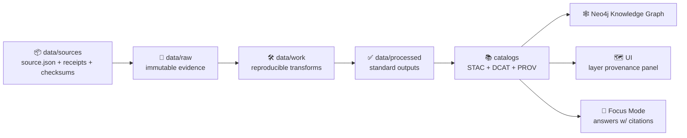

# 📦 `data/sources/` — Source Registry, Evidence Receipts, & Secure Pointers


**This folder is KFM’s “chain-of-custody anchor”** 🧾🧭  
It’s where we keep **machine-readable source definitions** (who/what/where/license/sensitivity), plus **retrieval receipts** and **integrity hashes**, and (when needed) **safe pointers** to data stored outside the public repo.

> ✅ **KFM rule of thumb:** if a dataset/layer/story can’t point to a valid `source.json`, it doesn’t ship.

---

## 🧠 Mental model

KFM is “evidence-first” and “no mystery layers”: every layer is traceable to its origin.  
`data/sources/` is how we keep the *map behind the map*.



---

## ✅ What belongs in `data/sources/`

### Put these here
- **Upstream source manifests** (`source.json`) describing:
  - origin + retrieval method + timestamps
  - license/terms + attribution requirements
  - sensitivity + access classification
  - integrity hashes + file/asset inventory
- **Receipts** from retrieval (headers, API responses metadata, query parameters, etc.)
- **Terms & usage notes** (license text, provider requirements, tribal protocols, embargo notes)
- **Pointers** (when data cannot be committed): references to secure storage / OCI artifacts / internal vault paths **without secrets**

### Don’t put these here
- ❌ Ad-hoc processed outputs (use `data/work/` + `data/processed/`)
- ❌ Untracked “mystery files” with no manifest
- ❌ Secrets (API keys, tokens), ever
- ❌ Restricted bytes in a public repo (store **pointers** + governance metadata instead)

---

## 🗂️ Recommended folder layout

> This is a **recommended** layout. If your domain already has a convention, follow it—just keep the **source pack** concept consistent.

```text
data/
└── 📦 sources/                         # 📦 Upstream sources + receipts + pointers (what we fetched + why + under what terms)
    ├── 📄 README.md                    # 👈 you are here 📌 How sources are recorded, versioned, and linked to raw/work/processed
    ├── 🧩 _templates/                  # 🧩 Copy/paste templates for consistent source documentation
    │   ├── 🧾 source.template.json      # Template: source record (origin, license, contacts, update cadence, notes)
    │   └── 🧾 assets.manifest.template.json # Template: asset manifest (files/URIs, mediaTypes, roles, checksums)
    ├── 🔒 _local/                      # 🔒 Local-only material (gitignored): secrets, scratch downloads, private notes
    ├── 🌎 datasets/                    # 🌎 External datasets (APIs, files, portals) tracked by source + version
    │   └── 🛰️ usgs-nwis/
    │       └── 🏷️ v2026-01-18/          # Versioned source snapshot (date or semver; immutable once recorded)
    │           ├── 🧾 source.json        # Source contract: where it came from, license/terms, contacts, retrieval method
    │           ├── 🧾 assets.manifest.json # Asset list: URIs/paths, roles, mediaTypes, sizes, expected outputs
    │           ├── 🔐📄 checksums.sha256  # Integrity hashes for the source metadata and any stored artifacts
    │           └── 🧾 receipts/          # Acquisition receipts (headers, etags, status, timing, tool versions)
    ├── 📜 documents/                   # 📜 PDFs/scans/transcripts/reports (only if repo policy allows + licensed)
    │   └── 🏛️ ks-historical-society/    # Source docs grouped by provider/collection (keep provenance + licenses)
    ├── 🔌 apis/                        # 🔌 Live feed source definitions (endpoints, throttles, auth strategy, schemas)
    └── 📚 library/                     # 📚 Reference PDFs/books used for design & R&D (track licensing/attribution)
```

### 🔒 Suggested `.gitignore` for this folder
Add (or ensure) patterns like:
```gitignore
data/sources/_local/
data/sources/**/private/
data/sources/**/.secrets/
```

---

## 🧩 “Source pack” anatomy (what a good source looks like)

A **source pack** is a folder that is complete enough for an auditor (or CI) to answer:

1) **What is it?**  
2) **Where did it come from?**  
3) **Can we legally use it?**  
4) **How sensitive is it?**  
5) **Can we verify we got the right bytes?**  
6) **How do we reproduce the fetch?**

### Minimal pack (required)
- `source.json` ✅
- `checksums.sha256` ✅ (if any files are stored locally)
- `receipts/` ✅ (at least one receipt for network fetches)

### Common additions (recommended)
- `assets.manifest.json` (inventory of remote or local assets + hashes)
- `TERMS.md` (human-readable licensing/usage notes)
- `NOTES.md` (quality caveats, known issues, known biases)
- `SAMPLES/` (tiny, non-sensitive sample for tests/docs)
- `APPROVALS.md` (if governance required)

---

## 🏷️ Source IDs, naming, and versioning

### Source IDs
Use stable, globally-unique IDs that won’t change when files move:

- **Pattern:** `kfm.src.<namespace>.<provider>.<slug>`
- **Examples:**
  - `kfm.src.hydro.usgs.nwis`
  - `kfm.src.history.kshs.photo_archive`
  - `kfm.src.ecology.ksdept.endangered_species`

### Folder naming (slug rules)
- ✅ kebab-case
- ✅ no spaces
- ✅ no emoji in folder names (keep emoji in docs, not paths)
- ✅ keep versions explicit (`vYYYY-MM-DD`, `v1.2.3`, etc.)

---

## 📄 `source.json` contract (recommended)

This project uses a **contract-first** mindset: the manifest matters as much as the data.

### Required fields (recommended baseline)
- `source_id`
- `title`
- `source_type` (`dataset` | `api` | `document` | `image` | `model` | `other`)
- `origin.urls[]` *(or a structured origin block, e.g., API endpoint definition)*
- `origin.retrieved_at` *(for snapshots; for live feeds use “first_registered_at”)*
- `license.*`
- `sensitivity.classification`
- `integrity.*` *(hashes and/or checksums file references)*

### Strongly recommended fields
- `provider.name`
- `attribution` (how the UI should credit the source)
- `jurisdiction`
- `governance.approvals[]` (especially for CARE / community-controlled sources)
- `usage_constraints` (human + machine)
- `quality.notes` (limitations, biases, missingness, known error modes)

---

## 🔒 Sensitive / restricted sources (read this twice)

KFM uses sensitivity labeling and “fail-closed” policy gates.  
If a source is restricted, the system should prevent accidental publication and prevent the UI/API from leaking it.

### Classification
Use **at least**:
- `public`
- `restricted`

Optionally (if your governance model needs it):
- `internal`
- `embargoed`
- `cultural_restricted` / `tribal_sensitive`

> **Key rule:** **No output may be less restricted than its inputs.**  
> If the source is restricted/sovereign-controlled, all derivatives remain restricted unless explicitly approved.

### How to store restricted sources safely
**Do this:**
- Commit **only** the manifest + receipts + hashes + safe pointers  
- Store the bytes in:
  - encrypted storage (S3/GCS + KMS, encrypted volume, etc.), or
  - a private OCI artifact registry, or
  - a controlled internal share with audited access

**Avoid this:**
- Committing restricted files into Git history (treat it like leaked secrets; purge if it happens)

### Privacy transformation (when needed)
For sensitive locations or personal data, consider:
- aggregation/generalization (e.g., county-level instead of exact coordinates)
- suppression/redaction (remove or coarsen identifiers)
- k-anonymity / group-based anonymization
- encryption-at-rest for raw files (with controlled decryption in pipelines)

> ⚠️ Privacy methods often reduce data utility and can introduce distortions.  
> Always document what was changed in `NOTES.md` + PROV.

---

## ⏱️ Real-time / changing sources (feeds, APIs, “living” data)

Some sources are not static files (e.g., real-time river gauges). For these:
- `source.json` defines the *feed* (API endpoints, query templates, rate limits, terms)
- Each fetch writes:
  - a receipt (request parameters, timestamps, headers like ETag/Last-Modified when available)
  - a run record (see `data/audits/…` / Run Manifests)
  - a PROV activity linking “this answer/data snapshot” to “this fetch at time T”

---

## 🗺️ How `data/sources/` powers UI + AI

### UI (“map behind the map”)
The UI can show layer details like:
- **Source** (provider + dataset name)
- **License / attribution**
- **Coverage & time**
- **Classification** (and whether it’s limited to authorized users)

### Focus Mode / AI (citations are non-negotiable)
Focus Mode pulls from:
- structured stores (Neo4j + PostGIS)
- unstructured docs (indexed PDFs, narrative text)

…but it must always be able to link results back to *sources*:
- “All search results are linked back to their sources for traceability.”
- If an answer can’t cite a source, policy gates should force a refusal.

### Story Nodes & “View Evidence”
Narratives should ship with:
- human citation blocks **and**
- machine-readable evidence manifests (YAML/JSON) mapping each claim → evidence item (source IDs, checksums, URIs)

---

## ✅ Validation & policy gates (what CI should enforce)

A good `data/sources/` PR should pass:
- ✅ Schema / required fields present (`source.json`)
- ✅ License present (no “unknown license”)
- ✅ Sensitivity classification present
- ✅ Integrity present (hashes / `checksums.sha256` / inventory)
- ✅ Provenance linkability (can downstream artifacts link back to this source?)
- ✅ Secrets scan (hard fail)
- ✅ Broken-pointer checks (if pointer manifests reference nonexistent URIs/paths)

---

## ➕ Add a new source (fast checklist)

1. **Create a new source pack folder**
   - `data/sources/<type>/<provider>/<version>/`

2. **Write `source.json`**
   - fill in license + attribution + classification

3. **Capture receipts**
   - headers, request params, download logs, etc.

4. **Add assets**
   - if public + small: include files
   - if restricted/large: include pointers + hashes only

5. **Generate hashes**
   - store `checksums.sha256` (and/or per-asset hashes in `assets.manifest.json`)

6. **Link it**
   - reference the `source_id` from:
     - `data/raw/...` manifests
     - catalogs (STAC/DCAT/PROV)
     - story evidence manifests

7. **Run gates**
   - CI should fail closed if anything is missing

---

## 📚 Reference library (project files used to define this folder)

### Core KFM design + governance docs
- **Kansas Frontier Matrix (KFM) – Comprehensive Technical Documentation**  
  Contract-first, “no mystery layers,” licensing discipline, auditability.
- **Kansas Frontier Matrix (KFM) – Comprehensive Architecture, Features, and Design**  
  Policy gates, CI enforcement, provenance requirements, governance workflow.
- **Kansas Frontier Matrix (KFM) – AI System Overview 🧭🤖**  
  RAG + graph integration; all results must link back to sources.
- **Kansas Frontier Matrix – Comprehensive UI System Overview**  
  Provenance visible in the UI (“map behind the map”).
- **📚 Kansas Frontier Matrix (KFM) Data Intake – Technical & Design Guide**  
  Provenance-first intake, checksums, restricted data handling, “no output less restricted.”
- **🌟 Kansas Frontier Matrix – Latest Ideas & Future Proposals**  
  PR→PROV integration ideas; operational provenance.
- **Innovative Concepts to Evolve the Kansas Frontier Matrix (KFM)**  
  CARE/TK labels, Mukurtu-style cultural protocols, sensitivity-aware data handling.
- **Additional Project Ideas**  
  Evidence manifests, run manifests, OCI artifact storage, canonical hashing.

### Supporting / background R&D library (optional but useful)
- **AI Concepts & more** (reference compendium)
- **Data Management — architectures, theories, Bayesian methods** (reference compendium)
- **Maps / Google Maps / Virtual Worlds / Archaeology / WebGL** (mapping & visualization reference)
- **Various programming languages & resources** (engineering reference)
- **Data Mining Concepts & Applications** (privacy, anonymization, cryptography patterns)
- **Python Geospatial Analysis Cookbook** (geospatial processing recipes & patterns)

---

## 🧰 Templates (copy/paste)

<details>
<summary><strong>📄 source.template.json</strong></summary>

```json
{
  "source_id": "kfm.src.<namespace>.<provider>.<slug>",
  "title": "Human-readable title",
  "description": "What it is, why we need it, and what it’s used for.",
  "source_type": "dataset",
  "provider": {
    "name": "Provider org/person",
    "contact": "optional",
    "homepage": "optional"
  },
  "origin": {
    "urls": ["https://example.com/source"],
    "retrieval_method": "https|api|manual|partner_drop",
    "retrieved_at": "YYYY-MM-DDThh:mm:ssZ",
    "receipts": ["receipts/<file>.txt"]
  },
  "license": {
    "spdx": "TBD",
    "terms_url": "optional",
    "notes": "Attribution requirements, share-alike constraints, etc."
  },
  "attribution": {
    "text": "How to credit the source in the UI",
    "url": "optional"
  },
  "sensitivity": {
    "classification": "public|restricted",
    "reason": "optional",
    "pii": "none|possible|present",
    "care_label": "optional (e.g., Tribal Sensitive)"
  },
  "integrity": {
    "checksums_file": "checksums.sha256",
    "assets_manifest": "assets.manifest.json",
    "canonical_digest": "optional sha256:..."
  },
  "governance": {
    "approvals": [
      {
        "approved_by": "optional",
        "approved_on": "YYYY-MM-DD",
        "scope": "optional",
        "notes": "optional"
      }
    ],
    "tk_labels": ["optional"],
    "protocols": ["optional"]
  },
  "kfm": {
    "produces_datasets": ["kfm.ds.<domain>.<name>"],
    "notes": "optional"
  }
}
```

</details>

<details>
<summary><strong>📦 assets.manifest.template.json</strong></summary>

```json
{
  "source_id": "kfm.src.<namespace>.<provider>.<slug>",
  "version": "vYYYY-MM-DD",
  "assets": [
    {
      "name": "file-or-object-name.ext",
      "uri": "s3://bucket/path/or/https://url/or/oci://ref",
      "media_type": "application/octet-stream",
      "sha256": "hex-digest",
      "size_bytes": 0,
      "notes": "optional"
    }
  ]
}
```

</details>

<details>
<summary><strong>🧾 checksums.sha256</strong></summary>

```text
<sha256>  files/<filename1>
<sha256>  files/<filename2>
```

</details>

---

## ✅ Definition of Done (for a source-pack PR)

- [ ] `source.json` present and complete (license + classification included)
- [ ] Receipts captured (or documented why not)
- [ ] Integrity hashes recorded (`checksums.sha256` and/or per-asset hashes)
- [ ] No secrets committed (tokens/keys)
- [ ] Restricted sources stored as pointers + hashes (not raw bytes)
- [ ] Linked from downstream catalogs/manifests where relevant
- [ ] Notes added for limitations / biases / caveats
- [ ] CI policy gates pass (fail-closed)

🧭 If you’re unsure: **default to more documentation, more receipts, and stricter classification.**

