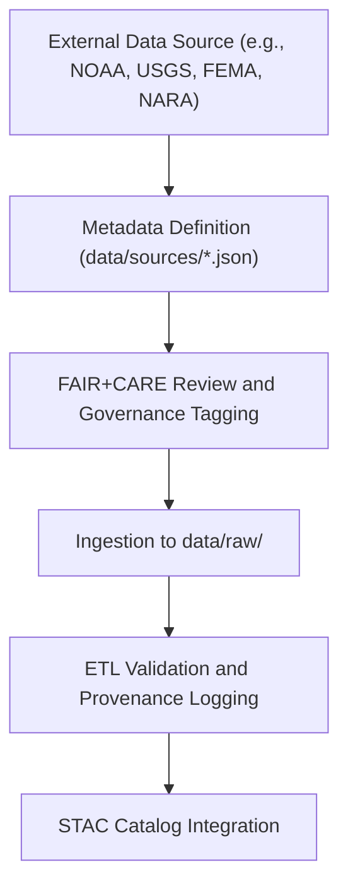

<div align="center">

# 🔗 Kansas Frontier Matrix — **Data Source Index**
`data/sources/README.md`

**Purpose:** Serves as the master registry for all external data sources ingested into the Kansas Frontier Matrix (KFM).  
Each JSON file within this directory describes a unique data provider, access method, license, and governance metadata to ensure reproducibility, traceability, and FAIR+CARE compliance.

[](../../docs/standards/faircare-validation.md)
[](../../LICENSE)
[](../../docs/architecture/repo-focus.md)

</div>

---

## 📚 Overview

The `data/sources/` directory functions as the **centralized catalog of data origins** for all KFM raw datasets.  
It provides a standardized framework for documenting:
- Data provider information (institution, contact, API endpoints)  
- License and access rights  
- Provenance metadata and FAIR+CARE alignment  
- Temporal and spatial coverage of datasets  
- Validation and governance linkage  

This directory ensures that every dataset ingested into KFM maintains verifiable provenance and transparency under the **Master Coder Protocol (MCP-DL v6.3)**.

---

## 🗂️ Directory Layout

```plaintext
data/sources/
├── README.md                            # This file — overview of data sources and governance
│
├── usgs_historic_topo.json              # U.S. Geological Survey topographic map index
├── noaa_weather_datasets.json           # NOAA climate and storm event datasets
└── kansas_archival_maps.json            # Digitized historical and treaty map sources (Kansas Historical Society)
```

---

## ⚙️ Governance Workflow



### Description:
1. **Metadata Definition:** Each source is represented as a structured JSON file defining access URLs, license, and schema.  
2. **FAIR+CARE Review:** Governance validation ensures open data compliance and ethical stewardship.  
3. **Ingestion:** Data pulled automatically from defined sources using authenticated or public APIs.  
4. **Provenance Logging:** Source IDs linked to governance ledger and manifest.  
5. **STAC Integration:** All metadata indexed under the STAC catalog for discoverability.

---

## 🧩 Example Source Record — `noaa_weather_datasets.json`

```json
{
  "id": "noaa_weather_datasets",
  "title": "NOAA Climate and Storm Events Data",
  "provider": "National Oceanic and Atmospheric Administration (NOAA)",
  "description": "Collection of open datasets including storm events, temperature anomalies, and drought monitor data for Kansas.",
  "api_endpoints": [
    "https://www.ncdc.noaa.gov/stormevents/",
    "https://www.ncei.noaa.gov/access/monitoring/climate-at-a-glance/"
  ],
  "license": "Public Domain (U.S. Federal Data)",
  "spatial_extent": [-102.05, 36.99, -94.61, 40.00],
  "temporal_extent": ["1900-01-01", "2025-12-31"],
  "governance_tags": ["FAIR+CARE", "Open Data", "Public Domain"],
  "linked_datasets": [
    "data/raw/noaa/storm_events/",
    "data/raw/noaa/drought_monitor/",
    "data/raw/noaa/temperature_anomalies/"
  ],
  "checksum_reference": "releases/v9.3.2/manifest.zip"
}
```

---

## ⚖️ Licensing & Attribution

| Provider | License | Notes |
|-----------|----------|-------|
| **NOAA** | Public Domain | Official U.S. government datasets (federal open data). |
| **USGS** | Public Domain | U.S. Geological Survey open geoscience data. |
| **FEMA** | Public Domain | Disaster, hazard, and mitigation datasets. |
| **KGS / Kansas Historical Society** | CC-BY 4.0 | Attribution required for archival materials. |

Each JSON metadata file defines specific license, contact, and access policies per provider.

---

## 🧠 FAIR+CARE Compliance Integration

| Principle | Implementation |
|------------|----------------|
| **Findable** | Indexed through STAC and manifest with unique provider IDs. |
| **Accessible** | Metadata openly available under permissive licensing. |
| **Interoperable** | JSON schema adheres to DCAT 3.0 / STAC 1.0 standards. |
| **Reusable** | Includes provenance, license, and access details. |
| **Collective Benefit** | Ensures open reuse for research and public benefit. |
| **Authority to Control** | Source organizations retain ownership and attribution. |
| **Responsibility** | Governance Council verifies data accuracy and ethics. |
| **Ethics** | Sources reviewed for transparency and open-access alignment. |

Governance metadata and validation reports stored in:  
- `data/reports/audit/data_provenance_ledger.json`  
- `data/reports/fair/data_fair_summary.json`

---

## 🔍 Governance Integration

| Record | Purpose |
|---------|----------|
| `data/reports/audit/data_provenance_ledger.json` | Tracks ingestion, validation, and source linkage. |
| `data/reports/fair/data_care_assessment.json` | FAIR+CARE compliance and ethics audit results. |
| `releases/v9.3.2/manifest.zip` | Checksum validation for all registered source datasets. |

---

## 🧾 Citation Example

```text
Kansas Frontier Matrix (2025). Data Source Index (v9.3.2).
Comprehensive registry of verified data providers integrated into the Kansas Frontier Matrix system.
Available at: https://github.com/bartytime4life/Kansas-Frontier-Matrix/tree/main/data/sources
License: Open Data / CC-BY 4.0
```

---

## 🧾 Version Notes

| Version | Date | Notes |
|----------|------|--------|
| v9.3.2 | 2025-10-28 | Added new source metadata for NARA archival treaty data. |
| v9.2.0 | 2024-07-15 | Expanded NOAA and USGS metadata; standardized schema with DCAT. |
| v9.0.0 | 2023-01-10 | Established data source registry and metadata standardization. |

---

<div align="center">

**Kansas Frontier Matrix** · *Provenance × FAIR+CARE Data Lineage × Open Science Governance*  
[🔗 Repository](https://github.com/bartytime4life/Kansas-Frontier-Matrix) • [🧭 Docs Portal](../../docs/) • [⚖️ Governance Ledger](../../docs/standards/governance/)

</div>