<div align="center">

# 🧩 Kansas Frontier Matrix — **Source Manifests**

`data/sources/`

**Mission:** Document and govern every **external data source** used by KFM with MCP-grade provenance, licensing, and reproducibility.

[](../../.github/workflows/site.yml)
[](../../.github/workflows/stac-validate.yml)
[](../../.github/workflows/codeql.yml)
[](../../.pre-commit-config.yaml)
[](https://openssf.org/)
[](../../docs/)
[](../../LICENSE)
[](./schema/source.schema.json)

</div>

---

## 📚 Overview

`data/sources/` holds **machine-readable JSON manifests** that define each external dependency (origin, access, license, cadence), serving as the **authoritative registry** driving ETL, provenance, and STAC linkages across KFM.

**Each manifest captures:**

* **Identity & versioning** (`id`, `title`, `source_version`)
* **Access details** (URLs, APIs, auth mode, rate limits, mirrors)
* **Legal** (license, attribution, usage constraints)
* **Temporal & spatial coverage**
* **Data characteristics** (type, format, schema refs)
* **Operational metadata** (update frequency, SLOs, last verified)
* **Provenance bindings** (linked pipeline, outputs, STAC references, checksums)

---

## 🗂️ Directory Layout

```bash
data/sources/
├── README.md
├── schema/
│   └── source.schema.json
├── terrain/               # USGS 3DEP, DASC LiDAR, SRTM
│   ├── ks_lidar_2018_2020.json
│   └── usgs_3dep_dem.json
├── hydrology/             # NHD, WBD, FEMA NFHL
│   ├── usgs_nhd_flowlines.json
│   ├── epa_wbd_huc12.json
│   └── fema_nfhl.json
├── landcover/             # NLCD, CDL, historic vegetation
│   ├── nlcd_1992_2021.json
│   └── usda_cdl_2020.json
├── climate/               # Daymet, NOAA Normals, USDM
│   ├── nasa_daymet_1980_2024.json
│   ├── noaa_normals_1991_2020.json
│   └── usdm_drought_monitor.json
├── hazards/               # Storm events, wildfire, floods
│   ├── noaa_storm_events.json
│   ├── usgs_wildfire_perimeters.json
│   └── fema_flood_events.json
├── tabular/               # Census, USDA, BEA, BLS
│   ├── us_census_population.json
│   ├── usda_agriculture_production.json
│   └── bea_economic_indicators.json
└── text/                  # OCR inputs, transcripts, treaty corpora
    ├── loc_chronicling_america.json
    ├── kshs_oral_histories.json
    └── yale_avalon_treaties.json
```

> **Note:** All manifests **must** validate against `schema/source.schema.json` and include `last_verified` timestamps.

---

## 🧭 System Context (GitHub-safe Mermaid)

```mermaid
flowchart TD
  A["Sources\n\"APIs · Downloads · Feeds\""] --> B["Manifests\n`data/sources/*.json`"]
  B --> C["ETL Pipelines\n`src/pipelines/*`"]
  C --> D["Processed Layers\n`data/processed/`"]
  D --> E["STAC Catalog\n`data/stac/`"]
  E --> F["App Config\n`web/config/*.json`"]
  E --> G["Knowledge Graph\n\"Neo4j · CIDOC CRM · OWL-Time\""]
  B --> H["CI Checks\n\"Schema · Availability · Licenses\""]
  H --> I["Badges & Gates\n\"readme · PR checks\""]
  C --> J["Checksums\n`data/checksums/`"]
  J --> E
%%END OF MERMAID%%
```



---

## 🧩 Source Manifest — **Extended Example**

### `usgs_3dep_dem.json`

```json
{
  "id": "usgs_3dep_dem",
  "title": "USGS 3D Elevation Program (3DEP) LiDAR DEM",
  "provider": "USGS",
  "source_version": "2020.10",
  "description": "1 m LiDAR-derived elevation mosaics from USGS 3DEP.",
  "endpoints": [
    {
      "type": "esri-image-server",
      "url": "https://elevation.nationalmap.gov/arcgis/rest/services/3DEPElevation/ImageServer",
      "auth": "none",
      "rate_limit_rps": 10
    }
  ],
  "license": {
    "type": "Public Domain",
    "attribution": "U.S. Geological Survey",
    "url": "https://www.usgs.gov/information-policies-and-instructions"
  },
  "data": {
    "kind": "raster",
    "format": "GeoTIFF",
    "resolution": "1 m",
    "crs": "EPSG:3857",
    "schema_ref": null
  },
  "coverage": {
    "spatial": "Kansas, USA",
    "temporal": {"start": "2018-01-01", "end": "2020-12-31"}
  },
  "operations": {
    "update_frequency": "on_demand",
    "availability_slo": ">= 99.0%",
    "last_verified": "2025-10-12",
    "mirrors": []
  },
  "provenance": {
    "linked_pipeline": "terrain_pipeline.py",
    "produces": [
      {"path": "data/processed/terrain/ks_dem_1m_2018_2020.tif", "checksum_sha256": null}
    ],
    "stac_links": ["data/stac/collections/terrain.json"]
  },
  "status": "active",
  "notes": "Primary DEM source for hillshade, slope, and hydrology derivatives."
}
```

---

## ✅ Validation & CI

**CLI (local):**

```bash
# Validate JSON manifests against schema
python src/utils/validate_sources.py data/sources/ --schema data/sources/schema/source.schema.json

# Check availability & license fields
python src/utils/check_availability.py data/sources/
python src/utils/check_licenses.py data/sources/
```

**Make targets:**

```bash
make sources           # validate schema + list deltas
make sources-validate  # schema, availability, license audits
make sources-fetch     # dry-run or execute source pulls (where applicable)
make clean-sources     # remove temp caches
```

**CI gates (PRs):**

* **JSON Schema validate** (must pass)
* **URL availability & rate-limit probe**
* **License compliance** (explicit license + attribution)
* **Change impact report** (lists ETL + STAC items affected)

---

## 🧪 MCP Compliance Matrix

| Principle           | Implementation                                                                               |
| ------------------- | -------------------------------------------------------------------------------------------- |
| Documentation-first | Canonical, versioned JSON manifests with inline legal & operational fields.                  |
| Reproducibility     | Deterministic ETL uses manifests; outputs hashed; STAC links preserved.                      |
| Open Standards      | JSON + JSON Schema; STAC 1.0 alignment; OWL-Time for temporal semantics (KG side).           |
| Provenance          | `provenance.*` links inputs → pipelines → outputs → STAC; checksums + commit IDs in reports. |
| Auditability        | CI badges, per-PR reports, and changelog entries; `last_verified` timestamps enforced.       |

---

## 🧠 AI-Assisted Data Entry (Optional)

Use these prompts to generate draft manifests then **validate & review**:

* *“Draft a KFM source manifest for NOAA Normals 1991–2020 with monthly precipitation and temperature, CSV format, coverage Kansas, license NOAA Open Data.”*
* *“Given this API URL and docs, infer fields for rate limits, update cadence, and attribution; output JSON validating against `source.schema.json`.”*

---

## 🧩 Integration Points

| Component               | Connection                                                               |
| ----------------------- | ------------------------------------------------------------------------ |
| `src/pipelines/*`       | Reads manifests for fetching, throttling, retries, and attribution.      |
| `data/processed/`       | Outputs linked via `provenance.produces`.                                |
| `data/checksums/`       | SHA-256 tracked; surfaced in PR diffs.                                   |
| `data/stac/`            | Collections/Items reference the source `id` in `properties.provenance`.  |
| `web/config/*.json`     | Layer entries include `source_id` for traceable UI metadata.             |
| Knowledge Graph (Neo4j) | Nodes: `Source` → relations: `FEEDS` → `Dataset`, `DERIVES` → `Product`. |

---

## 🧭 Update Lifecycle (Mermaid sequence)

```mermaid
sequenceDiagram
  autonumber
  participant Dev as "Contributor"
  participant Repo as "KFM Repo"
  participant CI as "CI · Validators"
  participant Pip as "ETL Pipeline"
  participant STAC as "STAC Catalog"

  Dev->>Repo: Add/modify manifest in `data/sources/`
  Repo-->>CI: Pull Request triggers validators
  CI->>CI: Schema ✔ · URLs ✔ · License ✔ · Impact report
  CI-->>Dev: Status checks & review notes
  Dev->>Repo: Merge to main
  Repo->>Pip: `make sources && make fetch`
  Pip->>STAC: Update items with provenance links
  STAC-->>Repo: Publish artifacts & checksums
%%END OF MERMAID%%
```



---

## 🧹 Maintenance Rules

* **Add a source:** copy template → fill all required fields → run local validators → open PR.
* **Deprecate:** set `"status": "deprecated"` and point to the successor manifest.
* **Verify routinely:** bump `last_verified` when checks pass (manual or CI probe).
* **Legal:** include attribution text in `license.attribution`; add `use_constraints` if required.

---

## 🔎 Field Reference (Schema Highlights)

| Field                      | Type   | Required | Example / Notes                                  |
| -------------------------- | ------ | -------- | ------------------------------------------------ |
| `id`                       | string | yes      | `noaa_normals_1991_2020`                         |
| `source_version`           | string | no       | `v1.2`, `2024.06`                                |
| `endpoints[].type`         | enum   | yes*     | `http`, `s3`, `esri-image-server`, `ftp`         |
| `license.type`             | string | yes      | `CC-BY 4.0`, `Public Domain`, `Custom`           |
| `data.kind`                | enum   | yes      | `raster`, `vector`, `tabular`, `text`            |
| `coverage.temporal`        | object | no       | `{ "start": "YYYY-MM-DD", "end": "YYYY-MM-DD" }` |
| `operations.last_verified` | date   | yes      | `2025-10-12`                                     |
| `provenance.produces[]`    | array  | no       | link outputs and optional expected checksums     |
| `status`                   | enum   | yes      | `active`, `deprecated`, `experimental`           |

---

## 🧾 Changelog

> Follow **SemVer** and update this table on every change impacting structure, fields, or CI.

| Version  | Date       | Changes                                                                                      |
| -------- | ---------- | -------------------------------------------------------------------------------------------- |
| **v1.1** | 2025-10-12 | Added extended schema fields, CI gates, AI prompts, Mermaid diagrams, and maintenance rules. |
| v1.0     | 2025-10-04 | Initial creation of Source Manifests README and baseline layout.                             |

---

## 🏷️ Version Block

```text
Component: data/sources/README.md
SemVer: 1.1.0
Spec Dependencies: MCP v1.0, STAC 1.0
Last Updated: 2025-10-12
Maintainers: @bartytime4life
```

---

<div align="center">

**Kansas Frontier Matrix** — *“Every dataset has a story — and every story starts with a source.”*
📍 [`data/sources/`](.) · **Canonical registry** of external inputs powering KFM.

</div>
