<div align="center">

# 🌦️ Kansas Frontier Matrix — Climate Source Manifests

`data/sources/climate/`

**Mission:** Curate, document, and validate all **external climate and atmospheric data sources**
used within the Kansas Frontier Matrix (KFM). These foundational datasets provide temperature, precipitation,
drought, and other climate indicators used for long-term environmental reconstruction and modeling.

[](../../../.github/workflows/site.yml)
[](../../../.github/workflows/stac-validate.yml)
[](../schema/source.schema.json)
[](../../../.github/workflows/codeql.yml)
[](../../../docs/)
[](../../../LICENSE)

</div>

---

## 📚 Overview

The `data/sources/climate/` directory houses **JSON manifests** describing all
external climate datasets integrated into KFM — spanning historical reanalysis,
station observations, drought indices, and remote sensing climate models.

These sources power:

* Temperature and precipitation climatologies
* Drought and evapotranspiration metrics
* Climate normals and anomalies
* Temporal visualizations and simulation inputs

Each manifest adheres to the **Master Coder Protocol (MCP)** and
validates against `data/sources/schema/source.schema.json`.

---

## 🗂️ Directory Layout

```bash
data/sources/climate/
├── README.md
├── nasa_daymet_1980_2024.json          # NASA Daymet daily climate data
├── noaa_normals_1991_2020.json         # NOAA Climate Normals (30-year)
└── usdm_drought_monitor.json           # U.S. Drought Monitor weekly indices
```

> **Note:**
> Each manifest defines licensing, access URLs, temporal coverage, provenance, and schema compliance —
> forming the climate backbone for Kansas-wide environmental modeling.

---

## 🌡️ Example: `nasa_daymet_1980_2024.json`

```json
{
  "id": "nasa_daymet_1980_2024",
  "title": "NASA Daymet Daily Surface Weather Data (1980–2024)",
  "provider": "NASA ORNL DAAC",
  "description": "Gridded daily surface weather observations providing temperature, precipitation, and radiation data.",
  "endpoint": "https://daymet.ornl.gov/single-pixel/",
  "access_method": "HTTP API",
  "license": "NASA Open Data (US Government)",
  "data_type": "raster",
  "format": "NetCDF",
  "spatial_coverage": "Kansas, USA",
  "temporal_coverage": "1980–2024",
  "update_frequency": "Annual",
  "last_verified": "2025-10-12",
  "linked_pipeline": "climate_pipeline.py",
  "notes": "Primary input for temperature and precipitation climate layers."
}
```

---

## ☁️ System Context (GitHub-safe Mermaid)

```mermaid
flowchart TD
  A["External Climate Datasets\nNASA · NOAA · USDA"] --> B["Source Manifests\n`data/sources/climate/*.json`"]
  B --> C["ETL Pipelines\n`src/pipelines/climate_pipeline.py`"]
  C --> D["Processed Climate Data\n`data/processed/climate/`"]
  D --> E["Derivatives\nAnomalies · Drought Indices · Normals"]
  D --> F["STAC Collections\n`data/stac/collections/climate.json`"]
  F --> G["Web Viewer\nTime Slider · Map Layers · Charts"]
  E --> H["Knowledge Graph\nClimate ↔ Hydrology ↔ Landcover Relations"]
%%END OF MERMAID%%
```



---

## 🌍 Climate Source Summary

| Manifest File                 | Provider  | Description                                        | Coverage | Format     | Verified     |
| :---------------------------- | :-------- | :------------------------------------------------- | :------- | :--------- | :----------- |
| `nasa_daymet_1980_2024.json`  | NASA      | Gridded daily temperature & precipitation (Daymet) | Kansas   | NetCDF     | ✅ 2025-10-12 |
| `noaa_normals_1991_2020.json` | NOAA      | 30-year climatological averages                    | U.S.     | CSV/NetCDF | ✅ 2025-10-12 |
| `usdm_drought_monitor.json`   | USDA/NDMC | Weekly U.S. Drought Monitor shapefiles             | Kansas   | Shapefile  | ✅ 2025-10-12 |

---

## 🧾 ETL Integration

**Pipeline:** `src/pipelines/climate_pipeline.py`
**Output Directory:** `data/processed/climate/`

### Workflow

1. **Validate** all source manifests (`make sources-validate`)
2. **Fetch** data from APIs or FTP endpoints
3. **Convert** to standardized NetCDF / GeoTIFF
4. **Reproject** to EPSG:3857
5. **Generate** climatologies and anomaly grids
6. **Register** outputs in STAC + checksum directories

---

## 🧪 Validation Commands

**Manual Validation**

```bash
python src/utils/validate_sources.py data/sources/climate/ --schema data/sources/schema/source.schema.json
```

**Make Targets**

```bash
make climate-sources
make climate-validate
```

**CI/CD Validation**

* Schema compliance
* License and attribution checks
* Endpoint accessibility
* Temporal coverage consistency
* Changelog auto-update on manifest edit

---

## 🧩 Provenance Integration

| Component                            | Function                                                 |
| :----------------------------------- | :------------------------------------------------------- |
| `data/raw/climate/`                  | Immutable downloaded files (NetCDF, CSV, Shapefile)      |
| `data/processed/climate/`            | Cleaned and reprojected climate rasters                  |
| `data/stac/collections/climate.json` | STAC metadata linking processed data to source manifests |
| `data/checksums/climate/`            | SHA-256 integrity validation files                       |
| `src/pipelines/climate_pipeline.py`  | Automated ETL for climate source ingestion               |

---

## 🧠 MCP Compliance Summary

| MCP Principle           | Implementation                                                                |
| :---------------------- | :---------------------------------------------------------------------------- |
| **Documentation-first** | Every climate source fully defined and version-controlled via JSON manifests. |
| **Reproducibility**     | Deterministic ETL via pipeline referencing manifest attributes.               |
| **Open Standards**      | JSON Schema · STAC 1.0 · NetCDF · GeoTIFF · EPSG:3857.                        |
| **Provenance**          | End-to-end linkage from manifest → STAC → derived layers.                     |
| **Auditability**        | Continuous integration with schema, license, and checksum validation.         |

---

## 🧾 Changelog

| Version  | Date       | Summary                                                                                         |
| :------- | :--------- | :---------------------------------------------------------------------------------------------- |
| **v1.1** | 2025-10-12 | Added Mermaid diagram, expanded ETL and validation details, updated Daymet/NOAA/USDM manifests. |
| v1.0     | 2025-10-04 | Initial creation of climate source documentation directory.                                     |

---

## 🏷️ Version Block

```text
Component: data/sources/climate/README.md
SemVer: 1.1.0
Spec Dependencies: MCP v1.0 · STAC 1.0
Last Updated: 2025-10-12
Maintainer: @bartytime4life
```

---

<div align="center">

**Kansas Frontier Matrix** — *“The sky writes history in patterns of rain, drought, and wind — we simply record the data.”*
📍 [`data/sources/climate/`](.) · Canonical registry for all atmospheric and climatological data powering KFM.

</div>

