<div align="center">

# ⚠️ Kansas Frontier Matrix — Hazards Source Manifests

`data/sources/hazards/`

**Mission:** Curate, document, and maintain authoritative records of all **external hazard-related data sources**
feeding the Kansas Frontier Matrix (KFM). These inputs form the foundation for historical and predictive analyses
of floods, tornadoes, wildfires, droughts, and other disaster events impacting Kansas.

[](../../../.github/workflows/site.yml)
[](../../../.github/workflows/stac-validate.yml)
[](../schema/source.schema.json)
[](../../../.github/workflows/codeql.yml)
[](../../../docs/)
[](../../../LICENSE)

</div>

---

## 📚 Overview

The `data/sources/hazards/` directory contains **JSON manifests** describing all external data sources
used to analyze natural hazards and disaster risk across Kansas.

These include datasets for:

* Tornado, storm, and hail events (NOAA Storm Events Database)
* Wildfire perimeters (USGS / USFS)
* Flood extents and damage zones (FEMA NFHL, NWS)
* Drought severity and hazard composites

Each manifest aligns with the standard schema in `data/sources/schema/source.schema.json`
to ensure interoperability, validation, and traceable provenance across all KFM workflows.

---

## 🗂️ Directory Layout

```bash
data/sources/hazards/
├── README.md
├── noaa_storm_events.json          # NOAA storm, hail, and tornado event reports
├── usgs_wildfire_perimeters.json   # Wildfire perimeters (USGS/USFS)
└── fema_flood_events.json          # FEMA flood hazard events
```

> **Note:** Each manifest defines dataset identifiers, URLs, formats, update cadences,
> and provenance links, enabling full lifecycle reproducibility within the Kansas Frontier Matrix.

---

## 🌪️ Example: `noaa_storm_events.json`

```json
{
  "id": "noaa_storm_events",
  "title": "NOAA Storm Events Database (1950–Present)",
  "provider": "National Centers for Environmental Information (NCEI)",
  "description": "Comprehensive database of tornado, hail, wind, and storm events recorded across the U.S.",
  "endpoint": "https://www.ncei.noaa.gov/pub/data/swdi/stormevents/",
  "access_method": "FTP/HTTP download",
  "license": "Public Domain (US Government)",
  "data_type": "tabular",
  "format": "CSV",
  "spatial_coverage": "Kansas, USA",
  "temporal_coverage": "1950–Present",
  "update_frequency": "Monthly",
  "last_verified": "2025-10-12",
  "linked_pipeline": "hazards_pipeline.py",
  "notes": "Used for tornado track mapping, event counts, and temporal hazard modeling."
}
```

---

## 🌍 System Context (GitHub-safe Mermaid)

```mermaid
flowchart TD
  A["External Hazard Sources\nNOAA · FEMA · USGS · NWS"] --> B["Source Manifests\n`data/sources/hazards/*.json`"]
  B --> C["ETL Pipeline\n`src/pipelines/hazards_pipeline.py`"]
  C --> D["Processed Hazard Layers\n`data/processed/hazards/`"]
  D --> E["Derivatives\nTornado Tracks · Flood Polygons · Fire Perimeters"]
  D --> F["STAC Collections\n`data/stac/collections/hazards.json`"]
  F --> G["Web Viewer\nHazard Map Layers · Time Animations"]
  E --> H["Knowledge Graph\nHazard ↔ Climate ↔ Population Links"]
%%END OF MERMAID%%
```



---

## ⚙️ Hazards Source Summary

| Manifest File                   | Provider  | Description                                           | Coverage | Format    | Verified     |
| :------------------------------ | :-------- | :---------------------------------------------------- | :------- | :-------- | :----------- |
| `noaa_storm_events.json`        | NOAA      | Tornado, hail, and storm event records (1950–present) | Kansas   | CSV       | ✅ 2025-10-12 |
| `usgs_wildfire_perimeters.json` | USGS/USFS | Wildfire perimeter polygons                           | Kansas   | Shapefile | ✅ 2025-10-12 |
| `fema_flood_events.json`        | FEMA      | Flood hazard and disaster event polygons              | Kansas   | GDB       | ✅ 2025-10-12 |

---

## 🧾 ETL Integration

**Pipeline:** `src/pipelines/hazards_pipeline.py`
**Target Directory:** `data/processed/hazards/`

### Workflow

1. **Validate** source manifests (`make sources-validate`)
2. **Download** hazard datasets from provider endpoints
3. **Transform** into standard geospatial formats (GeoPackage, GeoJSON)
4. **Clip & project** to Kansas state boundary (EPSG:3857)
5. **Compute** hazard frequency and impact summaries
6. **Publish** to STAC & integrity-checked outputs (`data/checksums/hazards/`)

---

## 🧪 Validation Commands

**Manual Validation**

```bash
python src/utils/validate_sources.py data/sources/hazards/ --schema data/sources/schema/source.schema.json
```

**Make Targets**

```bash
make hazards-sources
make hazards-validate
```

**CI/CD Checks**

* Schema validation
* Endpoint accessibility
* License compliance
* Update cadence verification
* Automated changelog updates

---

## 🧩 Provenance Integration

| Component                            | Function                                          |
| :----------------------------------- | :------------------------------------------------ |
| `data/raw/hazards/`                  | Immutable raw hazard event datasets               |
| `data/processed/hazards/`            | Standardized hazard layers for analysis           |
| `data/stac/collections/hazards.json` | STAC metadata linking to manifests                |
| `data/checksums/hazards/`            | SHA-256 hash validation for all processed outputs |
| `src/pipelines/hazards_pipeline.py`  | ETL driver connecting manifests to processed data |

---

## 🧠 MCP Compliance Summary

| MCP Principle           | Implementation                                                  |
| :---------------------- | :-------------------------------------------------------------- |
| **Documentation-first** | Each hazard source documented in JSON manifest format.          |
| **Reproducibility**     | Deterministic ETL pipelines reference manifest definitions.     |
| **Open Standards**      | JSON Schema, STAC 1.0, GeoPackage, EPSG:3857.                   |
| **Provenance**          | End-to-end linkage between manifest, STAC item, and checksum.   |
| **Auditability**        | Continuous CI checks with validation badges and changelog logs. |

---

## 🧾 Changelog

| Version  | Date       | Summary                                                                        |
| :------- | :--------- | :----------------------------------------------------------------------------- |
| **v1.1** | 2025-10-12 | Added workflow diagram, validation details, and new hazard manifest structure. |
| v1.0     | 2025-10-04 | Initial creation of hazards source documentation.                              |

---

## 🏷️ Version Block

```text
Component: data/sources/hazards/README.md
SemVer: 1.1.0
Spec Dependencies: MCP v1.0 · STAC 1.0
Last Updated: 2025-10-12
Maintainer: @bartytime4life
```

---

<div align="center">

**Kansas Frontier Matrix** — *“Disasters shape the landscape — and data preserves their memory.”*
📍 [`data/sources/hazards/`](.) · Canonical registry of hazard data sources powering KFM’s disaster and resilience modeling.

</div>

