<div align="center">

# 🌾 Kansas Frontier Matrix — Landcover Source Manifests

`data/sources/landcover/`

**Mission:** Curate, document, and validate all **external landcover and vegetation data sources**
integrated into the Kansas Frontier Matrix (KFM). These datasets define the vegetative and land-use
foundations for ecological, agricultural, and environmental analysis across Kansas.

[](../../../.github/workflows/site.yml)
[](../../../.github/workflows/stac-validate.yml)
[](../schema/source.schema.json)
[](../../../.github/workflows/codeql.yml)
[](../../../docs/)
[](../../../LICENSE)

</div>

---

## 📚 Overview

The `data/sources/landcover/` directory stores **JSON manifest files** documenting every
external dataset used to describe **vegetation, cropland, impervious surfaces, and
historical land-use** patterns in Kansas.

These sources are used to:

* Build multi-decadal landcover change models
* Support ecological and carbon sequestration studies
* Provide land-use context for hydrology and hazards layers
* Generate derivative vegetation rasters and STAC items

Each manifest adheres to the canonical schema in
`data/sources/schema/source.schema.json`, enabling reproducibility, provenance tracking,
and automated validation through CI pipelines.

---

## 🗂️ Directory Layout

```bash
data/sources/landcover/
├── README.md
├── nlcd_1992_2021.json     # Multi-epoch NLCD landcover rasters
└── usda_cdl_2020.json      # USDA Cropland Data Layer (2020)
```

> **Note:** Each manifest defines licensing, access URLs, format, temporal coverage,
> and provenance — ensuring the full lineage of all vegetation data within KFM.

---

## 🌿 Example: `nlcd_1992_2021.json`

```json
{
  "id": "nlcd_1992_2021",
  "title": "USGS National Land Cover Database (NLCD, 1992–2021)",
  "provider": "USGS",
  "description": "Multi-epoch landcover dataset providing 30-meter classified raster data across the United States.",
  "endpoint": "https://www.mrlc.gov/data/nlcd-land-cover-conus-all-years",
  "access_method": "HTTP download",
  "license": "Public Domain (US Government)",
  "data_type": "raster",
  "format": "GeoTIFF",
  "spatial_coverage": "Kansas, USA",
  "temporal_coverage": "1992–2021",
  "update_frequency": "Every 5 years",
  "last_verified": "2025-10-12",
  "linked_pipeline": "landcover_pipeline.py",
  "notes": "Used for land-use change, vegetation index, and habitat fragmentation analysis."
}
```

---

## 🧭 System Context (GitHub-safe Mermaid)

```mermaid
flowchart TD
  A["External Landcover Sources\nUSGS · USDA · NASA"] --> B["Source Manifests\n`data/sources/landcover/*.json`"]
  B --> C["ETL Pipelines\n`src/pipelines/landcover_pipeline.py`"]
  C --> D["Processed Landcover Layers\n`data/processed/landcover/`"]
  D --> E["Derivatives\nChange Detection · NDVI · Canopy Cover"]
  D --> F["STAC Collections\n`data/stac/collections/landcover.json`"]
  F --> G["Web Viewer\nMapLibre · Time Slider · Filter UI"]
  E --> H["Knowledge Graph\nLandcover ↔ Climate ↔ Hydrology Links"]
%%END OF MERMAID%%
```



---

## 🌍 Landcover Source Summary

| Manifest File         | Provider | Description                                | Coverage | Format  | Verified     |
| :-------------------- | :------- | :----------------------------------------- | :------- | :------ | :----------- |
| `nlcd_1992_2021.json` | USGS     | 30 m CONUS landcover classification (NLCD) | Kansas   | GeoTIFF | ✅ 2025-10-12 |
| `usda_cdl_2020.json`  | USDA     | 30 m Cropland Data Layer for agriculture   | Kansas   | GeoTIFF | ✅ 2025-10-12 |

---

## 🧾 ETL Integration

**Pipeline:** `src/pipelines/landcover_pipeline.py`
**Target Directory:** `data/processed/landcover/`

### Workflow

1. **Validate** manifests (`make sources-validate`).
2. **Fetch** NLCD / CDL data from providers.
3. **Reproject** and mosaic to state extent.
4. **Derive** classification masks and percent cover rasters.
5. **Generate** STAC metadata and update checksums.
6. **Publish** processed outputs to GitHub + STAC hub.

---

## 🧪 Validation Commands

**Manual Validation**

```bash
python src/utils/validate_sources.py data/sources/landcover/ --schema data/sources/schema/source.schema.json
```

**Make Targets**

```bash
make landcover-sources
make landcover-validate
```

**CI Tests**

* JSON Schema compliance
* URL & license validation
* Coverage/temporal consistency checks
* Auto-changelog on manifest update

---

## 🧩 Provenance Integration

| Component                              | Role                                          |
| :------------------------------------- | :-------------------------------------------- |
| `data/raw/landcover/`                  | Immutable NLCD/CDL downloads                  |
| `data/processed/landcover/`            | Reprojected, standardized GeoTIFFs            |
| `data/stac/collections/landcover.json` | STAC metadata linking to processed layers     |
| `data/checksums/landcover/`            | Integrity verification via `.sha256`          |
| `src/pipelines/landcover_pipeline.py`  | Handles ingestion, transformation, and export |

---

## 🧠 MCP Compliance Summary

| MCP Principle           | Implementation                                             |
| :---------------------- | :--------------------------------------------------------- |
| **Documentation-first** | All landcover sources documented with schema validation.   |
| **Reproducibility**     | Deterministic ETL using manifest parameters.               |
| **Open Standards**      | JSON Schema · GeoTIFF · STAC 1.0 · EPSG:3857.              |
| **Provenance**          | Full lineage tracked via manifest → pipeline → STAC.       |
| **Auditability**        | Checksums, CI validations, and `last_verified` timestamps. |

---

## 🧾 Changelog

| Version  | Date       | Summary                                                                   |
| :------- | :--------- | :------------------------------------------------------------------------ |
| **v1.1** | 2025-10-12 | Added workflow diagram, expanded validation, updated NLCD/CDL references. |
| v1.0     | 2025-10-04 | Initial creation of landcover source manifest documentation.              |

---

## 🏷️ Version Block

```text
Component: data/sources/landcover/README.md
SemVer: 1.1.0
Spec Dependencies: MCP v1.0 · STAC 1.0
Last Updated: 2025-10-12
Maintainer: @bartytime4life
```

---

<div align="center">

**Kansas Frontier Matrix** — *“Vegetation tells the story of change — and landcover maps the memory of the land.”*
📍 [`data/sources/landcover/`](.) · Canonical registry of vegetation and land-use sources powering KFM’s ecological analytics.

</div>

