<div align="center">

# 🧱 Kansas Frontier Matrix — Source Schema

`data/sources/schema/`

**Mission:** Define, validate, and evolve the **JSON schema standards** governing all
source manifests in the Kansas Frontier Matrix (KFM) — ensuring consistency,
traceability, and reproducibility across all data origin definitions.

[](../../../.github/workflows/site.yml)
[](./source.schema.json)
[](../../../.github/workflows/codeql.yml)
[](../../../docs/)
[](../../../LICENSE)

</div>

---

## 📚 Overview

The `data/sources/schema/` directory contains **formal schema definitions** that describe
how every `*.json` manifest in `data/sources/` must be structured.

These schemas enforce:

* **Field validation** — type, format, enumerations, required fields.
* **Cross-references** — ensuring provenance and linkage fields are consistent.
* **Semantic alignment** — with **MCP (Master Coder Protocol)** and **STAC 1.0.0** data models.
* **Machine validation** — via CI workflows (`sources-validate.yml`).

The schema acts as the **contract** between data contributors, pipelines, and validation systems.

---

## 🗂️ Directory Layout

```bash
data/sources/schema/
├── README.md                # This documentation file
└── source.schema.json       # Canonical JSON Schema definition
```

---

## 🧩 Schema Purpose

Each JSON manifest in `data/sources/` represents an **external dataset source**
(e.g., USGS 3DEP DEM, NOAA Climate Normals, NLCD Landcover).
This schema defines:

* **Structural rules** (field names, nesting, data types)
* **Allowed values** (enumerations and constraints)
* **Required attributes** (e.g., `id`, `provider`, `license`, `last_verified`)
* **Provenance integration** (how inputs link to pipelines and STAC items)
* **Audit fields** (`status`, `last_verified`, `source_version`)

---

## 🧠 Schema Design Philosophy

| Design Pillar                | Implementation Example                                        |
| :--------------------------- | :------------------------------------------------------------ |
| **Deterministic**            | Fixed property ordering, stable field naming.                 |
| **Extensible**               | `$defs` section for future domains (`climate`, `text`, etc.). |
| **Cross-compatible**         | Mapped to STAC 1.0 and MCP provenance attributes.             |
| **Machine + Human Readable** | Inline comments + property descriptions in JSON Schema.       |
| **Validation-focused**       | Designed for automated CI/CD schema enforcement.              |

---

## 🧩 Schema Example (Excerpt)

Below is an excerpt of the **`source.schema.json`** used for validation:

```json
{
  "$schema": "https://json-schema.org/draft/2020-12/schema",
  "$id": "https://github.com/bartytime4life/Kansas-Frontier-Matrix/data/sources/schema/source.schema.json",
  "title": "Kansas Frontier Matrix — Source Manifest Schema",
  "description": "Defines the structure of all source manifest files in data/sources/",
  "type": "object",
  "required": ["id", "title", "provider", "license", "operations"],
  "properties": {
    "id": {
      "type": "string",
      "pattern": "^[a-z0-9_\\-]+$",
      "description": "Unique identifier for the data source"
    },
    "title": { "type": "string", "description": "Human-readable title" },
    "provider": { "type": "string", "description": "Data provider or organization" },
    "license": {
      "type": "object",
      "required": ["type"],
      "properties": {
        "type": { "type": "string" },
        "attribution": { "type": "string" },
        "url": { "type": "string", "format": "uri" }
      }
    },
    "operations": {
      "type": "object",
      "required": ["last_verified"],
      "properties": {
        "update_frequency": { "type": "string" },
        "last_verified": { "type": "string", "format": "date" }
      }
    },
    "provenance": {
      "type": "object",
      "properties": {
        "linked_pipeline": { "type": "string" },
        "stac_links": { "type": "array", "items": { "type": "string" } }
      }
    },
    "status": {
      "type": "string",
      "enum": ["active", "deprecated", "experimental"]
    }
  }
}
```

---

## 🧩 Validation Workflow (GitHub-Safe Mermaid)

```mermaid
flowchart TD
  A["Developer\nEdit Manifest (`data/sources/*.json`)"] --> B["Validate Schema\n`source.schema.json`"]
  B --> C["CI/CD Pipeline\nsources-validate.yml"]
  C --> D["Status Checks\n✔ Schema · ✔ License · ✔ Availability"]
  D --> E["Approved Merge → Main Branch"]
  E --> F["ETL Pipelines\n`src/pipelines/*` use validated sources"]
  F --> G["STAC Metadata\nlinked provenance entries"]
%%END OF MERMAID%%
```



---

## ⚙️ Validation Commands

**Manual validation:**

```bash
python src/utils/validate_sources.py data/sources/ --schema data/sources/schema/source.schema.json
```

**Makefile:**

```bash
make sources-validate
```

**Automated CI (GitHub Actions):**

* `Schema Validation`: ensures schema compliance before merge
* `URL Availability`: pings all source endpoints
* `License Audit`: checks license fields are populated
* `Schema Diff`: highlights structural changes between schema versions

---

## 🧾 Schema Versioning

| Schema Version | Date       | Summary                                                           |
| :------------- | :--------- | :---------------------------------------------------------------- |
| **v1.1**       | 2025-10-12 | Updated for MCP alignment, added `$defs` for cross-domain fields. |
| v1.0           | 2025-10-04 | Initial schema release for all source manifests.                  |

---

## 🧩 Integration with MCP Framework

| MCP Principle           | Schema Role                                               |
| :---------------------- | :-------------------------------------------------------- |
| **Documentation-first** | Schema defines structure before dataset integration.      |
| **Reproducibility**     | Ensures deterministic field mapping across data sources.  |
| **Open Standards**      | JSON Schema (Draft 2020-12) + STAC alignment.             |
| **Provenance**          | Embeds traceability into `provenance` fields.             |
| **Auditability**        | Enforced by automated schema validation and CI reporting. |

---

## 🧹 Maintenance Guidelines

* Update schema incrementally and document changes in **version history**.
* Validate all existing manifests against updated schema before merging.
* Maintain backward compatibility for active manifests.
* Tag schema versions (`vX.Y.Z`) in Git for traceable validation.
* Coordinate schema updates with ETL and STAC pipelines to prevent breakage.

---

## 🧠 AI-Aided Schema Editing

You can use AI-assisted commands to draft or review schema changes:

> **Prompt Example:**
> *“Generate a new JSON Schema draft for source manifests that includes optional AI metadata (model provenance, NLP extraction confidence).”*

---

## 🧩 Related Files

| Path                                                                                                 | Description                                  |
| :--------------------------------------------------------------------------------------------------- | :------------------------------------------- |
| [`../README.md`](../README.md)                                                                       | Directory documentation for all data sources |
| [`./source.schema.json`](./source.schema.json)                                                       | Canonical JSON schema definition             |
| [`../../../src/utils/validate_sources.py`](../../../src/utils/validate_sources.py)                   | Schema validation utility                    |
| [`../../../.github/workflows/sources-validate.yml`](../../../.github/workflows/sources-validate.yml) | CI/CD schema validation workflow             |

---

## 🏷️ Version Block

```text
Component: data/sources/schema/README.md
SemVer: 1.1.0
Schema: JSON Schema Draft 2020-12
Spec Dependencies: MCP v1.0 · STAC 1.0
Last Updated: 2025-10-12
Maintainer: @bartytime4life
```

---

<div align="center">

**Kansas Frontier Matrix** — *“Structure defines trust. Schema defines structure.”*
📍 [`data/sources/schema/`](.) · **Schema validation foundation** for all external data manifests.

</div>

