<div align="center">

# 📊 Kansas Frontier Matrix — Tabular Source Manifests

`data/sources/tabular/`

**Mission:** Define, document, and validate all **external tabular and statistical datasets**
that serve as structured numerical foundations for the Kansas Frontier Matrix (KFM).
These sources quantify the demographic, agricultural, and economic dimensions of Kansas’s past and present.

[](../../../.github/workflows/site.yml)
[](../../../.github/workflows/stac-validate.yml)
[](../schema/source.schema.json)
[](../../../.github/workflows/codeql.yml)
[](../../../docs/)
[](../../../LICENSE)

</div>

---

## 📚 Overview

The `data/sources/tabular/` directory houses **JSON manifests** describing every
external **structured, numeric, or statistical dataset** integrated into KFM.
These include census data, economic indicators, agricultural production tables,
and social statistics vital for cross-domain spatial-temporal analysis.

These sources enable:

* Population, housing, and demographic modeling
* Agricultural productivity and land-use economics
* County-level environmental and hazard correlations
* Integration with GIS layers and knowledge graph entities

Each manifest validates against `data/sources/schema/source.schema.json`
to ensure structural consistency, provenance, and reproducibility.

---

## 🗂️ Directory Layout

```bash
data/sources/tabular/
├── README.md
├── us_census_population.json          # U.S. Census population data
├── usda_agriculture_production.json   # USDA agricultural production statistics
└── bea_economic_indicators.json       # Bureau of Economic Analysis indicators
```

> **Note:**
> Each manifest includes dataset metadata such as provider, URL, format, license, and update cadence,
> ensuring full traceability and data governance within the KFM system.

---

## 📈 Example: `us_census_population.json`

```json
{
  "id": "us_census_population",
  "title": "U.S. Census Bureau Population Estimates",
  "provider": "U.S. Census Bureau",
  "description": "Annual population estimates by county and demographic characteristics.",
  "endpoint": "https://api.census.gov/data/",
  "access_method": "REST API",
  "license": "Public Domain (US Government)",
  "data_type": "tabular",
  "format": "CSV",
  "spatial_coverage": "Kansas, USA",
  "temporal_coverage": "1900–Present",
  "update_frequency": "Annual",
  "last_verified": "2025-10-12",
  "linked_pipeline": "tabular_pipeline.py",
  "notes": "Used for demographic and historical population trend analysis."
}
```

---

## 🧭 System Context (GitHub-safe Mermaid)

```mermaid
flowchart TD
  A["External Statistical Datasets\nCensus · USDA · BEA · BLS"] --> B["Source Manifests\n`data/sources/tabular/*.json`"]
  B --> C["ETL Pipeline\n`src/pipelines/tabular_pipeline.py`"]
  C --> D["Processed Tabular Data\n`data/processed/tabular/`"]
  D --> E["Derivatives\nNormalized Tables · Aggregations · Trends"]
  D --> F["STAC Collections\n`data/stac/collections/tabular.json`"]
  F --> G["Web Dashboard\nGraphs · Tables · API Feeds"]
  E --> H["Knowledge Graph\nPopulation ↔ Economy ↔ Hazards Relations"]
%%END OF MERMAID%%
```



---

## 🧾 Tabular Source Summary

| Manifest File                      | Provider           | Description                       | Coverage | Format   | Verified     |
| :--------------------------------- | :----------------- | :-------------------------------- | :------- | :------- | :----------- |
| `us_census_population.json`        | U.S. Census Bureau | County-level population estimates | Kansas   | CSV      | ✅ 2025-10-12 |
| `usda_agriculture_production.json` | USDA               | Agricultural production & yields  | Kansas   | CSV      | ✅ 2025-10-12 |
| `bea_economic_indicators.json`     | BEA                | Economic and income indicators    | Kansas   | XLSX/CSV | ✅ 2025-10-12 |

---

## 🧾 ETL Integration

**Pipeline:** `src/pipelines/tabular_pipeline.py`
**Target Directory:** `data/processed/tabular/`

### Workflow

1. **Validate** all manifests (`make sources-validate`)
2. **Fetch** data from APIs or hosted files
3. **Normalize** schema (column names, types, time dimensions)
4. **Join** datasets across temporal and geographic levels
5. **Store** cleaned outputs and register in STAC collections
6. **Publish** checksums and version metadata

---

## 🧪 Validation Commands

**Manual Validation**

```bash
python src/utils/validate_sources.py data/sources/tabular/ --schema data/sources/schema/source.schema.json
```

**Make Targets**

```bash
make tabular-sources
make tabular-validate
```

**CI/CD Checks**

* Schema validation
* Endpoint/API response checks
* License and attribution validation
* Temporal coverage verification
* Auto-changelog generation

---

## 🧩 Provenance Integration

| Component                            | Function                                          |
| :----------------------------------- | :------------------------------------------------ |
| `data/raw/tabular/`                  | Original CSV/XLSX data from providers             |
| `data/processed/tabular/`            | Cleaned and normalized tabular datasets           |
| `data/stac/collections/tabular.json` | STAC metadata linking processed outputs           |
| `data/checksums/tabular/`            | Integrity validation files (`.sha256`)            |
| `src/pipelines/tabular_pipeline.py`  | ETL driver connecting manifests to processed data |

---

## 🧠 MCP Compliance Summary

| MCP Principle           | Implementation                                          |
| :---------------------- | :------------------------------------------------------ |
| **Documentation-first** | Each tabular dataset documented as a JSON manifest.     |
| **Reproducibility**     | Manifest-driven ingestion with defined transformations. |
| **Open Standards**      | JSON Schema · CSV · XLSX · STAC 1.0 · ISO dates.        |
| **Provenance**          | Links established from manifest → processed → STAC.     |
| **Auditability**        | Automated schema and checksum validation in CI.         |

---

## 🧾 Changelog

| Version  | Date       | Summary                                                                  |
| :------- | :--------- | :----------------------------------------------------------------------- |
| **v1.1** | 2025-10-12 | Added workflow diagram, validation commands, and enhanced summary table. |
| v1.0     | 2025-10-04 | Initial creation of tabular data source documentation.                   |

---

## 🏷️ Version Block

```text
Component: data/sources/tabular/README.md
SemVer: 1.1.0
Spec Dependencies: MCP v1.0 · STAC 1.0
Last Updated: 2025-10-12
Maintainer: @bartytime4life
```

---

<div align="center">

**Kansas Frontier Matrix** — *“Numbers tell stories, tables reveal patterns, and data preserves the truth of time.”*
📍 [`data/sources/tabular/`](.) · Canonical registry of statistical and economic data powering KFM’s analytical core.

</div>

