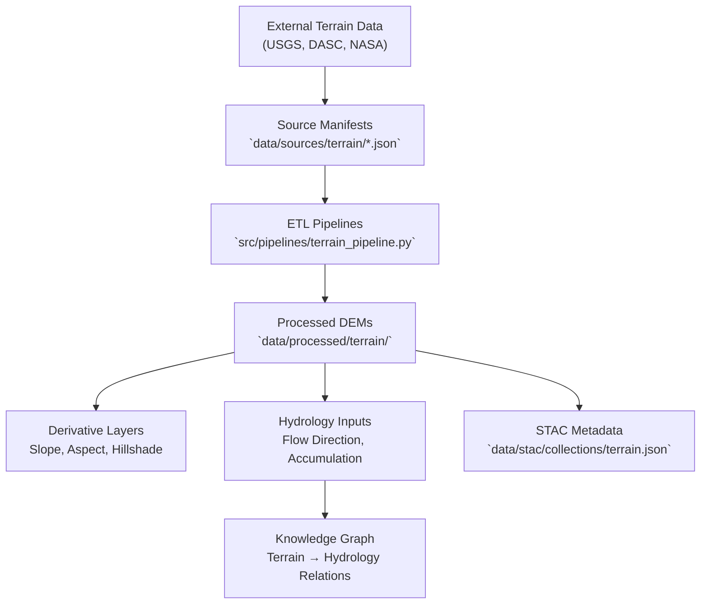

<div align="center">

# 🏔️ Kansas Frontier Matrix — Terrain Source Manifests

`data/sources/terrain/`

**Mission:** Catalog, document, and validate all **external terrain and elevation data sources**
that feed the Kansas Frontier Matrix (KFM). These sources provide the topographic foundation
for hydrology, landcover, and hazard analyses across the Kansas region.

[](../../../.github/workflows/site.yml)
[](../../../.github/workflows/stac-validate.yml)
[](../schema/source.schema.json)
[](../../../docs/)
[](../../../LICENSE)

</div>

---

## 📚 Overview

The `data/sources/terrain/` directory contains JSON manifests that define
each **terrain data source** used within the KFM system — including LiDAR DEMs,
national elevation datasets, and related derivative foundations.

These manifests drive reproducible ingestion of:

* **LiDAR-derived elevation models** (USGS 3DEP, Kansas DASC)
* **Global DEM products** (SRTM, Copernicus)
* **Slope and hillshade bases** for map rendering
* **DEM-derived hydrologic layers** used downstream in ETL and STAC pipelines

Each manifest aligns with `data/sources/schema/source.schema.json`
to ensure consistency and validation across the repository.

---

## 🗂️ Directory Layout

```bash
data/sources/terrain/
├── README.md
├── ks_lidar_2018_2020.json        # Kansas LiDAR DEM collection from DASC
└── usgs_3dep_dem.json             # USGS 3DEP nationwide elevation program
```

> **Note:** Each file is a validated, versioned `.json` manifest describing
> origin, licensing, coverage, and update cadence of the source dataset.

---

## 🧩 Example: `ks_lidar_2018_2020.json`

```json
{
  "id": "ks_lidar_2018_2020",
  "title": "Kansas Statewide LiDAR DEM (2018–2020)",
  "provider": "Kansas Data Access & Support Center (DASC)",
  "description": "1-meter LiDAR-derived elevation data for Kansas, collected between 2018 and 2020.",
  "endpoint": "https://kansasgis.org/lidar/data/",
  "access_method": "HTTP download",
  "license": "CC-BY 4.0",
  "data_type": "raster",
  "format": "GeoTIFF",
  "spatial_coverage": "Kansas, USA",
  "temporal_coverage": "2018–2020",
  "update_frequency": "One-time collection",
  "last_verified": "2025-10-12",
  "linked_pipeline": "terrain_pipeline.py",
  "notes": "Primary DEM source for high-resolution terrain analysis."
}
```

---

## 🧭 System Context (GitHub-safe Mermaid)



---

## ⚙️ Terrain Sources Summary

| Manifest File             | Provider    | Description                      | Spatial Coverage | Format  | Verified     |
| :------------------------ | :---------- | :------------------------------- | :--------------- | :------ | :----------- |
| `ks_lidar_2018_2020.json` | Kansas DASC | 1 m LiDAR DEM mosaic for Kansas  | Kansas           | GeoTIFF | ✅ 2025-10-12 |
| `usgs_3dep_dem.json`      | USGS        | National 1 m LiDAR DEM from 3DEP | Continental US   | GeoTIFF | ✅ 2025-10-12 |

---

## 🧾 ETL Integration

**Pipeline:** `src/pipelines/terrain_pipeline.py`
**Target Directory:** `data/processed/terrain/`

### Workflow:

1. **Validate** manifests (`make sources-validate`).
2. **Fetch** DEMs via URLs or APIs.
3. **Reproject** to EPSG:3857 for consistency.
4. **Generate** COGs + hillshade + slope.
5. **Register** outputs in STAC and checksum directories.

---

## 🧪 Validation Workflow

**Manual Validation**

```bash
python src/utils/validate_sources.py data/sources/terrain/ --schema data/sources/schema/source.schema.json
```

**Makefile Automation**

```bash
make terrain-sources
make terrain-validate
```

**CI/CD Automation**

* Schema compliance (`source.schema.json`)
* URL and license verification
* Automatic changelog generation on manifest updates

---

## 🧩 Provenance Integration

| Component                            | Function                                                |
| :----------------------------------- | :------------------------------------------------------ |
| `data/raw/terrain/`                  | Original, immutable elevation datasets                  |
| `data/processed/terrain/`            | Reprojected, clipped, standardized COGs                 |
| `data/stac/collections/terrain.json` | STAC entry linking processed outputs to these manifests |
| `data/checksums/terrain/`            | Integrity verification via SHA-256                      |
| `src/pipelines/terrain_pipeline.py`  | Automated ingestion and preprocessing                   |

---

## 🧠 MCP Compliance Summary

| MCP Principle           | Implementation                                               |
| :---------------------- | :----------------------------------------------------------- |
| **Documentation-first** | Each terrain dataset fully described in manifest form.       |
| **Reproducibility**     | Linked ETL ensures deterministic generation of outputs.      |
| **Open Standards**      | JSON Schema + STAC + GeoTIFF standards used throughout.      |
| **Provenance**          | Source manifests tie to raw → processed → derivative layers. |
| **Auditability**        | SHA-256 checksums and CI logs track data lineage.            |

---

## 🧾 Changelog

| Version  | Date       | Summary                                                            |
| :------- | :--------- | :----------------------------------------------------------------- |
| **v1.1** | 2025-10-12 | Expanded documentation, added CI references, and updated examples. |
| v1.0     | 2025-10-04 | Initial creation of terrain source manifest directory.             |

---

## 🏷️ Version Block

```text
Component: data/sources/terrain/README.md
SemVer: 1.1.0
Spec Dependencies: MCP v1.0 · STAC 1.0
Last Updated: 2025-10-12
Maintainer: @bartytime4life
```

---

<div align="center">

**Kansas Frontier Matrix** — *“All stories rise from the ground — and all ground begins with terrain.”*
📍 [`data/sources/terrain/`](.) · Core elevation source registry powering KFM’s geospatial foundation.

</div>

