<div align="center">

# 📜 Kansas Frontier Matrix — Text Source Manifests

`data/sources/text/`

**Mission:** Curate, document, and validate all **external text-based datasets**—including digitized documents, OCR archives, oral histories, and treaty transcripts—
that serve as the linguistic and narrative foundation for the Kansas Frontier Matrix (KFM).

[](../../../.github/workflows/site.yml)
[](../../../.github/workflows/stac-validate.yml)
[](../schema/source.schema.json)
[](../../../.github/workflows/codeql.yml)
[](../../../docs/)
[](../../../LICENSE)

</div>

---

## 📚 Overview

The `data/sources/text/` directory houses **JSON manifests** describing every external text-based source integrated into KFM—
ranging from historical treaties and scanned documents to oral history transcripts and OCR corpora.

These sources provide the **linguistic, historical, and cultural backbone** of the Kansas knowledge system.

They support:

* Historical document digitization and transcription
* Named Entity Recognition (NER) and NLP enrichment
* Treaty and land-cession tracking
* Oral history integration within the knowledge graph
* STAC-linked provenance for textual archives

Each manifest adheres to `data/sources/schema/source.schema.json`, enabling transparent provenance, licensing,
and automated validation through CI/CD workflows.

---

## 🗂️ Directory Layout

```bash
data/sources/text/
├── README.md
├── loc_chronicling_america.json      # Library of Congress historical newspaper corpus
├── kshs_oral_histories.json          # Kansas Historical Society oral history transcripts
└── yale_avalon_treaties.json         # Yale Avalon Project — historical treaties & legal texts
```

> **Note:**
> Every manifest records dataset identifiers, licensing, provenance, and verification timestamps
> to ensure archival integrity and scholarly reproducibility.

---

## 🗞️ Example: `loc_chronicling_america.json`

```json
{
  "id": "loc_chronicling_america",
  "title": "Library of Congress — Chronicling America Historical Newspaper Corpus",
  "provider": "Library of Congress (LOC)",
  "description": "Digitized and OCR-processed newspaper archives spanning 1789–1963.",
  "endpoint": "https://chroniclingamerica.loc.gov/",
  "access_method": "HTTP API",
  "license": "Public Domain (US Government)",
  "data_type": "text",
  "format": "JSONL",
  "spatial_coverage": "Kansas, USA",
  "temporal_coverage": "1854–1963",
  "update_frequency": "Monthly",
  "last_verified": "2025-10-12",
  "linked_pipeline": "text_pipeline.py",
  "notes": "Used for NLP entity extraction, OCR correction, and timeline construction."
}
```

---

## 🧭 System Context (GitHub-safe Mermaid)

```mermaid
flowchart TD
  A["External Text Archives\nLOC · KSHS · Yale Avalon"] --> B["Source Manifests\n`data/sources/text/*.json`"]
  B --> C["ETL Pipeline\n`src/pipelines/text_pipeline.py`"]
  C --> D["Processed Text Corpora\n`data/processed/text/`"]
  D --> E["Derivatives\nTokenized · Parsed · Linked Text"]
  D --> F["STAC Collections\n`data/stac/collections/text.json`"]
  F --> G["Knowledge Graph\nPeople ↔ Places ↔ Events ↔ Documents"]
  E --> H["Web UI\nSearch · Timeline · Document Viewer"]
%%END OF MERMAID%%
```



---

## 🧾 Text Source Summary

| Manifest File                  | Provider    | Description                                   | Coverage          | Format   | Verified     |
| :----------------------------- | :---------- | :-------------------------------------------- | :---------------- | :------- | :----------- |
| `loc_chronicling_america.json` | LOC         | OCR-based historical newspapers               | Kansas            | JSONL    | ✅ 2025-10-12 |
| `kshs_oral_histories.json`     | KSHS        | Transcribed oral histories and interviews     | Kansas            | TXT      | ✅ 2025-10-12 |
| `yale_avalon_treaties.json`    | Yale Avalon | Historical treaty and legal document archives | National / Global | HTML/TXT | ✅ 2025-10-12 |

---

## 🧾 ETL Integration

**Pipeline:** `src/pipelines/text_pipeline.py`
**Target Directory:** `data/processed/text/`

### Workflow

1. **Validate** manifests against schema (`make sources-validate`)
2. **Ingest** text sources via HTTP/API or download
3. **Normalize** (UTF-8 encoding, OCR cleanup, metadata tagging)
4. **Tokenize** and extract entities via NLP pipeline
5. **Link** documents to STAC items and knowledge graph entities
6. **Publish** checksums and metadata to GitHub

---

## 🧪 Validation Commands

**Manual Validation**

```bash
python src/utils/validate_sources.py data/sources/text/ --schema data/sources/schema/source.schema.json
```

**Make Targets**

```bash
make text-sources
make text-validate
```

**CI/CD Checks**

* Schema structure validation
* Endpoint and access check
* License and attribution validation
* Encoding consistency verification
* Changelog generation on manifest update

---

## 🧩 Provenance Integration

| Component                         | Function                                              |
| :-------------------------------- | :---------------------------------------------------- |
| `data/raw/text/`                  | Original OCR or transcript data                       |
| `data/processed/text/`            | Cleaned and NLP-enriched textual datasets             |
| `data/stac/collections/text.json` | STAC metadata linking back to manifests               |
| `data/checksums/text/`            | SHA-256 integrity verification for processed corpora  |
| `src/pipelines/text_pipeline.py`  | ETL process linking text sources to downstream assets |

---

## 🧠 MCP Compliance Summary

| MCP Principle           | Implementation                                                  |
| :---------------------- | :-------------------------------------------------------------- |
| **Documentation-first** | Each text dataset captured in a JSON manifest before ingestion. |
| **Reproducibility**     | ETL steps controlled via manifest-driven pipelines.             |
| **Open Standards**      | JSON Schema · UTF-8 · STAC 1.0 · NLP Metadata JSON.             |
| **Provenance**          | Traceable lineage: manifest → processed → knowledge graph.      |
| **Auditability**        | CI-validated manifests and checksum enforcement.                |

---

## 🧾 Changelog

| Version  | Date       | Summary                                                                   |
| :------- | :--------- | :------------------------------------------------------------------------ |
| **v1.1** | 2025-10-12 | Added workflow diagram, validation workflow, and LOC/KSHS/Yale manifests. |
| v1.0     | 2025-10-04 | Initial creation of text source manifest documentation.                   |

---

## 🏷️ Version Block

```text
Component: data/sources/text/README.md
SemVer: 1.1.0
Spec Dependencies: MCP v1.0 · STAC 1.0
Last Updated: 2025-10-12
Maintainer: @bartytime4life
```

---

<div align="center">

**Kansas Frontier Matrix** — *“Voices of the past become data for the future.”*
📍 [`data/sources/text/`](.) · Canonical registry of historical and linguistic sources powering KFM’s narrative and document intelligence.

</div>

