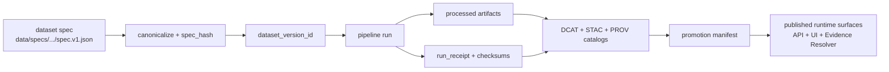

<!-- [KFM_META_BLOCK_V2]
doc_id: kfm://doc/4d7f3f36-0efc-4d8a-9d8b-2d0b7f4cd0c8
title: data/specs — Dataset Specs Registry
type: standard
version: v1
status: draft
owners: KFM Maintainers
created: 2026-02-22
updated: 2026-02-22
policy_label: public
related:
  - ../../contracts/schemas/spec_v1.schema.json
  - ../../contracts/schemas/evidence_bundle_v1.schema.json
  - ../../contracts/schemas/story_node_v3.schema.json
  - ../../contracts/openapi/
tags:
  - kfm
notes:
  - Canonical dataset onboarding specs (inputs to spec_hash) + shared vocab/fixtures.
  - Treat spec changes as governed, reviewed, and CI-validated.
[/KFM_META_BLOCK_V2] -->

# data/specs
> Canonical **dataset onboarding specs** (inputs to `spec_hash`) + shared **vocab/fixtures** used to enforce KFM promotion gates.

**Status:** `draft` • **Owners:** `KFM Maintainers` • **Policy label:** `public`


**Quick nav:**  
- [Purpose](#purpose) · [What lives here](#what-lives-here) · [Directory layout](#directory-layout) · [Spec contract](#spec-contract)  
- [Hashing and IDs](#hashing-and-ids) · [Promotion gates mapping](#promotion-gates-mapping) · [Validation and CI expectations](#validation-and-ci-expectations)  
- [Change process](#change-process) · [Governance and safety defaults](#governance-and-safety-defaults) · [Appendix](#appendix)

---

## Purpose
This folder exists to make dataset integration **repeatable, reviewable, and testable** by storing the **canonical dataset specs** that:

1) describe *what we ingest* and *under what terms*,  
2) define sensitivity intent and required obligations,  
3) declare normalization + validation expectations, and  
4) declare intended output artifact classes and paths.

These specs are treated as **contract surfaces**: they should be stable, schema-validated, and safe to review in PRs.

> **IMPORTANT:** A dataset spec must never contain credentials, API keys, or secrets. Use secret managers / OIDC flows in pipeline execution, not in specs.

[Back to top](#dataspecs)

---

## What lives here
### ✅ Yes
- **Dataset onboarding specs** (preferred: JSON) used as canonical inputs to `spec_hash`.
- Small **fixtures** used by CI to validate hashing stability and schema compliance.
- **Controlled vocabulary** overrides (optional), e.g. policy labels, themes, artifact types.

### ❌ No
- Raw source data, personally identifying data, or unreviewed “work” artifacts.
- Anything that would break default-deny posture (e.g., hidden endpoints, undocumented exports).
- Generated runtime catalogs (those belong under `data/catalog/` per the reference layout).

[Back to top](#dataspecs)

---

## Directory layout
> This is a buildable target. If your repo uses a different layout, update links accordingly.

```text
data/specs/
├─ README.md
├─ datasets/
│  ├─ <dataset_slug>/
│  │  ├─ spec.v1.json
│  │  ├─ fixtures/
│  │  │  ├─ spec.minimal.valid.json
│  │  │  └─ spec.invalid.missing_license.json
│  │  └─ NOTES.md              # optional (human context; no secrets)
│  └─ ...
└─ vocab/                      # optional shared controlled vocab
   ├─ policy_labels.yml
   ├─ themes.yml
   └─ artifact_types.yml
```

**Related canonical contracts (reference layout):**
- `contracts/schemas/spec_v1.schema.json` (dataset spec schema)
- `contracts/schemas/evidence_bundle_v1.schema.json` (evidence resolver return shape)
- `contracts/openapi/` (governed API contract fragments)
- `policy/rego/` + `policy/tests/` (default-deny and fixture-based tests)

[Back to top](#dataspecs)

---

## Spec contract
Dataset specs are intended to be **strictly validated**. The canonical schema is expected at:

- `../../contracts/schemas/spec_v1.schema.json`

### Required top-level fields (v1)
A typical v1 spec includes:

- `kfm_spec_version` (e.g., `"v1"`)
- `dataset_slug` (stable slug; lowercase + underscores)
- `title`
- `upstream` (authority + access + terms snapshot)
- `sensitivity` (policy label intent + risks + obligations)
- `normalization` (canonical field mapping, units, CRS)
- `validation` (schema reference + QA checks)
- `outputs` (artifact types + intended paths)

### Notes on values
- **URLs must be real** in implementation (placeholders are okay in examples/fixtures only).
- Avoid embedding hostnames in **canonical IDs**; hostnames belong in distribution URLs, not identity.
- `terms_snapshot` must capture license/terms at acquisition time.

[Back to top](#dataspecs)

---

## Hashing and IDs
KFM uses deterministic identity so that we can cache, cite, and reproduce.

### Key principles
- `spec_hash` is derived from a **canonicalized** dataset spec (stable across OS/runtime).
- `dataset_version_id` is **immutable** and derived from a stable `spec_hash`.
- Specs should be written so that inconsequential formatting changes do not change canonical meaning.

### Suggested naming conventions
- `dataset_slug`: lowercase, underscore-separated, no dates in the slug (date belongs to version).
- One dataset spec per dataset family; edits produce a new `dataset_version_id` through `spec_hash`.

[Back to top](#dataspecs)

---

## Promotion gates mapping
Promotion gates are enforced elsewhere (CI/policy), but the **inputs** are declared here.



### Gate→spec linkage (at a glance)
| Promotion Gate | What the gate checks | What the spec must provide |
|---|---|---|
| A. Identity & versioning | Stable dataset id; immutable version from `spec_hash` | `dataset_slug`, canonical spec content |
| B. Licensing & rights | License explicit; rights captured; unclear ⇒ quarantine | `upstream.terms_snapshot` (license/terms metadata) |
| C. Sensitivity & redaction | `policy_label` assigned; redaction plan recorded in lineage | `sensitivity.policy_label_intent`, obligations, risk flags |
| D. Catalog validation | DCAT/STAC/PROV validate and cross-link | Enough structure to generate catalogs deterministically |
| E. Run receipt & checksums | run_receipt exists; inputs/outputs + digests; environment recorded | Stable outputs declaration (artifact types/paths) |
| F. Policy + contract tests | OPA tests pass; evidence resolver resolves refs; schemas validate | Policy intent + stable IDs referenced in fixtures |
| G. Optional posture | SBOM/attestations, perf & a11y smoke checks | Not spec fields; but avoid choices that block these |

[Back to top](#dataspecs)

---

## Validation and CI expectations
This folder should be CI-validatable as a unit.

Minimum recommended checks:
- Schema validation: `spec.v1.json` validates against `spec_v1.schema.json`
- Hash stability: fixtures have golden `spec_hash` values; CI blocks drift
- License posture: missing/unclear license must fail closed (quarantine / block promotion)
- Policy posture: at least one fixture per policy label class to ensure default-deny is enforced

[Back to top](#dataspecs)

---

## Change process
Specs are production-adjacent governance artifacts. Treat changes as PR-sized and reviewable.

### PR checklist (Definition of Done)
- [ ] Spec validates against `spec_v1.schema.json`
- [ ] `spec_hash` is stable (golden fixtures updated intentionally)
- [ ] `terms_snapshot` is present and explicit (license/rights)
- [ ] `policy_label_intent` is set and obligations are enumerated
- [ ] Validation checks are defined (schema + domain QA thresholds)
- [ ] Outputs are declared (artifact types + deterministic paths)
- [ ] Changelog / notes updated (what changed and why)

[Back to top](#dataspecs)

---

## Governance and safety defaults
- **Default-deny**: if anything is unclear (rights, sensitivity), keep it in QUARANTINE.
- **No secrets in specs**: treat these as reviewable documents.
- **Sensitive locations**: if the dataset can create harm via precise coordinates, the spec must declare obligations that drive generalization/redaction in downstream transforms and provenance.

[Back to top](#dataspecs)

---

## Appendix
<details>
<summary><strong>Minimal v1 dataset spec example</strong></summary>

```json
{
  "kfm_spec_version": "v1",
  "dataset_slug": "example_dataset",
  "title": "Example Dataset",
  "upstream": {
    "authority": "Example Authority",
    "access_method": "api",
    "endpoints": [
      { "name": "primary", "url": "https://example.invalid/api", "parameters": {} }
    ],
    "cadence": "monthly",
    "terms_snapshot": { "license": "CC-BY-4.0", "retrieved_at": "2026-02-22" }
  },
  "sensitivity": {
    "policy_label_intent": "public",
    "pii_risk": "low",
    "sensitive_location_risk": "low",
    "obligations": []
  },
  "normalization": {
    "canonical_fields": { "id": "upstream.id" },
    "units": {},
    "crs": "EPSG:4326"
  },
  "validation": {
    "schema": "contracts/schemas/example.schema.json",
    "checks": [{ "name": "required_fields_present", "threshold": 0.99 }]
  },
  "outputs": [
    { "artifact_type": "geoparquet", "path": "data/processed/example_dataset/<dataset_version_id>/data.parquet" }
  ]
}
```
</details>
