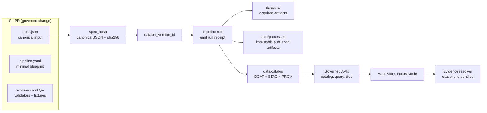

# data/specs
Dataset specification contracts (canonical `spec_hash` inputs) that drive governed ingest → promotion → runtime.

`STATUS: draft` `OWNERS: data-platform + governance` `SCOPE: dataset family specs` `PR-GATED: yes` `NO-SECRETS: required`

<details>
<summary>Metadata (KFM MetaBlock v2)</summary>

[KFM_META_BLOCK_V2]
doc_id: kfm://doc/data-specs-readme
title: data/specs — Dataset specification contracts
type: guide
version: v1
status: draft
owners: data-platform, governance-stewards
created: 2026-02-22
updated: 2026-02-22
policy_label: public
tags:
  - kfm
  - data
  - specs
  - governance
notes:
  - Directory-level README for canonical dataset specs (spec_hash inputs) and their promotion gates.
[/KFM_META_BLOCK_V2]

</details>

## Navigation
- [What lives here](#what-lives-here)
- [How specs flow to runtime](#how-specs-flow-to-runtime)
- [Directory layout](#directory-layout)
- [Authoring rules](#authoring-rules)
- [Promotion gates](#promotion-gates)
- [Adding or changing a dataset spec](#adding-or-changing-a-dataset-spec)
- [Templates](#templates)
- [Glossary](#glossary)
- [References](#references)

---

## What lives here

This directory contains **source-controlled dataset family specifications**.

A dataset spec is treated as a **governed contract**, not a casual config file. It exists so pipelines can be deterministic, catalogs can validate, policy can be enforced, and the UI can surface trust (version, license, policy badges) from first principles.

A typical dataset family spec declares:

- **Upstream authority + access method** (who/what we ingest)
- **Cadence** (how often we expect changes)
- **Sensitivity intent** (policy label intent, PII risk, sensitive-location risk, obligations)
- **Normalization mappings** (canonical fields, CRS, units)
- **Validation plan** (schema + checks with thresholds)
- **Required outputs** (processed artifacts and their expected paths/types)

### What does *not* live here

This directory is for **specifications**, not for the actual data artifacts produced by runs.

Do **not** store:
- raw source dumps (those belong in `data/raw/`)
- intermediate processing outputs (those belong in `data/work/`)
- published artifacts (those belong in `data/processed/`)
- published catalogs + lineage bundles (those belong in `data/catalog/`)

> Keep the “truth path” navigable: specs explain *how* a dataset is produced; truth-path zones contain the *evidence* that it was produced correctly.

[Back to top](#data-specs)

---

## How specs flow to runtime



Key idea: **promotion is the enforcement point**. A dataset version is not “real” for runtime unless:
- processed artifacts exist (with digests),
- catalogs validate (DCAT/STAC/PROV),
- cross-links resolve,
- policy label + obligations are applied,
- QA reports exist,
- audit receipts exist.

[Back to top](#data-specs)

---

## Directory layout

The repository’s broader layout may vary, but the following is the **recommended target** for this folder:

```text
data/specs/
  README.md

  <dataset_slug>/
    spec.json                 # canonical input to spec_hash (no secrets)
    pipeline.yaml             # minimal pipeline blueprint (or a pointer to it)
    qa/                       # checks + thresholds (machine-readable)
      checks.json
    fixtures/                 # small samples used in CI validators
      sample.*
      expected/
        validation_report.json
    docs.md                   # optional human notes (may use KFM MetaBlock v2)
```

### Naming convention

- `dataset_slug` should be stable, lowercase, and “authority-first” (e.g., `noaa_ncei_storm_events`).
- Avoid embedding dates in the slug; **dates belong in dataset versions**, not dataset identity.

[Back to top](#data-specs)

---

## Authoring rules

### Determinism and hashing (non-negotiable)
- The dataset spec file is the canonical input for `spec_hash`.
- `spec_hash` MUST be computed using **canonical JSON** (RFC 8785) and **sha256**.
- Add a test/CI check that recomputes `spec_hash` and fails if it drifts between OS/runtimes.
- Avoid “hidden nondeterminism” (timestamps, randomized ordering, environment-dependent defaults).

### Secrets and credentials
- Specs MUST NOT contain credentials.
- If upstream access requires auth, represent it as **an access method + secret reference** handled at runtime (not in Git).

### Time-awareness
Every dataset family that powers a timeline must state (directly or via schema) which timestamps are:
- **event time** (when the thing happened),
- **transaction time** (when KFM ingested/recorded it),
- **valid time** (when the record was true in the modeled world, especially for boundaries).

> If you don’t specify time semantics, the map/time UI will eventually lie.

### Sensitivity & safe release defaults
If the dataset involves archaeology, sensitive species, or other sensitive-location risks:
- classify it as sensitive-location,
- produce **dual outputs** (restricted precise + public generalized) if public representation is allowed,
- document the generalization method,
- add tests to confirm no precise coordinates leak,
- require governance review before release.

### Validation & QA
A dataset family must declare:
- a schema (JSON Schema strongly preferred for row/feature-level validation),
- named checks with thresholds (e.g., geometry validity rate),
- where the validation report is written (so promotion can fail closed).

### Outputs and catalogs
Specs must declare output expectations for:
- processed artifacts (e.g., GeoParquet, PMTiles),
- catalogs (DCAT + STAC),
- lineage bundle (PROV),
- run receipts and promotion manifests (emitted by pipelines).

[Back to top](#data-specs)

---

## Promotion gates

Promotion is **fail-closed**. At minimum, treat the following as merge/release blockers:

| Gate | Fail-closed check |
|---|---|
| Identity & versioning | `dataset_version_id` and `spec_hash` are deterministic; a promotion manifest exists for the release |
| Artifacts | processed artifacts exist; each has a digest; predictable paths; media types recorded |
| Catalogs | DCAT/STAC/PROV validate under the adopted profiles |
| Cross-links | required links resolve; STAC asset hrefs exist; EvidenceRefs resolve |
| Policy | `policy_label` assigned; obligations applied; default-deny policy tests pass |
| QA | validation reports exist; failed datasets are quarantined (not promoted) |
| Audit | run receipt emitted; audit log append; approvals captured where required |

[Back to top](#data-specs)

---

## Adding or changing a dataset spec

Use this checklist to keep changes reviewable and reversible:

- [ ] Create/update `data/specs/<dataset_slug>/spec.json` using the template below  
- [ ] Ensure `dataset_slug` matches conventions and remains stable
- [ ] Ensure the spec contains **no secrets**
- [ ] Add/point to a schema and QA checks (with thresholds)
- [ ] Compute `spec_hash` using canonical JSON (RFC 8785) + sha256
- [ ] Add/update fixtures for CI validators
- [ ] Open a PR with a clear change log (what changed, why it matters, expected downstream impact)
- [ ] Steward review: license, sensitivity, policy label intent, release obligations
- [ ] Run pipeline to produce a new dataset version (emit run receipt, catalogs, lineage)
- [ ] Promote only if all gates pass (promotion manifest captured)

[Back to top](#data-specs)

---

## Templates

### Dataset onboarding spec (canonical `spec_hash` input)

```json
{
  "kfm_spec_version": "v1",
  "dataset_slug": "noaa_ncei_storm_events",
  "title": "NOAA NCEI Storm Events Database",
  "upstream": {
    "authority": "NOAA NCEI",
    "access_method": "bulk_csv",
    "endpoints": [
      {
        "name": "storm_events_csv",
        "url": "https://example.invalid/noaa/stormevents",
        "parameters": { "state": "KS" }
      }
    ],
    "cadence": "monthly",
    "terms_snapshot": {
      "license": "public_domain",
      "retrieved_at": "2026-02-20"
    }
  },
  "sensitivity": {
    "policy_label_intent": "public",
    "pii_risk": "low",
    "sensitive_location_risk": "low",
    "obligations": []
  },
  "normalization": {
    "canonical_fields": {
      "event_id": "upstream.EVENT_ID",
      "event_type": "upstream.EVENT_TYPE",
      "start_time": "upstream.BEGIN_DATE_TIME",
      "end_time": "upstream.END_DATE_TIME",
      "geometry": "derived.from_latlon"
    },
    "units": {},
    "crs": "EPSG:4326"
  },
  "validation": {
    "schema": "contracts/schemas/noaa_storm_events.schema.json",
    "checks": [
      { "name": "geometry_valid", "threshold": 1.0 },
      { "name": "required_fields_present", "threshold": 0.99 }
    ]
  },
  "outputs": [
    {
      "artifact_type": "geoparquet",
      "path": "data/processed/noaa_ncei_storm_events/<dataset_version_id>/events.parquet"
    },
    {
      "artifact_type": "pmtiles",
      "path": "data/processed/noaa_ncei_storm_events/<dataset_version_id>/events.pmtiles"
    }
  ]
}
```

Notes:
- URLs must be real in implementation (`example.invalid` is a placeholder).
- Avoid embedding credentials in specs.

### KFM MetaBlock v2 (for optional `docs.md`)

```text
[KFM_META_BLOCK_V2]
doc_id: kfm://doc/<stable-id>
title: <Title>
type: <guide|standard|story|dataset_spec|adr|run_receipt>
version: v1
status: draft|review|published
owners: <team or names>
created: YYYY-MM-DD
updated: YYYY-MM-DD
policy_label: public|restricted|...
related:
  - kfm://dataset/<slug>@<version>
tags:
  - kfm
notes:
  - <short notes>
[/KFM_META_BLOCK_V2]
```

[Back to top](#data-specs)

---

## Glossary

- **dataset_slug**: stable identifier for a dataset family (do not embed dates).
- **spec_hash**: sha256 hash of the RFC 8785 canonical form of the dataset spec.
- **dataset_version_id**: immutable version identifier derived from `spec_hash` (and a human-friendly release segment).
- **promotion**: moving a dataset version into `processed + catalog/lineage` so it is eligible for runtime serving.
- **quarantine**: artifacts/datasets blocked from promotion due to validation, rights, or sensitivity issues.
- **policy_label**: classification controlling access and obligations (enforced by policy engine).
- **obligation**: required transformation or constraint (e.g., generalization, watermarking, retention limit).

[Back to top](#data-specs)

---

## References

Internal (KFM):
- KFM “Definitive Design & Governance Guide (vNext)” — appendices for MetaBlock, dataset spec templates, run receipts, and promotion manifests.
- KFM “Ultimate Blueprint (Draft)” — promotion contract + fail-closed gates.

External (standards; informational):
- RFC 8785 (JSON Canonicalization Scheme)
- W3C PROV
- DCAT
- STAC
