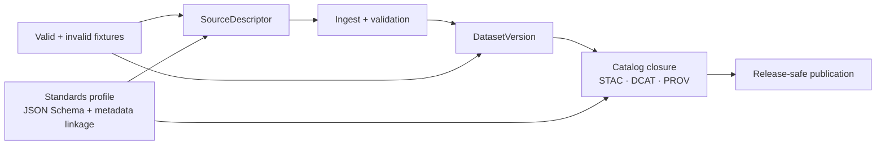

<!-- [KFM_META_BLOCK_V2]
doc_id: kfm://doc/NEEDS-VERIFICATION
title: Data Specs
type: standard
version: v1
status: draft
owners: NEEDS VERIFICATION
created: YYYY-MM-DD
updated: YYYY-MM-DD
policy_label: public
related: [../, ./]
tags: [kfm, data, specs]
notes: [Current-session workspace evidence was PDF-only; exact directory inventory, owners, and adjacent leaves need direct repo verification.]
[/KFM_META_BLOCK_V2] -->

# Data Specs

Machine-checkable schema and profile lane for data-facing KFM contracts, fixtures, and thin-slice examples.

> [!NOTE]
> **Status:** experimental  
> **Owners:** NEEDS VERIFICATION  
>     
> **Quick jumps:** [Scope](#scope) · [Repo fit](#repo-fit) · [Inputs](#accepted-inputs) · [Exclusions](#exclusions) · [Evidence posture](#current-evidence-posture) · [Directory tree](#directory-tree) · [Quickstart](#quickstart) · [Usage](#usage) · [Diagram](#diagram) · [Starter registry](#starter-registry) · [Definition of done](#task-list--definition-of-done) · [FAQ](#faq)  
> **Repo fit:** `data/specs/README.md` → upstream: [`../`](../) · downstream: [`./`](./) · adjacent artifact-owning lanes and sibling directories remain **NEEDS VERIFICATION** until the mounted repo is directly inspected.

> [!IMPORTANT]
> This directory should function as a **contract-and-profile lane** for data-facing KFM specs. It is not a catch-all doctrine manual, not a raw/processed data drop zone, and not a place to blur emitted artifacts, runtime trust objects, and schema source material into one folder.

> [!WARNING]
> Current-session workspace evidence was **PDF-only**. Exact repo inventory, owners, file layout, tests, workflows, and enforcement depth for `data/specs/` remain **UNKNOWN** unless directly reverified from the mounted repository.

> [!TIP]
> The broader KFM corpus often sketches starter schema paths under `contracts/...`. This README does **not** turn those sketches into repo fact. It treats `data/specs/` as the local lane requested for this file and keeps broader path placement explicitly **NEEDS VERIFICATION**.

## Scope

This directory exists to help KFM prove a **contract-first thin slice** instead of widening the system through prose alone. Its job is to hold or index the machine-checkable side of data-facing doctrine: schemas, profile notes, fixtures, examples, and compatibility guidance that make source intake, dataset versioning, metadata closure, and release-safe publication inspectable.

In practical terms, this lane should help maintainers answer questions like:

- What fields must a source-facing spec carry before intake is credible?
- What minimum structure must a dataset version expose before it can participate in catalog closure?
- How do STAC, DCAT, PROV, and local KFM contract objects fit together without competing?
- Which examples and invalid fixtures are needed before a spec claim is believable?

Because mounted repo verification is incomplete in this session, this README intentionally prioritizes **scope, routing, and local conventions** over claims about mature implementation depth.

## Repo fit

| Path | Role | Relationship |
| --- | --- | --- |
| `data/specs/README.md` | this file | directory README for data-facing specs and profiles |
| [`../`](../) | parent data lane | upstream entry point for broader data material |
| [`./`](./) | local lane root | downstream spec leaves, fixtures, and examples in this directory |
| `catalog / provenance / runtime lanes` | adjacent owners | use these when work becomes emitted artifacts, proof objects, or trust-surface payloads; exact paths are **NEEDS VERIFICATION** |
| `policy / review / release lanes` | adjacent owners | use these when the file is primarily about policy logic, approval state, or release assembly rather than data-facing structure; exact paths are **NEEDS VERIFICATION** |

## Accepted inputs

Place material here when it is primarily a **data-facing spec or profile source** for KFM, such as:

- source intake schemas or profile notes
- dataset version schemas or compatibility notes
- standards-profile documents that connect KFM data specs to STAC, DCAT, PROV, or JSON Schema
- valid / invalid example payloads for data-facing contracts
- fixture notes that clarify support, time semantics, grain, units, or rights/sensitivity handling
- thin-slice example payloads that prove contract behavior on a lane such as hydrology
- schema change notes that materially affect validation, catalog closure, or public interpretation

## Exclusions

Do **not** place the following here:

- raw, work, processed, cataloged, or published data artifacts
- doctrine-only manuals, replacement-grade architecture guides, or ADRs that do not define spec behavior
- emitted run receipts, release proof packs, or correction notices unless this directory explicitly owns their source schema
- runtime-only trust-surface payload docs when the owning lane is UI, runtime, review, or ops
- ad hoc experiments or “new ideas” that have not been stabilized into a spec, profile, or fixture
- unsupported claims about mounted files, CI enforcement, or release readiness when current evidence does not prove that state

## Current evidence posture

**Status labels used here:** **CONFIRMED** = directly supported by the current attached / project-visible corpus; **INFERRED** = conservative structural completion that fits the corpus; **PROPOSED** = recommended starter shape or next step; **UNKNOWN** = not verified in the current session; **NEEDS VERIFICATION** = explicit review flag for inventory, ownership, placement, or behavior.

| Item | Status | Notes |
| --- | --- | --- |
| KFM needs typed contract families and a small first schema wave | **CONFIRMED** | central doctrinal pressure in the current corpus |
| `SourceDescriptor` belongs in the first-wave contract family | **CONFIRMED** | highest-leverage intake contract object |
| `DatasetVersion` belongs in the first-wave contract family | **CONFIRMED** | authoritative candidate / promoted subject-set carrier |
| STAC, DCAT, and PROV should be linked rather than treated as competing metadata systems | **CONFIRMED** | this lane should make that linkage explicit where relevant |
| Hydrology is the preferred first thin slice for proving the architecture | **CONFIRMED** | examples in this lane should prioritize that burden-bearing path first |
| Exact `data/specs/` file inventory, owners, fixtures, and tests | **UNKNOWN** | mounted repo tree not surfaced in this session |
| Starter subdirectories such as `source/`, `core/`, `profiles/`, `fixtures/`, and `examples/` | **PROPOSED** | useful local shape, but not asserted repo fact |
| Whether broader runtime / review / correction schemas live here or elsewhere | **NEEDS VERIFICATION** | depends on actual repo boundaries |

## Directory tree

**Illustrative starter shape only — PROPOSED / NEEDS VERIFICATION**

```text
data/
└── specs/
    ├── README.md
    ├── source/
    │   └── source_descriptor.schema.json
    ├── core/
    │   └── dataset_version.schema.json
    ├── profiles/
    │   └── standards_profile.yaml
    ├── fixtures/
    │   ├── valid/
    │   └── invalid/
    └── examples/
        └── thin_slice/
```

This tree is intentionally small. It reflects the current corpus’s **contract-first** pressure without pretending that the mounted repository already uses these exact paths.

## Quickstart

Start small and machine-checkable.

1. Add or revise one **data-facing** spec or profile.
2. Make the contract family explicit.
3. Add at least one valid example and one invalid example if validation is claimed.
4. State support, time semantics, and rights/sensitivity expectations instead of leaving them implied.
5. Route emitted artifacts and runtime proof objects to their owning lane rather than letting this directory become a catch-all.

Illustrative starter field-family sketch:

```yaml
# illustrative only — not a verified mounted file
source_descriptor:
  identity:
    source_id: ks-example-source
    title: Example source
    provider: Example provider
  access:
    mode: https
    cadence: daily
  semantics:
    support: county
    time_semantics: valid_time
    modeled_vs_observed: observed
  rights:
    redistribution: needs-review
  validation:
    schema: json-schema
  lineage:
    outbound_catalog_closure: expected
```

> [!CAUTION]
> Do not move a file into this directory just because it uses JSON or YAML. If it is an emitted artifact, a release proof object, a correction notice, or a runtime-only payload, route it to the owning lane instead.

## Usage

### Add a new data spec

1. Name the contract family clearly.
2. Keep the minimum field families visible in the leaf itself.
3. Add example payloads or fixtures when validation is claimed.
4. State how the leaf interacts with outward metadata closure, if relevant.
5. Update this README if the local lane shape, naming pattern, or boundaries change.

### Update an existing spec

Update the leaf when any of the following changes:

- required fields or field families
- support or time semantics
- rights / sensitivity expectations
- profile linkage to STAC, DCAT, PROV, or JSON Schema
- example fixtures or invalid cases
- routing boundaries between this lane and adjacent runtime / policy / release lanes

### Review rule of thumb

When unsure, prefer a **smaller explicit contract** over a larger explanatory narrative. This directory should reduce ambiguity, not hide it.

## Diagram


```mermaid
flowchart LR
    A[SourceDescriptor] --> B[Ingest + validation]
    B --> C[DatasetVersion]
    C --> D[Catalog closure<br/>STAC · DCAT · PROV]
    D --> E[Release-safe publication]
    F[Valid + invalid fixtures] --> A
    F --> C
    G[Standards profile<br/>JSON Schema + metadata linkage] --> A
    G --> D
```

## Starter registry

| Spec family | Why it belongs here first | Minimum content cues | Status here |
| --- | --- | --- | --- |
| `SourceDescriptor` | Intake contracts fail silently without explicit source identity, access, semantics, rights, validation, and lineage | identity, access, semantics, rights/sensitivity, validation, lineage | **CONFIRMED** |
| `DatasetVersion` | Authoritative candidate / promoted subject sets need machine-checkable identity and support | stable ID, version ID, support/time semantics, provenance links | **CONFIRMED** |
| `Standards profile` | KFM needs one place to explain how local data specs align with outward metadata and validation profiles | JSON Schema expectations, outward STAC/DCAT/PROV linkage, validation targets | **CONFIRMED / PROPOSED** |
| `Fixtures` | Contract claims are weak without concrete valid / invalid examples | valid examples, invalid examples, failure notes | **PROPOSED** |
| `Thin-slice examples` | KFM should prove one governed lane before widening scope | hydrology-first examples, lane burden notes, release-safe example payloads | **PROPOSED** |
| `CatalogClosure / ReleaseManifest` | These matter to data publication, but exact placement in `data/specs/` is not proven | outward metadata closure, release linkage, profile refs | **INFERRED / NEEDS VERIFICATION** |
| `EvidenceBundle / RuntimeResponseEnvelope / CorrectionNotice` | Part of the broader contract family, but may belong to runtime / release / review lanes instead of this one | runtime outcome, correction lineage, audit linkage | **NEEDS VERIFICATION** |

## Profile alignment to keep explicit

| Profile family | Why it matters in this lane |
| --- | --- |
| JSON Schema | turns contract prose into machine-validatable structure |
| STAC | carries spatiotemporal asset description and discovery for the outward data surface |
| DCAT | carries dataset / distribution discovery for outward catalog closure |
| PROV | carries lineage for activities, entities, and agents |
| KFM-specific artifacts | keep policy, review, release, and correction meaning first-class beside external profiles rather than flattening them away |

## Minimum content for each spec leaf

| Field / element | Required | Why it matters |
| --- | --- | --- |
| Contract family or profile purpose | Yes | keeps the file legible as a spec rather than a note dump |
| One-line purpose directly under the H1 | Yes | improves scanability and review speed |
| Support / time semantics | Yes when relevant | prevents data meaning from collapsing silently |
| Rights / sensitivity posture | Yes when relevant | KFM publication meaning depends on this |
| Validation expectation | Yes when validation is claimed | avoids rhetorical “schema-ready” language |
| Example or fixture linkage | Recommended | makes review and testing concrete |
| Outward profile linkage | Recommended | clarifies STAC / DCAT / PROV interaction where needed |
| Breaking / non-breaking note | Recommended | helps downstream consumers evaluate change impact |

## Task list / definition of done

- [ ] Meta block placeholders are replaced or consciously retained with review notes
- [ ] Directory inventory is checked against the mounted repo
- [ ] Every schema or profile leaf states its contract family or profile purpose
- [ ] Support / time semantics are explicit wherever the leaf depends on them
- [ ] Rights / sensitivity expectations are explicit wherever publication meaning depends on them
- [ ] Any claimed validation path is paired with fixtures, examples, or test references
- [ ] Emitted artifacts and runtime proof objects are routed to their owning lane instead of drifting into this one
- [ ] Any path, owner, workflow, or enforcement claim lacking repo proof is marked **NEEDS VERIFICATION**
- [ ] Thin-slice examples prioritize one public-safe lane before broad expansion
- [ ] Long reference material stays collapsible and does not drown the scanning path

## FAQ

### Is this directory the source of truth for every KFM contract family?

No. It should own or index the **data-facing** subset first. Broader runtime, review, release, and correction contracts may live elsewhere depending on the mounted repo’s actual boundaries.

### Why emphasize `SourceDescriptor` and `DatasetVersion` first?

Because the current KFM corpus treats them as part of the smallest, highest-leverage contract wave needed to make doctrine machine-checkable.

### Should STAC, DCAT, and PROV replace KFM-specific artifacts?

No. KFM is strongest when those profiles are linked together **alongside** local policy, review, and release objects—not when they erase them.

### What if the mounted repo already uses different filenames or subdirectories?

Keep the doctrinal role, remap the paths after direct inspection, and do not force code or structure to mimic placeholder documentation.

### When should a spec change trigger more than a local README edit?

When it changes validation behavior, outward metadata meaning, release linkage, rights/sensitivity interpretation, or thin-slice example behavior.

## Appendix

<details>
<summary><strong>Appendix — minimum field-family cues from the current corpus</strong></summary>

### `SourceDescriptor`

Minimum field-family cues:

- identity
- access
- semantics
- rights and sensitivity
- validation
- lineage

### `DatasetVersion`

Minimum field-family cues:

- stable identity
- version identity
- support / time semantics
- provenance links

### Broader starter wave nearby

The current corpus also repeatedly names related starter contracts that may sit near this lane or outside it, depending on the mounted repo:

- `decision_envelope`
- `release_manifest`
- `evidence_bundle`
- `runtime_response_envelope`
- `correction_notice`

Treat exact filenames and placement as **PROPOSED** until directly verified.

</details>

<details>
<summary><strong>Appendix — suggested review prompts</strong></summary>

- Is this leaf machine-checkable, or is it still doctrine-only?
- Does it state support, grain, and time semantics where they matter?
- Does it make rights and sensitivity visible instead of implied?
- Are STAC / DCAT / PROV expectations explicit where relevant?
- Are valid and invalid examples present when validation is claimed?
- Does the leaf overstate mounted repo inventory, CI wiring, or release readiness?
- Should this file stay here, or has it become a runtime, policy, or release artifact instead?

</details>

[Back to top](#data-specs)
