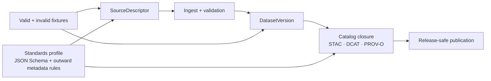

<!-- [KFM_META_BLOCK_V2]
doc_id: kfm://doc/NEEDS-VERIFICATION
title: Data Specs
type: standard
version: v1
status: draft
owners: NEEDS VERIFICATION
created: YYYY-MM-DD
updated: YYYY-MM-DD
policy_label: NEEDS VERIFICATION
related: [../, ./]
tags: [kfm, data, specs]
notes: [Current-session workspace evidence was PDF-only; exact directory inventory, owners, adjacent lanes, and checked-in schema/test coverage need direct repo verification.]
[/KFM_META_BLOCK_V2] -->

# Data Specs

Machine-checkable schema and profile lane for data-facing KFM contracts, fixtures, and thin-slice examples.

> [!NOTE]
> **Status:** experimental  
> **Owners:** NEEDS VERIFICATION  
>     
> **Quick jumps:** [Scope](#scope) · [Repo fit](#repo-fit) · [Accepted inputs](#accepted-inputs) · [Exclusions](#exclusions) · [Evidence posture](#current-evidence-posture) · [Directory tree](#directory-tree) · [Quickstart](#quickstart) · [Usage](#usage) · [Diagram](#diagram) · [Starter registry](#starter-registry) · [Definition of done](#task-list--definition-of-done) · [FAQ](#faq)  
> **Repo fit:** `data/specs/README.md` → upstream: [`../`](../) · downstream: [`./`](./) · exact sibling inventory, owners, and adjacent leaves remain **NEEDS VERIFICATION** until the mounted repo is directly inspected.

> [!IMPORTANT]
> This directory should behave as a **contract-and-profile lane** for data-facing KFM specs. It is not a raw/processed data drop zone, not a release-proof-pack folder, and not a place to blur schema source material, emitted artifacts, and runtime trust objects into one directory.

> [!WARNING]
> Current-session workspace evidence was **PDF-only**. Exact repo inventory, owners, local subdirectories, mounted schemas, fixtures, tests, CI wiring, and enforcement depth for `data/specs/` remain **UNKNOWN** until the repository itself is surfaced.

> [!TIP]
> The attached corpus repeatedly proposes first-wave contract paths under `contracts/...`, plus `fixtures/`, `tests/`, and hydrology thin-slice examples. This README uses those as **PROPOSED starter shapes**, not as asserted repo fact.

## Scope

This directory exists to help KFM prove a **contract-first thin slice** instead of widening the system through prose alone. Its job is to hold or index the machine-checkable side of data-facing doctrine: schemas, profile notes, fixtures, examples, and compatibility guidance that make source intake, dataset versioning, metadata closure, and release-safe publication inspectable.

In practice, this lane should help maintainers answer questions like:

- What fields must a source-facing spec carry before intake is credible?
- What minimum structure must a dataset version expose before it can participate in catalog closure?
- How should JSON Schema, STAC, DCAT, and PROV-O relate without turning into competing truth systems?
- Which valid and invalid fixtures are needed before a data-contract claim is believable?
- Which thin-slice examples should exist before the lane is treated as more than doctrine?

Because mounted repo verification is incomplete in this session, this README prioritizes **scope, routing, and local conventions** over claims about implementation maturity.

## Repo fit

| Path | Role | Relationship |
| --- | --- | --- |
| `data/specs/README.md` | this file | directory README for data-facing specs and profiles |
| [`../`](../) | parent data lane | upstream entry point for broader data material |
| [`./`](./) | local lane root | downstream schema, fixture, and example leaves in this directory |
| `contracts / policy / review / release / runtime lanes` | adjacent owners | use these when a file becomes primarily policy logic, review state, emitted proof, or runtime envelope material; exact mounted paths remain **NEEDS VERIFICATION** |
| `tests / fixtures / examples` | adjacent support lanes | keep local references close where this directory owns the source spec; exact mounted locations remain **NEEDS VERIFICATION** |

## Accepted inputs

Place material here when it is primarily a **data-facing spec or profile source** for KFM, such as:

- `SourceDescriptor` schema leaves or profile notes
- `DatasetVersion` schema leaves or compatibility notes
- standards-profile material connecting local contracts to JSON Schema, STAC, DCAT, or PROV-O
- valid and invalid example payloads for data-facing contracts
- fixture notes clarifying support, time semantics, units, modeled-vs-observed posture, or rights/sensitivity meaning
- thin-slice example payloads proving contract behavior on a public-safe lane such as hydrology
- schema-change notes that materially affect validation, catalog closure, or public interpretation

## Exclusions

Do **not** place the following here:

- raw, work, processed, cataloged, or published data artifacts
- doctrine-only manuals, replacement-grade architecture guides, or ADRs that do not define spec behavior
- signed run receipts, release proof packs, or correction notices unless this directory explicitly owns their source schema
- runtime-only trust-surface payload docs when the owning lane is UI, runtime, review, or ops
- ad hoc “new ideas” that have not stabilized into a contract, profile, fixture, or example
- unsupported claims about mounted files, CI enforcement, or release readiness when current evidence does not prove that state

## Current evidence posture

**Status labels used here:** **CONFIRMED** = directly supported by the attached corpus; **INFERRED** = conservative structural completion implied by the corpus; **PROPOSED** = recommended starter shape or next step; **UNKNOWN** = not verified in the current session; **NEEDS VERIFICATION** = explicit review flag for inventory, ownership, placement, or behavior.

| Item | Status | Notes |
| --- | --- | --- |
| KFM needs typed contract families and a small first schema wave | **CONFIRMED** | recurrent across the canonical manual and successor syntheses |
| `SourceDescriptor` belongs in the first-wave contract family | **CONFIRMED** | highest-leverage intake contract object |
| `DatasetVersion` belongs in the first-wave contract family | **CONFIRMED** | authoritative candidate / promoted subject-set carrier |
| Outward catalog closure should pair discovery metadata with lineage metadata | **CONFIRMED** | STAC, DCAT, and PROV-O are treated as linked outward closure, not competing replacements |
| Hydrology is the preferred first thin slice for proving the architecture | **CONFIRMED** | public-safe, place/time-rich, operationally legible proof lane |
| Current-session workspace evidence was PDF-only | **CONFIRMED** | repo tree, schema registry, tests, workflows, manifests, and runtime traces were not directly surfaced |
| Starter local subdirectories such as `source/`, `core/`, `profiles/`, `fixtures/`, and `examples/thin_slice/hydrology/` | **PROPOSED** | useful starter shape, but not asserted repo fact |
| Exact `data/specs/` inventory, owners, local fixtures, tests, and CI coverage | **UNKNOWN** | direct repo inspection did not occur in this session |
| Whether adjacent contracts like `CatalogClosure`, `ReleaseManifest`, or `RuntimeResponseEnvelope` live here or elsewhere | **NEEDS VERIFICATION** | confirmed as contract families, not confirmed as local placement |

## Directory tree

**Illustrative starter shape only — PROPOSED / NEEDS VERIFICATION**

```text
data/
└── specs/
    ├── README.md
    ├── source/
    │   └── source_descriptor.schema.json
    ├── core/
    │   └── dataset_version.schema.json
    ├── profiles/
    │   └── standards_profile.yaml
    ├── fixtures/
    │   ├── valid/
    │   └── invalid/
    └── examples/
        └── thin_slice/
            └── hydrology/
```

This tree is deliberately small. It reflects the corpus’s **contract-first** pressure without pretending the mounted repository already uses these exact paths.

## Quickstart

Start with the smallest machine-checkable move.

1. Add or revise one **data-facing** contract leaf.
2. Make the contract family explicit in the leaf itself.
3. Add at least one valid example and one invalid example when validation is claimed.
4. State support, time semantics, and rights/sensitivity posture instead of leaving them implied.
5. Route emitted artifacts and runtime proof objects to their owning lane instead of letting `data/specs/` become a catch-all.

Illustrative starter shape for a `SourceDescriptor` leaf:

```yaml
# illustrative only — PROPOSED starter shape
source_descriptor:
  source_id: ks-usgs-nwis-streamflow
  steward: NEEDS-VERIFICATION
  access_mode: https
  cadence: near-real-time
  support: watershed
  time_semantics: valid_time
  rights_posture: review-required
  validation_plan:
    schema: json-schema
    fixtures: required
  publication_intent: outward-catalog-eligible
```

Illustrative starter shape for a `DatasetVersion` leaf:

```yaml
# illustrative only — PROPOSED starter shape
dataset_version:
  dataset_id: ks-hydrology-nwis
  version_id: 2026-03-14
  support: watershed
  time_semantics:
    valid_time: interval
    as_of_time: 2026-03-14T00:00:00Z
  provenance_links:
    source_descriptor: ks-usgs-nwis-streamflow
    validation_report: pending
  outward_catalog_closure:
    stac: expected
    dcat: expected
    prov: expected
```

> [!CAUTION]
> Do not move a file into this directory just because it is JSON or YAML. If it is an emitted artifact, a release proof object, a correction notice, or a runtime-only payload, it probably belongs elsewhere.

## Usage

### Add a new data spec

1. Name the contract family clearly.
2. Keep minimum field families visible in the leaf itself.
3. Add example payloads or fixtures when validation is claimed.
4. State how the leaf participates in outward catalog closure, if relevant.
5. Update this README when local lane boundaries, naming patterns, or expectations change.

### Update an existing spec

Update the leaf when any of the following changes:

- required fields or field families
- support, grain, or time semantics
- rights / sensitivity expectations
- profile linkage to JSON Schema, STAC, DCAT, or PROV-O
- example fixtures or invalid cases
- routing boundaries between this lane and adjacent runtime / policy / release lanes

### Review rule of thumb

When in doubt, prefer a **smaller explicit contract** over a larger explanatory narrative. This directory should reduce ambiguity, not hide it.

## Diagram


```mermaid
flowchart LR
    A[SourceDescriptor] --> B[Ingest + validation]
    B --> C[DatasetVersion]
    C --> D[Catalog closure<br/>STAC · DCAT · PROV-O]
    D --> E[Release-safe publication]
    F[Valid + invalid fixtures] --> A
    F --> C
    G[Standards profile<br/>JSON Schema + outward metadata rules] --> A
    G --> D
```

## Starter registry

| Spec family | Why it belongs here first | Minimum content cues | Status here |
| --- | --- | --- | --- |
| `SourceDescriptor` | Intake contracts fail silently without explicit source identity, stewardship, access, rights, cadence, support, validation, and publication intent | identity, steward, access mode, rights posture, support, cadence, validation plan, publication intent | **CONFIRMED** |
| `DatasetVersion` | Authoritative candidate / promoted subject sets need machine-checkable identity and support before later closure and release logic can trust them | stable identity, version identity, support, time semantics, provenance links | **CONFIRMED** |
| `Standards profile` | KFM needs one place to explain how local data contracts align with outward metadata and validation profiles | JSON Schema expectations, STAC/DCAT/PROV-O linkage, validation targets | **CONFIRMED / PROPOSED** |
| `Fixtures` | Contract claims remain weak without concrete valid and invalid examples | valid examples, invalid examples, failure notes | **PROPOSED** |
| `Thin-slice examples` | KFM should prove one governed lane before widening scope | hydrology-first examples, lane burden notes, release-safe sample payloads | **PROPOSED** |
| `IngestReceipt` / `ValidationReport` | Intake and canonical validation depend on them, but exact placement may belong with acquisition or validation lanes rather than this directory | source refs, fetch time, integrity checks, check list, severity, subject refs | **CONFIRMED / NEEDS VERIFICATION** |
| `CatalogClosure` | Outward metadata closure is central to data publication, but exact local ownership is not yet verified | STAC/DCAT/PROV-O refs, identifiers, release linkage, outward profile refs | **CONFIRMED / NEEDS VERIFICATION** |
| `ReleaseManifest`, `EvidenceBundle`, `RuntimeResponseEnvelope`, `CorrectionNotice` | These are part of the broader contract lattice, but usually belong to release, runtime, review, or correction lanes unless this directory owns their source schema | release linkage, evidence packaging, runtime outcome, correction lineage | **CONFIRMED / NEEDS VERIFICATION** |

## Profile alignment to keep explicit

| Profile family | Why it matters in this lane |
| --- | --- |
| JSON Schema | turns contract prose into machine-validatable structure |
| STAC | carries spatiotemporal asset description and discovery on the outward data surface |
| DCAT | carries dataset / distribution discovery for outward catalog closure |
| PROV-O | carries lineage vocabulary for entities, activities, and agents |
| KFM-specific artifacts | keep policy, review, release, and correction meaning first-class beside external profiles rather than flattening them away |

## Minimum content for each spec leaf

| Field / element | Required | Why it matters |
| --- | --- | --- |
| Contract family or profile purpose | Yes | keeps the file legible as a spec rather than a note dump |
| One-line purpose directly under the H1 | Yes | improves scanability and review speed |
| Support / grain / time semantics | Yes when relevant | prevents meaning from collapsing silently |
| Rights / sensitivity posture | Yes when relevant | KFM publication meaning depends on this |
| Validation expectation | Yes when validation is claimed | avoids rhetorical “schema-ready” language |
| Publication intent | Recommended | important for `SourceDescriptor`-style leaves |
| Example or fixture linkage | Recommended | makes review and testing concrete |
| Outward profile linkage | Recommended | clarifies STAC / DCAT / PROV-O interaction where needed |
| Breaking / non-breaking note | Recommended | helps downstream consumers evaluate change impact |

## Task list / definition of done

- [ ] Meta block placeholders are replaced or consciously retained with review notes
- [ ] Directory inventory is checked against the mounted repo
- [ ] Every schema or profile leaf states its contract family or profile purpose
- [ ] Support / grain / time semantics are explicit wherever the leaf depends on them
- [ ] Rights / sensitivity expectations are explicit wherever publication meaning depends on them
- [ ] Any claimed validation path is paired with fixtures, examples, or test references
- [ ] Outward metadata linkage is explicit where the contract participates in catalog closure
- [ ] Emitted artifacts and runtime proof objects are routed to their owning lane instead of drifting into this one
- [ ] Any path, owner, workflow, or enforcement claim lacking repo proof is marked **NEEDS VERIFICATION**
- [ ] Thin-slice examples prioritize one public-safe lane before broad expansion
- [ ] Long reference material stays collapsible and does not drown the scanning path

## FAQ

### Is this directory the source of truth for every KFM contract family?

No. It should own or index the **data-facing** subset first. Broader runtime, review, release, and correction contracts may live elsewhere depending on the mounted repo’s actual boundaries.

### Why emphasize `SourceDescriptor` and `DatasetVersion` first?

Because the attached corpus treats them as part of the smallest, highest-leverage contract wave needed to make doctrine machine-checkable.

### Should STAC, DCAT, and PROV-O replace KFM-specific artifacts?

No. KFM is strongest when those profiles are linked **alongside** local policy, review, release, and correction objects—not when they erase them.

### What if the mounted repo already uses different filenames or subdirectories?

Keep the doctrinal role, remap the paths after direct inspection, and do not force code or structure to mimic placeholder documentation.

### When should a spec change trigger more than a local README edit?

When it changes validation behavior, outward metadata meaning, release linkage, rights/sensitivity interpretation, or thin-slice example behavior.

## Appendix

<details>
<summary><strong>Appendix — minimum field-family cues from the current corpus</strong></summary>

### `SourceDescriptor`

Minimum field-family cues:

- identity
- owner / steward
- access mode
- rights posture
- support
- cadence
- validation plan
- publication intent

### `DatasetVersion`

Minimum field-family cues:

- stable identity
- version identity
- support
- time semantics
- provenance links

### Nearby starter wave that may sit here or beside this lane

The current corpus also repeatedly names nearby contracts that may sit close to this lane or outside it, depending on the mounted repo:

- `IngestReceipt`
- `ValidationReport`
- `CatalogClosure`
- `DecisionEnvelope`
- `ReviewRecord`
- `ReleaseManifest`
- `EvidenceBundle`
- `RuntimeResponseEnvelope`
- `CorrectionNotice`

Treat exact filenames and placement as **PROPOSED** or **NEEDS VERIFICATION** until directly checked against the repo.

</details>

<details>
<summary><strong>Appendix — suggested review prompts</strong></summary>

- Is this leaf actually machine-checkable, or is it still doctrine-only?
- Does it state support, grain, and time semantics where they matter?
- Does it make rights and sensitivity visible instead of implied?
- Are JSON Schema, STAC, DCAT, and PROV-O expectations explicit where relevant?
- Are valid and invalid examples present when validation is claimed?
- Does the leaf overstate mounted repo inventory, CI wiring, or release readiness?
- Should this file stay here, or has it become a runtime, policy, or release artifact instead?

</details>

[Back to top](#data-specs)