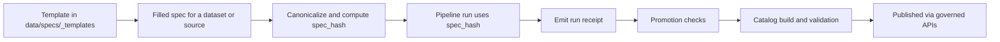

<!-- [KFM_META_BLOCK_V2]
doc_id: kfm://doc/4f6aaea8-12c6-4a92-9750-02f968a3b6f0
title: data/specs/_templates — Spec template library
type: standard
version: v1
status: draft
owners: TBD
created: 2026-03-02
updated: 2026-03-02
policy_label: public
related:
  - ../README.md
tags:
  - kfm
  - data
  - specs
  - templates
notes:
  - This directory contains copyable templates, not real dataset specs.
  - Keep templates aligned with the canonical KFM spec contracts.
[/KFM_META_BLOCK_V2] -->

# data/specs/_templates
Copyable, reviewable templates for **KFM data specs** (and adjacent “spec-like” artifacts such as run receipts).

 <!-- TODO: tighten to review/published when adopted -->
 <!-- TODO: align with repo policy taxonomy -->
 <!-- TODO: set real owning team -->


**Purpose:** Provide a governed “starting point” so new specs are consistent, canonicalizable, and safe (no secrets, no accidental release of sensitive locations).

---

## Navigation
- [What lives here](#what-lives-here)
- [What must *not* live here](#what-must-not-live-here)
- [How to use](#how-to-use)
- [Template contract](#template-contract)
- [Spec lifecycle diagram](#spec-lifecycle-diagram)
- [Adding or updating templates](#adding-or-updating-templates)
- [FAQ](#faq)

---

## What lives here

This directory is **templates only**. It should contain “starter” files for specs that will later be copied into a dataset/source folder and filled out.

Typical content patterns (not an exhaustive list):

```text
data/specs/_templates/
  README.md
  *.template.json        # preferred (canonicalizable)
  *.template.yml         # only if strictly canonicalizable by the repo tooling
  *.template.md          # doc/spec templates that embed MetaBlock v2
  snippets/              # optional: small reusable blocks (safe, no secrets)
```

### Template kinds (conceptual registry)

| Template kind | Typical format | Used for | Key property |
|---|---:|---|---|
| MetaBlock v2 | Markdown (HTML comment) | docs + spec-like docs | Stable `doc_id`, policy label, traceability |
| Dataset onboarding spec | JSON (preferred) | canonical input to `spec_hash` | Deterministic, canonicalizable structure |
| Run receipt (run_record) | JSON | emitted per run | auditability + reproducibility |

> NOTE: Filenames and final locations may vary by repo conventions. Keep the *structure* consistent even if the name differs.

[Back to top](#data-specs_templates)

---

## What must *not* live here

Do **not** commit:
- Real upstream credentials, API keys, tokens, cookies, or signed URLs
- Sensitive locations (exact coordinates or site-level detail) unless explicitly approved and policy-labeled for release
- Production endpoints that leak secrets via query parameters
- “One-off” dataset specs (those belong under the real dataset/spec location, not in `_templates/`)

[Back to top](#data-specs_templates)

---

## How to use

1) **Copy** a template into the appropriate real spec location (dataset/source-specific folder).
2) **Rename** it according to repo conventions (example naming shown below).
3) **Replace placeholders** (`<...>`, `TBD`, `example.invalid`, etc.).
4) **Validate** locally using the repo’s validators (often under `tools/` or CI).
5) **Commit** the spec change with a message that explains *why* the spec changed (expect the `spec_hash` to change when the canonical input changes).

Example copy flow (illustrative; adjust paths/names to match this repo):

```bash
# Example only — align with actual repo spec paths
mkdir -p data/specs/<dataset_slug>/

cp data/specs/_templates/dataset_onboarding_spec.v1.template.json \
   data/specs/<dataset_slug>/dataset_onboarding_spec.v1.json
```

### Secrets hygiene rule
If a spec needs authentication (API keys, signed URLs), the spec should reference a **secret handle** or **runtime configuration** mechanism — not embed the secret.

[Back to top](#data-specs_templates)

---

## Template contract

This folder exists to keep these invariants true:

### 1) Canonicalization and hashing
If a template feeds `spec_hash`, it must be:
- valid **JSON** (preferred), or
- a strict structured format that the tooling can **canonicalize deterministically**

### 2) Traceability and governance
Templates should strongly encourage inclusion of:
- ownership + contact
- license snapshot timing (when terms were retrieved)
- sensitivity intent and obligations
- validation schema + checks
- declared outputs (artifact types + paths)

### 3) Safe defaults
Templates should:
- use `example.invalid` (or equivalent) when demonstrating URLs
- avoid embedding credentials
- avoid including any sensitive location detail unless the template is explicitly for a restricted workflow

[Back to top](#data-specs_templates)

---

## Spec lifecycle diagram



[Back to top](#data-specs_templates)

---

## Adding or updating templates

### Definition of done (DoD)
- [ ] Template contains **no secrets**
- [ ] Template is **canonicalizable** (or explicitly marked as non-hash input)
- [ ] Template includes **placeholders** clearly (`<dataset_slug>`, `TBD`, etc.)
- [ ] Template has a short **“How to fill this out”** header or comments
- [ ] Template passes repo validation tooling (local or CI)
- [ ] README registry table updated (if you add a new template kind)

### Change discipline
- Prefer additive changes (new fields optional) over breaking changes.
- If you must change a canonical spec structure, consider bumping a **version field** in the template and keeping the old template for migration.

[Back to top](#data-specs_templates)

---

## FAQ

### Why prefer JSON templates?
JSON is easier to canonicalize deterministically across languages/toolchains, which reduces “spec_hash drift” and accidental diffs.

### Where do real specs go?
Not in `_templates/`. Real specs belong in the dataset/source-specific directory that CI expects for promotion and catalog building.

### Do templates include real endpoints?
No. Templates should use placeholders and avoid secrets. Replace with real values only in real specs, and keep any credentials out of repo.

[Back to top](#data-specs_templates)
