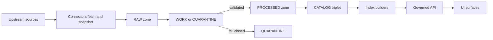

<!-- [KFM_META_BLOCK_V2]
doc_id: kfm://doc/830ca7cb-123b-4bec-97aa-bf2ccae3721d
title: Dataset Specs Directory
type: guide
version: v1
status: draft
owners: TODO
created: 2026-02-24
updated: 2026-02-24
policy_label: restricted
related:
  - kfm://doc/TODO
tags:
  - kfm
  - data
  - datasets
notes:
  - This README defines what belongs in data/specs/datasets and the contract for dataset onboarding specs.
[/KFM_META_BLOCK_V2] -->

<a id="top"></a>

# Dataset Specs
> Canonical dataset onboarding specs (the **input to `spec_hash`**) used to govern ingestion, validation, promotion, and publishing.


> [!NOTE]
> The badges above are placeholders until wired to repo CI/metadata.

## Quick navigation
- [Purpose](#purpose)
- [Where this fits](#where-this-fits)
- [Directory contents](#directory-contents)
- [Naming and identifiers](#naming-and-identifiers)
- [Dataset onboarding spec format](#dataset-onboarding-spec-format)
- [Promotion gates and Definition of Done](#promotion-gates-and-definition-of-done)
- [Change workflow](#change-workflow)
- [Security, licensing, and sensitivity](#security-licensing-and-sensitivity)
- [Appendix](#appendix)

---

## Purpose
This directory stores **dataset onboarding specs**: small, human-reviewable, machine-validated documents that:

- define the **source** and access method
- declare the intended **policy label** and sensitivity signals
- define **normalization mappings**
- declare **validation** schema + checks
- declare **expected outputs** and their deterministic paths
- serve as the canonical input for **dataset version identity** via `spec_hash`

**If it isn’t reviewable, hashable, and validate-able, it doesn’t belong here.**

[Back to top](#top)

---

## Where this fits
Dataset specs sit upstream of the **truth path** that moves data from acquisition to governed runtime surfaces.



**Key idea:** specs + promotion gates turn “governance intent” into **enforceable behavior** (promotion is blocked unless required artifacts exist and validate).  

### Zones at a glance
These terms describe the **data lifecycle zones** used by KFM. They help reviewers quickly answer: *“Where should this artifact live, and can it be promoted?”*

| Zone | What it contains | Important rules |
|---|---|---|
| **RAW** | Immutable acquisitions (original source payloads + manifests + checksums + license/terms snapshot) | Append-only; do not edit RAW—supersede with a new acquisition |
| **WORK** | Intermediate transforms (normalized representations, QA reports, candidate redactions, provisional entity resolution) | Deterministic transforms; outputs must be reproducible from inputs + spec |
| **QUARANTINE** | Anything that cannot be safely promoted (failed validation, unclear licensing, sensitivity concerns, upstream instability) | Fail closed; quarantined items are not promoted |
| **PROCESSED** | Publishable artifacts in approved formats (e.g., GeoParquet, PMTiles, COG) + checksums + derived runtime metadata | Every processed artifact must have digests; paths should be predictable |
| **CATALOG triplet** | DCAT + STAC + PROV (validated and cross-linked) | Catalogs are contract surfaces; cross-links must resolve |
| **PUBLISHED** | Governed runtime surfaces (API + UI) serving only promoted dataset versions | Serve only versions with processed artifacts, validated catalogs, run receipts, and policy labels |

[Back to top](#top)

---

## Directory contents

### Recommended shape
> This is a *directory documentation standard* view of what we expect here. If the repo uses a different layout, update this README to match reality.

```text
data/specs/datasets/
  README.md
  <dataset_slug>.spec.json          # Dataset onboarding spec (canonical input to spec_hash)
  <dataset_slug>.notes.md           # Optional: human context, caveats, limitations (NO secrets)
  _templates/
    dataset_onboarding_spec.v1.json # Optional: local copy of template to start from
```

### Acceptable inputs
✅ OK to commit here:
- Dataset onboarding specs as **JSON** (preferred) with stable key ordering / canonicalization expectations.
- Dataset notes describing limitations, caveats, provenance “gotchas”, and known risks.
- References to validation schemas that live under `contracts/schemas/` (do **not** copy schemas into this folder unless the repo standard says otherwise).

### Exclusions
🚫 Do **not** commit here:
- **RAW/WORK/PROCESSED** data artifacts (no CSV/GeoParquet/COG/PMTiles/etc.)
- Credentials, API keys, cookies, bearer tokens, signed URLs
- Any unredacted PII or sensitive-location coordinates
- Generated catalogs (DCAT/STAC/PROV) or run receipts (these are build artifacts, emitted per run)

> [!WARNING]
> Specs should never embed credentials. Use secret management / runtime auth instead.

[Back to top](#top)

---

## Naming and identifiers

### Dataset slug rules
Use `dataset_slug` values that are:
- lowercase
- words separated by underscore
- include upstream authority when helpful
- **do not** include date (date belongs in the dataset version)

### Identifier families
Use explicit, URI-like identifiers in catalogs/provenance and tooling, and avoid environment-specific hostnames in canonical IDs.

| Family | Example | Notes |
|---|---|---|
| Dataset | `kfm://dataset/<dataset_slug>` | Stable identity for a dataset family |
| Dataset version | `kfm://dataset/<dataset_slug>@<dataset_version_id>` | Immutable promoted version |
| Artifact | `kfm://artifact/sha256:<digest>` | Content-addressed identity |
| Run | `kfm://run/<timestamp>.<dataset_slug>.<suffix>` | A pipeline (or Focus Mode) run |
| Evidence | `kfm://evidence/<id>` | Evidence bundle references |
| Story | `kfm://story/<id>@<version>` | Versioned narrative assets |

[Back to top](#top)

---

## Dataset onboarding spec format
The dataset onboarding spec is the **canonical input** to `spec_hash`. It must be valid **JSON** (preferred) or another strict structured format that can be canonicalized.

### Minimum required top-level fields
Below is a **v1**-style shape based on the KFM onboarding spec template.

| Field | Type | Required | What it means |
|---|---|---:|---|
| `kfm_spec_version` | string | ✅ | Spec schema version (e.g., `"v1"`) |
| `dataset_slug` | string | ✅ | Stable dataset family slug |
| `title` | string | ✅ | Human-friendly dataset title |
| `upstream` | object | ✅ | Source authority + how we access it |
| `sensitivity` | object | ✅ | Intended policy label + risk signals |
| `normalization` | object | ✅ | Canonical field mapping + CRS/units |
| `validation` | object | ✅ | Schema + checks + thresholds |
| `outputs` | array | ✅ | Declared processed artifacts + paths |

### Minimal skeleton
```json
{
  "kfm_spec_version": "v1",
  "dataset_slug": "example_dataset",
  "title": "Example Dataset Title",
  "upstream": {
    "authority": "Upstream Publisher Name",
    "access_method": "bulk_csv",
    "endpoints": [
      {
        "name": "primary_endpoint",
        "url": "https://example.invalid/path/to/data",
        "parameters": { "example": "value" }
      }
    ],
    "cadence": "monthly",
    "terms_snapshot": {
      "license": "public_domain",
      "retrieved_at": "2026-02-24"
    }
  },
  "sensitivity": {
    "policy_label_intent": "public",
    "pii_risk": "low",
    "sensitive_location_risk": "low",
    "obligations": []
  },
  "normalization": {
    "canonical_fields": {
      "id": "upstream.ID",
      "geometry": "derived.from_latlon"
    },
    "units": {},
    "crs": "EPSG:4326"
  },
  "validation": {
    "schema": "contracts/schemas/example_dataset.schema.json",
    "checks": [
      { "name": "geometry_valid", "threshold": 1.0 },
      { "name": "required_fields_present", "threshold": 0.99 }
    ]
  },
  "outputs": [
    {
      "artifact_type": "geoparquet",
      "path": "data/processed/example_dataset/<dataset_version_id>/data.parquet"
    },
    {
      "artifact_type": "pmtiles",
      "path": "data/processed/example_dataset/<dataset_version_id>/data.pmtiles"
    }
  ]
}
```

> [!TIP]
> Use real URLs in implementation; `example.invalid` is a placeholder convention. Do not embed credentials.

[Back to top](#top)

---

## Promotion gates and Definition of Done
Promotion is the act of moving a dataset version into **processed + catalog/lineage**, and therefore into governed runtime surfaces. Promotion **must** be blocked unless required artifacts exist and validate.

### Minimum gates
Use this checklist when creating or updating a dataset spec.

- [ ] **Gate A: Identity and versioning**  
  - [ ] Dataset ID is stable and follows naming convention  
  - [ ] Dataset version ID is immutable and derived from a stable `spec_hash`

- [ ] **Gate B: Licensing and rights metadata**  
  - [ ] License is explicit and compatible with intended use  
  - [ ] Rights holder + attribution requirements are captured  
  - [ ] If license is unclear → keep in QUARANTINE (fail closed)

- [ ] **Gate C: Sensitivity classification and redaction plan**  
  - [ ] `policy_label` is assigned (public, restricted, etc.)  
  - [ ] For sensitive-location / restricted data, a redaction/generalization plan exists and is recorded in provenance

- [ ] **Gate D: Catalog triplet validation**  
  - [ ] DCAT record exists and validates under the KFM profile  
  - [ ] STAC collection/items exist (if applicable) and validate under the KFM profile  
  - [ ] PROV bundle exists and validates under the KFM profile  
  - [ ] Cross-links between DCAT, STAC, PROV are present and resolvable

- [ ] **Gate E: Run receipt and checksums**  
  - [ ] A run receipt exists for each producing run  
  - [ ] Inputs/outputs enumerated with checksums  
  - [ ] Environment recorded (container image digest, parameters)

- [ ] **Gate F: Policy tests and contract tests**  
  - [ ] OPA policy tests pass (fixtures-driven)  
  - [ ] Evidence resolver can resolve at least one EvidenceRef in CI  
  - [ ] API contracts and schemas validate

- [ ] **Gate G: Recommended production posture**  
  - [ ] SBOM + build provenance for pipeline images and API/UI artifacts  
  - [ ] Performance smoke checks (e.g., tile rendering, evidence resolution latency)  
  - [ ] Accessibility smoke checks for UI evidence surfaces

### Definition of Done for a dataset integration ticket
A dataset integration is “done” when:

- RAW acquisition is reproducible and documented
- WORK transforms are deterministic (same inputs → same outputs; same spec → same hash)
- PROCESSED artifacts exist in approved formats and are digest-addressed
- Catalog triplet validates and is cross-linked
- EvidenceRefs resolve and render in the UI evidence surfaces
- Policy label is assigned with documented review
- A changelog entry explains what changed and why

[Back to top](#top)

---

## Change workflow
A practical PR-based workflow:

1. Contributor opens a PR adding:
   - dataset onboarding spec (this folder)
   - source registry entry and pipeline spec (wherever the repo keeps them)
   - small fixture sample + expected outputs (wherever the repo keeps fixtures)
2. CI runs:
   - schema validation
   - policy tests
   - `spec_hash` stability tests
   - link checks for catalogs
3. Steward review:
   - licensing and sensitivity
   - approve policy label
4. Operator merges and triggers pipeline run in a controlled environment
5. Outputs written to processed + catalogs
6. Release manifest created and tagged

> [!NOTE]
> This workflow is intentionally “social + technical”, not ad hoc.

[Back to top](#top)

---

## Security, licensing, and sensitivity

### Default safety stance
- Default deny for sensitive-location and restricted datasets.
- Do not embed precise coordinates in Story Nodes or assistant outputs unless policy explicitly allows.
- Treat redaction/generalization as a first-class transform recorded in provenance.

### Licensing is policy input
- Online availability does **not** imply permission to reuse.
- Promotion requires license + rights holder metadata for each distribution.
- “Metadata-only reference” is acceptable when rights do not allow mirroring.

### Catalog triplet responsibilities
Catalogs are treated as **contract surfaces** between pipelines and runtime:
- DCAT answers dataset-level questions (publisher, license, distributions)
- STAC describes spatiotemporal assets (collections, items, assets)
- PROV records lineage (activities, agents, entities)

[Back to top](#top)

---

## Appendix

<details>
  <summary><strong>Template pointers</strong></summary>

- If you need the v1 dataset onboarding spec template, see the KFM “Dataset onboarding spec template (spec_hash input)” appendix in the KFM governance/design guide.
- If you need run receipt or promotion manifest shapes, see the KFM “Run receipt” and “Promotion Contract” templates.

</details>

<details>
  <summary><strong>Repository reality checks</strong></summary>

Before relying on this README, verify the repo has (or intentionally omits) these components:

- `contracts/schemas/` for JSON schemas referenced by `validation.schema`
- `data/raw`, `data/work`, `data/processed`, `data/catalog` zones
- CI jobs that validate schemas + policy fixtures and fail closed on promotion gates

If the current repo differs, update this README and/or add an ADR documenting the divergence.

</details>
