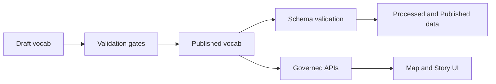

<!-- [KFM_META_BLOCK_V2]
doc_id: kfm://doc/6d7c9f7a-4e7f-4d3f-b0d7-bd331a7a2f1c
title: data/specs/vocab — Controlled vocabularies
type: standard
version: v1
status: draft
owners: TODO(kfm): assign vocab steward(s)
created: 2026-02-24
updated: 2026-02-24
policy_label: restricted
related:
  - TODO(kfm): link to data/specs/README.md (if exists)
  - TODO(kfm): link to data/specs/schema (if exists)
tags: [kfm, vocab, specs]
notes:
  - This README is intentionally “fail-closed”: placeholders are marked TODO until confirmed in-repo.
[/KFM_META_BLOCK_V2] -->

# `data/specs/vocab` — controlled vocabularies  
One place for canonical **terms/codes/enums** used by KFM datasets, schemas, APIs, and Story UI.


> **Why this exists**: if two pipelines call the same thing by different names, you don’t have data—you have vibes.  
> Vocabularies keep joins stable, validation deterministic, and UI filters sane.

**Quick nav**
- [1. What belongs here](#1-what-belongs-here)
- [2. Directory layout](#2-directory-layout)
- [3. Vocabulary registry](#3-vocabulary-registry)
- [4. Term model (minimum fields)](#4-term-model-minimum-fields)
- [5. Governance & promotion gates](#5-governance--promotion-gates)
- [6. Referencing vocabs from schemas/APIs](#6-referencing-vocabs-from-schemasapis)
- [7. Change workflow](#7-change-workflow)
- [8. Safety & sensitivity](#8-safety--sensitivity)
- [Appendix: templates](#appendix-templates)

---

## 1. What belongs here

### ✅ Acceptable inputs
- **Canonical term lists** used across the system (enums, controlled values, code sets)
- **Mappings** (aliases → canonical terms), including deprecation/replacement lists
- **Profiles** (e.g., “UI filterable”, “analytics-safe”, “public export allowed”)
- **Metadata** needed for governance: provenance, license/source, stewardship, sensitivity tags
- **Validation artifacts** (schema for vocab format, test fixtures) *if the repo uses them*

### ❌ Exclusions (do not put here)
- Raw datasets (that’s `data/raw` or equivalent)
- Pipeline code or API code (belongs in service modules)
- Anything containing PII/secrets
- Site-level sensitive information (e.g., precise locations of vulnerable sites) unless explicitly governed and approved

> **Directory documentation standard** (KFM): this README should stay accurate about where this folder fits, what it accepts, and what it excludes.

[Back to top](#dataspecsvocab--controlled-vocabularies)

---

## 2. Directory layout

> **NOTE:** This layout is **Proposed** until confirmed against the repo tree. Update to match reality.

```text
data/specs/vocab/
  README.md
  _registry/
    vocabs.csv              # (Proposed) master list of vocab sets
  draft/
    <vocab_name>/
      v0/                   # (Proposed) draft-only versions
        vocab.yaml
        CHANGELOG.md
  published/
    <vocab_name>/
      v1/
        vocab.yaml
        CHANGELOG.md
      v2/
        ...
  _meta/
    vocab.schema.json       # (Optional) JSON Schema for vocab files
    validation.md           # (Optional) how validation runs in CI
```

[Back to top](#dataspecsvocab--controlled-vocabularies)

---

## 3. Vocabulary registry

Maintain a **single “what exists” index** so downstream components can discover vocabularies without guessing paths.

### Registry table (fill with real entries)
| vocab_id | title | owner | status | latest_version | policy_label | notes |
|---|---|---|---|---|---|---|
| `TODO` | `TODO` | `TODO` | draft/published | `v?` | public/restricted |  |

**Common patterns**
- `vocab_id` is stable and never recycled.
- Versions are immutable once **published**.
- Prefer “additive” changes for minor versions; breaking changes require a new major version.

[Back to top](#dataspecsvocab--controlled-vocabularies)

---

## 4. Term model (minimum fields)

A controlled vocabulary is only as useful as its metadata. At minimum, each term SHOULD carry:

| field | required | meaning |
|---|---:|---|
| `id` | ✅ | stable identifier (machine-safe; never reused) |
| `label` | ✅ | human name |
| `description` | ✅ | what it means / when to use it |
| `status` | ✅ | `active` \| `deprecated` \| `reserved` |
| `replaced_by` | ⛔ (required if deprecated) | points to successor term id |
| `source` | ✅ | provenance (standard, org decision, working group) |
| `created` | ✅ | `YYYY-MM-DD` |
| `updated` | ✅ | `YYYY-MM-DD` |

### Example (YAML)
```yaml
vocab_id: kfm.example
version: v1
terms:
  - id: example.alpha
    label: Alpha
    description: First example term.
    status: active
    source: "KFM decision: TODO(link)"
    created: 2026-02-24
    updated: 2026-02-24
```

[Back to top](#dataspecsvocab--controlled-vocabularies)

---

## 5. Governance & promotion gates

Published vocabularies are **API contracts**. Treat changes like you would treat schema changes.

### Promotion gates (Draft → Published)
- [ ] **Identity**: `vocab_id` and version are set and unique
- [ ] **Schema validity**: file format validates (YAML/JSON/CSV as used)
- [ ] **Uniqueness**: term IDs unique; no duplicate labels where it causes ambiguity
- [ ] **Back-compat**: no breaking removals in minor versions (unless explicitly approved)
- [ ] **Deprecations are safe**: `deprecated` terms include `replaced_by` (or a documented reason)
- [ ] **Provenance**: source and license/standard references recorded
- [ ] **Policy review**: `policy_label` and sensitivity classification confirmed
- [ ] **Evidence trail**: PR links, decision record (ADR/RFC) linked in CHANGELOG
- [ ] **CI checks pass**: validation + tests (see TODO below)

> TODO(kfm): link to the repo’s actual CI gate definition that enforces these.

[Back to top](#dataspecsvocab--controlled-vocabularies)

---

## 6. Referencing vocabs from schemas/APIs

### Recommended pattern (Proposed)
- Schemas reference **`vocab_id@version`** or `vocab_id` + `version` fields
- Data validation checks values against the referenced vocab version
- APIs return:
  - the **code** (`id`) for storage/joins
  - and optionally a resolved **label** for convenience

### Example (JSON Schema style)
```json
{
  "type": "object",
  "properties": {
    "zone": {
      "type": "string",
      "description": "Must match vocab kfm.zone@v1",
      "x-kfm-vocab": { "vocab_id": "kfm.zone", "version": "v1" }
    }
  },
  "required": ["zone"]
}
```

> NOTE: `x-kfm-vocab` is a **proposed extension**. If the repo already defines a contract extension, use that instead.

[Back to top](#dataspecsvocab--controlled-vocabularies)

---

## 7. Change workflow

### 7.1 Add a new vocabulary
1. Create a draft at `draft/<vocab_name>/v0/`
2. Add initial `vocab.yaml` + `CHANGELOG.md`
3. Register it in `_registry/vocabs.csv` (or whatever the repo uses)
4. Open PR with:
   - why it’s needed
   - who owns it
   - what components will consume it

### 7.2 Update an existing vocabulary
**Rule of thumb**:
- **Add a term** → minor bump (e.g., `v1` → `v1.1` or `v2` depending on your scheme)
- **Rename or meaning change** → deprecate old term + add new term
- **Remove a term** → major bump (and only if you truly must)

### 7.3 Changelog discipline
Each published version MUST have:
- summary of changes
- migration notes
- links to decision artifacts (ADR/RFC) and PR(s)

[Back to top](#dataspecsvocab--controlled-vocabularies)

---

## 8. Safety & sensitivity

⚠️ **Default-deny**: if you’re unsure whether a vocabulary encodes sensitive targeting information (e.g., culturally restricted categories, vulnerable site types, sensitive operations), treat it as **restricted** and escalate for governance review.

Guidelines:
- Avoid terms that could enable harm when combined with location/time.
- If a vocab is community-governed (e.g., Indigenous knowledge), document:
  - access rules
  - redaction requirements
  - who can approve changes

[Back to top](#dataspecsvocab--controlled-vocabularies)

---

## Diagram — where vocab fits in the trust membrane



---

## Appendix: templates

### Vocabulary changelog template
```md
# Changelog — <vocab_id>

## v1 (YYYY-MM-DD)
- Added: ...
- Deprecated: ... (replaced_by: ...)
- Notes: ...
- Evidence: PR #..., ADR ...
```

### Term deprecation template
```yaml
- id: old.term
  label: Old Term
  description: Deprecated; use new.term instead.
  status: deprecated
  replaced_by: new.term
  source: "KFM decision: TODO(link)"
  created: YYYY-MM-DD
  updated: YYYY-MM-DD
```

[Back to top](#dataspecsvocab--controlled-vocabularies)
