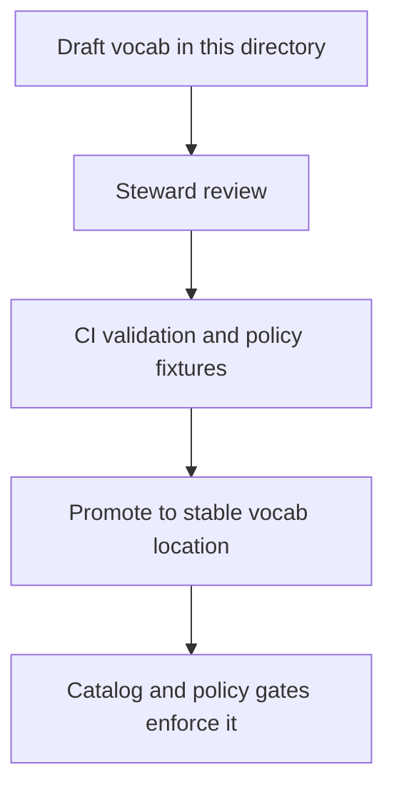

<!-- [KFM_META_BLOCK_V2]
doc_id: kfm://doc/41cc7203-fe8c-4686-8a84-6680874a3bbc
title: Draft Controlled Vocabularies
type: standard
version: v1
status: draft
owners: TBD (Data Stewardship / Governance)
created: 2026-03-02
updated: 2026-03-02
policy_label: public
related:
  - (TODO) kfm://doc/<governance-guide-vNext>
  - (TODO) ../../../../policy/README.md
  - (TODO) ../../../../contracts/ (catalog + evidence ref contracts)
tags: [kfm, vocab, controlled-vocabulary, draft]
notes:
  - Draft vocabularies live here until validated + promoted.
  - Do not introduce breaking changes to published vocabularies.
[/KFM_META_BLOCK_V2] -->

# KFM Draft Vocabularies
Controlled terms under active development (pre-promotion).


<!-- TODO: replace/augment badges with real CI checks once paths are confirmed:

-->

**Purpose:** Provide a safe place to draft and review **controlled vocabularies** before they become promotion gates for catalogs, policy, and evidence resolution.

---

## Quick navigation
- [What belongs here](#what-belongs-here)
- [How this fits in KFM](#how-this-fits-in-kfm)
- [Vocabulary registry](#vocabulary-registry)
- [Starter lists](#starter-lists)
- [Authoring rules](#authoring-rules)
- [Draft → promoted workflow](#draft--promoted-workflow)
- [Directory tree](#directory-tree)
- [Minimum verification steps](#minimum-verification-steps)

---

## What belongs here

### ✅ Acceptable inputs
Draft vocabulary artifacts that define **enumerations / controlled terms** used by:
- **Catalog metadata** (e.g., `dcat:theme` and KFM extensions like `kfm:policy_label`)
- **Policy-as-code** decisions and obligations (labels that gate access)
- **Evidence resolution** (types of EvidenceRefs / citations)
- **Lifecycle & provenance metadata** (zones like `raw`, `work`, etc.)

### ❌ Exclusions (do not put these here)
- Dataset specs, dataset registry entries, pipeline configs, or QA reports
- Any secret material, credentials, tokens, or private keys
- Any restricted location coordinates or sensitive site details
- Ad-hoc “tags” that are not governed/validated (use a draft vocab instead)

> NOTE: Draft vocabularies are allowed to be incomplete. Published vocabularies are not.

---

## How this fits in KFM

KFM treats catalogs and provenance as **contract surfaces**, and some catalog fields require **controlled vocabulary values**. In particular, `dcat:theme` is explicitly expected to be a controlled vocabulary, and KFM also attaches policy labels to datasets/versions as part of the contract surface.  
This means vocabularies are not “nice metadata”—they are **inputs to validation and policy gates**.

### Where these vocabularies are used
- **Catalog triplet**: DCAT/STAC/PROV validation expects consistent fields and values.
- **Promotion**: “fail-closed” gating relies on stable identifiers, licensing, sensitivity labels, and strict validation.
- **Evidence**: citations are expected to resolve as typed references (not just pasted URLs).

---

## Vocabulary registry

This directory is organized as “one vocabulary per file” (recommended). Each vocabulary file SHOULD:
- declare a stable `vocab_id`
- define terms as a stable `term_id` + label + description
- define a version and change policy (additive vs breaking)

### Proposed minimal vocabulary schema (tool-agnostic)
```yaml
# vocab_id: policy_label
# version: 0.1.0
# status: draft
# owners: [steward@…, policy@…]
# description: Access + sensitivity labels used in catalogs and policy.
terms:
  - id: public
    label: Public
    description: Safe for public display and export.
    status: active
  - id: restricted
    label: Restricted
    description: Access limited; default deny for public.
    status: active
```

> PROPOSED: The repo may already standardize on JSON Schema / YAML conventions elsewhere—align to that once confirmed.

---

## Starter lists

These starter lists are “known required” controlled vocabularies and must be **versioned and maintained**.

### `policy_label` (starter)
- `public`
- `public_generalized`
- `restricted`
- `restricted_sensitive_location`
- `internal`
- `embargoed`
- `quarantine`

### `artifact.zone` (starter)
- `raw`
- `work`
- `processed`
- `catalog`
- `published`

### `citation.kind` (starter)
- `dcat`
- `stac`
- `prov`
- `doc`
- `graph`
- `url` *(discouraged)*

---

## Authoring rules

### Hard rules (must)
- **Additive by default:** treat new terms as append-only; prefer “deprecate” over “rename/remove”.
- **Stable IDs:** term IDs must be stable, lowercase, and machine-friendly (`snake_case` if needed).
- **Human meaning:** each term needs a plain-language description suitable for UI display.
- **No silent synonyms:** if two terms are near-duplicates, resolve via steward review.

### Safety rules (must)
- If a term impacts access control, redaction, or sensitive-location handling, it MUST be reviewed by a steward before promotion.
- Do not create “cute” labels; these values become API-visible and policy-relevant.

### Recommended conventions
- **Term status:** `active | deprecated | experimental`
- **Deprecation policy:** keep deprecated terms for at least one full release cycle; document replacement guidance.
- **Change log:** include a short change log per vocab file (or a sibling `CHANGELOG.md`).

---

## Draft → promoted workflow



### Definition of Done for promoting a vocabulary
- [ ] Terms have clear descriptions + UI-safe labels
- [ ] No breaking changes without an approved migration plan
- [ ] Validation exists (schema/lint) and runs in CI
- [ ] Any access-control related vocab has policy fixtures/tests updated
- [ ] Consumers updated (catalog builders, validators, UI enums) with no drift

> TIP: Treat promotion as a reversible change: small PRs, clear diffs, and a rollback plan.

---

## Directory tree

> NOTE: This tree is intentionally conservative. Add files as they are created.

```text
data/specs/vocab/
  draft/
    README.md                # this document
    (add vocab files here)   # e.g., policy_label.yaml, citation.kind.yaml, artifact.zone.yaml
```

---

## Minimum verification steps

These checks convert “unknown” repo assumptions into confirmed reality:

1. **Confirm the canonical vocabulary format** used in the repo (YAML/JSON/TS constants).
2. **Locate validators/lint hooks** (if any) for vocab drift and identify where CI runs them.
3. **Confirm the promotion destination** for vocabularies (e.g., `data/specs/vocab/published/` or similar).
4. **Confirm consumer touchpoints**:
   - catalog builders (DCAT/STAC/PROV)
   - policy pack fixtures/tests
   - evidence resolver / citation typing
   - UI enums / filters

---

## Appendix: Why controlled vocabularies matter (KFM-specific)

- Catalog fields like `dcat:theme` are expected to use controlled vocabulary values.
- Policy labels gate access and can require “generalized public” representations.
- Citation kinds support evidence resolution without guessing or relying on raw URLs.

[Back to top](#kfm-draft-vocabularies)
